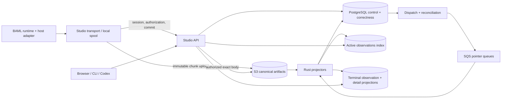
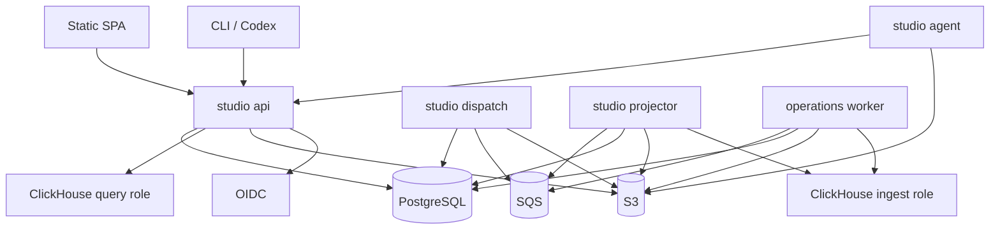

# BAML Studio: Product, Semantic, and System Design

**Status:** Canonical implementation design  
**Date:** 2026-07-27  
**Audience:** Engineers implementing, reviewing, operating, or inheriting BAML Studio  
**Supersedes:** `studio-stack-design.md`, `studio-stack-design-reconciliation.md`, and `studio-rebuild-research-log.md` as implementation authority  
**Evidence retained in:** the superseded documents, repository source, and the golden artifact corpus

## Contents

- [How to use this document](#0-how-to-use-this-document)
- [Part I — The product from the user's perspective](#part-i--the-product-from-the-users-perspective)
- [Part II — Product concepts and semantic contracts](#part-ii--product-concepts-and-semantic-contracts)
- [Part III — Runtime, capture, and local operation](#part-iii--runtime-capture-and-local-operation)
- [Part IV — Canonical evidence and hosted synchronization](#part-iv--canonical-evidence-and-hosted-synchronization)
- [Part V — Analytical and query design](#part-v--analytical-and-query-design)
- [Part VI — API, storage, and browser implementation](#part-vi--api-storage-and-browser-implementation)
- [Part VII — Security, reliability, and operations](#part-vii--security-reliability-and-operations)
- [Part VIII — Deployment and engineering workflow](#part-viii--deployment-and-engineering-workflow)
- [Part IX — Validation and delivery](#part-ix--validation-and-delivery)
- [Part X — Decision register and questions for alignment](#part-x--decision-register-and-questions-for-alignment)
- [Appendices](#appendices)

---

## 0. How to use this document

This is the single implementation authority for the BAML Studio rebuild.

The older files remain useful as research and decision history, but an engineer must not need to reconcile them before writing code. When this document disagrees with an older file, this document wins.

The design is organized in the order a user experiences the product:

1. what Studio lets a user do;
2. the questions Studio can answer;
3. the product concepts behind those answers;
4. the local CLI and browser behavior;
5. the runtime and artifact contracts;
6. the hosted services and storage systems;
7. reliability, security, operations, and implementation order.

### 0.1 Decision labels

This document uses four labels:

- **Locked** — implementation may proceed without another architecture decision.
- **Recommended default** — implementation should use this choice unless the named owner overturns it before the stated gate.
- **Benchmark-owned** — the semantic contract is fixed, but the physical implementation is selected by a named benchmark.
- **Deferred** — the capability is not required for the current phase. No current implementation may quietly depend on a particular future choice.

A deferred decision is still answered at the architecture level: the current system boundary is defined so either future option remains possible.

### 0.2 Readiness by phase

| Phase | Scope | Readiness |
|---|---|---|
| **P-1** | Query existing `.bamlprof`, `.bamlvalue`, history directories, and blobs from a CLI with no cloud | **Implementation-ready** |
| **P0-A** | Local Studio agent, observation explorer, run debugger, values, source, profiles, and live updates | **Implementation-ready except for the structural-exhaustion policy in section 8.8** |
| **P0-B** | Provider attempts, tools, agents, usage, and other facts introduced by `aaron/custom-llm-providers-v3` | **Adapter boundary is ready; exact schemas follow the landing runtime contract** |
| **P0-C** | Hosted upload, durable commitment, projection, observation search, and fleet analytics | **Implementation-ready at the service boundary; several product-policy values remain explicitly deferred** |
| **P1** | Historical re-execution, test generation, arbitrary artifact scans, and advanced export | **Semantics defined; detailed product workflows follow P0 evidence** |
| **Enterprise** | Customer-managed dependencies, packaging, identity choice, retention defaults, and higher durability tiers | **Architecture retained; product decisions intentionally deferred in section 36** |

No phase waits on a later one. In particular, P-1 does not require hosted schemas, ClickHouse, authentication, or changes to LLM tracing.

---

# Part I — The product from the user's perspective

## 1. What BAML Studio is

BAML Studio is the place where a developer can inspect what a BAML program did, understand why it did it, compare behavior across executions, and turn retained evidence into debugging or testing workflows.

It is one product delivered in three forms:

1. **Local CLI and agent** — reads artifacts on the developer's machine and serves a local browser UI.
2. **Hosted Studio** — receives exact artifacts, indexes them, and supports team- and fleet-level analysis.
3. **Offline operations tool** — reconstructs, repairs, reindexes, exports, and validates retained artifacts without depending on the hosted service.

All three use the same Rust decoders, run reconstruction, value semantics, query language, coverage rules, and response types. They are not separate interpretations of BAML telemetry.

## 2. The user journey

Studio uses **observation-centered discovery with run-centered debugging**.

An **observation** is one operation a user may want to find or compare: for example a BAML call, a provider attempt, a tool invocation, or the root operation for a run. A **run** is the complete execution context that explains how observations relate to one another.

The normal user journey is:

```text
recent operations
-> filter or ask a question
-> select an operation
-> open the containing run
-> inspect calls, threads, timing, values, logs, source, and coverage
-> compare, reconstruct, rerun, or create a test when appropriate
```

This means the default list is not restricted to run roots. A failed provider attempt or slow tool call can be the entry point. Once selected, the debugger shows the complete BAML run rather than presenting the operation as an isolated generic span.

### 2.1 Core workflows

#### Find what went wrong

A user can:

- list recent failed or incomplete observations;
- filter by function, operation kind, provider, model, environment, release, tag, or time;
- open one observation and see its parent, children, containing run, and exact source location;
- inspect the error, typed value, logs, provider metadata, and capture status that actually exist;
- distinguish an application failure from missing telemetry, delayed projection, unsupported decoding, or redaction.

#### Understand a slow execution

A user can:

- sort operations by duration;
- open a run timeline or flame/profile view;
- inspect parallel BEX threads and spawn relationships;
- compare inclusive and self time where the runtime emits enough evidence;
- see provider attempt timing, tool timing, and resource operations when those facts were emitted;
- avoid false claims about CPU time, wait time, or allocation when the runtime did not record those facts.

#### Inspect data without loading everything

A user can:

- see type, size, availability, and bounded previews for inputs, outputs, errors, and captures;
- request one exact retained value on demand;
- search top-level summaries and explicitly indexed paths;
- run a deferred scan over retained artifacts for a path that was not indexed;
- see whether an answer was complete, partial, redacted, expired, unsupported, or unknown.

#### Compare behavior

A user can:

- compare two observations or two runs;
- compare functions, providers, models, releases, environments, or program snapshots over a time range;
- identify latency, failure-rate, token, cost, or output-shape changes;
- inspect the individual evidence behind an aggregate.

#### Work locally or with an agent

A user can:

- point the CLI at an individual `.bamlprof`, `.bamlvalue`, blob directory, or `.baml/history` directory;
- receive stable JSON or JSONL output suitable for scripts;
- ask a local Codex agent a natural-language question;
- let that agent inspect Studio's capabilities, construct a typed semantic query, invoke the CLI, evaluate coverage, and fetch selected run details;
- receive a narrative answer from Codex while Studio remains the deterministic evidence and query layer.

#### Reuse history

A user can perform five distinct actions that older documents called “replay”:

1. **Reconstruct** — decode the original artifacts again into the semantic run model.
2. **Reindex** — rebuild local or ClickHouse projections from canonical artifacts.
3. **Reopen** — inspect a retained historical run without executing it.
4. **Rerun** — execute the historical program again with selected historical inputs and currentbaml/tracing-and-profiling/2/history-canonicalization.md or historical execution configuration.
5. **Create a test** — turn selected historical inputs, outputs, errors, and expectations into a reviewable regression fixture.

These are separate commands and audit events. “Replay” is an umbrella product family, not one overloaded API verb.

## 3. Questions Studio can answer

The following examples define the product more clearly than a table list of storage engines.

| User question | Required evidence | Normal path | What Studio must say when evidence is unavailable |
|---|---|---|---|
| What failed in the last hour? | terminal structural outcomes | observation search | which runs were not structurally complete or not yet projected |
| Why did this run fail? | run graph, error, source, values/logs when captured | run debugger | exact missing, omitted, redacted, lost, corrupt, or unsupported fields |
| Which function became slower after a deployment? | function identity, program/deployment dimensions, timing | bounded aggregate query, then drill-down | unprojected or incomparable cohorts |
| Which provider attempt timed out before the successful retry? | provider-attempt events from the runtime | observation search inside one run | “attempt facts were not emitted by this runtime version,” not an inferred answer |
| How much did this agent run cost? | usage for every attempt/turn | aggregate emitted usage facts | provider-omitted usage and untraced attempts remain unknown |
| Which tool calls were blocked or modified by a hook? | typed tool and hook-decision events | run event stream | “hook decision facts unavailable” when not emitted |
| Show outputs whose top-level enum variant is `Rejected` | output summary/schema | indexed semantic query | coverage by schema/capture/index state |
| Find values where `request.customer.email` ends in `.edu` | exact or indexed nested value path | interactive if indexed; deferred scan otherwise | values omitted, redacted, expired, lost, or not scanned |
| Show all work associated with application user `123` or session `abc` | explicit application context or reserved tags | observation search | absent context is different from a user with no activity |
| Open the exact value for this call | retained `.bamlvalue`/blob | authorized point read | availability reason and retention state |
| Reproduce this old result | program snapshot, input, runtime/config/provider requirements | rerun workflow | list every missing prerequisite before execution |
| Turn this production failure into a test | captured input plus selected expected behavior | fixture-generation workflow | require redaction review and identify uncaptured dependencies |
| How much CPU did each function use? | CPU-sampling or scheduler facts | unavailable today | “fact not emitted” |
| How long was the call waiting rather than executing? | explicit wait/scheduler events | unavailable today | “fact not emitted” |

Studio never converts “no matching indexed row” into “definitely no matching execution” unless coverage proves the eligible evidence was evaluated.

## 4. Product priority

### 4.1 P-1: artifact CLI before the rest of Studio

The first deliverable is a supported CLI that can query current BAML artifacts directly.

P-1 must work with:

- one `.bamlprof` file;
- one `.bamlvalue` file;
- a set of matching files and blobs;
- a native `.baml/history` directory;
- a WASM-exported artifact set when the existing decoder can read it;
- torn final records and incomplete runs;
- old artifacts that lack future schema or sequence fields.

P-1 must not require:

- a hosted account;
- a Studio server;
- PostgreSQL, S3, SQS, or ClickHouse;
- a new LLM-specific tracing format;
- a complete program source tree;
- modification of the artifacts being inspected.

### 4.2 P0 capabilities

P0 includes:

- watch an active run update;
- open a completed, failed, cancelled, abandoned, or incomplete run;
- inspect call tree, BEX threads, spawn relationships, timeline, and flame/profile views;
- inspect inputs, outputs, typed errors, logs, and exact values when captured;
- inspect provider attempts, retries, usage, timing, raw request/response or provider metadata, tools, agent events, and resource actions **when the runtime emits those facts**;
- jump from a call to its BAML source and the schema information available for that call;
- understand missing, omitted, redacted, lost, corrupt, unsupported, delayed, and expired evidence;
- filter observations by supported function, status, snapshot, environment, release, user/session context, provider, model, and tags;
- view latency, failure, token, and cost trends from emitted facts;
- compare two runs or cohorts;
- reconstruct and reindex retained evidence.

P0 does not authorize Studio to manufacture facts that `baml_language` does not emit. In particular, Studio does not scrape provider HTTP traffic, infer hidden retries, or create a second LLM-event taxonomy beside the language runtime.

### 4.3 P1 and later

P1 includes:

- arbitrary retained-value scans;
- historical rerun with explicit reproducibility prerequisites;
- test generation with review and redaction;
- richer exports;
- selected nested-path indexing policies;
- advanced cohort and compatibility queries.

Annotations, replies, public sharing, human scoring, prompt management, and a general evaluation platform are **not part of the current core design**. They may be added later as ordinary user-authored control-plane data. The P0 observation path does not depend on them.

### 4.4 Non-goals and hard boundaries

P0 is not:

- a port of the deprecated Engine Studio LLM-event model;
- a generic APM/OTel backend that flattens BAML semantics into spans;
- a promise to infer CPU, wait, allocation, provider attempts, or schemas the runtime did not emit;
- arbitrary raw SQL access to multitenant physical databases;
- indexing every nested byte of every captured value;
- a cloud requirement for local debugging;
- a Kubernetes or generic multi-cloud control plane;
- exactly-once queue delivery;
- ClickHouse, Parquet, OTLP, or SQLite as canonical evidence;
- a collaboration, prompt-management, billing, or evaluation suite.

Adapters and exports may interoperate with OTel/Parquet and future deployment targets, but they cannot replace the artifact and semantic contracts.

---

# Part II — Product concepts and semantic contracts

## 5. Concepts users and implementers share

### 5.1 Artifact

An artifact is retained evidence emitted by or derived from a BAML execution.

Canonical artifacts include:

- `.bamlprof` structural records;
- `.bamlvalue` value, log, lifecycle, and loss records;
- content-addressed blobs;
- source and schema snapshots when present;
- explicit run/root attachments;
- source and run completion manifests introduced by hosted synchronization;
- service-authenticated commit receipts introduced by hosted synchronization.

A ClickHouse row, SQLite row, Parquet export, or browser snapshot is a projection, not canonical evidence.

### 5.2 Event

An event is one immutable fact emitted by the runtime or a versioned adapter. Examples include call start/end, thread start/end, usage update, tool-call lifecycle transition, provider change, or run completion.

Events are not necessarily the default rows users browse. Several events may describe one operation.

### 5.3 Observation

An observation is one user-facing operation assembled from emitted facts.

Every observation has:

- a stable identity;
- a kind and schema version;
- a containing run when known;
- parent/root correlation when emitted or causally derivable;
- start and optional end;
- state and outcome;
- function/provider/tool/resource identity as applicable;
- available value and metadata references;
- evidence and coverage state;
- artifact/projection provenance.

Initial observation kinds are capability-versioned rather than permanently hard-coded in this document:

| Kind | Availability | Meaning |
|---|---|---|
| `run` | current artifacts | root user-visible execution when a root attachment exists |
| `baml_call` | current artifacts | one language/runtime call in the BEX graph |
| `model_attempt` | after the provider/runner contract lands | one provider attempt, including failed attempts |
| `tool_invocation` | after typed tool events land | one proposed/started/finished tool operation |
| `resource_operation` | after resource events land | poll, resume, session turn, background job action, or similar resource lifecycle operation |

Typed agent events such as text deltas, provider changes, roster changes, usage updates, hook decisions, and final outcome remain event-stream facts. They become separate observations only when they have a durable identity, parentage, terminal condition, and useful discovery semantics.

The API advertises supported kinds and fields through `/v1/capabilities`. A newer runtime may emit a kind that an older Studio preserves but cannot yet project; coverage reports `unsupported_observation_kind` rather than dropping it.

### 5.4 Run

A run is the semantic debugging unit around a root BAML execution.

It contains:

- root attachment and BAML `BoundaryId` when one exists;
- calls and logical threads;
- explicit parent and spawn edges;
- values, errors, logs, and loss records;
- typed provider/tool/agent/resource facts when emitted;
- source and schema references;
- independent execution, completeness, integrity, projection, and retention states.

A run is not defined by timestamps or by grouping everything that happened near the same time.

#### Cross-process boundary — recommended default

For v1, one run is one runtime-owned causal graph rooted in one process/engine graph. When an application crosses a process or service boundary, Studio represents the result as **related runs** connected by an explicit correlation/parent link. It does not merge independent clocks and artifact streams into one supposedly exact graph.

This supports common distributed applications without delaying P0. A future distributed-run layer may present related runs together after the runtime defines explicit cross-process propagation and parentage.

### 5.5 Program snapshot

A program snapshot identifies the BAML source and declared schema that explain an observation.

It is needed for user-visible tasks:

- open the source that was actually in effect;
- compare behavior before and after a code change;
- avoid mixing incompatible type definitions in one query;
- determine whether a historical rerun can reproduce the old execution;
- generate a test against the correct declaration.

The canonical identity is a content digest over the normalized program/source/schema inputs defined by the compiler contract. Deployment name, Git commit, application build, and release label are separate optional dimensions. Byte-identical BAML snapshots may therefore appear in multiple deployments.

This choice is a **recommended default**. Section 21 asks one product question about whether identical BAML content in different application builds should be grouped by default.

### 5.6 Effective schema

A declared program snapshot may not fully describe a call if runtime features such as TypeBuilder change the effective schema.

P-1 displays the source/schema metadata currently present and marks missing information. P0 type-aware historical queries require the language runtime to expose either:

1. the exact effective schema identity for the call; or
2. a base program schema plus a bounded, content-addressed overlay.

Studio does not reverse-engineer a runtime schema from returned values. Until the runtime contract is explicit, queries that require the effective schema report partial coverage.

### 5.7 Application context

Application context is optional customer-supplied correlation data such as a user, conversation, request, tenant, workflow, or release.

It is not:

- the authenticated Studio user;
- the Studio tenant/project/environment;
- an ingest session;
- a BEX thread.

P0 supports bounded indexed tags. The language/runtime contract may reserve first-class `user_id` and `session_id` names so common queries do not depend on arbitrary tag conventions. Context freezes when an observation starts; changing context affects later observations and never rewrites history.

### 5.8 Coverage

Coverage answers: **How much eligible evidence did this result actually evaluate?**

A query response carries:

```text
eligible facts
examined facts
matched facts
unknown facts by non-overlapping reason
durable evidence watermark
projection watermark
schema/query version
```

Reasons include:

```text
not emitted
capture disabled
omitted by policy
redacted
capture lost
artifact missing
artifact truncated or corrupt
unsupported version or kind
not indexed
expired
delayed projection
```

Coverage is not a generic warning banner. It is structured data used by the UI, CLI, Codex skill, tests, and automation.

---

## 6. The semantic query contract

### 6.1 Why Studio uses a semantic query

Natural language, CLI flags, browser filters, local DataFusion/SQLite, and hosted ClickHouse must converge on one meaning.

Physical SQL cannot be that contract because:

- local and hosted storage differ;
- physical tables change across projection generations;
- tenant scope and budgets must be mandatory;
- BAML types, value paths, coverage, and three-valued results need domain semantics;g
- a local Codex agent should construct a safe plan without learning private database layouts.

The public query unit is `StudioQueryV1`, a versioned semantic AST.

### 6.2 Query shape

Illustrative JSON:

```json
{
  "version": 1,
  "from": "2026-07-27T16:00:00Z",
  "to": "2026-07-27T17:00:00Z",
  "source": "observations",
  "select": [
    "observation.id",
    "observation.kind",
    "function.fqn",
    "result.status",
    "time.duration_ns",
    "run.id"
  ],
  "where": {
    "and": [
      { "field": "result.status", "op": "eq", "value": "failed" },
      { "field": "environment.name", "op": "eq", "value": "production" }
    ]
  },
  "orderBy": [
    { "field": "time.started_at", "direction": "desc" },
    { "field": "observation.id", "direction": "desc" }
  ],
  "limit": 100,
  "coverage": "best_effort"
}
```

The schema supports:

- observations, runs, events, values, logs, coverage, and rollups;
- typed scalar fields;
- canonical BAML value paths;
- filters and Boolean composition;
- grouping and aggregates;
- stable sorting and cursors;
- field projection;
- an explicit time range or bounded default;
- coverage mode;
- row, byte, time, and scan-cost budgets.

### 6.3 Canonical value paths

Dotted strings are ambiguous. Paths are structured:

```text
argument 0
argument named "request" -> field "customer" -> field "email"
output -> union arm "Rejected" -> field "reason"
map key "a.b" -> field "c"
list wildcard -> field "price"
```

JSON representation:

```json
{
  "role": "input",
  "argument": { "name": "request" },
  "segments": [
    { "field": "customer" },
    { "field": "email" }
  ]
}
```

Each path has a canonical encoding and scoped digest. Display strings are derived and never used as the authoritative key.

### 6.4 Coverage modes

The query contract supports:

- `strict_complete` — return a structured coverage error unless every eligible fact was evaluated;
- `best_effort` — return matches plus unknown counts and reasons;
- `include_unknown` — return `true`, `false`, or `unknown(reason)` where the result shape supports it.

The mechanism is locked. The default mode in the human UI remains a product decision after the user stories in section 17 are exercised. The CLI and automation never hide which mode was used.

### 6.5 Explain before execute

Every backend implements an explain operation:

```text
baml studio query explain --query @query.json
```

It returns:

- normalized semantic query;
- required datasets and fields;
- whether the query is interactive or a deferred scan;
- estimated eligible artifacts/rows/bytes;
- expected coverage limitations;
- selected local or hosted execution path;
- enforced budgets;
- no physical credentials or unsafe SQL.

### 6.6 Stable response envelope

Every structured query returns:

```json
{
  "schemaVersion": 1,
  "query": { "normalizedHash": "..." },
  "data": [],
  "nextCursor": null,
  "coverage": {
    "status": "complete",
    "eligible": 0,
    "examined": 0,
    "matched": 0,
    "unknownByReason": {},
    "durableWatermark": null,
    "projectionWatermark": null
  },
  "diagnostics": []
}
```

A cursor binds scope, query hash, sort key, semantic schema version, projection generation when hosted, durable watermark, and expiry. It is opaque to callers.

---

## 7. Natural-language questions through local Codex

Studio does not need an embedded LLM to answer natural-language questions correctly.

A local Codex skill uses the deterministic CLI and semantic query schema:

```text
user question
-> inspect Studio capabilities and query schema
-> construct StudioQueryV1
-> run `query explain`
-> execute the bounded query
-> inspect coverage
-> fetch selected runs/values/source as needed
-> synthesize a cited narrative answer for the user
```

### 7.1 Skill-facing CLI primitives

The skill can rely on:

```text
baml studio capabilities --format json
baml studio schema query --format json
baml studio query explain --query @query.json --format json
baml studio query run --query @query.json --format json
baml studio observations show OBSERVATION_ID --format json
baml studio runs show RUN_ID --format json
baml studio runs graph RUN_ID --format json
baml studio runs profile RUN_ID --format json
baml studio values read RUN_ID VALUE_ID --format json
baml studio source show SNAPSHOT_ID [--file ... --span ...]
```

### 7.2 Example

User asks:

> Why were production requests slower after yesterday's release?

The skill:

1. resolves the user's local time into an exact interval;
2. discovers available release/program dimensions;
3. queries duration aggregates before and after the release;
4. checks coverage and whether cohorts are comparable;
5. selects representative slow observations;
6. opens their runs and profiles;
7. reports evidence, unknowns, and links/IDs that the user can open.

Studio supplies typed facts. Codex supplies interpretation. Neither layer silently changes a partial result into a complete claim.

### 7.3 Query representation is the integration boundary

The Codex skill never generates ClickHouse SQL or parses human-formatted terminal tables. It generates `StudioQueryV1` and consumes versioned JSON responses.

This also allows other agents, scripts, editor integrations, and future natural-language interfaces to share the same contract.

---

# Part III — Runtime, capture, and local operation

## 8. Capture architecture

### 8.1 The boundary: capture is not upload

The previous drafts used “runtime” and “agent” too loosely. The implementation has four separate responsibilities:

```text
BAML instrumentation
-> host-specific drain adapter
-> optional durable spool
-> optional upload transport
```

#### BAML instrumentation

The language runtime emits structural facts and independently managed values/logs. It owns BAML identities and semantics. It does not own S3 credentials, hosted retry policy, cloud tenancy, or ClickHouse schemas.

#### Drain adapter

A host-specific adapter drains complete records, preserves ordering metadata, creates local artifact bytes or record-aligned chunks, and reports pressure. It may run:

- in the same process;
- in a native background thread;
- in a sidecar/extension;
- cooperatively when a WASM host calls it;
- in the standalone Studio agent while tailing files.

#### Durable spool

Where the host provides durable storage, the spool decouples application execution from network availability. It owns fsync, immutable chunk files, retry state, and reclamation after a durable receipt.

#### Upload transport

The uploader obtains bounded authorization, uploads immutable chunks, commits manifests, and retains bytes until the service returns a contiguous durability watermark. It is optional in local-only use.

This split is **locked**. A deployment may combine roles in one process, but interfaces and failure reporting remain distinct.

### 8.2 Why an external agent is not universal

A separate `studio-agent` process is ideal for long-lived native applications because it can tail files, upload later, and restart independently. It cannot be the only supported capture shape:

- AWS Lambda may not permit a durable sidecar with the same lifecycle as the invocation;
- Cloudflare Workers do not provide a conventional local process or filesystem;
- browser/WASM execution requires cooperative draining;
- an embedded library may need to finish delivery before the host returns;
- a user may want local artifacts without running any daemon.

Therefore “the agent owns networking” means **the Studio transport layer owns networking**, not “a separate OS process must exist everywhere.”

### 8.3 Capture capability negotiation

At startup or run admission, the host adapter declares:

```text
capture mode
structural buffer bytes
value/log buffer bytes
spool kind and capacity
whether fsync/durable commit exists
whether remote delivery is available
maximum chunk bytes and age
shutdown/flush budget
supported artifact and event versions
```

The runtime records the selected capability/policy version with the run when possible. A reader can then distinguish “capture was configured as diagnostic” from “durable capture unexpectedly failed.”

### 8.4 Supported capture modes

The following modes are product semantics, not implementation-specific flags:

| Mode | Promise | Suitable hosts | Application effect when durable capture cannot continue |
|---|---|---|---|
| `off` | no Studio evidence promised | any | none |
| `diagnostic` | bounded best-effort evidence; incompleteness is allowed and surfaced | constrained edge, tests, opt-in telemetry | application continues; run coverage is partial/unknown |
| `delivery_required` | an operation is not considered successfully observed until its evidence is accepted by a durable remote/local sink | serverless/edge without durable local storage | block within configured budget, then fail the BAML operation or mark observation failure according to policy |
| `durable_spool` | complete admitted structure survives network loss after local durable write | native process, VM/container, desktop, browser with durable storage | pause admission and apply the structural-exhaustion policy if the spool cannot accept more |

A host with neither memory nor storage cannot retain events. It must choose `off`, a tightly bounded `diagnostic` mode, or make the user operation wait for remote durable delivery. There is no architecture that provides lossless asynchronous telemetry with zero storage.

### 8.5 Host matrix

#### Native long-lived process, VM, or container

**Preferred mode:** `durable_spool`.

```text
runtime rings/value queues
-> native drain thread
-> exact local artifacts / immutable spool chunks
-> standalone or embedded uploader
```

Behavior:

- the hot path performs no network request;
- structural and value planes have separate pressure budgets;
- chunk creation and fsync happen off the normal call-entry path;
- network outages grow the bounded spool rather than blocking immediately;
- a standalone agent may discover/tail artifacts after the application starts;
- process crash leaves a torn/incomplete artifact that reconstruction reports explicitly;
- container ephemeral disks are acceptable only if the deployment accepts their durability boundary or uploads before termination.

The existing native profiler remains readable. P-1 does not require the new spool protocol.

#### AWS Lambda

**Preferred mode:** `delivery_required` for a strong guarantee, or `diagnostic` when application latency is more important than complete observability.

Possible implementation:

```text
in-process runtime and drain adapter
-> memory chunk builder
-> optional /tmp spool during the execution environment lifetime
-> batched remote upload/commit before handler success
```

Important boundaries:

- `/tmp` is temporary execution-environment storage, not a cross-instance durability guarantee;
- a warm environment may preserve files across invocations, but code must not rely on the same environment returning;
- shutdown time for extensions is bounded and may end with forced termination;
- an extension can improve batching and flush behavior, but it cannot be the only correctness boundary;
- one request per event is prohibited;
- the adapter closes small bounded chunks by bytes, records, age, or handler completion;
- handler completion should await the required durability watermark in `delivery_required` mode;
- if the remaining invocation budget is insufficient, the adapter stops accepting new work or fails the observed BAML operation according to policy rather than pretending an async flush will complete later.

A Lambda producer does **not** imply Lambda projectors in the hosted backend. The producer host and Studio's sustained projection compute are independent choices.

#### Cloudflare Workers and similar edge isolates

**Preferred mode:** `delivery_required` for complete admitted structure; `diagnostic` for low-interference telemetry.

```text
WASM/runtime callback
-> bounded in-isolate chunk builder
-> application-owned fetch/Queue/Durable Object/R2 adapter
```

Important boundaries:

- there is no conventional sidecar or durable local filesystem;
- isolate memory is small relative to native process budgets;
- post-response work is bounded and may be cancelled;
- the runtime must cooperatively drain before the request loses execution time;
- the host must await a durable queue/object acknowledgement for a strong guarantee;
- large values and streaming deltas must be externalized or omitted under policy rather than accumulated in memory;
- the adapter advertises low chunk and buffer limits so the runtime can reject or degrade before an out-of-memory termination;
- `diagnostic` mode may lose the tail on abrupt isolate termination, and coverage records that guarantee.

The hosted Studio API may provide an edge-friendly batched ingest endpoint when direct object-store authorization is impractical. It still accepts chunks, never individual profiler events.

#### Browser/WASM

**Preferred mode:** `durable_spool` when OPFS is available; IndexedDB compatibility fallback; otherwise `diagnostic` or explicit `delivery_required`.

Behavior:

- draining is cooperative;
- OPFS/IndexedDB quota is probed before admission;
- artifact chunks are persisted before the UI or uploader treats them as durable;
- eviction/quota failures become run diagnostics;
- memory-only history never claims durability;
- closing the page may truncate a diagnostic run unless a durable/remote watermark was reached;
- upload can resume when the page/app opens again if durable browser storage retained the spool.

#### Local CLI, tests, and offline import

**Preferred mode:** no upload requirement.

The CLI reads immutable artifacts and produces a rebuildable catalog. It never rewrites evidence merely to make it queryable.

### 8.6 Performance budgets

Capture performance is governed by separate budgets:

```text
structural producer ring
value/log capture queues
chunk builder
local durable spool
upload concurrency
live reconstruction state
```

Rules:

1. No per-event HTTPS, S3, SQS, PostgreSQL, ClickHouse, or fsync operation.
2. Structural capture and value/log capture never share one undifferentiated queue.
3. Values/logs reserve capacity before expensive copying or encoding.
4. Large bodies become references rather than inflating structural records.
5. The drain adapter batches complete records.
6. Chunk close uses both age and size bounds so low-volume runs remain timely and high-volume runs remain efficient.
7. Upload concurrency is bounded by bytes and outstanding authorizations, not only task count.
8. The live UI consumes incremental semantic patches; it does not reconstruct and resend the entire run after every event.
9. Every benchmark reports application CPU, allocation, latency, memory, and failure impact in addition to drain throughput.

Initial chunk tuning envelope for hosted synchronization:

```text
stored bytes: 8-32 MiB
age: 250-1000 ms
records: 50,000-250,000
```

These are benchmark-owned parameters, not compatibility promises.

### 8.7 Current runtime behavior versus target behavior

Current repository behavior matters because P-1 and migration must describe it honestly:

- native structural profiling is default-on in supported native runtimes;
- the structural ring grows by segments up to a process budget and currently aborts rather than silently dropping structure;
- value/log capture uses independent bounded queues and records loss counts;
- native files can be torn at the final record after crash;
- generic WASM profiling requires cooperative draining and has a bounded retained artifact buffer;
- current history routing and live RunStore have bounded global buffers that can trim old events;
- some live/history publication paths currently depend on successful local profile-file creation;
- existing artifacts lack several fields needed for perfect distributed reconstruction, including a durable completion footer and a per-logical-thread event sequence.

Target behavior:

- preserve current artifacts and decoders;
- make sink health independent so file failure does not silently disable live reconstruction;
- add explicit capability and capture policy;
- make local and hosted chunking record-aligned and versioned;
- record abandonment, pressure, and loss as first-class diagnostics;
- replace whole-run recomputation with incremental semantic state;
- add deterministic sequence/completion data through the runtime contract when the language team is ready;
- mark older evidence as inferred or partial rather than rewriting history.

### 8.8 Resource exhaustion and user experience

Resource exhaustion is not one scenario. The system handles each pressure boundary separately.

#### Scenario A: value or log queue is full

Values and logs are lower-priority than structural causality.

Required behavior:

- skip the value/log body or record according to its class budget;
- increment a stable, non-overlapping loss counter;
- preserve structural call/thread facts;
- show `value_lost`, `log_lost`, or `summary_lost` in the run;
- never present an absent value as `null`;
- continue the application unless its own capture policy says the value is required.

#### Scenario B: structural drain is temporarily behind, but memory remains

Required behavior:

- grow only within the admitted structural budget;
- wake/increase bounded drain work;
- emit pressure metrics and a local diagnostic;
- do not drop or sample individual structural records;
- avoid network work on the producer path.

#### Scenario C: local spool is full while the network is unavailable

Required behavior before the hard boundary:

1. stop admitting new Studio-captured runs;
2. reserve capacity for closing already admitted runs;
3. surface pressure through `studio doctor`, API health, and run diagnostics;
4. attempt upload/reclamation without unbounded concurrency.

At the hard boundary, the host applies the run's preselected structural policy:

| Policy | User/application effect | Evidence effect |
|---|---|---|
| `fail_run` — **recommended default** | current BAML operation fails with a typed observability-capacity error; host process remains alive | all evidence through the failure boundary is retained; run is terminal and incomplete/failed |
| `abort_process` | host process terminates after a clear fatal diagnostic | strongest “never continue with unobserved structure” stance; restart sees incomplete artifacts |
| `continue_incomplete` | application continues | allowed only when the run was admitted in `diagnostic` mode; run is permanently marked structurally incomplete |

The runtime must not switch from a complete guarantee to `continue_incomplete` without recording the change before loss occurs.

#### Scenario D: no local durable storage and remote delivery is unavailable

For `delivery_required`:

- stop before the configured in-memory reserve is exhausted;
- retry only within the invocation/request budget;
- fail the observed BAML operation if durable acceptance cannot be reached;
- do not return success and hope a background task survives.

For `diagnostic`:

- retain as much bounded evidence as possible;
- report the undelivered range and guarantee;
- allow application success.

#### Scenario E: process, invocation, isolate, or page is killed

The system cannot emit a fact after it no longer executes.

On the next read or synchronization:

- a durable open-stream marker without completion becomes `abandoned` or `incomplete`;
- a torn trailing record is ignored while the complete prefix is retained;
- no idle timer invents success or failure;
- the last durable/local/remote watermark is shown;
- memory-only undelivered evidence is reported as unavailable when the host can detect it, but Studio does not claim knowledge of bytes that vanished without any marker.

#### Scenario F: hosted service is overloaded after chunks are committed

Committed chunks remain durable. Projection is delayed, not lost.

- Studio stops or slows new upload authorizations before unbounded cost;
- agents retain uncommitted chunks in spool;
- committed evidence waits in S3/PostgreSQL even if every queue message is lost;
- the UI shows `projection_delayed` with a durable watermark;
- run detail may reconstruct directly from artifacts for an authorized point request when operationally safe.

#### Required decision before P0-A

The product owner must confirm whether `fail_run` is the default structural-exhaustion behavior for native managed execution, with `abort_process` available as strict mode and `continue_incomplete` limited to runs admitted as diagnostic. This is the only unresolved runtime behavior that changes application semantics in P0-A.

---

## 9. Alignment with the provider, tool, and agent work

The branch `aaron/custom-llm-providers-v3` defines the language-level source of provider and agent observability. It includes, in executable reference form:

- response metadata containing provider, model, request ID, finish reason, usage, attributes, and raw provider metadata;
- usage categories for input, output, cached input, reasoning, and optional cost;
- a runner/provider boundary;
- typed agent events for model starts, text deltas, tool lifecycle, provider changes, usage updates, and run completion;
- observer, recorder, and hook roles;
- explicit error capability axes;
- resource/session/background-job concepts.

### 9.1 Studio's responsibility

Studio must:

- preserve and query these facts when the runtime/recorder emits them;
- attach them to BAML calls and runs through explicit identities/context;
- retain every emitted attempt rather than only the winning response;
- aggregate usage without replacing underlying attempt records;
- preserve provider-specific metadata as an opaque typed/raw body reference where appropriate;
- apply capture, redaction, size, and retention policy;
- display unsupported or absent facts honestly.

### 9.2 What Studio must not do

Studio must not:

- introduce a second provider execution model;
- scrape arbitrary HTTP traffic to reconstruct provider attempts;
- require the current profiler to emit a speculative `LlmExchangeV1` before the language design lands;
- interpret `Meta.raw` as a stable cross-provider schema;
- reconstruct conversation/session continuation state from a final typed value;
- treat hooks as passive observations when they changed future execution;
- store credentials or authorization headers.

### 9.3 Adapter contract after the branch lands

The language/runtime integration supplies versioned semantic records such as:

```text
ProviderAttemptStarted
ProviderAttemptFinished | ProviderAttemptFailed
UsageUpdated
ToolCallProposed
ToolCallStarted
ToolCallFinished | ToolCallFailed
ProviderChanged
ResourceOperationStarted/Finished
HookDecision
AgentRunFinished
```

The exact names are owned by the landed runtime schema. Studio maps them into events and observations through a versioned adapter in `studio-decode`; ClickHouse and UI code never parse branch-specific BAML source directly.

### 9.4 Raw request and response policy

P0 supports raw provider request/response data or provider metadata only when the runtime emits it under an explicit capture choice.

Default design:

- stable provider/model/request/usage/timing fields are projected when emitted;
- `Meta.raw` and raw bodies remain canonical value/blob references;
- authorization headers, credentials, signed URLs, and secrets are never captured;
- bodies are bounded, redacted, encrypted, and lazy-loaded;
- Studio does not promise exact provider HTTP reproduction unless the runtime contract explicitly supplies the necessary bytes and ordering;
- the UI says `not_emitted`, `capture_disabled`, `redacted`, `lost`, or `available`, not merely blank.

This design consumes the language's enrichment. It does not make tracing enrichment a prerequisite for P-1.

---

## 10. Local agent and CLI

### 10.1 Shared Rust crates

Use semantic responsibility, not deployment, as the crate boundary:

```text
studio-artifacts       existing formats, hosted envelopes, manifests, checksums
studio-decode          versioned decoders and normalized event records
studio-run             incremental runs, observations, calls, threads, coverage
studio-query           StudioQueryV1 AST, validation, planning, result/coverage
studio-storage-sqlite  local control and rebuildable catalog adapters
studio-storage-ch      hosted analytical adapter
studio-storage-pg      hosted control adapter
studio-object-store    local filesystem and S3 abstractions
studio-projection      deterministic projection batches and generations
studio-api             versioned HTTP DTOs, cursors, patches, capabilities
studio-operations      reconstruct, reindex, rerun, test creation, export, doctor
```

Deployment code may schedule work. It may not reimplement decoding, call-graph reconstruction, value semantics, observation assembly, or coverage.

### 10.2 P-1 command surface

The initial supported commands are:

```text
baml studio inspect PATH
baml studio artifacts list PATH
baml studio artifacts validate PATH [--deep]
baml studio observations list PATH [common filters]
baml studio observations show PATH OBSERVATION_ID
baml studio runs list PATH [common filters]
baml studio runs show PATH RUN_ID
baml studio runs graph PATH RUN_ID
baml studio runs profile PATH RUN_ID
baml studio values read PATH RUN_ID VALUE_ID
baml studio logs list PATH RUN_ID
baml studio query explain PATH --query @query.json
baml studio query run PATH --query @query.json
baml studio reconstruct PATH [--output ...]
baml studio export PATH --format json|jsonl|parquet|otlp
baml studio doctor PATH [--deep]
```

`PATH` may be omitted when the current project has a discoverable `.baml` directory.

Convenience filters compile to `StudioQueryV1`; they do not create a second query language. OTLP export is an explicitly lossy interoperability projection of supported traces/logs/metrics; it does not make OTLP or the evolving OTel Profiles model canonical.

### 10.3 Local service commands

P0-A adds:

```text
baml studio serve [PATH]
baml studio tail [PATH]
baml studio upload [RUN|PATH] --to PROFILE
baml studio reindex [PATH]
baml studio diff RUN_A RUN_B
```

P1 adds:

```text
baml studio scan --query @query.json
baml studio rerun RUN [explicit options]
baml studio test create RUN [selection and redaction options]
```

### 10.4 CLI output contract

- Structured results go to stdout.
- Diagnostics and progress go to stderr.
- `--format json` returns one versioned response envelope.
- `--format jsonl` emits one schema-declared record per line plus an optional final coverage record.
- Human output may change cosmetically; JSON field meanings require versioning.
- Exit codes distinguish success, no match, incomplete result, corrupt artifact, unsupported version, invalid query, authorization, transport, and cancelled operation.
- A partial result is never exit code 0 unless the caller explicitly selected a coverage mode that permits it.
- IDs shown in human output are copyable and resolvable by a follow-up command.

### 10.5 Discovery and local indexing

The local agent:

- discovers `.baml/history`, `.baml/profiles`, or explicit paths;
- records file identity, generation, offset, observed size, header digest, prefix digest, and decoder version;
- tails only complete length-delimited records;
- detects truncate/replace/prefix mismatch and starts a new diagnostic generation;
- incrementally reconstructs events, observations, runs, calls, threads, values, logs, loss, and coverage;
- lazily reads large bodies and blobs;
- exposes the same semantic HTTP API as hosted Studio;
- synchronizes exact artifacts rather than translating them into an unrelated cloud-event schema.

### 10.6 Local storage

Use two SQLite databases when upload/synchronization is enabled:

```text
control.sqlite — non-rebuildable local operational state
catalog.sqlite — rebuildable local query/index state
```

`control.sqlite` owns:

- local identity;
- root/run attachments that are not yet canonical in source artifacts;
- capture/index/upload policies;
- immutable spool ownership;
- upload authorizations and receipts;
- contiguous synchronization watermarks;
- pending operations and migration audit.

`catalog.sqlite` owns:

- file generations and offsets;
- decoder checkpoints;
- observations, runs, calls, threads;
- source/function/schema dimensions;
- value/log metadata and summaries;
- coverage and indexed paths;
- local query cache.

Deleting `catalog.sqlite` and rebuilding from artifacts plus `control.sqlite` must produce the same normalized semantic hash. P-1 may run without `control.sqlite` when it performs read-only import and no non-rebuildable attachment/upload operation.

Durability settings:

- `control.sqlite`: one writer, WAL mode, `synchronous=FULL`, bounded busy timeout, process lock, checked migrations, restrictive filesystem permissions; take a consistent backup before migration; corruption stops upload and reclamation.
- `catalog.sqlite`: WAL mode, `synchronous=NORMAL`, rebuildable migrations/checkpoints; irrecoverable corruption offers an explicit rebuild.
- Spool creation: write a same-filesystem temporary file, fsync, atomic rename, fsync parent directory, then commit ownership/metadata in `control.sqlite`.
- Reclamation: record the contiguous accepted watermark transactionally before unlinking spool files.

### 10.7 Local analytical execution

Use:

- direct Rust semantic operations for point run/observation/value reads;
- SQLite indexes for discovery and bounded local lists;
- Arrow/DataFusion for larger scans, grouping, and Parquet interoperability;
- cached Parquet only as a rebuildable acceleration format.

The semantic query conformance corpus must return the same normalized result and coverage locally and hosted, allowing documented backend precision differences only where the query explicitly requests approximation.

### 10.8 Local security

The agent:

- binds only to loopback or a Unix-domain socket by default;
- validates `Host` and `Origin`;
- does not use wildcard CORS;
- uses a one-time browser handoff to a rotated HttpOnly SameSite session;
- requires explicit consent before a hosted page connects to a local agent;
- never exposes arbitrary filesystem reads through a path supplied by an untrusted browser;
- audits exact value/body reads when the local security policy requires it.

---

# Part IV — Canonical evidence and hosted synchronization

## 11. Evidence model

### 11.1 Authorities

| Concern | Authority | What it means |
|---|---|---|
| Exact execution evidence | `.bamlprof`, `.bamlvalue`, blobs, source/schema artifacts, attachments, completion manifests, and commit receipts in files or object storage | Can be decoded again after code, schema, or projection bugs |
| Hosted transactional state | PostgreSQL | Tenancy, authorization, artifact commitment, idempotency, run attachment/completion, policy, outbox, projection checkpoint, generation, audit, deletion |
| Work delivery | SQS Standard | Replaceable at-least-once pointers and retry timing; never evidence |
| Hosted analytical data | ClickHouse | Rebuildable observation, run-detail, value/log, coverage, and rollup projections |
| Local non-rebuildable state | `control.sqlite` | Spool ownership, receipts, pending synchronization, local attachments/policy |
| Local rebuildable data | `catalog.sqlite`, Arrow/DataFusion, optional Parquet | Discovery and analytical acceleration |

### 11.2 Core invariants

1. **Exact evidence is canonical.** Deleting a projection must not delete acknowledged execution evidence.
2. **Commitment is explicit.** An uploaded object is not accepted evidence until its immutable manifest is transactionally committed and a service receipt is anchored.
3. **Projection is asynchronous.** Query delay is different from data loss.
4. **Queues are replaceable.** Losing every SQS message is repairable from PostgreSQL plus object storage.
5. **Structural guarantees are declared.** Complete, diagnostic, and failed capture are distinguishable.
6. **Identity does not depend on arrival time.** Chunks, records, calls, observations, and projection batches use deterministic identities.
7. **Tenant scope is structural.** Scope appears in credentials, keys, rows, cursors, queries, and audit.
8. **Coverage accompanies answers.** A negative result includes what could not be evaluated.
9. **One semantic implementation.** Local, hosted, offline, CLI, browser, and Codex adapters share reconstruction and query semantics.
10. **Studio platform telemetry is separate.** Studio does not debug its own ingest outage through the customer artifact pipeline.

## 12. Existing source artifacts and hosted chunks

### 12.1 Do not replace current artifacts to ship P-1

P-1 reads the existing file formats as they are. It tolerates documented torn tails, applies current identities, and reports missing future metadata as inferred or unavailable.

### 12.2 Source artifact versus upload chunk

A **source artifact** is the exact runtime-produced file or logical value/blob artifact.

A **source-range chunk** is an immutable, record-aligned byte range of exactly one source artifact. It declares enough provenance to reconstruct that range byte-for-byte.

A **derived segment** is an acceleration format produced from canonical evidence. It may improve query or replay speed, but it cannot close a source-artifact completeness gap.

The cloud accepts chunks without pretending each chunk is a complete run.

### 12.3 Hosted chunk envelope

`ArtifactChunkEnvelopeV1` wraps a source range for synchronization. It does not redefine the profiler's inner records.

It contains:

```text
protocol and schema version
tenant, project, environment, cell, and ingest lane
source artifact identity and generation
source byte offset, byte length, and total length when known
artifact media type and runtime version
stream identity, kind, epoch, sequence, and predecessor digest
record count and optional time/causal-sequence bounds
plaintext content digest
envelope digest
compression and encryption metadata
capture policy and loss deltas/totals
source/program schema references when known
```

Framing:

```text
magic | envelope_length | canonical_envelope | encoded_payload | authentication_tag
```

The envelope uses deterministic encoding. The payload is compressed before optional application encryption. Hosted storage always uses provider-side encryption; application envelope encryption is an optional policy/tier.

### 12.4 Hard decode limits

The decoder rejects or quarantines work outside its declared compatibility envelope. Initial limits:

| Item | Initial limit/choice |
|---|---|
| Stored ordinary chunk | 64 MiB |
| Decoded payload | 256 MiB and no more than 32x expansion |
| Records per chunk | 500,000 |
| Individual structural record | 8 MiB; larger bodies use value/blob artifacts |
| Nested decode depth | 128 |
| Sequence | zero-origin unsigned 64-bit, never wrapping |
| Compression | allowlisted Zstandard settings |
| Header encoding | deterministic CBOR |
| Decode work | streaming byte, allocation, and CPU deadline per task class |

A decode timeout or limit violation is quarantined, not partially accepted.

### 12.5 Completion

A source completion manifest states the final source length, digest, record count, stream sequence, and loss counters.

A run/session completion manifest enumerates the expected stream set and whether each stream is required, optional, omitted, lost, or unavailable. It binds the run root and execution result evidence.

Completion is never inferred from an idle timeout.

Older imported artifacts without a completion manifest remain usable with explicit coverage such as:

```text
source completeness: inferred or open
causal order: timestamp-inferred
program schema: unavailable
provider attempt coverage: unavailable
```

### 12.6 Root attachment

An engine-wide profile may contain several disconnected executions. A run attachment is an immutable mapping:

```text
boundary_id -> (process_id, engine_id, thread_id, call_id)
```

The reconstructor follows explicit causal connectivity from that root. It never guesses a run from a filename or nearest timestamp.

### 12.7 Missing runtime prerequisites

These are runtime/language prerequisites for the strongest hosted guarantee, not blockers for P-1:

- deterministic per-logical-thread event sequence for new structural artifacts;
- correct preservation of `$id`/`SetFunctionId` and heartbeats;
- explicit source/run completion;
- sink-independent live/history publication;
- bounded durable WASM persistence contract;
- non-overlapping value-loss counters;
- incremental run patches rather than whole-run recomputation;
- snapshot-at-cursor reconnect semantics;
- stable adapter records for provider/tool/agent/resource facts after the provider branch lands.

Until each exists, the decoder preserves the evidence and reports the corresponding coverage downgrade.

### 12.8 Language-owned semantic records for new artifacts

The strongest P0 queries require a small number of versioned language/runtime records. They are not invented inside Studio and they do not block P-1.

#### `ProgramSchemaManifestV1`

Purpose: open historical source/signatures, compare revisions, and interpret declared types without repeating the full schema per call.

```text
compiler/schema version
program snapshot and source digest
functions[]
  stable definition key, FQN, kind, source span
  parameters[]: ordinal, name, required/optional, canonical declared type
  return and throws type
type definitions and stable revision identities
```

#### `CallArgumentsV1`

Purpose: distinguish explicit null, omitted optional argument, defaulted argument, name, order, and declared type.

```text
call identity
arguments[]
  semantic ordinal and name
  supplied | omitted | defaulted
  declared type identity
  value reference or inline bounded value
```

A generic unordered map is not the authoritative argument contract.

#### `CallValueSummaryV1`

Purpose: answer bounded type/shape/size questions when exact body capture is disabled. Inputs, outputs, and typed errors share a role-aware vocabulary:

```text
call and value role
declared type and actual root kind
encoded bytes
string UTF-8 bytes and Unicode scalar count
immediate child count
optional policy-authorized equality token
exact-body availability and value/blob reference
summary origin and capture/index policy
```

Computing a summary must not silently force full canonical serialization or exact-body retention.

#### Per-logical-thread event sequence

Purpose: deterministic order after async task migration, equal timestamps, chunking, and out-of-order delivery. New structural events carry a zero-origin non-wrapping `u64` sequence inside the logical thread/epoch. Timestamps remain timing evidence. Older artifacts use documented timestamp sorting/tie-breaking and expose `causal_order=timestamp_inferred`.

#### Effective schema reference

When the language supports runtime schema changes, an affected call carries:

```text
program_schema_digest
effective_schema_digest
effective_schema_overlay_ref (optional)
```

The overlay contains only bounded runtime changes and is content-addressed/reused. Limits on definitions, members, depth, and bytes are part of the language wire contract. Unsupported/oversized overlays produce coverage, not an inline unbounded event.

#### Provider/tool/agent/resource records

These follow the landed provider/runner schema described in section 9. Studio adapts them; it does not define them independently.

### 12.9 Compatibility behavior

For older artifacts, normalized responses include explicit downgrade fields such as:

```text
declared signature unavailable
argument order inferred
causal order timestamp-inferred
effective schema unavailable
provider attempt taxonomy unavailable
query coverage partial
```

A decoder may preserve unknown fields/records and later reinterpret them in a new projection generation. It never upgrades a historical guarantee by assumption.

---

## 13. Hosted system overview

### 13.1 Topology



“Active observations index” is the precise replacement for the earlier term “live overlay.” It is a bounded, rebuildable index of operations that have started but do not yet have terminal evidence. Users see running work through it; no correctness or durability claim depends on keeping it forever.

### 13.2 Hosted choices

Hosted v1 uses:

- Terraform as the only infrastructure owner;
- ECS/Fargate for API, dispatch/reconciliation, sustained projectors, and operations workers;
- S3 for canonical artifacts;
- SQS Standard for pointer work;
- managed PostgreSQL for control and correctness;
- ClickHouse Cloud for analytical projections;
- a static TanStack Start SPA that calls the Rust API;
- OIDC for people and scoped service credentials for runtimes/automation.

The product-data path does not require Kubernetes, EKS, Lambda, SST, Pulumi, CDK, Kafka, Kinesis, Redis, SNS, EventBridge, ClickPipes, or browser-held database credentials.

A producer may itself run on Lambda or an edge platform. That does not change the hosted backend choices.

### 13.3 Regions, cells, and ingest lanes

A **region** is the data-residency and failure boundary assigned when a project is created. A **cell** is one bounded hosted data-plane allocation inside that region. An **ingest lane** pins a producer/source stream to one cell for its lifetime.

Routing is explicit:

```text
(project_id, routing_epoch, ingest_lane_id) -> cell_id
```

`ingest_lane_id` is a stable hash of the producer or source-stream identity over the lane set for that routing epoch. Adding capacity creates a new routing epoch for new streams; existing streams remain pinned until an explicit drain/copy/verify/cutover. Requests are never randomly moved between cells.

A cell owns:

- object-store bucket/prefix and KMS scope;
- online, replay, scan, and admin queues plus DLQs;
- API/projector capacity and admission budgets;
- one hot artifact-ledger PostgreSQL allocation at multi-cell scale;
- ClickHouse service/shards or an isolated database allocation;
- observability dimensions, canary, and runbooks.

One small initial deployment may share global control and `cell_000` on one RDS allocation. Two admitted data cells never claim independent failure/capacity boundaries while sharing one PostgreSQL writer.

Single-run requests route to one lane/cell. Project-wide analytical requests fan out only across the project's bounded lane set, then merge typed partial aggregates or ordered cursors in the API. The API does not federate raw high-cardinality rows through PostgreSQL.

### 13.4 Admission and backpressure

A cell is admitted from measured safe limits, including:

```text
events and encoded bytes per second
chunk commits and PostgreSQL WAL/index rate
S3 request and byte rate
KMS request rate
projector network/decode/insert throughput
ClickHouse merge and query capacity
hot ledger bytes and compaction rate
query concurrency and tenant skew
```

Safe admitted capacity begins at no more than 50% of the measured sustained maximum while meeting freshness/query SLOs and the recovery target. The system never assumes that S3 or SQS throughput means the control database and ClickHouse can safely accept the same load.

Backpressure follows bytes and age:

1. local uncommitted spool bytes and oldest age;
2. committed but unprojected bytes and oldest age;
3. projector decoded-byte backlog;
4. ClickHouse insert/merge/query pressure;
5. PostgreSQL ledger/WAL/compaction pressure.

When a cell cannot safely accept more work:

- preserve already accepted chunks;
- cap projector concurrency before overwhelming ClickHouse;
- pause new upload reservations for existing sessions;
- reject new ingest sessions with `429` or `503`, `Retry-After`, and a pause watermark;
- let agents retain data in their bounded spool;
- invoke the declared capture-exhaustion policy only when the producer's own reserve is exhausted.

Issued authorizations remain bounded. A producer that ignores pause cannot obtain more signed keys; uploaded bytes outside valid authorization remain uncommitted orphans and never become accepted evidence.

## 14. Service boundaries and dependencies

### 14.1 Deployable roles

Prefer one versioned multi-call Rust image with explicit roles:

```text
studio agent
studio api
studio dispatch
studio projector
studio operations-worker
studio migrate postgres
studio migrate clickhouse
studio replay
studio reindex
studio doctor
studio export
```

The SPA is a separate static artifact.

### 14.2 Service matrix

| Role | User/system purpose | Inputs | Outputs | Durable state it owns | Required dependencies | Must not receive | Scale/failure behavior |
|---|---|---|---|---|---|---|---|
| **Studio agent / transport** | local discovery, capture drain, spool, local API, optional synchronization | runtime records and local artifacts | local catalog, immutable chunks, upload commits | local `control.sqlite` and spool; rebuildable catalog | filesystem/OPFS/SQLite; hosted API/object upload only when connected | hosted DB credentials; broad filesystem access from browser | one per host/workspace; network failure grows bounded spool |
| **Studio API** | auth, query, ingest authorization/commit, point body reads | HTTP from browser/CLI/agent | bounded JSON/SSE, presigned upload/read authority, PG transactions, CH queries | no private local disk; PG transactions are authoritative | PostgreSQL, ClickHouse query endpoint, S3 attributes/read authority, OIDC/KMS as needed | ClickHouse DDL; unrestricted S3 delete; projector write credentials | horizontally scaled; control-plane loss makes ingest unavailable but does not lose committed objects |
| **Studio dispatch** | publish transactional outbox, repair missing work, run canary | due outbox and stale checkpoint state | SQS pointer messages, repair/audit state | PG leases/attempt state only | PostgreSQL, SQS, S3 attributes; API canary endpoint | customer body decryption unless repair requires a narrowly scoped validator; CH schema mutation | independently scaled; duplicates are harmless; outbox priority exceeds reconciliation and canary |
| **Studio projector** | verify artifacts and build deterministic projections | SQS hints plus PG authoritative stream state and S3 objects | ClickHouse batches, PG checkpoints, coverage/integrity state | immutable projector snapshots in S3; PG fenced checkpoints | SQS, PostgreSQL, S3/KMS, ClickHouse insert endpoint | user admin privileges; browser auth secrets; arbitrary tenant scans | scales by pending bytes/age; loss before checkpoint retries; stale lease cannot advance state |
| **Operations worker** | deferred scan, export, deletion steps, replay/reindex ranges | typed SQS operation pointer plus PG operation state | result artifacts/projections and operation progress | PG operation/checkpoint state; S3 result objects | PostgreSQL, SQS, S3, limited ClickHouse by operation | online projector queue budget; unrelated tenant data | separately reserved capacity so scans cannot delay ingest |
| **PostgreSQL migration** | apply checked-in control schemas/routines | signed image and direct DB endpoint | migration ledger and audit | PostgreSQL schema | direct PostgreSQL admin role | application traffic; ClickHouse admin | one-shot singleton; failure halts rollout |
| **ClickHouse migration** | apply additive DDL/create generations | checked-in DDL and CH admin endpoint | CH migration ledger and PG deployment audit | ClickHouse schema metadata | ClickHouse admin, PG coordination/audit | customer API role; S3 write | one-shot singleton; ambiguous DDL is inspected/reconciled |
| **Static SPA** | observation discovery and run debugging | versioned HTTP/SSE API | browser rendering and user requests | bounded browser cache only | Studio API | database/object credentials except narrow body URL | static hosting; no Node SSR requirement |

### 14.3 Dependency graph



Each arrow is required for that role's normal operation. There is no hidden PostgreSQL-to-ClickHouse CDC dependency and no browser-to-database path.

### 14.4 Credential and privilege boundary

Use separate principals for:

```text
API control transactions
API analytical query
agent ingest authorization
projector object read/decrypt
projector ClickHouse insert
operations scan/export/delete
PostgreSQL migration
ClickHouse migration
security audit export
```

The API query role cannot write ClickHouse. The projector cannot administer users/projects. The browser never receives ClickHouse or PostgreSQL credentials. SQS messages never grant access; workers reload scoped authoritative state.

### 14.5 External dependency matrix

| Dependency | Product role | Authority | If unavailable | Rebuild/replacement boundary | Required by local P-1? |
|---|---|---|---|---|---|
| **S3/object storage** | canonical hosted artifact and receipt bytes | exact hosted evidence after receipt | new uploads/point bodies may fail; committed existing objects remain | object-store adapter must preserve checksum/create-only/version semantics | No |
| **PostgreSQL** | tenancy, commitment, policy, workflow, checkpoints | transactional control/correctness | new ingest/control/query routing fails; agents keep uncommitted spool | restore PITR, reconcile valid receipts/segments; ordinary PostgreSQL contract | No |
| **SQS Standard** | at-least-once work pointers | none | projection/replay/scan delayed | republish from PG commitment/checkpoint state | No |
| **ClickHouse** | interactive hosted projections | none | fleet analytics delayed/unavailable; canonical evidence remains | recreate schema and replay active generation from artifacts | No |
| **OIDC provider** | human authentication | identity assertion only | new/refresh login fails; service credentials and existing bounded sessions follow policy | replace through OIDC claims adapter | No |
| **KMS/secret service** | storage/data-key/signing-key protection | key availability and cryptographic policy | affected uploads/decrypt/sign operations stop; no plaintext fallback | provider adapter plus escrow/rotation/runbook | No |
| **Static hosting/CDN** | SPA delivery | none | browser unavailable; CLI/API still usable | redeploy immutable SPA assets | No |
| **Platform telemetry backend** | Studio service operations | none for customer evidence | reduced diagnosis/alerting; product path must not block indefinitely | OTLP/Prometheus/JSON vendor-neutral contract | No |
| **Local filesystem/OPFS/SQLite** | local artifacts, spool, catalog/control | local evidence/state according to mode | behavior follows declared capture mode and section 8.8 | filesystem/browser-storage adapters; catalog rebuildable, control restored | P-1 requires readable files only |

No dependency silently substitutes for another. In particular, ClickHouse is not a backup for artifacts, SQS is not a commitment ledger, and platform logs are not a security audit store.

---

## 15. Hosted ingest protocol

### 15.1 Session creation

An authenticated agent/adapter creates a short-lived ingest session. The API resolves:

- tenant, project, and environment;
- home region, ingest lane, and cell;
- capture/index/retention policy;
- admitted byte/chunk rates and outstanding authorization window;
- supported artifact/envelope versions;
- required durability level.

### 15.2 Upload authorization

The agent first creates and fsyncs an immutable spool object. It requests a batch of exact upload authorizations containing immutable identity, stored length, and full-object checksum.

The server reserves bytes/object count and selects immutable sharded object keys. Presigned requests bind:

- exact key;
- expiry;
- length/checksum headers;
- required encryption headers;
- create-only behavior where supported.

Presigned URLs are bearer secrets and never enter logs or browser-visible diagnostics.

Initial immutable object-key shape:

```text
artifacts/v1/shard=<hash-prefix>/tenant=<uuid>/project=<uuid>/
environment=<uuid>/cell=<id>/lane=<id>/ledger_date=<yyyy-mm-dd>/
stream_epoch=<uuid>/sequence=<u64>/<chunk_uuid>.bamlchunk
```

The server selects the key. The shard distributes object-store request load; the full scoped path supports IAM, inventory, lifecycle, and deletion. Ingest credentials cannot overwrite or delete. Object key/version, stored length, and full-object checksum become immutable manifest fields. Multipart ETags and caller-supplied metadata are not integrity proof.

### 15.3 Client lifecycle

1. Drain complete records into a source-range chunk.
2. Build the deterministic envelope.
3. Compress and optionally encrypt.
4. Write and fsync the immutable local spool object when storage exists.
5. Upload with signed checksum and create-only semantics.
6. Resolve an ambiguous upload by attributes/checksum or byte-identical retry.
7. Batch-commit uploaded manifests to the API.
8. Retain local bytes until a receipt-backed **largest contiguous committed sequence** is returned.
9. Reclaim only through that contiguous watermark; a later committed sequence never hides an earlier gap.

### 15.4 Commit transaction

The API verifies authenticated scope, authorization, object key/version, stored length, full-object checksum, quota, immutable identity, and manifest syntax. It does not download/decrypt/decode the object on the latency-sensitive commit path.

One short PostgreSQL transaction:

- inserts or idempotently resolves the immutable chunk identity;
- rejects a conflicting manifest hash;
- creates projection requirements for active/building generations;
- creates a pending deterministic commit receipt;
- advances only contiguous committed stream heads;
- writes audit/accounting facts.

After commit, the API writes/verifies the deterministic service-authenticated receipt object and marks the receipt anchored. Only then does it acknowledge durable acceptance.

The receipt proves which exact uploaded bytes were accepted. Semantic validation happens in the projector and may later mark bytes corrupt or unsupported without erasing the acceptance audit.

### 15.5 Outbox and SQS

The API attempts immediate SQS publication after commit. A PostgreSQL transactional outbox guarantees a dispatcher can republish if the API dies.

SQS messages contain small untrusted pointers:

```json
{
  "version": 1,
  "tenantId": "...",
  "projectId": "...",
  "environmentId": "...",
  "cellId": "...",
  "laneId": "...",
  "ledgerDate": "2026-07-27",
  "chunkId": "...",
  "projectionKind": "online",
  "projectionGeneration": 7,
  "enqueuedAt": "..."
}
```

Workers reload and compare every scoped field before reading data. Duplicate, delayed, reordered, or lost messages do not affect evidence correctness.

Use separate queues and reserved worker capacity for:

```text
online projection
replay/reindex
deferred scans
admin/export/deletion work
```

Initial queue contract:

| Setting | Online | Replay/reindex | Deferred scan | Admin |
|---|---:|---:|---:|---:|
| Long poll | 20 s, up to 10 messages | 20 s, up to 10 | 20 s, up to 10 | 20 s, up to 10 |
| Source retention | 4 days | 14 days | 14 days | 14 days |
| DLQ retention | 14 days | 14 days | 14 days | 14 days |
| `maxReceiveCount` | 8 | 8 | 8 | 8 |
| Initial visibility | max(5 min, 3x measured processing p99), below 12 h | independently measured | checkpointed below 12 h | operation-specific, below 12 h |

Workers renew visibility before one-third of the remaining interval and batch deletes. Work that cannot checkpoint below SQS's receive-to-visibility ceiling is divided into deterministic ranges or safely redelivered; it never depends on an in-memory lease lasting forever. Queue retention is transport tolerance, not evidence retention.

Use fair-queue group identity by tenant/project where supported. Fair scheduling reduces dwell time for quiet tenants but is not the quota system; byte admission, worker scheduling, and dedicated lanes/cells enforce isolation. FIFO is not required because semantic ordering comes from artifacts and stream checkpoints.

### 15.6 Projector lifecycle

A projector:

1. receives a pointer hint;
2. reloads the committed stream/generation requirement from PostgreSQL;
3. acquires a renewable stream lease with a monotonically increasing fence epoch;
4. starts from the durable `next_sequence` and selects only a contiguous committed range;
5. streams objects with bounded parallelism while applying deterministic semantic order;
6. validates stored checksum, framing, envelope, authentication, decompression limits, plaintext digest, records, and source range;
7. restores a bounded incremental state snapshot when needed;
8. emits normalized events, observations, run detail, values/logs, and coverage;
9. writes deterministic ClickHouse batches;
10. verifies uncertain writes by batch identity and row hashes;
11. advances the fenced checkpoint only after required analytical visibility verifies;
12. deletes SQS messages at or below the durable disposition;
13. emits only best-effort wake-up hints; API snapshots/cursors remain authoritative.

The worker holds no PostgreSQL transaction during S3 or ClickHouse I/O.

Terminal chunk dispositions are:

```text
projected
quarantined_corrupt
blocked_unsupported_version
suppressed_tombstoned
retryable_after(timestamp, reason)
```

Projector state snapshots are immutable objects referenced by sequence/digest from the stream checkpoint. Snapshot at least every 64 chunks, 256 MiB decoded, or 30 seconds of state change, whichever occurs first. Recovery loads the last snapshot and replays the bounded subsequent range. A snapshot is an optimization and never replaces source artifacts.

On termination, a worker stops receiving, finishes only work that fits within the remaining stop budget, and otherwise leaves the lease/message to expire. It never checkpoints or deletes after fence loss. Configure the maximum supported task stop timeout, but keep ordinary online chunk p99 comfortably below it.

### 15.7 Reconciliation

`studio dispatch` continuously repairs:

- uploaded but uncommitted objects past grace;
- committed chunks without published outbox work;
- published work without terminal checkpoint;
- expired leases;
- SQS/DLQ loss;
- stream gaps and completion disagreement;
- ambiguous or conflicting ClickHouse batches;
- tombstoned projects still receiving work;
- obsolete projection generations;
- incomplete multipart uploads and quarantine retention.

Reconciliation has an SLO, dashboard, alert, and runbook. It is correctness work, not optional cleanup.

### 15.8 Why sustained projectors use Fargate

Sustained projectors need:

- reusable S3, PostgreSQL, KMS, and ClickHouse connections;
- cross-chunk row coalescing;
- predictable memory and CPU budgets;
- processing that may exceed a serverless invocation window during replay;
- independent online/replay pools;
- scale based on pending bytes and oldest age.

Lambda may be added later for small burst-oriented cells. It is not the canonical sustained backend worker.

---

# Part V — Analytical and query design

## 16. Analytical model

### 16.1 User-facing logical views

The API exposes two logical shapes:

#### `ObservationSummaryV1`

Used for discovery, lists, filters, sorting, charts, and cohort queries. It includes bounded fields only.

#### `ObservationDetailV1`

Used after selection. It adds complete identity/provenance, relationships, emitted metadata references, coverage detail, and links to run/value/source views.

This logical split is locked. It does **not** require two physical ClickHouse tables on day one.

### 16.2 Active observations index

`observations_active_v1` contains only non-terminal operations.

It stores:

```text
observation identity and kind
run/root/parent identity when known
function/provider/tool/resource context when known
start time and current execution state
latest causal state version
latest bounded progress/preview
committed and projected watermarks
coverage/integrity so far
expiry time
```

Rules:

- it is rebuildable from committed artifacts and projector checkpoints;
- it has short retention after last progress/terminalization;
- version resolution is confined to this bounded recent working set;
- it never feeds long-range rollups;
- a terminal observation shadows a matching active row;
- no idle timer terminalizes an operation;
- loss of the table causes delayed visibility, not evidence loss.

### 16.3 Terminal observations

`observations_terminal_v1` contains one visible immutable terminal fact per logical observation and projection generation.

A terminal row includes the bounded fields needed by normal list/chart queries:

```text
scope
  tenant, project, environment, generation

identity
  observation id/kind/schema version
  run, root, parent, BAML call/thread/process identities

operation
  function identity and source call site
  provider/model/attempt identity when emitted
  tool/resource identity when emitted

result and time
  start/end/duration
  terminal status and typed error category

program and deployment
  program snapshot
  compiler/runtime/SDK versions
  release/service/application build dimensions

bounded data summary
  declared/effective type identity when available
  actual root kinds, sizes, child counts
  body availability and opaque references
  policy-authorized bounded preview

usage
  provider-emitted token categories, cost, and timing
  flags distinguishing emitted values from estimates

context
  bounded tags and reserved application dimensions

coverage/policy
  structural/value/log/schema/provider headline coverage
  capture, redaction, index, and retention policy versions

provenance
  source artifact/range/record
  decoder and projection schema versions
  deterministic row and batch hashes
```

Exact bodies, unbounded tags, full event streams, complete graphs, and schema/source files remain in detail datasets or canonical object storage.

### 16.4 Run-detail datasets

Keep BAML-specific projections for bounded drill-down:

- runs and independent state axes;
- calls and threads with full composite identities;
- graph/spawn edges;
- provider/tool/agent/resource event stream;
- call input/output/error summaries;
- captured value metadata and selected indexed paths;
- logs and liveness;
- source/schema/function dimensions;
- dataset/path coverage;
- projection integrity evidence.

The primary observation list never performs a high-cardinality cross-database join against these datasets. Opening one run may use bounded joins/queries scoped by `run_id`.

### 16.5 Physical full/core decision

The earlier reconciliation proposed separate `observations_full_v1` and `observations_core_v1` tables. The product need is real; the physical split is not assumed.

#### One physical terminal table

Advantages:

- one projector write and one correctness boundary;
- no synchronization between full and core rows;
- less duplicate storage;
- simpler generation migration;
- ClickHouse column pruning may already make summary queries cheap because bodies are references.

Risks:

- wider rows may increase compressed bytes and granule reads;
- one ordering key must serve both discovery and detail;
- future metadata growth can burden hot list queries.

#### Separate full and core tables

Advantages:

- independently small list/chart rows;
- independent ordering, indexes, retention, and cache behavior;
- protects the primary UI from growth in detail metadata.

Risks:

- two writes and a multi-table visibility boundary;
- duplicated dimensions and storage;
- backfill/migration complexity;
- the core can lag or disagree unless verification is explicit.

#### Initial implementation

**Recommended default:** define both logical API shapes but begin with one physical terminal table plus selected columns. Split physically only if the benchmark in section 31.6 proves one of:

- summary queries scan materially more bytes or miss SLO because of row width;
- parts/merge/compression behavior is worse under representative metadata;
- a distinct order key materially improves core queries;
- expected detail-schema growth makes the one-table design unsafe.

This avoids building a second synchronization path based on analogy rather than measurement.

### 16.6 Duplicate safety in plain language

SQS and object processing are at least once. A worker may write a ClickHouse batch and crash before learning whether it succeeded. Therefore the same logical observation may be inserted physically more than once.

The user must still see it once.

Contract:

1. every terminal observation has a deterministic logical ID and row hash;
2. every batch has a deterministic batch ID and row ordinal;
3. after an uncertain insert, the projector reads back by batch ID before reinserting;
4. identical physical duplicates collapse to one semantic fact;
5. the same logical ID/version with different row hashes is a conflict, is excluded from normal results, and blocks complete coverage;
6. a projection checkpoint advances only after all required rows for its input range verify;
7. no query relies on background merge timing or a finite deduplication window.

Physical options:

- a plain immutable table after failure-injection proves single-write behavior for all supported ClickHouse topologies; or
- a duplicate-safe serving view/verified-segment visibility fallback.

This is benchmark- and provider-qualification work, not a product choice. Correctness is fixed either way.

### 16.7 Mutability

| Fact | ClickHouse behavior |
|---|---|
| Terminal runtime observation | immutable by default |
| Active/incomplete observation | bounded versioned row in active index |
| Immutable event/log/loss fact | immutable; duplicate-safe under retry |
| Coverage/reconciliation state | versioned because knowledge changes |
| Major decoder/schema reinterpretation | new projection generation |
| Rare correction to terminal evidence | new generation or explicit correction overlay |
| Future user-authored metadata | PostgreSQL authority; later low-rate analytical projection if product adds it |

ClickHouse never becomes the authority for execution success, retention, identity ownership, or deletion completion.

### 16.8 Projection generations

A major decoder or physical schema change:

1. creates generation B;
2. makes new chunk commits require projection to active A and building B;
3. replays older committed evidence into B from an immutable barrier;
4. validates counts, hashes, coverage, query results, and replicas;
5. atomically switches the active generation pointer in PostgreSQL;
6. retains A as a rollback shadow for a bounded cursor/rollback window;
7. retires and removes A through audited cleanup.

Requests and cursors bind one generation. Temporary double storage and compute are capacity requirements.

### 16.9 Ordering and partitioning

Starting physical organization:

```text
PARTITION BY month(started_at)
ORDER BY (
  tenant_id,
  project_id,
  projection_generation,
  date(started_at),
  function_family_or_kind,
  started_at,
  observation_id
)
```

Tenant is never the partition key. A measured secondary projection/order supports run lookup. Actual keys are benchmark-owned and checked into versioned DDL.

### 16.10 Rollups

Rollups are scheduled/recomputed from verified terminal observations after a lateness watermark. They are not insert-triggered aggregates over duplicate-prone raw rows.

Initial rollups support:

- function/provider/model/release/environment status counts;
- duration distributions;
- usage and cost totals from emitted facts;
- coverage counts;
- contributing observation/run count and aggregate checksum.

A late correction or new generation recomputes the affected closed window.

---

## 17. Coverage-driven user behavior

### 17.1 Structural query

Question:

> Show failed BAML calls in production.

Eligible universe: structurally admitted calls in scope.

A complete result requires contiguous structural evidence through terminal state for every eligible run. Missing values do not make this query incomplete; missing structural ranges do.

### 17.2 Value query

Question:

> Show outputs whose customer email ends in `.edu`.

Eligible universe: calls with an output disposition in scope.

Possible result:

```text
eligible outputs: 10,000
examined: 7,900
matched: 215
unknown:
  capture disabled: 1,200
  redacted: 500
  lost: 100
  path not indexed: 300
```

A zero-match result with unknowns is not a trustworthy negative answer.

### 17.3 Provider cost query

Question:

> What did agent runs cost by provider?

A complete result requires every provider attempt and usage fact in the cohort. The winning response alone is insufficient. Provider-omitted usage, diagnostic-mode loss, or runtimes predating typed attempt events become explicit unknowns.

### 17.4 Point body read

Question:

> Show the raw provider metadata for this attempt.

The API returns either the body or a precise availability state. This is not a cohort-coverage calculation, but authorization, policy, retention, and integrity still apply.

### 17.5 Default behavior decision

Recommended human behavior:

- browser and interactive CLI default to `best_effort`, visibly displaying unknown counts/reasons;
- saved automation/tests must select a coverage mode explicitly;
- test/regression gates normally use `strict_complete`;
- Codex must mention material unknowns in its narrative answer.

This recommendation is pending product confirmation after internal use. The wire/API support for all modes is locked.

---

## 18. Deferred artifact scans

An interactive query is rejected or promoted to a scan when it requires unindexed retained bodies beyond configured byte/time limits.

A deferred scan:

1. validates and authorizes `StudioQueryV1`;
2. captures an immutable evidence barrier and generation;
3. estimates artifacts, retained bytes, cost class, and known coverage;
4. requires confirmation above project limits;
5. creates a cancellable operation;
6. streams relevant artifacts through the shared decoder;
7. evaluates the semantic predicate;
8. reports progress and unknown reasons;
9. stores bounded temporary results in ClickHouse or Parquet;
10. optionally proposes a path for future indexing;
11. expires results on schedule.

Scans use separate SQS queues and worker capacity. A multi-terabyte scan cannot delay online projection.

### 18.1 Reconstruct

Reconstruction decodes canonical artifacts again with a selected decoder version and emits a semantic hash, coverage, and diagnostics. It does not execute user code or mutate the original artifacts. A reconstruction may be compared with the currently projected result to detect decoder/projection bugs.

### 18.2 Reindex

Reindex builds a local catalog or hosted projection generation from a fixed committed evidence barrier. It is resumable, deterministic, and isolated from online capacity. Activation happens only after validation; a failed reindex leaves the active generation unchanged.

### 18.3 Reopen

Reopen is an ordinary read of retained history. It selects the historical program/source/schema references and current compatible decoder. It never creates a new run.

### 18.4 Rerun

Rerun executes a new BAML run derived from historical evidence. Before execution, Studio produces a prerequisite report:

```text
historical program/source/schema availability
selected historical inputs and exact-body availability
runtime/compiler compatibility
provider/runner/tool/resource configuration
secrets and external dependencies that cannot be recovered
side-effect and idempotency risk
selected current versus historical policy/provider settings
expected reproducibility level
```

Rules:

- a rerun receives a new run/observation identity;
- it links to the source historical run and records every changed prerequisite;
- it never overwrites or “continues” the historical run;
- effectful provider/tool/resource operations require an explicit replay/idempotency decision;
- unavailable secrets are requested from the user/host and never recovered from redacted telemetry;
- “same input” does not imply deterministic result; the UI distinguishes exact, compatible, and approximate reproduction.

### 18.5 Create a regression test

Test creation is a review workflow, not a blind file dump. Studio proposes:

- selected input values or fixtures;
- selected expected output/error/property assertions;
- program/schema target;
- mocks/fakes or provider requirements;
- redaction/secret findings;
- uncaptured external dependencies;
- provenance back to the historical run.

The user approves the fixture and assertions before files are written. Exact production outputs are not automatically treated as the only correct expected value. Generated tests carry no raw credential or forbidden body.

### 18.6 Audit and authorization

Reconstruct/reopen are reads. Reindex, scan, rerun, test creation, and export are explicit operations with actor, immutable evidence barrier, parameters, progress, cancellation, result references, expiry, and audit. Hosted rerun is disabled by default until an execution sandbox and credential policy are product-approved.

---

# Part VI — API, storage, and browser implementation

## 19. Versioned HTTP API

### 19.1 API boundary

The browser, CLI, Codex skill, local agent clients, and automation use one versioned HTTP API.

Initial transports:

- REST/JSON for control, point reads, and bounded queries;
- binary/multipart HTTP or direct object upload for artifacts;
- SSE for live run/observation patches;
- optional Arrow IPC later for large tabular results after measurement.

No browser route depends on TanStack server functions. The static SPA calls the Rust API directly in both local and hosted deployments.

### 19.2 Core read/query endpoints

```text
GET  /v1/capabilities
GET  /v1/query/schema
POST /v1/query:explain
POST /v1/query

GET  /v1/observations/{observation_id}
GET  /v1/observations/{observation_id}/events

GET  /v1/runs/{run_id}
GET  /v1/runs/{run_id}/snapshot
GET  /v1/runs/{run_id}/patches?after=CURSOR
GET  /v1/runs/{run_id}/graph
GET  /v1/runs/{run_id}/profile
GET  /v1/runs/{run_id}/logs
GET  /v1/runs/{run_id}/values/{value_id}
POST /v1/runs:diff

GET  /v1/program-snapshots/{snapshot_id}
GET  /v1/program-snapshots/{snapshot_id}/files/{path}
GET  /v1/schemas/{schema_id}

POST /v1/scans
GET  /v1/operations/{operation_id}
POST /v1/operations/{operation_id}:cancel
```

Convenience list endpoints may exist for browser cache ergonomics, but they compile to the same semantic query planner.

### 19.3 Ingest endpoints

```text
POST /v1/ingest/sessions
POST /v1/ingest/sessions/{id}/authorizations
POST /v1/ingest/sessions/{id}/chunks:commit
POST /v1/ingest/sessions/{id}:complete
GET  /v1/ingest/sessions/{id}/status
```

The ingest API carries metadata and authorization, not profiler-event bytes in the normal hosted path.

### 19.4 Operations endpoints

P1/runtime-control endpoints are capability-gated and normally local-only unless the hosted project explicitly enables them:

```text
POST /v1/runs/{run_id}:reconstruct
POST /v1/projects/{project_id}:reindex
POST /v1/runs/{run_id}:rerun
POST /v1/runs/{run_id}:create-test
POST /v1/exports
```

Rerun and test creation require explicit actor, source snapshot, input selection, redaction review, and new-run/fixture provenance.

### 19.5 Capability negotiation

`GET /v1/capabilities` returns:

- API and semantic-query versions;
- readable artifact/envelope versions;
- supported observation/event kinds and fields;
- available local/hosted datasets;
- query operators and value-path support;
- coverage modes;
- interactive and deferred-scan budgets;
- body/source read capabilities;
- rerun/test/export availability;
- active projection generation and compatible cursor versions;
- capture adapter capabilities when local.

Clients hide or disable behavior based on capabilities; they do not guess by server version string.

### 19.6 Error model

Every API error is typed:

```text
invalid_request
invalid_semantic_query
unsupported_capability
authorization_denied
not_found
coverage_incomplete
artifact_corrupt
artifact_unsupported
projection_delayed
budget_exceeded
rate_limited
dependency_unavailable
conflict
cancelled
internal
```

Errors include a stable code, human message, request/query ID, retryability, and bounded structured details. They never include secrets, presigned URLs, raw customer bodies, or database SQL.

### 19.7 Query execution across storage and cells

The hosted query path is:

```text
authenticate and authorize
-> PostgreSQL resolves project, policy, routing epoch, lane/cell set, active generation
-> semantic validator injects scope, time, fields, coverage, and budgets
-> point run/observation requests route to the owning cell
-> project-wide analytics execute bounded ClickHouse subqueries per cell
-> API merges only typed partial aggregates or ordered cursors
-> small control metadata may be enriched from PostgreSQL
-> exact bodies/source are fetched from object storage only on explicit point read
```

The API never streams a high-cardinality ClickHouse scan through PostgreSQL or fetches all rows from each cell for client-side merging. Cross-cell aggregate operators must define associative merge state; ordered lists use a composite cursor containing per-cell continuations and a deterministic global tie-breaker.

Local query execution follows the same semantic plan but targets SQLite/DataFusion and filesystem objects.

## 20. Live updates and cursors

### 20.1 Semantic patch contract

A run/observation patch is a semantic change, not a database row update.

Patch kinds include:

```text
observation upsert/terminalize
call upsert/terminalize
thread upsert/terminalize
graph edge addition
value/log reference availability change
coverage change
diagnostic addition
run state change
```

Every patch has a monotonically increasing semantic sequence for its run and a durable watermark. A pre-flush patch may be marked volatile and cannot be resumed after disconnect.

### 20.2 Snapshot and reconnect

Reconnect behavior:

1. client sends an optional durable cursor;
2. server returns one snapshot at a known cursor;
3. server sends only semantic patches newer than that snapshot;
4. expired/compacted/future cursors return a typed recovery response;
5. a slow consumer is disconnected with its latest recoverable cursor rather than receiving unbounded buffered messages.

The client rejects duplicate, backward, and gapped patch sequences. Applying an old patch after a latest snapshot is prohibited.

### 20.3 Hosted delivery

Hosted v1 uses durable state plus SSE, without Redis/SNS/EventBridge as a correctness bus.

- fenced projector checkpoints coalesce a per-project/lane live watermark;
- PostgreSQL `NOTIFY` may provide a wake-up hint;
- API tasks poll subscribed watermarks at a bounded cadence;
- lost notifications only add latency;
- API tasks compile patches after the last durable cursor;
- keepalives stay below the load-balancer idle timeout;
- connection, tenant, and buffered-byte caps apply.

A dedicated live bus is added only when measured polling/notification load or latency requires it. It never replaces durable cursors.

## 21. Browser experience

### 21.1 Main screens

The static SPA has:

1. **Observation explorer** — recent/incomplete/failed/slow operations, filters, saved URL state, charts.
2. **Run debugger** — tree, threads, graph, timeline, flame/profile, events, values, logs, source, coverage.
3. **Comparison view** — two runs/observations or two bounded cohorts.
4. **Operations view** — scans, uploads, reconstruct/reindex/rerun/test/export progress.
5. **Capture health** — local spool, loss, upload, compatibility, and projection diagnostics.

### 21.2 Observation explorer behavior

The default screen queries terminal observations for a small recent time range and unions/shadows the active index for incomplete work.

Required UI behavior:

- time range is always visible;
- selected fields and filters are URL-shareable where safe;
- active work is visually distinct from terminal history;
- observation kind is explicit;
- selecting an observation preserves list position and opens the containing run;
- unknown/partial coverage is visible beside the result, not buried in a diagnostics tab;
- no client-side intersection between independently fetched high-cardinality datasets;
- pagination uses stable token cursors, never offsets.

### 21.3 Run debugger behavior

The run view:

- shows execution state separately from structural/value/integrity/projection/retention state;
- uses full BAML identities and graph edges, not a repeated string call stack;
- supports tree, graph, timeline, and profile projections of the same semantic run;
- handles large graphs through collapse, aggregation, virtualization, and incremental fetch;
- shows source linkage only when exact call-site/source evidence exists;
- renders typed values lazily;
- preserves event ordering and ambiguity markers;
- shows agent/provider/tool/resource facts in the same run context without reducing the run to an LLM trace;
- provides direct CLI/API identifiers for every selected item.

### 21.4 Performance requirements

- virtualize lists, call trees, logs, values, and tables;
- render dense timelines/flames with Canvas/WebGL or aggregated tiles, not one DOM node per event;
- request summaries above explicit node thresholds;
- lazy/range-read bodies and source files;
- abort obsolete requests;
- cap caches by bytes;
- stream/paginate large results;
- display progressive and incomplete states without layout churn;
- prefetch detail only for hovered/visible rows under a bounded budget.

## 22. PostgreSQL design

### 22.1 Responsibilities

PostgreSQL owns facts that require transactional mutation, authorization, idempotency, or workflow coordination:

- tenants, projects, environments, people, service principals, memberships;
- routing regions/cells/lanes;
- program snapshot and source/schema ownership references;
- ingest sessions, quotas, authorizations;
- immutable chunk/receipt/commitment ledgers and compaction roots;
- run attachments and current state axes;
- capture/index/retention policies;
- transactional projection outbox;
- stream leases, batches, checkpoints, generations;
- saved semantic queries and deferred operations;
- audit, deletion, tombstones, legal holds;
- future user-authored metadata only when that product is added.

It does not store one row per profiler event, value node, text delta, or log line.

### 22.2 Database topology

Use a small global/routing control database and cell-local operational databases:

```text
studio_control
  organizations, identities, projects, routing epochs/lanes,
  global policy pointers, deployment registry, billing/entitlement references

studio_cell_<cell_id>
  ingest sessions/authorizations, chunk/receipt/segment ledgers,
  run attachments/state, outbox/checkpoints/generations,
  cell-local policy/audit/operations
```

The first deployment may host both logical databases on one RDS Multi-AZ allocation. Before admitting a second independent data cell, provision a separate writer allocation per cell. Cross-database foreign keys and transactions are prohibited.

### 22.3 Key rules

- Service IDs use UUIDv7 or an equivalent sortable opaque ID.
- BAML identities remain separate and complete.
- Every tenant-owned primary/unique/foreign key includes tenant and project scope.
- Digests use binary storage.
- Wall time uses `timestamptz`; artifact-relative time/sequences use integers and typed clock metadata.
- Frequently evolving state uses constrained text/lookup tables rather than PostgreSQL enums.
- Mutable rows have created/updated timestamps and monotonic version where relevant.
- Soft deletion denies access; final physical deletion is a separate workflow.

### 22.4 Core schemas

#### Identity and routing

```text
tenants
projects(tenant_id, project_id, home_region, state, routing_epoch, policy_id)
environments(tenant_id, project_id, environment_id, name, retention_policy_id)
project_lanes(tenant_id, project_id, routing_epoch, lane_id, cell_id, state)
memberships
service_principals
credentials
```

#### Program snapshots

```text
program_snapshots(
  tenant_id, project_id, snapshot_id,
  source_snapshot_digest, declared_schema_digest,
  compiler_version, created_at
)

program_snapshot_aliases(
  tenant_id, project_id, snapshot_id,
  release, git_revision, application_build, service_name,
  first_seen_at, last_seen_at
)
```

Source/schema bodies remain in object storage.

#### Ingest sessions and receipts

```text
ingest_sessions(
  tenant_id, project_id, environment_id, session_id,
  producer_id, cell_id, lane_id, state,
  capture_policy_id, index_policy_id, durability_level,
  admitted_bytes, committed_bytes,
  created_at, expires_at, completed_at
)

ingest_authorizations(
  tenant_id, project_id, session_id, authorization_id,
  ledger_date, object_key,
  expected_bytes, expected_checksum,
  reserved_at, expires_at, consumed_at
)

commit_receipts(
  tenant_id, project_id, session_id, commit_id, receipt_id,
  manifest_set_digest, receipt_object_ref, receipt_checksum,
  signature_key_version, state, created_at, anchored_at
)
```

#### Artifact chunks and stream heads

```text
artifact_chunks(
  ledger_date,
  tenant_id, project_id, environment_id, cell_id, lane_id,
  chunk_id, session_id, commit_id,
  source_artifact_id, source_generation,
  stream_id, stream_epoch, stream_kind, chunk_sequence,
  predecessor_digest,
  content_digest, envelope_digest,
  object_ref, object_checksum,
  manifest_hash,
  encoded_bytes, decoded_bytes, record_count,
  min_event_time, max_event_time,
  artifact_schema_version, decoder_support_state,
  integrity_state, committed_at, tombstoned_at
)

stream_heads(
  tenant_id, project_id, environment_id, cell_id, lane_id,
  stream_id, stream_epoch, ledger_date,
  previous_epoch, previous_epoch_root,
  contiguous_committed_through,
  completion_state, final_sequence,
  created_at, rotated_at
)
```

Identity:

```text
(ledger_date, tenant_id, project_id, stream_id, stream_epoch, chunk_sequence)
```

Same identity and same immutable manifest hash is idempotent success. Any immutable-field difference is a conflict and quarantine event.

#### Runs and attachments

```text
runs(
  tenant_id, project_id, environment_id, run_id,
  boundary_id,
  root_process_id, root_engine_id, root_thread_id, root_call_id,
  program_snapshot_id,
  execution_state,
  structural_completeness,
  value_completeness,
  integrity_state,
  projection_state,
  retention_state,
  started_at, ended_at,
  state_version
)

run_artifact_attachments(...)
run_relationships(parent_run_id, child_run_id, relation_kind, evidence_ref)
stream_completions(...)
```

An unattached engine session is valid and queryable. The service never manufactures a `BoundaryId`.

#### Projection workflow

```text
projection_outbox(
  ledger_date,
  tenant_id, project_id, environment_id, cell_id, lane_id,
  outbox_id, chunk_id, projection_kind, generation,
  payload, created_at,
  claim_owner, claim_expires_at, next_attempt_at,
  attempts, published_at, last_error
)

projection_stream_checkpoints(
  tenant_id, project_id, stream_id, stream_epoch,
  projection_kind, generation,
  next_sequence, lease_owner, lease_epoch, lease_expires_at,
  state_snapshot_ref, state_snapshot_sequence, state_snapshot_digest,
  blocked_state, updated_at
)

projection_batches(
  tenant_id, project_id, projection_batch_id,
  projection_commit_id, generation, physical_table,
  batch_manifest_ref, expected_unique_rows, expected_digest,
  state, verified_at
)

projection_generations(
  tenant_id, project_id, projection_kind, generation,
  schema_version, decoder_version,
  state, created_at, validated_at, activated_at, retire_after
)

cell_backlog_counters(
  cell_id, work_class,
  pending_chunks, pending_encoded_bytes, pending_estimated_records,
  oldest_pending_committed_at, incoming_bytes_ewma,
  counter_version, reconciled_at
)
```

### 22.5 Ledger compaction

One forever-hot PostgreSQL row per short chunk is not retained indefinitely.

After a contiguous range is receipt-anchored, the dispatcher compacts immutable commitment detail into a content-addressed manifest segment containing ordered chunk IDs, digests, object refs/checksums, manifest hashes, byte counts, previous root, and a Merkle/root digest.

One PostgreSQL row registers the segment and advances a serialized stream root. Hot partitions are dropped only after a verifier proves:

- every row is covered exactly once;
- segment objects/checksums exist;
- required projection checkpoint segments exist;
- no conflict, legal hold, or deletion state blocks removal;
- a grace/rollback window elapsed.

Replay/reconciliation reads remaining hot rows plus immutable commitment/checkpoint segments.

### 22.6 Transaction and queue rules

- Workers never hold row locks while decoding or writing ClickHouse.
- Claims are short renewable leases with explicit expiry/fence epoch.
- PostgreSQL is not polled as a ready-job queue.
- SQS owns delivery timing, retry, DLQ, backlog buffering, and fair scheduling.
- The outbox is a short-lived atomic handoff journal.
- Hot operational rows are partitioned/archived/compacted; old rows are not individually deleted as the steady-state policy.

### 22.7 Tenant isolation

Enable and force row-level security on tenant tables. Tenant-facing roles are non-owners without `BYPASSRLS`.

Tenant repositories require a scoped transaction that sets tenant/project context transaction-locally. Background cross-tenant operations use a small set of reviewed `SECURITY DEFINER` routines that:

- are owned by a non-login definer role;
- revoke `PUBLIC` access;
- pin trusted `search_path`;
- schema-qualify every object;
- validate cell and work-class scope;
- set bounded statement/lock timeouts;
- return only required columns.

Cross-tenant attack tests run with deployed non-superuser roles.

### 22.8 Connections

Hosted v1 begins with bounded SQLx pools connected directly to RDS. Terraform rejects a task/pool plan where maximum role connections plus reserve exceed 70% of database `max_connections`.

Pool wait provides backpressure. Migration/maintenance roles use separate direct credentials. PgBouncer transaction mode remains a supported enterprise option and is tested, but is not a hosted baseline dependency.

## 23. ClickHouse datasets and serving contract

### 23.1 Responsibilities

ClickHouse provides interactive, rebuildable analytical views. It never decides:

- whether an object was accepted;
- who owns data;
- whether a run succeeded;
- which retention/deletion state is authoritative;
- whether a receipt is durable.

### 23.2 Common provenance

Every analytical row carries the relevant subset of:

```text
tenant/project/environment
generation, decoder version, projection schema version
program snapshot
source artifact/chunk/record identity and content digest
logical row ID and semantic version
row hash
projection batch/commit identity
run/boundary/process/engine/thread/call identity
projected time and coverage state
```

Hashed display IDs never replace authoritative composite identities.

### 23.3 Initial tables

```text
observations_active_v1
observations_terminal_v1
runs_v1
calls_v1
threads_v1
graph_edges_v1
operation_events_v1
function_definitions_v1
function_parameters_v1
call_inputs_v1
call_outputs_v1
call_errors_v1
captured_values_v1
value_nodes_v1
logs_v1
capture_losses_v1
engine_liveness_v1
run_dataset_coverage_v1
path_coverage_v1
function_rollups_1m_v1
projection_visibility_v1
projection_integrity_conflicts_v1
```

Only named semantic serving views are queryable by the API. Base-table credentials are projector/migration-only.

### 23.4 Call input summaries

The default physical input summary is one bounded row per call with equal-length arrays/nested fields for declared parameter disposition:

```text
ordinal
name
supplied | omitted | defaulted
declared type/root kind
actual kind
encoded bytes
string UTF-8 bytes and Unicode scalar count
immediate child count
optional policy-authorized equality token
value reference and body availability
```

Every declared parameter gets a disposition entry where schema is available. A missing row is not interpreted as a null argument.

### 23.5 Values and indexing

Capture and indexing are independent:

```text
capture_none
summary_only
capture_exact

index_top_level
index_allowlisted_paths
index_full_scalar_bounded
```

Default: structural evidence plus top-level summaries when policy permits. Exact scalar contents and nested indexing are off unless enabled.

`value_nodes_v1` stores only selected bounded paths and policy-authorized scalar forms. Exact bodies remain in object storage.

Raw SHA-256 of short values is not a safe general equality index. Equality search uses no token or a tenant-keyed versioned HMAC with canonical type/path/normalization inputs.

### 23.6 Logs

`logs_v1` stores timestamp, call identity, level, source location, bounded preview/body reference, availability/loss, and optional policy-approved search text. Protected value bodies are not duplicated into logs.

### 23.7 Coverage datasets

`run_dataset_coverage_v1` and `path_coverage_v1` contain eligible/evaluated counts, state, reason, policy version, and committed/projected watermarks.

Headline reason precedence is non-overlapping so totals reconcile:

```text
unsupported
corrupt
capture lost
redacted
expired
disabled by policy
not indexed
projection delayed
complete
```

Raw contributing reasons may also be returned.

### 23.8 Query limits

Every analytical endpoint enforces:

- tenant/project/environment scope;
- time range or bounded point lookup;
- selected fields;
- row/result/bytes/execution/concurrency limits;
- active generation;
- coverage behavior;
- query ID, audit, cancellation, and streaming backpressure.

Hosted multitenant v1 exposes no arbitrary raw SQL. A later tenant-dedicated SQL capability requires independent database roles/policies, quotas, and audit.

## 24. Data access and migrations

### 24.1 Libraries

Use:

- SQLx for PostgreSQL;
- SQLx for local SQLite control/catalog;
- the official ClickHouse Rust client;
- object-store traits backed by filesystem/memory/S3;
- no Prisma and no conventional ORM in v1.

### 24.2 SQLx rules

- Static queries use checked macros or checked-in `.sql` files.
- Consequential state transitions live as reviewed SQL/routines.
- Runtime `query_as(&str)` requires explicit exception review.
- Dynamic SQL uses `QueryBuilder`, bound values, and closed Rust enums for identifiers/sorts.
- User text never enters SQL syntax.
- Tenant repositories require a scoped transaction, not a raw pool.
- Dynamic filter modules have integration/property tests.
- `.sqlx` offline metadata is committed and verified in CI.
- Do not use SQLx and Diesel concurrently.

Reverse to Diesel only before broad repository implementation if the bounded prototype proves PostgreSQL is dominated by reusable dynamic relational composition or SQLx ergonomics are unacceptable.

### 24.3 Schema authority

```text
db/postgres/migrations/
db/sqlite/control/migrations/
db/sqlite/catalog/migrations/
db/clickhouse/migrations/
crates/studio-storage-postgres/queries/
.sqlx/
```

Checked-in migrations are authority. Generated metadata is derived.

### 24.4 Migration policy

- forward-only production migrations;
- immutable after merge; repair with a later migration;
- expand/backfill/contract across releases;
- long backfills are operations, not schema migrations;
- one migration task per datastore;
- API/projector replicas never auto-migrate;
- compatibility range is declared per service role;
- readiness fails closed outside the supported range;
- ClickHouse major changes create new versioned tables and a projection generation;
- rollback uses application compatibility/generation pointer, not destructive down scripts.

### 24.5 Deployment order

```text
build and sign image
-> Terraform plan/apply infrastructure changes
-> one-off PostgreSQL migration
-> one-off ClickHouse migration
-> deploy API
-> deploy dispatch
-> deploy online projectors
-> run ingest-to-query canary
-> promote traffic
-> contract cleanup only in a later release
```

Deployment audit records image digest, source commit, migration checksums, actor, time, and outcome.

---

# Part VII — Security, reliability, and operations

## 25. Security, privacy, and tenancy

### 25.1 Authentication and authorization

- People authenticate through OIDC.
- Runtime and automation credentials are hashed at rest, rotatable, expiry-bound, and scoped to tenant/project/environment/action.
- Tenant/project/environment derive from authenticated context, never request-body trust.
- API authorization, PostgreSQL forced RLS, ClickHouse views/policies, S3 IAM/access points, KMS, and queue-role separation provide defense in depth.
- The browser receives no database credentials and no broad object-store credentials.
- A narrowly authorized body-download URL may be issued only after an authorized point-read decision.
- Permission requirements are encoded at route/extractor registration so a handler cannot forget to check them.

### 25.2 Data classification

Treat the following as potentially sensitive customer data:

- prompts and model responses;
- BAML inputs, outputs, errors, and captures;
- logs;
- tool arguments/results;
- provider raw metadata;
- source code and schemas;
- application user/session identifiers;
- filenames and arbitrary tags.

Stable IDs, sizes, counts, timings, types, and function names may also be sensitive and remain tenant-scoped.

### 25.3 Capture and redaction policy

Policy controls:

```text
whole-run admission before capture
capture guarantee mode
value/log/raw-provider capture on/off
summary-only behavior
field/path allow, deny, redact, tokenize
maximum body/string/blob size
nested index depth/node/key limits
region and durability level
retention/export/deletion
```

The artifact/projection records policy identity and transformation reason. Structural records are never silently sampled after a run has been admitted under a complete guarantee. Whole runs may be selected before capture by a recorded admission policy.

### 25.4 Raw provider data

- Full raw bodies are never presumed available.
- Authorization headers, cookies, credentials, signed URLs, and key material are never captured.
- Provider raw metadata/body capture is explicit and bounded.
- Stable typed fields are preferred for analytics.
- Exact body reads are lazy, authorized, and audited.
- Reasoning data uses safe summaries/redaction markers where the runtime supplies them; undocumented provider continuation state is not exposed as application-maintained JSON.

### 25.5 Encryption and keys

Hosted baseline:

- TLS on every network hop;
- S3 server-side KMS encryption;
- encrypted PostgreSQL, ClickHouse, queues, logs, backups, and local device storage according to provider/platform capability;
- key IDs/versions and algorithms in artifact metadata, never raw key material;
- optional application-level envelope encryption/BYOK behind the same artifact contract.

Application-level data keys rotate by session/time/bytes, not one KMS call per profiler chunk. Cryptographic erasure is claimed only when key topology makes the tenant/project data independently unrecoverable.

### 25.6 Audit

Audit at least:

- authentication and credential lifecycle;
- authorization failures and break-glass access;
- exact value/raw body/source reads;
- exports, scans, reruns, test generation, reconstruction, and reindex;
- capture/index/retention policy changes;
- projection generation activation/rollback;
- deletion/legal hold;
- migration and deployment;
- administrative impersonation.

Audit evidence is not stored only in ordinary stdout logs.

### 25.7 Deletion

Deletion is a durable state machine:

```text
access tombstoned
-> live PostgreSQL/ClickHouse/S3 data purged
-> replicas, derived exports, temporary scans, and caches addressed
-> backup expiry pending | blocked by legal hold
-> verified expired/deleted
```

Access denial happens first. Final deletion is proven per store. Uninstall retains durable stores by default; purge is a separate explicit audited action.

## 26. Reliability semantics

### 26.1 Independent state axes

Do not collapse run truth into one status:

| Axis | Example states |
|---|---|
| Execution | pending, running, waiting, cancelling, succeeded, failed, cancelled, panicked, abandoned |
| Structural completeness | open, complete, incomplete/gapped, diagnostic, abandoned |
| Value completeness | open, complete, omitted, lost, partial, abandoned |
| Integrity | unverified, verified, truncated, corrupt, conflicting, unsupported, quarantined |
| Projection | pending, active, delayed, failed, rebuilding |
| Retention | live, tombstoned, deleting, backup-expiry-pending, deleted, legal-hold |

A succeeded run may have complete structure, lost values, and delayed projection. The UI/API must show exactly that.

### 26.2 Failure table

| Failure | Required behavior |
|---|---|
| Producer dies before any durable write | no durability claim; surface incomplete/abandoned when a marker exists |
| Producer dies after spool fsync | retry the identical immutable stream/sequence/digest |
| Upload authorization expires | obtain a new authorization for the same immutable identity |
| PUT response is ambiguous | verify object attributes/checksum or retry create-only with identical bytes |
| Object exists but commit is missing | client retries commit; orphan grace precedes cleanup |
| PostgreSQL committed but receipt is not anchored | client/reconciler writes the deterministic receipt; no durable acknowledgement yet |
| Receipt anchored but SQS publication failed | transactional outbox republishes |
| SQS duplicates/reorders messages | worker treats message as a hint and drains contiguous committed ledger state |
| SQS/DLQ retention expires | reconciler republishes missing committed requirements |
| Worker dies before ClickHouse | lease/visibility expiry retries |
| Worker dies after ClickHouse before checkpoint | deterministic read-back verifies or repairs; stale worker cannot checkpoint after fence loss |
| Decoder/version unsupported | block requirement, retain exact bytes, reopen with a later decoder generation |
| Artifact checksum/framing/authentication fails | quarantine, retain/audit, do not project as valid evidence |
| Completion arrives before all data | run remains incomplete until expected contiguous streams are resolved |
| ClickHouse slows | queue buffers; cap writers; delay projection; throttle new ingest before unbounded cost |
| PostgreSQL is unavailable | new commit/control requests fail; already accepted S3/receipt evidence remains; agents retain uncommitted spool |
| ClickHouse is lost | recreate schema and replay canonical committed evidence |
| PostgreSQL is restored behind receipts | import only valid service receipts/commitment segments after restore point; quarantine arbitrary orphans |
| Project is tombstoned | deny access/ingest; workers record suppressed disposition; deletion workflow owns purge |
| Projection schema bug | build, validate, and activate a new generation |
| Active observations index is lost | rebuild from committed artifacts/checkpoints; terminal history remains |
| Local `catalog.sqlite` corrupts | delete/rebuild from artifacts plus `control.sqlite` |
| Local `control.sqlite` corrupts | stop upload/reclamation; restore/import with user-visible diagnostics; never silently recreate |
| Structural spool/ring exhausts | apply the predeclared policy from section 8.8; never silently drop complete-mode structure |

### 26.3 No queue-order dependency

The projector never requires SQS arrival order. It asks PostgreSQL for the contiguous committed range beginning at the durable checkpoint. A gap becomes persisted `blocked_gap` state; later chunks are not held unbounded in worker memory or used to fabricate completeness.

### 26.4 Autoscaling

Scale by weighted work, not message count alone:

```text
pending encoded bytes
oldest committed age
estimated records
incoming byte rate
measured safe bytes/task/second
ClickHouse merge/query pressure
PostgreSQL transaction/WAL capacity
S3/KMS/network quotas
```

Illustrative formula:

```text
desired_tasks = ceil(
  (incoming_bytes_per_second + backlog_bytes / catchup_window_seconds)
  / safe_task_bytes_per_second
)
```

Clamp by every downstream safe limit. Admission uses no more than 50% of measured sustained maximum while meeting freshness/query SLO and the declared recovery factor.

### 26.5 Durability acknowledgement

Each commit response names its level:

```text
regional_anchored
cross_region_anchored
```

Baseline `regional_anchored` means object, service-authenticated receipt, and PostgreSQL commitment survive normal task/AZ failures in one region. It does not promise zero-RPO loss of an entire region.

A cross-region tier waits for the required object/receipt replication confirmation and publishes separate latency, cost, and RPO. Agents reclaim spool only at the durability watermark accepted by project policy.

The baseline/tier product choice remains deferred in section 36; the wire contract already carries the level.

### 26.6 Backup and disaster recovery

PostgreSQL:

- Multi-AZ;
- encrypted automated backups/PITR;
- migration/deployment audit included;
- tested restore followed by receipt/object reconciliation.

Object storage:

- versioning and full checksums;
- lifecycle and incomplete multipart cleanup;
- inventory/reconciliation;
- optional cross-region replication by tier;
- explicit archive restore behavior.

ClickHouse:

- backups may reduce RTO;
- complete rebuild from canonical evidence is mandatory;
- generation activation waits for validation.

Release gates require measured restore/replay results, not configuration screenshots.

## 27. Platform observability

### 27.1 Separate planes

| Plane | Contents | Storage |
|---|---|---|
| Customer telemetry | BAML artifacts and Studio projections | canonical object storage plus Studio databases |
| Studio platform telemetry | service logs, metrics, traces | dedicated observability backend |
| Security audit | access and mutation evidence | PostgreSQL plus durable audit export |

An ingest outage must not hide the metrics/logs needed to repair ingest.

### 27.2 Portable service contract

Every service emits:

- structured JSON logs to stdout;
- OpenTelemetry traces and metrics through OTLP;
- Prometheus-compatible metrics where appropriate;
- `/health/live`, `/health/ready`, and authenticated `/health/dependencies`;
- bounded dimensions for role, version, deployment, region, cell, queue/work class, artifact kind, and projection version.

Do not place tenant/project/run/chunk/call IDs, object keys, or arbitrary function names in metric labels. High-cardinality identities belong in access-controlled logs/traces.

Never log customer values, prompts, raw provider bodies, credentials, authorization headers, or presigned URLs.

### 27.3 Health semantics

- `/health/live` checks only process/event-loop health.
- `/health/ready` checks whether the role can accept its assigned work.
- `/health/dependencies` gives authenticated bounded dependency status and latency.

API readiness requires configuration and control PostgreSQL. Analytical degradation does not necessarily cause every API task to restart; point/control routes may remain available.

Projector dependency failure pauses new receives and emits degradation while retrying. Container replacement uses liveness, not dependency readiness, to avoid restart storms.

### 27.4 End-to-end canary

Every cell continuously:

1. creates a tiny known artifact under a synthetic project;
2. uploads and commits through the public path;
3. waits for dispatch/projector processing;
4. queries the expected observation/run facts through the API;
5. verifies count, digest, generation, coverage, and authorization;
6. records event-to-query latency;
7. expires evidence through normal retention.

The canary loop runs with strict lower priority than outbox dispatch and reconciliation.

### 27.5 Required metrics

#### Agent/capture

```text
capture_mode
structural_buffer_bytes and pressure
value/log queue usage and loss totals
spool_bytes and oldest age
chunks_created/bytes
upload attempts/retries
contiguous committed sequence
local uncommitted chunks
capture hard failures
```

#### API/outbox

```text
request rate/errors/auth failures
presign and commit latency
authorization reserved bytes/throttles
receipt pending count/oldest age
digest conflicts
PostgreSQL pool wait
outbox unsent rows/oldest age
publish attempts/failures
```

#### Queues/projectors

```text
visible/inflight/DLQ and oldest age
pending encoded bytes/estimated records
decode bytes/records per second
chunk processing latency
unsupported/quarantine counts
lease acquire/renew/loss/fence reject
blocked gaps
ClickHouse rows/bytes/insert latency
batch read-back/conflicts
checkpoint lag
memory/connection utilization
```

#### PostgreSQL/ClickHouse correctness

```text
WAL/transaction/locks/deadlocks/autovacuum/bloat
ledger rows/bytes and compaction lag
active parts/part creation/merge debt
query latency/scanned bytes/concurrency/timeouts
uploaded_not_committed
committed_not_enqueued
enqueued_not_projected
checksum/hash conflicts
sequence gaps
orphan/quarantine bytes
valid receipts not imported
partial-coverage runs
reconciliation oldest age
active generation
```

### 27.6 Initial SLO targets

These remain benchmark-owned product values:

| Measurement | Initial target |
|---|---:|
| Event to local view | p95 under 250 ms |
| Closed chunk to durable hosted acceptance | p95 under 2 s |
| Event to hosted queryability under admitted load | p50 under 2 s, p95 under 5 s, p99 under 15 s |
| Ordinary run detail | p95 under 1 s |
| Bounded fleet query | p95 under 3 s |
| Recovery processing capacity | at least 5x admitted steady state |
| Silent acknowledged structural loss | zero |

Page on user-visible SLO burn, durability/integrity failures, DLQ/reconciliation gaps, and imminent capacity exhaustion. CPU alone is diagnostic, not necessarily a page.

## 28. Runbooks

Version runbooks beside Terraform and dashboards. Each names an incident owner, safe diagnostics, mutation approvals, customer communication, rollback point, and recovery evidence.

Required runbooks:

- capture/spool exhaustion;
- outbox/reconciliation lag;
- DLQ classification and bounded redrive;
- corrupt/unsupported quarantine;
- cell overload and ingest throttling;
- ambiguous ClickHouse write/conflict;
- PostgreSQL PITR and receipt import;
- ClickHouse rebuild/generation rollback;
- KMS throttle/key disable/loss;
- orphan/multipart cleanup;
- migration failure/drift;
- credential/presigned URL leakage;
- deletion/legal-hold blockage;
- commitment/checkpoint compaction lag;
- active-index loss/rebuild;
- cross-tenant security incident.

---

# Part VIII — Deployment and engineering workflow

## 29. Hosted and enterprise packaging

### 29.1 Hosted AWS reference

Terraform provisions:

- regional VPC/subnets/security groups and private service connectivity;
- ECS cluster and Fargate API/dispatch/projector/operations services;
- one-off migration task definitions;
- load balancer, DNS, TLS, and WAF/rate limits as required;
- versioned/encrypted/checksummed S3 buckets and scoped access policies;
- SQS Standard queues and DLQs by cell/work class;
- RDS PostgreSQL Multi-AZ allocations with backups/PITR and bounded pools;
- same-region ClickHouse Cloud and private connectivity where supported;
- KMS keys, secrets, workload IAM, and OIDC integration;
- platform logs/metrics/traces, dashboards, alarms, and canaries.

Terraform is the only resource owner. Durable stores use destroy protection; purge is an explicit audited operation. State is encrypted, versioned, locked, least-privilege, and split to bound blast radius.

### 29.2 Enterprise v1 boundary

Ship:

- signed amd64/arm64 OCI images by digest;
- SBOM and provenance attestation;
- an AWS ECS/Fargate Terraform module;
- external PostgreSQL, ClickHouse, S3-compatible store, KMS, OIDC, and network configuration;
- migrations, preflight, doctor, conformance, replay, reindex, restore, export, and deletion tools;
- dashboards/alerts/runbooks as code;
- a pinned compatibility matrix.

The module may provision stateless services and queues while consuming customer-managed durable dependencies. It does not require EKS.

### 29.3 Kubernetes

Helm/Kubernetes is deferred until a contracted customer requires it. At that point the chart packages stateless roles and a queue adapter into an existing cluster; it does not redefine artifacts, semantic APIs, or hosted architecture.

### 29.4 Provider qualification

Advertise a service/provider combination only after it passes:

- permission/version preflight;
- clean install and previous-release upgrade;
- migration/application rollback compatibility;
- object checksum/create-only/multipart semantics;
- queue duplicate/delay/DLQ behavior;
- task termination/checkpoint recovery;
- backup restore and object-to-ClickHouse rebuild;
- OIDC/authorization and cross-tenant tests;
- air-gapped image/signature verification where claimed;
- uninstall retaining durable stores by default.

Cloud-only features such as ClickPipes may be optional implementation accelerators only behind an already portable contract. They are not required for canonical artifact projection.

## 30. Developer experience

### 30.1 Local topology

Run Rust and TypeScript natively for fast rebuild/HMR. Run dependencies in Compose only when the phase needs them:

| Component | Local execution |
|---|---|
| P-1 CLI | native Rust, no containers |
| Local agent/API | native Rust |
| SPA | native Vite/TanStack process |
| PostgreSQL | pinned Compose image for hosted-control tests |
| ClickHouse | pinned Compose image for analytical tests |
| S3 contract subset | pinned narrow compatibility container |
| Auth | deterministic development identity by default |
| Platform observability | optional local OTLP/Grafana profile |

### 30.2 Stable command surface

```text
mise install
pnpm install

just studio-cli
just studio-agent
just studio-deps
just studio-dev
just studio-observe
just studio-test
just studio-test-system
just studio-images
just studio-preview-up PR
just studio-preview-down PR
just studio-down
just studio-reset
```

`studio-reset` is explicitly destructive and scoped to the worktree. Normal shutdown retains data.

### 30.3 Worktree isolation

Derive Compose project name, ports, database names, bucket namespace, and volumes from the worktree ID. Parallel worktrees do not share state unintentionally.

### 30.4 Testcontainers and real-provider contracts

- Unit tests use memory/filesystem object-store adapters.
- Repository/system tests use Testcontainers for isolated PostgreSQL/ClickHouse and apply migrations themselves.
- A narrow S3-compatible container tests signing/endpoint/multipart/retry logic.
- Real AWS tests prove IAM, checksums, conditional creation, multipart, KMS, SQS, networking, and termination behavior.

No emulator is claimed as evidence for AWS semantics it cannot implement.

### 30.5 Preview environments

Terraform creates scoped per-PR application resources and names, with hard cost/lifetime quotas and TTL cleanup. Ordinary UI/API PRs do not receive a complete isolated data-service cluster unless their changes require it. Production data is never copied into previews by default.

---

# Part IX — Validation and delivery

## 31. Test strategy

### 31.1 Golden semantic corpus

Maintain real and generated artifacts across runtime/decoder versions. The local CLI, local agent, hosted projector, and offline reconstruction must produce identical normalized semantic hashes and coverage.

Corpus includes:

- deep/parallel call trees and spawn edges;
- equal timestamps and cross-ring migration;
- `$id`/function identity and heartbeats;
- success, typed errors, cancellation, panic, abandonment;
- values of every kind, omission, redaction, and loss;
- provider attempts, retries, usage, raw metadata availability;
- agent events, tool lifecycle, hooks, resources, sessions, and background jobs as schemas land;
- truncation, corrupt framing/checksums, unknown fields;
- duplicate, missing, late, reordered, and conflicting chunks;
- old/new schema manifests and effective-schema availability;
- diagnostic, delivery-required, and durable-spool capture modes.

### 31.2 Semantic query conformance

For each `StudioQueryV1` fixture:

- run against in-memory/reference evaluator;
- local SQLite/DataFusion;
- hosted ClickHouse adapter;
- compare normalized rows, order, cursors, aggregates, and coverage;
- test incomplete/unknown three-valued behavior;
- test old client/new server and new client/old capability negotiation.

### 31.3 Fast pull-request suite

- Rust unit/property/fuzz/golden tests;
- TypeScript unit/component tests;
- artifact decoder compatibility;
- query schema and generated clients;
- SQLx offline metadata;
- empty-to-head PostgreSQL/SQLite migrations;
- ClickHouse DDL/serving-view duplicate/conflict tests;
- Testcontainers repository tests;
- artifact commit -> outbox -> queue adapter -> projector -> ClickHouse -> API path;
- deployed non-owner RLS/authorization attacks;
- release image builds and Terraform validation/plan.

### 31.4 Main/nightly suite

- full Compose black-box path;
- real AWS S3/SQS/KMS contract tests;
- previous-release upgrade and N-1 compatibility;
- process/worker crash at every durable boundary;
- commit/receipt-anchor crash and PITR receipt import;
- ambiguous ClickHouse insert and conflict quarantine;
- generation build/cutover/rollback races;
- stream-lease expiry/fencing and SIGTERM;
- lost notifications/API replacement/SSE recovery;
- browser end-to-end tests;
- hot-tenant/noisy-neighbor tests;
- load/catch-up/recovery;
- backup restore and deletion/legal-hold workflows;
- Lambda/edge/browser host-adapter termination and pressure tests for supported modes.

### 31.5 Performance corpus

Use open-loop workloads with:

- sustained producer rates up to the supported 50,000 structural events/s envelope;
- many small tenants and hot projects/functions;
- tiny, median, and multi-gigabyte runs;
- no-value, summary-only, exact-value, and large-blob modes;
- highly parallel threads and deep graphs;
- late/partial upload, network interruption, and retries;
- provider retry/tool/agent event mixes;
- live viewers, point run details, fleet analytics, scans, and replay simultaneously.

Measure:

- application CPU, allocations, memory, and latency interference;
- capture buffer/spool behavior and hard-boundary UX;
- upload/commit throughput/latency;
- S3/SQS/PostgreSQL/KMS requests, bytes, WAL, and hot rows;
- projector decode/write throughput and memory;
- ClickHouse insert size, parts, merge debt, compression, and disk amplification;
- query p50/p95/p99, scanned bytes, memory, concurrency;
- backlog recovery and complete reindex time;
- cost per million records, retained TB, query, and scanned TB.

### 31.6 Full/core and duplicate benchmark

From one canonical corpus compare:

1. one physical terminal table with summary/detail column projections;
2. separate terminal full and core tables;
3. plain immutable terminal table with read-back proof;
4. duplicate-safe serving-view/verified-segment fallback;
5. active-index engines/settings;
6. run lookup projections/orderings.

Record:

- user/API latency and scanned bytes;
- compressed bytes per observation;
- rows written per logical observation;
- parts/merge debt;
- insert throughput and recovery behavior;
- uncertain-write correctness under failure injection;
- generation/backfill complexity and cost.

Acceptance:

- common list/chart queries use no unbounded `FINAL`, generic latest-version aggregation, or high-cardinality cross-database join;
- exactly one semantic terminal observation is visible;
- conflicts are detected, not hidden;
- active-index loss rebuilds without evidence loss;
- completed child operations appear while a root remains open;
- zero-match answers distinguish complete from unknown coverage;
- selected design meets SLO with recovery headroom.

### 31.7 Release acceptance

A release is not ready until:

- every acknowledged chunk is recoverable after injected process/queue failure;
- semantic hashes match local, hosted, and offline paths;
- no cross-tenant access succeeds through API, PostgreSQL, ClickHouse, S3, cursor, export, or scan;
- migration and rollback compatibility passes;
- canary meets the admitted SLO;
- projection loss rebuilds within declared RTO;
- every new failure mode has metrics, alert, and runbook;
- P-1 JSON/JSONL contracts and query schemas have compatibility fixtures.

## 32. Delivery sequence

### Phase -1: artifact CLI and semantic query foundation

Deliver:

- extracted versioned artifact decoders;
- normalized event/run/observation/value/coverage model;
- read-only artifact discovery/import;
- `StudioQueryV1`, explain, and response envelope;
- P-1 CLI commands and stable JSON/JSONL;
- golden corpus and normalized semantic hash;
- no cloud dependency.

Gate:

- current `.bamlprof`/`.bamlvalue`/history artifacts can be inspected and queried;
- torn/incomplete/unsupported evidence is explicit;
- deleting the local rebuildable catalog yields identical semantic results;
- Codex skill can answer representative questions only through the CLI schema.

### Phase 0-A: local Studio product

Deliver:

- incremental local agent and SQLite catalog/control stores;
- static SPA observation explorer and run debugger;
- live semantic patches/cursors;
- graph/thread/timeline/profile/source/value/log views;
- local comparison, reconstruct, reindex, and export;
- capture capability/health UI;
- native and browser/WASM adapters supported to declared modes.

Gate:

- no-cloud observation discovery and run debugging work end to end;
- resource-pressure scenarios match section 8.8;
- active-index/catalog loss rebuilds from canonical local evidence;
- local API and CLI return the same semantic results.

### Phase 0-B: provider/tool/agent/resource integration

Start after the language/runtime schemas land.

Deliver:

- versioned adapter for provider response metadata, attempts, usage, tools, agent events, hooks, and resources;
- observation kinds with explicit identity/terminal rules;
- UI/run-debugger projections;
- query fields and coverage;
- raw metadata/body availability under capture policy;
- no duplicated provider execution model.

Gate:

- every emitted failed/winning attempt remains visible;
- usage aggregates reconcile to underlying emitted attempts;
- tool/hook/resource parentage and terminal states pass golden fixtures;
- older runtimes report unsupported/not-emitted coverage rather than empty success.

### Phase 0-C: hosted durable ingest

Deliver:

- Terraform AWS foundation;
- S3/SQS/RDS/ClickHouse/Fargate roles;
- reserved presigned upload;
- receipt-backed batched commit and contiguous watermark;
- outbox, queues, fenced projectors, reconciliation, quarantine;
- active and terminal analytical projections;
- semantic query compiler and SSE;
- OIDC/service credentials, RLS, audit, encryption, quotas, canary.

Gate:

- every acknowledged chunk survives API/projector/SQS failure and tested PostgreSQL restore;
- no duplicate semantic observations;
- object-to-ClickHouse rebuild passes;
- admitted load meets published freshness/query/recovery/cost envelope.

### Phase 1: historical action workflows

Deliver:

- deferred scans;
- rerun prerequisite analysis and new-run provenance;
- reviewable test-fixture generation;
- advanced exports and optional indexed paths;
- program/effective-schema-aware cohort queries.

Gate:

- rerun never overwrites history and lists every non-reproducible dependency;
- generated tests require explicit redaction/expectation review;
- scan cost/coverage/cancellation is auditable and isolated from online work.

### Enterprise phase

Deliver only after deferred product choices are resolved:

- signed artifacts and Terraform module;
- customer-managed dependency contracts;
- identity integration;
- retention/durability tiers;
- optional BYOK;
- install/upgrade/restore/reindex/observe/uninstall conformance.

---

# Part X — Decision register and questions for alignment

## 33. Locked decisions

| Decision | Consequence |
|---|---|
| This document supersedes the three prior design/research files | one implementation authority |
| Observation-centered discovery, run-centered debugging | primary list is operations; selected item opens full run |
| P-1 is artifact CLI/query before cloud | useful product can ship without hosted infrastructure |
| Natural language is handled by local Codex through a typed semantic CLI/API | Studio remains deterministic; no LLM required for correctness |
| `StudioQueryV1` is the local/hosted/agent contract | no physical SQL or formatted text dependency |
| Existing BAML artifacts remain canonical | projections are rebuildable; P-1 requires no runtime redesign |
| Capture, drain, spool, and upload are separate interfaces | native agent, Lambda, edge, browser, and offline hosts share semantics |
| Runtime owns BAML facts; Studio consumes emitted provider/tool/agent facts | no speculative second LLM tracing model |
| Exact artifacts plus PostgreSQL commitment are hosted truth | SQS/ClickHouse can be lost and rebuilt |
| Hosted v1 uses Terraform, ECS/Fargate, S3, SQS, PostgreSQL, ClickHouse | small explicit backend stack |
| Active/incomplete observations use a bounded rebuildable index | partial work is visible without versioning all history |
| Terminal observations are immutable by default | normal historical queries avoid routine latest-state replacement |
| Summary/detail are separate logical API shapes | physical split remains benchmark-owned |
| Duplicate delivery never creates duplicate semantic results | deterministic IDs/hashes/read-back/conflict quarantine |
| Collaboration/evaluation systems are outside current core | no hidden annotation/outbox scope in P0 |
| Coverage accompanies query answers | absent data is not silently interpreted as false/null |

## 34. Recommended defaults requiring product confirmation

These recommendations are specific enough to implement but change user-visible behavior. Confirm or amend them.

### Q1. Structural exhaustion

**Scenario:** A native process is offline long enough that its durable spool fills. Studio has already stopped admitting new captured runs and reserved closing capacity, but an active run now reaches the hard boundary.

**Recommendation:** default to `fail_run`; keep the host process alive; offer `abort_process` as strict mode; allow `continue_incomplete` only when the run was explicitly admitted in diagnostic mode.

**Question:** Is that the desired default, or should complete-mode observability never fail a user BAML operation?

### Q2. Cross-process executions

**Scenario:** An HTTP service starts a BAML call, sends work to another service, and that service starts another BAML runtime. Their clocks, buffers, and failures are independent.

**Recommendation:** v1 stores two related runs with an explicit parent/correlation link. It does not merge them into one exact run graph.

**Question:** Does any P0 user workflow require one run graph to cross a process/service boundary?

### Q3. Application user and session

**Scenario:** A customer wants “show every failed operation for end user 123” or “show the whole conversation session abc.” These IDs belong to the customer's application, not Studio authentication.

**Recommendation:** support bounded tags immediately; reserve first-class optional `user_id` and `session_id` context once the runtime propagation API is agreed. Values freeze when an observation starts.

**Question:** Are these first-class dimensions a P0 requirement, or are indexed tags sufficient initially?

### Q4. Program snapshot grouping

**Scenario:** Two deployments have byte-identical BAML source/schema but different application builds or Git commits.

**Recommendation:** treat them as the same BAML program snapshot and keep deployment/application build as separate dimensions.

**Question:** For comparison and rerun, should Studio instead treat every deployment as a distinct program revision even when BAML content is identical?

### Q5. Runtime-modified schemas

**Scenario:** TypeBuilder changes the effective output schema for one call. Later a user asks which calls returned a particular variant or tries to rerun the old call.

**Recommendation:** the runtime supplies a base schema digest plus a bounded content-addressed effective-schema overlay; Studio does not infer it from values.

**Question:** Is exact per-call effective schema required for P0 type-aware queries, or can those queries explicitly remain partial until a later language milestone?

### Q6. Human query coverage default

**Scenario:** A user asks for outputs matching a predicate; 20% of eligible outputs were redacted, lost, or not indexed.

**Recommendation:** browser and interactive CLI return best-effort matches with a prominent coverage summary; automation chooses explicitly and normally uses strict completeness.

**Question:** Should the human UI instead refuse the query by default when coverage is incomplete?

## 35. Benchmark-owned decisions

These do not need product answers before implementation of the semantic contract:

| Decision | Default until benchmark | Exit evidence |
|---|---|---|
| One terminal table vs physical full/core split | one physical table, two logical views | representative row width, list/detail query, parts/merge, cost, failure tests |
| Plain immutable table vs duplicate-safe serving fallback | duplicate-safe fallback | ambiguous-write failure injection on every supported ClickHouse topology |
| Active-index engine/settings/TTL | tested short-retention versioned table | maximum open-operation cardinality and mutation/query load |
| Chunk size/age/record thresholds | 8–32 MiB, 250–1000 ms, 50k–250k records | application overhead, latency, request cost, projector batching |
| ClickHouse ordering/projections/indexes | section 16 starting key | real query corpus and ingest/merge benchmark |
| Cell admission envelope | no more than 50% measured sustained max | concurrent ingest/query/recovery/noisy-neighbor tests |
| Initial SLOs | section 27 targets | end-to-end canary and representative production benchmark |
| Recovery factor | 5x target | backlog catch-up while maintaining query SLO |

## 36. Deferred product and enterprise decisions

The user deferred these questions. They remain in this document so implementation does not accidentally choose them.

### D1. Hosted identity provider

**Current boundary:** Studio consumes validated OIDC claims and owns tenants, projects, environments, memberships, roles, and service credentials. No domain code depends on one vendor's organization model.

**Deferred choice:** hosted provider/adapter and optional SAML/SCIM broker.

### D2. “One-command” enterprise deployment

**Current boundary:** signed OCI images plus an AWS ECS/Fargate Terraform module; external durable dependencies are supported by endpoint/secret contracts.

**Deferred choice:** whether the reference module provisions the full AWS durable stack, consumes customer-managed services only, or is wrapped by a `baml studio deploy` command.

### D3. Kubernetes support

**Current boundary:** not a v1 dependency. Build Helm only for a contracted requirement. Semantic/runtime/storage contracts remain portable.

### D4. BYOK and application envelope encryption

**Current boundary:** hosted S3 SSE-KMS is mandatory; artifact envelopes carry algorithm/key metadata and support later application encryption.

**Deferred choice:** whether tenant-specific BYOK is enterprise-v1 P0 or a later qualified tier.

### D5. Cross-region durability

**Current boundary:** receipts advertise `regional_anchored` or `cross_region_anchored`; agents retain spool to the selected level.

**Deferred choice:** whether baseline hosted service offers only regional anchoring or must wait for cross-region replication.

### D6. Billing

**Current boundary:** Studio may emit versioned usage/accounting facts and consume entitlement decisions. Subscription management, invoices, and payment-provider workflow are not part of the telemetry data path.

**Deferred choice:** whether billing becomes a first-class Studio service or remains external.

### D7. Producer envelope commitment

**Current boundary:** 50,000 structural events/s/producer is the stress and capacity test envelope; admitted production capacity is measured per cell and host adapter.

**Deferred choice:** whether 50,000/s becomes a contractual per-producer guarantee, a runtime burst target, or only a benchmark point.

### D8. User-facing latency SLOs

**Current boundary:** initial targets are listed in section 27 and all paths expose measurable watermarks.

**Deferred choice:** final published values and error budgets.

### D9. Retention defaults

**Current boundary:** retention is policy-versioned per artifact/dataset; deletion and coverage distinguish expired data.

**Deferred choice:** initial days/tier for structure, exact values, raw provider data, logs, projections, receipts, quarantine, backups, and scan results.

### D10. Collaboration features

**Current boundary:** intentionally outside the current core. If later added, PostgreSQL is authoritative and any analytical copy is low-rate and cannot mutate terminal runtime evidence.

**Deferred choice:** annotations, bookmarks, labels, scores, sharing, and evaluation product scope.

## 37. Questions that no longer require product adjudication

The following earlier questions are resolved as engineering contracts:

- **“Live overlay”** is renamed and defined as the bounded rebuildable **active observations index**.
- **“Duplicate-safe”** means at-least-once physical writes cannot duplicate user-visible facts; conflicts are quarantined.
- **`full` versus `core`** is a logical API split now and a benchmark-owned physical split later.
- **Raw LLM capture** follows the language runtime's emitted metadata/events and explicit policy; Studio does not enrich tracing independently today.
- **Observation kinds** are capability-versioned and follow the landed runtime identity/terminal contracts.
- **Collaboration functionality** is removed from P0 and hosted-core implementation.

---

# Appendices

## Appendix A — State and availability vocabulary

### Execution

```text
pending
running
waiting
cancelling
succeeded
failed
cancelled
panicked
abandoned
```

### Body/value availability

```text
pending
available
missing
omitted
redacted
lost
expired
unsupported
corrupt
```

### Projection

```text
pending
active
delayed
failed
rebuilding
```

### Capture guarantees

```text
off
diagnostic
delivery_required
durable_spool
```

Clients must not collapse these into Boolean “has data” or one generic status.

## Appendix B — Semantic identity rules

- Preserve full `(process, engine, thread, call)` identities.
- Root attachment is explicit.
- Parentage uses causal edges, not time.
- Function IDs local to an artifact are not cross-run identities.
- Stable function comparison uses program snapshot plus definition identity/FQN/source identity.
- Observation IDs are domain-separated deterministic digests over full scoped semantic keys.
- Projection row IDs include tenant/project/generation and subordinal where needed.
- A retry must produce the same logical ID and row hash.
- A conflict is never overwritten or resolved by “latest arrival.”

## Appendix C — Canonical query examples

### Failed observations

```json
{
  "version": 1,
  "from": "now-1h",
  "to": "now",
  "source": "observations",
  "select": ["observation.id", "observation.kind", "run.id", "function.fqn", "result.error_kind"],
  "where": { "field": "result.status", "op": "eq", "value": "failed" },
  "orderBy": [{ "field": "time.started_at", "direction": "desc" }],
  "limit": 100,
  "coverage": "best_effort"
}
```

### Latency comparison by program snapshot

```json
{
  "version": 1,
  "from": "2026-07-20T00:00:00Z",
  "to": "2026-07-27T00:00:00Z",
  "source": "observations",
  "select": ["function.fqn", "program.snapshot_id"],
  "measures": [
    { "op": "count", "as": "calls" },
    { "op": "quantile", "field": "time.duration_ns", "p": 0.95, "as": "p95_ns" }
  ],
  "where": { "field": "observation.kind", "op": "eq", "value": "baml_call" },
  "groupBy": ["function.fqn", "program.snapshot_id"],
  "coverage": "best_effort"
}
```

### Nested value predicate

```json
{
  "version": 1,
  "from": "now-7d",
  "to": "now",
  "source": "values",
  "select": ["run.id", "observation.id", "value.id"],
  "where": {
    "path": {
      "role": "input",
      "argument": { "name": "request" },
      "segments": [{ "field": "customer" }, { "field": "email" }]
    },
    "op": "ends_with",
    "value": ".edu"
  },
  "limit": 100,
  "coverage": "include_unknown"
}
```

## Appendix D — Implementation handoff checklist

An inheriting engineer must be able to locate and answer:

- artifact and semantic schema versions/compatibility;
- supported observation kinds and runtime adapter versions;
- active decoder/projection generation;
- local capture modes and exhaustion policy;
- Terraform state/module versions and durable-resource protection;
- PostgreSQL/SQLite/ClickHouse migration heads/checksums;
- routing epochs, lane/cell map, and admitted capacity;
- queue/DLQ redrive and reconciliation state;
- receipt/object/commitment/checkpoint roots;
- capture/index/retention policies and query coverage semantics;
- encryption key ownership/rotation/break-glass;
- dashboards, SLOs, alerts, and runbooks;
- backup restore and ClickHouse rebuild results;
- deletion/legal-hold workflows;
- latest load/cost envelope;
- golden corpus and semantic-query conformance results.

If any answer exists only as unwritten operator knowledge, the handoff is incomplete.

## Appendix E — Source alignment

This design was synthesized from:

- the prior Studio stack design;
- the Studio design reconciliation;
- the Studio rebuild research log;
- current `.bamlprof`, `.bamlvalue`, history, RunStore, and playground code paths;
- the existing Boundary Studio v2 implementation audit;
- `aaron/custom-llm-providers-v3`, especially `baml_src_temp2` provider, runner, response, observability, tools, resources, and scenario fixtures;
- primary provider documentation for AWS, ClickHouse, PostgreSQL, OpenTelemetry, and relevant edge/browser execution constraints.

Those sources are evidence. This document is the implementation authority.

## Appendix F — Glossary

| Term | Meaning |
|---|---|
| **Active observations index** | Short-retention rebuildable projection of operations that have started but are not terminal. |
| **Artifact** | Exact retained BAML evidence or a typed manifest/receipt that binds that evidence. |
| **Cell** | Bounded hosted data-plane capacity and failure allocation inside one region. |
| **Coverage** | Structured account of eligible, examined, matched, and unavailable evidence. |
| **Drain adapter** | Host-specific component that takes complete runtime records and creates artifact bytes/chunks. |
| **Event** | One immutable runtime/adapter fact. |
| **Ingest lane** | Stable mapping that pins one source stream to one cell for its lifetime. |
| **Observation** | User-facing operation assembled from one or more events. |
| **Program snapshot** | Content identity for the BAML source and declared schema explaining an execution. |
| **Projection** | Rebuildable query representation in SQLite, DataFusion/Parquet, or ClickHouse. |
| **Projection generation** | Versioned complete interpretation/physical schema that can be built, validated, activated, and rolled back as a unit. |
| **Receipt** | Service-authenticated evidence that a specific immutable manifest set was durably accepted. |
| **Run** | Complete causal debugging context rooted in one BAML execution graph. |
| **Semantic query** | `StudioQueryV1`, the typed storage-independent query contract. |
| **Spool** | Bounded local durable queue of immutable chunks awaiting accepted synchronization. |
| **Terminal observation** | Completed immutable analytical fact for one logical operation. |
| **Watermark** | Highest contiguous durable or projected sequence proven complete; never merely the highest number seen. |

## Appendix G — Final position

BAML Studio is local first and artifact centered.

Its first useful boundary is a CLI that can inspect and query the evidence BAML already writes. Its long-term product is an observation explorer that opens into an exact run debugger. Its natural-language interface is a local agent using a typed semantic query contract, not an LLM embedded in the data plane. Its hosted architecture preserves exact artifacts before deriving search indexes. Its runtime integration consumes facts the language owns rather than inventing a second provider tracing model. Its reliability comes from explicit guarantees, receipts, deterministic identities, coverage, and rebuildable projections—not from hoping queues deliver once or databases finish merging.

Implementation should begin with Phase -1.
