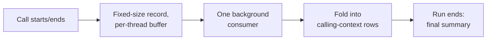

# 03: Counting every call without storing every call

**Key points**

- A per-call fact table would answer any question, but its cost grows
  with traffic; Studio aggregates over the program's call graph instead.
- The complete layer keeps one aggregate row per calling context per run;
  every call folds in, so counts are population totals, not samples.
- Aggregate rows hold counts and summed times but no thread identity, no
  ordering, and no per-call data; the table grows with program shape, not
  with traffic.

Doc 02 described a process hosting runs, each run a tree of calls, some
on spawned logical threads. "Which functions fail most" and "where did
the time go" are questions about all of those calls. This doc covers how
Studio counts every call without storing every call.

## Programs repeat themselves

<!-- 4.5 KiB / 74 ns figures from the fact packs -->
A one-row-per-call table can answer any question, and the decision
register rejects it: its cost grows with traffic, so there is no default
row per call, anywhere. **[v1]** The current engine summarizes a
five-million-call run in about **4.5 KiB** on disk at about
**74 nanoseconds** per call (measured on one development machine, not a
guarantee) **[built]**. Storage follows program shape, not call volume.

This works because a million calls are a few code paths taken
repeatedly: `ProcessCustomers` calls `ProcessCustomer`, which calls
`ClassifyCustomer`, whether there are three customers or a million. A
**calling context** is one such path: a function plus the whole chain of
parents above it, down from the run's entrypoint. The whole chain
defines it (`ClassifyCustomer` under `ProcessCustomer` is a different
context than the same function elsewhere), and it is a location in the
call tree, not a moment in time or a thread. Run `run1` has exactly four
calling contexts.

```text
Calling pattern (the shape)                    run1 traffic through it
ProcessCustomers                               1 call
├── WriteAuditLog          (spawned)           1 call
└── ProcessCustomer                            3 calls
    └── ClassifyCustomer                       3 calls, 1 errored
```

Every call belongs to exactly one calling context, and the complete layer
keeps **one row per calling context per run**. Each call **folds** its
numbers into its context's row (one more start, one more success or
error, its duration) and is then forgotten. Because every call folds and
none are skipped, the rows are the entire **population** of calls, not a
sample. This is doc 01's **complete layer**; its counts are exact totals
for the traffic. Retained-layer counts (doc 04 onward) are a lower bound,
never a total.

## Run run1, folded: 8 calls, 4 rows

The aggregate rows for run `run1` in the proposed reader-facing table,
called `calling_contexts`. (Row labels like `context1` are readable
placeholders; real identifiers are opaque.)

| row | context (path) | started | succeeded | errored | inclusive | self | await |
|---|---|---|---|---|---|---|---|
| context1 | ProcessCustomers | 1 | 1 | 0 | 8.40s | 0.04s | 8.36s |
| context2 | ProcessCustomers → WriteAuditLog *(spawned)* | 1 | 1 | 0 | 0.30s | 0.05s | 0.25s |
| context3 | ProcessCustomers → ProcessCustomer | 3 | 3 | 0 | 8.35s | 0.15s | 8.20s |
| context4 | … → ProcessCustomer → ClassifyCustomer | 3 | 2 | 1 | 8.20s | 0.02s | 8.18s |

The `context4` row shows three things.

- **Aggregation.** Ada, Bo, and Cy all folded into it: three classifier
  calls, one row. With a million customers the table would still be these
  four rows, with `started = 1,000,000` in `context3` and `context4`. The
  complete layer grows with program shape, not traffic.
- **Handled errors stay visible.** `context4` shows `errored = 1` even
  though every `ProcessCustomer` above it succeeded: Bo's classification
  failed with a provider error, the code handled it, and the run
  succeeded, but the failure stays in the record. A fallback that starts
  firing on a large share of traffic therefore remains visible.
- **Await.** The time columns sum across the folded calls (`inclusive`
  from start to end, `self` in the function's own code, `await` suspended
  and waiting). `context4`'s 8.20s is almost entirely await: most LLM
  latency is time spent waiting, not computing. Doc 09 has the full
  column reference.

For contrast, here is failed run `run3`, where Eve's malformed email made
`validate_email` throw and nothing caught it:

| row | context | started | succeeded | errored | cancelled |
|---|---|---|---|---|---|
| context1 | ProcessCustomers | 1 | 0 | 1 | 0 |
| context2 | ProcessCustomers → WriteAuditLog *(spawned)* | 1 | 0 | 0 | 1 |
| context3 | ProcessCustomers → ProcessCustomer | 1 | 0 | 1 | 0 |

Two details. There is no `ClassifyCustomer` row: a context row exists
only for paths that ran, and Eve's run never reached the classifier. And
both `context1` and `context3` show `errored = 1` from *one* propagating
error: the counters record how calls ended, not how many distinct errors
existed, and one error passing through two calls ends both. Whether that
error is captured once or twice as evidence is a doc 04 question.

## How this stays cheap at runtime

1. A call start or end appends one small fixed-size record to its
   logical thread's buffer: no formatting, no file write, no network.
2. One background thread drains the buffers and folds each event (starts
   as well as ends) into its calling-context row, so an open call's row
   advances while the call runs.
3. Every 250 milliseconds, changed rows are flushed to local disk
   (250 ms is an implementation default of the current code, not a
   product promise). **[built]**
4. When the run ends, its rows are folded a final time and written as a
   finished summary that is never modified again.

The observed program pays only for the append.



### Why folding happens before storage

Aggregating call rows in a warehouse still pays for the rows themselves:
written on the hot path, shipped, stored. Folding happens in-process,
before anything is stored, so by default the per-call row never exists:
not on disk, not on the wire, not in a warehouse. The exceptions are
deliberate and bounded: the retained layer keeps exact records for the
interesting few, and an explicitly opt-in debugging mode can write
everything; both belong to doc 04, not to this layer's population path.
Because there is no traffic-proportional cost, this layer is always on
rather than sampled.

## What the aggregate deliberately leaves out

Everything an aggregate row omits grows with traffic; everything it keeps
grows with program shape.

- **Thread identity.** Async work moves between execution lanes as it
  suspends and resumes, so "which thread" is not a stable property of a
  calling context, and keying rows by thread would turn ten thousand
  identical spawned workers into ten thousand rows. Per-thread detail is
  kept for the interesting few (doc 04).
- **Display paths.** A row links to its parent row; the tree is
  reconstructible, and the display string is a rendering concern.
- **Per-invocation data.** No individual timestamps, ordering, durations,
  or argument/return data: a row can say one call errored, not what Bo's
  call contained (docs 04 and 05).
- **Time buckets.** A row is a location in the call tree, not a time
  bucket: a million calls over two hours are still one row per context,
  with counts advancing while the run is open and final when it ends.

## When paths multiply

The table grows with the number of *distinct paths*, which is the
design's weak point. Recursion past depth 512 (an implementation default)
reuses the nearest matching ancestor context, visibly flagged: counts and
times stay exact, only path *uniqueness* coarsens; ten thousand identical
spawned workers likewise share one row. **[built]** In the corpus
measured during design, the 99th-percentile program produced about 3,500
contexts: kilobytes. That is not a guarantee: highly dynamic call graphs
grow the table, and keeping path count bounded on real workloads is a
release gate. **[v1]** Separately, some folded counters can today
saturate at a fixed width without an explicit overflow marker; fixing
that is a v1 correctness gate. **[v1]**

Internally this structure is the **calling-context tree** (CCT) and the
table is `cct_population`; `calling_contexts` is this set's proposed
public name (docs 00 and 09).

## Terms defined here

- **Calling context**: one path of parents from the run's entrypoint down
  to one function; the same function under a different parent is a
  different context.
- **Aggregate row**: the one row per run per calling context holding
  counts and summed times.
- **Fold**: adding a finished call's numbers into its context's row, then
  forgetting the call.
- **Complete layer / population**: the always-on layer that counts every
  call; its numbers are totals, not samples.
- **Inclusive / self / await time**: wall-clock including children; own
  code execution; suspended waiting.
