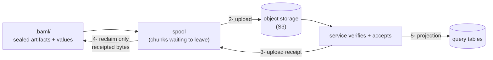

# 08: From your laptop to the cloud

<!-- Sources: fact packs storage.md, capture-ingest-architecture.md,
     studio-security.md, decisions-plan.md. Fresh material is marked inline. -->

**Key points**

- All evidence so far lives in one local directory, `.baml/`; local-only
  operation is a supported mode.
- Sealed evidence is immutable; safe retries, corrections as new facts, and
  rebuildable downstream tables follow from that.
- Upload is optional, never on the hot path, and reclaim gates on receipts:
  no receipt, no deletion.
- Hosted evidence is kept indefinitely; the only deletion path is explicit,
  verified erasure.

## One directory

Every run so far (run1's eight calls, run3's unhandled
`ValidationError`, the tape dumps `dump1` and `dump2`, the captured
values) was recorded without touching the network, into a directory
called `.baml/` next to the project. **[built]**

run1's and run3's evidence, simplified:

```text
.baml/
  history/                 one directory per run
    ...-run1/              run1: its sealed aggregate rows (the four
                           calling_contexts rows from doc 03), its outcome,
                           and its captured values
    ...-run3/              run3: same shape, plus the retained calls
                           call1 and call3
  sessions/<process P>/    the process's own state; tape dumps land here
                           (dump1 and dump2 were written the moment their
                           triggers fired)
  store/                   the value store, shared across runs
```

<!-- Simplified from the literal .baml tree in the storage fact pack; real
     directory and file names are longer and are implementation details. -->

The whole of run1 (eight calls, four aggregate rows, one tape dump, a
handful of values) is a few small files. Two properties of these files
matter for the rest of this doc.

A **sealed artifact** is a file the runtime appends to while its run is
alive and closes forever when the run ends. run2's file grows while run2
runs; once finished, it is only read, never modified. **[built]**

The **content-addressed store (CAS)** holds captured values: the args,
returns, and errors from doc 05. Values are stored under identifiers
computed from their bytes, so identical values are stored once. This is
the deduplication doc 05 described. Ada's `Customer` record, captured in
the root call's args and again in `ClassifyCustomer`'s args, is stored
once. **[built]**

The **playground**, the local browser UI for inspecting runs (served by
`baml playground`), reads this directory and live in-process state
directly. **[built]** No account, no upload, no cloud. Without upload
configured this is the entire system, a supported way to run: capture,
tape, values, queries, all offline.

## Append, then seal

Evidence is **append-then-seal**, and sealed evidence is **immutable**:
never edited, for any reason. Three properties follow.

Retries are harmless. A sealed file sent twice arrives byte-identical, so
the receiver detects the duplicate by content and keeps one; no
coordination protocol is needed to make retrying safe.

Corrections are new facts. If run1's evidence later proves wrong or
incomplete, nothing rewrites run1's files; a new fact (an
`evidence_issues` row, from doc 06) is recorded next to them. Doc 06's
guarantee holds because originals cannot be quietly overwritten.

Everything downstream is rebuildable. Any summary, index, or table
derived from sealed evidence can be discarded and rebuilt with identical
results. The cloud design below depends on this.

A crash mid-run does not corrupt evidence. The partly written file keeps
its intact prefix, a torn final record is ignored, and the run is later
classified as crashed or partial from surrounding evidence. Nothing
invents a success or a failure that did not happen. **[built]**
<!-- capture-ingest fact pack: crash semantics M8; storage M14/M15. -->

## Leaving the laptop **[v1]**

Upload is optional, and the running application never waits on it. It has
five steps:

1. **Spool.** Sealed evidence is split into upload units called chunks
   (each a byte range of exactly one sealed file) and copied into a small
   on-disk holding area beside the runtime, the spool. A separate small
   local ledger records what is still owed to the cloud.
2. **Upload.** Chunks are uploaded to object storage (S3: durable file
   storage in the cloud).
3. **Receipt.** The service verifies and records what it accepted, and
   answers with an **upload receipt**: durable proof that these exact
   bytes are now the cloud's responsibility.
4. **Reclaim.** Only receipted bytes may be reclaimed from local disk. No
   receipt, no deletion: the evidence stays on your machine.
5. **Project.** The service reads accepted evidence and builds the query
   tables from it. This rebuild-from-evidence step is called
   **projection**.



None of this is on the hot path: doc 03 established that the runtime does
no filesystem or network work at call entry. Upload is a separate
background component draining sealed files; a slow or absent network
changes how full the spool gets, never how fast calls run.
<!-- capture-ingest fact pack: hot-path invariants; boundary "capture is not upload". -->

### Why reclaim waits for receipts

A successful upload call is not proof of delivery, because networks
produce ambiguous outcomes: a timeout after the bytes arrived looks
identical to a timeout before. The receipt is the one unambiguous fact,
and local reclaim gates on it in order, so a later successful upload can
never hide an earlier missing one. The result is the design's guarantee:
no acknowledged evidence is ever silently lost. **[v1]**
<!-- studio-security fact pack: "No acknowledged silent loss" invariant. -->

Status: the spool, uploader, and receipt machinery are target v1 work and
do not exist on this branch. **[v1]** An older uploader (`tracingv2`)
exists today **[built]** but speaks a different, legacy protocol and is
explicitly not this path. The full ingest design, including what the
service does between receipt and projection, is internal:
`CANONICAL/design/05-capture-and-ingest.md` and
`CANONICAL/design/02-system-architecture.md`.

## Where things live

Once upload is configured, four places hold data, each with one job:

| Where | What lives there | Status |
|---|---|---|
| Local `.baml/` | Sealed artifacts and the value store: the canonical evidence for everything captured on this machine | **[built]** |
| S3 | The uploaded, accepted copy of that same sealed evidence, values included: the canonical hosted evidence | **[v1]** |
| ClickHouse | Small rebuildable facts behind the tables you query (`runs`, `calling_contexts`, `retained_calls`, `tape_dumps`, `evidence_issues`, …), and never value bodies | **[v1]** |
| PostgreSQL | Ownership and workflow: projects, what has been accepted, what is in progress | **[v1]** |

ClickHouse is the analytics warehouse that answers SQL. It is
**rebuildable** in a precise sense: wipe it entirely and replaying the
sealed evidence in S3 produces the same tables; an explicit release gate
performs exactly this rebuild from empty and requires identical results.
It never stores value bodies: args, returns, errors, and prompts stay in
the value store and S3 and reach queries on demand, as doc 05 described.
Keeping values out of the warehouse is settled (decision D8 in the
internal register, `CANONICAL/design/08-decisions.md`).

PostgreSQL holds the mutable state: who owns what, what is mid-flight.
Evidence never changes and lives in files and S3; immutability keeps this
division clean.

## Freshness of each copy

Locally, the aggregate rows fold on a 250 ms cadence while a run is live
and are force-flushed and sealed when it ends. That number is an
implementation default of the current build **[built]**, not a product
promise. The playground also reads live in-process state, so local
freshness is effectively immediate.

Hosted, 250 ms is not a cloud write cadence. Chunks close by age and
size; the exact thresholds are deliberately unfrozen, to be chosen by
benchmarks. As an order of magnitude, the queryable-in-seconds target
below implies chunks leaving the machine every few seconds under load,
but that is an expectation to validate, not a promise. **[open]** How
quickly accepted evidence becomes queryable is likewise not frozen. The
design carries a qualification target (accepted-to-queryable in seconds,
p95 under 5), a gate to measure before release, not a measured claim.
**[open]**

The above covers finished runs. Whether the hosted view must also show
*still-running* runs in v1 (and if so, when an active run first becomes
visible in hosted queries) is an unresolved decision. **[open]** If
required, the sketch is short-lived incremental rows, discarded soon
after the sealed final aggregate arrives, so history is always read from
immutable evidence. **[open]** Batching trades freshness latency against
ingest cost. Retained detail is a separate dial: a slower cadence delays
evidence, it does not thin it. **[v1]**
<!-- capture-ingest: benchmark-owned chunk tuning; studio-security: qualification targets;
     reader brief §3: active-run hosted visibility open; latency/cost/detail are separate trade-offs. -->

## Error storms

An LLM provider outage that fails a million calls in an hour does not
turn capture into a firehose while the system is already under load.

Locally, every capture mechanism is bounded by construction; no throttle
is bolted on top. Counting is folding: a million failures are increments
to the same few `calling_contexts` rows, not a million new rows. The
rolling tape is fixed memory, and dumps are triggered and rate-limited
(an implementation default). **[built]** On the current branch one
root-observed error fires one dump; the exact dedup contract across
rethrows is the question doc 04 left open. **[open]** Value capture
follows the explicit policy matrix from doc 05: under overload it sheds
lower-priority bodies while counting the losses. The counters and loss
markers exist today **[built]**, and making every such loss a queryable
`evidence_issues` row is the v1 correctness gate doc 06 named. **[v1]**

The designed policy has no bimodal "cheap normally, expensive under
incidents" mode, with one exception today: a single hard cap, the fixed
memory that buffers structural events, still aborts the process when
exhausted instead of shedding. Replacing that abort with the typed shed
policy is committed v1 work. **[v1]**

If upload is configured, an outage grows the spool toward its budget. At
that hard boundary the design prescribes a typed, predeclared choice:
stop admitting new runs, reserve room to close the runs in flight, then
apply one of three named behaviors: fail the run, abort the process, or
continue with the run marked incomplete. Fail-the-run is the recommended
default. Wiring that ladder is committed v1 work **[v1]**; which behavior
is the default in each environment is an open policy decision. **[open]**

How the hosted service handles an entire fleet storming at once
(admission control, backpressure, deduplication) belongs to the internal
cloud doc and is not reviewed here. The shape of the answer: the service
protects accepted evidence first, slows its own projection work next,
then pauses new upload authorizations, and finally tells clients to retry
later, so storm bytes wait in local spools, durable and bounded. **[v1]**
Details: `CANONICAL/design/05-capture-and-ingest.md`.

## Data lifetime

Locally, disk is governed by budgets and reachability. Old run
directories are pruned oldest-first under a size budget, and the value
store is garbage-collected: a value survives while something retained
points at it, and releasing a run releases its values. **[built]** The
specific caps are implementation defaults, not policy. With upload
configured, the receipt gate outranks the size budget: unreceipted bytes
are never pruning candidates, so a stalled upload grows the spool toward
its budget and lands in the error-storm ladder above; the design refuses
new evidence before it deletes unshipped evidence. **[v1]**

Hosted, accepted evidence is immutable and kept indefinitely by default;
routine maintenance is forbidden from evicting it. The only deletion path
is explicit, authorized erasure: a verified workflow that denies access
first, removes the data from every store, copy, and derived table, and
reaches its terminal state only after per-store verification. Ordinary
retention is not erasure, and erasure is not a best-effort delete.
**[v1]** (Settled as D11 in the decision register; optional
customer-configured retention windows are a deferred policy decision.
**[open]**)

With no upload configured there are no receipts to wait for; local
budgets alone govern the directory. Local-only operation is a first-class
mode, not a degraded one. **[built]**

## Terms defined here

- **Sealed artifact**: a file appended to while a run is alive, closed
  forever when it ends.
- **Immutability (append-then-seal)**: sealed evidence is never edited;
  corrections are new facts.
- **Content-addressed store (CAS)**: values stored under identifiers
  derived from their bytes; identical values stored once.
- **Upload receipt**: durable proof the service accepted exact bytes;
  local reclaim gates on it.
- **Projection**: rebuilding query tables from accepted evidence; wipe the
  warehouse and it comes back the same.
