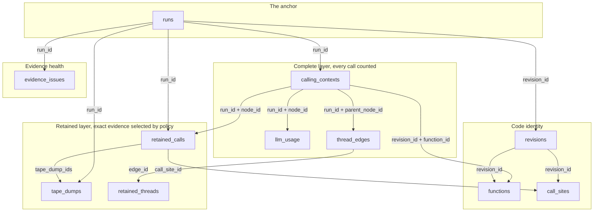

# 09: Table schemas

**Key points**

- Eleven relations follow two data patterns: complete-layer tables count
  every call as aggregates, and retained-layer tables hold exact evidence
  selected by policy, not by traffic.
- The table schemas are logical and versioned. Physical storage can change freely
  because every hosted projection is rebuildable from sealed evidence.
- `args`, `return`, and `error` on `retained_calls` are virtual fields:
  ordinary SQL predicates apply to them, but value bodies load on demand
  and are never stored in the warehouse.
- One proposed table, `cct_windows`, was cut from v1: it grew with active
  locations × time buckets and had a mutable open bucket.

<!-- Sources: share/query-examples.md (schema authority); fact packs: query-system, decisions-plan, profiler-tape, storage, vocabulary-lifecycle, capture-ingest-architecture. Toy rows from inputs/toy-program.md. -->

## The user-facing table schemas

The **user-facing table schemas** are the documented, versioned set of
relations that users and agents query. The internal design documents
call this set **the catalog** ("catalog v1", "the catalog freeze"); that
term survives as the engineering name, so those documents stay readable.
"Public" means documented and stable, not open to the internet. A
relation here is **logical**: a name, a grain, columns, and semantics
that Studio promises to keep. How the data is **physically** stored
(which ClickHouse table, file, or index) is private and free to change
behind the table schemas, because every hosted projection is rebuildable
from sealed evidence **[v1]**. Internal relation names carry version
suffixes (`runs_v1`, `cct_population_v1`) so
meanings cannot drift silently **[v1]**; this doc drops the suffix for
readability.

A relation's **grain** is what one row stands for. A query that assumes
the wrong grain counts the wrong thing.

The IDs below (`run1`, `context3`, `call7`, `dump1`) are readable
placeholders for teaching. Real identifiers are opaque, and their
physical form is a freeze decision **[open]**.

## The table schemas in one picture



Summarized, the table schemas are one pattern applied five times:

| Group | Relations | One row is | Complete or selected? |
|---|---|---|---|
| The anchor | `runs` | one run | complete: every run has a row |
| Complete layer | `calling_contexts`, `llm_usage`, `thread_edges` | one aggregate: run × calling context (× model, or × spawn edge) | complete: every call contributes |
| Retained layer | `retained_calls`, `tape_dumps`, `retained_threads` | one kept call, one saved tape slice, one kept spawned thread | selected by policy |
| Code identity | `revisions`, `functions`, `call_sites` | one compiled program, one function in it, one call expression | complete per revision |
| Evidence health | `evidence_issues` | one grouped report of evidence Studio failed to keep | complete; and empty when healthy |

## The tables at a glance

Every table this doc defines, in the order it defines them. The
reader-facing names are rename proposals for the table-schema freeze
**[open]**; internal design docs use the engineering names.

| Reader-facing | Internal | What the table is |
|---|---|---|
| `runs` | `runs_v1` | One row per run: the anchor every investigation starts from. |
| `calling_contexts` | `cct_population_v1` | One row per calling path per run: the complete layer's counts and times. |
| `retained_calls` | `retained_calls_v1` | One row per kept call: identity, outcome, reason, links, value fields. |
| `tape_dumps` | `exact_windows_v1` | One row per preserved slice of the rolling tape. |
| `thread_edges` | `spawn_edges_v1` | One row per parent-context to spawned-function edge: spawn totals. |
| `retained_threads` | `spawn_instances_v1` | One row per individually retained spawned task. |
| `llm_usage` | `llm_population_v1` | Token and error totals per run, context, provider, and model. |
| `evidence_issues` | `evidence_issues_v1` | One row per grouped data-loss report about Studio itself; empty when healthy. |
| `functions`, `call_sites`, `revisions` | same, `_v1` | Code identity: which code was this, where was it called, which build ran. |

Each section below states the internal name once, then uses the proposed
name.

---

## `runs`: the anchor

**Purpose.** The starting point of every investigation: find a run here.

**Grain.** One row per run, never per call.

**Example rows** (example program; process `P`, revision `rev1`):

| run_id | status | duration | entrypoint | total_calls | total_errors | value_state |
|---|---|---|---|---|---|---|
| run1 | succeeded | 8.40s | ProcessCustomers | 8 | 1 | complete |
| run2 | running | 3.1s so far | ProcessCustomers | 4 so far | 0 | pending |
| run3 | failed | 0.20s | ProcessCustomers | 3 | 2 | complete |

`run1` succeeded with `total_errors = 1`: Bo's classification failed, the
fallback handled it, and the handled error stays visible. `run2` shows
so-far counters that are explicitly not final **[v1]**.

**Answers:** which recent runs had problems; whether a run is still open;
whether its evidence can be trusted at a glance. **Cannot answer:** which
function failed (that is `calling_contexts`); why evidence is missing
(that is `evidence_issues`).

**Growth.** One small row per run; volume tracks run count only.

**Lifecycle.** The terminal fact is sealed and immutable. While a run is
open, status and so-far counters come from live state, merged over the
sealed facts at read time, never by rewriting a row **[v1]**. How that
hosted live state is stored is an open storage decision **[open]**.

**Physically.** Sealed run facts live in local `.baml/` artifacts and S3;
hosted rows are a ClickHouse projection rebuilt from them (doc 08). Two
columns differ: `projection_state` and `retention_state` describe
workflow and come from PostgreSQL control state, and an open run's so-far
numbers come from live state, not ClickHouse.

**Schema** (adapted from the internal proposal):

| Column | Type | Why |
|---|---|---|
| `run_id` | id | Joins every run-scoped relation. |
| `started_at`, `ended_at` | timestamp | Time filters; `ended_at` absent while running. |
| `duration_ns` | duration | Exact elapsed time from a monotonic clock. |
| `status` | enum | pending/running/waiting/succeeded/failed/cancelled/panicked/abandoned. |
| `revision_id` | id | Which exact compiled program ran (doc 07). |
| `entry_function_id`, `entrypoint` | id?, string | Stable root-function join, plus a readable name for non-function entrypoints. |
| `total_calls`, `total_errors` | count | Cheap run-list columns; avoids scanning aggregates per page. |
| `structure_state`, `value_state`, `integrity_state`, `projection_state`, `retention_state` | enum | The evidence axes from doc 06; execution status never implies evidence completeness. |

**Status.** Local run evidence exists today **[built]**; this public
relation freezes at table-schema v1 **[v1]**. The single rolled-up
evidence-state enum from doc 06 is still **[open]**.

---

## `calling_contexts`: the complete layer's core

<!-- Internal: cct_population. Rows from toy-program.md; folding facts from profiler-tape pack. -->

**Purpose.** Complete counts and timing for every call ever made, without
a row per call.

**Grain.** One row per distinct calling context within one run (internal:
`cct_population`; the structure is the calling-context tree, "CCT").

**Example rows** (run `run1`: 8 calls fold into 4 rows):

| node | context | started | succeeded | errored | inclusive | self | await |
|---|---|---|---|---|---|---|---|
| context1 | ProcessCustomers | 1 | 1 | 0 | 8.40s | 0.04s | 8.36s |
| context2 | ProcessCustomers → WriteAuditLog *(spawned)* | 1 | 1 | 0 | 0.30s | 0.05s | 0.25s |
| context3 | ProcessCustomers → ProcessCustomer | 3 | 3 | 0 | 8.35s | 0.15s | 8.20s |
| context4 | … → ProcessCustomer → ClassifyCustomer | 3 | 2 | 1 | 8.20s | 0.02s | 8.18s |

Ada, Bo, and Cy fold into one row per context; a million customers would
too. `context4` is almost all await time: most LLM latency is time spent
waiting, not computing.

**Answers:** which functions fail most, over *all* calls; where run time
went, split into self and await; complete error rates. **Cannot answer:**
which exact call failed; what the arguments were; how threads interleaved
(thread identity is deliberately absent from this grain; doc 03).

**Growth.** Unique call paths, not invocations. Highly dynamic or
recursive paths can still grow it; path count is a release gate **[v1]**.

**Lifecycle.** While a run is active, folded counters arrive as small
immutable increments: **deltas**. At run end one final immutable row per
context is written (the delta-then-final pattern). The invariants are
settled: sealed rows are never mutated, and a query uses the final row or
the deltas, never both **[v1]**. Whether the hosted active side stores
deltas append-only or uses another overlay is an open storage decision
**[open]**.

**Physically.** Folded locally into sealed `.baml/` artifacts, uploaded
to S3, projected into ClickHouse facts (doc 08); hosted active-view
storage is the open decision above.

**Schema:**

| Column | Type | Why |
|---|---|---|
| `run_id`, `node_id` | id | One context in one run; `node_id` is a tree location, not a thread. |
| `parent_node_id`, `depth` | id?, integer | Reconstruct the tree; cheap indentation and depth filters. |
| `function_id`, `revision_id` | id | Joins to compiled function metadata; revision repeated for hot grouping. |
| `definition_key`, `local_definition_hash`, `fqn` | string?, bytes?, string | Cross-revision grouping and display without a dimension join (doc 07); `fqn` is the function's fully-qualified name: its display name. |
| `calls_started` / `_succeeded` / `_errored` / `_cancelled` / `_exited` | count | Complete outcome accounting; started minus finished is still-running work. |
| `inclusive_ns`, `self_ns`, `await_ns` | duration | The three times from doc 03. |
| `duration_histogram` | list | Tail-latency estimates; kept only if percentile questions are a first-shipped priority **[open]**. |

**Status.** The folding engine is on the branch today **[built]**; the
public relation is table-schema-freeze work **[v1]**. Extremely large runs can
lose exact folded counts to a counter-width defect; fixing or explicitly
marking overflow is a v1 gate **[v1]**.

---

## `retained_calls`: the retained layer's core

**Purpose.** The individual calls Studio kept, for exact inspection.

**Grain.** One row per individually retained call.

**Example rows:**

| run_id | call_id | context (node) | status | duration | retention_reasons | tape_dump_ids |
|---|---|---|---|---|---|---|
| run1 | call8 | context4 ClassifyCustomer(Cy) | succeeded | 6.20s | latency | [dump1] |
| run1 | call6 | context4 ClassifyCustomer(Bo) | failed | 0.90s | error body kept (LLM value rules) | [] |
| run3 | call3 | context3 ProcessCustomer(Eve) | failed | 0.17s | error | [dump2] |
| run3 | call1 | context1 ProcessCustomers | failed | 0.20s | error | [dump2] |

Cy's slow classify (`call8`) was kept because it crossed the slow-call
threshold (an implementation default, not policy; doc 04). Bo's handled
failure `call6` is here because its error body was kept under the value
rules for LLM functions (docs 04/05); a handled error fires no dump, so
its tape list is empty. Eve's failure kept two calls: the frame that
threw and the root that observed it. One propagating error produces one
dump and no row per rethrow.

**Answers:** which exact calls can be opened; what a call received,
returned, or raised (via the virtual fields below); when it ran and on
which logical thread. **Cannot answer:** total traffic. Counting these
rows does not measure failure rates: retained counts are lower bounds
selected by policy, and complete counts live in `calling_contexts`
**[v1]**.

**Growth.** Bounded by retention policy, not by traffic.

**Lifecycle.** Terminal rows are immutable; a still-running retained
call's row is served from live state and merged at read time. List
columns are assembled from separate append-only call-to-dump records, so
discovering another containing dump never rewrites the row **[v1]**.

**Physically.** Resident columns are ClickHouse facts rebuilt from sealed
`.baml/`/S3 evidence; the value bodies behind the virtual fields below
stay in the local value store and S3, never in the warehouse (doc 08).

**Schema:**

| Column | Type | Why |
|---|---|---|
| `run_id`, `call_id`, `parent_call_id` | id | Exact identity and parentage; the parent may itself be unretained. |
| `node_id` | id | Joins the exact call back to its `calling_contexts` summary. |
| `thread_id` | id | Logical-thread placement; thread detail lives here, not in aggregates. |
| `definition_key`, `call_site_id` | string?, id? | Filter by logical function; navigate to the source expression (see `call_sites`). |
| `started_at`, `ended_at`, `duration_ns`, `status` | timestamp, timestamp?, duration, enum | Timeline placement and lifecycle outcome. |
| `retention_reasons` | list | Why this row exists. The internal proposal spells the values policy/incident/promotion/explicit; the readable reasons above map onto them (latency→policy, error→incident); and the exact enum is freeze work **[open]**. |
| `tape_dump_ids`, `evidence_ids` | list | Links to containing dumps and to the underlying sealed evidence. |
| `capture_policy_version` | integer | Which rules decided whether values should exist. |
| `args_state`, `return_state`, `error_state` | enum | Per-role availability (doc 05/06); a real null must never be confused with "we don't have it". |

**Status.** Retention mechanisms exist locally **[built]**; the relation
freezes with the table schemas **[v1]**. Whether `process_id`/`engine_id`
columns are needed at all is unresolved **[open]**.

### Virtual value fields: `args`, `return`, `error`

A **resident field** is data physically present in the analytical store:
small, typed, filterable (everything in the schema tables above). A
**virtual field** exists only in the SQL surface: when a statement needs
it, the query engine follows private evidence handles and loads the value
from local evidence or object storage on demand. `args`, `return`, and
`error` on `retained_calls` are virtual; they are never warehouse
columns, because value bodies never live there (doc 08).

Ordinary SQL still works against them **[v1]**:

```sql
-- Exact whole-value equality against a caller-supplied BAML value.
WHERE args = :expected_args

-- A predicate over a nested field of the argument object.
WHERE args['c']['plan'] = 'pro'
```

The argument object is name-keyed by declared parameter names
(`args['c']` is `ProcessCustomer`'s `c`). Positional syntax, if supported
at all, normalizes to those declared names rather than becoming a second
stored shape **[open]**.

Three rules apply. First, `=` means whole-value semantic
equality: never partial-object matching, byte equality, or storage-ID
equality **[v1]**. Second, resident filters run before any value is
loaded; values load in bounded, deduplicated batches; and a `LIMIT` never
applies until value predicates have actually been evaluated **[v1]**.
Third, an unavailable value (redacted, lost, not captured) evaluates to a
typed unknown that is reconciled in the query outcome; it is never a
silent SQL `NULL` or a quiet non-match **[v1]**. A *captured* null is
ordinary data. The exact `args` root shape, subscript spelling and index
base, and the behavior of an available value with an absent path are
freeze items **[open]**.

---

## `tape_dumps`: the ledger of saved tape

**Purpose.** Records what exact event evidence exists, why it was kept,
and whether it is complete.

**Grain.** One row per preserved slice of the rolling tape (internal:
`exact_windows`). The events themselves stay in the sealed dump; this
table is the small searchable ledger over them.

**Example rows:**

| dump_id | run_id | trigger | event_count | covers | evidence_state |
|---|---|---|---|---|---|
| dump1 | run1 | slow call (call8) | ~130 | 6.2s of surrounding activity | available |
| dump2 | run3 | unhandled error at root | ~40 | the whole short run | available |

`dump2` is the tape-beats-a-traceback example from doc 04: its slice
contains the audit thread's start and cancellation events next to Eve's
failure.

**Answers:** whether exact evidence exists around an incident; what
triggered it; whether the slice is complete or truncated. **Cannot
answer:** value bodies (a dump is structural events only); anything
outside the preserved slices; and it may cover only part of a long run.

**Growth.** One row per preserved slice; not per call or clock tick.

**Lifecycle.** The row is inserted after the dump seals and is immutable;
later corruption or loss appears as issue facts composed into
`evidence_state`, never as an edit **[v1]**.

**Physically.** Ledger rows are ClickHouse facts; the event bytes they
describe stay in sealed dump artifacts in `.baml/` and S3, reachable only
through `evidence_id`.

**Schema:**

| Column | Type | Why |
|---|---|---|
| `run_id`, `dump_id` | id | Stable identity for links from calls and threads (internal: `window_id`). |
| `session_id` | id | Ties the slice to its profiler session, so it stays recoverable before every event binds cleanly to a run. |
| `source` | enum | Which capture mechanism produced it; four values internally: the rolling tape's recent ring, a triggered dump of it, the raw stream, and manual capture. |
| `trigger` | enum | error / manual / policy / other: why this evidence exists at all; a slow-call dump like `dump1` falls under policy. |
| `trigger_node_id`, `trigger_call_id` | id? | Jump from the dump to the aggregate location and, if retained, the exact call. |
| `started_at`, `ended_at`, `event_count` | timestamp, timestamp, count | The slice's bounds and size, checkable before opening the bytes. |
| `evidence_state`, `incomplete_reasons` | enum, list | Whether the detail can be trusted, and every known reason it is partial. |
| `evidence_id` | id | Logical handle to the sealed bytes; storage location stays private. |

**Status.** Dumps and triggers run locally today **[built]**; the ledger
relation is table-schema work **[v1]**. Trigger policy details remain open
where doc 04 marked them **[open]**.

---

## `evidence_issues`: the health table

**Purpose.** Makes missing evidence a queryable fact instead of a silent
gap (doc 06).

**Grain.** One immutable grouped summary: one source scope × kind ×
reason, with a count.

**Example row.** The three example runs are healthy: zero rows, which is
itself the answer. The teaching row is doc 06's hypothetical overloaded
run `runX`:

| run_id | source | kind | reason | count | first_seen | last_seen |
|---|---|---|---|---|---|---|
| runX | profiler | structure | records_dropped | 10,000 | 12:00:01 | 12:00:04 |

**Answers:** whether a run's evidence is complete enough to trust; which
pipeline stage lost what, when, and how much. **Cannot answer:**
application errors. Eve's `ValidationError` never appears here, because
your program failing is not Studio failing to watch it.

**Growth.** Only scopes that had an issue; the `count` column exists so a
storm of identical losses stays one row.

**Lifecycle.** A row is emitted only when its source range seals; counts
never increment in place. A run binding discovered later is attached by a
separate append-only linking record, not a rewrite **[v1]**.

**Physically.** ClickHouse facts projected from sealed diagnostic ranges
in `.baml/` and S3, like everything else in these table schemas.

**Schema:**

| Column | Type | Why |
|---|---|---|
| `issue_id`, `run_id`, `session_id` | id, id?, id? | Identity; run may be unknown for pre-run or non-runtime issues. |
| `evidence_id` | id? | The sealed evidence range being summarized, when one is identifiable. |
| `source` | enum | profiler / value_capture / uploader / projector / retention: who owns the fix. |
| `kind`, `reason` | enum | What evidence class is affected, and the typed cause: groupable, not free text. |
| `count`, `first_seen_at`, `last_seen_at` | count, timestamp, timestamp | Size and extent of the grouped problem. |
| `policy_version` | integer? | Present when a policy caused the omission. |

**Status.** The loss counters and markers exist locally but are not yet
consistently persisted into run diagnostics; closing that is required v1
work **[v1]**. The grouped-row contract freezes with the table schemas
**[v1]**.

---

## `functions`, `call_sites`, `revisions`: code identity

**Purpose.** The identity dictionary that connects observations to code
(doc 07). Deliberately not a version-control system.

**Grain.** One compiled revision; one function within a revision; one
static call expression within a revision.

**Example rows** (`functions`, revision `rev1`; real function IDs start
at 16: lower values are reserved for the runtime **[built]**):

| revision_id | function_id | definition_key | fqn | kind |
|---|---|---|---|---|
| rev1 | 16 | dk1 | ProcessCustomers | bytecode |
| rev1 | 18 | dk4 | ClassifyCustomer | bytecode |
| rev1 | 19 | dk3 | WriteAuditLog | bytecode |

The `dk` placeholders are doc 07's: a definition_key is deliberately not
the name, because renames change it on purpose. `revisions` has one row
for `rev1`; `call_sites` has none yet (see status). The cross-revision
worked example (the edited prompt) is in doc 07.

**Answers:** which exact program produced a run; whether a function's own
compiled definition changed; where the function is in source. **Cannot
answer:** whether behavior is truly equal across revisions (an unchanged
`local_definition_hash` says nothing about callees; doc 07's caveat), and
nothing about source history beyond what runs observed.

**Growth.** Compile-time program structure, never invocation volume.

**Lifecycle.** Insert once per revision, then immutable. Reprocessing the
same revision must reproduce identical rows; a differing row for the same
identity is an integrity conflict, not an update **[v1]**.

**Physically.** The dictionaries seal with the revision's artifacts in
`.baml/`, upload to S3, and project into ClickHouse like run evidence.

**Schema** (key columns):

| Column | Type | Why |
|---|---|---|
| `revisions.revision_id`, `source_snapshot_id`, `compiler_id` | id, id, string | The exact program: sources plus compiler identity. |
| `revisions.capture_policy_version` | integer | Decodes what the capture flags below meant. |
| `functions.function_id`, `definition_key`, `local_definition_hash`, `fqn` | id, string?, bytes?, string | The three-part identity from doc 07, plus the display name. |
| `functions.source_path` / `_start` / `_end` / `_line` | string?, integer | Editor navigation to the definition. |
| `functions.kind`, `origin` | enum | Separate user code from runtime internals in analysis. |
| `functions.capture_inputs` / `_output` / `_error`, `promote_on_error` | enum | The capture policy of doc 05, explained per function. |
| `call_sites.call_site_id`, `source_path` / `_start` / `_end` | id, string, integer | Navigate a retained call to the expression that made it. |

**Status.** Revision dictionaries and function rows exist today
**[built]**. The `call_sites` producer is not built: the dictionary
section exists but is empty, so `retained_calls.call_site_id` is not
navigable until producer and dictionary land together **[open]**.

---

## `llm_usage`: provisional

**Purpose.** Token and LLM-error accounting without opening a single
prompt (internal: `llm_population`).

**Grain.** One row per run × calling context × provider × model.

**Example row** (run `run1`: three classify calls, one provider failure):

| run_id | node | provider | model | llm_calls | input_tok | output_tok | provider_errors | parse_errors | token_state |
|---|---|---|---|---|---|---|---|---|---|
| run1 | context4 | openai | gpt-5 | 3 | 1,602 | 20 | 1 | 0 | partial |

`token_state = partial` because Bo's failed call reported no usage, and
absence of tokens must never read as zero tokens. `run3` has no row at
all: `ClassifyCustomer` never ran.

**Answers:** which models spent tokens, where in the call tree, and how
much; provider failures versus parse failures. **Cannot answer:** which
exact prompt was expensive (follow `node_id` into `retained_calls` and
its virtual fields); dollar cost. Prices change, so cost is a query-time
join to a price relation, not a stored fact.

**Growth.** Unique combinations, not LLM invocations.

**Lifecycle.** Same delta-then-final pattern as `calling_contexts`
**[v1]**. **Physically:** same path too: local fold, sealed artifacts,
S3, ClickHouse projection.

**Schema:** `run_id`, `node_id` (joins `calling_contexts`), `provider`
(string; kept only if provider/model stays the public grouping
**[open]**), `model` (string), `llm_calls` (count), `token_state` (enum),
`input_tokens` / `output_tokens` (count?), `provider_errors` /
`parse_errors` (count).

**Status.** Provisional **[open]**: the LLM instrumentation is being
reworked, and this relation is expected to change with it. Aggregate-only
growth is the part that is settled.

---

## `thread_edges`: conditional

**Purpose.** Fan-out accounting: what each context spawned, and how that
work ended (internal: `spawn_edges`).

**Grain.** One row per unique spawning-context × spawned-function
relationship in one run.

**Example rows:**

| run_id | parent context | spawned function | spawned | completed | errored | cancelled |
|---|---|---|---|---|---|---|
| run1 | context1 ProcessCustomers | WriteAuditLog | 1 | 1 | 0 | 0 |
| run3 | context1 ProcessCustomers | WriteAuditLog | 1 | 0 | 0 | 1 |

Ten thousand identical workers would still be one row with
`spawned = 10,000`.

**Answers:** total fan-out; spawned work that failed or was cancelled;
how many exact instances are inspectable (`retained_instances` vs
`instances_dropped`). **Cannot answer:** the timing or identity of a
specific spawned thread; that is `retained_threads`.

**Growth.** Unique edges. **Lifecycle:** delta-then-final, like every
complete-layer table **[v1]**. **Physically:** same path as
`calling_contexts`: sealed local evidence, S3, ClickHouse projection.

**Schema:** `run_id`, `edge_id`, `parent_node_id`, `child_function_id`,
`spawned` / `completed` / `errored` / `cancelled` (count), `running_ns`
(duration; kept only if its accounting can be made exact **[open]**),
`awaiting_ns` (duration), `retained_instances`, `instances_dropped`
(count; so a selective instance table is never mistaken for complete
history).

**Status.** Spawn aggregation runs locally today **[built]**; both thread
relations enter the table schemas only if concurrency diagnosis is a
first-shipped priority **[open]**.

---

## `retained_threads`: conditional

**Purpose.** The retained layer's mirror for spawns: specific
spawned-thread instances you can inspect (internal: `spawn_instances`).

**Grain.** One row per individually retained spawned thread.

**Example rows:**

| run_id | thread | spawned function | status | tape_dump_ids |
|---|---|---|---|---|
| run1 | thread2 | WriteAuditLog | succeeded | [] |
| run3 | thread2 | WriteAuditLog | cancelled | [dump2] |

`run3`'s cancelled audit thread is here because cancellation made it
exceptional. Cancellation preserved no tape (doc 04); the thread appears
in `dump2` only because Eve's error dump happened to cover it.

**Answers:** inspect a particular spawned thread; link to its exact
parent and child calls when those were retained. **Cannot answer:** total
spawn counts; that is `thread_edges`, same rule as everywhere.

**Growth.** Policy-retained instances. **Lifecycle:** terminal rows
immutable; an open instance's row is served from live state at read time
**[v1]**. **Physically:** same path as `retained_calls`: resident
ClickHouse facts, evidence in `.baml/` and S3.

**Schema:** `run_id`, `spawn_id`, `edge_id` (joins `thread_edges`),
`thread_id`, `parent_call_id` / `child_call_id` (id?; set when those
calls were retained), `status` (enum), `started_at` / `ended_at`,
`tape_dump_ids`, `evidence_ids`, `evidence_state` (enum; a row being
present does not make its evidence readable).

**Status.** Bounded instance retention exists locally **[built]**
(first-N plus exceptional instances: implementation defaults, not
policy); inclusion in the table schemas is conditional with
`thread_edges` **[open]**.

---

## Why there are eleven tables

One anchor, three complete-layer tables, three retained-layer tables,
three code-identity tables, one health table: eleven relations, two data
patterns. Every data table is either the complete layer (cheap totals
over everything) or the retained layer (exact evidence for the selected
few); the rest is identity and health.
`thread_edges`/`retained_threads` repeats the
`calling_contexts`/`retained_calls` pattern for spawns.

Each table was justified against real queries; one was not. The
internal proposal `cct_windows` would have stored time-bucketed aggregate
deltas for "when did this spike?" charts. Its growth was active call-tree
locations × elapsed time buckets; at the current local fold cadence one
active location would mint four rows per second (an implementation-default
figure, not policy); and its open bucket was mutable. Complete totals
already live in `calling_contexts`, live charts are served from the
playground's direct view of running processes (doc 08), and incident
detail lives in `tape_dumps`. It was cut from v1, revivable only if a
measured historical-chart workflow justifies a coarse, retention-limited
derived view **[v1]**. The same discipline applies elsewhere: the thread
tables are conditional on concurrency diagnosis being a first-shipped
priority, `llm_usage` is provisional pending the LLM rework, and the
duration histogram stays only if percentile questions are one too.

### Tree queries in plain SQL

Most common questions need no tree walk: failure rates, time by function,
and cross-revision comparisons group by `definition_key`. A tree query
anchors to one `run_id`; `parent_node_id` plus `depth` reconstruct the
tree within that run's contexts. Measured project corpora put the 99th
percentile under a few thousand contexts per run, so per-run
reconstruction is bounded and small. Whether a physical provider also
keeps flattened ancestor indexes is physical-design freedom behind the
table schemas, decided by benchmarks, not by this document **[open]**.

Two limits remain. A *path-anchored* question across many runs
("`ClassifyCustomer` specifically under `ProcessCustomer`, fleet-wide,
last month") has no resident cross-run path column: either ask the
function-anchored version with `definition_key`, or reconstruct per run;
a resident path hash or ancestor list is one of the physical options
**[open]**. And the delta-then-final rule is enforced by the provider,
never by the query author: no query in this set needs a latest-row dedup
idiom (the `LIMIT 1 BY` pattern that is the classically slow part of
mutable-aggregate designs).

## Where the table schemas end

Everything below the table schemas (which ClickHouse tables exist, how
PostgreSQL coordinates uploads, how projections are batched) is internal
design. The analytical side (ClickHouse tables, provider caches,
projection batching) is rebuildable from sealed evidence, so it can
change without breaking a saved query. The workflow truth PostgreSQL owns
(acceptance, ownership, retention and deletion state) is not rebuilt from
evidence; it reaches the table schemas only through the workflow columns on
`runs`. Studio's stability promise is exactly what this doc described:
versioned logical relations with fixed grains, availability semantics,
and outcomes **[v1]**. Physical DDL, ordering keys, partitions, codecs,
and provider overlays are all unfrozen **[open]**, owned by the internal
design, and unconstrained by this set. The internal cloud document owns
the rest.

**Terms defined here:** user-facing table schemas; logical vs physical;
grain; resident field; virtual field.
