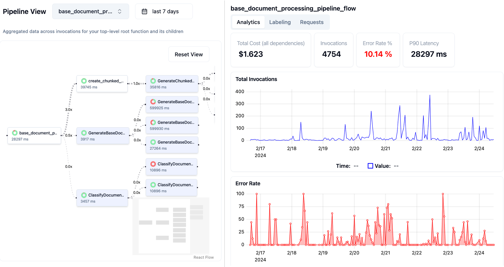

<a href="https://boundaryml.com?utm_source=github" target="_blank" rel="noopener noreferrer">
  <picture>
    <source media="(prefers-color-scheme: dark)" srcset="https://www.boundaryml.com/gloo-ai-square-256.png">
    
  </picture>
  
</a>

# BAML

**BAML is a domain-specific-language to write and test LLM functions.**

An LLM function is a prompt template with some defined input variables, and a specific output type like a class, enum, union, optional string, etc.
With BAML you can write and test a complex LLM function in 1/10 of the time it takes to setup a python LLM testing environment.

## Try it out in the playground -- [PromptFiddle.com](https://promptfiddle.com)

Share your creations and ask questions in our [Discord](https://discord.gg/BTNBeXGuaS).

<br />

## Features

- **Python and Typescript support**: Plug-and-play BAML with other languages
- **Type validation**: more resilient to common LLM mistakes than Pydantic or Zod
- **Wide model support**: Ollama, Openai, Anthropic. Tested on small models like Llama2
- **Streaming**: Stream structured partial outputs.
- **Realtime Prompt Previews**: See the full prompt always, even if it has loops and conditionals
- **Testing support**: Test functions in the playground with 1 click.
- **Resilience and fallback features**: Add retries, redundancy, to your LLM calls
- **Observability Platform**: Use Boundary Studio to visualize your functions and replay production requests with 1 click.

## Companies using BAML

- [Zenfetch](https://zenfetch.com/) - ChatGPT for your bookmarks
- [Vetrec](https://www.vetrec.io/) - AI-powered Clinical Notes for Veterinarians
- [MagnaPlay](https://www.magnaplay.com/) - Production-quality machine translation for games
- [Aer Compliance](https://www.aercompliance.com/) - AI-powered compliance tasks
- [Haven](https://www.usehaven.ai/) - Automate Tenant communications with AI
- [Muckrock](https://www.muckrock.com/) - FOIA request tracking and filing
- and more! [Let us know](https://calendly.com/boundaryml/meeting-with-founders) if you want to be showcased or want to work with us 1-1 to solve your usecase.

## Resources

<a href="https://discord.gg/ENtBB6kkXH"></a>
<a href="https://twitter.com/intent/follow?screen_name=boundaryml"></a>

- [Discord Office Hours](https://discord.gg/ENtBB6kkXH) - Come ask us anything! We hold office hours most days (9am - 12pm PST).
- [Documentation](https://docs.boundaryml.com)
- [Boundary Studio](https://app.boundaryml.com) - Observability of BAML functions

## Starter projects

- [BAML + NextJS 14](https://github.com/BoundaryML/baml-examples/tree/main/nextjs-starter)
- [BAML + FastAPI + Streaming](https://github.com/BoundaryML/baml-examples/tree/main/python-fastapi-starter)

## A BAML LLM Function

Here is how you extract a "Resume" from a chunk of free-form text. Run this prompt in [PromptFiddle](https://promptfiddle.com/extract-resume).

Note: BAML syntax highlight is not supported yet in Github -- so we apologize, we're working on it!

```rust
// Declare some data models for my function, with descriptions
class Resume {
  name string
  education Education[] @description("Extract in the same order listed")
  skills string[] @description("Only include programming languages")
}

class Education {
  school string
  degree string
  year int
}

function ExtractResume(resume_text: string) -> Resume {
  // LLM client with params you want (not pictured)
  client GPT4Turbo

  // BAML prompts use Jinja syntax
  prompt #"
    Parse the following resume and return a structured representation of the data in the schema below.

    Resume:
    ---
    {{ resume_text }}
    ---

    {# special Jinja macro to print the output instructions. #}
    {{ ctx.output_format }}

    JSON:
  "#
}
```

Once you're done iterating on it using the interactive BAML VSCode Playground, you can convert it to Python or TS using the BAML CLI.

## Usage in Python

```python
# baml_client is autogenerated
from baml_client import baml as b
# BAML types get converted to Pydantic models
from baml_client.baml_types import Resume

async def main():
    resume_text = """Jason Doe
Python, Rust
University of California, Berkeley, B.S.
in Computer Science, 2020
Also an expert in Tableau, SQL, and C++
"""

    # this function comes from the autogenerated "baml_client".
    # It calls the LLM you specified and handles the parsing.
    resume = await b.ExtractResume(resume_text)

    # Fully type-checked and validated!
    assert isinstance(resume, Resume)
```

## Usage in TypeScript

```typescript
// baml_client is autogenerated
import baml as b from "@/baml_client";
// BAML also auto generates types for all your data models
import { Resume } from "@/baml_client/types";

function getResume(resumeUrl: string): Promise<Resume> {
  const resume_text = await loadResume(resumeUrl);
  // Call the BAML function, which calls the LLM client you specified
  // and handles all the parsing.
  return b.ExtractResume({ resumeText: content });
}
```

With BAML you have:

- Better output parsing than Pydantic or Zod -- more on this later
- Your code is looking as clean as ever
- Calling your LLM feels like calling a normal function, with actual type guarantees.

## BAML Toolchain

|                                                                                           | Capabilities                                                                                                                                                                                                                                                                                                                       |
| ----------------------------------------------------------------------------------------- | ---------------------------------------------------------------------------------------------------------------------------------------------------------------------------------------------------------------------------------------------------------------------------------------------------------------------------------- |
| VSCode Extension [install](https://marketplace.visualstudio.com/items?itemName=gloo.baml) | Syntax highlighting for BAML files<br /> Real-time prompt preview <br /> Testing UI                                                                                                                                                                                                                                                |
| Boundary Studio [open](https://app.boundaryml.com)<br />(not open source)                 | Type-safe observability <br />Labeling                                                                                                                                                                                                                                                                                             |

</p>

## Installation

### Python
`pip install baml-py`

### Typescript
`npm install @boundaryml/baml`

### 2. Download VSCode extension

Search for "BAML" or [Click here](https://marketplace.visualstudio.com/items?itemName=boundary.Baml-extension)

> If you are using python, enable typechecking in VSCode’s settings.json:
>
> "python.analysis.typecheckingMode": "basic"

### 3. Add BAML to any existing project

Typescript: `npx baml-cli init`
Python: `baml-cli init`

### 4. OR use these starter projects:

- [NextJS 14](https://github.com/BoundaryML/baml-examples/tree/main/nextjs-starter)
- [FastAPI](https://github.com/BoundaryML/baml-examples/tree/main/python-fastapi-starter)

## Observability

Analyze, label, and trace each request in [Boundary Studio](https://app.boundaryml.com).



## Why not just use an existing Python framework?

Existing frameworks can work pretty well (especially for very simple prompts), but they run into limitations when working with structured data and complex logic.

<details>
<summary>Iteration speed is slow</summary>

There are two reasons:

1. **You can't visualize your prompt in realtime so you need to run it over and over to figure out what string the LLM is actually ingesting.**
   This gets much worse if you build your prompt using conditionals and loops, or have structured outputs. BAML's prompt-preview feature in the playground works even with complex logic.
2. **Poor testing support**. Testing prompts is 80% of the battle. Developers have to deal with copy pasting prompts from one playground UI to the codebase, and if you have structured outputs you'll need to generate the pydantic json schema yourself and do more copy-pasting around.
</details>
<br />
<details>
<summary>Pydantic and Zod weren't made with LLMs in mind</summary>

LLMs don't always output correct JSON.

Sometimes you get something like this text blob below, where the json blob is in-between some other text:

```
Based on my observations X Y Z...., it seems the answer is:
{
  "sentiment": Happy,
}
Hope this is what you wanted!
```

This isn't valid JSON, since it's missing quotes in "Happy" and has some prefix text that you will have to regex out yourself before trying to parse using Pydantic or Zod.
BAML handles this and many more cases, such as identifying `Enums` in LLM string responses.. See [flexible parsing](#flexible-parsing)

**Aliasing issues**

Prompt engineering requires you to think carefully about what the name of each key in the schema is. Rather than changing your code everytime you want to try a new name out, you can alias fields to a different name and convert them back into the original field name during parsing.

Here's how BAML differs from these frameworks:

**Aliasing object fields in Zod**

```typescript
const UserSchema = z.object({
  first_name: z.string(),
}).transform((user) => ({
  firstName: user.first_name
}));
```

**Aliasing object fields BAML**

```rust
class User {
  first_name string @alias("firstName")
}
```

**Aliasing enum values in Zod/Pydantic**

Zod: not possible

Pydantic:

```python
class Sentiment(Enum):
  HAPPY = ("ecstatic")
  SAD = ("sad")

  def __init__(self, alias):
    self._alias = alias

  @property
  def alias(self):
    return self._alias

  @classmethod
  def from_string(cls, category: str) -> "Sentiment":
    for c in cls:
      if c.alias == alias:
        return c
      raise ValueError(f"Invalid alias: {alias}")
  ...
  # more code here to actually parse the aliases
```

**Aliasing enum values in BAML**

```rust
enum Sentiment {
  HAPPY @alias("ecstatic")
  SAD @alias("sad")
}
```

</details>
<br />
Finally, BAML is more of an ecosystem designed to bring you the best developer experience for doing any kind of LLM function-calling, which is why we've built tools like the playground and Boundary Studio -- our observability platform.

## FAQ

### Why make a new language?

We basically wanted [Jinja](https://jinja.palletsprojects.com/en/3.1.x/), but with types + function declarations, so we decided to make it happen. Earlier we tried making a YAML-based sdk, and even a Python SDK, but they were not powerful enough.


### Does BAML use LLMs to generate code?

No, the BAML dependency transpiles the code using Rust 🦀. It takes just a few milliseconds!

### What does BAML stand for?

Basically, A Made-up Language

### How do I deploy with BAML?

BAML files are only used to generate Python or Typescript code. Just commit the generated code as you would any other python code, and you're good to go

### Is BAML secure?

Your BAML-generated code never talks to our servers. We don’t proxy LLM APIs -- you call them directly from your machine. We only publish traces to our servers if you enable Boundary Studio explicitly.

### How do you make money?

BAML and the VSCode extension will always be 100% free and open-source.

Our paid capabilities only start if you use Boundary Studio, which focuses on Monitoring, Collecting Feedback, and Improving your AI pipelines. Contact us for pricing details at [contact@boundaryml.com](mailto:contact@boundaryml.com?subject=I'd%20love%20to%20learn%20more%20about%20boundary).

## Security

Please do not file GitHub issues or post on our public forum for security vulnerabilities, as they are public!

Boundary takes security issues very seriously. If you have any concerns about BAML or believe you have uncovered a vulnerability, please get in touch via the e-mail address contact@boundaryml.com. In the message, try to provide a description of the issue and ideally a way of reproducing it. The security team will get back to you as soon as possible.

Note that this security address should be used only for undisclosed vulnerabilities. Please report any security problems to us before disclosing it publicly.

<hr />

Made with ❤️ by Boundary

HQ in Seattle, WA

P.S. We're hiring for software engineers. [Email us](founders@boundaryml.com) or reach out on [discord](https://discord.gg/ENtBB6kkXH)!
