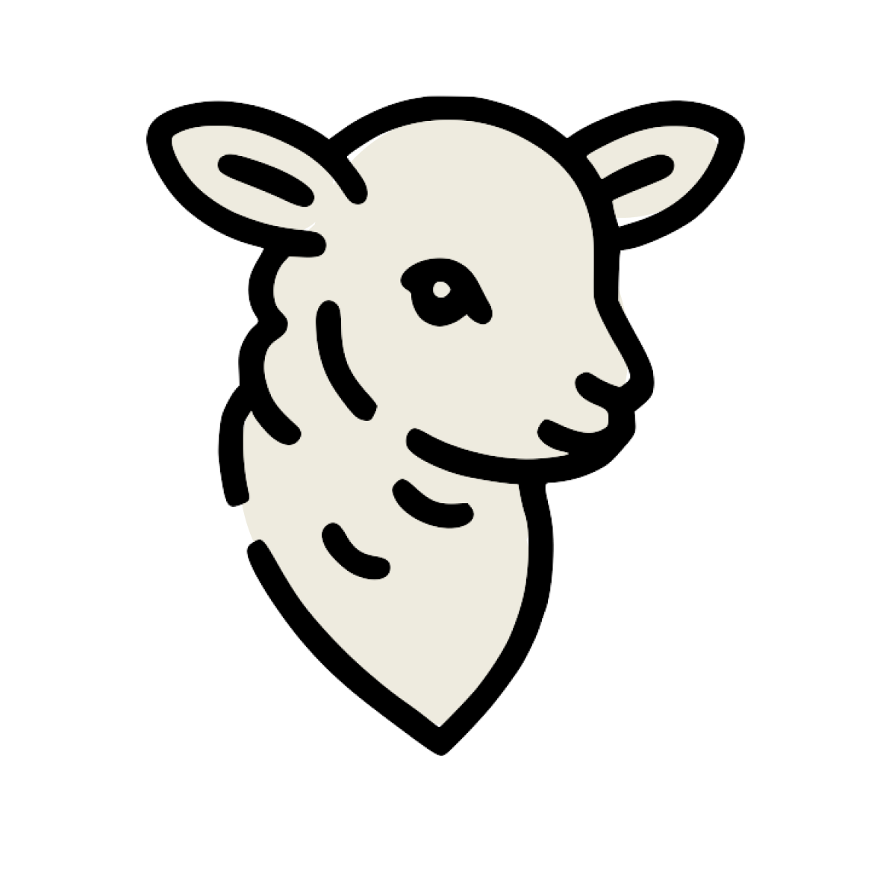

<div align="center">
<a href="https://boundaryml.com?utm_source=github" target="_blank" rel="noopener noreferrer">
  <picture>
    <source media="(prefers-color-scheme: dark)" srcset="fern/assets/baml-logo-white.png">
    
  </picture>
</a>

# BAML: Basically A Made-up Language

BAML is the programming language for agents.

[](https://pypi.org/project/baml-py/)

[Homepage](https://www.boundaryml.com/) | [Explore BAML](https://www.boundaryml.com/explore) | [Discord](https://www.boundaryml.com/discord)

</div>

BAML looks like TypeScript, but every feature is built so agents make fewer mistakes:

- It has a type system like Rust, but compiles even faster than Go.
- Types persist at runtime. There is no `any` nor casting dangerously to any type.
- Errors are typed and statically analyzed.
- The filesystem describes the modules/namespaces.
- Has green threads, and colorless concurrency like Go
- Built-in tests / eval framework
- Built-in stdlib for agents
- Every baml tool is natively designed for agents, with no garbage outputs, etc.
- Can be run standalone or adopt incrementally (you can call a BAML function from TS, Py, Go, C#, Java, etc).

[Explore the website and examples](https://www.boundaryml.com/explore).

## Try it out

```bash
brew install baml
baml agent install
baml init
baml ide install --code
```

Or read the [quickstart](https://boundaryml.com/quickstart).

## Contributing

See our [guide on getting started](/CONTRIBUTING.md).

---

Made with ❤️ by Boundary. HQ in Seattle, WA.

We're hiring software engineers who love Rust. [Email us](mailto:founders@boundaryml.com) or reach out on [Discord](https://www.boundaryml.com/discord).
