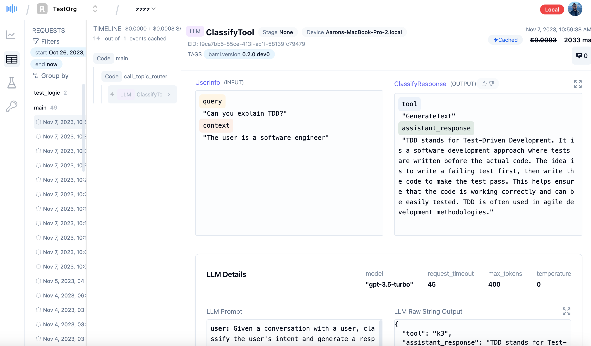
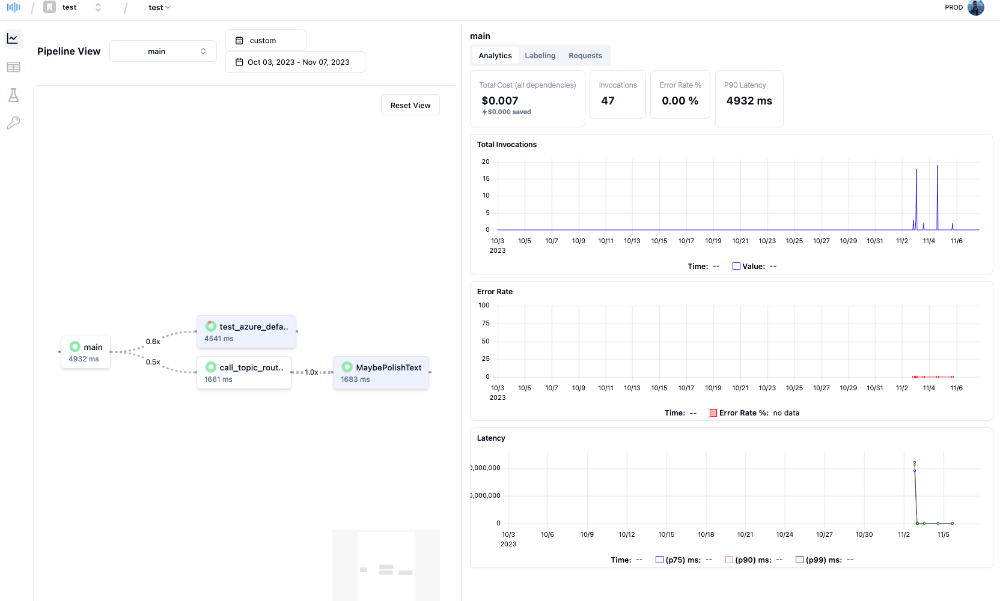

<div align="center">
  <a href="https://app.trygloo.com?utm_source=github" target="_blank" rel="noopener noreferrer">
    <picture>
      <source media="(prefers-color-scheme: dark)" srcset="https://www.trygloo.com/gloo-ai-square-256.png">
      
    </picture>
  </a>
  <h1>BAML</h1>
  <h2>A Language for interacting with LLM models using a function-based approach<h2>
  <a href="https://discord.gg/mWBCPyDhPW"></a>
  <a href="https://twitter.com/intent/follow?screen_name=tryGloo"></a>
  <!-- <a href="https://docs.trygloo.com"></a> -->
  <br /> 
  <a href="https://docs.trygloo.com">Documentation</a>
 • <a href="https://app.trygloo.com">Dashboard</a>
   <h4>Made by Gloo</h4>
</div>

BAML (Basically a Made-up Language) is a Domain Specific Language (DSL) for building AI applications and interacting with LLMs and other AI models.

**Key Features of BAML:**

- **Define LLM prompts as functions:** Inputs and output types are clearly defined, allowing you to break down complex LLM prompts into smaller, more manageable tasks, and allowing you to query your data in more powerful ways.
- **Generate Python and TypeScript code:** Run a BAML function in Python or typescript using our built-in code generator.
- **Invocation tracing and data querying/viewing:** Enables monitoring and analysis of function calls.


BAML includes a toolchain ready to use out of the box, including a VSCode extension with an integrated playground, test suite integration, and a dashboard.





BAML is inspired by **[Prisma](https://www.prisma.io/)**, a DSL for databases. BAML is designed to be a **DSL for AI Tasks**.

## BAML Components

1. **VSCode Extension** - Provides a playground, syntax highlighting and static analysis for BAML files.
2. **BAML CLI** - Provides code generation for BAML files to python (and soon typescript)
3. **BAML Python Library** - Utilities that enables tracing of BAML functions using OpenTelemetry, and provides a pytest plugin integrated with the Dashboard + Playground
4. **Gloo Dashboard** - Allows you to view and query your BAML executions, run test suites, label data, and soon train new models. Contact us for pricing details

## LLM Classification Task example

Below is what you need to get a working **classification task** using LLMs with BAML, but BAML can be used for many other tasks, including chat bots, question answering, etc.

**BAML configuration**


Calling the generated function:

```python
from baml_client import baml

async def classify():
  response = await baml.ClassifyTool.get_impl("v1").run(
    ClassifyRequest(
      query="What is TDD?",
      context="The user is a software engineer"
    )
  )
```

Proceed to the [Language Tour](./baml-by-example) to learn more.

## Why use BAML vs other libraries or frameworks?

1. **Use an integrated VSCode playground** - The playground is co-located with your prompt configurations. No need to context switch out of VSCode for simple tests.
2. **Comments in prompts** - You heard that right... we added support for [comments inside the actual prompt string](https://docs.trygloo.com/v2/mdx/baml-by-example#comments).
3. **Strong type safety** - Query your data with into fully typed pandas dataframes of your input and output objects, rather than raw strings or JSON. (Coming soon)
4. **Powerful deserialization** - BAML parses your inputs and outputs for you, and provides guardrails to ensure your inputs and outputs are valid. _Even when the JSON is valid, the desired output type may not be what you wanted_. The BAML deserializer can smartly detect when an LLM may have output a string rather than a number, and still parse things correctly. For enums it even keeps track of hallucinated values.
5. **Code organization** - Organize your code in statically analyzed BAML files, without having to use plaintext or YAML
6. **Out-of-the-box request tracing and data analytics**
7. **Test Suites** - Run and visualize test results for all your BAML functions over time using the playground or using our dashboard-enabled pytest plugin.
8. **Flexibility and cross-compatibility** - Running BAML prompts are as easy as copying the BAML files over and pressing "run"
9. **Prompt linting** - Get warnings when your prompt isn't following best practices. We are planning on adding custom guidelines.

## Why did you make this?

We wanted to build a toolchain from the ground up that would allow us to build and deploy LLMs in a way that is easy to understand, test, and debug. Also, writing a rust compiler seemed pretty fun.

Our vision is to support any AI model, not just LLMs, so when you fine-tune a model to complete a task an LLM used to do, you can swap it over in one line of code. If you do end up using the Dashboard product, we want you to be able to load it in a pandas dataframe, in a fully typed manner (because BAML stores all type info for you!), to train whatever you want.

### [Documentation](https://docs.trygloo.com)

See more at [our docs page](https://docs.trygloo.com)

### Resources

- [Discord](https://discord.gg/mWBCPyDhPW)

## Security

Please do not file GitHub issues or post on our public forum for security vulnerabilities, as they are public!

Gloo takes security issues very seriously. If you have any concerns about BAML or believe you have uncovered a vulnerability, please get in touch via the e-mail address contact@trygloo.com. In the message, try to provide a description of the issue and ideally a way of reproducing it. The security team will get back to you as soon as possible.

Note that this security address should be used only for undisclosed vulnerabilities. Please report any security problems to us before disclosing it publicly.
