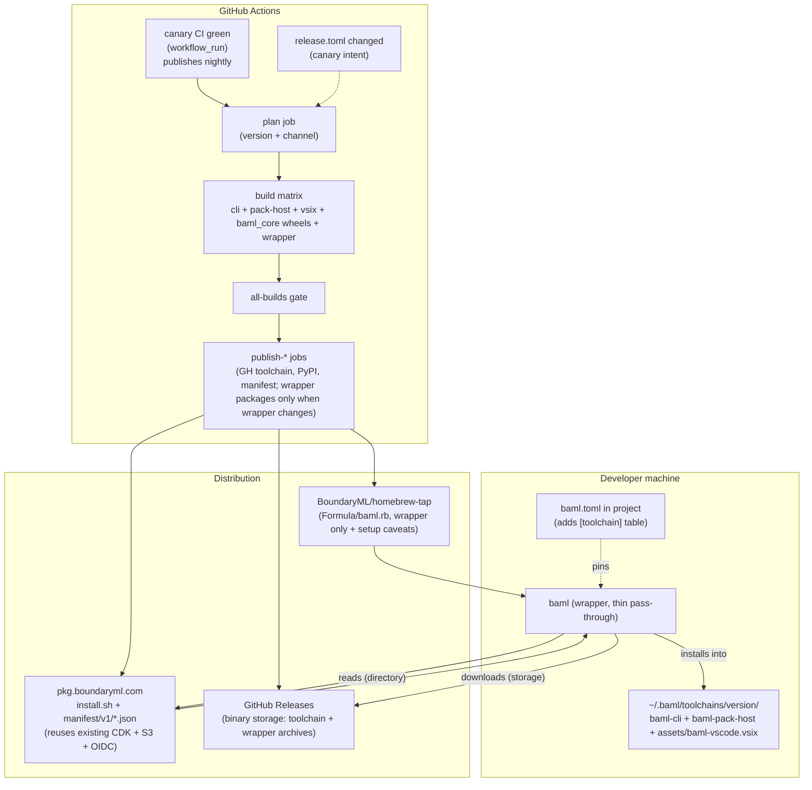

# BAML Language Release Architecture Overhaul

## Scope

In scope: everything under `baml_language/` plus its release workflow, the new Homebrew tap, the new install/wrapper toolchain, and the `boundaryml-tap` rename.

Out of scope (kept separate, no changes): the `engine/` release pipeline (`.github/workflows/release.yml`, `tools/bump-version`, `tools/versions/*.cfg`). Old `baml-py` / `baml_client` users continue on that track.

## Architecture (target state)



Note on the two-tier distribution: `pkg.boundaryml.com` is the **directory** (channel pointers + per-version metadata + install scripts, mutable on the channel side); GitHub Releases is the **storage** (large binary artifacts + sha256 sidecars, immutable per tag). End users never browse the GitHub releases tab in the normal flow; the wrapper fetches everything via the manifest. Maintainers still see GitHub releases (auto-generated changelogs, asset uploads, release-notes UI) as the source of truth for "what was published when".

## Decided constraints (from prior conversation)

- Version format: `0.11.0-nightly.YYYYMMDD.<letter>` (no leading zeros in date segments to stay SemVer-compliant). `nightly` matches the channel name 1:1; valid SemVer.
- Two channels: `canary` + `nightly`. Nightly publishes automatically from every successful `canary` branch CI run. Canary publishes when the human-edited `baml_language/release.toml` `canary_version` advances. There is no `stable` channel in v1. GitHub tags/releases are outputs created by the workflow, not inputs that trigger BAML language releases.
- The thing distros install is the wrapper, not the CLI. `baml-cli`, `baml-pack-host`, and the VSIX live inside per-toolchain directories under `~/.baml/`.
- There are two release products: `baml-wrapper` and `baml-toolchain`. Package managers publish only `baml-wrapper`; language releases publish `baml-toolchain` archives and manifests. A toolchain nightly/canary release must never require a Homebrew/AUR package update.
- The wrapper is a thin pure pass-through. Only toolchain-management commands (`toolchain install`, `toolchain use`, `toolchain uninstall`, `toolchain list`, `toolchain update`, `self-update`) live in the wrapper itself. Everything else (including `ide install`) is owned by the selected toolchain payload and forwarded by the wrapper.
- VSIX is platform-neutral, built once, and bundled into every per-target toolchain archive. Users should not need to install a new VSIX for every toolchain release; compatibility is by explicit LSP/playground protocol ranges and capability flags.
- Tap rename: `homebrew-baml` -> `homebrew-tap`, one-shot with GitHub redirect + deprecation banner.
- Hosting: reuse the **existing** `pkg.boundaryml.com` CDK stack (S3 + OIDC release-publish IAM role, already deployed via [tools/pkg_boundaryml_com/lib/pkg-boundaryml-com-stack.ts](tools/pkg_boundaryml_com/lib/pkg-boundaryml-com-stack.ts)). Cloudflare, configured outside this CDK stack, is the HTTPS front door for the domain. Install script and channel manifests live there. No new DNS, no new buckets, no new hosting stack.
- Engine repo release path is untouched.
- The selected toolchain binary and `baml_core` (Python) carry the same canonical version. PyPI is the only ecosystem that requires a one-way version translation (PEP 440 doesn't accept the canonical form).
- Project pin lives in the existing `baml.toml` (under a new `[toolchain]` table). No new project-level config file.
- Old workflow shape (fan-out -> fan-in gate -> separate publish jobs) is the target shape.

### Why the wrapper is a separate binary (not built into `baml-cli`)

Tested alternative: collapse the wrapper into `baml-cli` itself, with toolchain-management subcommands (`baml-cli install`, `baml-cli use`, etc.). Rejected because:

- **Bootstrap problem.** To install `baml-cli` you'd need `baml-cli`. The wrapper is the artifact that ships via `brew install` / `curl ... | sh`; the CLI is the artifact it downloads. They have different release cadences (wrapper rarely changes; CLI changes weekly).
- **Size and update cost.** `baml-cli` is multi-MB (Rust + engine). Forcing every user to redownload it for a wrapper bug fix is wrong. Splitting keeps the brew-installable thing small.
- **CEO constraint** (recorded earlier): wrapper is pure pass-through. No business logic in the wrapper means there's no need to ever release a wrapper update for a CLI bug, and vice-versa.
- **Industry pattern.** `rustup`+`rustc`, `nvm`+`node`, `pyenv`+`python`, `volta`+`node` — all separate-binary version managers. Same shape we're adopting.

### Release products: `baml-wrapper` vs `baml-toolchain`

This is the product boundary that prevents the new release path from becoming two coupled systems:

| Product | Version source | Contains | Published to | Cadence |
|---|---|---|---|---|
| `baml-wrapper` | `baml_language/crates/baml/Cargo.toml` `[package].version` | `bin/baml` only | GitHub release assets under `baml-wrapper-<version>`, `manifest/v1/wrapper.json`, Homebrew `baml`, AUR `baml` / `baml-bin`, `install.sh` / `install.ps1` | Rare. Only when wrapper/install behavior changes. |
| `baml-toolchain` | `baml_language/release.toml` canary intent + CI-derived channel version | `bin/baml-cli`, `bin/baml-pack-host`, `assets/baml-vscode.vsix` | GitHub release assets under `baml-language-<version>`, `manifest/v1/version/<v>.json`, `manifest/v1/canary.json`, `manifest/v1/nightly.json`, PyPI `baml_core` | Every successful `canary` branch commit publishes nightly; canary publishes when `canary_version` advances. |

Hard rules:

- Homebrew and AUR package the wrapper only. They do not vendor, symlink, or version the language toolchain inside the package artifact.
- The wrapper archive never contains `baml-cli`, `baml-pack-host`, or the VSIX.
- The toolchain archive never contains `baml`.
- A `baml-toolchain` release does not dispatch Homebrew/AUR updates. Users subscribed to nightly receive new toolchains through `manifest/v1/nightly.json`, not through package-manager churn.
- A `baml-wrapper` release may happen inside the same release graph codebase, but it is a separate publish decision keyed off wrapper-version changes. It updates `manifest/v1/wrapper.json` and package-manager formulas/templates; it does not create a new language toolchain version.
- The authoritative wrapper version is the literal `[package].version` in `baml_language/crates/baml/Cargo.toml`. The wrapper crate must use its own package version and must not inherit `version.workspace = true`.
- Do not introduce or consume `BAML_WRAPPER_VERSION` as a release/workflow version authority. Wrapper release decisions parse `baml_language/crates/baml/Cargo.toml`, validate it as SemVer, compare against the latest `manifest/v1/wrapper.json` version, and set `wrapper_changed = wrapper_version != latest_wrapper_version`. A runtime diagnostic env var with that name is optional, but it must not drive build, publish, or version-selection behavior.
- `baml --version` may use `env!("CARGO_PKG_VERSION")` because the wrapper's Cargo package version is the wrapper product version. This exception does not apply to `baml-cli`, LSP, SDK runtimes, or generated-code surfaces, which all use the stamped BAML language/toolchain version.
- `baml toolchain update` updates the active language toolchain only. It never updates the wrapper binary.
- `baml self-update` updates the wrapper only. It never installs or changes the active language toolchain.
- Normal wrapper commands never silently self-update. If the wrapper is too old for a manifest/schema, it fails with an actionable command (`baml self-update` for curl installs, package-manager upgrade command for managed installs).
- Package-manager installs are wrapper-only in v1. Homebrew and AUR install only `bin/baml`; they must not download, install, select, or update a BAML language toolchain during install, reinstall, or upgrade.
- Package-manager caveats/install messages print the user-scoped follow-up command `baml toolchain use canary` (and optionally `baml toolchain use nightly`). They may also recommend `baml ide install --cursor`, but IDE extension installation is always explicit.
- Curl/PowerShell installers are different because they are user-scoped BAML installers: unless `--wrapper-only` is passed, they may install/update the wrapper and bootstrap the requested toolchain with `baml toolchain use <selector>`.

## Dead code and duplication to remove

This plan replaces, not adds. Concrete deletions, each gated by a corresponding new construct:

| File / path | Action | Reason |
|---|---|---|
| [.github/workflows/release-baml-language-alpha.yml](.github/workflows/release-baml-language-alpha.yml) | DELETE | Replaced by the new release graph orchestrator, with `release-baml-language.yml` as the entrypoint (Phase 2.1). |
| [.github/workflows/release-sdk.yaml](.github/workflows/release-sdk.yaml) | FOLD / DELETE | Fold the Python `baml_core` build into the BAML language release graph through `build-python-sdk.reusable.yaml`, and keep the final PyPI trusted-publishing upload as a top-level job in `.github/workflows/release-baml-language.yml`. PyPI binds trusted publishing to the workflow identity that performs the upload, so do not keep a separate `publish-python-pypi.yml` production publisher. Configure PyPI's trusted-publisher binding for project `baml-core` to authorize `release-baml-language.yml`. Keep OIDC trusted publishing; do not add username/password or API-token secrets. |
| [.github/workflows/release-cli.yaml](.github/workflows/release-cli.yaml) | DELETE | Broken (`uses:` references nonexistent `build-cli-release-reusable.yaml`; actual file is `build-cli-release.reusable.yaml`). Has been silently failing on every `release` event including nightly alpha prereleases. Engine's [release.yml](.github/workflows/release.yml) L80-85 already invokes the build directly. This file is dead. |
| [.github/workflows/release-pkg-boundaryml-com.yml](.github/workflows/release-pkg-boundaryml-com.yml) | FOLD into release graph | Currently `workflow_dispatch`-only and its own TODO says "tie this into the release process". Becomes the `publish-pkg-boundaryml-com` job in the new release graph, reusing the existing `pkg-boundaryml-com-github-release` IAM role. |
| `release.toml` single-table form | REPLACE | One human-edited `[release] canary_version = "X.Y.Z"` table. Nightly versions are derived by CI from that canary version, so no one manually edits nightly release state. The old single `[channel]` table only ever had one reader (`scripts/baml-language-version`), so no compat shim needed. |
| `BAML_RELEASE_VERSION` env override in [.github/workflows/release-baml-language-alpha.yml](.github/workflows/release-baml-language-alpha.yml) / [baml_cli/src/commands.rs](baml_language/crates/baml_cli/src/commands.rs) | REMOVE | Deprecated alpha-era version injection. New design uses `baml_language/release.toml` as the only human source of truth, a per-run `release-plan.json` as the frozen CI derivation, and stamped version files consumed by Python, VSIX/TypeScript, Node, Rust, and future SDK surfaces. |
| [packaging/aur/baml/PKGBUILD](packaging/aur/baml/PKGBUILD), [packaging/aur/baml-bin/PKGBUILD](packaging/aur/baml-bin/PKGBUILD) | REDRAFT | Current templates package `baml-cli` and symlink `baml`. New templates package only the wrapper and track wrapper versions, not BAML language versions. |
| VSIX-bundled `baml-cli` in [typescript2/package.json](typescript2/package.json) / [typescript2/app-vscode-ext/src/extension.ts](typescript2/app-vscode-ext/src/extension.ts) | REMOVE | The current VSIX copies a platform-specific `baml-cli` into `dist/baml-cli`. The new VSIX must be platform-neutral and launch the installed `baml` wrapper instead. |
| Pack's three free functions for URL resolution in [baml_language/crates/baml_cli/src/pack_command.rs](baml_language/crates/baml_cli/src/pack_command.rs) L481-621 | MOVE to new `baml_release` crate | Currently inlined in pack; the wrapper would otherwise duplicate them. Extraction is pure refactor in PR 3 with zero behavior change (Phase 2.7). |

What the cleanup achieves: at the end of the plan there is **one coherent BAML language release graph**, **one version script** (`scripts/baml-language-version`), **one fetcher crate** (`baml_release`), **one hosting domain** (`pkg.boundaryml.com`), and **one manifest system** with explicit `baml-toolchain` and `baml-wrapper` schemas. The graph may use multiple focused workflows/reusable workflows for Python, TypeScript/VSIX, Rust binaries, and publishing, but they fan out/fan in through one release plan and do not publish independently with conflicting version logic.

## Explicitly out of scope (no-touch list)

Things that look related but are intentionally untouched. Calling these out so PRs don't drift:

| File / system | Why untouched |
|---|---|
| [.github/workflows/release.yml](.github/workflows/release.yml) | Engine SDK release. Separate product (`baml-py`, `baml-extension`, engine CLI). User decision: keep engine releases going as-is. |
| [.github/workflows/build-cli-release.reusable.yaml](.github/workflows/build-cli-release.reusable.yaml), [.github/workflows/build-python-release.reusable.yaml](.github/workflows/build-python-release.reusable.yaml), [.github/workflows/build-vscode-release.reusable.yaml](.github/workflows/build-vscode-release.reusable.yaml), [.github/workflows/build-typescript-release.reusable.yaml](.github/workflows/build-typescript-release.reusable.yaml), [.github/workflows/build-ruby-release.reusable.yaml](.github/workflows/build-ruby-release.reusable.yaml), [.github/workflows/build-jetbrains-release.reusable.yaml](.github/workflows/build-jetbrains-release.reusable.yaml), [.github/workflows/publish-zed-release.reusable.yaml](.github/workflows/publish-zed-release.reusable.yaml) | Engine-side reusable workflows, called from `release.yml`. |
| [tools/bump-version](tools/bump-version), [tools/versions/*.cfg](tools/versions/) | Engine SDK version management. Separate cadence; users of `bump-version` are engine maintainers. |
| [typescript/apps/vscode-ext/](typescript/apps/vscode-ext/) | OLD VSCode extension (`baml-extension`, version `0.222.0`, currently on Marketplace). Engine-side. The new VSIX (`typescript2/app-vscode-ext/`) is a separate, smaller LSP-only extension that ships bundled in toolchain archives. Coexistence story is a product decision deferred to Phase 4. |
| [baml_language/crates/tools_stow/Cargo.toml](baml_language/crates/tools_stow/Cargo.toml) (`cargo-stow`) | Independent tool, `publish = true`, hardcoded `version = "0.1.0"`, decoupled from the BAML language product version. Has its own lifecycle. |
| [engine/](engine/) entire directory | Old runtime / engine codebase. Not in `baml_language/`. |
| [baml_language/Cargo.toml](baml_language/Cargo.toml) workspace `version = "0.0.0-beta"` | Intentionally decoupled. All crates are `publish = false` except `tools_stow`. Public product versions come from the stamped `baml_version` module, not Cargo package metadata. Plan does NOT modify the workspace version field (see "Workspace version footgun" risk). |

## Cross-language version compatibility

BAML targets six host languages. The canonical SemVer string `0.11.0-nightly.20260522.a` must round-trip cleanly into each language's package ecosystem. Only one ecosystem (PyPI) requires translation; everything else accepts the canonical form as-is.

| Ecosystem | Accepts canonical form? | Notes |
|---|---|---|
| Rust / Cargo | Yes | SemVer-native. Used directly in `Cargo.toml` `version = "..."`. |
| TypeScript / npm | Yes | SemVer-native. `npm publish --tag nightly` is the dist-tag for nightly builds; the version string itself doesn't need to change. |
| Go modules | Yes (with `v` prefix on tag) | Git tag is `v0.11.0-nightly.20260522.a`; module version inside `go.mod` is `v0.11.0-nightly.20260522.a`. For v2+ modules the module path needs `/v2` suffix (separate concern; surfaces only at v2.0.0). |
| C | N/A | No package manager; version embedded in headers / pkg-config files we control. |
| C++ | N/A | Same as C. If we ever ship via vcpkg / Conan, those accept arbitrary version strings. |
| **PyPI (PEP 440)** | **No** | Must translate. See below. |

PEP 440 translation (PyPI only):

| Canonical SemVer | PEP 440 |
|---|---|
| `0.11.0` | `0.11.0` |
| `0.11.0-nightly.20260522.a` | `0.11.0.dev2026052200` |
| `0.11.0-nightly.20260522.b` | `0.11.0.dev2026052201` |
| `0.11.0-nightly.20260522.z` | `0.11.0.dev2026052225` |
| `0.11.0-nightly.20260523.a` | `0.11.0.dev2026052300` |

Encoding: `0.11.0.dev<YYYYMMDD><LL>` where `LL` is the zero-padded 2-digit letter index (`a`=00, `b`=01, ..., `z`=25). This:

- Sorts monotonically under both PEP 440 and lexical byte comparison.
- Uses PEP 440 `.devN` (dev-release) rather than `aN` (alpha) because nightly IS a dev release semantically, and `pip install baml_core` excludes dev releases by default — exactly the behavior we want. Users opt in with `pip install --pre baml_core` or by pinning an exact version.
- Survives the letter doubling (`aa`..`zz` -> indices 26..701) with a 4-digit zero-padded scheme if we ever exceed `z` (deferred; today we hard-fail at `z`).

`baml_core.__version__` always returns the canonical SemVer form (`0.11.0-nightly.20260522.a`), set explicitly in [baml_language/sdks/python/src/baml_core/__init__.py](baml_language/sdks/python/src/baml_core/__init__.py) at build time. Python users never have to see the PEP 440 form unless they're pinning in `requirements.txt`.

Go tag-prefix handling: when a Go SDK ships, the git tag for an SDK release is `sdk/go/v0.11.0-nightly.20260522.a` (separate from the language tag `baml-language-0.11.0-nightly.20260522.a`); this lets Go module proxies fetch directly without `replace` directives. Tracked in Phase 4.

## Phase 0 - Standalone prep (low-risk, ship first)

Goal: settle conventions before the bigger work lands.

### 0.1 Brew tap rename

- Rename GitHub repo `BoundaryML/homebrew-baml` -> `BoundaryML/homebrew-tap` (no formula file moves; `Formula/baml.rb` stays where it is).
- Update CI dispatch target in [.github/workflows/release-baml-language-alpha.yml](.github/workflows/release-baml-language-alpha.yml):
  - L480: `gh api repos/BoundaryML/homebrew-baml/contents/Formula/baml.rb` -> `homebrew-tap`
  - L527: `gh api --method POST repos/BoundaryML/homebrew-baml/dispatches` -> `homebrew-tap`
- Add a one-time deprecation `caveats` block to `Formula/baml.rb` in the tap so anyone still on the old name sees an upgrade hint after `brew update`.
- Update docs / READMEs to `brew install boundaryml/tap/baml`.
- Keep secret name `HOMEBREW_BAML_DISPATCH_TOKEN` (renaming is cosmetic; deferred).

### 0.2 Version format + `release.toml` canary intent

Replace [baml_language/release.toml](baml_language/release.toml) with a single human-edited canary release intent:

```toml
[release]
canary_version = "0.11.0"
```

Rewrite [scripts/baml-language-version](scripts/baml-language-version) to:

- Parse the new `[release] canary_version` table (drop the single `[channel]` table; the script is the only reader of this file).
- Add `compute --channel {canary|nightly}`:
  - canary -> exactly `<canary_version>`
  - nightly -> `<next_patch(canary_version)>-nightly.YYYYMMDD.<letter>`, where `<letter>` is computed by reading existing GitHub release tags for today's date and picking the next single-letter suffix (`a`, `b`, ..., `z`). Error if `z` is exceeded (forces noticing and bumping to 2-letter scheme).
- Add `--pypi` flag to `compute` that applies the PEP 440 translation from the Cross-language compatibility section (`0.11.0-nightly.20260522.a` -> `0.11.0.dev2026052200`).
- Add `check`:
  - `[release].canary_version` must not decrease vs `origin/canary` merge-base.
  - Nightly base is derived and must be greater than canary (`next_patch(canary_version) > canary_version`).
  - If `canary_version` changed in the source commit and that canary version has not already been published, the workflow publishes both canary and nightly for that commit. Otherwise, every successful `canary` branch commit publishes nightly only.
- Bump commands update canary intent only: `bump --minor`, `bump --patch`, etc.

Acceptance: with `canary_version = "0.11.0"`, `scripts/baml-language-version compute --channel canary` prints `0.11.0`; `scripts/baml-language-version compute --channel nightly` prints `0.11.1-nightly.20260522.a` (or next letter) given today's date and existing tags; same nightly command with `--pypi` prints `0.11.1.dev2026052200`.

First unified version decision: the first canary release under this system should be `0.11.0`. Today the language CLI and Python `baml_core` do not share a committed source of truth: the CLI falls back to the workspace Cargo version (`0.0.0-beta`) unless the alpha workflow injects `BAML_RELEASE_VERSION`, while `baml_core` currently has independent Python package metadata. The new system deliberately starts the unified product version at the existing BAML language release intent (`0.11.0`) and stamps that same canonical version into `baml-cli`, `baml_core`, LSP, VSIX metadata, Node/TypeScript surfaces, and future SDKs. That means Python `baml_core` will intentionally jump to `0.11.0` so it matches the BAML language/toolchain version; this is preferable to carrying the old independent `baml_core` package version forward. The first nightly derived from that canary is `0.11.1-nightly.YYYYMMDD.a`.

## Phase 1 - The `baml` wrapper, manifest, and bash installer

Goal: introduce the thin shim that every user actually installs, and the infrastructure that feeds it.

### 1.1 New crate `baml_language/crates/baml/`

A small Rust binary, name `baml`, built in the existing workspace. The wrapper is a **pure pass-through** by design (constraint from CEO): everything except toolchain management is forwarded to the selected toolchain payload. Responsibilities:

Wrapper crate version shape:

```toml
[package]
name = "baml"
version = "0.1.0"
publish = false
```

The wrapper crate must not use `version.workspace = true`. V1 may document a manual edit to bump this version; prefer adding `scripts/baml-wrapper-version bump --patch|--minor` and `scripts/baml-wrapper-version check` so maintainers do not hand-edit SemVer incorrectly. That helper edits only `baml_language/crates/baml/Cargo.toml` and does not touch `baml_language/release.toml`, `baml_version`, `baml_core`, VSIX version, SDK versions, or any BAML language/toolchain version surface.

- Resolve active toolchain (precedence: `$BAML_VERSION` env -> nearest `baml.toml` `[toolchain]` table -> `~/.baml/config.toml` default selector -> `canary`).
- Exec the matching `baml-cli` from `~/.baml/toolchains/<version>/bin/`.
- Own these subcommands (everything else, including `run`, `generate`, `test`, `fmt`, `ide`, `pack`, passes through unchanged to the selected toolchain payload):
  - `baml toolchain install <canary|nightly|<version>>` (download/verify/install a concrete toolchain, but do not change the active default selector)
  - `baml toolchain use <canary|nightly|<version>>` (resolve, install if missing, and select as the user default)
  - `baml toolchain uninstall <version>`
  - `baml toolchain list` (local-only by default; no network)
  - `baml toolchain update` (refresh the active default channel to head; exact-version defaults do not advance; does not update the wrapper)
  - `baml self-update` (replace the wrapper itself; refused for managed installs; does not install toolchains)
- Self-detect install path. If the wrapper lives under a path owned by Homebrew (`brew --prefix` / `/opt/homebrew/...` / formula marker file), `baml self-update` refuses with a pointer to `brew upgrade baml`.

Pass-through examples (these all just exec the active selected toolchain with identical argv):

```
baml run -f main                # forwards to selected toolchain
baml generate --target python   # forwards to selected toolchain
baml ide install --cursor       # forwards to selected toolchain
baml pack                       # forwards to selected toolchain
```

The internal `baml-cli` binary is not a documented user command. The wrapper sets `BAML_WRAPPER_EXEC=1` before execing the selected internal toolchain binary; `baml-cli` suppresses the direct-invocation warning only when `BAML_WRAPPER_EXEC=1` or `BAML_CLI_ALLOW_DIRECT=1` is set. If `baml-cli` is invoked directly outside the wrapper, it should print a once-per-process warning to stderr before continuing or failing:

```text
warning: using the internal BAML toolchain binary directly is not recommended. Use `baml` instead.
```

The warning must never go to stdout because commands such as `--version`, `describe`, and future JSON outputs may be machine-readable. Optional diagnostic env vars such as `BAML_WRAPPER_VERSION` and `BAML_WRAPPER_RESOLVED_TOOLCHAIN` may be set by the wrapper for logging, but they must not become version authorities. Direct `baml-cli` may also perform a local-only best-effort project mismatch warning by comparing nearest `baml.toml [toolchain]` metadata against `baml_version::CANONICAL_VERSION`; it must not hit the network, read wrapper state, install toolchains, or attempt repair.

Tests:

- Direct `baml-cli --version` without `BAML_WRAPPER_EXEC` prints the warning to stderr and exact version output to stdout.
- Direct `baml-cli --version` with `BAML_WRAPPER_EXEC=1` prints no warning.
- Direct `baml-cli --version` with `BAML_CLI_ALLOW_DIRECT=1` prints no warning.
- Wrapper pass-through sets `BAML_WRAPPER_EXEC=1`, so invoking `baml --version` or `baml generate` through the wrapper does not show the direct-binary warning.
- Machine-readable stdout tests assert the warning never appears on stdout.
- Optional mismatch test: create a temporary project with `baml.toml [toolchain]` selecting a different version and invoke `baml-cli` directly; assert the mismatch warning appears without any network access.

User-facing docs, onboarding copy, and diagnostics should prefer `baml <command>` unless they are describing archive contents or implementation internals.

Layout the wrapper manages:

```
~/.baml/
  config.toml           # user-authored/user-editable intent
  state.toml            # wrapper-owned active channel resolutions
  bin/baml              # the wrapper itself (when bash-installed)
  toolchains/
    0.11.0/
      VERSION
      install.json
      bin/baml-cli
      bin/baml-pack-host
      assets/baml-vscode.vsix
    0.11.0-nightly.20260522.c/
      ...
  manifest-cache/       # remote metadata cache only, TTL-controlled for channel pointers
```

Project pin extends the existing `baml.toml` (already created by `baml init`, see [baml_language/crates/baml_cli/src/init_command.rs](baml_language/crates/baml_cli/src/init_command.rs) L113-L116, L165-L173). Adds a new `[toolchain]` table:

```toml
[package]
name = "my-project"

[toolchain]
channel = "nightly"
# or:
# version = "0.11.0-nightly.20260522.c"
```

Schema notes:

- `[toolchain]` is optional. Absent -> wrapper falls through to the `~/.baml/config.toml` default selector, then `canary`.
- The wrapper only reads `[toolchain]`; the rest of `baml.toml` is the selected toolchain's responsibility. No coupling between the two.
- `baml init` is **not** modified to write `[toolchain]` by default; the table is opt-in for projects that need to pin (CI, libraries, etc.).

#### Toolchain resolution algorithm (deterministic, no ambiguity)

The wrapper resolves the active toolchain on **every invocation** using this exact precedence (first match wins):

```text
1. $BAML_VERSION env var (highest priority)
   - If set to "canary" or "nightly", resolve to the locally recorded concrete version for that channel.
   - If set to an exact version "X.Y.Z[-...]", that's the active toolchain.

2. baml.toml [toolchain] in the nearest parent directory of $PWD
   - Walk up from $PWD until a directory contains baml.toml.
   - Stop at $HOME and at any filesystem boundary.
   - If the file has [toolchain].version, use that.
   - Else if [toolchain].channel, resolve to the locally recorded concrete version for that channel.
   - Else (no [toolchain] table), continue.

3. ~/.baml/config.toml [default] table
   - selector = "canary" | "nightly" | "<exact>"
   - Resolve same way as step 2.

4. Hardcoded fallback: channel "canary".
```

Resolution outcomes:

- **Resolved to an installed version**: wrapper execs that toolchain with the original argv.
- **Resolved to a version not installed locally**: error with actionable fix and the locally installed versions:

  ```
  error: baml.toml [toolchain] pins version 0.11.0-nightly.20260522.c, but it isn't installed.
  Installed toolchains: 0.11.0, 0.11.1-nightly.20260521.a
  Run: baml toolchain install 0.11.0-nightly.20260522.c
  ```

  Wrapper does **not** auto-install during normal pass-through commands. Network access during `baml run`, `baml generate`, `baml pack`, or `baml lsp` is surprising; user must opt in with a toolchain command.

  For the common package-manager first-run case, where the wrapper is installed but no toolchain exists yet, the error should be direct:

  ```text
  error: no BAML toolchain is installed.
  Run: baml toolchain use canary
  Or:  baml toolchain use nightly
  ```

- **Resolved to a channel with no active concrete version in `state.toml`**: normal commands do not fetch. They fail with a local-state message and suggest `baml toolchain use <channel>` as the primary fix.

- **No internal CLI binary in the resolved toolchain dir**: corrupt install error pointing at `baml toolchain install <v> --force`.

#### Network and cache policy

The wrapper stores enough local state to run normal commands offline:

- user intent in `config.toml`, such as `canary`, `nightly`, or a concrete version;
- active channel resolutions in `state.toml`;
- installed toolchain directories with `VERSION` sanity files and `install.json` metadata;
- cached remote manifests under `~/.baml/manifest-cache/`, which are cache only and never authoritative for normal command resolution.

Channel metadata cache TTL is 24 hours.

Only allowlisted commands make network requests:

- `baml toolchain use <channel>` may fetch channel metadata when the channel cache is missing or expired, then installs the selected concrete toolchain if missing, atomically updates `state.toml`, and records `[default].selector = "<channel>"` in `config.toml`.
- `baml toolchain use <exact-version>` fetches the immutable per-version manifest only if that version is not installed locally or its cached manifest is missing, installs if needed, then records `[default].selector = "<exact-version>"` in `config.toml`. It does not update any channel entry in `state.toml`.
- `baml toolchain install <channel>` always resolves the latest channel pointer and installs that concrete version, but does not change `[default].selector` and does not update that channel's `active_version` in `state.toml`.
- `baml toolchain install <exact-version>` fetches that immutable version manifest only when needed and does not mutate `config.toml` or `state.toml`.
- `baml toolchain update` only advances `state.toml` when the active default selector is a channel. It installs the latest concrete version for that channel, then atomically swaps the channel's `active_version`. If the active selector is an exact version, it reports that exact versions do not advance automatically and suggests `baml toolchain use canary` or `baml toolchain use nightly`.
- `baml toolchain list` is local-only by default. A separate explicit remote mode may be added later, but plain `list` must not hit the network.

All other commands, including `baml generate`, `baml run`, `baml describe`, `baml pack`, and `baml lsp`, use local state only and never hit the network.

When a command decides to fetch remote metadata, it treats the old cache entry as stale for that request, writes the fetched JSON to a temporary file, validates schema and checksums, then atomically replaces the cache entry. If validation fails, delete the temporary file and do not change the active concrete toolchain. If the network fails, keep the already-installed concrete toolchain and report that the latest remote version could not be checked.

Manifest source override for dry runs and mirrors:

- Production default: `https://pkg.boundaryml.com/manifest/v1`.
- Env override: `BAML_MANIFEST_BASE_URL=<url>`.
- Optional command override for toolchain-management commands: `--manifest-base-url <url>`.
- Precedence: `--manifest-base-url` -> `BAML_MANIFEST_BASE_URL` -> production default.
- The override applies only to wrapper/toolchain manifest reads. Normal pass-through commands still do not hit the network.
- The override is never persisted into `config.toml`.
- Cache entries are namespaced by manifest base URL so dry-run manifests cannot poison production cache. Production may use `manifest-cache/prod/`; overrides use `manifest-cache/override/<hash-of-base-url>/`.
- Channel state written under an override records the manifest base URL/hash in `state.toml`. A later command using a different manifest base must not silently treat that channel state as valid; it should either use a temporary `BAML_HOME` in CI or print a clear diagnostic telling the user to run `baml toolchain use <channel>` under the current source.

#### Wrapper config file

Wrapper state is split so user intent, wrapper-owned active state, remote metadata cache, and installed inventory do not blur together.

`~/.baml/config.toml` stores what the user wants; hand-edits are supported:

```toml
[default]
selector = "canary"          # "canary" | "nightly" | "<exact-version>"

[update]
auto_check = false           # never silently nag (CI-friendly default)
```

`~/.baml/state.toml` stores the last successfully installed/activated concrete version for each channel:

```toml
[channels.canary]
active_version = "0.11.0"
resolved_at = "2026-06-02T12:00:00Z"
manifest_path = "manifest-cache/prod/version/0.11.0.json"

[channels.nightly]
active_version = "0.11.1-nightly.20260602.a"
resolved_at = "2026-06-02T12:30:00Z"
manifest_path = "manifest-cache/prod/version/0.11.1-nightly.20260602.a.json"
```

`manifest-cache/` stores remote JSON plus fetch metadata where useful (`fetched_at`, `etag`, etc.). It is not the active-version authority. A remote/list operation may refresh `manifest-cache/canary.json` and discover a newer version, but normal commands continue using `state.toml` until a toolchain-management command successfully installs and activates the newer concrete version.

`toolchains/<version>/VERSION` contains the exact canonical version and is read as a tamper/sanity check on every wrapper invocation. `toolchains/<version>/install.json` records install metadata such as source manifest URL, archive URL, archive sha256, installed_at, and target triple.

Atomicity rule: write `state.toml` and `config.toml` through temp files in the same directory, validate the serialized TOML, fsync where practical, then rename. Only update state after the toolchain archive is downloaded, verified, extracted, `VERSION`-checked, and fully materialized under `toolchains/<version>/`.

Resolution invariant:

```text
user intent (config.toml)
  + active local channel state (state.toml)
  + installed toolchain metadata (toolchains/<v>/VERSION)
= normal command resolution
```

### 1.2 Manifest schemas (formal)

#### Toolchain manifest

Each `baml-toolchain` release publishes a JSON manifest. Schema lives in `baml_language/crates/baml_release/src/manifest.rs` (in the shared crate so both wrapper and `baml-cli` can validate without duplication). Envelope is versioned via `schema` integer field:

```json
{
  "schema": 1,
  "version": "0.11.0-nightly.20260522.c",
  "channel": "nightly",
  "released_at": "2026-05-22T19:00:00Z",
  "artifacts": {
    "aarch64-apple-darwin": {
      "url": "https://github.com/BoundaryML/baml/releases/download/baml-language-0.11.0-nightly.20260522.c/baml-language-0.11.0-nightly.20260522.c-aarch64-apple-darwin.tar.gz",
      "sha256": "abc123..."
    },
    "x86_64-unknown-linux-gnu":  { "url": "...", "sha256": "..." },
    "x86_64-unknown-linux-musl": { "url": "...", "sha256": "..." },
    "aarch64-unknown-linux-gnu": { "url": "...", "sha256": "..." },
    "aarch64-unknown-linux-musl":{ "url": "...", "sha256": "..." },
    "x86_64-apple-darwin":       { "url": "...", "sha256": "..." },
    "x86_64-pc-windows-msvc":    { "url": "...", "sha256": "..." },
    "aarch64-pc-windows-msvc":   { "url": "...", "sha256": "..." }
  },
  "vsix": {
    "url": "https://github.com/BoundaryML/baml/releases/download/baml-language-0.11.0-nightly.20260522.c/baml-language-0.11.0-nightly.20260522.c.vsix",
    "sha256": "..."
  },
  "baml_core_pypi": {
    "version": "0.11.0.dev2026052202"
  }
}
```

Field requirements (schema=1):

- **Required**: `schema`, `version`, `channel`, `released_at`, `artifacts` (with at least one entry).
- **Required keys inside `artifacts`**: `url`, `sha256`. URL must be HTTPS. SHA-256 is lowercase hex, 64 chars.
- **Optional**: `vsix`, `baml_core_pypi`. Wrapper treats missing `vsix` as "no IDE install available for this version" and missing `baml_core_pypi` as "no PyPI wheel".
- **Required target set**: exactly the supported release matrix for that product. No target in the matrix is optional/best-effort in v1.
  - A `baml-toolchain` release publishes only when every target in the toolchain matrix succeeds.
  - A `baml-wrapper` release publishes only when every target in the wrapper matrix succeeds.
  - The manifest's `artifacts` target set must exactly equal the release matrix target set for that product. If a platform is too flaky to block releases, remove it from the supported release matrix rather than marking it optional.
  - Wrapper behavior for a missing target is defensive only and should treat the manifest as incomplete/corrupt, not expected optional-target behavior.

  ```text
  error: BAML 0.11.0 manifest is missing artifact for target aarch64-pc-windows-msvc.
  This release manifest is incomplete. Try `baml toolchain update`, or report this release.
  ```

Schema versioning policy:

- **Minor additions** (new optional fields) keep `schema = 1`. Old wrappers ignore unknown keys (`serde(default)`).
- **Breaking changes** bump `schema` to `2`. Old wrappers refuse-with-explanation: "manifest schema 2 is newer than this wrapper; run `baml self-update`".
- Wrappers older than 6 months may see a schema bump; the `wrapper.json` pointer is updated synchronously to encourage upgrades. There is no field-by-field migration story — we just require a fresh wrapper.

Bad release handling in v1: publish a newer fixed version and let the channel pointer advance to it. Per-version manifests and GitHub release assets remain immutable for reproducibility.

Manifest endpoints (all on the existing `pkg.boundaryml.com` bucket):

- `https://pkg.boundaryml.com/manifest/v1/canary.json` -> latest canary (mutable; overwritten on every canary release)
- `https://pkg.boundaryml.com/manifest/v1/nightly.json` -> latest nightly (mutable; overwritten on every nightly release)
- `https://pkg.boundaryml.com/manifest/v1/version/<v>.json` -> immutable per-version snapshot (write-once; never overwritten)
- `https://pkg.boundaryml.com/manifest/v1/wrapper.json` -> latest wrapper version (separate from toolchain channels; wrapper is intentionally slow-rolling)

#### Wrapper manifest

`manifest/v1/wrapper.json` is not a channel pointer for the language. It is a separate `baml-wrapper` manifest consumed by `install.sh`, `install.ps1`, and `baml self-update`.

```json
{
  "schema": 1,
  "version": "0.1.0",
  "released_at": "2026-05-22T19:00:00Z",
  "artifacts": {
    "aarch64-apple-darwin": {
      "url": "https://github.com/BoundaryML/baml/releases/download/baml-wrapper-0.1.0/baml-wrapper-0.1.0-aarch64-apple-darwin.tar.gz",
      "sha256": "abc123..."
    },
    "x86_64-unknown-linux-gnu":  { "url": "...", "sha256": "..." },
    "x86_64-unknown-linux-musl": { "url": "...", "sha256": "..." },
    "aarch64-unknown-linux-gnu": { "url": "...", "sha256": "..." },
    "aarch64-unknown-linux-musl":{ "url": "...", "sha256": "..." },
    "x86_64-apple-darwin":       { "url": "...", "sha256": "..." },
    "x86_64-pc-windows-msvc":    { "url": "...", "sha256": "..." },
    "aarch64-pc-windows-msvc":   { "url": "...", "sha256": "..." }
  }
}
```

Wrapper manifest requirements:

- **Required**: `schema`, `version`, `released_at`, `artifacts`.
- **Required keys inside `artifacts`**: `url`, `sha256`. URL must be HTTPS. SHA-256 is lowercase hex, 64 chars.
- **Required archive layout**: exactly one executable at `bin/baml` (`bin/baml.exe` on Windows), plus optional license/readme files. No `baml-cli`, no `baml-pack-host`, no VSIX.
- **Versioning**: wrapper versions are normal SemVer and intentionally independent from BAML language versions. `0.1.0` of the wrapper can install `0.11.1-nightly.20260522.a` of the toolchain.
- **Managed installs**: wrappers installed by Homebrew/AUR refuse `baml self-update`; those users update the wrapper via their package manager. Curl-installed wrappers may self-update by reading `wrapper.json`.
- **Obsolete-wrapper behavior**: if a wrapper sees a manifest schema it cannot read, it must not guess or auto-upgrade. It prints the correct wrapper-update command for its install source and exits.

### 1.3 Hosting — reuse `pkg.boundaryml.com` (no new infrastructure)

`pkg.boundaryml.com` already has the exact shape we need:

- S3 bucket with static website hosting + public read ([tools/pkg_boundaryml_com/lib/pkg-boundaryml-com-stack.ts](tools/pkg_boundaryml_com/lib/pkg-boundaryml-com-stack.ts) L17-24)
- Cloudflare-proxied DNS / HTTPS for `pkg.boundaryml.com`, managed outside this repo. The release plan depends on the domain remaining proxied, but does **not** require Cloudflare Cache Rules for v1.
- IAM role `pkg-boundaryml-com-github-release` assumable via GitHub OIDC. It grants CI/CD write access to the `pkg.boundaryml.com` S3 bucket for release-owned files. v1 narrows the trust policy to the `canary` branch only because both nightly and canary BAML language releases are decided from successful `canary` branch CI. GitHub tags/releases are created as records, not used as publish inputs.
- CDK stack with `cdk deploy` lifecycle

Already done in this branch / prod:

- [pnpm-workspace.yaml](pnpm-workspace.yaml) includes `tools/pkg_boundaryml_com`, so the infra package can be addressed with `pnpm --filter @baml/pkg-boundaryml-com-infra ...`.
- [tools/pkg_boundaryml_com/lib/pkg-boundaryml-com-stack.ts](tools/pkg_boundaryml_com/lib/pkg-boundaryml-com-stack.ts) narrows the GitHub OIDC trust policy for `pkg-boundaryml-com-github-release` to this exact subject:

  ```text
  repo:BoundaryML/baml:ref:refs/heads/canary
  ```

- The prod stack has been deployed with that trust-policy change using `boundaryml-prod`. Operational command shape:

  ```bash
  AWS_PROFILE=boundaryml-prod CDK_DEFAULT_ACCOUNT=277707123528 CDK_DEFAULT_REGION=us-east-1 pnpm --filter @baml/pkg-boundaryml-com-infra run diff
  AWS_PROFILE=boundaryml-prod CDK_DEFAULT_ACCOUNT=277707123528 CDK_DEFAULT_REGION=us-east-1 pnpm --filter @baml/pkg-boundaryml-com-infra run deploy
  ```

Future maintainers: if the repo later introduces a long-lived canary branch that should publish release manifests directly, replace the trust policy with a narrow allowlist containing `repo:BoundaryML/baml:ref:refs/heads/canary` and `repo:BoundaryML/baml:ref:refs/heads/<canary-branch>`. Do not allow `refs/tags/*` unless tags become release inputs again by design.

Remaining concrete changes:

- No additional S3 write policy is required for `manifest/v1/`, `install.sh`, or `install.ps1`. The bucket policy already grants `s3:PutObject` to the role; the new workflow just writes those paths.
- Optionally output the bucket name as a CloudFormation export so the new release workflow can read it. Simpler v1 path: hardcode the bucket name in the workflow — it's already in the existing `release-pkg-boundaryml-com.yml` L21 as `pkgboundarymlcomstack-pkgboundarymlcomsitebucket4f-ybhvygkqittp`.
- Cache-control is set per uploaded object by the release job, not by Cloudflare rules:
  - Mutable pointers and scripts (`manifest/v1/canary.json`, `manifest/v1/nightly.json`, `manifest/v1/wrapper.json`, `install.sh`, `install.ps1`): `Cache-Control: public, max-age=60, must-revalidate`.
  - Immutable per-version snapshots (`manifest/v1/version/<v>.json`): `Cache-Control: public, max-age=86400, immutable`.
  - If Cloudflare caches these responses, it should respect the origin headers. If it does not cache JSON / scripts by default, correctness is unchanged because the wrapper also enforces its own manifest-cache TTL.
- CI publish job (Phase 2.5) uses the existing IAM role (`arn:aws:iam::277707123528:role/pkg-boundaryml-com-github-release`) and bucket. **No new GitHub secrets required** — the role is assumed via OIDC.
- The existing `release-pkg-boundaryml-com.yml` workflow is folded into the release graph (its sole behavior — upload `index.html` — becomes one of the assets the new `publish-pkg-boundaryml-com` job uploads).

What we do NOT need to add: CloudFront distributions, Cloudflare Cache Rules, new GitHub secrets, separate buckets, separate stacks. DNS / HTTPS remain in Cloudflare; object storage and release writes remain in the existing S3 + OIDC setup.

### 1.4 Install scripts

Source files live at [scripts/install.sh](scripts/install.sh) and [scripts/install.ps1](scripts/install.ps1) in the repo; published at `https://pkg.boundaryml.com/install.sh` and `https://pkg.boundaryml.com/install.ps1` by the same publish job that uploads the manifest (Phase 2.5).

Behaviors (both scripts):

- User-scoped only. They must not use `sudo`, write system directories, mutate Homebrew/AUR/package-manager paths, install IDE extensions automatically, or write outside `BAML_HOME` except for user profile/PATH configuration.
- Defaults:
  - Unix `BAML_HOME`: `$HOME/.baml`
  - Windows `BAML_HOME`: `%USERPROFILE%\.baml`
  - Unix wrapper: `$BAML_HOME/bin/baml`
  - Windows wrapper: `%USERPROFILE%\.baml\bin\baml.exe`
- Required flags:
  - `--channel <canary|nightly>` (default `canary`)
  - `--version <X.Y.Z[-...]>` (exact version; wins over `--channel`)
  - `--wrapper-only` (advanced / package-maintainer mode; installs/updates `bin/baml` but skips toolchain bootstrap)
  - `--no-modify-path` (CI/Docker)
  - `--yes` (disable prompts / accept defaults; explicit consent for profile/PATH edits in piped/non-interactive installs)
  - `--help`
- `install.ps1` exposes equivalent PowerShell-style aliases such as `--WrapperOnly`, `--NoModifyPath`, and `--Yes`; behavior is the same.
- Flag rules:
  - `--version` wins over `--channel`.
  - `--wrapper-only` skips toolchain bootstrap.
  - `--no-modify-path` disables profile/PATH edits even when `--yes` is supplied.
  - Do not add `--modify-path` in v1.
  - Piped installs such as `curl ... | sh -s` are treated as non-prompting because stdin is the script stream. They install wrapper + default canary toolchain, do not edit shell profiles by default, and print PATH instructions.
- Detects platform via `uname -sm` (`install.sh`) or `$env:PROCESSOR_ARCHITECTURE` (`install.ps1`), reads `pkg.boundaryml.com/manifest/v1/wrapper.json` to find the matching wrapper download URL + sha256, downloads to `$BAML_HOME/bin/baml`, verifies sha256.
- Re-running the installer refreshes the curl-managed wrapper from `wrapper.json` before installing/using the requested toolchain. This is equivalent to `baml self-update` followed by the requested toolchain install/use flow.
- Validate wrapper archives before replacement: expected executable at `bin/baml` (`bin/baml.exe` on Windows), no `baml-cli`, no `baml-pack-host`, no VSIX, no absolute paths, no `..` paths, and no unsafe symlinks.
- Replace the wrapper atomically when possible. On Unix, extract/write to a temp path in the same directory, `chmod +x`, fsync where practical, then rename. On Windows, safely replace `%USERPROFILE%\.baml\bin\baml.exe`; if the executable is in use, use a safe replace/deferred replace path and print the action taken.
- Unless `--wrapper-only` is passed, immediately bootstraps the requested toolchain through the wrapper with one command:

  ```bash
  "$BAML_HOME/bin/baml" toolchain use <canary|nightly|version>
  ```

  `--version` wins over `--channel`. The toolchain install path is still owned by the wrapper and uses the normal toolchain manifest (`canary.json`, `nightly.json`, or `version/<v>.json`); the shell scripts do not know GitHub release URL patterns.
- Modeled on `rustup-init.sh`. Same flag conventions and exit-code stability for CI scripting.

PATH behavior on Unix:

- Installer writes a generated env file at `$BAML_HOME/env`:

  ```sh
  export BAML_HOME="$HOME/.baml"
  case ":$PATH:" in
    *":$BAML_HOME/bin:"*) ;;
    *) export PATH="$BAML_HOME/bin:$PATH" ;;
  esac
  ```

- Shell profile files only source that env file:

  ```sh
  . "$HOME/.baml/env"
  ```

- Profile edits are idempotent: if the exact source line already exists, do not add another.
- If `BAML_HOME/bin` is already on PATH, do not modify profile files unless `--yes` is explicitly supplied and the source line is missing.
- Interactive install: update PATH by default unless `--no-modify-path`.
- Piped/non-interactive install without `--yes`: do not edit profile files; print manual PATH instructions.
- Piped/non-interactive install with `--yes`: edit profile files by default unless `--no-modify-path` is also supplied.
- Shell targets:
  - `zsh`: add source line to `~/.zshrc`; on macOS, also add to `~/.zprofile` if that file already exists.
  - `bash`: add source line to `~/.bashrc`; on macOS, also add to `~/.bash_profile` if that file already exists.
  - `fish`: write `~/.config/fish/conf.d/baml.fish` instead of editing generic shell files.
  - Unknown shell: do not edit profiles; print manual PATH instructions.

Piped install examples:

```bash
curl -fsSL https://pkg.boundaryml.com/install.sh | sh -s
```

Installs/updates the wrapper, bootstraps the default canary toolchain with `baml toolchain use canary`, does not edit shell profiles, and prints:

```text
BAML installed at ~/.baml/bin/baml

Add BAML to your PATH by adding this to your shell profile:

  . "$HOME/.baml/env"

Or run for this shell session:

  export PATH="$HOME/.baml/bin:$PATH"
```

```bash
curl -fsSL https://pkg.boundaryml.com/install.sh | sh -s -- --yes
```

Installs/updates the wrapper, bootstraps the default canary toolchain, and edits shell profile/PATH configuration by default.

```bash
curl -fsSL https://pkg.boundaryml.com/install.sh | sh -s -- --yes --no-modify-path
```

Accepts defaults but still skips profile/PATH edits.

PATH behavior on Windows:

- Update user PATH only, never machine PATH.
- Do not require Administrator.
- Use `[Environment]::SetEnvironmentVariable("Path", ..., "User")`.
- Avoid duplicate entries.
- If PATH changes, tell the user to restart the terminal.
- `--NoModifyPath` skips PATH mutation.
- Non-interactive mode does not mutate user PATH unless `--Yes` is passed.
- Unless `--WrapperOnly` is passed, bootstrap with:

  ```powershell
  & "$env:BAML_HOME\bin\baml.exe" toolchain use <canary|nightly|version>
  ```

Stable exit codes:

```text
0  success
1  general failure
2  unsupported platform
3  download/network failure
4  checksum verification failure
5  archive validation/extraction failure
6  PATH/profile update failure
7  toolchain bootstrap failure
```

Failure behavior:

- If wrapper install succeeds but PATH update fails, leave the wrapper installed, print manual PATH instructions, and exit `6`.
- If wrapper install succeeds but toolchain bootstrap fails, leave the wrapper installed, print the exact `baml toolchain use <selector>` command to retry, and exit `7`.
- If checksum or archive validation fails, do not replace the existing wrapper.
- Re-running the installer is idempotent: it refreshes the wrapper from `wrapper.json`, repairs PATH/env file entries if requested, and only bootstraps the requested toolchain when `--wrapper-only` is not passed.

Acceptance: the following Dockerfile lines install cleanly on `python:slim`, `node:slim`, and Alpine:

```dockerfile
RUN curl -fsSL https://pkg.boundaryml.com/install.sh | sh -s -- --version 0.11.0 --no-modify-path
ENV PATH="/root/.baml/bin:${PATH}"
```

Optional `get.baml.com` shortcut (deferred decision): if you want the shorter curl URL later, add a single DNS redirect from `get.baml.com` -> `pkg.boundaryml.com/install.sh`. No infra change, just one CNAME or HTTP-redirect record. Not in scope for v1.

## Phase 2 - Workflow restructure

Goal: replace [.github/workflows/release-baml-language-alpha.yml](.github/workflows/release-baml-language-alpha.yml) with a channel-aware, fan-out/fan-in/separate-publish pipeline.

### 2.1 New release graph orchestrator

Create `.github/workflows/release-baml-language.yml` as the release graph entrypoint (replaces the alpha file; old file deleted in same PR). It may call focused reusable/focused workflows for Rust, Python, and TypeScript/VSIX builds. Final registry publish jobs stay top-level when the registry's OIDC/trusted-publisher identity is bound to the workflow file that performs the upload. Triggers:

- `workflow_run` on successful `CI - BAML Language` push to the `canary` branch -> channel `nightly`, auto-publish
- If the source commit advanced `[release].canary_version` and that canary version has not already been published, the same workflow run also publishes `canary` for that commit.
- `workflow_dispatch` with at least `channel` and `dry_run` inputs for manual reruns / rehearsals. Production manual publishes use the same publish lock as automatic releases.
- GitHub tags named `baml-language-<version>` are created by publish jobs as immutable storage/history anchors. They do **not** trigger BAML language releases.

The workflow publishes only from actual `push` events / successful CI on `refs/heads/canary`, not from PR refs or `merge_group` branches.

Concurrency rule: GitHub merge queue serializes normal writes to `canary`, but it is not the release lock. Manual dispatches, retries, admin bypasses, and slow publish jobs can still overlap. Add a non-cancelling concurrency group to the release graph entrypoint:

```yaml
concurrency:
  group: baml-language-release-canary
  cancel-in-progress: false
```

Do not include the version, channel, run id, or commit SHA in the production group; those would allow overlapping runs and defeat the lock. `cancel-in-progress: false` is required so GitHub queues later releases instead of cancelling a run that may already be halfway through publishing.

Dry-run releases may use the same group for simplicity or a separate dry-run group if dry-run validation should not block production:

```yaml
concurrency:
  group: ${{ inputs.dry_run == 'true' && 'baml-language-release-dryrun' || 'baml-language-release-canary' }}
  cancel-in-progress: false
```

Production publish jobs still perform idempotency/uniqueness checks after acquiring the concurrency slot: check whether `baml-language-<version>` already exists; treat an existing matching tag/release/artifact set as idempotent repair; hard-fail if content differs. Nightly suffix selection must happen inside the serialized release run, after the concurrency slot is acquired.

### 2.2 Job graph

```mermaid
flowchart LR
    plan[plan: version, channel, refs]
    plan --> buildCli
    plan --> buildVsix
    plan --> buildCore
    plan --> buildWrapper

    subgraph builds [Build matrix]
        buildCli[build cli + pack-host x N targets]
        buildVsix[build vsix once]
        buildCore[build baml_core wheels x python x platform]
        buildWrapper[build wrapper x N targets<br/>(compile/smoke every run; publish only if wrapper version changed)]
    end

    buildCli --> gate
    buildVsix --> gate
    buildCore --> gate
    buildWrapper --> gate

    gate[all-builds gate]
    gate --> pubGh[publish GH release]
    gate --> pubTap[publish homebrew-tap<br/>(wrapper releases only)]
    gate --> pubAur[publish AUR wrapper packages<br/>(wrapper releases only)]
    gate --> pubPypi[publish PyPI baml_core]
    gate --> pubManifest[publish manifest to boundaryml]
```

Each `publish-*` job:

- Is independently re-runnable (`workflow_dispatch` with `job=<name>` input + a stored manifest artifact)
- Reads the shared `release-manifest.json` written by the gate job
- Is the **only** code path that talks to the corresponding registry/tap/etc

SDK symmetry rule: build/package jobs may be reusable, but final registry publish jobs must live in the workflow identity accepted by that registry's trusted-publisher/OIDC model. For PyPI, the `baml_core` wheel build uses `build-python-sdk.reusable.yaml`, while the final `pypa/gh-action-pypi-publish` step is a top-level `publish-pypi` job in `.github/workflows/release-baml-language.yml`. Future SDKs should follow the same product shape: reusable SDK builders, top-level `publish-npm` / `publish-rubygems` / `publish-maven` jobs when those registries bind publishing to the caller workflow identity.

Implementation gate: pause before enabling or relying on production PyPI publishing and remind the user to update PyPI's trusted publisher configuration in the PyPI portal. The user should go to PyPI, open the `baml-core` project, navigate to the publishing/trusted-publisher settings, and configure the GitHub workflow filename as `.github/workflows/release-baml-language.yml` for the `BoundaryML/baml` repository. Leave the PyPI environment blank unless the top-level `publish-pypi` job declares a matching GitHub Actions `environment`. Do not proceed with a production PyPI publish until the user confirms this portal change is complete, or until a validation run proves the binding authorizes the top-level publish job.

### 2.3 Build matrix expansion

Update the existing matrix in the release workflow to add `aarch64-pc-windows-msvc` and reuse the cross-compile pattern already used for `aarch64-unknown-linux-musl`. Keep `x86_64-apple-darwin` (low priority but currently included).

Target list:

- aarch64-apple-darwin (Tier 1)
- x86_64-apple-darwin (Tier 2, low priority)
- x86_64-unknown-linux-gnu (Tier 1)
- aarch64-unknown-linux-gnu (Tier 1)
- x86_64-unknown-linux-musl (Tier 1, Docker slim)
- aarch64-unknown-linux-musl (Tier 1, Docker slim ARM)
- x86_64-pc-windows-msvc (Tier 1)
- aarch64-pc-windows-msvc (Tier 1, NEW)

Tier labels are priority/support labels only. If a target is in this release matrix, it is required for publish in v1; any build, archive-layout, checksum, or host-runnable smoke failure blocks the entire release.

### 2.4 Platform-neutral VSIX in every archive

- New `build-vsix` matrix job runs `pnpm run vscode:package` in [typescript2/](typescript2/) once.
- Precondition for "build once": the VSIX must be platform-neutral. The replacement branch removes the current bundled CLI path:
  - [typescript2/package.json](typescript2/package.json) `vscode:package:build` no longer runs `cargo build -p baml_cli`.
  - [typescript2/package.json](typescript2/package.json) `vscode:package:stage` no longer creates `app-vscode-ext/dist/baml-cli` or copies `../baml_language/target/release/baml-cli`.
  - [typescript2/app-vscode-ext/src/extension.ts](typescript2/app-vscode-ext/src/extension.ts) removes `getBundledCliPath`.
  - [typescript2/app-vscode-ext/package.json](typescript2/app-vscode-ext/package.json) updates the machine setting from "path to `baml-cli`" to "path to the `baml` wrapper"; default fallback command is `baml`, not `baml-cli`.
  - The extension launches the language server as `baml lsp`, allowing the wrapper to resolve `$BAML_VERSION`, `baml.toml [toolchain]`, and the user's default channel. The VSIX never pins a bundled CLI/LSP path; it uses the configured `baml` path or `baml` from `PATH`.
  - VSIX process model: start one lazy VS Code `LanguageClient` / LSP process per BAML project root, not one global LSP and not one process per file. A BAML project root is the nearest ancestor of the active/open `.baml` file containing `baml.toml`; if none exists, fall back to the containing VS Code workspace folder; if the file is outside any workspace folder, use the file's directory as an ad-hoc root or run in limited-support mode.
  - Maintain `Map<ProjectRootPath, LanguageClient>`. When a `.baml` file opens or becomes active, find that file's BAML project root, start a client if one does not already exist, and launch it as `baml lsp` with `serverOptions.options.cwd = <project root>`. This makes wrapper toolchain resolution match the CLI behavior for that project.
  - Project-root-per-client is required for monorepos where two sibling BAML projects may pin different toolchains. Workspace-folder-per-client is not sufficient because one workspace can contain multiple `baml.toml` roots. Nested roots route to the nearest BAML project root.
  - To guard against VS Code document-selector leakage, each LSP receives its intended `projectRoot` in `initializationOptions.baml.projectRoot` and ignores documents whose nearest `baml.toml` root differs from that declared root.
  - Playground ownership is per LSP process. Each project-root LSP owns its own playground server/port, and `baml.openPlayground` uses the client associated with the active editor's project root. Restart only the affected project-root client when that project's `[toolchain]` changes, the configured `baml` executable path changes, compatibility metadata changes after a wrapper/toolchain update, or that LSP crashes. Restart all clients only for truly global setting changes.
  - If `baml` is missing or not executable, the extension shows an actionable install error and does not attempt to download its own LSP in v1.
- Existing per-target packaging step in the workflow (currently around L274) extends to copy `app-vscode-ext-<v>.vsix` into `<staging>/assets/baml-vscode.vsix` before tar/zip.
- `baml ide install` consumes `~/.baml/toolchains/<v>/assets/baml-vscode.vsix` from the active toolchain by forwarding to the selected toolchain payload.
- Add explicit compatibility metadata for the VSIX/LSP/playground boundary. LSP compatibility rides on the existing LSP `initialize` request/result; playground compatibility is checked lazily when the playground WebSocket opens. The metadata includes BAML toolchain version for display/debugging, plus LSP/playground protocol ranges and capability flags for compatibility. This handles the important edge case where an old VSIX attempts to run a too-new wrapper/toolchain or a new VSIX opens an older project/toolchain without requiring an extension reinstall for every BAML release. Do not add VSIX activation-time network checks, extra `baml` process spawns, or a VSIX-owned downloader.
- Smoke check: unzip the VSIX and fail if it contains `dist/baml-cli/`, `baml-cli`, `baml-cli.exe`, `baml-pack-host`, or any native executable bits outside expected Node extension artifacts.

### 2.5 `publish-pkg-boundaryml-com` job

Single job that uploads all `pkg.boundaryml.com` assets for the release. Replaces both the manifest publishing logic and the existing standalone [.github/workflows/release-pkg-boundaryml-com.yml](.github/workflows/release-pkg-boundaryml-com.yml).

Job steps:

1. Assume the existing IAM role via OIDC (`arn:aws:iam::277707123528:role/pkg-boundaryml-com-github-release`).
2. Build the per-version manifest (Phase 1.2 schema) from artifacts produced upstream in the workflow.
3. `aws s3 cp` the following to bucket `pkgboundarymlcomstack-pkgboundarymlcomsitebucket4f-ybhvygkqittp`:
   - `manifest/v1/version/<v>.json` — write-once by content, `--cache-control "public, max-age=86400, immutable"`. If the object does not exist, upload it. If it exists, download and byte-compare against the newly generated canonical JSON; continue if identical, fail if different.
   - `manifest/v1/<channel>.json` (`canary.json` or `nightly.json`) — overwrite, `--cache-control "public, max-age=60, must-revalidate"`.
   - `manifest/v1/wrapper.json` — only when the wrapper version actually changed (rare); overwrite, `--cache-control "public, max-age=60, must-revalidate"`.
   - `install.sh`, `install.ps1` — only when the install scripts changed; overwrite, `--cache-control "public, max-age=60, must-revalidate"`.
   - `index.html` is replaced in the same branch with current install guidance or a redirect to docs. The standalone `release-pkg-boundaryml-com.yml` upload path is deleted, not preserved as a parallel release mechanism.
4. For a `baml-toolchain` release, gated on the toolchain GitHub release and PyPI publish completing successfully; Homebrew/AUR are not part of that release product. For a `baml-wrapper` release, gated on wrapper GitHub assets and package-manager publishing. Manifest upload is the **last** step for the relevant product.

Rerun/idempotency rule: pointer updates (`canary.json`, `nightly.json`, `wrapper.json`) must be repairable on rerun even if the immutable per-version object already exists. Therefore, "object exists and matches" is success, not failure. "Object exists and differs" is a hard stop because it indicates two different builds attempted to claim the same version. This specifically covers the failure mode where `version/<v>.json` uploaded successfully, but the job failed before updating `nightly.json`, `canary.json`, or `wrapper.json`; a rerun must be able to complete the pointer update.

The CDK stack stays under [tools/pkg_boundaryml_com/](tools/pkg_boundaryml_com/) — same maintainers, same `cdk deploy` flow. No infrastructure changes required for the v1 plan.

### 2.6 Version sync across artifacts

The release version model has exactly one authoring source:

```text
baml_language/release.toml
```

Every other version-bearing file is a stamped output. Package ecosystems still need local metadata (`pyproject.toml`, `package.json`, Rust constants, etc.), but those files are not independent sources of truth. They must either be updated by the canary bump flow or stamped from the CI release plan before building.

#### Version authority chain

1. **Human source of truth**: [baml_language/release.toml](baml_language/release.toml)

   ```toml
   [release]
   canary_version = "0.11.0"
   ```

2. **Derivation tool**: [scripts/baml-language-version](scripts/baml-language-version)
   - `bump --major|--minor|--patch`: updates `canary_version`, then runs the canary sync step.
   - `compute --channel canary|nightly`: prints the canonical version.
   - `compute --channel canary|nightly --pypi`: prints the PEP 440 version.
   - `plan --channel canary|nightly --out release-plan.json`: writes a frozen release plan used by every CI job in the run.
   - `stamp --plan release-plan.json`: writes every derived version surface in the checkout before build.
   - `sync`: local canary convenience command; equivalent to planning/stamping `canary` from `release.toml`.
   - `check`: fails if any committed canary surface disagrees with `release.toml`, if any public Rust/Node/Python/VSIX version API still reads Cargo package metadata, or if deprecated `BAML_RELEASE_VERSION` plumbing is reintroduced.

3. **CI run artifact**: `release-plan.json`

   Generated once by the `plan` job and uploaded as a workflow artifact. Every matrix build downloads the same file and runs `scripts/baml-language-version stamp --plan release-plan.json` before building. This prevents Linux, macOS, Windows, Python, VSIX, and future Node/codegen jobs from independently recomputing or drifting.

   Example nightly plan:

   ```json
   {
     "schema": 1,
     "channel": "nightly",
     "canary_version": "0.11.0",
     "canonical_version": "0.11.1-nightly.20260522.a",
     "pypi_version": "0.11.1.dev2026052200",
     "git_tag": "baml-language-0.11.1-nightly.20260522.a"
   }
   ```

#### Canary local flow

Canary releases are explicit maintainer actions:

```bash
scripts/baml-language-version bump --minor
scripts/baml-language-version check
```

The bump flow updates [baml_language/release.toml](baml_language/release.toml) and all committed canary version surfaces together. If a maintainer edits `release.toml` directly and forgets to run sync, `check` fails in CI with the list of mismatched files.

#### Nightly CI flow

Nightly releases never require a maintainer to edit a nightly version. CI derives the nightly version from `[release].canary_version`, freezes that derivation into `release-plan.json`, stamps the checkout in each build job, then builds from the stamped tree. These stamped nightly changes are build-local and are not committed back to the repository.

`BAML_RELEASE_VERSION` is deprecated. It exists today in the alpha workflow and `baml-cli`, but the replacement pipeline removes it. The new design does not use an env var as a product-version source, even a temporary one. The only acceptable CI version handoff is `release-plan.json` plus stamped files.

`scripts/baml-language-version` owns all format transformations:

| Artifact | Transformation | Output example |
|---|---|---|
| Canonical BAML language version | identity | `0.11.0-nightly.20260522.a` |
| PyPI / PEP 440 | `0.11.0-nightly.YYYYMMDD.<letter>` -> `0.11.0.devYYYYMMDDLL` | `0.11.0.dev2026052200` |
| npm dist-tag (future) | `nightly` if pre-release else `latest` | n/a |
| Go module tag (future) | `v` prefix on git tag, no change inside `go.mod` | `sdk/go/v0.11.0-nightly.20260522.a` |
| C / C++ (future) | identity in generated `baml_version.h` | `0.11.0-nightly.20260522.a` |

Wrapper package metadata (Homebrew/AUR) is generated from `baml_language/crates/baml/Cargo.toml` `[package].version`, not from `scripts/baml-language-version sync`. The wrapper crate must not use `version.workspace = true`, and the release graph fails if the wrapper version is not valid SemVer, is lower than the latest published `manifest/v1/wrapper.json` version, or if any workflow step tries to use `BAML_WRAPPER_VERSION` as a release authority. The old AUR `${VERSION//-/.}` transform belongs to the deleted language-toolchain package path.

**Version surfaces that must stay in sync** (canary via the bump script; nightly via `release-plan.json` stamping):

| File | Today's value | Patched to |
|---|---|---|
| [baml_language/release.toml](baml_language/release.toml) | `[channel] name = "alpha"` / `base_version` | `[release] canary_version = "<canary>"`; only human-authored version source |
| `release-plan.json` workflow artifact | (does not exist) | generated per run; contains `canonical_version`, `pypi_version`, `channel`, and `git_tag`; never committed |
| `baml_language/crates/baml_version/src/lib.rs` | (new crate/module) | generated constants such as `CANONICAL_VERSION`, `PYPI_VERSION`, `CHANNEL`; all Rust public version APIs consume this |
| [baml_language/sdks/python/pyproject.toml](baml_language/sdks/python/pyproject.toml) L3 | `version = "0.1.3"` | PEP 440 form |
| [typescript2/app-vscode-ext/package.json](typescript2/app-vscode-ext/package.json) L5 | `"version": "0.1.0"` | canonical SemVer (npm-compatible) |
| [baml_language/sdks/nodejs/bridge_nodejs/package.json](baml_language/sdks/nodejs/bridge_nodejs/package.json) L3 | `"version": "0.0.0-beta"` | canonical SemVer when the Node BAML language package is published |
| [baml_language/sdks/python/src/baml_core/__init__.py](baml_language/sdks/python/src/baml_core/__init__.py) | (no `__version__` today) | adds `__version__ = "<canonical>"` so Python users see canonical even though PyPI stores the PEP 440 form |
| [baml_language/crates/baml_cli/src/commands.rs](baml_language/crates/baml_cli/src/commands.rs) `release_version()` | `option_env!("BAML_RELEASE_VERSION").unwrap_or(env!("CARGO_PKG_VERSION"))` | `baml_version::CANONICAL_VERSION` |
| [baml_language/sdks/python/rust/bridge_python/src/lib.rs](baml_language/sdks/python/rust/bridge_python/src/lib.rs) `get_version()` | `env!("CARGO_PKG_VERSION")` | `baml_version::CANONICAL_VERSION` |
| [baml_language/crates/bridge_cffi/src/ffi/runtime.rs](baml_language/crates/bridge_cffi/src/ffi/runtime.rs) `version()` | `env!("CARGO_PKG_VERSION")` | `baml_version::CANONICAL_VERSION` |
| [baml_language/sdks/nodejs/bridge_nodejs/src/lib.rs](baml_language/sdks/nodejs/bridge_nodejs/src/lib.rs) `get_version()` | `env!("CARGO_PKG_VERSION")` | `baml_version::CANONICAL_VERSION` |
| [baml_language/crates/bridge_wasm/src/lib.rs](baml_language/crates/bridge_wasm/src/lib.rs) `version()` | `env!("CARGO_PKG_VERSION")` | `baml_version::CANONICAL_VERSION` |
| [baml_language/crates/baml_lsp_server/src/lib.rs](baml_language/crates/baml_lsp_server/src/lib.rs) `version()` | `env!("CARGO_PKG_VERSION")` | `baml_version::CANONICAL_VERSION`, so VS Code server info reports the canonical toolchain version |

Stamped Rust module shape:

```rust
pub const CANONICAL_VERSION: &str = "0.11.1-nightly.20260522.a";
pub const PYPI_VERSION: &str = "0.11.1.dev2026052200";
pub const CHANNEL: &str = "nightly";
pub const STABLE_VERSION: &str = "0.11.0";
```

Every Rust crate that exposes a public BAML product version adds a normal workspace dependency on `baml_version` and reads these constants. The generated module is committed for canary releases by the local sync/bump flow; nightly CI stamps it in the temporary checkout before build. There is no `build.rs` shelling out to scripts and no environment-variable version override.

**Files NOT patched** (intentional):

- [baml_language/Cargo.toml](baml_language/Cargo.toml) workspace `version = "0.0.0-beta"` — stays. Cargo package metadata is not the public BAML language product version.
- Any `tools/versions/*.cfg` — engine-side; not touched by this plan.

Version audit rule: any public, user-visible BAML language version API must report the same canonical version from the stamped surfaces. No public BAML language version API may read `CARGO_PKG_VERSION`, and no release workflow may pass `BAML_RELEASE_VERSION`.

**Smoke-test gate contract** (extends existing `Smoke test version` step around L254-265 of the current alpha workflow):

For each per-target build, the smoke-test step runs only when the build target equals the runner's host target (no cross-execution). Cross-built targets (e.g. `aarch64-unknown-linux-musl` built on x86_64 via `cross`) skip the binary-execution assertions and only check sha256 / archive layout.

When the `baml-toolchain` archive is runnable on host, the step asserts (exact string equality, not semver-equal — drift is drift):

```text
1. baml-cli --version | tail -n 1 == "baml-cli <CANONICAL>"
2. unzip -p <toolchain-archive> assets/baml-vscode.vsix | head -c 4 == "PK\x03\x04"  # ZIP magic
3. `baml pack` smoke test builds and runs a tiny host-target packaged executable, which verifies the `baml-pack-host` binary through its actual supported path.
```

When the `baml-wrapper` archive is runnable on host, the step asserts:

```text
4. baml --version | tail -n 1 == "baml <WRAPPER_VERSION>"
```

When the Python wheel is built (Linux x86_64 runner only — it's the canonical wheel-build host; other targets cross-build via `cibuildwheel`):

```text
5. python -c "import baml_core; print(baml_core.__version__)" == "<CANONICAL>"
6. python -c "import baml_core; print(baml_core.get_version())" == "<CANONICAL>"
7. python -c "import baml_core; import importlib.metadata; print(importlib.metadata.version('baml_core'))" == "<PEP440>"
```

Add focused Rust tests for version helpers that are not naturally exercised by the Python wheel smoke test, especially `bridge_cffi::ffi::runtime::version` and `baml_lsp_server::version`.

Archive-layout assertions (run on every target including cross-built):

```text
8. sha256(<toolchain-archive>) == published sha256 (echo expected | sha256sum -c -)
9. Toolchain archive contains: bin/baml-cli[.exe], bin/baml-pack-host[.exe], assets/baml-vscode.vsix
10. Toolchain archive does NOT contain: bin/baml[.exe]
11. sha256(<wrapper-archive>) == published sha256 (echo expected | sha256sum -c -)
12. Wrapper archive contains: bin/baml[.exe]
13. Wrapper archive does NOT contain: bin/baml-cli[.exe], bin/baml-pack-host[.exe], assets/baml-vscode.vsix
14. Both archive types contain no path with "..", no absolute path, and no symlink pointing outside the archive.
```

The smoke-test step is **the** gate on `publish-*` jobs. If any assertion fails for any target, no publish job runs. Prevents the "engine and python silently drifted" class of bug and the "we shipped a broken archive" class of bug.

`<CANONICAL>` and `<PEP440>` come from the single `release-plan.json` generated by the plan job. Build jobs read that artifact and stamp their checkout before compiling or packaging; they do not receive product versions through environment variables.

### 2.7 `baml pack` unification with the release fetcher

`baml pack` already downloads `baml-pack-host` binaries from GitHub Releases for cross-target packs (see [baml_language/crates/baml_cli/src/pack_command.rs](baml_language/crates/baml_cli/src/pack_command.rs) L481-621). The URL pattern, archive format, and SHA-256 sidecar are identical to what the wrapper will use for `baml toolchain install`. Pack is effectively a working prototype of the wrapper's fetcher; the plan unifies the two.

**Today's pack download surface** (preserved as fallbacks + test hooks):

- `BAML_PACK_HOST_RELEASE_BASE_URL` — full base URL override (air-gapped mirrors)
- `BAML_PACK_HOST_RELEASE_REPO` — override `BoundaryML/baml` repo
- `BAML_PACK_HOST_RELEASE_VERSION` — override the pack-host release version selected from the active toolchain's canonical version (kept for existing air-gapped/mirror workflows)
- Co-located fast path: `baml-pack-host` next to `baml-cli` is used directly when target == host (L488)

**Changes**:

1. **Extract a shared release fetcher** into a new `baml_language/crates/baml_release/` crate. Move from [baml_language/crates/baml_cli/src/pack_command.rs](baml_language/crates/baml_cli/src/pack_command.rs):
   - `read_host_binary` (L481)
   - `download_host_binary_from_release` (L509)
   - `verify_release_archive_checksum*` (L530-585)
   - `release_archive_url*`, `release_archive_filename`, `release_host_target_triple`, `validate_release_target_triple` (L594-663)
   - `SUPPORTED_PACK_TARGETS` (L655) - expanded to match the new build matrix (Phase 2.3) including `aarch64-pc-windows-msvc`.

   Both `baml-cli` (for pack) and `baml-language/crates/baml/` (the wrapper) import this crate. No code duplication.

   **API shape** (no premature generality — only what both consumers actually need):

   ```rust
   /// Identifies a release.
   pub struct ReleaseSpec {
       pub version: String,        // canonical SemVer, e.g. "0.11.0-nightly.20260522.a"
       pub target: String,         // Rust target triple
   }

   /// Resolved artifact entry from a manifest or fallback.
   pub struct Artifact {
       pub url: String,
       pub sha256: String,
   }

   /// 4-tier resolution chain.
   pub enum Source {
       BaseUrlOverride,       // BAML_PACK_HOST_RELEASE_BASE_URL
       LocalToolchain,        // ~/.baml/toolchains/<v>/bin/<name>
       Manifest,              // pkg.boundaryml.com/manifest/v1/version/<v>.json
       GitHubReleasesFallback // hardcoded URL pattern
   }

   pub struct Fetcher { /* sources, http client, cache dir */ }

   impl Fetcher {
       /// Default chain used by both pack and the wrapper.
       pub fn default_for(spec: ReleaseSpec) -> Self;

       /// Fetch the full per-target archive bytes (for `baml toolchain install`).
       /// Side effects: sha256-verifies before returning.
       pub fn fetch_archive(&self) -> Result<Vec<u8>>;

       /// Fetch and extract a named binary from the archive (for pack).
       /// Side effects: sha256-verifies the archive, extracts in memory.
       pub fn fetch_binary(&self, binary_name: &str) -> Result<Vec<u8>>;

       /// Download + extract + materialize on disk under ~/.baml/toolchains/<v>/
       /// (for `baml toolchain install`). Idempotent — re-running with an already-installed
       /// toolchain is a no-op.
       pub fn install_to_toolchain_root(&self, root: &Path) -> Result<PathBuf>;
   }
   ```

   What's intentionally NOT in this crate (yet):

   - Manifest publish-side helpers. Manifest *generation* lives in the workflow (Python), not in Rust.
   - Channel resolution (`canary` -> latest version). The wrapper owns that; pack always gets passed an explicit version.
   - Editor/IDE concerns. Pure HTTP + extraction.

   **Error model** (`thiserror`-based, exhaustive — wrapper and pack both pattern-match on these):

   ```rust
   #[derive(thiserror::Error, Debug)]
   pub enum FetchError {
       #[error("network error fetching {url}: {source}")]
       Network { url: String, source: reqwest::Error },
       #[error("manifest 404 for version {version} (not released yet?)")]
       ManifestNotFound { version: String },
       #[error("manifest schema {got} not supported (max {max}); run `baml self-update`")]
       ManifestSchemaTooNew { got: u32, max: u32 },
       #[error("target {target} not built for version {version}")]
       TargetNotInManifest { target: String, version: String },
       #[error("sha256 mismatch for {url}: expected {expected}, got {got}")]
       ChecksumMismatch { url: String, expected: String, got: String },
       #[error("archive missing expected binary {name}")]
       BinaryNotInArchive { name: String },
       #[error("disk error: {0}")]
       Io(#[from] std::io::Error),
   }
   ```

   **Retry and timeout policy** (kept simple — no exponential backoff complexity for v1):

   - HTTP client: `reqwest::blocking` (matches what pack uses today; no async runtime needed in the wrapper).
   - Connect timeout: 10s. Read timeout: 60s for manifest, 600s for archives.
   - Retries: 3 attempts with constant 2s sleep between, only on `Network` errors and HTTP 5xx. Never retry 4xx (404 is authoritative — version doesn't exist).
   - User-Agent: `baml/<wrapper-version>` so we can debug from S3 access logs.

   **HTTP-level cache** is `etag`-based for `canary.json` and `nightly.json` (mutable pointers); per-version snapshots are immutable so we cache them forever.

   **On-disk cache layout** (shared cache/inventory shape used by both wrapper and pack; wrapper command resolution still uses `config.toml` + `state.toml` + `VERSION`, not manifest cache directly):

   ```
   ~/.baml/
     config.toml                               # wrapper user intent (see 1.1)
     state.toml                                # active channel resolutions (see 1.1)
     manifest-cache/
       prod/
        canary.json                            # mirrored channel pointer, TTL 24h locally
        nightly.json                           # mirrored channel pointer, TTL 24h locally
        version/
         0.11.0-nightly.20260522.c.json        # immutable; cached forever
       override/<hash-of-base-url>/             # dry-run/mirror caches
     toolchains/
       0.11.0-nightly.20260522.c/
         bin/
           baml-cli[.exe]
           baml-pack-host[.exe]
         assets/
           baml-vscode.vsix
         VERSION                              # exact canonical version for sanity checks
         install.json                          # install source/checksum metadata
   ```

   The `VERSION` file is written by `install_to_toolchain_root` and read on every wrapper invocation as a tamper check (prevents `mv` between toolchain dirs from causing version-drift confusion).

   **Concurrency**: `Fetcher` is `Send + Sync`. Multiple `baml pack --target <T>` invocations or `baml toolchain install` runs against the same toolchain dir use a `.lock` file in `~/.baml/toolchains/<v>/` (`fs2::FileExt::try_lock_exclusive`) — second invocation waits up to 60s, then errors clearly.

2. **Manifest-aware resolution chain.** Pack's URL/cache resolution becomes:

   ```
   1. BAML_PACK_HOST_RELEASE_BASE_URL (kept; highest precedence)
   2. Local toolchain cache: ~/.baml/toolchains/<v>/bin/baml-pack-host[.exe]  (NEW)
   3. Manifest: pkg.boundaryml.com/manifest/v1/version/<v>.json -> URL + sha256  (NEW default)
   4. Hardcoded GitHub URL pattern (existing; kept as offline-resilient fallback)
   ```

   Same chain used by `baml toolchain install` in the wrapper. Step 2 means a developer who's installed toolchain `0.11.0-nightly.20260522.c` via `baml toolchain install` doesn't re-download for `baml pack --target <same>`. The wrapper's `baml toolchain list` and `baml toolchain uninstall <v>` see and manage these binaries.

3. **Updated cross-version error.** Existing message at L638-640 expanded to mention `baml toolchain install`:

   ```
   No released `baml-pack-host` artifact is available for <arch>-<os>.
   Install the matching toolchain via `baml toolchain install <version>`, or install
   `baml-pack-host` next to the `baml` binary for this platform.
   ```

4. **`baml-cli` and `baml-pack-host` version coupling** stays explicit — both ship in the same per-target archive and both see the same stamped `baml_version::CANONICAL_VERSION` for that build. `baml-pack-host` remains an internal runtime host, not a user-facing CLI. Release verification exercises it through `baml pack`.

Alpha workflow deletion is gated on this migration. Do not delete or disable [.github/workflows/release-baml-language-alpha.yml](.github/workflows/release-baml-language-alpha.yml) until the new release graph publishes equivalent per-target `baml-pack-host` archives, the per-version manifest contains those artifacts and checksums, and `baml pack --target <non-host-target>` succeeds against a dry-run or production new-graph release without relying on alpha-release assets.

**On-disk pack envelope unchanged.** [baml_language/crates/baml_exec/src/envelope.rs](baml_language/crates/baml_exec/src/envelope.rs) (`PACK_SECTION_NAME`, `PackEnvelope`) is independent of the release infrastructure. The wire format between `baml pack` and `baml-pack-host` is not affected.

### 2.8 Skip third test run on release

- Audit [.github/workflows/release-baml-language-alpha.yml](.github/workflows/release-baml-language-alpha.yml) for redundant test invocations. Confirmed: only the per-target `--version` smoke test runs (no full test suite). Verify the same is true for the new workflow and document explicitly in the workflow header. If a test job is being added by the prepare step, remove it; release workflows only run smoke tests, never the full suite.

### 2.9 Package-manager publishing (wrapper package only)

Current AUR templates are language-toolchain packages and must be redrafted in the replacement branch. They cannot be carried forward as compatibility shims:

- [packaging/aur/baml/PKGBUILD](packaging/aur/baml/PKGBUILD) currently checks out `baml-language-__VERSION_ORIG__`, builds `--bin baml-cli`, installs `/usr/bin/baml-cli`, and symlinks `/usr/bin/baml -> baml-cli`. New behavior: build only the wrapper binary (`--bin baml`) from a `baml-wrapper-<version>` source archive/tag and install `/usr/bin/baml`.
- [packaging/aur/baml-bin/PKGBUILD](packaging/aur/baml-bin/PKGBUILD) currently downloads a `baml-language-<version>-<target>.tar.gz` toolchain archive, installs `baml-cli`, and symlinks `baml`. New behavior: download a `baml-wrapper-<version>-<target>.tar.gz` wrapper archive and install only `bin/baml`.
- AUR `pkgver` and Homebrew formula `version` track the wrapper version only. They are not derived from BAML language canary/nightly versions.
- No AUR/Homebrew nightly stream in v1. Nightly users get nightly toolchains through `baml toolchain use nightly` / `baml toolchain update`, backed by `manifest/v1/nightly.json`. This avoids Arch version-ordering traps where a nightly package can outrank the later canary package.
- Package-manager install behavior:
  - The package artifact installs only the wrapper binary.
  - Package install/reinstall/upgrade must not run `baml toolchain install`, `baml toolchain use`, or any other toolchain bootstrap.
  - Package install/reinstall/upgrade must not write user-scoped `~/.baml` state.
  - Caveats/install messages tell users to run:

  ```text
  baml toolchain use canary
  ```

  This one command installs the current canary toolchain if missing and selects it. Package managers themselves do not install editor extensions as a side effect.
  - Caveats/post-install messages should say:

  ```text
  BAML wrapper installed.

  To install and select the current canary language toolchain:
    baml toolchain use canary

  To use nightly:
    baml toolchain use nightly

  IDE extension setup is explicit:
    baml ide install --cursor
  ```

- Homebrew:
  - Repository: `BoundaryML/homebrew-tap`.
  - Formula path: `Formula/baml.rb`.
  - Package contents: installs only `bin/baml`.
  - Formula version: wrapper version from `baml_language/crates/baml/Cargo.toml` `[package].version`.
  - Formula source/archive URL:

  ```text
  https://github.com/BoundaryML/baml/releases/download/baml-wrapper-<version>/baml-wrapper-<version>-<target>.tar.gz
  ```

  - Formula must not install, symlink, or reference `baml-cli`, `baml-pack-host`, or the VSIX.
  - Formula must not run toolchain bootstrap in `post_install`.
  - Publish method: release graph commits directly to `BoundaryML/homebrew-tap` using the existing `HOMEBREW_BAML_DISPATCH_TOKEN`, kept for compatibility with the current secret naming. The token needs contents write access to `BoundaryML/homebrew-tap`.
- AUR:
  - Packages: `baml` and `baml-bin`.
  - `baml-bin` downloads the prebuilt `baml-wrapper-<version>-<target>.tar.gz` wrapper archive from GitHub Releases and installs only `bin/baml`.
  - `baml` source-builds the wrapper from the `baml-wrapper-<version>` source archive/tag, builds only `--bin baml`, and installs only `/usr/bin/baml`.
  - Both AUR package versions track the wrapper version only.
  - No AUR install hook writes `~/.baml` or runs toolchain install/use.
  - AUR install messages should point users to `baml toolchain use canary`.
  - Publish method: update the AUR package repositories over SSH, regenerate `.SRCINFO`, commit, and push.
  - Required maintainer-configured AUR remotes:

  ```text
  ssh://aur@aur.archlinux.org/baml.git
  ssh://aur@aur.archlinux.org/baml-bin.git
  ```

  - Required CI secret:

  ```text
  AUR_SSH_PRIVATE_KEY
  ```

- `publish-homebrew` and `publish-aur` jobs are guarded by:

  ```text
  wrapper_changed == true
  dry_run == false
  github.ref == refs/heads/canary
  ```

- A `baml-toolchain` release must not dispatch or run Homebrew/AUR publishing.
- Package-manager installed wrappers refuse `baml self-update`; the wrapper prints the appropriate package-manager command instead (`brew upgrade baml`, `paru -Syu baml-bin`, etc.).
- Wrapper releases update Homebrew/AUR package definitions and `manifest/v1/wrapper.json`. Toolchain releases update `canary.json` / `nightly.json` / `version/<v>.json` only. These paths are intentionally independent.
- Dry-run behavior:
  - Generate the Homebrew formula and AUR `PKGBUILD` / `.SRCINFO` files.
  - Upload generated package files as workflow artifacts.
  - Do not commit to `BoundaryML/homebrew-tap`.
  - Do not push to AUR.
- Required checks before publishing:
  - Homebrew formula points at `baml-wrapper-<version>`, not `baml-language-<version>`.
  - Homebrew formula version equals wrapper version.
  - Homebrew formula installs only `bin/baml`.
  - Homebrew formula has no `post_install` toolchain bootstrap.
  - AUR `pkgver` equals wrapper version.
  - AUR package sources point at wrapper release/source.
  - AUR `PKGBUILD` installs only `baml`.
  - AUR install hooks do not run `baml toolchain use` or `baml toolchain install`.
  - Caveats/install messages include `baml toolchain use canary`.
- In interactive supported-IDE terminal contexts, package-manager caveats may print a one-time follow-up recommendation. In non-interactive/headless contexts, skip the recommendation unless the user explicitly asked for IDE setup:

  ```text
  baml ide install --cursor
  ```

## Phase 3 - IDE install, polish, deprecate old paths

### 3.1 `baml ide install` (forwarded to the selected toolchain)

Wrapper stays a pure pass-through (constraint). `ide install` is a new selected-toolchain subcommand added to [baml_language/crates/baml_cli/src/commands.rs](baml_language/crates/baml_cli/src/commands.rs) alongside the existing `Format`, `Describe`, `Generate`, `Test`, `Init`, etc. variants. Implementation lives in a new module `baml_language/crates/baml_cli/src/ide_command.rs`. User docs should say `baml ide install`, not `baml-cli`.

Behavior:

- VSIX path resolution: each `baml-cli` knows its own toolchain root (`exe_path.parent().parent()`); reads `<toolchain_root>/assets/baml-vscode.vsix`. No coupling to the wrapper or `~/.baml/` layout.
- V1 supports only Cursor and VS Code out of the box:

  ```text
  baml ide install
  baml ide install --cursor
  baml ide install --code
  ```

  No v1 flags for `--windsurf`, `--all`, `--editor`, `--force`, or `--dry-run`.
- Probe behavior:
  - `--cursor`: run `cursor --install-extension <vsix>`.
  - `--code`: run `code --install-extension <vsix>`.
  - No flag + only `cursor` found on PATH: install to Cursor.
  - No flag + only `code` found on PATH: install to VS Code.
  - No flag + both found + interactive terminal: prompt the user to choose.
  - No flag + both found + non-interactive terminal: error and require `--cursor` or `--code`.
  - Neither found: error with manual install commands and the VSIX path.
- Remove the manual extension-directory unzip fallback from v1. `baml ide install` installs only through supported editor CLIs. If no supported editor CLI is available, print the VSIX path and exact manual commands the user can run.
- Implementation may internally pass editor-specific flags needed for update/reinstall, such as `--force` if the editor CLI supports it, but those are not user-facing BAML flags in v1.
- User invocation goes through the wrapper unchanged: `baml ide install --cursor` -> wrapper execs the selected toolchain's `ide install --cursor` -> the selected toolchain installs the VSIX from its active toolchain. This is a convenience of pass-through, not wrapper-owned behavior.
- Toolchain install/update does not automatically install editor extensions. When a user runs any `baml` command from a supported IDE terminal, BAML may detect that context and print a short one-time recommendation if the extension appears missing:

  ```text
  BAML IDE extension is not installed for this editor.
  Run: baml ide install --cursor
  ```

  The recommendation must not block the command being run. Non-interactive contexts should not prompt, and the recommendation should be rate-limited or recorded so repeated terminal commands do not spam the user.
- Curl installer behavior: when interactive and `--wrapper-only` is not passed, `install.sh` / `install.ps1` bootstraps canary/nightly through `baml toolchain use ...`. It may print `baml ide install --cursor` as a follow-up when it can identify the IDE, but it must not install the extension unless the user explicitly runs the IDE command.
- Package-manager behavior: Homebrew/AUR install only the wrapper and do not bootstrap a toolchain. They may print `baml ide install --cursor` as an explicit follow-up, but they must not install editor extensions as a side effect.
- Marketplace publishing is deferred to Phase 4, but the new VSIX identity is fixed for v1:

  ```json
  {
    "publisher": "Boundary",
    "name": "baml-language",
    "displayName": "BAML",
    "description": "Language support and playground for BAML."
  }
  ```

  Stable extension ID: `Boundary.baml-language`. The release graph still builds and archives this VSIX artifact for every BAML toolchain release now, so later Marketplace publishing can consume the same artifact instead of inventing a separate build path.

Tests:

- Finds VSIX relative to active toolchain root.
- `--cursor` invokes `cursor --install-extension <vsix>`.
- `--code` invokes `code --install-extension <vsix>`.
- No flag + only Cursor detected installs to Cursor.
- No flag + only VS Code detected installs to VS Code.
- No flag + both detected + non-interactive errors and requires a flag.
- No supported CLI detected prints manual install commands and VSIX path.
- No test or implementation path manually unzips into editor extension directories.

### 3.2 VSIX/LSP/playground compatibility protocol

Goal: users should not need to install a new VSIX for every BAML toolchain release. The VSIX should remain a thin client that launches `baml lsp` through the wrapper, then validates protocol compatibility with the selected toolchain. Compatibility is based on explicit protocol integers and capability flags, not exact BAML semver equality.

Old-engine prior art: [typescript/apps/vscode-ext/src/plugins/language-server-client/index.ts](typescript/apps/vscode-ext/src/plugins/language-server-client/index.ts) listens for `baml_src_generator_version`, resolves/downloads a matching `baml-cli`, and restarts the LSP when the project generator version changes. That confirms the old product needed project-driven toolchain alignment, but the new wrapper model should not recreate the VSIX-owned downloader/restart loop. Toolchain resolution belongs to the wrapper; extension compatibility belongs to the VSIX/LSP protocol boundary.

Implementation boundaries:

- VSIX launches `baml lsp` via the configured `baml` path or `baml` from `PATH`. It must not launch `baml-cli` directly and must not download toolchains itself.
- Wrapper resolves the selected installed toolchain before execing that toolchain's LSP. It does not auto-install or update toolchains from VSIX/LSP activation; if no matching toolchain is installed, the wrapper reports the normal local-state error and recommends `baml toolchain use <channel>`.
- VSIX/LSP compatibility is checked on the existing LSP `initialize` request/result.
- Playground compatibility is checked only when the playground opens and the webview connects to the playground WebSocket.
- The wrapper is not responsible for VSIX/playground compatibility decisions.

Protocol constants:

- Add a VSIX-side compatibility module, for example `typescript2/app-vscode-ext/src/compat.ts`, containing constants such as:

  ```ts
  export const BAML_LSP_PROTOCOL_MIN = 1;
  export const BAML_LSP_PROTOCOL_MAX = 1;
  export const BAML_PLAYGROUND_PROTOCOL_MIN = 1;
  export const BAML_PLAYGROUND_PROTOCOL_MAX = 1;
  ```

- Add an LSP-side protocol module, for example `baml_language/crates/bex_project/src/bex_lsp/protocol.rs`, containing constants such as:

  ```rust
  pub const BAML_LSP_PROTOCOL_VERSION: u32 = 1;
  pub const BAML_PLAYGROUND_PROTOCOL_VERSION: u32 = 1;
  pub const MIN_SUPPORTED_VSCODE_LSP_PROTOCOL: u32 = 1;
  pub const MIN_SUPPORTED_PLAYGROUND_PROTOCOL: u32 = 1;
  ```

- Add a playground-side compatibility module, for example `typescript2/pkg-playground/src/compat.ts` or `typescript2/pkg-playground/src/protocol.ts`, containing the playground protocol constants and range-check helper.
- Bump a protocol number only for breaking changes where an old peer would misbehave, crash, render wrong data, or send invalid requests. Additive fields/messages should use capability flags and must not require a protocol bump when old peers can safely ignore them.
- BAML toolchain version is included for display/debugging and diagnostic messages. It is not the compatibility gate.

LSP initialize shape:

- [typescript2/app-vscode-ext/src/extension.ts](typescript2/app-vscode-ext/src/extension.ts) wires `initializationOptions.bamlClient` into the `LanguageClientOptions`:

  ```json
  {
    "kind": "vscode",
    "extensionVersion": "0.x.y",
    "supportedLspProtocol": { "min": 1, "max": 1 },
    "supportedPlaygroundProtocol": { "min": 1, "max": 1 },
    "capabilities": ["openPlayground.v1", "listProjects.v1", "playgroundWebSocket.v1"]
  }
  ```

- [baml_language/crates/bex_project/src/bex_lsp/multi_project/request.rs](baml_language/crates/bex_project/src/bex_lsp/multi_project/request.rs) already builds `InitializeResult`. Keep that as the attachment point for BAML metadata under `capabilities.experimental.baml`:

  ```json
  {
    "toolchainVersion": "0.11.0",
    "lspProtocol": 1,
    "minSupportedClientLspProtocol": 1,
    "playgroundProtocol": 1,
    "minSupportedClientPlaygroundProtocol": 1,
    "capabilities": ["openPlayground.v1", "listProjects.v1", "playgroundWebSocket.v1"]
  }
  ```

- Compatibility is range overlap: the client can talk to the server if the server protocol version is inside the client-supported range and the client max is at least the server's minimum supported client protocol. Equivalent logic applies to playground protocol.
- [typescript2/app-vscode-ext/src/extension.ts](typescript2/app-vscode-ext/src/extension.ts) should only wire this through and update extension state. The range-checking logic should live in `typescript2/app-vscode-ext/src/compat.ts`.
- If LSP protocol is incompatible, show an IDE diagnostic and avoid BAML custom requests. If only playground protocol is incompatible, keep the language server usable and disable/show a targeted error for playground entrypoints.
- Be careful with `serverInfo.version`: today `baml_language` crates can report crate/workspace versions such as `0.0.0-beta`. The implementation must ensure the displayed `toolchainVersion` comes from the unified BAML language release version selected by the wrapper/toolchain, not an unrelated internal crate version.

Playground WebSocket shape:

- [baml_language/crates/baml_lsp_server/src/playground_ws.rs](baml_language/crates/baml_lsp_server/src/playground_ws.rs) defines server/client message shapes. Add a server-to-client `hello` variant. A `clientHello` variant may be added for future bidirectional negotiation/capability reporting, but it must not be required on the v1 startup path.
- [baml_language/crates/baml_lsp_server/src/playground_server.rs](baml_language/crates/baml_lsp_server/src/playground_server.rs) currently sends `{ "type": "ready" }` immediately on connection. New v1 behavior: send a `hello` message containing `toolchainVersion`, `playgroundProtocol`, `minClientPlaygroundProtocol`, and capabilities, then send the existing `ready` message without waiting for a client round trip. The webview validates `hello` locally and suppresses playground behavior if incompatible.
- [typescript2/pkg-playground/src/ports/WebSocketRuntimePort.ts](typescript2/pkg-playground/src/ports/WebSocketRuntimePort.ts) receives `hello`, checks range overlap using the playground compatibility helper, and surfaces a clean compatibility error state instead of failing later on unknown message shapes.
- New webview connecting to old server: if the first message is `ready` without `hello`, treat the server as legacy protocol 0. Either keep an intentional legacy mode or show a "toolchain too old for this playground" error.
- Old webview connecting to new server: current TS drops unknown server messages and continues on `ready`, so the server sends `hello` followed by `ready` in v1. If a future breaking playground protocol cannot support old webviews safely, that future protocol may stop sending `ready` and return a clear error/close code instead.

Performance rules:

- Do not run `baml --version`, `baml toolchain list`, `baml toolchain update`, `baml toolchain install`, or any network command from VSIX activation for compatibility checking.
- Do not add an extra post-initialize LSP request solely for compatibility when the metadata can fit in `initialize`.
- Do not block editor startup on playground-only compatibility. Validate playground protocol lazily when the playground opens.
- Compute compatibility once per LSP session and once per playground WebSocket session. Do not range-check on every message.
- No compatibility check should hit `pkg.boundaryml.com`, GitHub Releases, PyPI, npm, or the manifest cache.

Tests/merge criteria for this subsection:

- Current VSIX + current toolchain: LSP starts, status bar shows toolchain version, playground opens.
- New VSIX + legacy `ready`-only playground server: either explicit legacy mode works or a clear "toolchain too old" playground error is shown.
- Old VSIX + new playground server: migration path still reaches `ready` when protocol 1 is compatible.
- New VSIX + server advertising higher LSP protocol than supported: custom BAML requests are disabled and the user sees "update the BAML extension" or equivalent.
- New VSIX + server advertising incompatible playground protocol but compatible LSP protocol: language features keep working and only playground entrypoints are disabled/error.
- No test or implementation path for compatibility checking spawns extra `baml` commands or performs network access during VSIX activation.

### 3.3 Wrapper self-update flow

- `baml self-update` reads the wrapper's own manifest (separate from toolchain manifests because wrapper versioning is intentionally slow; lives at `https://pkg.boundaryml.com/manifest/v1/wrapper.json`). The wrapper does not need separate canary/nightly tracks — it's effectively one rolling canary version.
- Curl-installed wrapper: download the latest host-target `baml-wrapper` archive, verify sha256, unpack `bin/baml`, then atomically replace `$BAML_HOME/bin/baml` (write temp file, fsync where practical, rename into place on Unix; Windows uses a safe replace/deferred replace path).
- Package-manager-installed wrapper: refuse and print the package-manager command (`brew upgrade baml`, `paru -Syu baml-bin`, etc.). The wrapper must not mutate `/usr/bin`, `/opt/homebrew`, or other package-manager-owned paths.
- Normal command execution never performs a silent wrapper self-update. If the wrapper is too old for a manifest schema, it exits with an actionable message:

  ```text
  error: this BAML wrapper is too old for manifest schema 2.
  Run: baml self-update
  ```

  For managed installs, replace the final command with the package-manager upgrade command.

### 3.4 Deprecation banners and workflow cleanup

- Old install command (`brew install BoundaryML/baml/baml`) keeps working via GitHub repo redirect; on next `brew update` the formula's `caveats` block tells users to re-tap as `boundaryml/tap/baml`. Banner lands with the tap rename and is removed after the migration window.
- Workflow files [release-baml-language-alpha.yml](.github/workflows/release-baml-language-alpha.yml), [release-pkg-boundaryml-com.yml](.github/workflows/release-pkg-boundaryml-com.yml), [release-cli.yaml](.github/workflows/release-cli.yaml), and [release-sdk.yaml](.github/workflows/release-sdk.yaml) are deleted or folded into the replacement branch before merge to `canary`. The Python wheel builder remains reusable, but the PyPI trusted-publishing upload lives in the top-level release graph after the PyPI trusted-publisher binding for `baml-core` is updated or validated. The rollback path is reverting the branch merge, which restores the old files exactly as they were.

### 3.5 Docs

- Create in-repo implementation/user-flow docs under `TASK/docs/`. There is no established public `baml_language` documentation home yet; public product-docs migration is a later product/docs decision and should not block this release-infra implementation.
- `TASK/docs/install.md`
  - Audience: users, support, and people testing the new installer.
  - Required contents: `brew install boundaryml/tap/baml` installs the wrapper only; package-manager installs do not bootstrap toolchains; `curl ... | sh -s` installs the wrapper and default canary toolchain; Docker/CI install example using `--no-modify-path`; PATH behavior and `~/.baml/env`; `baml toolchain use canary`; `baml toolchain use nightly`; `baml toolchain install <version>`; `baml toolchain update`; `baml self-update`; package-manager wrapper upgrade behavior (`brew upgrade baml`, AUR upgrade); IDE setup with `baml ide install --cursor` and `baml ide install --code`.
- `TASK/docs/release-maintainer.md`
  - Audience: maintainers and implementation agents.
  - Required contents: release graph overview; canary vs nightly model; how to bump canary; how nightly suffixes are chosen; release workflow concurrency rule; dry-run release workflow and `BAML_MANIFEST_BASE_URL`; production publish guards; registry publisher identity rule; PyPI trusted-publisher portal pause; Homebrew/AUR wrapper release flow; rerun/idempotency behavior; rollback / mutable pointer repair flow.
- `TASK/docs/toolchain-system.md`
  - Audience: engineers.
  - Required contents: wrapper vs toolchain product boundary; `~/.baml` layout; `config.toml` user intent; `state.toml` active channel resolutions; manifest cache role; manifest schema; network/cache policy; `toolchain use` vs `toolchain install` semantics; VSIX/LSP/playground compatibility protocol; one-LSP-per-BAML-project-root model; direct `baml-cli` warning behavior; `baml pack` fetcher unification.
- Migration notes for `homebrew-baml` users.
- Reference to PEP 440 translation table for Python users who pin exact nightly versions.

## Phase 4 - Future / explicitly deferred

Not in this plan, called out so they're tracked:

- npm SDK publish path. Plumbing: add a reusable Node SDK build/package job plus a top-level `publish-npm` job that reads the shared release manifest; package source lives separately in `typescript2/` so it can build independently when ready, while publishing still follows the release graph's registry identity rule.
- apt repo (`apt install baml`). Until then, the bash installer covers Linux.
- Code signing / notarization (macOS, Windows). Significant build-matrix complexity; add when there's actual user friction.
- "Release in a branch with zeroed sub-versions" idea: explicitly rejected; problem solved instead by patching versions in CI rather than committing them.
- Marketplace publishing and old-extension deprecation. V1 ships a stable, distinct, toolchain-bundled VSIX with extension ID `Boundary.baml-language`, installed explicitly by `baml ide install`; it is not published to the VS Code Marketplace in v1. The old Marketplace extension remains untouched. No old-extension detection, warning, disable, uninstall, or migration behavior is part of v1. If a user has both extensions installed and sees duplicate behavior, docs/support guidance is to disable one manually.

## Risks and open follow-ups

- **PyPI translation collision.** If two nightly builds on the same day target the same letter index due to a tag-cleanup mistake, PEP 440 collision is possible (`0.11.0.dev2026052200` already exists on PyPI). Mitigation: the `letter` selector in `scripts/baml-language-version` validates uniqueness against existing PyPI versions of `baml_core` via the simple JSON API (`https://pypi.org/pypi/baml_core/json`) before publishing. The workflow runs this check in the `prepare` job before any build kicks off.
- **Letter overflow.** `z` is the 26th nightly in a single calendar day, which is well above any realistic merge cadence. Mitigation: hard-fail at `z` with this operational playbook:
  - The `compute` step in `scripts/baml-language-version` returns exit code 2 (distinct from "no work to do" exit 1) with a message:
    `error: 26 nightly builds today for base 0.11.1; wait for the next UTC day or cut a new canary release by bumping baml_language/release.toml [release].canary_version.`
  - The workflow's `prepare` job surfaces this as a workflow-level failure with a link to the operational doc.
  - Two-letter scheme (`aa`, `ab`...) is **explicitly not** implemented in v1: it would require a parallel PEP 440 numbering scheme (3-digit `LL` becomes ambiguous) and a manifest schema bump. We'd rather catch it as a forcing function for a base_version bump.
  - If the 27th merge on the day is truly time-critical, the operational override is: cut a new canary release by bumping `[release].canary_version` (for example `0.11.0` -> `0.11.1`), commit, and push to `canary`. The nightly base then derives to the next patch (`0.11.2`), and the letter resets to `a`. This is intentionally a real release decision, not a hidden nightly-only edit.
- **VSIX size.** Bundling VSIX into every target archive adds ~MB per platform. Acceptable; called out for future split if the bundle grows. Alternative: VSIX as a separate per-release asset, downloaded by `baml ide install` on demand.
- **`baml.toml` schema drift.** Adding `[toolchain]` is a non-breaking extension (existing files without the table keep working). Document the table in the same place as `[package]` and `[scripts]`.
- **Pack/wrapper fetcher divergence.** Two separate code paths fetching the same artifacts are guaranteed to drift over time (different retry behavior, different proxy support, different cache semantics). Mitigation: shared crate in Phase 2.7 from day one of pack-aware manifest support. CI test that pack and wrapper both successfully fetch the same target archive from the same manifest.
- **Pack env override compatibility.** The three `BAML_PACK_HOST_RELEASE_*` env vars are likely in use by users today for air-gapped builds, internal mirrors, and CI test fixtures. The shared fetcher preserves all three at the highest precedence so existing setups continue working; the wrapper inherits the same overrides for symmetry.
- **VSIX compatibility startup cost.** A naive implementation could slow editor startup by spawning `baml --version`, querying toolchain manifests, or performing a second LSP compatibility request. Mitigation: protocol compatibility is constant-based metadata on the existing LSP `initialize` result, and playground protocol validation is lazy on WebSocket connect. No compatibility check performs network access.
- **Workspace version footgun.** `baml_language/Cargo.toml` workspace `version = "0.0.0-beta"` is intentionally never patched. This works only because every `baml_language` crate is `publish = false` except [tools_stow](baml_language/crates/tools_stow/Cargo.toml) (which has its own hardcoded `0.1.0`). If anyone flips `publish = true` on another crate without first deciding the versioning story, they'd publish a confused `0.0.0-beta` to crates.io. PR 2 adds a `cargo metadata` check in `scripts/baml-language-version check` that fails CI if any non-allow-listed crate has `publish = true` while the workspace version is `0.0.0-beta`.
- **Two VSCode extensions exist.** [typescript/apps/vscode-ext/](typescript/apps/vscode-ext/) (`baml-extension`, on Marketplace at version 0.222.0) is the engine-side extension; [typescript2/app-vscode-ext/](typescript2/app-vscode-ext/) is the new baml_language extension bundled in toolchain archives. The new VSIX has stable ID `Boundary.baml-language`, publisher `Boundary`, name `baml-language`, and display name `BAML`. It is not published to Marketplace in v1, and `baml ide install --cursor` / `baml ide install --code` install this new toolchain-bundled VSIX only. Old-extension deprecation, Marketplace publishing, and migration messaging are product decisions tracked under Phase 4.
- **`pkg.boundaryml.com` index page.** The legacy job uploads `tools/pkg_boundaryml_com/data/index.html` (currently a static install instructions page). The replacement branch updates or redirects that page in the same cutover so the standalone upload workflow can be deleted without leaving stale install instructions behind.

## Cutover sequencing

This work lands on a dedicated feature branch and merges to `canary` only when the branch contains the complete replacement. We do **not** run two production language-release systems side by side, and we do **not** carry an alpha-era compatibility switch forward.

The end state after merge to `canary`:

- One coherent BAML language release graph, with one release plan and fan-out/fan-in gates. It may be implemented as an orchestrator plus focused reusable/focused workflows for Rust, Python, and TypeScript/VSIX builds. Final registry publish jobs are top-level whenever trusted publishing is bound to the workflow identity.
- Deleted old language-release workflows:
  - `.github/workflows/release-baml-language-alpha.yml`
  - `.github/workflows/release-pkg-boundaryml-com.yml`
  - `.github/workflows/release-cli.yaml`
- `.github/workflows/release-sdk.yaml` is folded into the release graph and deleted. Python wheel builds use `.github/workflows/build-python-sdk.reusable.yaml`; the top-level `publish-pypi` job in `.github/workflows/release-baml-language.yml` is covered by an updated or validated PyPI trusted-publisher binding for `baml-core`. No separate PyPI publisher workflow remains as an independent, separately-versioned release path.
- One version script: `scripts/baml-language-version`.
- One shared fetcher crate: `baml_release`.
- One manifest system and one hosting domain: `pkg.boundaryml.com`.
- Engine release workflows remain untouched.

### Branch milestones

| Milestone | Scope | Risk |
|---|---|---|
| 1 | Infra prep: `pkg.boundaryml.com` CDK trust-policy narrowing to the `canary` branch and `pnpm` workspace inclusion for the CDK package are already done in this branch / deployed to prod; Homebrew tap rename remains a low-risk standalone prep item. | Low |
| 2 | Versioning foundation: `release.toml` canary intent schema, `scripts/baml-language-version` rewrite (`canary` / derived `nightly`, nightly suffix selection, `--pypi`, `release-plan.json`, `stamp`, `sync`, metadata checks), stamped `baml_version` module, removal of `BAML_RELEASE_VERSION`, and `baml_release` extraction from pack with no behavior change. | Low-Med |
| 3 | Wrapper and manifest foundation: new `baml_language/crates/baml/`, manifest schema structs, install/list/use/uninstall/update/self-update skeletons, `baml.toml [toolchain]` parsing, test fixtures. | Med |
| 4 | New release graph from scratch: plan job, build matrices, smoke gate, separate publish jobs, toolchain manifest publish, Python `baml_core` publish, wrapper archives, Homebrew/AUR wrapper publishing only on wrapper-version changes, VSIX packaging, and archive-layout checks. | High |
| 5 | Hard cleanup on the same branch: delete the old alpha/pkg/CLI release workflows, fold `release-sdk.yaml` into the top-level release graph, update or validate the PyPI trusted-publisher binding for `release-baml-language.yml`, and remove old install-page behavior that is replaced by `install.sh` / `install.ps1` and docs. No old release code remains as an independent fallback path inside the repo. | Med |
| 6 | Polish: `baml ide install`, wrapper self-update/refuse-when-managed, docs for install matrix, channel selection, `baml.toml [toolchain]`, PyPI translation, and migration notes. | Low |

### Branch validation

The new release graph is validated on the feature branch without publishing production artifacts:

- `push` / `pull_request` rehearsal paths run build + smoke-test jobs only.
- `workflow_dispatch` supports an explicit dry-run mode with at least:

  ```text
  channel: nightly | canary
  dry_run: true
  ```

  Example:

  ```bash
  gh workflow run release-baml-language.yml \
    -f channel=nightly \
    -f dry_run=true
  ```

- Dry-run mode builds, packages, and smoke-tests exactly like production, but publish jobs do not write production channel pointers and do not create production user-visible release state.
- Dry-run manifests and artifacts are uploaded under an isolated namespace, for example:

  ```text
  https://pkg.boundaryml.com/dryrun/<github-run-id>/manifest/v1/nightly.json
  https://pkg.boundaryml.com/dryrun/<github-run-id>/manifest/v1/version/<version>.json
  https://pkg.boundaryml.com/dryrun/<github-run-id>/artifacts/<archive>
  ```

  They may instead be kept as workflow artifacts when public HTTP access is not required. If wrapper install validation is required, the dry-run manifest must point at HTTP-accessible dry-run artifact URLs.
- The workflow summary prints the dry-run manifest base URL and example validation command:

  ```bash
  BAML_HOME="$(mktemp -d)" \
  BAML_MANIFEST_BASE_URL="https://pkg.boundaryml.com/dryrun/<github-run-id>/manifest/v1" \
  baml toolchain use nightly
  ```

  Use a temporary `BAML_HOME` so production user/developer state is not polluted.
- Production publish jobs are guarded by ref checks, not by a long-lived kill switch:
  - nightly publish only from `refs/heads/canary`
  - canary publish only from `refs/heads/canary` when `[release].canary_version` advanced and that canary version has not already been published
  - GitHub tags/releases are produced by publish jobs and ignored as workflow triggers
- The old alpha workflow continues to exist only on `canary` until the replacement branch merges. It is not modified into a second compatibility system.

### Merge criteria

Merge the branch to `canary` only when all are true:

1. The new workflow completes branch rehearsal builds and smoke tests on macOS, Linux, and Windows.
2. The generated manifest is byte-identical (modulo `released_at`) to a checked-in reference fixture for at least one nightly version.
3. `baml toolchain use <channel-or-v>` against a dry-run manifest, using `BAML_MANIFEST_BASE_URL` and a temporary `BAML_HOME`, installs and selects a toolchain from a clean macOS, Linux, and Windows VM.
4. `baml pack --target <non-host-target>` succeeds against the new release graph's dry-run manifest/artifacts and fetches `baml-pack-host` through the new shared fetcher path, not through alpha-release-only assets.
5. The branch deletes or integrates the old language-release workflows listed above, and PyPI publishing happens in the top-level release graph rather than through an independent separately-versioned publish path.
6. Engineer-on-call has read the rollback playbook and is available for the first nightly release after merge.

### Rollback

Rollback is code revert plus mutable pointer repair. `git revert <merge-commit>` restores workflow files, but it does not undo external release state. The playbook must distinguish immutable release artifacts from mutable pointers.

Immutable artifacts are never overwritten or deleted during normal rollback:

```text
manifest/v1/version/<version>.json
GitHub release baml-language-<version>
GitHub release baml-wrapper-<version>
PyPI baml_core <version>
```

If a bad version was published, leave the immutable record intact and move the channel pointer away from it. This preserves reproducibility and avoids disappearing versions.

Mutable pointers may be repaired:

```text
manifest/v1/canary.json
manifest/v1/nightly.json
manifest/v1/wrapper.json
install.sh
install.ps1
index.html
Homebrew formula / AUR metadata, for wrapper releases
```

Channel pointer repair flow:

1. Choose the last known good concrete version.
2. Download `manifest/v1/version/<version>.json`.
3. Validate schema and target completeness.
4. Upload that JSON as `manifest/v1/canary.json` or `manifest/v1/nightly.json`.
5. Use mutable cache headers:

   ```text
   Cache-Control: public, max-age=60, must-revalidate
   ```

Wrapper rollback is separate. If a bad wrapper release was published, repair `manifest/v1/wrapper.json` and any package-manager definitions that point to it. Do not delete the bad `baml-wrapper-<version>` GitHub release. Prefer publishing a newer fixed wrapper when package-manager version ordering makes repointing awkward.

PyPI rollback is fix-forward. Do not try to delete/reuse a published `baml_core` version. Move channel pointers away from the bad release when possible and publish the next nightly/canary with a fix.

Add an explicit rollback script or manual workflow, for example:

```bash
scripts/baml-release-rollback point-channel \
  --channel nightly \
  --version 0.11.1-nightly.20260601.b

scripts/baml-release-rollback point-channel \
  --channel canary \
  --version 0.11.0

scripts/baml-release-rollback point-wrapper \
  --version 0.1.0
```

The rollback script must not publish new immutable version artifacts. It only validates existing immutable manifests/releases and repairs mutable pointers.

If the release graph itself is broken:

1. Stop or avoid further production publishes.
2. Repair user-facing mutable pointers if users are affected.
3. Revert the merge commit.
4. Confirm old workflow files are restored.
5. Run one controlled release or dry run if needed.

Repo/workflow rollback:

```bash
git revert <merge-commit>
```

Effect: the old canary alpha release workflow files are restored by the revert, and the new release graph is removed. Because old release files are deleted/integrated only in the replacement branch, reverting the merge commit restores the previous production path cleanly. Short cache TTLs on mutable pointers help pointer repair reach wrappers quickly.
