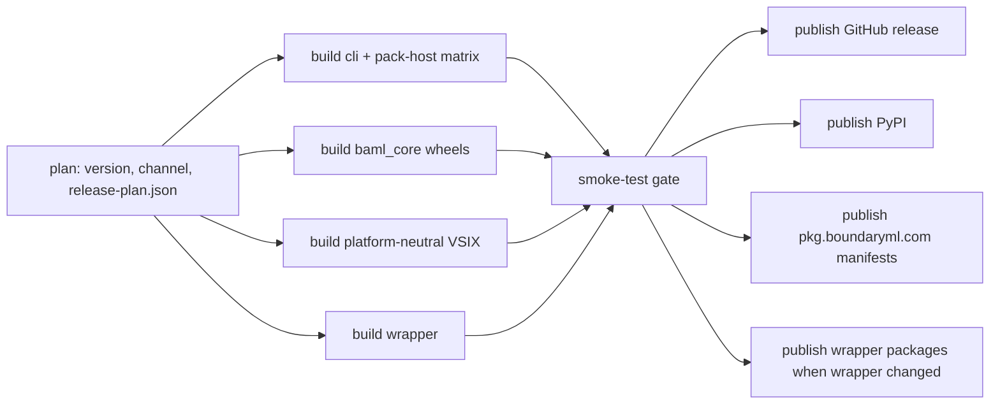

# BAML Language Release Pipeline Alignment

We are replacing the current alpha-era release flow with a clean, unified release system for the new BAML language.

The new system keeps Engine releases working as they do today, while giving BAML language users a modern install and update experience:

- `brew install baml` installs the lightweight `baml` wrapper and bootstraps the latest canary BAML toolchain.
- `baml toolchain use nightly` lets users follow every successful `canary` branch release.
- `baml toolchain update` updates the active language toolchain.
- `baml self-update` updates only the wrapper.
- The VSIX uses the locally installed `baml` command and does not bundle its own platform-specific CLI.

The release pipeline builds fast by fanning out independent jobs, then fans in through one smoke-test gate before publishing. The publishing jobs are separate and rerunnable, but they all consume the same release plan. That gives us speed without creating separate release systems.

This design is intentionally future-looking. It does not implement `apt` or `dnf` now, but it creates the right primitives for them later: HTTP-hosted manifests, immutable per-version artifacts, checksums, and a package-manager-friendly wrapper.

## Why We Are Doing This

Today, BAML language releases grew out of the alpha flow. It works, but it is too easy to accumulate adjacent systems:

- GitHub prerelease naming from the alpha era.
- Homebrew/AUR packaging that installs the language CLI directly.
- Python publishing that can drift from the CLI/toolchain version.
- VSIX packaging that currently bundles a platform-specific CLI.
- A standalone `pkg.boundaryml.com` publishing path.

For the Turing-complete BAML language, we need one coherent release graph and one source of version truth. The goal is not necessarily "one giant workflow file." The goal is one release plan, one version decision, one manifest system, and no independent publishing paths that can contradict each other.

Engine remains separate. Existing Engine users keep their current release pipeline.

## What Success Looks Like

For users:

- New users can install BAML with one package-manager command and get a working canary CLI plus an explicit IDE setup follow-up when relevant.
- Nightly users can stay on the latest successful `canary` branch commit.
- Canary users are not exposed to nightly releases unless they opt in.
- Project teams can pin a toolchain in `baml.toml`.
- The VS Code/Cursor/Windsurf/other IDE extension uses the installed `baml` command, so it follows the same toolchain selection as the CLI.

For maintainers:

- Canary release intent is explicit and human-controlled.
- Nightly release versions are automatic and never manually edited.
- Python, VSIX, Rust, Node, and future SDK version surfaces are stamped from the same release plan.
- The pipeline is fast because build jobs run in parallel.
- Publishing is safe because all outputs pass through one smoke-test gate.
- Failed publish reruns are repairable.
- Rollback is a code revert, not a long-lived kill switch.

For the codebase:

- Old alpha-era workflows are deleted or integrated.
- Package managers install a wrapper, not a language toolchain.
- The wrapper and the toolchain have separate lifecycles.
- `BAML_RELEASE_VERSION` is removed as alpha-era plumbing.
- `baml-pack-host` stays internal and is verified through `baml pack`, not exposed as a user-facing CLI.

## Product Model

The release system has two products.

| Product | What It Is | How Often It Changes | Who Installs It |
|---|---|---|---|
| `baml-wrapper` | Small `baml` binary that selects, installs, updates, and forwards to toolchains | Rarely | Homebrew, AUR, curl installer |
| `baml-toolchain` | Versioned language payload: `baml-cli`, `baml-pack-host`, and VSIX artifact | Every nightly and canary release | Installed by the wrapper |

This split is the core of the design.

Package managers publish the wrapper. The wrapper fetches toolchains from manifests. A nightly/canary language release does not require a Homebrew or AUR package update.

## User Stories

### New Canary User

As a new user, I want to run:

```bash
brew install baml
```

and end up with:

- `baml` on my path.
- the current canary toolchain installed under the wrapper-managed toolchain directory.
- no automatic editor extension install as a side effect.
- a clear follow-up command such as `baml ide install --cursor` when BAML can detect a supported IDE terminal.

The package artifact itself still contains only the wrapper. The canary toolchain is installed through the normal wrapper-owned manifest flow.

### Existing Canary User

As an existing canary user, I want:

```bash
baml toolchain update
```

to update my active canary language toolchain, not the wrapper binary.

If I installed the wrapper through Homebrew or AUR, wrapper updates come from:

```bash
brew upgrade baml
```

or the equivalent package-manager command.

### Nightly User

As a nightly user, I want:

```bash
baml toolchain use nightly
baml toolchain update
```

to keep me on the newest successful `canary` branch release. Every successful `canary` branch CI run publishes a nightly toolchain.

Nightly versions are always ahead of the latest canary patch line. If canary is `0.11.0`, nightly releases are `0.11.1-nightly.YYYYMMDD.a`, `0.11.1-nightly.YYYYMMDD.b`, and so on.

### Project Maintainer

As a maintainer of a BAML project, I want to pin a known-good toolchain in `baml.toml`:

```toml
[toolchain]
channel = "nightly"
```

or:

```toml
[toolchain]
version = "0.11.1-nightly.20260522.a"
```

The wrapper resolves the toolchain before forwarding to the selected toolchain payload.

### IDE User

As an IDE user, I want:

```bash
baml ide install
```

to install the VSIX from my active BAML toolchain.

`baml ide install` works because the wrapper forwards the command to the selected toolchain payload. Common editors should support flags such as `--cursor`, `--code`, `--windsurf`, and `--all` so users can avoid an interactive prompt. The VSIX launches `baml lsp` using the configured `baml` path or `baml` from `PATH`; it does not bundle a platform-specific CLI/LSP.

### Release Engineer

As a release engineer, I want a release run to:

1. Decide the version once.
2. Build everything in parallel.
3. Smoke-test the outputs.
4. Publish only after the fan-in gate passes.
5. Be safely rerunnable if a publish step fails halfway.

That is the release graph.

## Release Channels

There are two channels.

| Channel | Trigger | Version Example | Notes |
|---|---|---|---|
| Canary | A change to `baml_language/release.toml` canary intent | `0.11.0` | Human-controlled |
| Nightly | Every successful `canary` branch CI run | `0.11.1-nightly.20260522.a` | Automatic |

There is no `stable` channel in v1. Daily/commit-following users subscribe to `nightly`; canary remains the human-controlled channel.

GitHub tags and releases are outputs of the release process. They are not release triggers.

This matters because tag-triggered releases can self-trigger duplicate runs. The new design avoids that class of bug entirely.

## Versioning Story

### Source Of Truth

The only human-edited source of truth for BAML language canary intent is:

```text
baml_language/release.toml
```

with:

```toml
[release]
canary_version = "0.11.0"
```

Nightly versions are derived from that canary version. No one manually edits a nightly version. We update this file with a new repo command; it updates this file, playground, SDKs, and related version surfaces.

### Release Plan

The CI plan job produces one `release-plan.json`. Every build job consumes that same artifact.

Example:

```json
{
  "schema": 1,
  "channel": "nightly",
  "canary_version": "0.11.0",
  "canonical_version": "0.11.1-nightly.20260522.a",
  "pypi_version": "0.11.1.dev2026052200",
  "git_tag": "baml-language-0.11.1-nightly.20260522.a"
}
```

This prevents macOS, Linux, Windows, Python, VSIX, Rust, Node, and future SDK jobs from recomputing versions independently.

### Compatibility Across SDKs

Most ecosystems can use the canonical SemVer string directly:

```text
0.11.1-nightly.20260522.a
```

PyPI cannot. Python uses PEP 440, so nightly releases are translated:

| Canonical | PyPI |
|---|---|
| `0.11.0` | `0.11.0` |
| `0.11.1-nightly.20260522.a` | `0.11.1.dev2026052200` |
| `0.11.1-nightly.20260522.b` | `0.11.1.dev2026052201` |

Python users still see the canonical BAML version from `baml_core.__version__` and `baml_core.get_version()`. PyPI stores the PEP 440 form because it must. All other foresseable SDKs don't have any issues with this system.

### Deprecated Version Plumbing

The current alpha flow uses `BAML_RELEASE_VERSION` as a compile-time override. The new design removes it.

Instead, the version script stamps explicit version surfaces from `release-plan.json`, including a shared Rust `baml_version` module. Public BAML version APIs must not read Cargo package metadata such as `CARGO_PKG_VERSION`.

## Install And Update Behavior

| Action | Result |
|---|---|
| `brew install baml` | Installs wrapper, bootstraps canary toolchain, and may print an explicit `baml ide install` follow-up |
| `curl .../install.sh` | Installs wrapper, bootstraps requested canary/nightly/version |
| `baml toolchain install canary` | Installs current canary toolchain without necessarily making it active |
| `baml toolchain install nightly` | Installs current nightly toolchain without necessarily making it active |
| `baml toolchain use canary` | Selects canary as the active default and installs the resolved toolchain if missing |
| `baml toolchain use nightly` | Selects nightly as the active default and installs the resolved toolchain if missing |
| `baml toolchain update` | Updates active language toolchain |
| `baml self-update` | Updates wrapper only, refused for Homebrew/AUR installs |
| `baml ide install` | Installs IDE extension from active toolchain |

Wrapper upgrades are idempotent. If a user is already on nightly or has an explicit toolchain, a package-manager wrapper upgrade must not reset them back to canary.

## CI/CD Shape

The pipeline is optimized around a fan-out/fan-in model.



The publish jobs are separate so they can be retried independently. They do not make independent version decisions.

The smoke gate checks:

- CLI version.
- Python canonical version.
- Python PyPI version.
- VSIX archive validity.
- archive layout.
- checksums.
- `baml pack` exercising `baml-pack-host`.

If the gate fails, nothing publishes.

## Hosting And Manifests

We reuse the existing `pkg.boundaryml.com` infrastructure.

`pkg.boundaryml.com` is the directory:

- `manifest/v1/canary.json`
- `manifest/v1/nightly.json`
- `manifest/v1/version/<version>.json`
- `manifest/v1/wrapper.json`
- `install.sh`
- `install.ps1`

GitHub Releases are the binary storage layer:

- toolchain archives.
- wrapper archives.
- checksums.
- VSIX artifacts.

This split supports future package repositories such as `apt` and `dnf` because the system already has HTTP-hosted metadata, immutable artifacts, and checksums.

## Safety And Edge Cases

### Reruns Are Idempotent

Per-version manifests are write-once by content:

- missing object: upload.
- existing identical object: continue.
- existing different object: fail.

Mutable pointers such as `canary.json`, `nightly.json`, and `wrapper.json` can be repaired on rerun. This handles the failure case where `version/<v>.json` uploaded successfully, but the job failed before updating the channel pointer.

### Nightly Stays Ahead Of Canary

Nightly is derived from the next patch after canary.

If canary is:

```text
0.11.0
```

then nightly is:

```text
0.11.1-nightly.YYYYMMDD.a
```

This matters for PyPI because `0.11.0.dev...` sorts before canary `0.11.0`. Nightly subscribers should not accidentally fall behind canary.

### Letter Overflow Is Explicit

Nightly suffixes use `a` through `z` per UTC day. If we ever exceed `z`, the release job fails loudly. The operational answer is to cut a new canary version or wait for the next day. We are not adding a hidden second suffix scheme in v1.

### No Double Publishing During Cutover

The replacement lands on a dedicated branch. We merge it to `canary` only when it contains the complete replacement. We do not run the old alpha release system and the new release graph as two production systems side by side.

Rollback is a code revert:

```bash
git revert <merge-commit>
```

### Tags Do Not Trigger Releases

GitHub tags/releases are records created by the publish jobs. They do not trigger BAML language releases. This prevents self-triggered duplicate release runs.

### Package Managers Do Not Own Toolchain Versions

Homebrew and AUR versions track the wrapper version. They do not track the BAML language version.

Nightly users get nightly through manifests, not package-manager churn.

### VSIX Is Platform Neutral

The release-built VSIX does not bundle `baml-cli`. It uses the user's installed `baml` command and therefore respects:

- `BAML_VERSION`.
- `baml.toml [toolchain]`.
- the user's default channel.
- exact version pins.

The VSIX does not need to be reinstalled for every BAML toolchain release. It checks compatibility by protocol metadata:

- LSP compatibility is validated from the normal LSP `initialize` result.
- Playground compatibility is validated lazily when the playground WebSocket connects.
- The compatibility gate is integer protocol ranges and capability flags, not exact BAML semver equality.
- These checks must not spawn extra `baml` commands or hit the network during editor startup.

Marketplace publishing is deferred, but every toolchain release already builds and archives the VSIX artifact.

### Python Publishing Is Handled Carefully

`release-sdk.yaml` currently owns Python `baml_core` publishing and PyPI trusted publishing may be bound to that workflow identity. The implementation must resolve whether to retain that file as a focused Python publish workflow or fold/rename it after updating PyPI trusted-publisher configuration.

It must not remain an independent, separately versioned release path.

## What We Are Removing

The replacement branch removes or integrates the old adjacent systems:

- `release-baml-language-alpha.yml`
- `release-pkg-boundaryml-com.yml`
- `release-cli.yaml`
- `BAML_RELEASE_VERSION` version injection.
- AUR templates that package `baml-cli`.
- VSIX-bundled `baml-cli`.
- standalone release paths that publish outside the release graph.

`release-sdk.yaml` must be integrated deliberately because PyPI trusted publishing may be bound to that workflow identity. It can stay as a focused Python publish workflow invoked by the release graph, or be folded only after the PyPI trusted-publisher binding is updated or validated.

## What We Are Not Doing In V1

We are not:

- changing the Engine release pipeline.
- building `apt` or `dnf` repositories yet.
- publishing the new VSIX to the Marketplace yet.
- adding code signing/notarization yet.
- adding yanking.
- adding a runtime kill switch or long-lived dual pipeline.

Bad releases are handled by publishing a newer fixed version and moving the channel pointer forward.
