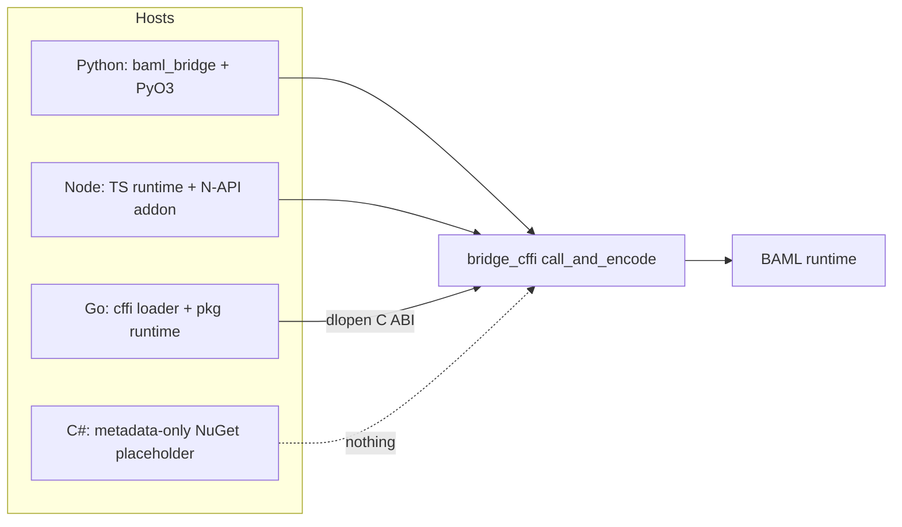
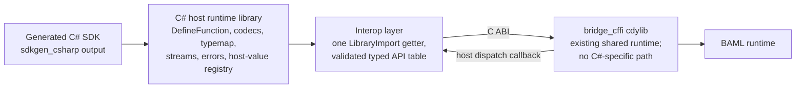

This is the completed canonical C# bridge design. All design questions 1–20
are resolved. The implementation target branch and commit are deliberately
recorded separately in `verification-gates.md`, because this design is not
limited to the historical checkout on which the discussion began.

### Summary of change request

Build a C# bridge for BAML: the layer that lets C# programs call BAML functions and move values, errors, callbacks, streams, and other behavior across the language boundary. Python is the reference bridge; every capability in the Python completeness table should be exposed and tested in C# wherever the language allows it. The bridge does not introduce a C#-specific Rust runtime path: it consumes the shared `bridge_cffi` C ABI exactly like the Go bridge does. Compiled evidence may still require shared compiler, ABI, protocol-comment, or cross-language correctness fixes; those changes remain language-neutral, receive their own regression coverage, and never become an alternate C# runtime. Most of the work is in generating C# bindings (a new `sdkgen_csharp` generator), a C# host runtime library, ported parity tests wired into the shared `sdk_tests` harness, and NuGet packaging published from nightly CI.

### Current State

- C# developers cannot call BAML functions at all. There is no C# SDK, no generated bindings, no way to move values across the boundary.
- The only C# artifact in the repo is a metadata-only NuGet placeholder (`languages/csharp/baml`) whose README says the package is not ready for use.
- Python is a complete reference bridge; TypeScript/Node is complete; Go has a working C-ABI consumer layer but a stub generator. Each demonstrates a different host-integration style (PyO3, N-API, dynamic C ABI loading).
- The shared SDK test harness runs Python and TypeScript fixture suites under nextest and CI; there is no C# leg.
- Nightly releases publish precompiled Python wheels and Node platform packages; nothing is published for .NET.

### Desired End State

- A C# user can `dotnet add package baml-bridge` at a published nightly version without cloning the repo or compiling Rust locally.
- `baml generate` (the compiler CLI) emits deterministic `.g.cs` SDK source directly into an existing .NET project: namespaces, functions (sync + async), classes, enums, alias-aware projected signatures/descriptors, one ahead-of-time bytecode array/bootstrap, and targeted diagnostics for unsupported shapes.
- Generated C# functions call through the existing `bridge_cffi` C ABI: protobuf-encoded requests in, `BamlOutboundResult` envelopes out, with values, errors, panics, cancellation, callbacks, streams, and generics crossing the boundary with the same semantics as Python.
- `cargo nextest run -p sdk_test_csharp` builds the native library, generates fixture SDK projects, and runs the ported C# test suite; CI picks it up in the SDK matrix.
- A `state-of-csharp-completeness` capability checklist (copied from the Python table) exists in this task's docs and is kept up to date as capabilities land and their parity tests pass.
- C# tests mirror Python tests: same names, cases, inputs, and assertions wherever the capability is shared.
- After implementation, parity validation, and packaging are working, the project's final phase produces canonical user-facing documentation for idiomatic C#-BAML code. The project is not complete until those examples compile in CI and state both the supported patterns and the important non-goals/limitations.

### What we're not doing

- **No C#-specific Rust runtime path.** C# uses the shared `bridge_cffi` and
  `bridge_ctypes` contracts. Evidence-backed fixes to shared compiler or bridge
  correctness are permitted only as language-neutral changes with
  cross-language regression coverage; C# does not gain private exports,
  schemas, execution semantics, or a fallback runtime.
- No WASM/Blazor target — that path belongs to the WASM boundary, not this bridge.
- No .NET Framework, Mono, or Unity support — modern .NET only (exact TFM is a design question below).
- No engine-v0.2xx compatibility features beyond what Python v1 has (no Collector, TypeBuilder, OnTick, etc. — those are ❌/planned in the Python table too).
- No automated cross-language test-suite comparison tool — the task doc says one will exist; we just keep names/structure aligned so it can check us.
- Capabilities that are ❌ in Python (BAML closures inbound, type reference values, interfaces, cyclic objects) stay unsupported; C# parity targets Python's ✅ rows.

### Proposed End State Architecture

Before:



After:



The C# stack mirrors the layering every bridge shares — generated code owns the public shape, a host runtime package owns ergonomics and reconstruction, an interop layer owns VM integration — but takes Go's route across the boundary (exported C ABI) rather than Python's PyO3 or Node's N-API:

```text
baml_language/sdks/csharp/
├── bridge_csharp/                  # .NET solution for the host runtime
│   ├── src/
│   │   ├── Cffi/                   # P/Invoke declarations, library resolver,
│   │   │                           #   [UnmanagedCallersOnly] callback shims
│   │   ├── Proto/                  # Google.Protobuf codecs for the shared
│   │   │                           #   bridge_ctypes .proto contracts
│   │   ├── ...                     # DefineFunction factory, call context &
│   │   │                           #   cancellation, typemap, BamlStream,
│   │   │                           #   media wrappers, BamlHandle, errors,
│   │   │                           #   host-value registry
│   └── tests/                      # unit tests ported from sdks/python/tests
└── sdkgen_csharp/                  # Rust generator crate (workspace member,
    ├── src/lib.rs                  #   registered in baml_cli generate dispatch)
    ├── src/names.rs                # typed BAML identity -> allocated C# names;
    │                               #   wire names and file routes stay separate
    ├── src/routing.rs              # BAML namespace -> C# namespace/file routing
    ├── src/translate_ty.rs         # BAML Ty -> C# type syntax
    └── src/leaf.rs                 # per-leaf rendering: functions, classes,
                                    #   enums, aliases, typemap registration

baml_language/sdk_tests/crates/csharp/   # sdk_test_csharp crate + customizable
                                         #   overlays + setup.sh / setup.ps1
```

Call path (sync and async share everything up to the wait):

```text
generated SDK bootstrap compiled into the application/library assembly
  Baml.Generated.V1.BamlGeneratedContract.RegisterProgram(
    contractVersion, bytecode, fingerprint, generatedVersion,
    requiredBridgeVersion, frozenRegistry) -> opaque BamlGeneratedProgram
    v1: first fingerprint initializes; same fingerprint reuses; different fingerprint throws
    Cffi.InitializeRuntimeFromBytecode(bytecode)
      empty owned Buffer -> success; non-empty Buffer -> UTF-8 initialization error

generated C# callable
  opaque BamlGeneratedProgram.Call / CallAsync with registry-owned function,
  argument, and generic-binding tokens (bind args, UNSET filtering, generics)
    Proto.EncodeCallArgs                     # CallFunctionArgs protobuf
      functionCallId: u64                    # encoded native function-call identity
    Cffi.InvokeCallFunction(..., callbackId) # validated API-table call; callbackId is u32
      ... bridge_cffi::call_and_encode ...   # existing shared path
    registered [UnmanagedCallersOnly] callback delivers result bytes
      completes a TaskCompletionSource keyed by callbackId
  Proto.DecodeCallResult                     # ok -> typemap reconstruction
                                             # error -> BamlErrorException
                                             # panic -> BamlPanicException
both forms: final CancellationToken participates in both identity lifetimes;
            cancellation calls cancel_function_call(functionCallId)
sync form: GetAwaiter().GetResult() on the same context-free Task pipeline
async form: Task<T> returned directly to the caller
```

The C ABI surface starts from Go's symbol list (`baml_language/sdks/go/bridge_go/cffi/lib.go:30-48`) and adds the bytecode initializer merged in [BoundaryML/baml#4009](https://github.com/BoundaryML/baml/pull/4009): `version`, `initialize_runtime_from_bytecode`, `call_function`, `register_callback`, `cancel_function_call`, `free_buffer`, `flush_events`, `baml_handle_clone`/`release`, media constructors, and the host-value trio (`register_host_dispatch_callback`, `register_host_release_callback`, `complete_host_call`). The generated v1 SDK does not use `create_baml_runtime` as a production or silent fallback; source-map initialization may exist only in an explicitly separate development harness and cannot change the public bootstrap contract resolved in question 13.

Baseline type mapping (details refined in the questions below):

| BAML shape | C# |
| --- | --- |
| int / float / bigint | `long` / `double` / `System.Numerics.BigInteger` |
| string / bool / bytes | `string` / `bool` / `ReadOnlyMemory<byte>` |
| standalone normalized `null` type | `BamlValue`, with only `BamlValue.Null` valid |
| list / map | `IReadOnlyList<T>` / `IReadOnlyDictionary<K, V>` with owned read-only decode snapshots |
| nullable with a statically known C# representation | `T?` (nullable reference/value types) |
| nullable unconstrained type parameter or reified nullable generic argument | `BamlNullable<T>` |
| defaulted function parameter | `BamlOptional<T>` around the fully translated parameter type |
| structural union | `BamlUnion<T0, ..., TN>` with canonical arm order and an explicit active-case tag |
| type alias / literal | underlying CLR type; typed codecs retain alias/literal validation metadata |
| unknown / dynamic value | immutable typed `BamlValue`; never implicit `object?` reflection |
| opaque handle | `BamlHandle` |
| image / audio / pdf / video | immutable `BamlImage` / `BamlAudio` / `BamlPdf` / `BamlVideo` managed values |
| class / generic class | generated class / generated generic class `Foo<T>` |
| enum | native C# `enum : long` with stable explicit discriminants and generated string-wire codecs |
| stream | `BamlStream<TPartial, TFinal>`; asynchronous partial iteration plus a separately typed final result |
| `@stream.with_state` field | `BamlStreamState<T>` with `Pending` / `Incomplete` / `Complete` state |
| built provider request | immutable `BamlHttpRequest` snapshot with `ToHttpRequestMessage()` adapter |
| host callable | `Func<..., CancellationToken, Task<TResult>>` or `Func<..., CancellationToken, Task>` |

### Managed bridge type inventory

The bridge will necessarily add a small managed vocabulary where C#'s native type system or runtime model cannot preserve a BAML distinction. These types are part of the bridge design and compatibility surface; they must not emerge incidentally from whichever implementation helper is convenient at the time.

All user-facing public entries below live in the `Baml` namespace of the
`Baml.Bridge` assembly resolved by question 12. A separately versioned,
editor-hidden `Baml.Generated.V1` namespace is the narrow cross-assembly
generated-code contract resolved below; it never appears in a generated user
signature. The user-facing inventory is organized by purpose:

| Type/category | Purpose | Where it appears |
| --- | --- | --- |
| `BamlOptional<T>` | Caller-presence state: `Unset` or `Set(T)` | Only defaulted inbound BAML function parameters; never an outbound BAML value |
| `BamlNullable<T>` | BAML value state: `Null` or `Value(T)` when native C# `T?` cannot preserve or reify generic nullability | Fields, parameters, results, collection elements, nested generic positions, and nullable generic bindings as required by semantic type translation |
| `BamlUnion<T0, ..., TN>` (arities 2–32) | Structural one-of-N value with a stable canonical arm order and explicit active case | Fields, parameters, results, collection elements, and nested generic arguments containing non-null union types |
| `BamlValue`, `BamlValueKind`, `BamlTypeDescriptor`, and `BamlTypeDescriptorKind` | Immutable type-erased BAML value plus the typed identity needed to inspect and round-trip it without guessing from CLR values | Generated positions whose BAML type is `unknown`, decoded error values, and explicit dynamic-value construction |
| `BamlStream<TPartial, TFinal>` | Asynchronous partial iteration plus separately typed final-result, cancellation, completion, disposal, and error state | Generated streaming functions |
| `BamlStreamState<T>` and `BamlStreamStateKind` | Stream-progress state independent of value nullability and call-site omission | Generated partial fields transformed by `@stream.with_state` |
| `BamlHttpRequest` | Immutable owned snapshot of a rendered provider HTTP request, without sending it | Generated build-request companions and application-owned transport integration |
| `BamlClient`, `BamlClientType`, and `BamlRetryPolicy` | Immutable structural projection of `baml.llm.Client`, its routing kind, and retry metadata without registry discovery or provider credentials | Defaulted per-call client arguments on generated LLM execution/stream/build-request forms |
| `BamlHandle` | Managed ownership of one reference to an opaque native or host-backed resource through an internal `SafeHandle` | Generated signatures containing opaque resource values |
| `BamlImage`, `BamlAudio`, `BamlPdf`, and `BamlVideo` | Immutable managed URL-or-owned-bytes media descriptors without public native lifetime | Generated signatures containing BAML media types |
| `BamlException` and its execution, initialization, interop, and type-mapping subclasses | Stable managed failure taxonomy using idiomatic `Exception` suffixes | Thrown or used to fault tasks/streams at bridge boundaries |
| `BamlOperationCanceledException` and `BamlCancellationOrigin` | Cancellation that remains catchable as `OperationCanceledException` while preserving caller/engine/disposal origin | Ordinary calls, streams, and callback-mediated execution |
| `BamlTrace` and `BamlPanicInfo` | Immutable wire-faithful diagnostics: ordered rendered trace lines and the decoded panic value/exit discriminator | Properties on the corresponding public exception types |
| Generated classes and enums | Program-specific projections of nominal BAML types | Generated SDK namespace; these are not host-runtime primitives |

The raw `BamlBridge`/`BamlProgram` bootstrap and dispatch implementation,
Protobuf adapters, callback registries, call-id allocation, and all concrete
runtime codec implementations remain internal. `BamlTypeDescriptor` is public only because
`BamlValue` gives dynamic-value users a concrete need to inspect and preserve
BAML identity; it is not a second generic invocation API. Supporting ordinary
unconstrained generics does **not** justify another public `BamlGeneric<T>`
wrapper.

Generated source compiles into an arbitrary consumer assembly and therefore
cannot call runtime `internal` members or rely on `InternalsVisibleTo`. The
versioned cross-assembly seam is public CLR metadata in
`Baml.Generated.V1`, with every declaration annotated
`EditorBrowsable(EditorBrowsableState.Never)` and documented as generated-code
infrastructure rather than an application API:

- `BamlGeneratedContract.Version` and
  `CreateRegistryBuilder(requestedVersion)` fail closed before registration
  when generated/runtime contract versions differ.
- `BamlGeneratedRegistryBuilder`, `BamlGeneratedRegistry`, and strongly typed
  `BamlGeneratedType<T>` tokens declare and freeze the exact program-known
  codec graph. Registration is explicit, deterministic, duplicate-checked,
  and statically referenced by generated bootstrap code.
- Opaque registry-owned tokens declare every function variant, receiver and
  argument wire identity, result shape, stream partial/final shape, generic
  type parameter, and closed type binding. Ordinary sync/async, build-request,
  stream, and stream-request variants are distinct typed declarations. The
  generated application call site supplies tokens only; it never supplies a
  raw BAML FQN, raw wire argument name, arbitrary result descriptor, or
  application-created binding map.
- Builder/registry provenance is part of token validity, not merely an
  integer or string identity. Default tokens, tokens from another builder,
  duplicate type identities, duplicate `(BAML FQN, variant)` identities,
  contradictory result/stream/binding identities, mutation after freeze, and
  a token used with another program fail before native dispatch.
- `IBamlGeneratedCodec<T>` plus `BamlGeneratedCodecContext` is the only
  generator-implemented codec interface. Generated implementations encode and
  decode fields explicitly by original wire identity and recursively use typed
  tokens for nested generated shapes.
- `BamlGeneratedValue` and `BamlGeneratedObject` are opaque boundary carriers
  created/read through the context. They do not expose Protobuf messages,
  arbitrary descriptor construction, serializer conventions, reflection
  handles, or a second user-facing dynamic-value API.
- The V1 context has an exhaustive carrier vocabulary for null, bool, checked
  BAML int, finite float, bigint, string, copied bytes, ordered list, ordered
  map, exact-wire enum, generated object/class, active-case union, dynamic
  `BamlValue`, immutable media, and typed opaque handle values. Omission is
  represented only by an optional argument/field token and remains distinct
  from an explicitly encoded null.
- `BamlGeneratedContract.RegisterProgram` is the only public-hidden bytecode
  entry. It validates the contract schema, exact generated/required managed
  bridge version, frozen registry ownership, nonempty bytes, and lowercase
  SHA-256 before reaching the internal process-global program registrar.
  `BamlGeneratedProgram` exposes only token-based generated operations.
  Its async path is the shared context-free operation pipeline, so a winning
  `CancellationToken` produces a Canceled task with the same token rather than
  a Faulted task.

This tokenized seam is a second-audit amendment to the earlier illustrative
raw `BamlBridge.RegisterProgram` and
`BamlProgram.Call<T>(string, Kwargs, ...)` spellings. Those spellings would
have made arbitrary bytecode, FQNs, descriptors, and argument dictionaries a
normal public API and could not enforce cross-assembly generated provenance.
They are non-normative and must not be implemented as public application
entry points.

The runtime may refine private storage behind these declarations, but it does
not add public setters, arbitrary factory hooks, `Type`/member-name lookup, or
general service location. A breaking generated-code contract adds a parallel
versioned namespace and compatibility handling; it never mutates V1 in place.
Users can technically reference public CLR metadata hidden from IntelliSense,
so runtime validation remains mandatory and the seam participates in package
binary-compatibility review. It is not a security boundary.

`BamlClient` is the one standard-library structural value promoted into the
bridge-owned user vocabulary because current Python parity exposes the
defaulted per-call `baml.llm.Client` argument. It snapshots `Name`,
`BamlClientType`, recursive `IReadOnlyList<BamlClient>` sub-clients,
`BamlRetryPolicy?`, and the checked BAML integer counter; it also provides
`FromShorthand(string)`. `BamlClientType : long` has explicit nonzero
`Primitive`, `Fallback`, and `RoundRobin` members with exact BAML enum wire-name
mapping. `BamlRetryPolicy` snapshots checked `MaxRetries`, nullable checked
initial/max delay milliseconds, and nullable `double` multiplier. These values
have immutable structural equality/hash semantics. They contain no provider
credentials, environment resolution, HTTP transport, registry enumeration, or
mutable retry execution state; native BAML remains responsible for resolving
the supplied description and applying defaults. Omitting
`BamlOptional<BamlClient>` preserves the BAML-declared client default.

Bridge-owned public enums freeze their underlying types and numeric values:

```csharp
public enum BamlValueKind : int
{
    Null = 0, Bool = 1, Int = 2, Float = 3, BigInt = 4,
    String = 5, Bytes = 6, List = 7, Map = 8, Enum = 9,
    Class = 10, Union = 11, Media = 12, Handle = 13,
}

public enum BamlTypeDescriptorKind : int
{
    Unknown = 0, Null = 1, Bool = 2, Int = 3, Float = 4,
    BigInt = 5, String = 6, Bytes = 7, List = 8, Map = 9,
    Enum = 10, Class = 11, Union = 12, Media = 13, Handle = 14,
}

public enum BamlStreamStateKind : int
{
    Pending = 0, Incomplete = 1, Complete = 2,
}

public enum BamlClientType : long
{
    Primitive = 1, Fallback = 2, RoundRobin = 3,
}

public enum BamlCancellationOrigin : int
{
    Caller = 0, Engine = 1, StreamDisposed = 2,
}
```

These values are managed ABI identities, not BAML wire identities. Members
are never renumbered or reused; a future member is appended with a new value.
Unknown numeric values fail at construction/decode instead of being accepted
as an extensibility case. `BamlValueKind` describes an actual payload and
therefore has exactly the fourteen constructible value cases.
`BamlTypeDescriptorKind` independently describes a BAML type and adds the
non-value top type `Unknown`; a `BamlValue` can never have
`BamlValueKind.Unknown`. Generated BAML enums follow the separate
identity-derived discriminant contract from question 7 and still serialize by
exact BAML enum/variant names.

For every public bridge-owned type, the implementation design must specify: its state model and zero/default state; construction and conversion rules; inbound and outbound wire behavior; equality and hashing; ownership/disposal; thread safety; nullable annotations; trimming/NativeAOT limits; versioning compatibility; and a compile-time plus runtime test matrix. Public `Baml*` names also participate in the typed allocator's generator-owned reservation set.

#### `BamlOptional<T>` and `BamlNullable<T>` are orthogonal

These wrappers preserve different information and must not be aliases for one another:

```text
BamlOptional<T>: Unset | Set(T)
                  ^
                  whether the caller supplied a defaulted argument

BamlNullable<T>: Null | Value(T)
                  ^
                  the value allowed by the BAML type itself
```

Composing them is intentional. A defaulted nullable unconstrained generic has three meaningful states without collapsing any pair:

| Managed value | BAML call meaning |
| --- | --- |
| `BamlOptional<BamlNullable<T>>.Unset` | Omit the argument; evaluate its BAML default |
| `BamlOptional<BamlNullable<T>>.FromValue(BamlNullable<T>.Null)` | Supply explicit BAML null |
| `BamlOptional<BamlNullable<T>>.FromValue(BamlNullable<T>.FromValue(value))` | Supply a concrete `T` value |

The semantic translation rules are:

| BAML position | C# projection |
| --- | --- |
| required `value: T` | `T value` |
| required `value: T?` for unconstrained `T` | `BamlNullable<T> value` |
| defaulted `value: T = ...` | `BamlOptional<T> value = default` |
| defaulted `value: T? = ...` for unconstrained `T` | `BamlOptional<BamlNullable<T>> value = default` |

Native nullable syntax remains preferred when the translated operand is statically known in a non-reified position: `string?`, `long?`, `Foo?`, and `IReadOnlyList<T>?` are valid projections. The special wrapper is required when nullable is applied directly (including through aliases) to an unconstrained type parameter, because closing C# `T?` with `T = int` produces `int`, not `int?`. It is also the explicit reified generic binding for a nullable reference operand because `typeof(string?)` and `typeof(string)` are the same CLR type. Translation makes this decision from the resolved semantic type rather than source spelling and applies it recursively, so `IReadOnlyList<T?>` becomes `IReadOnlyList<BamlNullable<T>>`, and a caller binds a generic BAML `T` to `string?` with the closed CLR type `BamlNullable<string>`.

Decision: `BamlNullable<T>` is a public readonly two-case value type owned by the host-runtime package. It is used exactly where native C# nullable syntax cannot preserve or reify BAML generic nullability: a nullable unconstrained generic position or a nullable closed generic binding such as BAML `string?` represented by CLR `BamlNullable<string>`. Its permanent zero/default state is `Null`, so it has no invalid or uninitialized third state. Repeated BAML nullability is semantically normalized; a closed CLR shape such as `BamlNullable<BamlNullable<string>>` is rejected when its distinct managed states would collapse to the same BAML null.

##### Normative `BamlNullable<T>` shape

The exact namespace follows the package-identity decision. The semantic API is fixed as follows; XML documentation text and exception wording may be refined without changing behavior:

```csharp
public readonly struct BamlNullable<T> : IEquatable<BamlNullable<T>>
{
    private readonly T _value;
    private readonly bool _hasValue;

    private BamlNullable(T value)
    {
        _value = value;
        _hasValue = value is not null;
    }

    public bool IsNull => !_hasValue;

    public T Value => !IsNull
        ? _value
        : throw new InvalidOperationException("The BAML value is null.");

    public static BamlNullable<T> Null => default;

    public static BamlNullable<T> FromValue(T value) => new(value);

    public bool TryGetValue(
        [System.Diagnostics.CodeAnalysis.MaybeNullWhen(false)] out T value)
    {
        value = _value;
        return !IsNull;
    }

    public TResult Match<TResult>(
        Func<TResult> onNull,
        Func<T, TResult> onValue)
    {
        ArgumentNullException.ThrowIfNull(onNull);
        ArgumentNullException.ThrowIfNull(onValue);
        return IsNull ? onNull() : onValue(_value);
    }

    public static implicit operator BamlNullable<T>(T value)
        => FromValue(value);

    public bool Equals(BamlNullable<T> other)
        => IsNull == other.IsNull
            && (IsNull || EqualityComparer<T>.Default.Equals(_value, other._value));

    public override bool Equals(object? obj)
        => obj is BamlNullable<T> other && Equals(other);

    public override int GetHashCode()
        => IsNull
            ? 0
            : HashCode.Combine(1, EqualityComparer<T>.Default.GetHashCode(_value!));

    public static bool operator ==(BamlNullable<T> left, BamlNullable<T> right)
        => left.Equals(right);

    public static bool operator !=(BamlNullable<T> left, BamlNullable<T> right)
        => !left.Equals(right);

    public override string ToString()
        => IsNull ? "<null>" : _value?.ToString() ?? "<null>";
}

public static class BamlNullable
{
    public static BamlNullable<T> Null<T>()
        => BamlNullable<T>.Null;

    public static BamlNullable<T> FromValue<T>(T value)
        => BamlNullable<T>.FromValue(value);
}
```

Required invariants:

- `default(BamlNullable<T>)`, `new BamlNullable<T>()`, `BamlNullable<T>.Null`, and `BamlNullable.Null<T>()` are all BAML null. No parameterless struct constructor may change that across versions.
- `FromValue(default(T))` is `Value(default(T))` for non-nullable value types (`0`, `false`, default enums and structs), but is `Null` when the supplied value is actually CLR null. BAML has no distinct "non-null value containing a null reference" state to preserve.
- `Value` throws in the null case. `TryGetValue` returns `false` for null and `true` for every value case, including default value-type values.
- `Match` invokes exactly one branch. Null delegates are rejected before dispatch so branch choice does not change argument validation behavior.
- The only implicit conversion is from `T` to `BamlNullable<T>`. There is no implicit conversion back to `T`, and no conversion between `BamlNullable<T>` and `BamlOptional<T>` that would erase which state machine is being used.
- Two null values compare equal. Null never equals a value. Value cases use `EqualityComparer<T>.Default`; hashing includes the case discriminator.
- The wrapper does not own, clone, or dispose its contained value. It is not a native C struct and does not appear as a wrapper message in protobuf. Inbound encoding writes BAML null or recursively encodes `T`; outbound decoding maps BAML null to `Null` and otherwise recursively decodes `T` before `FromValue`.
- Repeated/aliased BAML nullability is normalized by semantic type translation. Emitters do not manufacture redundant wrapper layers from source spelling alone.

##### Canonical construction syntax and conversion limit

C# permits only one user-defined conversion in a conversion chain. A direct literal cannot cross both `T -> BamlNullable<T>` and `BamlNullable<T> -> BamlOptional<BamlNullable<T>>`; this was verified by compiling the proposed shape under .NET 10 (`CS1503`). The non-generic static companion exists so type inference can construct the inner case before the one remaining outer conversion:

```csharp
// Required nullable unconstrained generic.
var withValue = new Maybe<long> { Value = 42 }; // one implicit conversion
var withNull = new Maybe<long> { Value = BamlNullable<long>.Null };

// Defaulted nullable unconstrained generic.
Call<long>();                                             // unset
Call<long>(value: BamlNullable.Null<long>());             // explicit null
Call<long>(value: BamlNullable.FromValue(42L));            // explicit value
```

These are the canonical documented call forms. Do not add `object?` overloads, per-function overload combinations, or a combined three-state public wrapper merely to make `Call<long>(value: 42L)` compile in this uncommon composed case. Those alternatives weaken type safety, duplicate state models, or expand the generated compatibility surface.

##### Required `BamlNullable<T>` verification matrix

- Null construction through `default`, `new`, both `Null` helpers, and `FromValue(null)` for reference/nullable arguments.
- Value construction for zero, false, default enum/struct, strings, generated classes, handles, collections, and closed generic values.
- `Value`, `TryGetValue`, `Match`, equality, hashing, and debugging output for both cases.
- Required and defaulted generic parameters closed over reference types, value types, nullable value types, generated nominal types, and reified nullable reference bindings such as `BamlNullable<string>`.
- Nested translations such as `IReadOnlyList<T?>`, `IReadOnlyDictionary<string, T?>`, generic class fields/results, and aliases resolving to `T?`; reject redundant closed wrappers such as `BamlNullable<BamlNullable<string>>`.
- Exact encode/decode proof that the wrapper itself never crosses protobuf/C ABI and that contradictory non-null wire metadata fails rather than fabricating a `T` value.
- Compile fixtures demonstrating the canonical helper syntax for `BamlOptional<BamlNullable<T>>`, with nullable analysis and warnings-as-errors under `net10.0`.

### Cross-cutting naming invariants

Naming is an allocation pass over typed BAML identities, not string formatting performed by emitters. It must land before routing or substantial code generation because casing, C# keyword escaping, helper names, namespace qualification, and multi-file collisions all share the same allocation problem.

The C# model should preserve the following distinctions:

- `BamlFqn` retains package, namespace, symbol, and member segment boundaries. Parameters, fields, enum variants, and other owned names extend the owning symbol identity rather than becoming unrelated strings.
- `CSharpNameRequest` includes the BAML identity, a typed kind (`NamespaceSegment`, `Function`, `Class`, `Enum`, `TypeAlias`, `Property`, `EnumMember`, `TypeParameter`, `Parameter`, and `FileStem` at minimum), and typed visibility even if the first generated surface is entirely public.
- `CSharpName` stores the allocated canonical C# identity and its BAML wire identity together. The emitter must explicitly choose source rendering or wire rendering; it cannot ask for an ambiguous `as_str()`.
- Canonical identities retain namespace and containing-type segments. Cross-namespace type references render with explicit context, preferably `global::A.B.Type`, rather than hoping a `using` directive is unambiguous.
- Allocation is per lexical scope: namespace/type declarations, members of one owner, enum variants, parameters and generated locals of one callable, and file stems in one output directory are different collision domains.
- Generator-owned declarations and locals participate in allocation. At minimum this includes `Functions`, bridge/runtime helper types, `CancellationToken`, and locals such as `result`, `error`, `buffer`, `callId`, `typeArgs`, `kwargs`, and `value`. C# parameter names are caller-visible through named arguments, so internal helpers lose the collision tie-break whenever possible: a BAML parameter `result` stays `result`, while the generated storage local receives an allocated internal name. This is a language-specific projection policy, not an exemption from centralized allocation.
- File routing has a separate allocation domain using case-insensitive comparison and Windows device-name reservations. `Foo.cs` and `foo.cs` collide on supported developer machines even though `Foo` and `foo` are distinct C# identifiers; `CON.cs`, `AUX.cs`, and similar paths are also unsafe on Windows.
- Requests are grouped and allocated through ordered collections. Normalization collisions receive suffixes derived from the typed identity, never discovery-order numbers. The allocator must verify suffix uniqueness and deterministically extend the hash prefix in the exceptional case of a hash-prefix collision.
- Generated models structurally pair source objects with allocated names. Emitters must not zip a source collection with a parallel name collection that can silently drift after filtering or reordering.

The naming test matrix should cover at least: 100 shuffled request orders producing byte-identical allocations; `foo_bar`/`fooBar`/`FooBar`; keywords and contextual keywords in every name kind; a public BAML `result` parameter beside an internally renamed result local while preserving wire key `result`; same parameter names in two callables; same normalized member names within one owner; cross-namespace qualification; case-only file-name differences; Windows device names; and synthetic hash-prefix collisions.

### Design Questions

This section is the authoritative question register. A pending design decision must be added here rather than living only in chat, an implementation prompt, or an agent's assumptions. **All questions 1–20 are resolved.** Questions 1, 8–10, and 16–19 carry the explicitly listed evidence/feasibility gates that verify these decisions rather than silently replacing their public semantics. The local portions are recorded in `verification-gates.md`; B8 and B11 now pass locally. B4 and the committed-source external reproduction of B8/B11 remain implementation-document entry requirements. If evidence disproves a decision, this document must be amended explicitly. Related questions may be verified together, but each numbered question retains its own invariant summary.

#### 1. Native interop: source-generated API-table entry point with assembly-owned resolution — resolved

The host runtime binds the canonical `bridge_cffi` entry point through one
source-generated
`[LibraryImport("bridge_cffi", EntryPoint = "baml_get_api_v1")]` partial
method. That getter returns the immutable, append-only `BamlApiV1` function
table declared by `crates/bridge_cffi/include/baml_cffi.h`; all runtime
operations are invoked through exact typed unmanaged function pointers read
from its validated required prefix. This does **not** statically link the Rust
runtime into managed code: the operating system still loads the RID-selected
`bridge_cffi.dll`, `libbridge_cffi.so`, or `libbridge_cffi.dylib`.

Current Canary explicitly defines the getter as the sole symbol a dynamic host
needs to resolve, and `register_bridge` is available only in the table.
Therefore the earlier per-operation `[LibraryImport]` requirement was not a
valid transcription of the target ABI even though some implementation symbols
are visible in the current Linux artifact. The bridge does not discover
operations one at a time through `NativeLibrary.GetExport` or
`Marshal.GetDelegateForFunctionPointer`, and it does not expose a public
`Init(path)` API.

This follows Microsoft's [.NET native-interoperability best practices](https://learn.microsoft.com/en-us/dotnet/standard/native-interop/best-practices), [source-generated P/Invoke model](https://learn.microsoft.com/en-us/dotnet/standard/native-interop/pinvoke-source-generation), and [assembly-owned native-library resolver contract](https://learn.microsoft.com/en-us/dotnet/standard/native-interop/native-library-loading). Those sources define the platform mechanism; this design fixes BAML's narrower ABI, ownership, diagnostics, and override policy.

This gives ordinary users the canonical experience:

```shell
dotnet add package baml-bridge
```

```csharp
var result = await Functions.ExtractAsync(text);
```

They do not find a native file, pass a native path, initialize an export table, select a loading strategy, or manage the native library's lifetime. Question 10's NuGet package supplies the RID assets; normal .NET build/publish asset selection and native probing load the selected file automatically when generated bootstrap first reaches a controlled bridge call.

##### Resolver ownership and loading policy

All imports live in the handwritten `Baml.Bridge` runtime assembly behind internal interop wrappers. That assembly registers exactly one `NativeLibrary.SetDllImportResolver` for itself before any import can execute. Registering the resolver may be an early module/static initialization action, but it must not load the native library or initialize a BAML program as a side effect. The first generated call still owns the lazy, structured initialization flow resolved by questions 13 and 20.

The resolver handles only the logical base name `bridge_cffi`:

1. With no explicitly configured bridge-maintainer override, it returns `IntPtr.Zero`, delegating to .NET's normal resolver. It does not manually reconstruct NuGet cache paths, RID directories, publish layouts, single-file extraction paths, platform filename variants, or loader environment semantics.
2. Repository tests and native-bridge development may set `BAML_BRIDGE_CSHARP_NATIVE_LIBRARY` to one absolute native-library file path before first bridge use. The assembly-owned resolver snapshots this environment value lazily and exactly once on its first `bridge_cffi` resolution. There is no public setter. The variable is diagnostic/source-build machinery rather than another supported production distribution profile or a required application initialization call.
3. An explicitly supplied override is validated as an absolute path and loaded exactly. A missing, wrong-architecture, invalid, or incompatible override fails closed with `BamlNativeLibraryLoadException`; it never silently falls back to the packaged binary and thereby hides which ABI was tested.
4. The production resolver never searches the current directory, parent directories, Cargo `target/debug`/`target/release`, arbitrary `PATH` entries beyond ordinary platform loader behavior, or source-tree-relative candidates. Automatic dev-tree probing would make behavior depend on process working directory, permit a stale native build to override the package, and create a native-library hijacking surface.
5. Configuration is frozen at first attempted native use. There is no public library-path setter, reload method, alternate runtime instance, or supported way to swap the native binary during the process.

Because only one resolver may be registered for an assembly, no other package or generated program may install a resolver for `Baml.Bridge`. The runtime owns its assembly and this resolution policy. A resolver collision is a deterministic structured initialization failure, not an invitation to replace the existing resolver or fall back to manual per-export loading.

##### ABI declaration and ownership rules

The internal interop layer is an exact, deliberately narrow transcription of
the C ABI, not the public managed API:

- The sole `[LibraryImport]` has the explicit
  `baml_get_api_v1` entry point and exact unmanaged calling convention. On
  first controlled use, the bridge requires a non-null table pointer, ABI
  version 1, `struct_size` reaching the end of the required `register_bridge`
  prefix, and a non-null pointer for every required function. A larger V1
  table is accepted without reading unknown appended fields. A truncated,
  wrong-version, or incomplete table fails before any operation executes.
- Every table field has the ABI's exact unmanaged calling convention. C
  `size_t`, fixed-width integers, pointers, handles, callback pointers,
  booleans/tags, and structs map to the closest exact blittable managed
  representation; no platform-dependent C# convenience type is substituted.
- Strings and byte sequences follow the ABI's explicit pointer-plus-length contract and encoding. The bridge never guesses null termination, passes a movable managed reference beyond its pin/call scope, or exposes a retained `Span<T>`/pointer to native code.
- Output-buffer ownership is stated per operation. Managed code copies native
  output before releasing it and calls the same table's `free_buffer` exactly
  once on success, decode/type failure, callback failure, cancellation,
  initialization failure, and every late/duplicate-terminal cleanup path. A
  generated program byte array is pinned only for the synchronous
  initialization call; native must copy/consume it before returning.
- Raw table operations return protocol/ABI state rather than throwing managed
  domain exceptions. A controlled wrapper performs library/getter/table,
  product-version, and bridge-registration validation, validates envelopes,
  and maps missing library, wrong architecture, missing getter, ABI/version
  mismatch, and corrupt initialization into the question-16 exception
  taxonomy.
- Unmanaged callbacks are static `[UnmanagedCallersOnly]` entry points or equivalent statically rooted function pointers. They catch every managed exception before returning across the boundary, copy/validate native memory inside its valid lifetime, and publish completion through the managed registries. User continuations never run inline on an unmanaged callback thread.
- Native function-call IDs are allocated thread-safely from Current Canary's process-wide
  monotonic range `1_000_000..=u64::MAX`; lower IDs remain reserved for
  internal/test use. The allocator never wraps into zero or the reserved range
  and never reuses an ID; native `new_function_call` returns zero only as the
  permanent exhaustion sentinel, and managed code fails without dispatch.
  This explicitly amends the earlier “complete nonzero domain” wording to
  match the compiled Current-Canary allocator. Native cancellation accepts and
  reserves any nonzero ID while a runtime exists, including before active-call
  registration or after completion, so cancellation cannot lose a dispatch
  race and IDs cannot be accidentally reused. Zero or an unavailable runtime
  returns failure. Exactly one result/error/cancellation transition wins.
  Unknown, late, and duplicate result callbacks never mutate a completed
  operation but still perform any ownership cleanup they carry.
- Callback correlation IDs are a distinct `u32` domain passed to the table's
  `call_function` operation and returned to the unmanaged result callback.
  Managed pending-operation storage is keyed by that callback ID. It must not
  narrow, reuse, or substitute for the `u64` native function-call ID encoded
  in `CallFunctionArgs` and passed to `cancel_function_call`.
- Long-lived native objects are represented by internal `SafeHandle` implementations and the question-17 `BamlHandle` ownership contract. A call takes a safe native lease for its duration; `Clone` maps to one native clone/reference increment, and each owned reference maps to exactly one release.

The P/Invoke loader owns the native library for the process lifetime. `BamlHandle.Dispose()` releases an individual native object, not the library. The bridge does not call `NativeLibrary.Free` for its imported runtime, attempt unload/reload, or expose the native library handle.

##### Required question-1 verification

The current target-ABI feasibility probe is
`baml_language/sdks/csharp/bridge_csharp/tests/Baml.Bridge.AbiProbe`.
Against target baseline
`1ebf901f7896faaec4672fdc4b2f2835db2f1cc0` plus the recorded current-run
corrections, .NET SDK `10.0.110`, and a fresh isolated ordinary-release
`bridge_cffi` artifact of 20,961,256 bytes with SHA-256
`cdb5bcbe5b23ab973953a4ec000e0d37413741c594d2b3c0365a0278e9be06ad`,
the warning-as-error Release build compiled the actual source-generated getter,
validated the complete 176-byte required V1 prefix, called `version`, released
its owned buffer through the same table, and successfully registered the C#
bridge for product version `0.15.0`. The commands were:

That digest identifies the immutable isolated artifact captured for this run.

```shell
dotnet build baml_language/sdks/csharp/bridge_csharp/tests/Baml.Bridge.AbiProbe/Baml.Bridge.AbiProbe.csproj --configuration Release --nologo -p:NuGetAudit=false
dotnet run --project baml_language/sdks/csharp/bridge_csharp/tests/Baml.Bridge.AbiProbe/Baml.Bridge.AbiProbe.csproj --configuration Release --no-build --no-restore -- /root/baml-current-native-evidence.NGfRFQ/libbridge_cffi.so 0.15.0
```

The broader decision remains evidence-gated.
`TASK/abi-lifetime-evidence.md` records the passing current Linux x64
actual-table slice for bytecode initialization, ordinary/error/decode paths,
UTF-8/NUL boundaries, buffer ownership, cancellation, callback containment,
call-ID exhaustion, media, and handle clone/release. It also records an
isolated exact-package publish using normal RID probing from outside the
repository and fresh-process success/failure coverage for the frozen absolute
override plus the complete library/getter/table/product-version diagnostic
matrix. Final managed registry/SafeHandle races and every claimed RID runner
remain.

The probe must run from a clean consumer publish rather than only from the repository output tree. A syntactically plausible declaration, successful library load, or one happy-path call is insufficient evidence for the ownership and race contracts.

#### 2. Target framework: net8.0 or net10.0? — resolved

The placeholder `languages/csharp/baml/baml.csproj` targets `net10.0`. Everything the bridge needs (`LibraryImport`, `UnmanagedCallersOnly`, `NativeLibrary` resolvers, `required` members) is available on net8.0.

- Option A: **net8.0** — the older LTS; consumers on net8, net9, and net10 can all use the package. net8 support ends November 2026.
- Option B: **net10.0** — the current LTS (supported to Nov 2028), matches the placeholder, allows the newest language/runtime features, but excludes anyone not yet on .NET 10.

Decision: **Option B (`net10.0`).** The first public bridge and generated SDK target the current .NET LTS rather than taking on an immediately expiring compatibility floor. The host runtime, generated fixture projects, tests, examples, package metadata, and CI images all use `net10.0`; no `net8.0` or `net9.0` compatibility promise is made in v1.

#### 3. Canonical C# projection: idiomatic names or source-shaped names? — resolved

The typed allocator above is required under either option. Even a source-shaped policy must handle `$`, C# keywords, generated helper names, namespace/type collisions, and case-insensitive file systems, so "verbatim means zero collision machinery" is not a valid premise.

- Option A: **Idiomatic C# projection** — namespaces, types, methods, properties, and enum members use PascalCase; parameters and generated locals use camelCase; async/stream/build-request companions become `ClassifyAsync`, `ClassifyStream`, and `ClassifyBuildRequest`. Clean names remain clean. Only reserved or colliding requests are escaped or deterministically suffixed. BAML FQNs and wire keys remain unchanged and are available for diagnostics and codec use.
- Option B: **Source-shaped projection** — preserve BAML spelling where C# permits it, mapping only illegal syntax and companions (`classify`, `classify_async`, `classify_stream`, `classify__build_request`). This makes cross-language examples visually closer but produces a deliberately non-idiomatic public .NET API and still requires the full typed allocator.

Decision: **Option A.** Public naming is expensive to change after a NuGet release, whereas the allocator makes projection collisions routine and wire-safe. Cross-language parity tests keep the same test-case names independently of generated API spelling. There is one canonical generated surface rather than a second source-shaped mode that would double snapshots, documentation paths, and compatibility obligations.

#### 4. Where do free functions live? C# has no module-level functions — resolved

BAML namespaces map naturally to C# namespaces, but namespaces can't contain methods.

- Option A: **A fixed-name static holder class per leaf** — every namespace leaf that has functions gets `public static partial class Functions`; under the recommended naming policy users call `MyNs.Functions.Classify(...)` or `using static MyNs.Functions;` then `Classify(...)`.
- Option B: **The leaf itself becomes a static class** — functions are static methods, and classes/enums in that leaf become nested types. Call surface is closest to Python (`MyNs.classify(...)`), but nested generated types are un-idiomatic, and a static class can't coexist cleanly with a same-named child namespace (BAML allows both a package `a.b` and symbols in `a`).
- Option C: **One global entry-point class** mirroring Python's `b` root, with nested static properties per namespace. Deep namespaces produce awkward chained accessor codegen and defeat C# tooling (no `using` support).

Decision: **Option A.** One `public static partial class Functions` is emitted in each C# namespace containing BAML free functions. It works with arbitrarily nested packages, keeps generated classes and enums as normal top-level namespace members, and lets `using static` recover the terse call form. The holder is a typed generator-owned name request rather than a magic string; a same-scope BAML type named `Functions` goes through deterministic collision allocation.

The v1 generator emits only this static function surface. Applications that need dependency injection or isolated unit tests should define a small application-owned interface and adapter around the BAML capabilities they consume. The generator does not duplicate every function behind an instance client/interface and does not expose mutable static delegates or other global test overrides. Documentation should include the adapter recipe, recommend a stateless singleton adapter when appropriate, require cancellation-token forwarding, and distinguish mocked application tests from real bridge/parity integration tests.

#### 5. Optional arguments: sentinel-typed optional parameters or a trailing options object? — resolved

Python uses keyword-only args with an `UNSET` sentinel (omitted → engine fills the default); TS uses a trailing `$opts?: {...}` object. C# has native optional/named parameters, but default values must be compile-time constants, and `null` can't be the "unset" sentinel because `null` is a legal explicit value for nullable params.

- Option A: **`BamlOptional<T>` wrapper struct as the parameter type** — `Classify(string text, BamlOptional<string> lang = default)`. An implicit conversion from `T` lets callers write `Classify("spam?", lang: "fr")`; omitted parameters stay in the unset state and are filtered from the encoded kwargs, exactly like Python's `UNSET`. Distinguishes unset from explicit null naturally (`BamlOptional<string?>`).
- Option B: **Trailing generated options class** — `Classify("spam?", new ClassifyOptions { Lang = "fr" })`, mirroring TS `$opts`. One extra generated type per function with optionals; slightly noisier call sites; unset = property never initialized (needs the same optional wrapper internally anyway to distinguish null).
- Option C: **Overload explosion** — rejected out of hand: 2^n overloads and no way to skip middle optionals.

Decision: **Option A.** Use one public `BamlOptional<T>` value type from the C# host-runtime package for every BAML parameter that has an engine-owned default. The generated method signature is the complete typed surface; there is no parallel stub or generated options type.

##### Semantic invariant: optionality and nullability are independent

The wrapper represents whether the caller supplied an argument, not whether its value is non-null:

| BAML/C# call state | `IsSet` | Stored value | Wire behavior |
| --- | ---: | --- | --- |
| Argument omitted | `false` | ignored | omit the entire kwarg entry; engine evaluates the BAML default |
| Explicit `null` for nullable `T` | `true` | `null` | encode a present kwarg whose value is BAML null |
| Explicit default CLR value | `true` | `0`, `false`, empty value, etc. | encode the present value |
| Explicit non-default value | `true` | supplied value | encode the present value |

Use the state name `IsSet`, not `HasValue`. `HasValue` is misleading for `BamlOptional<string?>.FromValue(null)`: the argument is set even though the stored value is null.

The all-zero/default struct state is permanently reserved for unset. This must remain true across future package versions because optional-argument defaults are compiled into caller assemblies. Adding fields or behavior later must not change `default(BamlOptional<T>)` from unset to set.

##### Normative managed shape

`BamlOptional<T>` lives once in the host-runtime package; it is not regenerated into each SDK. The exact namespace follows the package-identity decision, and generated code renders it through the centralized name/qualification system.

```csharp
public readonly struct BamlOptional<T> : IEquatable<BamlOptional<T>>
{
    private readonly T _value;

    private BamlOptional(T value)
    {
        _value = value;
        IsSet = true;
    }

    public bool IsSet { get; }

    public T Value => IsSet
        ? _value
        : throw new InvalidOperationException("The BAML optional value is unset.");

    public static BamlOptional<T> Unset => default;

    public static BamlOptional<T> FromValue(T value) => new(value);

    public bool TryGetValue(
        [System.Diagnostics.CodeAnalysis.MaybeNullWhen(false)] out T value)
    {
        value = _value;
        return IsSet;
    }

    public static implicit operator BamlOptional<T>(T value)
        => FromValue(value);

    public bool Equals(BamlOptional<T> other)
        => IsSet == other.IsSet
            && (!IsSet || EqualityComparer<T>.Default.Equals(_value, other._value));

    public override bool Equals(object? obj)
        => obj is BamlOptional<T> other && Equals(other);

    public override int GetHashCode()
        => !IsSet
            ? 0
            : HashCode.Combine(1, EqualityComparer<T>.Default.GetHashCode(_value!));

    public static bool operator ==(BamlOptional<T> left, BamlOptional<T> right)
        => left.Equals(right);

    public static bool operator !=(BamlOptional<T> left, BamlOptional<T> right)
        => !left.Equals(right);

    public override string ToString()
        => !IsSet ? "<unset>" : _value is null ? "<null>" : _value.ToString() ?? "<null>";
}
```

Required properties of the implementation:

- Do not define a parameterless struct constructor. `default`, `new BamlOptional<T>()`, and `BamlOptional<T>.Unset` must all be unset.
- `FromValue(default(T))` must always be set. This covers `null`, `0`, `false`, default enum values, and default user structs.
- `Value` throws while unset; it must not return `default(T)` and erase the distinction.
- `TryGetValue` returns `false` while unset and `true` for a set-null value.
- Provide the implicit conversion only from `T` to `BamlOptional<T>`. Do not implicitly convert back to `T`, because that would silently discard unset state.
- Two unset values compare equal. Unset never equals a set value, including a value set to `default(T)`. Two set values compare with `EqualityComparer<T>.Default`.
- Hashing includes `IsSet`; debugging/`ToString()` visibly distinguishes `<unset>` from a set-null value.
- The wrapper does not own, clone, or dispose values and is never marshalled as a native C struct. It is a managed call-binding sentinel only.

##### Generator signature rules

The generator maps parameter semantics as follows:

| BAML parameter | Generated C# parameter |
| --- | --- |
| required `value: string` | `string value` |
| required nullable `value: string?` | `string? value` |
| defaulted `language: string = "en"` | `BamlOptional<string> language = default` |
| defaulted nullable `language: string? = null` | `BamlOptional<string?> language = default` |
| defaulted `count: int = 0` | `BamlOptional<long> count = default` |

Rules:

- Every BAML-defaulted parameter uses `BamlOptional<T>`, even when its current BAML default is a C# compile-time literal. Never copy the BAML default into C# metadata: the engine owns default evaluation, and changing bytecode defaults must not require recompiling callers.
- Nullability alone does not imply `BamlOptional<T>`. A required nullable parameter is still required and is emitted as `T?`.
- Optionality wraps the fully translated type. A concrete nullable defaulted type is `BamlOptional<T?>`; a nullable unconstrained generic is `BamlOptional<BamlNullable<T>>`. Collections, classes, enums, unions, handles, aliases, and nested generic types follow the same resolved-type rule recursively.
- Required parameters retain declaration order, followed by defaulted BAML parameters in declaration order. If the compiler model ever permits a required parameter after a defaulted one, generation must fail with a targeted diagnostic or adopt a separately approved API shape; do not silently reorder positional meaning.
- Sync, async, static-method, instance-method, stream, and companion variants use the same BAML parameter shapes. Bridge-owned controls are separate: for ordinary sync and async callables, an allocated `CancellationToken cancellationToken = default` remains the final parameter and is never encoded as a BAML kwarg. Streaming and companion controls follow the resolved question-15–17 token and lifecycle contracts.
- Generated documentation recommends named syntax for BAML-defaulted parameters. C# cannot enforce keyword-only arguments, so positional calls remain legal; inserting or reordering defaulted parameters is therefore a source-compatibility hazard.
- Canonical C# parameter names are used for named-argument syntax. Original BAML wire keys come from the allocated name's wire identity and never from the C# spelling.

##### Binding and encoding rules

Generated call binding handles the wrapper before the general value encoder:

```csharp
if (language.IsSet)
{
    kwargs.Add(languageWireName, EncodeInbound(language.Value));
}
```

- Unset means no map/protobuf entry at all. It must never become a present BAML null, CLR default, empty collection, or empty protobuf message.
- Set means unwrap exactly once and pass the stored `T` through the ordinary inbound encoder, including the ordinary nullability/type validation for `T`.
- Prefer a generic `AddIfSet<T>(wireName, BamlOptional<T>)` binding helper so the wrapper is not boxed into `object` and accidentally treated as an ordinary class/struct value.
- `BamlOptional<T>` is not registered in the BAML typemap and has no outbound decoding form. BAML function results use ordinary translated types; this wrapper exists only at defaulted inbound parameter positions.
- The wrapper must not cross the C ABI or appear in protobuf contracts. Only its unwrapped value, when set, can reach the wire.

##### Compatibility and reflection footguns

- C# substitutes optional defaults at the caller. Keeping that default permanently equal to the zero-valued unset wrapper makes changing the engine-owned BAML default safe for already-compiled callers.
- Renaming a generated optional parameter breaks callers using named arguments. Inserting/reordering optional parameters can silently retarget positional calls when types happen to match. Treat both as public API changes.
- Reflection metadata may report the custom struct's optional default as `null`, even though invocation with `Type.Missing` supplies the zero-valued wrapper. Reflection- or documentation-based tooling must not interpret `ParameterInfo.DefaultValue == null` as an explicit BAML-null default.
- Nullable analysis must remain enabled in target projects compiling generated source. Explicit null must compile for `BamlOptional<T?>`; supplying null to `BamlOptional<T>` should retain the same warnings/errors as supplying null to the underlying non-nullable `T`.
- An options-object design would still need this wrapper on each nullable/defaulted property to distinguish an unassigned property from a property assigned null. It is not a simpler state model.

##### Required verification matrix

Unit and compile tests must cover:

- `default`, `new BamlOptional<T>()`, and `Unset` are unset; `FromValue(default(T))` and implicit conversion of default values are set.
- Omitted, explicit null, zero, false, empty string, empty list/map, and representative non-default values.
- Reference, nullable-reference, value, nullable-value, enum, class, collection, handle, and closed generic argument types.
- `Value`, `TryGetValue`, equality, hashing, and debugging output for unset, set-null, set-default, and set-non-default states.
- Named and positional calls across sync, async, static, instance, stream, companion, and generic generated methods.
- Encoder assertions that unset removes the wire key while set-null emits a present null under the original BAML key.
- Reflection invocation using `Type.Missing`, while explicitly documenting that raw reflection default metadata is not the BAML default.
- Generated consumers compiled under `net10.0` with nullable warnings enabled and warnings-as-errors in the generator's compile fixtures.
- End-to-end proof that omitting a value runs the BAML default expression, while explicitly supplying the same literal or null bypasses default evaluation.

#### 6. Class representation, decode, and equality — resolved

BAML classes must be constructible by users and reconstructible by the typemap from decoded protobuf fields, including generic parameterization where C#'s reified generics fit the `type_args` protocol well. Opaque handle values may appear in fields, but the generated class itself does not take over their ownership, and managed media values require no private native handle state.

- Option A: **Plain classes with `required` init-only properties + a generated static decode factory registered in the typemap.** User construction is `new Foo { Bar = 1 }`; decode goes through an allocated internal factory delegate rather than member reflection, and that factory recursively invokes the resolved codecs for handle/media-valued fields. Generic classes generate `Foo<T>`. The ordinary typed call path composes generated codecs for `Foo<T>` and each type argument without discovering members through reflection. This is compatible with question 19's supported trimming contract; it does not imply NativeAOT support, which is an explicit v1 non-goal.
- Option B: **Records** — value equality for free (closer to Pydantic's structural `==`), terse declarations, but `with`-expressions and positional forms invite API surface we don't want to commit to, and private mutable handle state fights record semantics.
- Option C: **Reflection/System.Text.Json-based decode** — least generated code, but slow, trim-hostile, and gives up the explicit control the handle/generic paths need.

Decision for representation and decode: **Option A**, with ordinary reference equality from **Option A1**:

- Option A1: **Ordinary reference equality in v1** — do not generate `Equals`/`GetHashCode`. Tests and applications compare relevant properties or use an explicit comparer. **Selected.**
- Option A2: **Generated deep structural equality** — requires a cross-language value-equality specification, recursive list/map comparison, deterministic map semantics, generic-`T` rules, and exclusions or identities for handle/callback/resource state.
- Option A3: **Record/default member equality** — rejected as a shortcut because records still compare collection-valued members according to the concrete collection's default equality and `with` performs shallow copying.

The main footgun in A2 is hash stability: `init` prevents replacing a property after construction, but a caller may assign a mutable implementation through `IReadOnlyList<T>` or `IReadOnlyDictionary<K,V>` and mutate its backing collection later. A deep generated hash can therefore change while the object is a key in a dictionary or member of a hash set. Handle fields and arbitrary generic `T` also lack an obvious language-independent equality contract. Therefore v1 does not claim structural equality and does not generate `Equals`, `GetHashCode`, `==`, or `!=`. A future opt-in structural comparer requires a separate cross-language value-equality design and does not alter generated object identity.

The generated public/model and internal-codec contract is:

- Each BAML class becomes a `public sealed partial class` with a public parameterless construction path and one allocated PascalCase property per BAML field.
- Required BAML fields use `public required T Property { get; init; }`. A required nullable field remains `required`; the caller must intentionally assign a value or null.
- Do not generate positional constructors, deconstructors, copy constructors, record `with` behavior, or other parallel construction surfaces in v1.
- `required` and `init` are compile-time ergonomics, not a trust boundary. Inbound encoding still validates nullability, field types, handles, and other BAML invariants because reflection, null-forgiving syntax, mutable contained collections, and malformed values can bypass compiler intent.
- Ordinary typed outbound decoding uses an internal generated codec/factory that constructs the class field-by-field from original BAML wire identities. It does not use member discovery, `System.Text.Json`, or projected C# property names as wire keys.
- Internal decoding recursively restores handle/media values through their resolved codecs. The generated class has no parallel private media/resource representation, and the exact internal codec type/member name is allocator-owned rather than public API.
- `partial` permits generator-owned declarations to be split safely. Whether consumers can add their own partial declarations depends on the generated artifact model resolved by question 14 and is not promised until then.
- Collections are exposed through the question-18 `IReadOnlyList<T>`/`IReadOnlyDictionary<K,V>` interfaces. User-supplied concrete implementations may remain mutable, so generated classes are not described as deeply immutable; every outbound call snapshots them before asynchronous/native dispatch.
- Generic classes and codecs follow the recursive generic/nullability invariants below.

Unconstrained generic parameters are required, not a stubbed v1 edge. The class/function codec design must therefore preserve these invariants:

- `Foo<T>`, generic functions, and arbitrarily nested canonical closed shapes such as `Foo<IReadOnlyList<Bar<T>>>` compose typed codecs recursively; fields do not fall back to `object?` merely because they mention `T`.
- A typed generic call carries a BAML type descriptor for every method/type parameter, encodes the corresponding generic binding, and validates returned `type_args`, FQN, and arity against the expected C# shape. It never reconstructs a BAML type from `typeof(T).Name` or another display string.
- Each supported closed C# type argument maps to one BAML type identity. Primitive projections, generated nominal types, collections, nullable wrappers, and other bridge-owned value types register explicitly. An arbitrary CLR type argument with no BAML mapping fails with a targeted managed error before the C ABI call.
- Typed decoding uses the signature's expected closed type as an input, not only the runtime payload. A contradictory wire type is a decode error rather than permission to return a different CLR type.
- Type-erased `unknown` reconstruction uses the question-18 `BamlValue`, its typed `BamlTypeDescriptor`, and registered codecs. If a closed generic exists only in runtime metadata, question 19 requires it to remain a typed `BamlValue` rather than manufacturing a CLR closure; no path may undermine the no-member-reflection guarantee of ordinary generated calls or the supported trimming contract.
- Nullable unconstrained positions use `BamlNullable<T>` as specified in the managed-type inventory. Emitting plain `T?` for those positions is forbidden and covered by compile fixtures closed over both reference and value types.
- The generic test matrix includes generic classes and functions; inference and explicit type arguments; reference, value, nullable, and generated nominal arguments; nested list/map/class shapes; `BamlOptional<BamlNullable<T>>`; mismatched or missing wire `type_args`; unsupported CLR type arguments; and repeated concurrent calls using different closed instantiations.

#### 7. Enum representation: native C# enum or smart-enum class? — resolved

BAML enum members carry serialized string values; Python generates `str`+`Enum` subclasses, TS generates string enums. C# native enums are integer-backed.

- Option A: **Native C# `enum` + typemap-side string mapping.** The generated typemap registers member↔serialized-value tables in both directions; the wire never sees the integral value. Users get familiar `switch` syntax, `System.Enum`-based generic APIs, reflection/tooling support, and zero allocation.
- Option B: **Smart-enum class** (sealed class with static readonly members, like Java enums). Carries the string value on the instance and extends naturally if BAML enums ever grow methods, but loses `switch` exhaustiveness (until C# closed hierarchies) and is heavier codegen.

Decision: **Option A with stable explicit discriminants.** The research shows
enum values cross the wire as `{enum_name, variant_name}`
(`value_decode.rs`, Python `proto.py:726-737`) — names, not CLR numbers.
Python and TypeScript preserve that string identity directly; C# cannot use a
string-backed native enum, so generated enums use a signed `long` underlying
type, stable nonzero discriminants derived from typed BAML identity, and
explicit generated member↔wire-name codecs.

The V1 discriminant input is this exact byte record:

```text
field(tag, text) = tag:u8 || utf8_length:u32be || UTF8(text)
count(tag, n)    = tag:u8 || n:u32be

field(0x00, "baml-csharp-enum-discriminant-v1")
count(0x10, package_segment_count)
for each canonical package segment: field(0x11, segment)
count(0x20, namespace_segment_count)
for each canonical namespace segment: field(0x21, segment)
field(0x30, original_enum_symbol)
field(0x31, original_variant_symbol)
```

Strings are the exact case-sensitive Unicode scalar sequences in the
compiler's canonical typed identity, encoded as strict UTF-8. There is no
Unicode normalization, case folding, delimiter, terminator, projected C#
spelling, display FQN, or platform encoding. Every text is nonempty, counts
and byte lengths must fit `u32`, and an absent package/namespace is represented
by a zero count. Package and namespace remain distinct typed component lists.

Compute SHA-256 over that record, interpret digest bytes 0–7 as one unsigned
big-endian `u64`, and clear bit 63. The resulting positive `long` is the
explicit enum value. Zero and an intra-enum collision are generation errors;
the generator never probes or increments.

Golden vectors:

| Package segments | Namespace segments | Enum / variant | SHA-256 | Discriminant |
| --- | --- | --- | --- | ---: |
| `[]` | `[]` | `Status` / `Ok` | `8d456dc2675796e473082e4c7db9de6b362b80926a658d5953bc41abd35ab861` | `956291177610974948` |
| `["acme"]` | `["billing","v1"]` | `PaymentStatus` / `AwaitingPayment` | `0bcfcb1fba494e88b1f313df6ecff6bfd9125bf4cc650dbc470ff06fe557affc` | `851122191726104200` |
| `["a","bc"]` | `[]` | `E` / `V` | `364af088fe2a9c68024bf2cd2e4686eefcb48bac9dbd53bd618bcc9fb343e3eb` | `3912203697495121000` |
| `["ab","c"]` | `[]` | `E` / `V` | `de4cd125297c104ec36614e28129a4037e151a30b35927f44f5df876c98ae899` | `6795035895335227470` |

The last pair proves length-delimited segment boundaries. The checked-in
`Baml.Bridge.EnumDiscriminantProbe` compiles this byte grammar and verifies all
four vectors, insertion/reordering stability, and fail-closed zero/collision
handling. That closes the preimplementation byte contract; C2 must put the
same algorithm in the production generator and repeat the vectors there.
Prose alone is not implementation evidence. The remaining evolution,
validation, and version-skew contract is recorded in the resolved-question
section below.

#### 8. Union representation — resolved

.NET 10/C# 14 has no native union declaration or compiler-recognized exhaustive union `switch`. C# 15/.NET 11 is previewing those features, but v1 cannot depend on a preview language/runtime. C# 14 does provide the features needed for an idiomatic structural projection that Go and Java cannot express as ergonomically: closed generic structs, user-defined implicit conversions, target-typed lambdas, and generic instance methods such as `Match<TResult>`.

Decision: structural BAML unions use the bridge-owned generic family `BamlUnion<T0, ..., TN>`, mechanically defined once for arities 2 through 32. An anonymous `string | int` projects to `BamlUnion<string, long>`; it does not generate a public `StringOrInt`, `UnionStringInt`, or occurrence-specific wrapper. Every BAML union expression still receives an internal typed descriptor/codec, so eliminating the public synthetic type does not erase BAML identity or wire metadata.

Representative public shape:

```csharp
public readonly struct BamlUnion<T0, T1> : IEquatable<BamlUnion<T0, T1>>
{
    public bool IsT0 { get; }
    public bool IsT1 { get; }
    public T0 AsT0 { get; }
    public T1 AsT1 { get; }

    public TResult Match<TResult>(
        Func<T0, TResult> onT0,
        Func<T1, TResult> onT1);

    public void Switch(Action<T0> onT0, Action<T1> onT1);

    public static BamlUnion<T0, T1> FromT0(T0 value);
    public static BamlUnion<T0, T1> FromT1(T1 value);

    public static implicit operator BamlUnion<T0, T1>(T0 value);
    public static implicit operator BamlUnion<T0, T1>(T1 value);
}
```

`Match<TResult>` is the canonical exhaustive-consumption API on .NET 10: its handler count equals the generic arity, so adding an arm changes the closed union type and makes old calls fail compilation. `Switch` is the void-returning equivalent. Positional `IsTn`/`AsTn` accessors and `FromTn` factories remain available; do not generate projected-type accessors such as `IsString`/`AsString`, because aliases, namespace collisions, and generic closure can give multiple arms the same CLR projection.

The internal one-based storage tag is not public API. V1 exposes neither
`CaseIndex` nor `IsValid`; callers use `IsTn`, `AsTn`, `Match`, or `Switch`,
and invalid `default` is observed by those operations throwing. Bridge codecs
use an internal type-erased accessor. In contrast, dynamic
`BamlValue.TryGetUnion` reports a zero-based descriptor arm index so it aligns
with the public `T0`/`T1` suffixes rather than leaking the storage sentinel.

Implicit conversion is canonical convenience when normal C# overload resolution selects the intended, non-overlapping arm. `FromTn` is the authoritative exact construction operation and must always exist. A .NET 10 compile probe established the required edge behavior: `BamlUnion<string, long>` accepts `string` and `long`; `BamlUnion<object, string>` selects the more-specific `string` arm for a string expression; an integer literal selects the `long` arm of `BamlUnion<long, double>`; direct conversion to `BamlUnion<string, string>` fails with `CS0457`; and an open generic conversion to `BamlUnion<T, string>` can select `T0` before `T` later closes to `string`. Documentation and tests must therefore use `FromTn` whenever case identity, rather than ordinary CLR conversion preference, is intended.

The normative identity and codec rules are:

- Flatten associative BAML union expressions, resolve aliases/generic substitutions according to BAML semantics, remove semantically duplicate arms, and separate a null arm before CLR projection. Sort remaining arms deterministically by typed BAML identity, never source order, discovery order, or projected C# spelling. Every emitter and codec consumes that same canonical order.
- The stored active case is an internal numeric position in the canonical arm list, not a BAML wire name and not a projected label such as `variant_int`. Case zero is permanently invalid/uninitialized; valid arms are numbered from one. `default(BamlUnion<...>)` is therefore invalid, and access, matching, or inbound encoding throws a targeted managed codec exception rather than masquerading as `T0(default)`.
- Each generated field/parameter/result codec holds the expected BAML union descriptor and maps the stored case position to the original typed BAML arm. Inbound encoding never reconstructs an arm identity from `typeof(T).Name`, a projected member name, or runtime value type alone.
- Outbound `Union { value, metadata }` decoding validates the metadata against the expected descriptor, maps it to the canonical arm position, and decodes the inner value as the corresponding closed CLR type. Unknown, missing where required, contradictory, or non-member metadata is a targeted decode error; there is no silent first-match, fallback arm, or public unknown-union case.
- Distinct BAML arms that project to the same CLR type remain distinguishable by the stored case. This includes `BamlUnion<string, string>` and `BamlUnion<T, string>` closed with `T = string`. `Match` and `FromTn` remain sound because they dispatch by case position; type-only reflection, a generic `TryGet<T>`, and implicit conversion cannot be the authoritative discriminator.
- A BAML null arm is represented outside the non-null union. For example, `string | int | null` becomes `BamlUnion<string, long>?`; `T | null` follows the resolved `BamlNullable<T>` rule when the operand is an unconstrained generic. Defaulted parameters wrap the fully translated shape, such as `BamlOptional<BamlUnion<string, long>>` or `BamlOptional<BamlUnion<string, long>?>`. Because C# does not chain two user-defined conversions, composed optional calls use `FromTn` before the outer `BamlOptional<T>` conversion.
- Equality and hashing include both the active case and the active value through `EqualityComparer<Tn>.Default`; equal payloads in different cases are not equal. Implement `IEquatable`, `Equals`, `GetHashCode`, `==`, and `!=`. Two invalid default values compare equal and hash to zero so equality remains total, but no other operation treats them as valid BAML values.
- `BamlUnion` is a readonly value and is thread-safe as a container. It does not own, clone, or dispose a contained handle/resource and does not implement `IDisposable`; ownership remains the contract of the active `Tn` value.
- Ordinary typed operations and codecs do not use reflection or dynamically construct closed generics. An internal type-erased interface may expose case position and payload to bridge machinery. Dynamic `BamlValue` reconstruction preserves the complete ordered union descriptor and active case under questions 18 and 19 and may not weaken the typed path.
- The host runtime package mechanically generates arities 2–32 once. This covers the current 16-arm built-in `Panic` union with twofold headroom and follows the established OneOf extended-family precedent. A normalized BAML union above 32 arms fails generation with a targeted diagnostic containing its typed location and arity; it is never nested, truncated, renamed into a bespoke wrapper, or degraded to `object?`.
- Adding or removing an arm changes the public closed generic type and is intentionally source/binary breaking. Reordering source arms has no effect after canonicalization. Question 18 resolves aliases/literals to their underlying CLR type while retaining descriptor validation; that projection does not replace this union state model with synthetic public union names.
- C# 15's compiler-recognized custom-union protocol is a future compatibility seam. A later `net11.0` target may make the same `BamlUnion<T...>` public names participate in native exhaustive pattern matching if the feature stabilizes and duplicate/overlapping cases remain sound. V1 neither depends on nor promises that behavior.

The v1 private storage layout is one typed field per arm plus the active-case tag. The current-target .NET 10 benchmark in `TASK/union-layout-evidence.md` compared that layout against a compact `object` payload plus tag at arities 2, 8, 16, and 32, including struct size/copy cost and boxing/allocation cost for reference, primitive, enum, `BigInteger`, generated-class-shaped, and mixed arms. Typed fields grow substantially and copy more slowly at high arity, but allocate zero bytes during construction and matching; payload-plus-tag allocates 24 bytes for each `long`/enum construction and 32 bytes for each `BigInteger` construction. V1 selects the zero-allocation typed layout, generated APIs must avoid defensive copies, and later public-struct layout changes are binary-versioning decisions. The fields remain private implementation state rather than supported caller-visible offsets.

Required tests cover arities 2, 3, 16, and 32 plus the over-limit diagnostic; canonicalization under source reordering/association; distinct, overlapping, numeric, duplicate-projection, and generic-closure construction; invalid default; `Match`/`Switch` handler arity; cross-case equality; nullable and optional composition; nested collections/classes/generics; exact inbound case routing; outbound metadata validation; dynamic `BamlValue` metadata; unknown/contradictory metadata failures; supported trimmed/single-file behavior; and the deliberate NativeAOT publish rejection resolved by question 19. `object?` is not an acceptable implementation stub for final typed parity.

#### 9. Internal Protobuf transport generation and publishing — resolved

The bridge protocol is the four shared `bridge_ctypes` schemas: `baml_inbound.proto`, `baml_outbound.proto`, `baml_type.proto`, and `baml_handle.proto`. They define language-neutral messages exchanged across the C ABI. They are not a public C# object model and contain no gRPC network service that the C# SDK must host or call.

Decision: the bridge project generates its internal C# Protobuf bindings from those schemas whenever the **bridge assembly itself** is built. The build uses an exactly pinned `Grpc.Tools` package, writes generated `.g.cs` only beneath the project's intermediate `obj/` tree, and compiles those files into the managed bridge assembly. Generated transport source is not checked into Git. This generation occurs for a maintainer's local/source build and once in the release pipeline's designated platform-neutral managed build; it never occurs in the publisher and never occurs merely because an application references the published NuGet package.

Three generated artifacts must remain conceptually separate:

| Artifact | Generator/owner | Distribution contract |
| --- | --- | --- |
| Internal C# Protobuf transport bindings | Pinned `Grpc.Tools` in the bridge build | Private implementation compiled into the bridge assembly; generated source is neither committed nor shipped |
| Program-specific typed C# SDK source | `sdkgen_csharp` / `baml generate` | Public application/library build input; compiles using only the public host runtime package and follows the generated-SDK regeneration contract in question 14 |
| Native runtime libraries | Central native build matrix | Precompiled release artifacts packaged according to the NuGet topology resolved in question 10 |

The first row is the only subject of this decision. It does not alter the rule that downstream users of a library which happens to use BAML must not need the BAML CLI or regenerate that library's program-specific SDK.

##### User and consumer contract

A normal consumer restores the published BAML NuGet package, compiles the program-specific `.g.cs` emitted into its existing project, and calls the resulting typed API. The consumer does **not** install or invoke `protoc`, restore `Grpc.Tools`, locate the BAML repository, resolve the shared `.proto` files, generate transport source, or add a gRPC client/server package. The already-compiled bridge assembly contains the transport bindings. `Google.Protobuf` is the one ordinary transitive managed runtime dependency required by those compiled bindings.

The NuGet package must not expose Protobuf MSBuild targets or schema inputs through `build`/`buildTransitive`, and it must not contain the four `.proto` files, generated `.cs` source, or monorepo-relative/absolute source paths. A direct source `ProjectReference` to `bridge_csharp` does run generation because that developer is building the bridge rather than consuming its compiled package. That source build requires the four canonical schemas to be present in their monorepo locations, but no separately installed system `protoc` is required.

No public generated BAML signature, public bridge member, documented exception contract, or supported extension point exposes a generated Protobuf message. Handwritten internal adapters translate between the public C# types and internal transport messages. Generator-specific Protobuf naming or layout changes therefore remain private implementation changes.

##### Bridge project and toolchain contract

- Only the bridge runtime project declares the four `<Protobuf>` inputs. Generated program projects and clean consumer projects do not.
- The inputs use the shared schema root as `ProtoRoot` so imports and descriptor names remain canonical paths such as `baml_bridge/cffi/v1/baml_type.proto`. Absolute checkout paths never participate in generated descriptors, diagnostics intended for users, assembly metadata, or package contents.
- All four schemas and their import relationships are declared as incremental build inputs. Touching an imported type/handle schema invalidates every affected inbound/outbound output; an unchanged second build does not regenerate unnecessarily.
- `GrpcServices="None"` is explicit. The bridge does not acquire `Grpc.AspNetCore`, `Grpc.Net.Client`, or another network transport merely because the generator package is named `Grpc.Tools`.
- C# generation uses `internal_access` (or the verified equivalent MSBuild metadata) and a deterministic `.g.cs` extension. The schema package currently projects to the internal namespace `BamlBridge.Cffi.V1`; question 12 intentionally permits that generator-derived private exception behind handwritten `Baml.Bridge.*` adapters, and it never becomes public package/namespace identity.
- `Grpc.Tools` is an exact, centrally controlled build-only version with `PrivateAssets="all"`; it cannot flow into the produced NuGet dependency graph. The corresponding bundled `protoc --version` is recorded in the lock/build evidence.
- `Google.Protobuf` is a declared runtime dependency with a lower bound equal to the verified runtime and an upper bound excluding the next unsupported runtime major. Generator and runtime versions are selected and upgraded as one reviewed compatibility unit. Newer generated code is never assumed to work with an older runtime merely because both packages restore.
- The current-target B3 probe freezes `Grpc.Tools` at exact version `[2.82.0]`, whose bundled generator reports `libprotoc 35.0`, and compiles against `Google.Protobuf` `3.35.1`. The product's ordinary runtime dependency range is `[3.35.1,4.0.0)`: 3.35.1 is the tested floor and the next major is excluded. Generator and runtime remain one reviewed compatibility unit; changing either bound reruns B3 and the final package/trim consumers.
- Generation writes only to disposable intermediate directories. A build, rebuild, test, and pack leave the tracked source tree clean. IDE design-time builds and ordinary command-line builds consume the same declared MSBuild inputs rather than relying on a separately run script.
- The managed transport assembly is built once in the designated platform-neutral job, not once per native RID, and its verified bytes are included once in the single multi-RID package resolved by question 10.

Trim compatibility of `Google.Protobuf`, generated descriptors, and internal adapters must pass question 19's final-consumer compiled evidence before the package advertises trimming support. NativeAOT is explicitly unsupported in v1 and receives the targeted negative publish fixture rather than a partial Protobuf/AOT promise. Choosing build-time rather than checked-in generated source does not change runtime reflection/trimming behavior; both approaches would compile the same generated declarations.

##### Correctness boundaries

Build-time generation guarantees that a bridge source build cannot silently compile a stale committed C# snapshot after a shared schema edit. It does **not** by itself prove that a schema edit is wire-compatible, that the native and managed artifacts came from the same release, or that the generator/runtime package pair is compatible. Those are separate required controls:

- Protobuf field numbers and wire meanings remain governed by golden encoded-message and compatibility tests; successful C# compilation is not proof of wire compatibility.
- Native and managed artifacts are derived from the same frozen source SHA and release plan, carry the required protocol/runtime compatibility identity, and pass native-to-managed round-trip/version-skew tests.
- Internal adapters are tested against every inbound/outbound envelope used by unary calls, streams, callbacks, errors, panics, cancellation, handles, and dynamic values as those capabilities land.
- Unknown, malformed, or version-incompatible messages produce the managed diagnostics resolved by question 16; they never fall back to partially decoded public values.
- Clean generation must succeed on each build-host class used for the managed builder (at minimum macOS arm64, Linux x64, and Windows x64). A cross-compiled native RID is not a reason to rerun platform-neutral Protobuf generation on that RID's native job.

The current-target protocol-generation evidence is recorded in `TASK/protocol-generation-evidence.md`. It performs two isolated clean generations from identical inputs and compares generated source bytes; verifies a no-op second build; changes each direct and imported schema in a fixture and verifies the affected rebuild graph; confirms generated accessibility; compiles and round-trips representative messages; and verifies that no absolute paths or timestamps enter generated source. It then packs the repository-only bridge fixture, inspects the `.nupkg` dependency and file lists, and builds an isolated exact-package consumer with no downstream tools or transport generation. The probe also confirms that raw NuGet pack bytes contain fresh OPC metadata names/relationship IDs; Q10's unsigned-package normalization is therefore mandatory before a package digest becomes a release identity.

##### Frozen-plan build, verification, and publishing contract

The release pipeline owns generation in the same way it owns every other compilation step:

1. The plan job freezes the source SHA, canonical version/channel, target matrix, artifact identities, and any release timestamp that participates in immutable output.
2. The designated C# builder checks out that exact SHA with credentials disabled, consumes the frozen plan, stamps version-bearing inputs before build/package tools read them, restores pinned dependencies, generates the internal transport bindings, builds the platform-neutral managed assembly once, and assembles the single multi-RID NuGet package plus symbol/diagnostic artifacts using all eight native inputs required by question 10.
3. Builder outputs receive content digests and provenance and are uploaded as uniquely named immutable workflow artifacts. Caches may contain dependencies and intermediate compiler output, but never substitute for or determine a final publish decision.
4. Consumer verification downloads only those assembled artifacts into clean temporary projects with no repository path dependencies. It inspects package contents and dependency metadata; verifies canonical managed/native versions; confirms that no transport generation runs; loads the appropriate native library; and exercises at least unary, async/streaming, cancellation, error, and callback paths as those capabilities become supported. It uploads the exact verified package/symbol artifacts for publishing.
5. The all-builds fan-in gate includes that consumer verification. No NuGet publisher runs if generation, assembly, any required native target, package inspection, or clean-consumer execution fails.
6. The publisher is deliberately non-compiling: it authenticates with the approved least-privilege identity, downloads the exact verified `.nupkg`/symbol artifacts, validates their identity/digest, and publishes the one immutable package version. It never reruns `protoc`, `dotnet build`, or `dotnet pack` and never reconstructs a package from a moving branch head.
7. A repair rerun uses the same frozen plan and artifacts. An existing registry version is skipped only after its content/identity matches; different content under the same version is a hard provenance failure. Mutable channel pointers advance only after the exact package and every other required release artifact exist.

This placement matters: "generate while building the bridge" means generation is part of the pre-gate builder, not the registry publisher and not the application consumer. It preserves one schema source of truth while still satisfying the release rule that publishers publish only packages already installed and smoked as users will receive them.

##### Deliberate exception to the general committed-client rule

The current canonical bridge release guidance says that a new language should add its protocol generator and generated outputs to `proto-sync`, that CI should regenerate consumers and fail on a dirty tree, and that protocol clients are generally committed. C# intentionally does not follow that literal storage rule for its **internal transport bindings**. This is a narrow host-language-specific exception, not an unrecorded divergence and not a precedent that all generated SDK source should become ephemeral.

The exception is justified because the schemas and C# bridge are versioned together; MSBuild has normal pinned Protobuf generation; the bindings are private implementation rather than user-authored/public source; checking them in would create a second representation that can drift from the schema; mechanical generated diffs and merge conflicts add review cost without improving the consumer artifact; and the frozen builder already produces and verifies a compiled package before publishing. Swift or another bridge in a separate repository may rationally commit its bindings because it has a different source-distribution boundary.

For C#, `proto-sync` replaces the committed-output dirty-tree assertion with stronger build-owned checks: run the pinned generator in isolated clean directories; compare deterministic outputs; verify direct/imported dependency invalidation; build the bridge; run protocol round trips; and assert that the tracked tree remains unchanged because all output stays under ignored intermediates. Existing dirty-tree checks continue to apply to languages that commit generated clients.

Before C# production publishing is enabled, the canonical bridge architecture/release guides must be amended to permit this form explicitly. The amended general rule should allow either committed generated clients or deterministic build-generated **internal** clients when the latter are pinned, declared as complete build inputs, generated before package verification, covered by protocol-sync and consumer-package tests, absent from public APIs and downstream builds, and never regenerated by publishers. Until that documentation amendment lands, this design is the recorded approved exception that implementers must follow rather than silently reverting C# to committed transport source.

Checked-in C# transport bindings are therefore rejected for this bridge. They would remove `protoc` from bridge source builds and expose the exact generated source in Git, but would require a regeneration script, committed mechanical churn, merge-conflict handling, and a regenerate-and-diff CI gate to prevent schema/source drift. Those tradeoffs are warranted only if the build-integrated generator proves unavailable or nondeterministic on a required build host; such evidence would reopen this decision rather than authorize an undocumented fallback.

#### 10. NuGet native packaging: one atomic multi-RID package — resolved, feasibility-gated

Eight native targets must reach users as precompiled binaries: macOS x64/arm64, Windows x64/arm64, Linux glibc x64/arm64, and Linux musl x64/arm64. They are not independently versioned products; they are eight platform realizations of one managed bridge, one C ABI, and one frozen BAML release.

Decision: v1 publishes the one user-facing `baml-bridge` NuGet package containing the platform-neutral `Baml.Bridge` managed assembly and all eight native libraries under standard `runtimes/{rid}/native/` paths. There are no per-RID leaf packages, umbrella/facade dependency graph, manually selected platform packages, install-time downloads, or consumer-side native compilation.

Representative package payload:

```text
baml-bridge.<version>.nupkg
├── lib/net10.0/Baml.Bridge.dll
├── runtimes/osx-x64/native/libbridge_cffi.dylib
├── runtimes/osx-arm64/native/libbridge_cffi.dylib
├── runtimes/win-x64/native/bridge_cffi.dll
├── runtimes/win-arm64/native/bridge_cffi.dll
├── runtimes/linux-x64/native/libbridge_cffi.so
├── runtimes/linux-arm64/native/libbridge_cffi.so
├── runtimes/linux-musl-x64/native/libbridge_cffi.so
├── runtimes/linux-musl-arm64/native/libbridge_cffi.so
└── buildTransitive/baml-bridge.targets   # bounded RID diagnostics only
```

`bridge_cffi` is the canonical native base name produced by the shared crate and consumed by the managed import/resolver design in question 1. Platform filename prefixes/extensions follow the operating system; the library is not renamed per package version or RID. Both Linux libc variants intentionally use the same filename in distinct RID directories. The package contains exactly one native asset for every required RID and no unclassified copy at the package root.

##### User and deployment contract

A user adds one `PackageReference` and does not choose a platform package. A restore downloads/caches the one multi-RID package; a RID-specific build/publish selects the matching native asset for its output through normal .NET runtime-asset resolution. Shipping eight assets in the registry package does not mean all eight are copied into a correctly RID-specific published application.

The package performs no first-run or build-time network acquisition beyond ordinary NuGet restore, invokes no C/C++/Rust toolchain, and creates no BAML-owned private runtime cache. Question 19's opt-in standard .NET single-file native self-extraction is publish/runtime-host behavior, not BAML acquisition or a second package cache. A configured NuGet mirror can therefore support offline/hermetic installation by mirroring one immutable package version plus its ordinary managed dependencies. Users may not replace a bundled native file with a differently versioned binary and remain in the supported configuration; an explicitly documented development override from question 1 is diagnostic/source-build machinery, not a second production distribution profile.

For an explicit unsupported `RuntimeIdentifier`/`RuntimeIdentifiers` at publish time, the package's bounded MSBuild target fails with a BAML-specific diagnostic listing the requested RID and the eight supported RIDs. It performs validation only: it does not generate code, add package references, download binaries, or replace the SDK's native-asset selection. If no RID was known at build time and the process runs on an unsupported OS/architecture/libc combination, the managed loader throws `PlatformNotSupportedException` with detected platform details and supported RIDs before exposing a generic `DllNotFoundException`/`BadImageFormatException`. There is no silent x64/arm64 or glibc/musl substitution.

##### Assembly and package correctness

- Each of the eight native matrix jobs consumes the same frozen source SHA/release plan and emits one uniquely named immutable artifact plus digest, target triple, runtime ABI/version, binary-format/architecture inspection, exported-symbol inspection, minimum-platform metadata, and native dependency inspection.
- The package-assembly job builds the managed assembly once as resolved in question 9, then requires exactly one verified native input for every required RID. Missing, duplicate, unexpected, mislabeled, or wrong-architecture artifacts fail assembly; support is never reduced merely to make a release pass.
- The managed assembly version, package version, generated-code compatibility marker, native `version` export, ABI/capability identity, release manifest, and every native artifact manifest derive from the same frozen plan. The single physical package makes a mixed managed/native package graph impossible, but runtime version/ABI checks still fail closed in case files are tampered with or replaced after restore.
- The assembly job copies verified native bytes without rebuilding them, records their original digests in package provenance, packs once, inspects the `.nupkg`, and records its digest. Consumer verification and the publisher use those exact package bytes.
- Clean consumer verification runs from the assembled package with no repository paths on every required RID that can be executed. It verifies asset selection, load, reported version/ABI, a representative BAML call, and the absence of the other RID binaries from a RID-specific publish output. Cross-built targets remain experimental until an appropriate native runner executes their packaged artifact; this design's eight targets become required only with that execution coverage.
- Package-content tests reject duplicate native filenames within a RID, native files outside their RID directories, source/generated Protobuf files, build-tree paths, credentials, unapproved debug sections, and architectures not declared by the central platform contract.

The one-package boundary is intentionally atomic: one package ID/version is the complete supported desktop/server bridge. Native RIDs never acquire separate public semantic versions, compatibility policies, dependency constraints, channel state, or documentation surfaces.

##### Size and performance gate

The native packaging probe no longer chooses between topologies; it proves that the selected one-package topology is feasible and establishes its budget. It records, for each RID, unstripped and shipping-library size; the sum of native inputs; compressed `.nupkg` and symbol/diagnostic artifacts; cold-restore download and expanded global-packages footprint; RID-specific publish output; pack/restore time; and compression reproducibility.

Before the implementation document is written, the measured `.nupkg` must fit the registry's then-current hard package limit and an explicit safety ceiling no greater than 80% of that limit. The verified baseline and ceiling are committed to the release size gate. Afterward, a size increase that crosses the ceiling or exceeds both 10% and 10 MiB relative to the approved baseline requires an intentional budget update with attribution; it cannot silently pass because the registry still accepts the package.

The registry authority checked on 2026-07-17 states that nuget.org accepts
packages up to 250 MB. V1 therefore freezes an exact conservative primary
package ceiling of **200,000,000 bytes**. This treats the documented unit as
decimal bytes, uses exactly 80% of that interpretation, and is also below 80%
if the service happens to enforce a binary-megabyte boundary. The measured
all-real-RID baseline is still mandatory; a projection from one platform does
not satisfy the gate. Both the normalized unsigned package and the final
signed package, if signing is enabled, must remain below the ceiling.
`TASK/package-feasibility-evidence.md` records the authority, current local
baseline, deterministic normalization proof, and remaining matrix blocker.
`TASK/csharp-entry-gates-handoff.md` records the untriggered, non-publishing
workflow that derives the all-eight matrix from the platform contract,
requires real shipping/unstripped artifacts, assembles the managed fixture
once, measures the exact package/consumers, and executes every native runner.
No projected or duplicated local binary is accepted as the missing baseline.

If the first package exceeds the safety ceiling, optimize the shipping native profile, debug-symbol separation, or compression and repeat the probe. If a correct package cannot fit the registry's hard limit, question 10 is reopened as a blocking design change. Implementers must not silently introduce leaf packages, omit a required RID, download code after install, or publish an oversized package on a different channel.

##### Symbols, signing, and release channels

The primary `.nupkg` contains release native libraries with ordinary debug symbol payload removed while retaining all unwind/exception metadata required for panic containment and useful native stack unwinding. Managed portable PDB/Source Link material goes in the NuGet symbol package where supported. Native PDB, dSYM, and split-DWARF/debug sidecars are separate immutable per-target diagnostic artifacts linked by source SHA and binary digest; they are not copied into application outputs or counted as primary-package runtime assets.

V1 targets .NET desktop/server rather than signed mobile/store bundles. Native DLLs/shared libraries are not promised to be independently Authenticode-signed or Apple-notarized inside the NuGet package; the release supplies package provenance/attestations supported by the registry and workflow. Applications with their own signing or hardened-runtime boundary sign the final application bundle, including the selected native library. If a required desktop target proves unable to load the verified package without pre-signing, signing is added in the pre-verification builder and becomes part of the immutable native digest; a publisher never signs or mutates package contents.

Canary, nightly, and stable releases use the identical one-package topology. NuGet versions are immutable: nightly/canary use the canonical SemVer prerelease encoding, while a stable release is a distinct frozen-plan version rather than a mutation or relabeling of a previously published package. The final channel manifest/pointer advances only after the exact package has passed consumer verification and publication; repair reruns compare identity/content and never overwrite an existing different package version.

Per-RID packages are rejected because ordinary NuGet dependencies do not give this facade a useful RID-conditional download: a facade would normally restore every leaf while multiplying package IDs, dependency-lock entries, provenance records, registry operations, partial-publish states, enterprise allowlist entries, and managed/native skew failure modes. Requiring users to choose a leaf could reduce downloads but violates zero-ceremony installation and makes cross-publishing easier to misconfigure. Splitting remains only a future explicitly reopened response to proven hard registry infeasibility, not an implementation fallback.

#### 11. Maintainer test framework and isolation — resolved

This is repository test infrastructure, not a user-facing SDK choice. A BAML consumer may use xUnit, NUnit, MSTest, another framework, or no test framework. The managed runtime package, generated program SDKs, public APIs, normal package dependency graph, and application documentation do not reference or require xUnit.

Decision: repository-owned C# unit, parity, generated-fixture, and clean-consumer tests use xUnit on its current supported v3 line, executed through `dotnet test`. Exact framework/runner/adapter versions are centrally pinned with the .NET 10 test toolchain. xUnit and test-runner packages appear only in non-packable test projects; they are absent from the bridge runtime project and from every produced `.nupkg`.

The framework selection is a maintainer consistency choice. The following harness rules, rather than xUnit itself, protect bridge correctness:

- Each generated SDK fixture contains one distinct compiled BAML program and is built as its own test project/assembly. The harness runs that assembly in its own test process so question 13's one-distinct-program-per-process v1 invariant is never violated by combining fixtures.
- Runtime-bearing parity/integration assemblies disable xUnit's automatic in-process test parallelism. The outer harness/nextest layer may run distinct fixture processes concurrently because process-global native state is isolated. Pure managed unit-test projects that never initialize the BAML runtime may retain runner parallelism.
- Concurrency is tested deliberately inside named tests using controlled simultaneous calls/streams/callbacks; incidental overlap chosen by the test runner is not accepted as concurrency coverage.
- Tests for a second program fingerprint, hard process exit, native-load failure, irreversible environment/runtime mutation, or teardown/crash behavior launch a dedicated child executable/process. The parent xUnit test asserts exit code, output, and timeout rather than risking termination or corruption of the shared testhost.
- Async tests return and await `Task`/`ValueTask`; `async void`, fire-and-forget work, and unobserved callbacks are forbidden. A test does not finish until calls, cancellation registrations, streams, callbacks, handles, and required event flushing have completed or been disposed. Tests invoke the generated synchronous API directly when it is the subject; test code does not recreate sync-over-async with `.Result` or `.Wait()`.
- Python parity identity remains source-shaped independently of idiomatic generated C# names: `test_bigint.py::test_roundtrip_large_int` maps to `TestBigint.test_roundtrip_large_int`. Parameterized cases use stable explicit case identities so the future parity checker compares source test plus case identity rather than runner-formatted display text.
- Built-in xUnit assertions are the default; no additional assertion library is required initially. Tests assert structured semantic state—types, fields, union cases, wire identities, collection contents, exit codes—rather than depending on generated-class reference equality or entire formatted exception/stack-trace strings.
- Reviewed snapshots/goldens are limited to intentionally stable generated source, diagnostics, package manifests, and wire vectors. Normalization may remove checkout roots and platform line endings but not ordering, identities, values, or other semantic differences. Runtime behavior still receives direct assertions.
- Standard traits are `Layer=Unit|Parity|Consumer`, `Isolation=Process` where required, `Requires=Credentials` for opt-in provider tests, and `Parity=Python|CSharpOnly`. The required default suite is credential-free; secret-bearing tests run only in a separately authorized job and never determine ordinary local success.
- Source-checkout integration tests consume the exact native artifact built by their harness setup and assert its version. Release verification installs the assembled NuGet package into a clean project and must not fall back to a development-tree native library.

The repository may show xUnit in maintainer test examples, but generated application code and user testing guidance describe framework-neutral seams. In particular, the application-owned dependency-injection adapters resolved in question 4 can be faked or mocked with whichever test framework/library the application already uses.

#### 12. Runtime package identity and public namespace — resolved

The user installs the same cross-language bridge identity used by other host integrations:

```shell
dotnet add package baml-bridge
```

Decision:

| Surface | Canonical identity |
| --- | --- |
| NuGet package ID and displayed casing | `baml-bridge` |
| Managed assembly name | `Baml.Bridge` |
| MSBuild root namespace for handwritten runtime code | `Baml` |
| Public bridge-owned types | `Baml.*` |
| Versioned generated-code contract | `Baml.Generated.V1.*`, public only for cross-assembly access and hidden with `EditorBrowsable(Never)` |
| Handwritten internal implementation namespaces | `Baml.Bridge.*` |
| Native library base name | `bridge_cffi` with platform filename conventions from question 10 |

NuGet package IDs are not C# namespace identifiers. The lowercase hyphenated package ID intentionally preserves the cross-language installation standard; it does not force non-idiomatic C# source names. Public runtime types therefore read naturally after `using Baml;`:

```csharp
using Baml;

BamlOptional<string> language = "fr";
BamlUnion<string, long> value = "example";
```

The user-facing public `Baml` namespace owns
`BamlOptional<T>`, `BamlNullable<T>`, every supported
`BamlUnion<...>` arity, `BamlStream<TPartial, TFinal>`,
`BamlStreamState<T>`, `BamlHttpRequest`, `BamlClient` and its client/retry
metadata, `BamlValue` and its inspection metadata, `BamlHandle`, the four
immutable media value types, and the
exception/cancellation/diagnostic models resolved by questions 16–18. There is
no generic `BamlResource<T>` or private native-backed media wrapper in the
public vocabulary. User-facing public types are not divided between `Baml`
and `Baml.Bridge`; the latter is implementation organization, not another
namespace users must import. `Baml.Generated.V1` is the sole generated-code
access exception and does not appear in application signatures or normal
documentation.

Generated program namespaces continue to come from the centralized BAML-to-C# projection resolved in question 3, such as `Acme.Billing`; they are not nested under `Baml`, `Baml.Bridge`, or the NuGet package ID. Generated source refers to runtime types with allocated, package-aware identities rendered as `global::Baml.BamlOptional<T>` (and equivalents) when qualification is required. The allocator reserves every public runtime type in the `Baml` namespace so a user BAML namespace/symbol that projects there cannot create an ambiguous duplicate fully qualified type.

Handwritten private implementation code uses namespaces such as `Baml.Bridge.Interop`, `Baml.Bridge.Codecs`, and `Baml.Bridge.Runtime`, with `internal` accessibility. Question 9's generator-derived Protobuf namespace may remain an internal tooling exception because it is neither public nor a compatibility surface; handwritten adapters prevent it from leaking. Do not modify shared wire schemas solely to cosmetically rename private generated declarations.

The existing separately owned `baml` NuGet ID is not repurposed, redirected, or made a dependency of the bridge in v1. It remains available for a future flagship/package-layer decision outside this project. The user has confirmed that BoundaryML owns `baml` and that `baml-bridge` is currently unclaimed; claiming `baml-bridge` under the BoundaryML NuGet organization is an external administrative prerequisite before production publishing is enabled. A placeholder claim, if used, is an immutable public registry action and must use approved ownership, metadata, and release-process review rather than an ad hoc developer upload.

Question 14 resolves generated integration: deterministic source compiles directly into the user's existing assembly, the application owns its exact `baml-bridge` reference, and there is no generated project/assembly/package. A user may point generation into a user-owned library project and distribute that library normally, but program-specific output is never published under `baml-bridge` or another official BAML package identity by default.

#### 13. Runtime bootstrap: bundled bytecode or source-file initialization? — resolved

[BoundaryML/baml#4009](https://github.com/BoundaryML/baml/pull/4009) adds `initialize_runtime_from_bytecode` to the stable C ABI. It delegates to the same canonical bytecode initializer used by Rust-backed bridges, returns an empty owned `Buffer` on success, returns a UTF-8 error in the owned buffer on failure, rejects null-plus-nonzero-length input, and catches panics at the ABI boundary.

- Option A: **Generate/bundle bytecode and initialize through the new export.** The generated SDK owns a bytecode payload plus a stable fingerprint and registers it through the public-hidden V1 generated contract, receiving an opaque registry-bound `BamlGeneratedProgram` used by every generated call. This avoids compiling a source map in the consumer process and gives C# a real initialization error without exposing a raw application bytecode loader. Question 20 resolves the carrier as one private generated C# byte array in `BamlProgram.g.cs`, loaded automatically on first generated runtime use.
- Option B: **Keep using `create_baml_runtime(rootPath, srcFilesJson)`.** This matches the current Go prototype but recompiles source at startup, depends on synthetic paths and JSON source maps, and only reports failure as a null pointer while Rust writes the useful error elsewhere.
- Option C: **Require the application to supply bytecode or source files explicitly.** This avoids generated bootstrap policy but violates the zero-ceremony generated SDK goal and makes every consumer rebuild lifecycle and error handling.

Decision: **Option A, with one distinct compiled BAML program per process in v1.** Registration is thread-safe and idempotent for the same fingerprint. A different fingerprint throws `BamlProgramConflictException` before touching the native initializer; it never silently replaces the running program. A program may contain arbitrarily many BAML files, packages, namespaces, functions, and concurrent calls. Program replacement/hot reload requires a process restart, and unusual multi-`AssemblyLoadContext` hosts are explicitly unsupported in v1.

The hidden `BamlGeneratedProgram` token is the compatibility seam for adding
multi-program support later. Generated functions call through their
registered, registry-bound token, not directly through global static CFFI
methods. In v1 all registrations resolve to the guarded internal singleton. A
future C ABI can return native runtime handles stored behind separate tokens
and thread them through calls, cancellation, callbacks, streams, and handle
ownership without changing generated method signatures.

#### 14. Generated source integration, ownership, and regeneration — resolved

The primary user owns an existing .NET 10 application or library project, edits `baml_src`, runs `baml generate`, and expects the typed BAML API to become ordinary source in that project. In the canonical workflow generation is an explicit source-production step; BAML does not implicitly attach it to `dotnet build`, restore, application startup, or runtime execution.

Decision: `baml generate` writes deterministic `.g.cs` files directly into a generator-owned directory under the user's existing SDK-style C# project. The existing project compiles those files into its own assembly. The generator does not create a `.csproj`, additional managed assembly, default NuGet package, MSBuild generation target, Roslyn source generator, or project reference, and it never edits the user's project/solution/package-management files.

Canonical layout:

```text
MyApp/
├── MyApp.csproj                         # user-owned; targets net10.0
├── Program.cs                           # user-owned
├── BamlExtensions/                      # optional user-owned partials/extensions
├── baml_src/                            # authoritative BAML source
└── baml_client/                         # wholly generator-owned
    ├── .baml-generator-manifest.json
    ├── BamlProgram.g.cs                 # metadata + one bytecode array/bootstrap
    ├── Acme/
    │   └── Billing/
    │       ├── Functions.g.cs
    │       ├── Invoice.g.cs
    │       └── Status.g.cs
    └── ...                              # deterministic allocated routes
```

`baml_client/` is the canonical default output at the target project root; generator configuration may choose another directory, but the supported direct-integration contract requires the resulting `.g.cs` files to be compiled by exactly one intended existing project. Ordinary SDK default compile globs include an in-project directory automatically. A project that disables `EnableDefaultCompileItems` or places output outside its compile glob must add an explicit `Compile Include` itself. The generator reports the required include but does not patch the `.csproj`.

V1 supports one generated C# BAML program output per compiled application/library assembly, consistent with question 13's one-distinct-program-per-process limit. A BAML program may itself contain arbitrarily many source files, packages, namespaces, and functions. Do not compile the same generated directory into multiple assemblies or combine two independently generated program directories into one assembly. An organization that wants one generated client shared across applications creates and owns a normal C# library project, points generation inside that project, and may pack that user-owned library under its own package identity; BAML still does not generate or publish another official project/package.

##### Application-owned runtime dependency and version coupling

The application/library owns its direct NuGet reference, either in its `.csproj` or normal Central Package Management:

```xml
<PackageReference Include="baml-bridge" Version="<canonical-version>" />
```

The generator never inserts, removes, or updates that reference. V1's supported compatibility contract is exact canonical-version equality between the BAML CLI/generator that produced the source/bytecode and the resolved `baml-bridge` managed/native runtime. The application may express that exact version through ordinary `PackageReference`, `Directory.Packages.props`, lock files, or its existing dependency policy.

`BamlProgram.g.cs` records the canonical generator/CLI version, required bridge version, bytecode/program fingerprint, and generated-contract schema version as constants/metadata. Its automatic bootstrap compares the resolved managed package and native bridge identity before initializing the bytecode. A mismatch fails before native program initialization with the structured `BamlVersionMismatchException` incorporated into question 16; the diagnostic contains generated version, managed bridge version, native bridge version when available, and the exact `baml-bridge` version expected. Missing compile-time APIs continue to fail normally at C# compilation. There is no attempt to rewrite the user's dependency graph or download a matching runtime dynamically.

##### Two supported source-control/build workflows

The artifact shape is identical in both workflows. Only source-control ownership of `baml_client/` differs.

**Committed generated output:**

```text
edit baml_src
  -> run pinned baml generate
  -> commit baml_src + baml_client
  -> CI reruns the same pinned generator
  -> CI requires a clean generated diff
  -> dotnet build/test/publish
```

A clone contains the `.g.cs` files and can restore/build without installing the BAML CLI. CI generation is a stale-output/provenance check and must use the same compatible CLI version recorded by the manifest.

**CI/CD-generated output:**

```text
commit baml_src + generator configuration + application package reference
  -> CI installs the pinned compatible BAML CLI
  -> CI runs baml generate into a clean generator-owned output
  -> dotnet build/test/publish
```

A raw clone using this workflow must perform generation before compilation; that is an intentional repository workflow. The deployed assembly/package still contains the generated SDK and bytecode and never requires the BAML CLI or `baml_src`. `dotnet restore` may occur before or after generation because the user project owns its package reference, but generation must finish successfully before `dotnet build`, `dotnet test`, or `dotnet publish` compiles the target.

The canonical documentation presents both workflows without claiming that all clones build without the CLI. It always states whether generated output is committed. Published libraries/applications never impose their chosen source workflow on downstream binary consumers.

##### Deterministic ownership and atomic regeneration

The entire configured output directory is generator-owned. Users must not place handwritten files there; user partial declarations, extension methods, adapters, and other application code live elsewhere in the existing project. This ownership permits complete stale-output cleanup without guessing whether an unknown file is user-authored.

Generation follows these invariants:

- Collect typed names and case-insensitive file routes before rendering. Path allocation, file order, member order, and manifest order are deterministic and independent of hash-map/discovery order.
- Emit UTF-8 without BOM, LF line endings, no timestamps, no checkout-absolute paths, and no machine-specific metadata. Each C# file uses a standard `<auto-generated />` header, `.g.cs` suffix, `#nullable enable`, and generated-code annotations understood by normal .NET tooling.
- Stage a complete new directory in a sibling temporary location; validate every rendered file, manifest entry, bytecode fingerprint, path collision, and required metadata before replacing the prior successful output. A failed generation leaves the last complete output intact and never mixes old C# with new bytecode.
- Write the manifest as the generation commit record. It contains its schema version, producing canonical CLI version, required bridge version, typed program identity/fingerprint, and sorted relative file paths with SHA-256 digests. Regeneration and CI use it to prove completeness and detect edits/stale files.
- Replace/remove only the configured generator-owned directory. Never delete, rewrite, format, or merge a file outside that boundary. Interrupted staging directories are ignored by compilation and cleaned safely on the next run.
- Repeating generation with identical BAML/compiler inputs produces byte-identical `.g.cs` and manifest files. A source change updates code, the one bytecode carrier, fingerprint, and manifest as one generation transaction.

Committed-output CI runs the pinned generator and fails on any tracked diff, including a manually edited generated file. CI-only generation starts from an absent/clean owned directory rather than accepting a cached partial output; caches may accelerate the CLI/compiler but are never the authority for final generated files. CI retains the manifest and generated-output digest with build provenance even when the files are not committed.

##### Existing-project behavior and user extension

Generated code inherits the target project's framework, analyzers, nullable/warning policy, and compilation settings. The project must target `net10.0` as resolved in question 2. Repository fixtures compile generated output with nullable analysis and warnings-as-errors; generated code may use narrowly justified suppressions for generator mechanics but may not blanket-disable application compiler safety.

Because generated declarations compile into the user's assembly, a user may add matching `partial` declarations in user-owned paths. This is supported for additive helpers but cannot override generated members, wire behavior, initialization, or codecs. A future generated member may collide with a user-added partial member and cause an intentional compile-time conflict; application-owned extension methods and the adapters from question 4 are the more stable customization seam. The generator never scans or allocates around arbitrary handwritten members outside its owned directory.

Generated helpers use allocated names plus `global::Baml.*` and
`global::Baml.Generated.V1.*` references so surrounding application
namespaces/usings cannot redirect runtime identities. One `BamlProgram.g.cs`
owns program metadata, bytecode, registry, and bootstrap for the whole
generated output; individual namespace/function leaves never duplicate or
initialize the program independently.

##### Distribution and non-goals

When the existing project is an executable, `dotnet publish` carries the generated code/bytecode in the application assembly. When it is a user-owned class library, ordinary `dotnet pack` carries the compiled generated API/bytecode in that library assembly; downstream binary consumers need only the library's `baml-bridge` dependency. There is no generated SDK NuGet identity, additional BAML publisher, or implicit source package.

The bridge package and generator install no automatic MSBuild target, `buildTransitive` hook, or Roslyn source generator. They never invoke generation at restore, application startup, or first function call. A repository may deliberately invoke a pinned CLI from its own CI/CD or user-owned pre-build orchestration, but that customization must complete before C# compilation, use the same deterministic clean-output contract, and must not flow transitively to downstream binary consumers. It is not the default BAML integration and BAML does not mutate the project to create it. No runtime path compiles `baml_src`, searches for source files, or treats source as a deployment asset.

Required tests cover both source-control workflows; default and explicit compile globs; Central Package Management; deterministic repeat/clean-diff generation; stale-file removal; collision-safe multi-file routing; failed/interrupted regeneration; user partials outside the owned directory; exact version match/mismatch diagnostics; executable publish; user-owned library pack and downstream consumption; and absence of the BAML CLI/source requirement in deployed applications.

#### 15. Complete callable projection — resolved

Question 4 fixed the `Functions` holder for free functions. This section fixes the complete generated callable surface: ordinary free/static/instance calls, sync/async execution, receivers, cancellation, native C# generics, request-building companions, stream factories, and typed companion naming. Question 17 supplies the resolved `BamlStream<TPartial, TFinal>` lifecycle state machine without changing the generated method family or public stream type shape.

##### Resolved user-facing ordinary call surface

For illustrative BAML:

```baml
namespace documents {
  function summarize(
    text: string,
    tone: string = "brief"
  ) -> string

  class Resume {
    content string

    function parse(text: string) -> Resume
    function improve(self, instruction: string) -> Resume
  }
}
```

the generated C# surface has this shape (allocated identifiers and full qualification may vary where collisions require it):

```csharp
namespace Documents;

public static partial class Functions
{
    public static string Summarize(
        string text,
        global::Baml.BamlOptional<string> tone = default,
        global::System.Threading.CancellationToken cancellationToken = default);

    public static global::System.Threading.Tasks.Task<string> SummarizeAsync(
        string text,
        global::Baml.BamlOptional<string> tone = default,
        global::System.Threading.CancellationToken cancellationToken = default);
}

public sealed partial class Resume
{
    public required string Content { get; init; }

    public static Resume Parse(
        string text,
        global::System.Threading.CancellationToken cancellationToken = default);

    public static global::System.Threading.Tasks.Task<Resume> ParseAsync(
        string text,
        global::System.Threading.CancellationToken cancellationToken = default);

    public Resume Improve(
        string instruction,
        global::System.Threading.CancellationToken cancellationToken = default);

    public global::System.Threading.Tasks.Task<Resume> ImproveAsync(
        string instruction,
        global::System.Threading.CancellationToken cancellationToken = default);
}
```

The normative projection is:

- A BAML free function becomes a static method on the namespace's allocated `Functions` holder.
- A function owned by a BAML class but without a semantic `self` receiver becomes a static method on that generated class.
- A class-owned function whose compiler descriptor identifies required parameter zero as `self` becomes an instance method on that generated class. Receiver classification comes from typed compiler metadata, not from case-converting or string-comparing a parameter spelling in the emitter.
- Each ordinary callable receives an unsuffixed synchronous method and an `Async`-suffixed asynchronous method. For example, `summarize` projects to `Summarize` and `SummarizeAsync`. A source function whose canonical C# name already ends in `Async` may consequently receive a companion such as `PollAsyncAsync`; the allocator must prefer deterministic identity over guessing that the source suffix already denotes the generated asynchronous form.
- The synchronous method returns the translated result type. The asynchronous method returns `Task<TResult>`, not `ValueTask<TResult>`. Every bridge call is genuinely asynchronous native/external work, so `ValueTask` would add consumption and multiple-await footguns without a credible common synchronous-completion benefit.
- Both forms receive one optional `CancellationToken` as the final parameter after every required and `BamlOptional<T>` BAML parameter. This is bridge control state, never part of the typed BAML argument list, kwargs map, generic bindings, protobuf payload, or BAML wire identity.

The method family is one generated compatibility surface. Do not add `Sync`-suffixed duplicates, tokenless overloads, per-method client objects, `ValueTask` alternatives, or mutable delegate hooks. The application-owned adapter/interface pattern from question 4 remains the dependency-injection and mocking seam.

##### Receiver semantics for instance methods

The visible C# instance method omits the BAML `self` parameter because the receiver is already `this`. Generated binding inserts the receiver as required BAML argument zero under its original typed wire identity before encoding the remaining visible arguments. It does not infer the receiver key from the C# word `this`, projected property names, or reflection.

Both user-constructed and bridge-decoded instances are valid receivers for ordinary generated classes. At call time the bridge encodes the receiver's current BAML-visible state using the same typed class codec used for an ordinary class-valued argument. A decoded instance is not required merely because the call uses instance syntax. Handle-bearing receivers follow question 17's ownership/validity rules, and immutable media-valued receivers follow question 18's snapshot/codec rules; the instance surface bypasses neither.

Calling an instance method does not mutate or replace the C# receiver implicitly. The receiver is an input value for that call. If the BAML method produces an updated class value, the C# method returns that value and the caller decides whether to retain it:

```csharp
var resume = new Resume { Content = originalText };
var improved = await resume.ImproveAsync(
    "Make it concise",
    cancellationToken);
```

This is especially important because generated class properties are init-only references to possibly mutable contained collections. The bridge must not create an undocumented object-tracking or in-place synchronization model around method syntax.

##### One execution pipeline for sync and async

The two public forms share one asynchronous execution implementation. Argument binding, `BamlOptional<T>` omission, receiver insertion, generic binding, type validation, bytecode initialization, call-id allocation, native dispatch, cancellation registration, result decoding, error mapping, and cleanup are implemented once. The synchronous wrapper blocks on that same task with `GetAwaiter().GetResult()`.

The implementation must satisfy all of the following:

- Do not duplicate a native synchronous call path, codec path, or error mapper merely to implement the unsuffixed method.
- Do not implement sync by calling `.Result`, `.Wait()`, or `Task.Run`. `GetAwaiter().GetResult()` avoids `AggregateException` wrapping; it does not by itself make a context-capturing async implementation safe.
- The shared internal pipeline must not depend on a caller `SynchronizationContext`. Internal awaits use context-free continuation behavior, and callback completion uses `TaskCompletionSource` configured with `RunContinuationsAsynchronously` so native callback threads never run arbitrary user continuations inline.
- The async public method returns `Task<TResult>` directly from the shared pipeline. The sync method observes the same decoded result or mapped failure type without an additional wrapper exception. Exact exception hierarchy, cancellation exception identity, and stack/metadata guarantees remain governed by question 16.
- Sync-over-async consumes a managed thread while waiting and is therefore a convenience/compatibility form, not the recommended ASP.NET, server, or UI pattern. Canonical documentation recommends the asynchronous form for application code and calls out the scalability/responsiveness cost of the sync form.

##### Cancellation surface and lifecycle

Cancellation is available on both ordinary forms because an LLM/BAML operation may block for a long time and an uninterruptible synchronous wrapper would be an unsafe public escape hatch. A caller may write either:

```csharp
var syncResult = Functions.Summarize(
    text,
    cancellationToken: cancellationToken);

var asyncResult = await Functions.SummarizeAsync(
    text,
    cancellationToken: cancellationToken);
```

The token surface obeys these invariants:

- An already-cancelled token prevents native dispatch. Once a native call ID exists, cancellation requests `cancel_function_call(callId)` through the same registry used by the async form.
- Registration is disposed exactly once when the call reaches a terminal result, cancellation, or setup failure. Cancellation and native completion may race; the completion registry contains duplicate/late completion and never allows an exception to cross an unmanaged callback boundary.
- Cancellation is cooperative. Requesting it does not promise that an external model/provider stops instantaneously, but the managed operation must follow the final cancellation outcome contract from question 16 and must not leak its call registration.
- The token remains final and optional even when BAML has defaulted parameters, allowing named calls to omit any BAML default while still supplying cancellation. Generated documentation recommends naming the token argument when defaults precede it.
- If a BAML parameter's allocated public name is `cancellationToken`, that source-facing name keeps priority. The generator-owned control parameter receives another deterministic allocated identifier. Encoding continues to use the BAML parameter's separate original wire identity, so the collision cannot redirect cancellation into BAML data or vice versa.

##### Member allocation and compatibility

The allocator collects the complete owner scope before rendering: properties, static methods, instance methods, sync/async variants, special companions, inherited/reserved object members where relevant, and generator-owned helpers. Emitters do not append `Async`, escape a collision, or improvise a local name after allocation.

Do not rely on C# overload resolution to preserve two distinct BAML identities that normalize to the same owner/member name. Parameter types may evolve, generic closure may make overloads overlap, and named arguments make parameter spelling observable. Distinct typed requests receive deterministic allocated names. The method's projected C# name and parameter names are public source API; its BAML callable FQN and argument wire names remain separate metadata used for dispatch and encoding.

Adding/removing a method, changing static versus instance receiver semantics, changing a result/parameter type, renaming a parameter used by named arguments, or changing sync/async companion allocation can be a C# source or binary compatibility change. Reordering/defaulting hazards continue to follow question 5. Regeneration tests compare public API baselines as well as emitted source bytes.

##### Required tests for the resolved portion

Compile-time and end-to-end fixtures must cover:

- Free, class-owned static, and class-owned instance functions in both sync and async forms.
- Instance calls on user-constructed and decoded values, receiver-as-wire-argument-zero assertions, returned updated values, and no implicit receiver mutation.
- Required, nullable, defaulted, named, and positional BAML arguments followed by the final cancellation token.
- Clean names, names already ending in `Async`, property/method/helper collisions, a BAML parameter named `cancellationToken`, and deterministic regeneration under declaration/discovery reordering.
- Normal return, BAML error, panic, decode failure, initialization failure, pre-cancelled token, cancellation after dispatch, completion-versus-cancellation races, and late/duplicate callback completion. Exact public failure assertions follow the resolved question-16 hierarchy, structured metadata, token/origin, task-status, and callback-exception-identity contracts.
- A synchronization-context regression fixture proving the synchronous wrapper does not deadlock, an assertion that sync failures are not wrapped in `AggregateException`, and callback-thread tests proving user continuations are not run inline.
- Concurrent sync and async invocations of the same generated callable and
  reuse of the one lazily initialized, registry-bound
  `BamlGeneratedProgram` from questions 13 and 20.
- Public API assertions that async methods return `Task<T>`, both forms have exactly one final token, and no tokenless/`Sync`/`ValueTask` overload family is emitted.

##### Resolved native C# generic invocation

BAML generic functions and methods project to native C# generic methods. BAML generic classes project to native C# generic classes as already required by question 6. The public call surface uses ordinary angle-bracket type arguments; it does not import Python's `_types=` dictionary or subscript emulation and does not introduce a public bridge type solely to name generic bindings.

Illustrative BAML:

```baml
function identity<T>(value: T) -> T
function empty_list<T>() -> T[]

class Box<T> {
  value T

  function replace<U>(self, value: U) -> Box<U>
}
```

projects to this source shape:

```csharp
public static T Identity<T>(
    T value,
    global::System.Threading.CancellationToken cancellationToken = default);

public static global::System.Threading.Tasks.Task<T> IdentityAsync<T>(
    T value,
    global::System.Threading.CancellationToken cancellationToken = default);

public static global::System.Collections.Generic.IReadOnlyList<T> EmptyList<T>(
    global::System.Threading.CancellationToken cancellationToken = default);

public sealed partial class Box<T>
{
    public required T Value { get; init; }

    public Box<U> Replace<U>(
        U value,
        global::System.Threading.CancellationToken cancellationToken = default);

    public global::System.Threading.Tasks.Task<Box<U>> ReplaceAsync<U>(
        U value,
        global::System.Threading.CancellationToken cancellationToken = default);
}
```

Normal C# inference is the ergonomic default when method arguments determine every method type parameter:

```csharp
var text = Functions.Identity("hello");       // T is string
var number = Functions.Identity(42L);         // T is long
var changed = box.Replace(42L);                // U is long; Box<T>'s T comes from box
```

Users may always state the complete type-argument list explicitly:

```csharp
var text = Functions.Identity<string>("hello");
var values = Functions.EmptyList<string>();
var changed = box.Replace<long>(42L);
```

C# infers generic method arguments from method argument expressions, not from the assignment target, expected return type, a generic constraint, or the eventual result of `await`. This is a host-language rule, not a bridge inference failure. A type parameter that appears only in the result must therefore be explicit:

```csharp
var values = Functions.EmptyList<string>();   // canonical

// These do not compile because T has no input evidence:
// var values = Functions.EmptyList();
// IReadOnlyList<string> values = Functions.EmptyList();
```

The same rule applies to a bare null expression, which carries no concrete input type. A reified nullable value-type example is:

```csharp
var value = Functions.Identity<long?>(null);

// Functions.Identity(null); // cannot infer T
```

The implementation and documentation use the .NET generic-method behavior recorded by Microsoft's [C# generic methods guide](https://learn.microsoft.com/en-us/dotnet/csharp/programming-guide/generics/generic-methods) and preserve representative compiler diagnostics such as `CS0411` in compile fixtures.

###### Wrapper inference boundary

Do not claim that an implicit conversion into a bridge wrapper teaches the C# compiler the wrapper's inner generic argument. Given a generated parameter such as `BamlOptional<T>` or `BamlNullable<T>`, a raw value may be convertible after `T` is known but still fail generic method inference because the argument expression is not already the matching constructed wrapper type.

The canonical reliable forms are an explicit method type argument or an explicitly typed wrapper:

```csharp
var a = Functions.Resolve<long>(value: 42L);

var b = Functions.Resolve(
    value: global::Baml.BamlOptional<long>.FromValue(42L));
```

The same limitation can appear when `T` is nested inside `BamlNullable<T>`, `BamlUnion<T, ...>`, another generated generic type, or a callback type and the argument does not otherwise expose a directly inferable constructed shape. Documentation recommends explicit `<T...>` whenever inference is unclear. Do not generate raw-`T` overloads, every-wrapper overload combinations, dynamic fallbacks, or a parallel descriptor parameter merely to make these cases infer; they create ambiguity around null/default/union case identity and multiply the compatibility surface.

###### Typed binding sent to BAML

Whether the C# compiler inferred `<T...>` or the caller wrote it explicitly, the bridge sends the same explicit typed BAML generic binding. Engine-side inference is not allowed to independently choose a type that might disagree with C# overload resolution, numeric literal typing, nullable analysis, or wrapper construction.

The generated callable carries the typed identity of each BAML type parameter and its position. At invocation, internal generic codec/descriptor machinery maps each supported closed C# type argument to its BAML type identity and encodes that binding through the existing generic call protocol. It does not derive BAML identity from `typeof(T).Name`, `Type.FullName`, assembly-qualified names, projected C# spelling, generic parameter display names, or runtime payload inspection.

Class and method parameters remain distinct typed identities. In `Box<T>.Replace<U>`, the constructed receiver supplies the class binding for `T`, while the method call supplies or infers `U`; generated binding sends both in the BAML-declared roles and validates returned FQN, arity, and `type_args`. Nested canonical shapes such as `Box<IReadOnlyList<Result<T>>>` compose their registered descriptors recursively rather than degrading to `object?`.

The generator preserves BAML type-parameter declaration order for the public C# generic parameter list and wire binding, while retaining typed identity separately for validation and hashing. Type-parameter names participate in the allocator. If a method type parameter would shadow a containing generic class parameter or collide after projection, the method parameter receives a deterministic alternative so generated code does not trigger C# shadowing warnings such as `CS0693`; binding still uses the original BAML type-parameter identity.

No `class`, `struct`, `notnull`, `unmanaged`, interface, constructor, or other C# generic constraint is invented merely to make implementation easier. Unconstrained generic support is a v1 requirement. If BAML later exposes a constraint with a sound C# equivalent, adding it is a separate public compatibility decision because constraints change which consumer programs compile.

###### Boundary with resolved type translations

Question 18 fixes the exact admissible closed CLR shapes and targeted failures; question 19 fixes how those shapes are retained in trimmed publishes, forbids wire-only metadata from manufacturing CLR closures, and makes NativeAOT explicitly unsupported.

Two resolved cases require particular care:

- C# integer literal `42` normally has CLR type `int`, while the canonical BAML `int` projection is `long`. `Identity(42L)` or `Identity<long>(42)` communicates the canonical shape. The binder rejects inferred `int` and other noncanonical numerics with `BamlTypeMappingException` before the C ABI rather than narrowing results or changing compiler-selected `T`.
- Nullable reference annotations such as `string?` are not distinct reified CLR runtime types from `string`. Plain `Identity<string>` binds BAML `T` to nonnullable `string`; nullable BAML `string?` is explicitly reified as `Identity<BamlNullable<string>>`. Redundant nested nullable wrappers whose managed states would collapse are rejected.

Aliases/literals, `BamlValue`, canonical collections, media/handles, numerics, partial values, and the complete supported/unsupported closure list follow question 18. An unsupported, ambiguous, arity-mismatched, or contradictory binding fails with `BamlTypeMappingException` before the C ABI. It never falls back to `object?`, asks the engine to guess, or decodes into a different closed result type.

###### Generic compatibility and required tests

Generic method arity, parameter order, parameter names as reflected/documented, constraints, containing-type bindings, and translated parameter/result shapes are public API. Adding or removing a type parameter, reordering parameters, adding a constraint, or changing a type parameter from input-visible to result-only can break existing source or binary consumers even when the BAML function body is unchanged.

Compile and end-to-end fixtures must cover:

- Inferred and explicit type arguments for free, static, and instance methods in both sync and async forms.
- Type parameters appearing in inputs and results, only inputs, only results, nested callbacks, and multiple positions that infer consistently or conflict.
- Bare null, nullable value types, nullable reference annotations, `BamlNullable<string>` reified nullable bindings, and redundant-wrapper rejection.
- `BamlOptional<T>`, `BamlNullable<T>`, `BamlUnion<T, ...>`, generated generic classes, nested collections/maps/classes, and cases where raw implicit conversion cannot infer the inner type.
- Generic classes with nongeneric methods, generic methods with their own parameters, class/method parameter-name shadowing, multiple method parameters, and deterministic allocated type-parameter names.
- Canonical `long`/`double` literals and `IReadOnlyList<T>`/`IReadOnlyDictionary<K,V>` arguments; rejected `int`/`float`/`decimal` and mutable-concrete generic closures; checked overflow and actionable diagnostics.
- Explicit proof that inferred and written `<T...>` calls produce identical typed BAML bindings and decoded result validation.
- Unsupported CLR types, missing/extra/contradictory returned `type_args`, wrong FQN/arity, and failure before native dispatch.
- Concurrent calls using different closed instantiations, descriptor-cache isolation, deterministic generation, supported trimmed/single-file execution, and the targeted NativeAOT rejection selected by question 19.
- Public API/compile assertions that no `_types`, `Type[]`, string-keyed type map, public descriptor argument, `object?` generic fallback, or overload family is emitted.

##### Resolved build-request companions

A build-request companion performs the same typed argument binding, client selection, prompt rendering, media resolution, and provider serialization as the ordinary callable, but stops after producing the provider HTTP request. It does not send the request or parse a provider response. This supports application-owned `HttpClient` pipelines, provider SDKs, signing, custom authentication, tracing/metering, queues, audits, and batch APIs. The behavior aligns with BAML's documented [request call pattern](https://docs.boundaryml.com/ref/baml_client/client) and [modular API](https://docs.boundaryml.com/guide/baml-advanced/modular-api), while using an idiomatic C# method family rather than another language's client-object layout.

For every compiler-declared `$build_request` capability, generate paired methods on the same owner as the ordinary callable:

```csharp
public static global::Baml.BamlHttpRequest ExtractResumeBuildRequest(
    string text,
    global::System.Threading.CancellationToken cancellationToken = default);

public static global::System.Threading.Tasks.Task<global::Baml.BamlHttpRequest>
    ExtractResumeBuildRequestAsync(
        string text,
        global::System.Threading.CancellationToken cancellationToken = default);
```

Generic and instance companions preserve the ordinary callable's native generic and receiver shapes:

```csharp
public static global::Baml.BamlHttpRequest ExtractBuildRequest<T>(
    T value,
    global::Baml.BamlOptional<string> tone = default,
    global::System.Threading.CancellationToken cancellationToken = default);

public global::System.Threading.Tasks.Task<global::Baml.BamlHttpRequest>
    ReplyBuildRequestAsync<U>(
        U message,
        global::System.Threading.CancellationToken cancellationToken = default);
```

The generated contract is:

- Use `FunctionBuildRequest` for the synchronous method and `FunctionBuildRequestAsync` for the asynchronous method. These are typed companion name requests allocated with the rest of the callable family; emitters never append either suffix after allocation.
- Use the same free/static/instance owner and the same semantic `self` handling as the ordinary callable. An instance build-request companion encodes `this` under the original BAML receiver identity without exposing a visible `self` parameter.
- Preserve the source callable's required/defaulted parameter order, allocated caller-visible names, `BamlOptional<T>` omission behavior, native generic parameters, explicit/inferred type bindings, original wire keys, and final cancellation token.
- Reuse the same internal binder, receiver codec, generic descriptor resolution, client selection, prompt rendering, media resolution, and provider request serializer as ordinary execution. Do not maintain a second C# request renderer or reconstruct values from projected identifiers.
- Constructing a request may be genuinely asynchronous even though it does not send the provider call; media or host-backed values may require asynchronous preparation. The two forms therefore share one context-independent async implementation, with the sync wrapper following the already-resolved `GetAwaiter().GetResult()` rules.
- A pre-cancelled token prevents request construction/native dispatch. Cancellation after construction begins uses the appropriate call/operation registration and exact outcome mapping from questions 16–17. Cancellation never becomes a BAML kwarg.
- Success proves only that a request was rendered. It does not prove that credentials are valid, the provider is reachable, the request will be accepted, or the eventual response will decode as the BAML result type.
- Do not add a `send` method, own an `HttpClient`, choose an application retry policy, or automatically parse a response on `BamlHttpRequest`. Those responsibilities remain in ordinary BAML execution or application-owned transport code.

###### `BamlHttpRequest` public contract

`BamlHttpRequest` is a bridge-owned immutable snapshot in the public `Baml` namespace. It preserves BAML request identity and exact transport data without imposing the mutable, disposable, effectively single-send lifecycle of `System.Net.Http.HttpRequestMessage` as the canonical representation.

The v1 source shape is:

```csharp
public sealed class BamlHttpRequest
{
    public string Id { get; }
    public string Method { get; }
    public string Url { get; }

    public global::System.Collections.Generic.IReadOnlyList<
        global::System.Collections.Generic.KeyValuePair<string, string>> Headers
        { get; }

    public string? ContentType { get; }
    public global::System.ReadOnlyMemory<byte> Body { get; }

    public global::System.Net.Http.HttpRequestMessage ToHttpRequestMessage();
}
```

Required behavior:

- Instances are created by the bridge through an internal constructor/factory; v1 does not expose public arbitrary-request construction or inbound BAML encoding for this type.
- The bridge copies all native/FFI data before releasing its source buffer. The request owns ordinary managed strings, an immutable private body buffer exposed only through `ReadOnlyMemory<byte>`, and an immutable header snapshot. It retains no native pointer or handle.
- `Id` preserves the BAML request/correlation identity required by batch and modular workflows. It is not reconstructed from a URL, body hash, call ID, or generated method name.
- `Method` and `Url` preserve the rendered transport values without case normalization, URI rewriting, or loss of a relative/absolute form. Validation rejects malformed required fields while decoding the bridge result.
- `Headers` preserves duplicate fields and their emitted order. A `Dictionary<string, string>` is forbidden because it loses repeated values and may alter casing/order required by signing, diagnostics, or provider behavior. The returned collection and its elements cannot mutate the snapshot.
- `ContentType` describes the body when provided by the renderer. `Body` is the exact byte sequence to send; JSON inspection is a convenience that applications may perform with `System.Text.Json`, not an alternate canonical object graph that the bridge reserializes.
- `ToHttpRequestMessage()` creates a fresh independently disposable message on every call, copies method/URL/headers/body/content metadata without changing the snapshot, and applies content headers to `HttpContent` rather than misplacing them as request headers. The caller owns and disposes the returned message and may mutate it before sending.
- `BamlHttpRequest` itself is thread-safe for concurrent read/conversion, is not disposable, and owns no external resource. `ToHttpRequestMessage()` calls do not share mutable `HttpContent`, headers, streams, or message state.
- Use ordinary reference equality. Do not generate structural equality/hashing over credentials, body bytes, or mutable converted messages, and do not present the type as a durable cross-version persistence format.
- `ToString()`, debugger display, exceptions, telemetry, and diagnostics must not dump authorization/cookie headers, API keys, full prompts, user data, or raw body bytes. Redaction is default; explicitly authorized diagnostic tooling may expose controlled detail under the observability/error design, not through an accidental object formatter.
- The request snapshot can contain secrets even though the generated bytecode carrier is not a secrecy boundary. Documentation warns users not to log or serialize the full request indiscriminately.
- The type uses only BCL contracts and introduces no provider SDK or additional HTTP dependency beyond the framework's `System.Net.Http` surface.

Required build-request tests cover free/static/instance and generic companions; sync/async equivalence; required/defaulted/null/generic/receiver binding; media preparation; cancellation before/during construction; request ID; exact method/URL/header duplicates/order/content type/body bytes; no provider send; equality with the request ordinary execution would have sent under a capturing test transport; independent `ToHttpRequestMessage()` instances; disposal isolation; application mutation after conversion; redacted display/diagnostics; malformed bridge data; concurrency; and absence of native-buffer retention.

##### Resolved streaming method family

Streaming is an asynchronous consumption mode, not an ordinary method that needs parallel sync and async factory names. For every compiler-declared streaming capability, generate exactly one `FunctionStream` method returning a typed controller:

```csharp
public static global::Baml.BamlStream<PartialResume, Resume> ExtractResumeStream(
    string text,
    global::System.Threading.CancellationToken cancellationToken = default);
```

For generic and instance callables, preserve native type parameters and receiver placement exactly as for ordinary calls:

```csharp
public global::Baml.BamlStream<PartialReply<U>, Reply<U>> ReplyStream<U>(
    U message,
    global::System.Threading.CancellationToken cancellationToken = default);
```

The public stream controller shape is fixed as:

```csharp
public sealed class BamlStream<TPartial, TFinal>
    : global::System.Collections.Generic.IAsyncEnumerable<TPartial>,
      global::System.IAsyncDisposable
{
    public global::System.Collections.Generic.IAsyncEnumerator<TPartial>
        GetAsyncEnumerator(
            global::System.Threading.CancellationToken cancellationToken = default);

    public global::System.Threading.Tasks.Task<TFinal> GetFinalResponseAsync(
        global::System.Threading.CancellationToken cancellationToken = default);

    public global::System.Threading.Tasks.ValueTask DisposeAsync();
}
```

Normative callable-shape rules:

- Generate `FunctionStream`, not `FunctionStreamAsync`, and do not generate a synchronous `IEnumerable<TPartial>`/`FunctionStreamSync` surface. The controller is returned synchronously; its execution, iteration, final result, cancellation, and disposal are asynchronous.
- Do not return only `IAsyncEnumerable<TPartial>`. The bridge must preserve a separately typed final validated result and own stream-specific state/resources. Do not use `ChannelReader<T>`, events, callbacks, or `IObservable<T>` as the public generated surface.
- Use two type parameters because partial values and the final validated result may have different generated types and invariants. If a particular callable legitimately uses one representation for both, close both positions with the same type rather than changing to a second one-parameter public stream family.
- The compiler/generator supplies the exact partial projection and final result type. The C# emitter does not create a partial type by making every final property nullable on its own, and it never returns a final nominal type for values that have not yet satisfied that type's required-field invariants.
- `GetFinalResponseAsync` returns `Task<TFinal>`, not `ValueTask<TFinal>`, because final completion is a stable operation that may be observed by more than one allowed waiter under the lifecycle decision. `DisposeAsync` returns `ValueTask` because that signature is required by `IAsyncDisposable`.
- The factory receives the same required/defaulted arguments, generic bindings, receiver, original wire identities, and final operation token as ordinary execution. The stream stores/uses resolved descriptors rather than re-inferring type arguments from partial payloads.
- The `FunctionStream` name and all type/member names participate in typed allocation. A source BAML declaration that cleanly projects to `FunctionStream` keeps source-name priority; the generator-owned companion receives a deterministic alternative rather than renaming the source declaration.
- Exact start timing, single-use/multiple-enumerator policy, final-result waiter policy, creation/enumeration/final-wait token interaction, early-break behavior, error propagation, native handle ownership, disposal, and completion races are resolved by question 17 as one explicit state machine. Implementers must not infer those lifecycle semantics from the synchronous factory return.

Required callable-surface tests cover partial/final types that differ and match; free/static/instance/generic streams; required/defaulted arguments; explicit/inferred generic bindings; receiver encoding; name collisions; absence of `FunctionStreamAsync` and synchronous enumeration; `IAsyncEnumerable<TPartial>`/`IAsyncDisposable` conformance; `Task<TFinal>` final API; and compile fixtures for canonical `await using`, `await foreach`, and final-result access. Question 17 provides the additional lifecycle/race matrix.

##### Typed companion inventory and naming

Companions are typed compiler/codegen identities, not strings synthesized from the primary method name. The generator model includes a closed companion-kind vocabulary equivalent to:

```text
CallableVariant
├── Execute
├── BuildRequest
├── BuildStreamRequest
├── Stream
├── ParseResponse       # only when exposed by the compiler/bridge capability set
└── ParseStreamResponse # only when exposed by the compiler/bridge capability set
```

The canonical preferred C# names are:

| Variant | Preferred generated member(s) |
| --- | --- |
| execute | `Function`, `FunctionAsync` |
| build non-stream request | `FunctionBuildRequest`, `FunctionBuildRequestAsync` |
| build streaming request | `FunctionBuildStreamRequest`, `FunctionBuildStreamRequestAsync` |
| execute stream | `FunctionStream` |
| parse response, if supported | `FunctionParseResponse` plus only the execution forms declared by its typed descriptor |
| parse stream response, if supported | `FunctionParseStreamResponse` plus only the execution forms declared by its typed descriptor |

Only variants present in the compiler model and supported by the C ABI/capability checklist are emitted. The generator must not assume that every language exposes every modular API operation, invent parse support, or derive availability by recognizing `$` text in a display name. Adding a new variant later requires capability/parity tests and a public-API compatibility review, but not a new ad hoc naming convention.

A build-stream-request descriptor uses the paired sync/async `BamlHttpRequest` surface and renders the provider's streaming request option; it does not execute a BAML result stream. A parse descriptor may have a different parameter list, such as provider response content, and therefore consumes its own typed compiler signature. Only build-request variants are required to mirror the original callable inputs. Every variant still uses the common rules for `BamlOptional<T>` where its own descriptor contains defaults, native generic bindings, final bridge-control parameters, source/wire separation, and owner/receiver semantics.

All primary declarations and variants are collected into the complete lexical owner scope before allocation. Source BAML declarations keep priority over generator-owned preferred companion names. If a user declaration projects to `ExtractStream`, it keeps that clean name; the stream companion for another callable receives a deterministic identity-derived alternative. Enabling a new generator-owned companion must never rename an existing source declaration or allocate by discovery order.

The structural generated model pairs the source callable with all allocated variants and their typed signatures. Do not keep parallel lists of functions, companion names, argument names, and codecs or join them later with `zip`; filtering or reordering one list must not silently route a method to another FQN or descriptor.

##### Question 15 completion boundary

Question 15 is resolved at the public callable-surface level. The implementation document may rely on the exact method families, naming priorities, generic/default/receiver reuse, `BamlHttpRequest`, and `BamlStream<TPartial, TFinal>` shape above. It must not invent alternate client objects, mode flags returning `object?`, stream factory pairs, raw request dictionaries, or provider-specific overloads.

The cross-question dependencies are resolved contracts rather than open callable-design choices:

- Question 16 supplies the exact error and cancellation exception taxonomy for ordinary calls, request construction, stream creation/iteration/finalization, and conversion failures.
- Question 17 supplies the cold single-consumer `BamlStream<TPartial, TFinal>` lifecycle state machine and host callback/handle ownership rules.
- Question 18 supplies the generated partial-value projection, `BamlValue`, and remaining canonical type translations.
- Question 19 supplies the supported trimmed/single-file deployment contracts, the no-wire-driven-CLR-reification rule, consumer-reflection boundary, and explicit NativeAOT non-goal.

#### 16. Managed errors, panics, cancellation, and process exit — resolved

The managed failure surface follows .NET conventions while preserving the richer BAML payload. Custom exception class names use the idiomatic `Exception` suffix even when another bridge exposes a cross-language name such as `BamlError` or `BamlPanic`. Callers should be able to catch a useful category without parsing a message, and maintainers must never flatten all failures into one bridge exception.

##### Public exception hierarchy

```text
BamlException
├── BamlExecutionException
│   ├── BamlErrorException
│   │   └── BamlTypeMismatchException
│   └── BamlPanicException
├── BamlInitializationException
│   ├── BamlProgramConflictException
│   ├── BamlVersionMismatchException
│   ├── BamlProgramIntegrityException
│   └── BamlNativeLibraryLoadException
├── BamlInteropException
│   ├── BamlProtocolException
│   └── BamlHostCallbackException
└── BamlTypeMappingException
```

All types are public in `Baml`. Category bases are abstract; concrete leaves are sealed except `BamlErrorException`, whose only bridge-defined subtype is `BamlTypeMismatchException`. The bridge constructs concrete instances through internal invariant-preserving constructors; consumers catch and inspect them rather than manufacturing partially initialized bridge failures. They expose the normal `Message` and `InnerException` surface plus immutable structured properties where that information has a programmatic consumer. They are not formatter-serialization or persistence contracts.

- `BamlErrorException` means that BAML execution produced a typed BAML error.
  It exposes the decoded `BamlValue ThrownValue`, the invoked BAML function
  FQN known from the managed call token, an error/class identity only when the
  decoded value supplies it, and `BamlTrace`.
- `BamlTypeMismatchException` is the specialized BAML execution error for a
  wire/engine value that does not satisfy the expected BAML type. V1 does not
  promise `Expected`, `Actual`, or `Path` properties: the current outbound
  error envelope carries the typed thrown value and rendered trace, not those
  three fields, and the bridge never parses prose to fabricate them. It is not
  translated to `InvalidCastException`, `ArgumentException`, or another BCL
  exception, because those types would erase that the mismatch came from a
  typed BAML execution boundary.
- `BamlPanicException` means an engine/runtime panic rather than a recoverable
  BAML error. It exposes wire-faithful `BamlPanicInfo`, the invoked function
  FQN, and trace separately from its human-readable message.
- `BamlInitializationException` covers failures before a program can execute. The already-resolved conflict, version, and integrity exceptions retain their question-13/14/20 properties and triggering conditions under this common base. Native library absence, wrong architecture, missing export, or load failure maps to `BamlNativeLibraryLoadException`.
- `BamlProtocolException` covers malformed, contradictory, truncated, unknown-version, or otherwise impossible managed/native envelopes. A decode failure is not mislabeled as a user type error.
- `BamlTypeMappingException` means the caller supplied, inferred, or requested a CLR shape that does not have one canonical supported BAML translation. It exposes the CLR type, BAML position/type parameter, value path, and an actionable canonical replacement where one exists. Unsupported generic arguments, arbitrary reflected objects, collection-key violations, cycles, and checked numeric failures use this type and are rejected before the C ABI whenever the managed layer has enough information.
- `BamlHostCallbackException` is only a bridge-corruption/fallback outcome, such as native returning a managed-exception token that no longer has a registry entry. It is not the normal representation of an exception thrown by user callback code.

`BamlTrace` and `BamlPanicInfo` are sealed immutable public diagnostic models
with no public uninitialized/default constructor. `BamlTrace.Lines` is an
owned read-only list of the protocol's pre-rendered lines in
most-recent-call-last order. V1 deliberately has no public `BamlTraceFrame`:
the wire does not carry separate file/line/function fields and the managed
bridge does not parse a display string back into invented structure.
`BamlPanicInfo` exposes the decoded `BamlValue Value`, `bool IsExitPanic`, and
`long? ExitCode`; `ExitCode` is present only when the discriminator is true.
An exit panic follows the hard-exit rule below and is never surfaced as a
catchable panic merely so callers can inspect these fields. These diagnostic
models are thread-safe and use structural equality/hashing over their public
fields. Exception objects themselves retain ordinary reference identity.
Adding optional protocol metadata later must not change the meaning of
existing fields.

This is a second-audit, wire-evidence amendment. The earlier proposed
structured trace frames, type-mismatch descriptors/path, and panic
reason/location were not present in `BamlOutboundError` or
`BamlOutboundPanic`; retaining them would have required fragile message
parsing or fabricated defaults. A future protocol version may add explicit
fields and an additive managed surface after cross-language review.

Ordinary .NET contract failures remain ordinary .NET exceptions:

| Condition | Managed outcome |
| --- | --- |
| null or syntactically invalid public API argument | the most specific `ArgumentException` subtype |
| operation attempted on an already-disposed handle/controller where no cached terminal outcome applies | `ObjectDisposedException` |
| second/concurrent stream enumerator or another invalid lifecycle operation | `InvalidOperationException` |
| cooperative cancellation | `OperationCanceledException` through the resolved BAML subtype below |
| BAML/wire value violates its expected type | `BamlTypeMismatchException` |
| CLR type has no canonical supported BAML mapping | `BamlTypeMappingException` |
| impossible/malformed managed-native envelope | `BamlProtocolException` |

Public exception messages and `ToString()` output are safe by default. They must not dump prompt bodies, request bodies, raw media bytes, authorization headers, complete signed URLs, generated bytecode, or arbitrary `BamlValue` contents. Structured properties remain available to code that deliberately chooses to inspect them, and the documentation explains the sensitivity of doing so.

##### Managed callback exceptions retain identity

When a host callback throws, the managed dispatch boundary captures the exact exception with `ExceptionDispatchInfo` and stores it under the callback invocation identity before reporting failure to native code. If the originating managed BAML call later terminates with that host-exception identity, the bridge rethrows the original managed exception object through the captured `ExceptionDispatchInfo`.

This is a strong contract:

- `ReferenceEquals(caughtOutside, thrownInside)` is true;
- the original managed stack is retained rather than restarted at the bridge;
- callers can catch their application-specific exception type;
- the bridge does not replace it with `BamlHostCallbackException` merely to add BAML context;
- BAML trace/context is recorded through bridge diagnostics/telemetry without mutating the user's exception object or relying on `Exception.Data`;
- a BAML error is replaced by the managed exception only when the terminal protocol outcome explicitly refers to that registered host-exception identity, never by matching message text.

Every unmanaged callback catches all managed exceptions before returning across the native boundary. Registry corruption or an unavailable original exception produces `BamlHostCallbackException` with all recoverable BAML/native metadata and an `InnerException` only when one actually exists.

A callback that returns a canceled task or throws `OperationCanceledException` with the supplied linked callback token after that token is canceled is an acknowledgment of operation cancellation, not an ordinary callback failure; the outer operation follows the `BamlOperationCanceledException` rules below. An `OperationCanceledException` carrying an unrelated or uncanceled token is treated as an ordinary user exception: the outer task is `Faulted`, not `Canceled`, and retains the exact callback-exception identity/stack contract. The implementation must complete the public faulted task with that captured exception rather than rethrowing it from an async wrapper that would reclassify it as cooperative cancellation.

##### Cancellation is a first-class nonfailure outcome

The bridge adds:

```csharp
public sealed class BamlOperationCanceledException
    : OperationCanceledException
{
    public BamlCancellationOrigin Origin { get; }
    public string? BamlFunction { get; }
    public BamlTrace? Trace { get; }
}

public enum BamlCancellationOrigin : int
{
    Caller = 0,
    Engine = 1,
    StreamDisposed = 2,
}
```

BAML-operation caller-token, engine-originated, and stream-disposal cancellation all use this subtype, so normal application code catches `OperationCanceledException` exactly as it does for other .NET libraries. A token that cancels only an individual wait on an already shared operation, such as `GetFinalResponseAsync(waitToken)`, follows the ordinary BCL wait-cancellation exception/token behavior and does not manufacture a BAML operation origin. Cancellation is deliberately outside the `BamlException` hierarchy: cancellation is control flow, not a BAML execution failure.

`BamlOperationCanceledException` is bridge-created through an internal constructor that requires an origin and an already canceled associated token. It uses ordinary exception reference equality, owns no resource, and is immutable/thread-safe after construction.

The required behavior is:

- a cancellation token already canceled before dispatch prevents native execution;
- caller cancellation after dispatch calls the native cancellation operation at most once and associates the terminal exception with the exact caller token that won the transition;
- engine-originated cancellation uses a distinct canceled bridge token and `Origin == Engine`; it never falsely attributes cancellation to an uncanceled caller token;
- disposing an active stream uses `Origin == StreamDisposed`;
- an async operation completes with `TaskStatus.Canceled`, not `Faulted`;
- the async `await` surface throws the `BamlOperationCanceledException` directly;
- the resolved sync wrapper's `GetAwaiter().GetResult()` throws the same subtype directly and never `AggregateException`;
- if several cancellation/result/error signals race, one atomic terminal transition wins and every later signal only releases its owned buffers/handles;
- a result that arrives after cancellation is never decoded or returned to the caller, but its native buffer and call-registry entry are still released exactly once.

A .NET 10 compile/runtime probe has verified that throwing a custom `OperationCanceledException` subtype with the matching canceled token preserves that exact subtype, token, and custom metadata while the returned task has `Canceled` status. Repository tests retain that probe as a compatibility fixture rather than relying on this discussion alone.

The current-target fixture and exact output are recorded in
`TASK/failure-cancellation-evidence.md`. It also freezes the exception
inheritance/sealing contract, structured-diagnostic redaction, direct sync
rethrow, callback `ExceptionDispatchInfo` identity, unrelated-token fault
classification, terminal arbitration, and child-only hard exit.

The callback registry's internal `TaskCompletionSource` may acknowledge cancellation with `TrySetCanceled(winningToken)`, but the public async mapping layer must translate that internal canceled task by throwing `BamlOperationCanceledException`. It must not use `TrySetException(customCancellation)`, which would make the public task `Faulted`, and it must not expose the internal generic `TaskCanceledException`, which would lose origin/trace metadata. The sync wrapper continues to observe the mapped public task.

##### Hard BAML process exit

BAML hard exit remains hard in C#. When the runtime requests an exit code, the bridge performs only a strictly bounded best-effort `flush_events`, then calls `Environment.Exit(exitCode)`. It does not throw a catchable exception, use `Environment.FailFast`, wait indefinitely for telemetry, or return control to user code.

This is a deliberate cross-language semantic exception to normal library ergonomics. `Environment.Exit` terminates the entire console process, ASP.NET/service host, test host, or other application and does not run ordinary `finally` cleanup. The user documentation must make that consequence conspicuous rather than presenting exit as an ordinary BAML error.

Hard-exit tests always run a dedicated child executable. The parent asserts the exit code, bounded duration, and expected pre-exit diagnostic signal. No hard-exit test invokes the path inside the shared xUnit testhost.

##### Required question-16 verification

Tests cover every public exception leaf and catch category; structured properties; safe/redacted default formatting; BAML error/type-mismatch/panic decoding; program conflict/version/integrity/native-load/protocol/type-mapping failures; exact callback exception identity and preserved stack; matching-token callback cancellation versus unrelated-token faulted `OperationCanceledException`; missing callback-exception registry fallback; caller/engine/disposal cancellation tokens and origins; internal-TCS-to-public-custom-cancellation mapping; async task status; identical sync exception behavior; duplicate/late native completions; cancellation/result/error races; and hard exit in child processes. Tests compare stable structured state rather than entire localized messages or stack strings.

#### 17. Streams, callbacks, host values, and handle/resource lifetime — resolved

The stream controller, host callback registry, and handle wrapper share one rule: native ownership and asynchronous completion must be explicit, race-safe, and invisible to ordinary C# users except through normal `Task`, async-stream, cancellation, and disposal behavior.

##### `BamlStream<TPartial, TFinal>` execution model

The question-15 public shape remains fixed:

```csharp
public sealed class BamlStream<TPartial, TFinal>
    : IAsyncEnumerable<TPartial>, IAsyncDisposable
{
    public Task<TFinal> GetFinalResponseAsync(
        CancellationToken cancellationToken = default);
}
```

The generated factory is the only public construction path; the sealed controller has no public parameterless or native-handle constructor and uses ordinary reference equality. Lifecycle transitions, final waiting, and disposal are thread-safe under the multiplicity rules below, while the single enumerator itself follows the normal non-concurrent `IAsyncEnumerator<T>` contract.

The stream is cold. `FunctionStream(...)` synchronously validates and snapshots managed inputs but does not initialize the provider operation or start native streaming. The first partial enumeration or final-response request starts execution. A pre-canceled factory token is therefore observed by the first asynchronous operation rather than thrown from the synchronous factory.

The internal lifecycle is modeled as one execution state plus an orthogonal disposed flag:

```text
Created
├── Running(PartialConsumer)
│   └── Terminal(Succeeded | Faulted | Canceled)
└── Running(FinalOnly)
    └── Terminal(Succeeded | Faulted | Canceled)

Dispose before or during execution:
  mark disposed, release/cancel as applicable, and produce the resolved
  StreamDisposed cancellation outcome if no earlier terminal outcome won.
```

The public contract is:

- Exactly one partial enumerator may ever be acquired. A second, repeated, or concurrent enumerator throws `InvalidOperationException`; it never starts a second provider call or replays cached partials.
- Concurrent `MoveNextAsync` operations on the same enumerator are invalid and fail deterministically rather than corrupting queue state.
- Calling `GetFinalResponseAsync` after partial enumeration has acquired the stream attaches to the same running operation.
- Calling `GetFinalResponseAsync` first atomically selects `FinalOnly` mode. The bridge starts execution, drains and discards partial updates, and retains only the final outcome. A later attempt to enumerate throws `InvalidOperationException`; historical buffering is not introduced.
- Several concurrent or repeated final-response callers are allowed. They share one cached terminal task/result/exception rather than dispatching again.
- Natural end of partial enumeration means no more partials are available, but the caller retrieves the separately typed final value through `GetFinalResponseAsync`.
- Breaking, returning, or throwing from `await foreach` invokes enumerator disposal and cancels the underlying operation. It does not silently leave provider work running merely in case a final result is requested later.
- `DisposeAsync` is idempotent. Before a terminal outcome it cancels the operation, waits asynchronously for managed/native ownership release, and records `BamlOperationCanceledException` with `Origin == StreamDisposed`. After a terminal outcome it only releases remaining native resources.
- The terminal success, failure, or cancellation outcome is cached permanently. `GetFinalResponseAsync` may retrieve/rethrow that cached outcome after disposal because it performs no native operation; partial enumeration after disposal is never permitted.
- A partial-decode failure cancels native streaming and becomes the one shared terminal `BamlProtocolException` or `BamlTypeMismatchException` observed by both enumeration and final response.
- A stream may produce zero partials and one valid final response. Native completion without either a valid final response or a typed terminal error is `BamlProtocolException`.
- Thread-safe atomic transitions ensure exactly one native stream start, one terminal outcome, and one terminal native release under enumeration/final/disposal/cancellation races.

Input collections, bytes, media, callbacks, handles, and generic descriptors are snapshotted before the factory returns. Because the stream is cold and may start after the caller disposes its original handle, a handle-valued input is explicitly cloned into controller-owned internal `SafeHandle` state rather than held through an unbounded manual `DangerousAddRef` lease. The controller releases that clone through normal disposal or `SafeHandle` finalization. User mutation or input-handle disposal after receiving the controller cannot change/invalidate the eventual call.

##### Stream cancellation tokens

Each token has one defined ownership domain:

- The `FunctionStream(..., CancellationToken)` factory token controls the shared underlying BAML operation for its entire lifetime.
- The token passed to `GetAsyncEnumerator`, normally through `WithCancellation`, also controls that shared operation because there can be only one partial consumer.
- The token passed to `GetFinalResponseAsync` cancels only that caller's wait, equivalent to waiting on the shared terminal task with `WaitAsync`. It observes ordinary wait-cancellation `OperationCanceledException`/`TaskCanceledException` behavior with that wait token, not `BamlOperationCanceledException`, and does not cancel/fault the underlying operation or other final waiters.
- A final-wait token already canceled while the stream is still `Created` returns a canceled wait without starting execution or selecting final-only mode. If it is canceled after the call atomically starts/attaches, only that wait ends and the underlying operation continues.
- To cancel the operation while waiting only for the final response, the user passes the desired operation token to the stream factory. Reusing that token for the final wait is legal but does not change these two roles.
- If factory and enumerator tokens race, the first accepted cancellation transition supplies the exact caller token on the shared `BamlOperationCanceledException`; later token signals perform no second native cancellation.

This separation prevents one observer from unexpectedly canceling a stream another component is consuming.

##### Partial delivery, backpressure, and native callbacks

Partial delivery is single-consumer, ordered, and lossless for every partial
emitted by the runtime. Current Canary provides bounded backpressure through
ordinary pull demand: dispatch exactly one awaited `baml.llm.Stream.next`
operation for each managed `MoveNextAsync`. It must not:

- silently coalesce or discard intermediate partial values;
- allocate an unbounded managed queue for a slow/abandoned consumer;
- block an unmanaged callback thread indefinitely waiting for managed application code;
- invoke decoding continuations or application code inline on the unmanaged callback thread.

Do not add a stream-specific callback, acknowledgment field, or pushed queue.
Final-only mode drains partials without materializing public partial objects
and therefore does not accumulate them.

Every native callback uses asynchronous `TaskCompletionSource` continuations, catches all managed exceptions, validates call/stream identity and sequence, and treats duplicate or late events as cleanup-only events after the one terminal transition.

##### Canonical host-callable projection

Generated host-callable positions use one canonical asynchronous delegate family:

```csharp
Func<TArg1, ..., CancellationToken, Task<TResult>>
Func<TArg1, ..., CancellationToken, Task>
```

There are no parallel `Action`, synchronous `Func`, `ValueTask`, tokenless, interface, or generated callback-wrapper families. A synchronous implementation adapts explicitly with `Task.FromResult` or `Task.CompletedTask`; an async lambda or method group binds naturally. One representation avoids overload ambiguity, remains usable in class fields and nested generic shapes where overloads cannot help, and makes asynchronous completion, failure, and cancellation uniform.

`System.Func` supports at most sixteen input parameters; the injected `CancellationToken` occupies one. V1 therefore supports host callables with at most fifteen BAML parameters. A wider callable fails generation with a targeted arity diagnostic naming the BAML callable/type position and the v1 limit; it never produces uncompilable generated code, drops parameters, or silently switches one occurrence to an incompatible generated delegate type. Raising that limit later through a named generated-delegate strategy is a separate public-surface decision.

The final delegate parameter is bridge control state. It is a linked token for the BAML operation/callback invocation and is never encoded as a BAML argument, generic binding, or wire key. Returning a null `Task` is `BamlProtocolException`; `async void` cannot satisfy the generated type.

Defaulted BAML callback parameters occupy their declared delegate positions as
`BamlOptional<T>`; the delegate does not use CLR optional-parameter metadata or
overloads. `BamlToHostCall` carries required arguments positionally and only
the optional arguments actually supplied by BAML, each with its original wire
name. The generated callable descriptor preallocates every optional slot as
unset, maps supplied optionals by exact typed wire identity, rejects unknown or
duplicate names, and invokes the `Func` once in declaration order. Explicit
null becomes `BamlOptional<T>.FromValue(null)` while omission remains
`default(BamlOptional<T>)`. The bridge never reads lambda/method parameter
names, `ParameterInfo`, projected C# spelling, or dictionary iteration order
to bind a callback. Required tests cover all-unset, first-only, later-only,
explicit-null, and all-set inputs plus unknown/duplicate/type-mismatch
failures.

The bridge captures the originating BAML call's `ExecutionContext` so `AsyncLocal`, tracing `Activity`, and other logical ambient state are visible. Each possibly concurrent invocation runs under an appropriate copied context. The bridge does not capture or marshal through `SynchronizationContext`, runs dispatch away from the unmanaged callback thread, and uses `ConfigureAwait(false)` internally. UI applications that need UI-thread work marshal explicitly through their own dispatcher.

Callbacks may be invoked concurrently, in engine-defined order, and reentrantly. A callback may call another generated BAML function; registry or runtime locks must not be held while user code executes. The bridge does not invent global serialization or ordering. Documentation tells users to make captured mutable state thread-safe or explicitly serialize inside their delegate.

This projection remains DI-friendly without generating another client abstraction:

```csharp
var weather = services.GetRequiredService<WeatherService>();

await Functions.RunAgentAsync(
    (request, cancellationToken) =>
        weather.LookupAsync(request, cancellationToken),
    cancellationToken);
```

The delegate roots the service for exactly the native ownership lifetime. Retaining/cloning a callback-backed host value can extend that lifetime, so application code must not retain a delegate that closes over a scoped service beyond that service's scope.

##### Host-value registry ownership

The registry is an internal implementation type with these normative invariants:

- An opaque registry identity contains a slot plus generation/nonce so a stale native release cannot target a newly reused slot.
- Each entry strongly roots its managed delegate/value, captured execution context, and original managed exception records while native ownership exists.
- Native ownership reference count and active-invocation leases are separate. Final cleanup occurs exactly once only when native references and active invocations are both zero.
- `clone` increments native ownership before exposing the new native reference. `release` decrements once; underflow, duplicate release, or unknown identity is diagnosed and contained.
- Dispatch acquires an active lease before loading the target. A concurrent final native release cannot collect the target mid-invocation.
- Each host invocation completes through `complete_host_call` exactly once. Success, typed failure, cancellation, duplicate completion, and managed exception each release their invocation lease.
- Managed exceptions are captured/rethrown according to question 16 and never escape an unmanaged callback.
- Shutdown first rejects new registrations/invocations, cancels active bridge work, waits only for the documented bounded interval, and reports remaining registry identities in debug/diagnostic telemetry.
- Shutdown never force-frees an entry that native code may still invoke. Process termination ultimately reclaims such memory; a leak diagnostic is preferable to use-after-free.

##### `BamlHandle` and opaque resources

`BamlHandle` is a sealed public `IDisposable` wrapper that owns an internal `SafeHandle`; it does not publicly derive from `SafeHandle` and exposes no raw pointer, `DangerousGetHandle`, or ownership-taking constructor.

```csharp
public sealed class BamlHandle : IDisposable
{
    public bool IsClosed { get; }
    public BamlHandle Clone();
    public void Dispose();
}
```

Its contract is:

- one `BamlHandle` owns exactly one native reference;
- `Clone()` calls the native clone operation and returns a distinct independently owned wrapper;
- passing a handle into an operation borrows a `SafeHandle` lease for that operation; ownership is never implicitly transferred;
- a cold stream factory explicitly clones a handle-valued input into controller-owned lifetime because execution may start only after the caller disposes the original wrapper;
- if native code retains the value beyond that lease, the bridge performs an explicit native clone;
- `Dispose()` is synchronous and idempotent;
- use after disposal throws `ObjectDisposedException`;
- a call racing disposal either acquires a valid `SafeHandle` lease or observes disposal before native dispatch;
- the internal `SafeHandle.ReleaseHandle()` calls native release exactly once, performs no allocation or user callback, and never lets an exception escape;
- critical finalization is a last-resort leak safety net, not the ordinary lifecycle;
- `BamlHandle` uses reference equality. Two wrappers returned by `Clone()` are distinct owners even when they refer to the same underlying resource.

There is no public generic `BamlResource<T>` in v1. A protocol-only opaque resource uses `BamlHandle` until the BAML source language defines a richer public resource distinction. Media values are deliberately not opaque handles and follow the managed value contract in question 18.

Current Canary's standard-library classification is exhaustive in
`state-of-csharp-completeness.md`. In summary:

- HTTP response/SSE/server/TLS, file/glob, TCP/UDP, task-group/BAML
  cancel-token, boundary identity, and CSV reader/row/record/writer values are
  opaque `BamlHandle` pass-throughs with exact expected tagged descriptors.
  This does not add typed managed methods for their BAML operations.
- `baml.llm.PromptAst` is also an opaque `BamlHandle` pass-through in v1;
  prompt context/output-format/orchestration/provider-option/stream-cache
  implementation shapes are rejected if they reach a generated user
  boundary. No `BamlPromptAst` or provider/client implementation object is
  invented.
- `baml.llm.Stream<TPartial,TFinal>` maps only through the resolved
  `BamlStream<TPartial,TFinal>` controller; its accumulator/cache handles are
  internal.
- `baml.http.Request`, the four media kinds, and
  `baml.llm.Client`/`ClientType`/`RetryPolicy` use their explicitly resolved
  immutable managed value contracts rather than `BamlHandle`.
- The host-callable error handle remains an internal exception-registry
  identity and is never a public raw-handle property.
- A raw `CodegenTy::RustType` in any standard-library FQN not present in the
  exhaustive ledger is a targeted generation error. The generator never
  automatically invents a typed wrapper or widens the containing shape.
  Adding a standard-library resource therefore requires updating the ledger,
  generator allowlist, ownership tests, and public-type audit together.

##### Required question-17 verification

Stream tests cover cold creation; exact input snapshot timing; first enumeration and final-only start; zero/one/many partials; distinct/equal partial and final types; one enumerator; concurrent `MoveNextAsync`; concurrent/repeated final waiters; factory/enumerator/final-wait tokens; early break; body exception; disposal before start/during delivery/after every terminal state; cached final success/failure/cancellation after disposal; partial/final decode failure; lossless bounded backpressure; abandoned consumers; duplicate/late/out-of-order native events; and all start/cancel/dispose/result races.

Callback/registry/handle tests cover callback arities zero, fifteen, and the over-limit diagnostic; async and synchronously completed delegates; DI-captured objects; execution-context flow without synchronization-context capture; cancellation injection; concurrency/reentrancy/order non-guarantees; null tasks; exact managed exception rethrow; registry generation reuse; clone/release/invocation races; shutdown/leak diagnostics; exactly-once release; `SafeHandle` leases; clone ownership; disposal races; finalizer fallback; and absence of raw native handles from the public API.

#### 18. Remaining type translations and dynamic values — resolved

C# uses native types where they preserve the complete BAML meaning and bridge-owned types only where the CLR otherwise erases a distinction. A conversion that would be convenient but non-injective is rejected before native dispatch; the bridge never guesses a BAML type from an arbitrary CLR object's display name or reflected fields.

##### Resolved translation table

| BAML concept | Canonical public C# projection |
| --- | --- |
| alias | underlying CLR type; typed descriptor retains available alias provenance |
| list | `IReadOnlyList<T>` |
| map | `IReadOnlyDictionary<TKey, TValue>` |
| string/int/bool literal | underlying `string` / `long` / `bool`, validated by typed codec |
| standalone normalized `null` | `BamlValue`, constrained by the position codec to `BamlValue.Null` |
| `unknown` / dynamic value | `BamlValue` |
| bytes | `ReadOnlyMemory<byte>` |
| bigint | `System.Numerics.BigInteger` |
| image/audio/pdf/video | `BamlImage` / `BamlAudio` / `BamlPdf` / `BamlVideo` |
| opaque protocol resource | `BamlHandle` |
| stream-progress state | `BamlStreamState<T>` |
| first-class JSON/datetime | unsupported in v1 because no corresponding supported BAML primitive is being projected |

##### Aliases erase only at the CLR source surface

A BAML alias such as `type UserId = string` projects to `string`. The generator does not emit a nominal wrapper and does not rely on a C# `using` alias, which would not appear in public assembly metadata. Introducing a wrapper would falsely add nominal CLR semantics that the BAML alias did not promise and would burden every call/property with conversions.

Erasure at the C# type surface does not authorize loss of compiler identity. Typed codecs and `BamlTypeDescriptor` retain alias provenance wherever the compiler/wire supplies it for validation, prompt semantics, diagnostics, and dynamic round trips. Generated XML documentation names the BAML alias at affected positions even though reflection observes the underlying CLR type.

A statically declared alias position has that descriptor from generated code and remains fully supported. A caller-selected generic binding whose BAML argument would need to distinguish an alias from its underlying type is not reifiable from the erased CLR type in v1: `string` canonically means BAML `string`, not whichever string alias happens to be in scope. Such an alias-specific generic closure fails with `BamlTypeMappingException` rather than depending on registry/discovery order. A later nominal alias wrapper would be a separate cross-language source-semantics decision.

Recursive aliases are the deliberate v1 exception to “statically declared
alias positions are supported.” Current Canary presents direct, mutual,
collection, nullable, and union recursion as finite named codegen graphs, but
erasing a strongly connected alias component cannot produce a finite CLR type.
C# generation therefore rejects the whole recursive component before staging
or replacing generated output. The diagnostic lists the qualified aliases and
cycle, explains the alias-erasure conflict, and never emits a nominal wrapper,
`BamlValue`/`object?` fallback, or partial stub. A future nominal recursive
alias feature requires an explicit public-source-semantics amendment rather
than silently adopting PR #4074's wrapper classes.

##### Lists and maps are read-only at the generated boundary

Generated fields, parameters, results, union arms, and generic arguments use `IReadOnlyList<T>` and `IReadOnlyDictionary<TKey, TValue>`. Users may supply arrays, lists, dictionaries, or C# collection expressions through those interfaces without adopting another package.

The bridge synchronously snapshots input collections into owned storage before an async method returns or a stream factory returns. A caller may mutate its original collection afterward without changing the operation. Concurrent mutation during the snapshot remains invalid caller behavior and produces the most specific managed collection/argument failure rather than an unsafe native race.

Decoded lists use an owned `System.Collections.ObjectModel.ReadOnlyCollection<T>` snapshot. Decoded maps use an owned `System.Collections.ObjectModel.ReadOnlyDictionary<TKey, TValue>` snapshot. Their mutable backing collections are created/retained only by the bridge and never returned separately, so callers cannot downcast the public interface to the backing `List<T>`/`Dictionary<TKey,TValue>`.

List order is semantic and preserved. Map order is not a public semantic guarantee. For deterministic transport, map encoding sorts entries by their canonical wire key after validation.

Only BAML-supported map-key shapes are accepted:

- `string`;
- literal-string projections after their literal codec validates the value;
- a generated BAML enum, encoded through its original wire name.

`long`, `bool`, arbitrary structs/classes, `ToString()` conversion, and Python-compatible permissive stringification are not supported map-key fallbacks. Duplicate keys after canonical wire projection are `BamlTypeMappingException`; decode duplicates are `BamlProtocolException` or `BamlTypeMismatchException` according to whether the envelope or typed value is invalid. Neither direction silently uses last-write-wins. Comparisons of string wire keys are ordinal.

A null list/map element or value is legal only when the recursively translated element/value type is nullable. Null in a nonnullable position produces `BamlTypeMismatchException` with an exact index/key path.

##### Literals use underlying CLR values plus typed validation

BAML string, integer, and boolean literals project to `string`, `long`, and `bool`. Generated codecs validate literals on both encode and decode; a value with the right CLR type but wrong literal is not accepted.

Literal union arms retain their ordered BAML descriptors and explicit `BamlUnion<T...>` case index. This preserves duplicate CLR projections such as two string literal arms. `FromTn` remains the authoritative constructor where case identity matters.

C# has no value-level generic type arguments. A BAML literal used as a reified generic type argument therefore has no canonical plain CLR representation: `string` cannot mean both all BAML strings and one specific literal. As with erased alias-specific bindings, v1 rejects that closed binding with `BamlTypeMappingException` rather than generating synthetic literal-marker types or guessing from a runtime value.

A standalone normalized BAML `null` type—rather than null as one arm of `T?`/a union—uses `BamlValue` and accepts/returns only `BamlValue.Null`. C# has no native null-only type, and introducing another `BamlNull` wrapper would duplicate the explicit null value already present in `BamlValue`. Supplying any other `BamlValueKind` is a typed mismatch. A standalone null type is not a supported CLR generic type argument in v1; null inside a nullable generic binding follows the resolved native-`Nullable<T>`/`BamlNullable<T>` rules instead.

##### `unknown` is an immutable typed `BamlValue`, not `object?`

An arbitrary `object?` cannot preserve whether a CLR string came from a string literal or union arm, whether a class was nominal, which generic arguments were applied, or whether two identical CLR projections selected different union cases. The public dynamic surface is therefore:

```csharp
public sealed class BamlValue : IEquatable<BamlValue>
{
    public BamlValueKind Kind { get; }
    public BamlTypeDescriptor Type { get; }

    public static BamlValue Null { get; }
    public static BamlValue Bool(bool value);
    public static BamlValue Int(long value);
    public static BamlValue Float(double value);
    public static BamlValue BigInt(BigInteger value);
    public static BamlValue String(string value);
    public static BamlValue Bytes(ReadOnlyMemory<byte> value);
    public static BamlValue List(IEnumerable<BamlValue> values);
    public static BamlValue Map(
        IEnumerable<KeyValuePair<string, BamlValue>> values);
    public static BamlValue From<T>(T value);

    public bool TryGet<T>(
        [MaybeNullWhen(false)] out T value);
    public T As<T>();

    public bool TryGetEnumVariant(
        [NotNullWhen(true)] out string? wireVariant);
    public bool TryGetClassFields(
        [NotNullWhen(true)] out
            IReadOnlyList<KeyValuePair<string, BamlValue>>? fields);
    public bool TryGetUnion(
        out int activeCase,
        [NotNullWhen(true)] out BamlValue? value);
}
```

The semantic API is fixed even if ordinary argument names or internal layout are refined. `BamlValueKind` covers null, bool, int, float, bigint, string, bytes, list, map, enum, class, union, media, and handle. Alias and literal information belongs to `BamlTypeDescriptor` rather than creating duplicate payload kinds.

The three shape-specific inspection methods are required because a runtime
`unknown` value can carry an enum/class/union occurrence that no context-free
CLR `T` can identify. A wrong-kind call returns `false`, zero/null outs, and
does not throw. Enum inspection returns the original wire variant. Class
inspection returns an owned read-only declaration/wire-order field snapshot.
Union `activeCase` is zero-based and matches both the canonical descriptor arm
index and the `Tn` suffix used by `FromT0`/`IsT0`; the nested value retains its
own descriptor. These are inspection operations, not arbitrary constructors.

`BamlTypeDescriptor` is an immutable, structurally comparable description with
this exact public inspection surface:

```csharp
public sealed class BamlTypeDescriptor : IEquatable<BamlTypeDescriptor>
{
    public BamlTypeDescriptorKind Kind { get; }
    public string? Fqn { get; }
    public IReadOnlyList<BamlTypeDescriptor> Arguments { get; }
    public bool IsNullable { get; }
    public string? Alias { get; }
    public string? Literal { get; }
}
```

`Arguments` is empty for unknown/scalar/enum/media/handle leaves, contains
item for a list, key then value for a map, concrete generic arguments for a
nominal class, and canonical ordered arms for a union. `Fqn` is present for
nominal class/enum/handle identities and absent otherwise. `Alias` is the
exact BAML alias FQN when available. `Literal` is the canonical literal text
interpreted under `Kind` (exact string, `true`/`false`, decimal int, canonical
bigint hex, or compiler-preserved float source text). The descriptor never
derives BAML identity from `System.Type.FullName`, a C# display name, or
`ToString()`, and there is no public arbitrary descriptor constructor.

`BamlValue.From<T>` accepts canonical primitives and generated/registered typed codecs for generated nominal classes/enums/generics, nullable values, canonical collections, media, handles, and other CLR shapes that map to one context-independent BAML descriptor. It does not recursively reflect over anonymous objects, POCO properties, `dynamic`, `ExpandoObject`, tuples, arbitrary dictionaries, or serializer attributes. `List(...)` and `Map(...)` deliberately construct dynamic list/map shapes whose nested values retain their own descriptors; the bridge does not infer one homogeneous element type from the first item or fail on an empty collection.

For those two context-free dynamic factories, `List(...)` always has one
`BamlTypeDescriptorKind.Unknown` item argument and `Map(...)` has canonical
string key plus `Unknown` value arguments. This is true for empty and
heterogeneous containers; each child still retains and round-trips its own
descriptor. A statically typed generated list/map occurrence instead carries
its exact concrete item/key/value descriptors. The separate descriptor-kind
enum is an evidence-driven correction: using `BamlValueKind.Null` as an
`unknown` sentinel would lie about the wire type, while adding `Unknown` to
`BamlValueKind` would invent a fifteenth payload that cannot be constructed.

Context-free `From<T>` must reject a `BamlUnion<T...>` or an erased alias/literal when the CLR value/type does not identify the occurrence-specific BAML descriptor. Question 8 deliberately keeps a union occurrence's typed descriptor outside the shared public union value, and adding another occurrence must not change which descriptor a registry happens to guess. A generated statically typed codec may use an internal descriptor-bound `BamlValue` constructor, and a decoded `BamlValue` already carrying exact alias/literal/union metadata round-trips unchanged. V1 does not expose a public arbitrary `BamlTypeDescriptor` constructor merely to let callers forge identities.

`TryGet<T>`/`As<T>` use the same registered typed codec and descriptor
validation. Null is accepted only for the canonical nullable/standalone-null
target selected by that descriptor; it never returns `default(T)` for
arbitrary `object`, nonnullable references, or concrete collections.
Canonical list/map branches recursively decode to owned read-only snapshots.
`As<T>` throws `BamlTypeMappingException` when the requested CLR shape is
unsupported or occurrence-ambiguous and `BamlTypeMismatchException` when it
is supported but not the value's BAML type.

Alias/literal preservation is evidence-bounded. A statically generated
occurrence supplies its expected descriptor and retains alias/literal
identity. The outbound wire's explicit literal carrier also retains literal
identity. A scalar arriving only through `unknown` has no alias field in the
current envelope, so its descriptor is the underlying primitive unless an
enclosing generated descriptor supplies the alias; the bridge never guesses
an alias from scope or registry order. Extending standalone dynamic alias
round-trip requires a shared wire amendment, not a managed-only claim.

`BamlValue` is a sealed immutable reference type with no public uninitialized constructor. A CLR null `BamlValue` reference is invalid at a nonnullable position and is not BAML null; `BamlValue.Null` is the one explicit BAML-null value. `BamlTypeDescriptor` is likewise bridge/factory-created rather than caller-subclassable.

`BamlValue` uses structural equality over descriptor, active case, and payload. Lists compare in order; maps compare by canonical keys independent of insertion order; media compare by exact representation; handles compare by wrapper identity. Hashing follows the same rules. All input collections/bytes are copied into owned storage before construction completes.

The container itself is thread-safe, non-disposable, and does not clone, own, or dispose a contained `BamlHandle`. `From(handle)` retains the managed wrapper reference; encoding acquires the normal question-17 `SafeHandle` lease and fails with `ObjectDisposedException` if the application disposed it first. Decoding a dynamic handle creates an ordinary owned `BamlHandle`; the application disposes that handle under the same rules after extracting/using it. This avoids hiding an undisposable native reference inside an otherwise immutable dynamic value.

Encoding performs reference-cycle detection plus shared depth, collection-size, byte-size, and total-node limits before native dispatch. Cycles or limit violations produce `BamlTypeMappingException` with a path and limit name; the bridge never recurses until `StackOverflowException` or relies on eventual native failure. Decoding applies corresponding limits before allocating large managed graphs.

The C# v1 limits proven in `TASK/managed-contract-evidence.md` are exact:
maximum nesting depth 64; 1,000,000 items in one list/map; 67,108,864 bytes
(64 MiB) in one bytes/media value; and 2,000,000 visited value nodes. The
limits are independent: one maximum-size flat collection remains legal, while
repeating it in a larger graph can hit the node bound. File/media and declared
memory lengths are rejected before materialization where available and checked
again after asynchronous read. Canonical bigint text separately uses the
shared `(2^28 / 4) + 2 = 67,108,866` hexadecimal-character guard already
enforced by the current Rust, Python, and TypeScript protocol paths.

##### Canonical numerics and generic arguments

The only canonical numeric mappings are:

```text
BAML int     <-> long
BAML float   <-> double
BAML bigint  <-> BigInteger
```

All conversion/size checks are checked. The bridge does not silently narrow, wrap, saturate, parse strings, or change the C# compiler-selected generic `T`.

This distinction is especially important for native C# generic inference:

```csharp
Identity(42);       // compiler selects int: rejected before native dispatch
Identity(42L);      // compiler selects long: canonical BAML int
Identity<double>(1);
```

Accepting `int` and returning `int` would be unsound because a valid BAML integer result may exceed `Int32`; accepting `float` would similarly promise a narrower result domain than BAML float. `short`, `int`, `uint`, `ulong`, `float`, `decimal`, numeric enums that are not generated BAML enums, and user-defined numeric conversions are noncanonical generic arguments and produce `BamlTypeMappingException` with a suggested `long`, `double`, or `BigInteger` replacement.

`BigInteger` uses the shared protocol's canonical signed representation and shared engine/bridge allocation limit. C# does not invent an incompatible language-only numeric range. Incoming noncanonical leading/sign encodings, overflow, and allocation-limit violations are rejected from the byte envelope before `BigInteger` construction; outgoing values are checked before encoding.

##### Bytes have owned asynchronous semantics

BAML bytes project to `ReadOnlyMemory<byte>`. A caller can pass a `byte[]` through the normal implicit memory conversion, while generated signatures do not advertise mutable arrays.

Inputs are copied before asynchronous/native dispatch. Decoded outputs and dynamic/media byte values own private copied storage. No normal bridge API returns `Memory<byte>`, a mutable array, a retained span/pointer, or a pooled buffer; advanced unsafe/`MemoryMarshal` techniques that violate `ReadOnlyMemory<T>` intent are outside the supported mutation contract. This value mapping is independent of the question-20 private generated `byte[]` program carrier.

##### Media are managed immutable values, not disposable handles

The public types are `BamlImage`, `BamlAudio`, `BamlPdf`, and `BamlVideo`. Each is a sealed immutable, thread-safe reference type with no public uninitialized/default constructor and one exact representation:

- URL text plus optional media type; or
- owned decoded bytes plus required media type.

The common semantic construction/access surface is:

```csharp
FromUrl(string url, string? mediaType = null)
FromBytes(ReadOnlyMemory<byte> data, string mediaType)
FromBase64(string base64, string mediaType)
FromFileAsync(
    string path,
    string mediaType,
    CancellationToken cancellationToken = default)

bool IsUrl { get; }
bool TryGetUrl([NotNullWhen(true)] out string? url);
bool TryGetBytes(
    out ReadOnlyMemory<byte> data,
    [NotNullWhen(true)] out string? mediaType);
```

PDF convenience overloads may fix `application/pdf`; they do not change the two representation cases. Construction validates required text/media type and base64 syntax. Byte/base64/file forms copy into owned memory. `FromFileAsync` reads immediately and stores bytes; the path itself is never a wire value or deferred runtime asset. URL construction performs no fetch. Provider-controlled URL fetching/transcoding occurs only during request execution and does not mutate the managed media value.

Media types do not implement `IDisposable` and expose no native handle. Encoding may create an ephemeral native media handle internally, but the call owns/releases it without involving the user. Decode restores the complete managed representation; if the existing protocol cannot provide that descriptor, the implementation must extend the bridge envelope rather than expose an unrestorable opaque media object.

Media equality/hashing is structural by exact representation. Two identical URL/media-type values compare equal, as do identical byte/media-type values; a URL and bytes never compare equal merely because fetching might produce those bytes. Default formatting redacts byte content and sensitive URL query/fragment data. Documentation warns that accepting untrusted URLs can trigger provider/runtime network access and must be constrained by the application.

There is no additional public `BamlResource<T>` in v1. An actual opaque protocol resource remains `BamlHandle` with the question-17 disposal rules.

##### JSON, datetime, and other convenient CLR types are explicit v1 nonfeatures

V1 does not invent first-class mappings for `JsonElement`, `JsonNode`, `JsonDocument`, `DateTime`, `DateTimeOffset`, `DateOnly`, `Guid`, `Uri`, or `decimal` when the BAML signature does not declare a corresponding supported first-class primitive. Users model structured JSON with BAML classes/unions/maps or explicitly build a `BamlValue`; arbitrary JSON/serializer conversion is not an implicit `unknown` codec.

If BAML later adds a true datetime primitive, a separate cross-language decision should specify wire precision/time-zone semantics; the likely C# projection is `DateTimeOffset`, never ambiguous local/unspecified `DateTime`. Adding such support later is an additive type-mapping decision, not permission for v1 to infer it from a CLR object.

##### Union and dynamic metadata never degrade to runtime guessing

The resolved `BamlUnion<T0, ..., TN>` codec always sends/validates its ordered arm descriptors and explicit active case. A `BamlValue` containing a union preserves the same ordered arm descriptors, active index, and nested typed payload. Duplicate CLR arm projections remain distinguishable.

If native returns a union payload without the required descriptor/case metadata, with a case outside the declared arity, or with payload metadata contradicting the selected arm, decoding throws `BamlProtocolException`/`BamlTypeMismatchException`. It never asks `is`/reflection checks to pick the first compatible arm and never adopts Python's metadata-dropping behavior.

##### Nullable reference generic arguments are explicitly reified

Native nullable syntax remains canonical for statically known ordinary positions, but it cannot distinguish `typeof(string)` from `typeof(string?)` in a closed generic binding. The bridge therefore extends the earlier wrapper decision:

```csharp
Identity<string>("value"); // BAML T = string

Identity<BamlNullable<string>>(
    BamlNullable<string>.Null); // BAML T = string?
```

In a generic descriptor position, `BamlNullable<U>` maps to BAML `U?`; plain reference `U` maps to nonnullable BAML `U`. This is a real public use of `BamlNullable<T>`, not an internal marker reconstructed from nullable annotations. The value and descriptor use the same wrapper, so a generic return can honor the C# declared type.

Nullable value-type bindings whose CLR identity is already reified remain native, such as `Identity<long?>` for BAML `int?`. Nullable generated/reference bindings use `BamlNullable<Foo>`/`BamlNullable<string>`. The binder chooses from the resolved CLR type descriptor, not nullable compiler warnings or source spelling.

Repeated BAML nullability is normalized. A closed CLR type such as `BamlNullable<BamlNullable<string>>` has distinct `Null` and `Value(Null)` managed states that would encode to the same BAML null, so the bridge rejects that non-injective closure with `BamlTypeMappingException` rather than silently flattening one state.

##### Canonical supported generic closures and diagnostics

The generic binder recursively accepts only canonical projections from this design: primitives; native nullable value/reference positions when runtime-reifiable; `BamlNullable<T>` for the explicit generic-nullability cases above; `BigInteger`; `ReadOnlyMemory<byte>`; `IReadOnlyList<T>`; `IReadOnlyDictionary<TKey,TValue>` with legal keys; generated classes/enums and their constructed generic forms; `BamlUnion<...>`; `BamlValue`; media; handles; and the other explicitly resolved bridge types.

Concrete `List<T>`, `Dictionary<K,V>`, arrays, anonymous types, tuples, arbitrary interfaces/base classes, unregistered user classes, serializer-shaped objects, and the noncanonical numeric types are not alternative generic descriptors merely because a statically declared parameter might accept or snapshot some of them. For example, inference from a `List<long>` selects `T == List<long>`; a generic call whose BAML `T` is intended to be a list uses an explicitly typed `IReadOnlyList<long>` argument or explicit `<IReadOnlyList<long>>`.

Every unsupported or ambiguous closed type is rejected before entering the C ABI with `BamlTypeMappingException`. The diagnostic identifies the generic parameter/BAML position, full CLR type, nested path to the unsupported component, and canonical spelling when available. The binder never changes the compiler-selected `T` behind the signature.

##### Generated partial-value projection

The C# generator consumes the compiler's semantic partial type rather than taking a final generated class and blindly making every property nullable. The recursive public projection follows BAML streaming semantics:

| Semantic streaming shape | C# partial projection |
| --- | --- |
| default `T` | nullable `Partial<T>` |
| `T @stream.done` | nullable final `T` |
| `T @stream.not_null` | nonnullable `Partial<T>` |
| `T @stream.done @stream.not_null` | nonnullable final `T` |
| `T @stream.with_state` | `BamlStreamState<nullable Partial<T>>` |

"Nullable" in this table goes through the complete resolved type translation: native `?` when statically sound and `BamlNullable<T>` where generic nullability must be preserved. Generated partial nominal classes remain separate from final classes and use the same naming allocator, typed codecs, collections, unions, generics, and wire identities. A compiler-marked nonnullable partial property uses `required init`; a nullable partial property uses `init` without `required` and defaults to its null representation; a `BamlStreamState<T>` property may use its zero-default `Pending` state without mandatory initialization unless the semantic descriptor independently makes it non-omittable. The C# emitter follows those semantic markers rather than copying the final class's `required` flags.

Ordinary partial-field null intentionally means that no nonnull partial value is currently available; for a nullable final field it may therefore be indistinguishable from the eventual explicit null. This is existing BAML streaming semantics, not caller omission. `BamlOptional<T>` remains forbidden in partial outputs. A user who needs progress identity uses `@stream.with_state`.

`BamlStreamStateKind` has exactly `Pending`, `Incomplete`, and `Complete`. `BamlStreamState<T>` is a public readonly value type with `State`, `Value`, and `IsComplete`; its permanent zero/default state is `Pending` with `default(T)`. The translated `T` includes the required nullable state, so the wrapper does not add another null/presence machine. It has structural equality/hashing over state and value, owns/disposes nothing, and is created by decoded partial output rather than acting as an optional call argument.

##### Required question-18 verification

Parity/runtime/compile tests cover alias erasure with retained diagnostics; literal validation and literal-union duplicate projections; standalone null-only input/result validation through `BamlValue.Null`; list/map snapshots, read-only decode types, ordering, deterministic map encoding, legal/illegal keys, canonical collisions, and null elements; complete `BamlValue` kinds/descriptors/equality/round trips; generated nominal and generic dynamic values; union metadata and duplicates; arbitrary object rejection; cycles and every resource limit; numeric boundaries/noncanonical inference/checked overflow; canonical bigint encodings; byte-copy ownership; every media constructor/accessor/equality/round trip and redaction; opaque handle separation; explicit JSON/datetime/decimal/serializer unsupported outcomes; nullable reference generic reification and redundant-wrapper rejection; the complete supported/unsupported generic-closure matrix; and every semantic partial transformation including `@stream.done`, `@stream.not_null`, `@stream.with_state`, generics, collections, unions, explicit null, and default `BamlStreamState<T>`.

#### 19. Trimming, single-file publishing, reflection, and NativeAOT — resolved

Trimming, single-file bundling, and NativeAOT are distinct .NET deployment mechanisms and do not receive one ambiguous "AOT-friendly" label. The v1 support matrix is:

| Deployment mode | V1 status | User-visible promise |
| --- | --- | --- |
| normal framework-dependent or self-contained JIT build/publish | supported | complete resolved bridge feature set |
| trimmed JIT publish | supported | complete resolved bridge feature set with no bridge-originated trim warnings |
| single-file JIT publish | supported | complete resolved bridge feature set under .NET's native-sidecar/self-extraction rules |
| trimmed single-file JIT publish | supported | both promises above apply together |
| NativeAOT (`PublishAot=true`) | explicitly unsupported | targeted build-time diagnostic; no best-effort or partial-feature claim |

Trimming removes managed IL that static analysis determines is unreachable while retaining the normal runtime/JIT. Single-file publishing changes deployment packaging and can be used with or without trimming. NativeAOT additionally requires all executable code and generic instantiations to exist at publish time and provides no JIT for a newly discovered runtime generic closure. Treating these as one switch would either understate supported .NET deployment workflows or overpromise NativeAOT behavior.

The distinction and acceptance criteria follow Microsoft's guidance for [preparing libraries for trimming](https://learn.microsoft.com/en-us/dotnet/core/deploying/trimming/prepare-libraries-for-trimming), [NativeAOT deployment and limitations](https://learn.microsoft.com/en-us/dotnet/core/deploying/native-aot/), [AOT warnings such as runtime generic construction](https://learn.microsoft.com/en-us/dotnet/core/deploying/native-aot/fixing-warnings), and [single-file native-library extraction](https://learn.microsoft.com/en-us/dotnet/core/deploying/single-file/overview). This document deliberately makes a narrower support promise than whatever happens to compile under one SDK version.

##### Supported trimming contract

The `baml-bridge` managed runtime is marked trim-compatible only after its package and every transitive runtime dependency pass the compiled fixtures below. Supported generated APIs that are referenced normally from application code must publish without BAML-originated linker warnings and behave identically to the corresponding untrimmed application.

The bridge and generator follow these rules:

- Ordinary nominal encode/decode uses generator-emitted field-by-field codecs/factories and original BAML wire identities. It does not discover public properties, constructors, enum members, or callbacks through reflection, `System.Text.Json`, or serializer conventions.
- Generated bootstrap explicitly registers all program-known nominal descriptors, codecs, factories, enum tables, union shapes, and callback adapters through statically referenced generated code. Registration is deterministic and idempotent; it does not scan assemblies.
- Runtime type-shape inspection such as `typeof(T)`, `RuntimeTypeHandle`, type equality, `IsGenericType`, `GetGenericTypeDefinition`, and `GetGenericArguments` is permitted for validating and caching canonical generic shapes. Type display names, assembly-qualified strings, and member reflection are never BAML identity.
- If an internal JIT codec factory requires `MakeGenericType`, `MakeGenericMethod`, or another trim-sensitive generic-construction path, it may operate only on a generator-registered open type and already validated canonical argument descriptors. Generated dependencies/annotations must retain the exact required implementation. The path must produce no warning in the supported trimmed fixture, and every `DynamicDependency` or `UnconditionalSuppressMessage` must be narrow, source-local, justified, and covered by a regression test. Global warning suppression, rooting an entire application indiscriminately, or annotating supported public APIs with `RequiresUnreferencedCode` is not acceptable.
- No supported path uses `Assembly.GetTypes`, `Type.GetType(string)`, member-name lookup, `Activator` over arbitrary user/wire types, `DynamicInvoke`, `dynamic`, expression compilation, `Reflection.Emit`, or runtime assembly loading as a general codec or callback mechanism.
- Generated source used only through application reflection is governed by normal .NET trimming rules. If an application finds `Functions` methods or generated model members exclusively through its own reflection, plugin, dependency-injection scanning, or serializer system, that application owns the corresponding `DynamicallyAccessedMembers`, `DynamicDependency`, or linker-root declaration. The bridge's support promise covers the canonical directly referenced generated API and its documented adapters; it does not claim to infer arbitrary reflection performed by consumers.

The package must not claim `IsTrimmable` or publish trim-compatibility metadata merely because its own project compiles with the analyzer enabled. The final consumer publish, including generated source and the frozen `Google.Protobuf` runtime dependency from question 9, must execute successfully with linker warnings treated as errors.

##### Wire metadata never invents a CLR type

A closed CLR type is selected by the statically typed generated call, never created solely because native metadata names a BAML closure:

- For `Functions.Identity<Foo<IReadOnlyList<long>>>(...)`, the caller-selected `T` supplies the expected managed target. The wire descriptor validates its BAML FQN, constructor, arguments, nullability, aliases/literals, and union cases; it does not independently choose a different managed type.
- For a result typed as BAML `unknown`, the bridge returns the question-18 immutable `BamlValue` carrying its complete `BamlTypeDescriptor`. A dynamic generic class, collection, or union remains a typed `BamlValue` tree rather than being materialized through `Type.GetType`, `MakeGenericType`, member reflection, or first-compatible-shape guessing.
- If metadata for a typed result is missing, contradictory, unsupported, or names a closure different from the caller's expected type, decoding throws the resolved protocol/type exception. It never asks the CLR to manufacture the metadata-selected type.

This keeps dynamic BAML values lossless without turning `unknown` into an unbounded reflection surface. It is also the compatibility seam for future NativeAOT work: wire identity is already independent of CLR runtime construction.

##### Single-file publishing

Normal and trimmed single-file JIT deployments are supported on every shipping RID. The generated bytecode remains compiled into the user's managed assembly as resolved by question 20. The native `bridge_cffi` dependency follows .NET's standard native-file behavior:

- A publish may place the selected native library beside the single-file executable.
- When the application opts into `IncludeNativeLibrariesForSelfExtract=true`, .NET may bundle and extract the native library before execution. That is still a supported single-file deployment, but it is not a promise that no disk extraction occurs.
- The question-1 resolver delegates production loading to .NET. It does not rely on `Assembly.Location`, a stable managed-assembly directory, NuGet cache layout, or a persistent/exposed extraction path.
- BAML does not expose the native path, retain it as program identity, copy the file into a second cache, or require the application to initialize the extracted location.

Documentation distinguishes "one application entry file with a native sidecar" from "one published file that self-extracts native dependencies" so users can choose based on deployment/security requirements. Services using self-extraction follow .NET's guidance for a protected extraction base directory; BAML does not default to an unsafe shared temporary directory.

##### NativeAOT is an explicit v1 non-goal

V1 makes no NativeAOT compatibility promise, including for an apparently simple nongeneric program. Some generated paths may happen to compile or run under a particular SDK/package combination; that is not a supported subset and must not be described as experimental compatibility.

The reason is architectural rather than a limitation of `[LibraryImport]`: question 1's source-generated imports are suitable for future AOT work, but the complete bridge also includes open-ended consumer-selected generic closures, generated generic models/collections/unions, callback registries, internal Protobuf adapters/descriptors, and trim/runtime type machinery. NativeAOT pre-generates required generic machine code and cannot safely assume that an arbitrary closure constructed from runtime metadata will exist. V1 does not weaken unconstrained generic support, require callers to pre-register every closed type, expose a descriptor overload, or make `BamlValue` fabricate CLR objects merely to claim partial AOT support.

The package's build-transitive compatibility check detects `PublishAot=true` and emits one targeted error before a misleading publish succeeds, for example:

```text
BAML0019: baml-bridge v1 does not support NativeAOT publishing.
Normal, trimmed, and single-file .NET 10 deployments are supported.
```

There is no default escape property that converts this into a supported configuration. Maintainers may keep a separate non-release experimental NativeAOT fixture to measure progress, but its result does not alter package metadata, user documentation, or support policy.

Supporting NativeAOT later is a separate, evidence-backed design/release decision. It requires eliminating or statically generating every runtime generic-construction path, auditing/replacing incompatible dependency behavior, proving all resolved bridge features rather than a handpicked subset, deciding dynamic-versus-static native dependency delivery, and publishing/running warning-free fixtures on the declared RID matrix. The public generated C# API should not need to change because v1 already uses `[LibraryImport]`, explicit generated codecs, typed generic calls, and `BamlValue` for dynamic identity.

##### Required question-19 verification

Repository-owned .NET 10 fixtures must:

- build the runtime with trim analysis enabled and verify referenced-package compatibility rather than suppressing dependency warnings;
- publish and execute a clean generated consumer with `PublishTrimmed=true`, warnings as errors, and representative ordinary calls, sync/async errors, generated nongeneric/generic classes, native generics with nested canonical closures, nullable/optional/union values, `BamlValue`, Protobuf envelope paths, callbacks, streams, handles, media, and bytecode initialization;
- publish and execute both untrimmed and trimmed single-file consumers, verifying default native-sidecar resolution and `IncludeNativeLibrariesForSelfExtract=true` resolution without application initialization or `Assembly.Location` assumptions;
- inspect publish outputs to prove that exactly the selected native RID asset and generated program are carried and that no CLI, `baml_src`, loose bytecode, schema, or second native cache is required;
- include a reflection-only application fixture demonstrating the documented user-owned root requirement rather than accidentally rooting every generated member;
- attempt `PublishAot=true` and assert the targeted `BAML0019` diagnostic occurs before packaging/running a silently unsupported binary.

Trim and single-file support are not complete until these final-consumer publishes execute successfully. Conversely, the negative NativeAOT fixture is satisfied by the deliberate diagnostic; it is not a requirement to make a NativeAOT binary work.

#### 20. Generated bytecode carrier and automatic loading — resolved

Question 13 resolved that `baml generate` compiles the complete BAML program ahead of time into the opaque Borsh-encoded byte sequence accepted by `initialize_runtime_from_bytecode`. Question 14 resolved that generated C# compiles directly into a user-owned project. This question fixes the physical C# carrier.

Decision: generation emits the exact bytecode once as a private static C# `byte[]` initializer in `baml_client/BamlProgram.g.cs`. The same file contains immutable generation metadata and the single thread-safe lazy bootstrap used by every generated function. There is no assembly-embedded resource, binary/content file, Base64 representation, generated project resource item, runtime file lookup, or public standalone bytecode artifact.

Representative internal shape (names are allocated generator-owned implementation names, not public API):

```csharp
// <auto-generated />
#nullable enable

namespace Baml.Generated;

[System.CodeDom.Compiler.GeneratedCode("Baml", "<canonical-version>")]
[System.ComponentModel.EditorBrowsable(
    System.ComponentModel.EditorBrowsableState.Never)]
internal static class BamlGeneratedBootstrap
{
    internal const string GeneratedWithVersion = "<canonical-version>";
    internal const string RequiredBridgeVersion = "<canonical-version>";
    internal const string ProgramFingerprint = "<lowercase-sha256>";
    internal const int ContractVersion =
        global::Baml.Generated.V1.BamlGeneratedContract.Version;

    private static readonly byte[] s_bytecode =
    [
        0x01, 0x02, 0x03, // generated bytes
    ];

    private static readonly System.Lazy<
        global::Baml.Generated.V1.BamlGeneratedProgram> s_program =
        new(CreateProgram, System.Threading.LazyThreadSafetyMode.ExecutionAndPublication);

    internal static global::Baml.Generated.V1.BamlGeneratedProgram Program =>
        s_program.Value;

    private static global::Baml.Generated.V1.BamlGeneratedProgram CreateProgram()
    {
        return global::Baml.Generated.V1.BamlGeneratedContract.RegisterProgram(
            ContractVersion,
            s_bytecode,
            ProgramFingerprint,
            GeneratedWithVersion,
            RequiredBridgeVersion,
            GeneratedRegistration.Registry);
    }
}
```

This snippet specifies the state/lifecycle, not a promise that users reference
`Baml.Generated` or these helper spellings. Because the generated helper
compiles into the user's assembly, `internal` does not hide it from other
application source in that assembly; it means unsupported generated machinery
rather than public BAML API. The mutable array field itself remains `private`,
and generated code never returns it as `byte[]`. Other generated files access
only the lazy, registry-bound `BamlGeneratedProgram`, not the storage or a raw
registration/dispatch API.

##### Generation-time byte and identity contract

- The generator obtains the complete compiled program byte sequence from the canonical BAML compiler during `baml generate`; it does not reserialize a language-specific model or reconstruct bytecode in C#.
- Bytes are emitted in exact order as hexadecimal `byte` literals. No text encoding, Base64 transform, compression container, resource wrapper, or platform-dependent newline participates in the runtime payload.
- The program fingerprint is the lowercase hexadecimal SHA-256 digest of the exact byte sequence. It is computed at generation time, recorded in generated metadata/manifest, and revalidated once during bootstrap before native initialization. Program identity never derives from source paths, generated filenames, a display string, array object identity, or assembly name.
- One generated program produces exactly one array and fingerprint regardless of the number of BAML packages, namespaces, leaves, or generated C# files. Every generated callable reaches the same lazy program holder. Regeneration replaces the array, fingerprint, metadata, and all dependent source atomically through question 14's directory transaction.
- Empty bytecode is a generation error and is never emitted as a valid program. A source/manual edit that makes the bytes disagree with the recorded fingerprint fails with `BamlProgramIntegrityException` before the C ABI is called. Structurally corrupt bytes that still match a manually recomputed fingerprint fail through the native initializer and managed initialization-error mapping from question 16; there is no source fallback.
- The Borsh representation is an internal compiler/runtime contract tied to the exact compatible release. It is described internally so implementers preserve bytes, but it is not documented as a stable serialization format that applications may produce, parse, transform, or persist independently.

##### Automatic initialization and lifetime

Users do not call an initialization method or supply bytecode. The first
generated operation that needs the runtime evaluates the shared
`Lazy<BamlGeneratedProgram>`, verifies generated/managed/native version
identity, verifies the SHA-256 fingerprint, and calls the tokenized
`BamlGeneratedContract.RegisterProgram` seam with the byte array and frozen
registry. `ExecutionAndPublication` guarantees one managed initialization
attempt under concurrent first calls; all callers observe the same opaque
program token or the same cached initialization failure.

The byte array is allocated/initialized once with its containing assembly and remains rooted for the process lifetime. Registration passes a read-only view/pointer and length through the synchronous bytecode-initializer call; managed/native interop must not retain an unpinned managed pointer after that call returns. Question 1's interop/lifetime probe verifies the actual pin/copy behavior. Function calls never reconstruct, decode, copy, hash, or re-register the bytecode after successful initialization.

Question 13's process-global rules remain authoritative: the first program fingerprint initializes; repeated registration of the same fingerprint reuses; a different fingerprint fails with `BamlProgramConflictException`; and program replacement/hot reload requires process restart. The byte-array carrier does not create a second runtime instance or multi-program exception.

##### Application build and publication behavior

Because the bytecode is ordinary generated C#, the user's existing compiler embeds its data in the same application/library assembly as the generated functions and types. No `.csproj` item, copy target, resource logical name, deployment file, extraction step, or runtime search path is required. A normal build, RID publish, user-owned library pack, single-file publish, or statically reachable trimmed build carries the data whenever the generated call surface is retained.

`baml_src`, the BAML CLI/compiler, the generator manifest, and loose bytecode are not runtime assets. Package/publish verification rejects `baml_src` and any standalone generated bytecode file in the deployed output. Removing source files after successful generation cannot affect runtime behavior. Missing generated source is a build/generation workflow error, not something the deployed SDK repairs.

The byte array is not an encryption or confidentiality boundary. Committed generated output visibly contains it, and compiled assemblies can be inspected. Prompts/program information must not be treated as secret merely because `baml_src` is absent. Generated-file review should focus on authoritative BAML/source/API changes plus manifest/fingerprint consistency rather than attempting to interpret the mechanical literal.

##### Explicit non-goals

- Do not emit or document `.bamlc` or any other public bytecode filename/extension.
- Do not expose a public bytecode getter, loader, parser, serializer, replacement hook, or "initialize from arbitrary bytes" convenience API as part of generated application code.
- Do not use embedded resources, content files, Base64 strings, compressed source blobs, external asset downloads, or source compilation as alternate/fallback carriers.
- Do not duplicate bytecode per namespace, `Functions` partial, generated leaf, build configuration, or native RID.
- Do not initialize eagerly through a module initializer merely because the assembly loads; automatic lazy initialization occurs on first generated runtime use and has explicit failure propagation.
- Do not promise bytecode compatibility independently of the pinned CLI/generator/`baml-bridge` release. A public cross-language bytecode artifact requires a separate design decision.

Required tests compare the generator's canonical byte sequence to the generated array byte-for-byte; verify the SHA-256 golden fingerprint; ensure one array/bootstrap across multi-file programs; exercise concurrent first use, same-program reuse, conflicting fingerprints, edited-byte integrity failure, corrupt native initialization failure, and cached initialization failure; compile and run both committed and CI-generated workflows; publish executable, user-owned library, supported trimmed and single-file shapes governed by question 19, and the explicit negative NativeAOT fixture; inspect deployed outputs for the absence of source/loose bytecode; and prove no runtime path consults `baml_src` or invokes the CLI.

`TASK/program-bootstrap-deployment-evidence.md` records the compiled
question-20 proof against all 683,918 bytes of the current canonical
multi-file fixture: deterministic one-array emission, exact SHA-256, actual
native initialization, 128-way lazy first use, reuse/conflict/integrity/native
corruption/cached-failure behavior, ordinary publish, and both single-file
native modes. The same evidence records B12's exact `BAML0019` negative
NativeAOT target. The exact evidence package also imports and passes that
`BAML0019` `buildTransitive` negative locally. The warning-free B11
preimplementation matrix now executes locally, including both trimmed
single-file native forms; the untriggered workflow in
`TASK/csharp-entry-gates-handoff.md` must reproduce it after the real
eight-RID assembly before implementation begins. Final-product trim coverage
remains later implementation/release evidence.

### Resolved Design Questions

#### Question 1: source-generated API-table binding and resolver ownership

- Declare only the canonical `baml_get_api_v1` entry point through an internal
  source-generated `[LibraryImport]` method in the `Baml.Bridge` runtime
  assembly. Validate the returned immutable table's required V1 prefix and
  invoke operations through exact typed unmanaged function pointers. This
  remains dynamic OS loading of the RID-selected native file; it is not static
  linking.
- Install exactly one assembly-owned `NativeLibrary.SetDllImportResolver`
  before the getter import. With no explicit maintainer override, return
  `IntPtr.Zero` and let .NET perform normal NuGet/RID/publish/single-file
  native resolution. Do not expose a required or public `Init(path)` flow and
  do not build a per-operation `NativeLibrary.GetExport` table.
- Permit repository/native-bridge tests to opt into one absolute native file before first use. An explicit invalid override fails closed with `BamlNativeLibraryLoadException`. Production never searches the working directory, Cargo output directories, or source-tree-relative candidates and never silently switches between an override and the packaged binary.
- Freeze native resolution at first use and retain the imported library for the process lifetime. `BamlHandle` and internal `SafeHandle` instances own native objects/references, not the library; there is no unload/reload or binary swapping contract.
- Transcribe exact table layout, calling conventions,
  integer/pointer/length/string/buffer/callback layouts. Copy native output
  within its lifetime, release every native-owned buffer exactly once through
  the same table on every terminal path, pin generated program bytes only for
  synchronous consumption, keep callbacks static and exception-contained,
  and make call-id completion atomic under result/error/cancellation races.
- Wrap first controlled use with
  library/getter/table/product-version/registration validation and the
  resolved structured initialization exceptions. B1's current Linux x64
  actual-ABI and exact-package probes settle getter/table feasibility and the
  listed local ownership, override, initialization, callback, cleanup, race,
  cancellation, and handle behaviors. B4/C6 must still execute exact default
  package resolution across all eight real RIDs, the committed-source workflow
  must reproduce B11's locally passing complete trimmed deployment matrix, and
  final product registry/SafeHandle races remain implementation evidence.

#### Question 2: target framework

- Target `net10.0` for the host runtime, existing consumer projects compiling generated SDK source, test fixtures, examples, and NuGet package assets.
- Do not multi-target or promise `net8.0`/`net9.0` compatibility in v1.
- Compile generated-code fixtures with the .NET 10 SDK, nullable analysis enabled, and warnings treated as errors where generated code is under test.

#### Question 3: canonical C# naming

Use a centralized typed allocator and an idiomatic C# projection:

- PascalCase for namespaces, types, public methods, properties, and enum members.
- camelCase for parameters and generated locals; use the C# `@` escape when a clean caller-visible parameter is a language keyword.
- Preserve BAML FQNs and wire keys separately from canonical C# names. Emitters must explicitly request a source identifier or a wire identity.
- Resolve same-scope normalization collisions with deterministic suffixes derived from typed BAML identity, never discovery-order numbering.
- Prefer preserving caller-visible parameter names because C# named arguments make them part of the public API; allocate colliding generator-owned locals away instead.
- Allocate case-insensitive file routes separately from case-sensitive C# identifiers, including Windows reserved file names.
- Do not offer a second source-shaped naming mode in the initial public surface.

#### Question 13: runtime bootstrap and program multiplicity

- Compile the BAML program during `baml generate`, carry the resulting bytecode in generated C# source, and initialize it through `initialize_runtime_from_bytecode`. Runtime source compilation and source-file fallback are not supported.
- Support one distinct compiled BAML program per process in v1. That program may contain many files, packages, namespaces, and functions, and may execute many calls concurrently.
- The generated bootstrap supplies the one byte array, its fingerprint,
  generation/runtime version identity, contract schema, and frozen registry to
  `BamlGeneratedContract.RegisterProgram(...)`. Registration is thread-safe:
  the first fingerprint initializes, the same fingerprint reuses, and a
  different fingerprint throws `BamlProgramConflictException` without
  replacing native state. Applications receive no raw bytecode registration
  method.
- Generated calls route through the returned registry-bound
  `BamlGeneratedProgram` using generated function/argument/type-binding
  tokens. They do not pass raw FQNs/kwargs or call process-global CFFI methods
  directly.
- Program replacement and hot reload require a process restart. Multiple managed `AssemblyLoadContext`s carrying generated BAML programs are unsupported in v1.
- Later multi-program support replaces the singleton implementation with
  native runtime handles behind `BamlGeneratedProgram`; generated method
  signatures remain unchanged.

#### Question 14: direct generated source, ownership, and regeneration

- `baml generate` writes deterministic `.g.cs` files directly into the generator-owned `baml_client/` directory under the user's existing .NET 10 application or library project. The existing project compiles that source into its own assembly through normal SDK compile items; BAML does not create a `.csproj`, managed assembly, program-specific NuGet package, project reference, MSBuild target, or Roslyn source generator.
- The application/library owns its direct `baml-bridge` `PackageReference`, including when it uses Central Package Management. The generator never edits project, solution, or dependency-management files. V1 requires the generated CLI/runtime contract and resolved managed/native bridge to use the exact canonical compatible version; generated metadata enables an early structured mismatch diagnostic.
- The output directory is wholly generator-owned and contains no handwritten user files. User partials, extensions, DI adapters, and other application code live elsewhere. The generator collects all typed names and case-insensitive file routes before rendering, emits stable UTF-8/LF `.g.cs`, and records schema/version/fingerprint plus a sorted file/hash inventory in its manifest.
- Regeneration is a whole-directory transaction: render and validate a complete sibling staging directory, then replace the previous successful output. A failure preserves the last complete generation and never leaves a mixture of old API files and new program bytes. Identical typed input, generator version, configuration, and output-root-relative routing produce byte-identical output independent of discovery order or machine paths.
- Both source-control workflows are supported. Repositories may commit `baml_client/` and have CI regenerate with a pinned CLI plus require a clean diff; those clones can build without a locally installed CLI. Repositories may instead commit only `baml_src` and generation configuration, install a pinned compatible CLI in CI/development, run generation, and then build. In either workflow, deployed applications and downstream binary consumers require neither the CLI nor `baml_src`.
- V1 supports one generated BAML program output per compiled application/library assembly. Teams that want a reusable client put the output in a user-owned C# library project and distribute that library normally under their own identity. BAML still does not create or publish a second official package for program-specific output.
- BAML does not make `dotnet build`, `dotnet test`, `dotnet publish`, restore, application startup, or first call run generation automatically. A repository may explicitly orchestrate the pinned CLI before compilation in its own CI or build logic, but that application-owned customization is not generated or inherited by downstream binary consumers. A project outside SDK default compile globs must add its own `Compile Include`; the generator diagnoses the requirement but does not mutate the project.

#### Question 20: generated byte-array carrier and automatic loading

- Emit the canonical Borsh-encoded program exactly once as hexadecimal literals in one private static C# `byte[]` in `baml_client/BamlProgram.g.cs`. Do not emit an embedded resource, loose binary/content file, Base64 string, compressed source blob, generated resource item, public `.bamlc` artifact, or runtime source/file lookup path.
- Record a lowercase SHA-256 fingerprint of the exact emitted byte sequence together with the canonical generator/required-bridge versions and generated-contract schema. Program identity is based on those exact bytes, not a source path, generated filename, display string, assembly identity, or managed array identity.
- Every generated callable reaches one `Lazy<BamlGeneratedProgram>` using
  `LazyThreadSafetyMode.ExecutionAndPublication`. First generated runtime use
  verifies contract/version identity, byte integrity, and registry provenance,
  then registers the bytes through the public-hidden V1 seam. Initialization
  is not a module initializer side effect, is not repeated per
  namespace/file/RID, and caches either the initialized program token or the
  structured initialization failure for all later calls.
- A changed byte array with a stale fingerprint throws `BamlProgramIntegrityException` before native initialization. Empty output is a generation failure. Structurally invalid bytes with a deliberately recomputed fingerprint are rejected by the native initializer and mapped through the managed initialization-error taxonomy; no source recompilation or alternate carrier is attempted.
- The generated array is private unsupported bootstrap machinery and is never returned to user code. The C ABI call must synchronously consume or copy the pinned bytes and may not retain a managed pointer after return; the exact ownership/lifetime mechanism is verified by question 1's interop probe.
- Compiling the generated source naturally places the bytes in the user's existing application or library assembly. Normal executable publish and user-owned library pack therefore carry the program without an extra deployment file. Published output contains no `baml_src`, generator manifest, loose bytecode asset, or BAML CLI requirement.
- The byte array is packaging, not secrecy. Anyone able to inspect the managed assembly can recover it; users must not place secrets in BAML source on the assumption that generation hides them. Borsh bytes remain an internal, release-coupled compiler/runtime contract rather than a public persistence or interchange format.

#### Question 15A: ordinary free/static/instance callable surface

- Generate an unsuffixed synchronous method and an `Async`-suffixed `Task<T>` method for every ordinary callable. Do not generate `Sync` aliases, tokenless overload families, or `ValueTask<T>` alternatives.
- Keep free functions on the namespace's `Functions` holder. Put class-owned functions without a semantic `self` receiver on the generated class as static methods; put functions whose typed descriptor identifies required argument zero as `self` on that class as instance methods.
- Hide `self` from the visible instance signature and encode `this` as required wire argument zero using typed BAML identity. User-constructed and decoded ordinary class instances are both valid receivers. Invocation encodes current state and never implicitly mutates or replaces the C# receiver.
- Put one optional `CancellationToken` last on both sync and async forms, after required and defaulted BAML parameters. The token is bridge control, not a BAML kwarg. A pre-cancelled token prevents dispatch; cancellation after dispatch uses the shared call-id registry, with terminal cleanup and race containment.
- Let the BAML caller-visible parameter retain its clean allocated name if it collides with `cancellationToken`; allocate the generator-owned control away. Keep all projected source names separate from callable FQNs and wire argument keys.
- Implement both public forms through one context-independent asynchronous pipeline. The sync wrapper uses `GetAwaiter().GetResult()` and never `.Result`, `.Wait()`, `Task.Run`, a duplicate native sync call, or a duplicate codec/error path. Use asynchronous TCS continuations so unmanaged callback threads do not run user continuations inline.
- Treat async as the canonical ASP.NET/server/UI form and document that sync blocks a managed thread. Both forms observe the same decoded result or mapped failure without `AggregateException` and follow the resolved question-16 exception/cancellation hierarchy.
- Allocate properties, static/instance methods, sync/async variants, special companions, reserved members, and helpers together in their owner scope. Do not use overload resolution as collision allocation, and do not append `Async` in the emitter after names have been assigned.
- Ordinary calls compose with the question-15-resolved build-request and stream variants through one typed callable-family model. Companion methods reuse these receiver, cancellation, execution, and naming invariants rather than introducing another client surface.

#### Question 15B: native generic callable syntax and binding

- Project BAML generic functions/methods/classes to native C# generic methods/classes. Use ordinary `<T...>` syntax; never add Python-style `_types`, `Type[]`, string-keyed binding maps, public descriptor parameters, `object?` fallback signatures, or inference overload families.
- Let normal C# method-argument inference provide method type arguments when it succeeds. Require the caller to write the complete `<T...>` list when a parameter appears only in results, the argument is bare null, inference conflicts, or bridge wrappers/conversions obscure the inner type. Return/assignment/`await` context does not infer C# generic method arguments.
- Whether inferred or written, send the compiler-selected closed types as explicit typed BAML bindings. Internal descriptors map registered CLR shapes to typed BAML identities; they never derive identity from CLR/C# display names or ask the engine to make an independent inference choice.
- Combine constructed generic-class bindings and generic-method bindings by their distinct typed identities. Validate returned type FQN, arity, and `type_args`; recursively compose nested codecs; reject unsupported, ambiguous, missing, extra, or contradictory bindings before the C ABI call.
- Preserve BAML type-parameter declaration order while allocating C# type-parameter names in their lexical scope. Allocate method parameters away from containing-class shadowing/collisions deterministically, and do not invent C# constraints for unconstrained BAML generics.
- Treat inference through `BamlOptional<T>`, `BamlNullable<T>`, unions, callbacks, and other constructed wrappers as a documented boundary. Explicit `<T...>` or an explicitly typed wrapper is canonical when the raw argument cannot expose the required constructed type to C# inference.
- Use the question-18 admissible closed-type mappings and question-19 typed-versus-dynamic, trimming, and NativeAOT-boundary behavior. Plain `string` is the nonnullable BAML binding; nullable reference generic bindings use an explicit closed `BamlNullable<string>` because `typeof(string?)` cannot differ from `typeof(string)`. Reject redundant nullable wrappers whose distinct CLR states would collapse.
- Preserve canonical numeric projections in examples (`42L` for BAML `int`) and reject noncanonical inferred `int`, `float`, `decimal`, and other numeric closures with `BamlTypeMappingException` before native dispatch. Generic dispatch never truncates or changes compiler-selected `T`.
- Test inference, explicit binding, result-only and null calls, wrapper inference failures, generic class+method composition, shadowed type-parameter names, nested shapes, unsupported mappings, wire `type_args` validation, concurrency, and identical inferred/explicit runtime bindings.

#### Question 15C: request-building and typed companions

- Generate `FunctionBuildRequest` and `FunctionBuildRequestAsync` on the same free/static/instance owner for every compiler-declared build-request capability. Return `BamlHttpRequest`; use the original callable's arguments, defaults, receiver, generic bindings, wire identities, and final cancellation token.
- Reuse the ordinary binder, client selection, prompt/media resolution, and provider serializer, stopping before network send and result parsing. Request construction may be asynchronous, so the pair shares one async implementation and the sync wrapper follows the ordinary blocking rules.
- Make `BamlHttpRequest` a bridge-created immutable, thread-safe, non-disposable managed snapshot with request ID, exact method/URL, ordered duplicate-preserving headers, content type, owned read-only body bytes, and a fresh-message `ToHttpRequestMessage()` adapter. It retains no native buffer/handle, uses reference equality, and redacts secrets/body data from default display and diagnostics.
- Do not put sending, `HttpClient` ownership, retries, provider SDKs, arbitrary public construction, response parsing, or structural persistence semantics on `BamlHttpRequest`. Applications own and dispose each converted `HttpRequestMessage`.
- Model execute, build-request, build-stream-request, stream, and any supported parse variants as typed `CallableVariant` identities with fixed preferred suffixes. Emit only variants proven by compiler/C ABI capability metadata; never recognize display strings or assume another language's complete modular API surface.
- A build-stream-request variant uses paired `FunctionBuildStreamRequest`/`Async` methods returning `BamlHttpRequest`; it renders streaming provider options but does not execute a BAML result stream. Parse variants, if supported, use their own compiler-declared signatures rather than blindly copying original function inputs.
- Allocate all source methods and variants together. Source BAML declarations keep clean-name priority over generator-owned variants, so enabling a new companion never renames an existing user declaration.

#### Question 15D: streaming callable surface

- Generate exactly one `FunctionStream(...)` factory returning `BamlStream<TPartial, TFinal>`. Do not generate `FunctionStreamAsync`, synchronous `IEnumerable<T>`, a one-parameter alternate stream family, `ChannelReader`, events, callbacks, or `IObservable` as the generated surface.
- Fix `BamlStream<TPartial, TFinal>` as a sealed public `IAsyncEnumerable<TPartial>` and `IAsyncDisposable` with `Task<TFinal> GetFinalResponseAsync(CancellationToken)`. The controller is returned synchronously; partial iteration, final response, cancellation, and disposal are asynchronous.
- Preserve distinct partial and final generated types. If they coincide, close both parameters with the same type. The compiler/generator supplies the partial projection; the C# emitter does not make a final class artificially partial by nullable-rewriting its properties.
- Reuse ordinary required/defaulted arguments, native generics, receiver encoding, wire identities, and a final factory cancellation token. Allocate the stream name with the complete callable family and give source declarations collision priority.
- Apply question 17's cold, single-enumerator lifecycle, distinct factory/enumerator/final-wait token roles, early-break cancellation, final-only mode, cached terminal outcome, bounded lossless delivery, and idempotent disposal without reopening this public method/type shape. Apply question 18's semantic partial projection and question 19's supported trim/single-file behavior plus explicit NativeAOT boundary.

#### Question 16: managed failures, cancellation, and hard exit

- Use idiomatic `Exception` suffixes and the resolved `BamlException` hierarchy: execution (`BamlErrorException`, `BamlTypeMismatchException`, `BamlPanicException`), initialization (`BamlProgramConflictException`, `BamlVersionMismatchException`, `BamlProgramIntegrityException`, `BamlNativeLibraryLoadException`), interop (`BamlProtocolException`, fallback-only `BamlHostCallbackException`), and `BamlTypeMappingException`.
- Preserve typed failure data through immutable `BamlValue`, wire-faithful
  ordered `BamlTrace.Lines`, and decoded-value/exit `BamlPanicInfo`
  properties. Do not parse trace/error prose into fields absent from the
  protocol. Default messages/formatting redact prompts, bodies, media,
  authorization data, signed URLs, and bytecode rather than forcing users to
  parse or risk-log those payloads.
- Keep ordinary .NET contract errors ordinary: argument failures, `ObjectDisposedException`, invalid stream-state `InvalidOperationException`, and cancellation are not wrapped in `BamlException`.
- Capture a managed host-callback exception with `ExceptionDispatchInfo` and rethrow the exact original exception instance/stack when the terminal protocol identity points to it. Use `BamlHostCallbackException` only when that original identity cannot be restored.
- Represent caller, engine, and stream-disposal cancellation with `BamlOperationCanceledException : OperationCanceledException` plus `BamlCancellationOrigin`. Preserve the exact winning caller token; engine cancellation uses a distinct canceled bridge token. Async tasks have `Canceled` status, and the sync wrapper rethrows the same subtype without `AggregateException`.
- Make all result/error/cancel transitions atomic and exactly once. Late or duplicate native events perform ownership cleanup but never replace the terminal outcome or decode a late result.
- Preserve hard BAML exit by bounded best-effort event flushing followed by `Environment.Exit(exitCode)`. Do not translate it into a catchable exception or `FailFast`; document that it terminates the entire host and skips ordinary cleanup, and test it only in child processes.

#### Question 17: streams, callbacks, registries, and handles

- Make `BamlStream<TPartial,TFinal>` cold. The first enumerator selects partial-consumer mode; `GetFinalResponseAsync` called first selects final-only mode and drains/discards partials. Never start a second provider operation.
- Permit exactly one partial enumerator and multiple final waiters. Cache one terminal success/failure/cancellation outcome permanently, including after disposal. A later enumerator after final-only mode, another enumerator, or concurrent `MoveNextAsync` is an explicit lifecycle error.
- Treat early loop exit as cancellation. Make `DisposeAsync` idempotent, cancellation-producing before terminal completion, and native-resource-only after terminal completion. Keep factory/enumerator tokens as operation cancellation and final-wait tokens as per-wait cancellation.
- Require ordered, lossless, bounded partial delivery through ordinary
  pull-based native demand/backpressure. Do not silently coalesce/drop
  partials, allocate an unbounded queue, block a native callback thread
  indefinitely, or run user continuations inline.
- Current Canary's bounded mechanism is the ordinary pull ABI, not a separate
  stream callback: dispatch exactly one awaited `baml.llm.Stream.next` call
  for one managed `MoveNextAsync` demand. `TASK/stream-media-abi-evidence.md`
  records the passing actual-table slow-consumer fixture. Its replay server
  and native runtime run in a separate process from the consumer so the
  consumer receives the selected replay endpoint before native runtime
  initialization. `TASK/csharp-entry-gates-handoff.md` wires the same fixture
  into the committed-source exact-package/trim run; that external
  reproduction remains an implementation-document entry requirement.
- Project every host callable to `Func<...,CancellationToken,Task<TResult>>`
  or `Func<...,CancellationToken,Task>`. Do not generate sync/`Action`,
  tokenless, `ValueTask`, interface, or wrapper variants; synchronous
  implementations use `Task.FromResult`/`CompletedTask`. Defaulted callback
  parameters occupy declaration-order `BamlOptional<T>` slots; bind the
  supplied optional wire args through the generated typed descriptor and
  never reflected CLR parameter names. Because the token consumes one of
  `Func`'s sixteen input slots, cap v1 host callables at fifteen BAML
  parameters and emit a targeted wider-arity diagnostic.
- Flow the BAML call's `ExecutionContext` but not `SynchronizationContext`; dispatch away from unmanaged callback threads; use `ConfigureAwait(false)` internally; allow engine-defined concurrency/order and reentrancy without holding registry/runtime locks while user code runs.
- Give registry identities generation protection, separate native reference counts and active-invocation leases, exactly-once clone/release/completion, strong rooting for the native ownership lifetime, bounded shutdown, leak diagnostics, and no unsafe force-free.
- Make `BamlHandle` a sealed `IDisposable` owner of an internal `SafeHandle`. One wrapper owns one native reference; `Clone()` creates an independently owned reference; calls acquire a lease; ownership never transfers implicitly; dispose is synchronous/idempotent; use after dispose throws; finalization is only a leak fallback; equality is wrapper identity.
- Do not invent `BamlResource<T>`. Opaque resources use `BamlHandle`; immutable media use the question-18 managed value types and have no user-visible native lifetime.

#### Question 18: canonical remaining type translations

- Erase acyclic BAML aliases to their underlying CLR types while retaining
  available alias identity in statically known descriptors, codecs,
  diagnostics, and generated XML documentation. Reject every recursive alias
  strongly connected component in C# v1 with one targeted, cycle-aware
  generation diagnostic before the output transaction; do not introduce the
  experiment's nominal wrappers or a dynamic fallback. Reject caller-selected
  alias-specific generic bindings that cannot be reified from the erased CLR
  type. Project literals to underlying `string`/`long`/`bool` with codec
  validation and reject literal generic bindings rather than pretending plain
  `string` identifies one literal. Represent a standalone null-only BAML
  position as `BamlValue` constrained to `BamlValue.Null`, not another wrapper
  or `object?`.
- Use `IReadOnlyList<T>` and `IReadOnlyDictionary<TKey,TValue>` in generated APIs, synchronously snapshot inputs before async/native work, and return owned read-only decode snapshots. Preserve list order, treat map order as nonsemantic, encode maps deterministically, accept only string/literal-string/generated-enum keys, and reject canonical duplicate/null-invalid keys rather than stringifying or using last-write-wins.
- Map `unknown` to immutable typed `BamlValue` plus public inspection-only
  `BamlValueKind`, `BamlTypeDescriptorKind`, and `BamlTypeDescriptor`, never
  arbitrary `object?` reflection. Keep the fourteen payload kinds separate
  from the descriptor-only `Unknown` top type; context-free dynamic
  list/map factories use explicit unknown item/value descriptors while every
  child retains its own descriptor. Preserve nominal FQNs, generic arguments,
  literal/alias metadata, ordered union arms/active case, media/handle
  identity, and collection descriptors. Use explicit factories/registered
  codecs, reject context-free construction when an erased alias/literal/shared
  union CLR shape cannot identify its BAML occurrence, and enforce
  cycle/depth/size limits.
- Keep canonical numerics strict: BAML int/float/bigint are `long`/`double`/`BigInteger`. Reject noncanonical numeric generic closures without changing compiler-selected `T`; use checked conversion and the shared canonical bigint encoding/limit.
- Map bytes to owned `ReadOnlyMemory<byte>` and copy before asynchronous dispatch/after decode. This does not alter the private generated program `byte[]`.
- Use immutable structural `BamlImage`, `BamlAudio`, `BamlPdf`, and `BamlVideo` URL-or-owned-bytes values with URL/bytes/base64/file construction. URL construction performs no fetch; file construction reads immediately; media are non-disposable and never expose native handles.
- Actual in-process media is a nominal `baml.media.Image|Audio|Pdf|Video`
  `class_value` whose `_data` field contains the corresponding typed native
  handle. Encoding wraps an ephemeral transferred handle clone in that class;
  decoding validates both identities, reads the single URL/base64/file
  representation plus MIME type, copies bytes eagerly, and releases the inner
  handle on every success or failure path. The 17-call proof in
  `TASK/stream-media-abi-evidence.md` closes B9 locally without a protocol
  amendment.
- Keep `JsonElement`/`JsonNode`/`JsonDocument`, datetime family, `Guid`, `Uri`, `decimal`, serializer-shaped objects, tuples, anonymous types, and other undeclared conveniences unsupported in v1. Users model structured data in BAML or build `BamlValue` explicitly.
- Preserve union descriptors and active cases in both `BamlUnion<T...>` and dynamic `BamlValue`; missing/contradictory metadata is an explicit protocol/type mismatch, never runtime first-match guessing.
- Extend `BamlNullable<T>` to reify nullable generic bindings: plain `string` means nonnullable BAML string and `BamlNullable<string>` means BAML `string?`. Reject redundant nested wrappers whose distinct CLR states would collapse.
- Accept only the documented canonical generic closures, including `IReadOnlyList<T>` rather than inferred `List<T>` and `IReadOnlyDictionary<K,V>` rather than inferred `Dictionary<K,V>`. Unsupported shapes fail with path-rich `BamlTypeMappingException` before the C ABI.
- Generate partial types from the compiler's semantic stream transformation. Ordinary partial absence/null uses the resolved nullable projection; `@stream.with_state` uses zero-default-`Pending` `BamlStreamState<T>` with `Pending`/`Incomplete`/`Complete`. Never use `BamlOptional<T>` for partial output.

#### Question 19: supported publishing modes and NativeAOT boundary

- Fully support normal JIT, trimmed JIT, single-file JIT, and trimmed single-file .NET 10 consumers across the shipping RID/package matrix. Supported trimmed final-consumer publishes run the complete bridge surface without BAML-originated linker warnings; marking only the library project trim-compatible is not evidence.
- Generate/register nominal codecs, factories, descriptors, enum/union tables, and callback adapters explicitly. Ordinary typed encode/decode never scans assemblies/members or follows serializer conventions. Limited `Type` shape inspection is permitted; any internal trim-sensitive generic construction is restricted to generator-registered open shapes, precisely rooted/annotated, narrowly justified, and regression-tested without global warning suppression.
- A statically typed call supplies its CLR `T` and native metadata validates that BAML identity. Wire metadata never manufactures a CLR type. Type-erased `unknown` remains a descriptor-bearing `BamlValue`; missing or contradictory typed metadata fails explicitly.
- Consumer code that reaches generated APIs only through its own reflection/plugin/serializer scanning owns the normal .NET trimming roots/annotations. The bridge's trim promise covers directly referenced generated APIs and documented adapters, not arbitrary application reflection.
- Support both .NET single-file native deployment forms: selected `bridge_cffi` sidecar and `IncludeNativeLibrariesForSelfExtract=true`. The resolver delegates production resolution to .NET and never assumes `Assembly.Location`, a NuGet-cache path, or a stable/exposed extraction directory.
- Make `PublishAot=true` explicitly unsupported in v1 for the complete bridge, not a partial typed-only or experimental subset. A build-transitive check emits targeted `BAML0019` before a misleading binary is published. Do not weaken unconstrained generics, require per-closure user registration, expose descriptor overloads, or make dynamic values fabricate CLR objects to claim AOT compatibility.
- Keep future NativeAOT work behind a separate evidence-backed release decision. V1's `[LibraryImport]`, generated-codec, typed-generic, and `BamlValue` choices preserve that path without promising it. Required fixtures execute trimmed and both single-file forms and assert the deliberate NativeAOT diagnostic.

#### Question 4: free-function container

- Each C# namespace containing BAML free functions receives one `public static partial class Functions`.
- Generated free functions become idiomatically named static methods such as `Acme.Billing.Functions.ChargeAsync(...)`.
- Consumers may use `using static Acme.Billing.Functions` when they prefer unqualified calls.
- BAML classes and enums remain normal top-level types in the namespace rather
  than becoming nested under the function holder. Acyclic aliases erase into
  affected signatures/descriptors and do not emit nominal CLR wrapper
  declarations; recursive aliases follow question 18's targeted v1
  diagnostic.
- The partial holder may be split across generated files without changing the public API. Assembly-wide program registration remains centralized rather than embedding or initializing bytecode once per partial declaration.
- `Functions` participates in typed name allocation, including deterministic handling of a BAML declaration that projects to the same name.
- The v1 generator does not also emit `IFunctions`, an instance client, or mutable static mocking hooks. DI-oriented applications wrap only the semantic BAML capabilities they consume in application-owned interfaces and stateless adapters.
- Unit tests mock or fake the application-owned capability; bridge parity and adapter integration tests exercise the real generated static methods. Cancellation and error behavior must be represented in both layers.

#### Question 5: defaulted BAML parameters

- Use the single host-runtime type `BamlOptional<T>` for every BAML parameter with an engine-owned default; do not generate per-function options types or overload combinations.
- `IsSet` represents caller presence independently of nullability. The permanent zero/default state is unset; explicit null, zero, false, empty values, and `default(T)` through `FromValue` or implicit conversion are set.
- `Value` throws while unset, `TryGetValue` preserves set-null, and there is no implicit conversion from `BamlOptional<T>` back to `T`.
- Required nullable parameters use native `T?` when the operand has a statically known C# nullable representation. Nullable unconstrained parameters use `BamlNullable<T>`. Defaulted parameters wrap the fully translated type, including `BamlOptional<BamlNullable<T>>` when both caller-presence and generic nullability must be preserved.
- Never copy a BAML default into C# parameter metadata. The generated C# default is always the unset wrapper so the bytecode/runtime remains the sole evaluator of BAML defaults.
- Binding omits the wire entry when unset and otherwise unwraps once into the ordinary inbound encoder under the original BAML wire key. The wrapper never enters the typemap, protobuf schema, outbound decoder, or C ABI.
- Named optional calls are recommended, but C# positional calls remain legal. Parameter renames, insertions, and reordering are treated as public source-compatibility changes.
- Preserve the all-zero-is-unset invariant across package versions and verify the full state/type/method/reflection matrix specified in question 5 under the minimum supported target framework.

#### Question 6: generated class representation, decoding, and equality

- Generate each BAML class as a `public sealed partial class` with allocated PascalCase `public required T Property { get; init; }` properties and public object-initializer construction.
- A required nullable BAML field remains a required property; nullability does not make field initialization optional.
- Do not generate positional constructors, deconstructors, copy constructors, records, or record-style `with` APIs in v1.
- Decode ordinary typed values through internal generated field-by-field codecs/factories using original BAML wire identities. Do not use reflection-based member discovery or `System.Text.Json` as the BAML object codec.
- Runtime inbound encoding validates BAML field/nullability/type/handle invariants even though generated code also uses `required` and `init` for compile-time ergonomics.
- Internal codecs recursively restore resolved handle/media values without giving the generated class a parallel private native representation. Internal codec names and layout are not public API.
- Generated classes use ordinary CLR reference equality. Do not generate `Equals`, `GetHashCode`, `==`, or `!=`; do not imply deep immutability or structural/value-object semantics.
- Tests compare relevant properties or use an explicit test comparer. Any future BAML structural comparer requires a separate equality specification and remains opt-in.
- Generic generated classes compose typed codecs recursively and follow the resolved `BamlNullable<T>` and canonical-closure rules. Dynamic reconstruction uses question 18's `BamlValue`; supported trimming, wire-only closed-type behavior, and NativeAOT rejection remain governed by question 19.

#### Question 7: generated enum representation and evolution

- Generate a native `public enum Name : long`, not a smart-enum class and never `[Flags]`. Native enums provide the idiomatic C# call, comparison, `switch`, generic `System.Enum`, reflection, debugger, and collection-key experience expected by C# consumers.
- Every declared member receives an explicit, stable, positive, nonzero `long` discriminant. Declaration/discovery order and the allocated C# member spelling never participate in that value. Sequential ordinals such as `1, 2, 3` are forbidden because inserting or reordering variants would silently renumber existing CLR values.
- The discriminant is derived from the variant's typed BAML identity: package, namespace segment count and segments, enum symbol, and original variant member identity are hashed as separate components under the versioned domain `baml-csharp-enum-discriminant-v1`. Do not hash a display/FQN string and do not use Rust, CLR, or language-library `GetHashCode` implementations.
- The v1 hash contract uses SHA-256 over the domain and typed components encoded in order with explicit component tags and lengths; namespace/member counts are fixed-width big-endian unsigned integers. Interpret the first eight digest bytes as an unsigned big-endian integer, clear the sign bit to fit a positive C# `long`, and reject zero. This byte-level encoding and representative golden vectors are compatibility fixtures: changing it would change public CLR values and therefore requires an intentional breaking-version decision.
- Generation detects duplicate discriminants within an enum and fails with both typed BAML identities in the diagnostic. It does not probe, increment, renumber, or allocate by sorted/discovery order to resolve a collision, because adding another variant must never change an existing member. The 63-bit collision space makes this failure extraordinarily unlikely, but detection remains mandatory.
- The numeric discriminant is a stable CLR representation, not the BAML wire representation. Generated codecs map allocated C# members to original BAML enum/variant wire identities in both directions with explicit generated switches/tables. Neither P/Invoke, protobuf, the typemap, nor a BAML diagnostic may infer a wire name from the CLR number or projected C# spelling.
- `default(TEnum)` is zero and deliberately represents no declared BAML variant. C# permits arbitrary enum casts, so inbound encoding validates membership and rejects zero or any undefined numeric value with a targeted managed codec error before the C ABI call. Outbound decoding rejects an unknown wire enum or variant; it never casts a hash or substitutes zero.
- Adding a BAML variant adds one C# member without changing any existing member's wire identity or discriminant. Application `switch` expressions, validation, and business logic may still require a new case; stable representation cannot invent that behavior. An older generated SDK receiving the newer wire variant fails explicitly, while a regenerated SDK can decode it.
- Reordering BAML variants has no semantic effect: generated source order may follow the new declaration order, but every member keeps its prior wire mapping and discriminant. Renaming or removing a variant remains an intentional source/wire compatibility break unless BAML separately provides a stable alias contract that the generator is required to honor.
- Normal C# enum equality and hashing apply. The bridge does not generate enum equality helpers or claim that default `System.Text.Json`, database, or ORM serialization is the BAML wire format; external persistence is application-owned even though stable discriminants avoid accidental renumbering.
- Required tests include golden discriminant vectors; regeneration after member reordering and insertion; no change to existing discriminants; allocated C# name versus original wire-name collisions; zero and arbitrary casts; unknown enum and variant wire identities; duplicate-discriminant detection through an injected hash fixture; generics/collections containing enums; and version-skew diagnostics.

#### Question 8: structural union representation

- Project non-null structural BAML unions to the bridge-owned readonly generic family `BamlUnion<T0, ..., TN>` for arities 2–32. Do not generate public `StringOrInt`, `UnionStringInt`, or occurrence-specific union wrappers merely to name anonymous union expressions.
- Give every BAML union occurrence an internal typed descriptor/codec even when several occurrences share the same closed CLR type. Public representation and internal BAML identity are separate; codecs map canonical case positions to typed BAML arms and preserve/validate outbound union metadata.
- Flatten, semantically normalize, separate null, and sort arms by typed BAML identity before CLR projection. Source/discovery order and projected names never determine generic argument order, case allocation, hashing, routing, or wire identity.
- Reserve case zero for invalid `default(BamlUnion<...>)`; number valid canonical arms from one. Invalid access/matching/encoding fails explicitly. Do not copy OneOf's behavior in which a zero-valued tag appears to select `T0(default)`.
- Make `Match<TResult>` the canonical exhaustive-consumption API on .NET 10, with `Switch`, positional `IsTn`/`AsTn`, and authoritative `FromTn` construction. Keep implicit conversions for ordinary ergonomic use, but their CLR overload resolution is not an exact case selector for overlapping, numeric, duplicate, or generically collapsing arms.
- Preserve duplicate CLR projections with the explicit case tag. Never select or reconstruct a case solely from runtime CLR type, `typeof(T).Name`, a generic `TryGet<T>`, or allocation order. Unknown or contradictory outbound metadata is a decode error, not a fallback.
- Represent null outside the non-null union and then apply the resolved generic-nullability rules recursively. Wrap the fully translated union in `BamlOptional<T>` for defaulted parameters; use `FromTn` in composed calls when two implicit conversions cannot chain.
- Define value equality and hashing over active case plus active value, including `IEquatable`, `==`, and `!=`; different cases are unequal even when their payloads compare equal. Two invalid defaults compare equal and hash to zero. The readonly union is thread-safe as a container and never owns or disposes an active handle/resource.
- Typed union operations and codecs use statically referenced closed generics without reflection. Dynamic/type-erased handling remains governed by questions 18 and 19. A normalized union above 32 arms receives a targeted generator diagnostic and never falls back to nesting, a synthetic public name, or `object?`.
- Adding/removing an arm intentionally changes the public closed generic type and `Match` arity. Source reordering does not. A future `net11.0` target may adapt the same public names to a stabilized C# native/custom-union protocol, but v1 targets C# 14 and promises no native exhaustive `switch`.
- The source-visible semantics and private layout are resolved. The completed
  benchmark in `TASK/union-layout-evidence.md` selects one-field-per-arm
  storage; changing that public-struct layout later is a binary-versioning
  decision.

#### Question 9: internal Protobuf transport generation and publishing

- Generate the four shared `bridge_ctypes` schemas with an exactly pinned `Grpc.Tools` whenever the bridge assembly is built; emit generated `.g.cs` only beneath `obj/`, compile it into the managed bridge, and do not commit or ship generated transport source.
- Run generation once in the frozen-plan pipeline's designated platform-neutral managed builder. Native RID jobs supply native artifacts; publishers consume the already assembled and consumer-verified NuGet packages and never run `protoc`, `dotnet build`, or `dotnet pack`.
- Mark `Grpc.Tools` `PrivateAssets="all"`, use `GrpcServices="None"`, and expose no Protobuf build targets, schemas, generated sources, or generated transport types to downstream consumers. `Google.Protobuf` remains the compatible transitive runtime dependency.
- Keep generated types internal behind handwritten adapters. Canonical schema import/descriptor paths come from `ProtoRoot`; no checkout-absolute path or generator-specific naming enters public API, diagnostics, descriptors, or package metadata.
- Select and upgrade the exact `Grpc.Tools`/bundled-`protoc` and
  `Google.Protobuf` versions as one tested compatibility unit. B3 freezes
  `Grpc.Tools` at `[2.82.0]`, bundled `libprotoc 35.0`, tested
  `Google.Protobuf 3.35.1`, and the runtime range `[3.35.1,4.0.0)`; changing
  any member reruns B3 and the final package/trim consumers.
- Treat schemas and imports as complete incremental inputs, generate deterministically, leave the tracked tree clean, compare two isolated outputs, and verify schema invalidation, accessibility, round trips, build-host support, package contents, and clean-consumer behavior.
- Do not confuse code-generation freshness with wire compatibility or release provenance. Golden wire tests, native/managed version identity, version-skew diagnostics, and same-frozen-SHA package assembly remain separately mandatory.
- Record a deliberate C# exception to the general release-guide rule that protocol clients are committed and `proto-sync` fails on dirty generated output. For C# internal bindings, `proto-sync` instead verifies pinned deterministic generation, dependency invalidation, clean compilation, round trips, and no tracked output.
- Amend the canonical architecture/release guides before production publishing to permit deterministic build-generated internal clients under the safeguards above. This exception does not apply to program-specific public SDK source and does not dictate what a separately distributed bridge such as Swift should do.

#### Question 10: one atomic multi-RID NuGet package

- Publish one user-facing package containing the platform-neutral `net10.0` bridge assembly and exactly eight native `bridge_cffi` assets under `runtimes/{rid}/native/`: macOS x64/arm64, Windows x64/arm64, Linux glibc x64/arm64, and Linux musl x64/arm64.
- Use the canonical platform filenames `libbridge_cffi.dylib`, `bridge_cffi.dll`, and `libbridge_cffi.so`. Keep glibc/musl and architectures isolated by RID directory; never place a fallback native copy at package root.
- Give users one `PackageReference`. Do not publish leaf/facade packages, require RID selection, compile/download native code, or create a private runtime cache. A RID-specific publish includes the selected asset rather than all eight.
- Build every native input from the same frozen plan, require each required RID exactly once, inspect architecture/dependencies/exports, assemble the managed bridge once, and pack one immutable artifact. Consumer verification and publishing operate on the exact package bytes produced by that assembly job.
- Keep managed/package/native versions and ABI/capability identities aligned and verify them at load even though a single package physically prevents NuGet from resolving mixed leaf versions.
- Add bounded build-time and runtime unsupported-RID diagnostics without replacing normal .NET native-asset resolution. Never silently substitute architecture or libc families.
- Keep managed symbols in the appropriate symbol package and native debug sidecars as separate immutable diagnostic artifacts. Strip shipping debug payload while preserving required unwind/exception metadata. V1 does not promise independently signed/notarized native files; signed applications sign their final bundle, and any proven platform-required pre-signing must happen before package verification.
- Retain a feasibility/size probe: the package must fit the registry hard limit and a safety ceiling no greater than 80% of that limit. Commit the baseline; require review for growth crossing the ceiling or exceeding both 10% and 10 MiB. Optimize and remeasure first; if the correct eight-RID package cannot fit the hard limit, explicitly reopen this decision rather than silently split or omit assets.
- Use the same package topology for canary, nightly, and stable immutable versions. Publishers never build, pack, sign, or mutate; channel state advances only after the exact consumer-verified package is published.
- Reject per-RID packages because a normal facade would still restore all dependencies while multiplying package identities, release operations, partial states, enterprise policy entries, and mismatch risks. Manual leaf selection would reduce downloads only by sacrificing the intended installation and cross-publish ergonomics.

#### Question 11: maintainer test framework and isolation

- Use centrally pinned xUnit v3 packages through `dotnet test` for repository-owned unit, parity, generated-fixture, and clean-consumer tests. Keep all framework/runner dependencies in non-packable test projects and out of the bridge NuGet, generated SDKs, public API, and user dependency graph.
- Do not constrain application tests: users may test generated BAML APIs with xUnit, NUnit, MSTest, another framework, or none. Generated code and user-facing mocking/DI seams remain framework-neutral.
- Give every distinct generated BAML fixture its own test project/assembly/process. Disable automatic in-process xUnit parallelism in runtime-bearing assemblies; allow pure managed unit tests and separate fixture processes to run concurrently.
- Test concurrency explicitly within named tests. Use child processes for conflicting program fingerprints, hard exits, native-load failures, irreversible global mutation, teardown, and crash behavior.
- Require fully awaited async tests and cleanup; preserve Python source test/case identities; prefer built-in semantic assertions; restrict reviewed snapshots to stable generated/diagnostic/package/wire artifacts; and keep credential-requiring tests in a separately authorized opt-in category.
- Source integration tests use the harness-built native artifact with version checks, while release tests install and exercise the exact assembled NuGet package without development-tree fallback.

#### Question 12: runtime package identity and public namespace

- Publish/install the bridge under the canonical cross-language NuGet ID `baml-bridge`; use managed assembly `Baml.Bridge`, public/root namespace `Baml`, handwritten internal namespaces `Baml.Bridge.*`, and native base name `bridge_cffi`.
- Put all public bridge-owned runtime types in `Baml`, so consumers use one `using Baml;`. Do not expose a second `Baml.Bridge` public namespace merely to mirror the assembly name.
- Keep raw program registration/dispatch internal. Use
  `Baml.Generated.V1` as the sole public-hidden cross-assembly exception:
  exact-version registry/program/function/argument/stream/type-binding tokens
  and exhaustive opaque codec carriers, never an application bytecode/FQN
  service-locator API.
- Keep generated program namespaces derived from typed BAML identity rather than nesting them under the runtime namespace/package. Render runtime references with `global::Baml.*` when needed and reserve the runtime's public names against same-FQN generated collisions.
- Permit the internal generator-derived Protobuf namespace as a private tooling exception behind adapters; do not mutate the shared wire schema for cosmetic private namespace alignment.
- Leave the separately owned `baml` package untouched and unconnected in v1. Claim the currently unclaimed `baml-bridge` ID under the BoundaryML organization through the approved external release process before production publishing.
- Compile program-specific deterministic `.g.cs` directly into the user's existing application or library assembly from its generator-owned `baml_client/` directory. The application owns the exact-compatible `baml-bridge` reference; BAML generates no project, assembly, project reference, or program-specific package. A reusable client is an ordinary user-owned library/package, not another official BAML NuGet identity.

#### Unconstrained generic nullability and managed bridge types

- Support unconstrained generic parameters for classes and functions in v1; they are not emitted as `object?` stubs.
- Ordinary generic positions remain ordinary C# `T`. Internal typed codecs/descriptors map supported closed CLR types to typed BAML identities; no public `BamlGeneric<T>` type is introduced.
- Use native `?` for statically known non-reified nullable projections. Use `BamlNullable<T>` where an unconstrained generic operand makes native `T?` unable to preserve null for value-type instantiations and as the explicit closed CLR representation of a nullable reference generic binding.
- `BamlNullable<T>` is the resolved readonly `Null | Value(T)` host-runtime type specified in the managed-type inventory. Its permanent default state is `Null`; its helper API and wire/equality behavior are part of the public compatibility contract.
- Treat plain `string` as a nonnullable BAML generic binding and `BamlNullable<string>` as BAML `string?`; never claim `typeof(string?)` differs from `typeof(string)`. Reject nested nullable wrappers when repeated BAML nullability normalizes and distinct managed states would collapse.
- `BamlOptional<T>` remains the independent `Unset | Set(T)` call-binding type. Their intentional composition preserves unset, explicit null, and explicit value as `BamlOptional<BamlNullable<T>>`.
- Use the documented `BamlNullable.Null<T>()` and `BamlNullable.FromValue(value)` helpers in the composed defaulted case because C# does not chain both implicit conversions. Do not replace the typed composition with `object?`, overload proliferation, or another combined wrapper.
- Public bridge-owned `Baml*` types are maintained as an explicit inventory.
  Internal codecs, protobuf adapters, and registries remain internal.
  `BamlTypeDescriptor` and `BamlTypeDescriptorKind` are public only as the
  typed inspection/round-trip companions to `BamlValue`, not as alternative
  generic invocation parameters.

### Required pre-implementation artifacts and evidence

The following items are required work, not design questions. They must be completed and linked from this document before the implementation document is considered ready to write.

#### C# capability-completeness checklist

Maintain the existing `TASK/state-of-csharp-completeness.md`, which copies
every applicable row from `TASK/state-of-python-completeness.md` as required
by `TASK/bridge-csharp.md`. Preserve the Python test/capability identity and
the C#-specific columns for:

- target status (`planned`, `stubbed`, `blocked`, `unsupported`, or `supported`);
- canonical generated/runtime C# API shape;
- parity-test file and test name;
- implementation phase/dependency;
- language-specific notes or the explicit reason a Python capability cannot map to C#.

No row becomes `supported` until the corresponding C# parity test passes through `cargo nextest run -p sdk_test_csharp`. The checklist must include function-call forms, runtime behaviors, value kinds, compatibility items, and explicit unsupported shapes—not only the happy-path type table. It remains a working implementation/release artifact after the design phase.

The checklist explicitly expands question 1 and questions 16–19 into rows for native resolution/override/ABI ownership; every exception/cancellation origin; callback and registry lifecycle; every stream state/token/race; handle/media ownership; aliases/literals/standalone null; read-only collections and map keys; all `BamlValueKind` payload and `BamlTypeDescriptorKind` descriptor shapes; numeric and byte limits; canonical/noncanonical generic closures; nullable-reference reification; semantic partial transforms; supported trimmed/single-file deployment forms; reflection/rooting boundaries; the NativeAOT diagnostic; and every named v1 unsupported CLR convenience. A single broad "interop supported," "type mapping supported," "streaming supported," or "publish supported" row is insufficient.

#### Compiled decision spikes

Record durable source, commands, output, and conclusions for these targeted probes:

1. **Interop/lifetime probe for question 1:** from a clean consumer publish, compile and execute source-generated P/Invoke against the actual ABI. Verify default RID/package resolution, the explicit absolute maintainer override, fail-closed invalid override, version/export diagnostics, initialization, one ordinary call, UTF-8/binary buffer boundaries, success/error/decode-failure cleanup, cancellation/result races, call-id exhaustion, static callback exception containment, duplicate/late completion, and handle clone/lease/release. Demonstrate that the resolver performs no working-directory/Cargo/source-tree probing, no managed exception crosses an unmanaged callback, and every native-owned value is released exactly once.
2. **Native packaging probe for question 10:** build or collect all eight shipping `bridge_cffi` libraries; record unstripped/shipping per-RID sizes, architecture/dependency/export inspection, aggregate native size, compressed `.nupkg`, cold restore and expanded cache footprint, RID-specific publish output, pack/restore time, symbol/diagnostic artifact size, and deterministic package digest; verify the package is below both the current registry hard limit and the selected at-most-80% safety ceiling; install the exact package and exercise native resolution on every required RID runner; verify only the selected native asset reaches a RID-specific publish; and record the targeted build-time/runtime unsupported-RID outcomes. Commit the measured baseline and regression budget before writing the implementation plan.
3. **Union storage-layout probe for question 8 — passed locally:** `TASK/union-layout-evidence.md` records the warning-free current-target source, hashes, environment, commands, exact output, duplicate-case/default assertions, and selected one-field-per-arm v1 layout for mechanically closed arities 2, 8, 16, and 32.
4. **Public API compile fixtures:** preserve the existing .NET 10 findings for `BamlOptional<T>`, unconstrained `T?`, `BamlNullable<T>`, reified `BamlNullable<string>` generic bindings, redundant nullable wrappers, nested optional/nullable conversion helpers, union implicit conversions (distinct, overlapping, numeric, duplicate, and generic closure), generic method inference from direct and wrapper-shaped arguments, result-only/bare-null `CS0411`, generic class+method parameter shadowing, canonical versus concrete collection closures, noncanonical numeric inference, reflection invocation, nullable warnings, and warnings-as-errors in repository-owned tests rather than relying on temporary local probes.
5. **Protocol generation/package probe for question 9 — passed locally:** `TASK/protocol-generation-evidence.md` freezes the compatible pair/range and records isolated deterministic generations, no-op and exact import invalidation, internal accessibility/path inspection, representative envelopes, package inspection, and a clean exact-package consumer. Linux x64 is executed; macOS arm64 and Windows x64 remain required build-host executions. Raw NuGet OPC metadata is demonstrably nondeterministic and must pass Q10's deterministic unsigned-package normalization before release identity is assigned.
6. **Managed failure/cancellation probe for question 16:** retain a .NET 10 fixture proving that throwing `BamlOperationCanceledException` with the winning canceled token preserves the custom subtype, token, origin metadata, and `TaskStatus.Canceled`; prove the sync `GetAwaiter().GetResult()` surface does not add `AggregateException`; and prove `ExceptionDispatchInfo` rethrows the exact callback exception object with its original managed stack after an asynchronous registry/native round trip.
7. **Stream/backpressure and media-restoration probe for questions 17–18:**
   exercise the actual ordinary pull operations with one awaited
   `baml.llm.Stream.next` per managed demand and demonstrate ordered, lossless,
   bounded delivery without an unbounded queue or blocked unmanaged callback.
   B8 records the passing local actual-table execution; the committed-source
   external exact-package/trim reproduction remains required. B9 records actual URL and byte-backed
   image/audio/PDF/video restoration without a persistent public native
   handle; no stream-specific callback or media protocol addition is selected.
8. **Trim, single-file, reflection, and NativeAOT probe for question 19:** enable trim/reference analysis for the runtime, generated sources, and frozen runtime dependencies; publish and execute a clean representative consumer with `PublishTrimmed=true` and bridge-originated warnings as errors; publish and execute untrimmed and trimmed single-file consumers with both native sidecar and `IncludeNativeLibrariesForSelfExtract=true`; verify generic/unknown/Protobuf/callback/stream/handle/media/program paths, exactly one selected RID asset, and no `Assembly.Location` or application initialization assumption; demonstrate the documented user-owned roots for reflection-only access; and assert `PublishAot=true` stops with targeted `BAML0019` rather than producing a silently unsupported binary.

Evidence may reject a recommendation. When it does, amend the relevant question and record why; do not leave the design text describing the rejected path.

#### Union decision provenance — captured

Question 8 incorporates the user-supplied Slack discussion captured on 2026-07-15 among Paulo, Sam, Vaibhav Gupta, Avery, Aaron, and Antonio; the Go named-struct proposal described there; the current [OneOf](https://github.com/mcintyre321/OneOf) generic-union implementation; the current C# 14 and preview C# 15 language constraints; the current 16-arm BAML built-in `Panic` union; and the .NET 10 compile probes recorded in the resolved question. The agreed C# decision is intentionally host-language-specific: shared cross-language invariants apply to typed BAML identity, deterministic canonicalization, explicit case state, and wire separation, while C# uses generic structural types instead of importing Go's public synthetic-name requirement.

#### Protocol-generation exception and canonical-guide follow-up

Question 9 incorporates the attached 2026-07-15 **BAML Host-Language Bridge Architecture, Packaging, and Release Guide** and the 2026-07-13 **Canonical Bridge and SDK Release Contract**. The frozen-plan builder, clean-consumer verifier, fan-in, immutable-artifact, and non-compiling-publisher rules are normative here. The latter guide's blanket `proto-sync`/committed-generated-client wording conflicts with the approved C# internal-binding model; question 9 records the exact exception, rationale, replacement CI guarantees, and proposed general eligibility rule. The implementation plan must include a documentation task to amend both canonical guides, and production NuGet publishing may not be enabled until that amendment makes the exception discoverable to future bridge authors.

#### Generated-program lifecycle alignment — captured

Questions 13, 14, and 20 preserve the lifecycle and user-visible behavior supplied for the current Python and Node generators: `baml generate` compiles the BAML program ahead of time, generated host-language output carries the compiled program, and deployed applications do not require the BAML CLI or `baml_src`. Cross-language alignment is semantic rather than a requirement to copy another host's physical syntax: Python may use a bytes literal and Node a `Uint8Array`, while C# deliberately uses one generated private `byte[]` initializer compiled into the user's existing assembly.

The design also preserves both established repository workflows. Committing generated output permits clones to build without installing the CLI and lets CI enforce regeneration plus a clean diff. Committing only `baml_src` requires a pinned compatible CLI and explicit generation before compilation in local development or CI. The distinction is whether generated output is committed, not whether the deployed application compiles source at runtime; neither workflow permits runtime BAML compilation, source deployment as a required asset, or automatic build-time generation by default.

#### External NuGet package administration

BoundaryML owns the existing `baml` ID and the user has confirmed that the canonical cross-language `baml-bridge` ID is currently unclaimed. Before production publishing is enabled, an authorized BoundaryML NuGet administrator must claim `baml-bridge` under the organization, confirm organization ownership and least-privilege trusted-publisher identity, and record the resulting registry URL/owners in the implementation/release checklist. Do not let an individual developer account or ad hoc workflow claim the permanent ID. If an early placeholder version is used to secure the name, it follows the frozen release process, approved metadata, and immutable-version rules; it is not later overwritten.

#### Public managed-type contract audit

For every public bridge-owned type in the managed inventory, verify that this
design specifies its namespace/name, state model, default state, construction,
conversions, encoding/decoding, equality/hashing, ownership/disposal, thread
safety, cancellation, trimming/NativeAOT status, compatibility rules, and test
matrix. Questions 1, 5, 8, and 15–19 now provide normative contracts for
native loading/ownership, `BamlOptional<T>`, `BamlNullable<T>`,
`BamlUnion<T0, ..., TN>`, `BamlHttpRequest`,
`BamlStream<TPartial,TFinal>`, `BamlStreamState<T>`,
`BamlValue`/`BamlTypeDescriptor`/`BamlTypeDescriptorKind`, `BamlHandle`, media values, the
exception/cancellation/diagnostic models, and supported publishing modes. The
separately versioned public-hidden generated contract specifies program,
function/stream, argument, type-binding, and carrier tokens without adding a
raw user-facing program loader. B2 records the union layout, B12 records the
deliberate NativeAOT diagnostic, and B5/B13 record managed contract and
bootstrap lifecycle evidence. B11's preimplementation trim and four-form
single-file matrix passes locally; committed-source external reproduction and
the final product public-surface/deployment audit remain implementation
evidence.

#### Source/provenance and consistency audit

- Revalidate architecture and ABI claims against the implementation checkout/commit that the implementation document will target; update stale file/line references and record the target SHA.
- Ensure every resolved question has one matching summary under `Resolved Design Questions` and no unresolved recommendation is described elsewhere as a decision.
- Remove contradictions between the baseline mapping, detailed question, resolved summary, capability checklist, and examples.
- Search for and eliminate unresolved placeholders affecting v1 (`TBD`, `to taste`, `where possible`, `if retained`, unbounded fallbacks, or undocumented `object?`) unless they point to a numbered open question or an explicit unsupported decision.
- Verify that all public/generated identifiers introduced by the final decisions participate in the typed name allocator and generator-owned reservation sets.

### Entry criteria for the implementation document

The design can be converted into an implementation document only when all of the following are true:

1. All questions 1–20 have explicit decisions and matching resolved summaries. There are no remaining open design questions. A deferred capability still needs a precise v1 stub/unsupported behavior and compatibility seam; "decide during implementation" is not closure.
2. Evidence-gated questions 1 and 10 cite the compiled/packaged probes that justify their decisions; question 8 cites the completed union storage-layout probe and selected binary layout; question 9 cites the completed protocol-generation/package probe and freezes the verified generator/runtime pair; question 16 retains the custom-cancellation/exception-identity runtime fixture; questions 17–18 cite the actual-ABI backpressure/media-restoration probe plus any required narrow ABI/protocol amendment; and question 19 cites the warning-free executed trim/single-file final-consumer fixtures plus the targeted negative NativeAOT publish fixture.
3. The captured question 8 provenance and generic-union invariants remain present and consistent across the mapping table, managed inventory, resolved summary, tests, and documentation plan; an early `object?` stub is never described as final typed parity.
4. `TASK/state-of-csharp-completeness.md` exists and every Python capability row has a C# target state, planned test identity, and phase/blocker.
5. Every public bridge-owned type has passed the managed-type contract audit; internal-only machinery is clearly marked and does not leak into generated signatures.
6. The generated source/package integration model is exact enough to show how a clean consumer owns its `baml-bridge` reference, runs only the program-specific `baml generate` step, compiles `baml_client/*.g.cs` in its existing project without internal transport generation, initializes the generated byte array and native asset automatically, and regenerates public SDK source safely.
7. Native resolution/ABI ownership, error, cancellation, callback, streaming,
   handle, process-exit, dynamic-value, collection, media, numeric,
   generic-binding, semantic-partial, trimming, single-file, and deliberate
   NativeAOT-rejection behavior is fully specified. Every named
   preimplementation feasibility/semantic probe is verified for its declared
   scope, including the representative success, failure, limit, disposal,
   publishing, and shutdown cases needed to justify the architecture. This
   entry criterion does not pretend that final product registry/SafeHandle
   races, full parity, real eight-RID execution, or release integration can be
   verified before the product exists; those remain explicit implementation
   and external gates in the implementation plan.
8. The consistency audit finds no conflicting decisions or public-surface placeholders.

Once these criteria pass, the implementation document should translate decisions rather than invent them. It must break work into dependency-ordered, independently verifiable phases; name concrete outputs and tests; start with the narrow end-to-end basic-function slice; bring packaging forward early enough to expose distribution problems; use the C# completeness checklist as the phase ledger; and retain the final canonical-documentation phase below as the completion gate.

### Final project phase: canonical C# user documentation

After the runtime library, generator, parity suite, and packaging path are implemented and verified, the final project phase is a user-documentation pass. This is an in-scope release deliverable and a completion gate, not deferred cleanup. The bridge is not considered complete merely because its packages compile or parity tests pass.

The documentation must explain the expected, idiomatic way to write C# applications using BAML, with runnable `net10.0` examples covering at least:

- `dotnet add package baml-bridge`, `using Baml;`, application-owned package/version management, explicit `baml generate`, the generator-owned `baml_client/*.g.cs` directory inside an existing project, automatic lazy initialization from its one private generated byte array, and the one-distinct-BAML-program-per-process v1 constraint;
- both source-control workflows: committed generated output with pinned CI regeneration and clean-diff enforcement, and source-only repositories that install a pinned compatible CLI and generate before build; make clear that deployed applications and downstream binary consumers require neither the CLI nor `baml_src`;
- direct-source ownership boundaries: no generated `.csproj`, assembly, project reference, program-specific official package, embedded resource, loose bytecode asset, or default automatic MSBuild/Roslyn/runtime generation; user partials/extensions/adapters remain outside the wholly generator-owned output directory;
- the byte array's packaging and integrity contract, including exact-version coupling, SHA-256 verification, structured mismatch/corruption diagnostics, and the explicit warning that compiling bytecode into an assembly does not make BAML source or embedded values confidential;
- package installation without `protoc`, `Grpc.Tools`, a gRPC network stack, or repository-local schema paths, while identifying `Google.Protobuf` as an internal transitive runtime dependency rather than a public BAML programming model;
- automatic source-generated `[LibraryImport]` native binding and RID selection, making clear that users do not call `Init(path)`, locate/unload `bridge_cffi`, or configure an export table; document the structured missing-library/wrong-architecture/export/version failures and separate the opt-in absolute native override used only by bridge maintainers/source-build tests from supported production deployment;
- the deployment support matrix: normal and trimmed JIT plus normal and trimmed single-file are supported; explain native sidecar versus `IncludeNativeLibrariesForSelfExtract=true`, protected extraction-directory guidance, the application-reflection rooting boundary, and the targeted `BAML0019` failure for unsupported `PublishAot=true` rather than describing the bridge as vaguely "AOT-friendly";
- BAML namespace projection, the `Functions` static holder, ordinary qualification, and when `using static` is appropriate;
- ordinary free/static/instance method projection; user-constructed versus decoded receivers; `this` as the hidden BAML `self`; returned updated values rather than implicit receiver mutation; and method/property/helper collision behavior;
- idiomatic paired sync/`Task<T>` call forms, final cancellation tokens on both forms, the recommendation to prefer async in ASP.NET/server/UI code, sync blocking costs, and the resolved exception taxonomy; show catching `BamlErrorException`, `BamlTypeMismatchException`, `BamlPanicException`, `BamlTypeMappingException`, and ordinary `OperationCanceledException` without message parsing;
- `BamlOperationCanceledException` origin/token behavior for caller, engine, and stream disposal; exact sync/async behavior; final-wait-only cancellation; late-result cleanup; and the hard-exit warning that BAML exit invokes `Environment.Exit`, terminates the entire host, and skips ordinary cleanup;
- `FunctionBuildRequest`/`FunctionBuildRequestAsync`, `BamlHttpRequest` inspection, exact body/header handling, conversion to an application-owned disposable `HttpRequestMessage`, custom transport/batch/signing examples, and mandatory secret/prompt/body redaction practices;
- `FunctionBuildStreamRequest` as provider streaming-request construction rather than BAML stream execution, plus the rule that parse or other modular companions appear only when supported by typed compiler/C ABI capability metadata;
- the single cold `FunctionStream` factory and `BamlStream<TPartial, TFinal>` consumption with `await using`, `await foreach`, final-result retrieval, factory/enumerator/final-wait token roles, one-enumerator rule, multiple final waiters, final-only mode, early-exit cancellation, cached terminal outcome, disposal, partial-versus-final typing, and bounded lossless delivery; explicitly show that there is no `FunctionStreamAsync` or synchronous enumeration family;
- semantic partial types for default, `@stream.done`, `@stream.not_null`, and `@stream.with_state`; use `BamlStreamState<T>` for progress and explicitly distinguish it from `BamlOptional<T>` caller omission and `BamlNullable<T>` value nullability;
- generated class construction with required init-only properties, enums, generics, nested generic types, and the final approved equality semantics;
- structural `BamlUnion<T0, ..., TN>` construction and exhaustive `Match`/`Switch` handling, including ordinary implicit conversions, authoritative `FromTn` selection for overlapping/generic cases, invalid default values, evolution when arms are added, and the arity limit diagnostic;
- concrete C# nullable syntax versus `BamlNullable<T>`, including required generic values, explicit null, nested collections, canonical helper calls for defaulted nullable generics, `BamlNullable<string>` as the reified BAML `string?` generic binding, and rejection of redundant nested wrappers;
- `BamlOptional<T>` as caller presence rather than value nullability, with omitted/default-evaluated, explicit-null, explicit-default-value, named-argument, and positional-compatibility examples;
- application-owned interfaces/adapters for dependency injection and mocking, including cancellation forwarding, mocked application tests, and real bridge integration/parity tests;
- canonical `Task`-returning host callbacks, the fifteen-BAML-parameter `Func` limit/diagnostic, synchronous adaptation with `Task.FromResult`/`CompletedTask`, linked cancellation-token injection, DI-captured service lifetime, `ExecutionContext` flow, absence of `SynchronizationContext` marshaling, callback concurrency/reentrancy, and exact original managed-exception rethrow;
- `BamlHandle` ownership, `Clone`, `SafeHandle` leasing, idempotent disposal, use-after-dispose, and wrapper-identity equality; separately show that `BamlImage`/`BamlAudio`/`BamlPdf`/`BamlVideo` are immutable non-disposable URL-or-owned-bytes values with URL/bytes/base64/file construction and SSRF-sensitive URL behavior;
- `IReadOnlyList<T>`/`IReadOnlyDictionary<TKey,TValue>` generated shapes, input snapshot timing, owned read-only decoded values, legal map keys, duplicate-key failure, list order, nonsemantic map order, null-element rules, and canonical generic collection closures;
- alias erasure and literal validation; `ReadOnlyMemory<byte>` ownership; strict `long`/`double`/`BigInteger` numeric projections; and targeted noncanonical numeric failures rather than implicit narrowing;
- `BamlValue`, `BamlValueKind`, `BamlTypeDescriptorKind`, and
  `BamlTypeDescriptor` for `unknown`, including the distinction between
  constructible payload kinds and the descriptor-only unknown top type,
  explicit construction/access, structural equality, nominal/generic/union
  metadata, registered-codec boundaries, cycle/size limits, and the explicit
  rejection of arbitrary reflected/serializer-shaped `object?` values;
- explicit v1 unsupported examples for automatic JSON DOM, datetime, `Guid`, `Uri`, `decimal`, tuples, anonymous objects, and other CLR conveniences that have no declared canonical BAML type;
- generated C# names versus original BAML wire names, so users do not treat projected identifiers as serialization keys;
- native generic invocation with inferred and explicit `<T...>`; result-only, bare-null, wrapper-inference, canonical numeric-literal, canonical read-only-collection, generic class+method, and nullable-reference-reification examples; the exact supported generic type arguments; `BamlTypeMappingException` paths/suggestions for unsupported CLR types; the rule that wire metadata validates caller-selected `T` and dynamic shapes remain `BamlValue`; supported trimming behavior; consumer-owned roots for reflection-only access; the explicit NativeAOT non-goal; and other v1 non-goals;
- package/version compatibility expectations and which generated API changes (notably parameter renames/reordering) are source-breaking in C#.

Documentation examples are executable assets: CI compiles them with nullable analysis enabled and warnings as errors, and runs examples that do not require external credentials. Credential-dependent LLM examples must at least compile and share their core call patterns with credential-free fixture examples. The docs distinguish **canonical recommendations** from merely legal C# syntax so users and future implementers have one supported style to copy.

### Patterns to follow

#### The public header defines the API table; Go illustrates the callback shape

The authoritative public header defines `baml_get_api_v1` as the sole dynamic
entry point and the validated V1 table as the operation surface. Go's
`baml_language/sdks/go/bridge_go/cffi/lib.go:144-156` remains useful for the
async callback pattern, but its wrapper inventory is not permission to import
each operation directly:

```go
// CallFunction dispatches an async function call to Rust.
// Results and errors are delivered via the registered callback.
func CallFunction(functionName string, encodedArgs []byte, id uint32) {
    ...
    C.wrapCallFunction((*C.char)(unsafe.Pointer(cName)), cArgs, C.size_t(len(encodedArgs)), C.uint32_t(id))
}
```

Conceptual C# shape:

```csharp
internal static unsafe partial class Cffi {
    [LibraryImport("bridge_cffi", EntryPoint = "baml_get_api_v1")]
    [UnmanagedCallConv(CallConvs = new[] { typeof(CallConvCdecl) })]
    private static partial BamlApiV1* GetApiV1();

    internal static void CallFunction(
        /* UTF-8 FQN and encoded args */,
        uint callbackId) {
        // Invoke the exact typed call_function pointer from the validated table.
        // The distinct u64 function-call ID is already encoded in the args.
    }

    [UnmanagedCallersOnly(CallConvs = new[] { typeof(CallConvCdecl) })]
    internal static void OnResult(uint callbackId, IntPtr content, nuint length) {
        // Copy bytes and complete the pending operation keyed by callbackId.
    }
}
```

#### Naming allocation precedes routing and rendering

The Go naming architecture is adopted as a cross-language invariant, not copied type-for-type. `sdkgen_csharp` first collects typed requests, allocates canonical C# identities and output file routes deterministically, and only then constructs generated functions/classes paired with those names. `routing.rs`, `translate_ty.rs`, and `leaf.rs` consume allocated names; they do not case-convert, escape keywords, invent helper locals, or reconstruct BAML wire keys. This ordering is required before multi-file generation because identifier scopes and file-system collision scopes are related but not identical.

#### Python's `define_function` factory is the model for the host call surface

`baml_language/sdks/python/src/baml_bridge/__init__.py:412-497` — the generated
SDK binds callables through one factory carrying FQN, sync/async form, and
required/optional parameter names; the closure merges args, drops UNSET,
resolves generics, allocates a call id, and encodes `CallFunctionArgs`. C#
performs the same work through declarations frozen into the V1 generated
registry. The raw identities are supplied once by generated registration and
normal application call sites use only registry-owned tokens:

```python
foo = _define_function("pkg.foo", "sync", ["required"], ["optional"])
```

```csharp
// Illustrative generated leaf code. Actual helper names are allocated.
private static global::Baml.Generated.V1.BamlGeneratedProgram Program =>
    BamlGeneratedBootstrap.Program;

public static long Classify(
    string text,
    BamlOptional<string> lang = default,
    CancellationToken cancellationToken = default)
{
    var arguments = GeneratedRegistration.Registry.CreateArgumentsBuilder(
        GeneratedRegistration.Classify);
    arguments.Add(GeneratedRegistration.ClassifyText, text);
    if (lang.IsSet)
        arguments.Add(GeneratedRegistration.ClassifyLang, lang.Value);
    else
        arguments.Omit(GeneratedRegistration.ClassifyLang);
    return Program.Call(
        GeneratedRegistration.Classify,
        arguments.Build(),
        cancellationToken);
}

public static Task<long> ClassifyAsync(
    string text,
    BamlOptional<string> lang = default,
    CancellationToken cancellationToken = default)
{
    var arguments = GeneratedRegistration.Registry.CreateArgumentsBuilder(
        GeneratedRegistration.Classify);
    arguments.Add(GeneratedRegistration.ClassifyText, text);
    if (lang.IsSet)
        arguments.Add(GeneratedRegistration.ClassifyLang, lang.Value);
    else
        arguments.Omit(GeneratedRegistration.ClassifyLang);
    return Program.CallAsync(
        GeneratedRegistration.Classify,
        arguments.Build(),
        cancellationToken);
}
```

#### Generator crate structure follows `sdkgen_typescript_shared`

The TS generator is the cleaner single-surface reference (no stub/runtime
split like Python). Its current shared sources are under
`baml_language/sdks/typescript/sdkgen_typescript_shared/src/`: `lib.rs` and
`sdkgen_typescript.rs` assemble the output tree, `routing.rs` owns namespace
routing, `translate_ty.rs` exhaustively translates `Ty`, and `leaf.rs` plus
`emit/` render symbols and support files. `sdkgen_csharp` follows that current
file/responsibility split and table-driven test style. Registration points
remain the `baml_language/Cargo.toml` workspace members and the CLI generator
dispatch in `baml_language/crates/baml_cli/src/generate.rs`.

#### SDK test harness leg follows the current TypeScript setup

`baml_language/sdk_tests/harness_setup/src/typescript.rs` (project generation,
customizable-test overlay, and tool metadata) and
`baml_language/sdk_tests/crates/typescript/setup.sh` (build native addon once,
install per fixture) are the closest current templates. The C# leg builds the
`bridge_cffi` cdylib in setup, generates a `.csproj` per fixture referencing
`bridge_csharp`, overlays `crates/csharp/<fixture>/customizable/` tests, and
runs `dotnet build` plus `dotnet test` from the harness runner. Nextest wiring
goes in `baml_language/.config/nextest.toml` alongside the existing
package-filtered setup scripts, and the CI matrix extends
`.github/workflows/cargo-tests.reusable.yaml`.

#### Test parity discipline comes from the task ground rules

Copy Python tests with the same names, cases, inputs, and assertions (`sdks/python/tests/test_bigint.py`, `test_host_callable.py`, `test_proto_generics.py`, etc. → `bridge_csharp/tests`; `sdk_tests/crates/python_pydantic2/**/customizable/` → `sdk_tests/crates/csharp/**/customizable/`). If a shared capability lacks Python coverage, add it to Python first, then port. Genuinely C#-only tests (e.g. `BamlOptional` semantics, `using static` surface) live in `sdk_tests/crates/csharp/`.

#### Packaging follows the frozen-release-plan pipeline

One release plan feeds all builds (`scripts/baml-language-version:243-294`); eight-target matrices per ecosystem (`.github/workflows/build2-nodejs-sdk.reusable.yaml:146-245`); publisher merges artifacts and pushes via OIDC with nightly tagging (`publish2-nodejs-sdk.yaml:103-174`). The C# leg adds a `build2-csharp-sdk.reusable.yaml`: eight native target jobs produce one verified artifact each, while one designated platform-neutral managed/assembly job runs the pinned internal Protobuf generation, compiles the managed assembly once, requires every native RID exactly once, and packs the single multi-RID NuGet plus symbol/diagnostic artifacts. Clean consumer jobs install and exercise only that assembled package, feed the all-builds gate, and upload the exact verified `.nupkg`/symbol files. The NuGet publisher only authenticates, validates immutable identity/content, publishes the one package version, and advances the release channel after it exists; it never generates, compiles, packs, signs, or substitutes a moving source checkout. Nightly versions use the canonical SemVer prerelease directly since NuGet accepts it.
