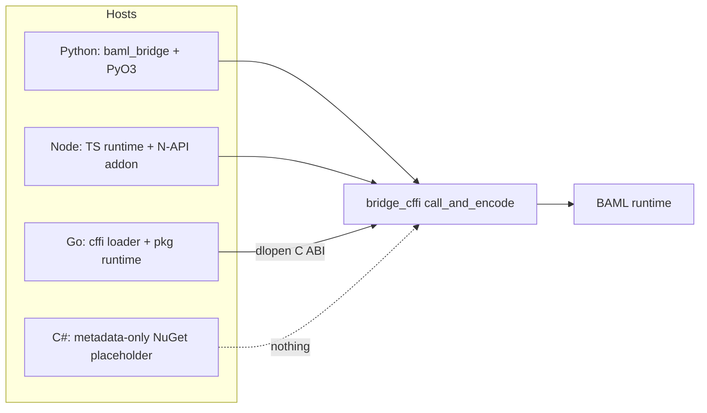
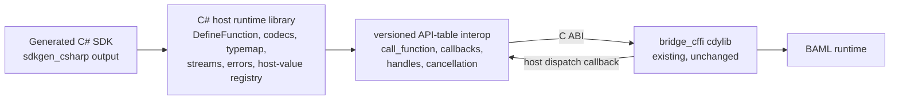

### Summary of change request

Build a C# bridge for BAML: the layer that lets C# programs call BAML functions and move values, errors, callbacks, streams, and other behavior across the language boundary. Python is the reference bridge; every capability in the Python completeness table should be exposed and tested in C# wherever the language allows it. Per the task ground rules, no new Rust runtime code should be needed — the bridge consumes the existing `bridge_cffi` C ABI exactly like the Go bridge does. Most of the work is in generating C# bindings (a new `sdkgen_csharp` generator), a C# host runtime library, ported parity tests wired into the shared `sdk_tests` harness, and NuGet packaging published from nightly CI.

### Current State

- C# developers cannot call BAML functions at all. There is no C# SDK, no generated bindings, no way to move values across the boundary.
- The only C# artifact in the repo is a metadata-only NuGet placeholder (`languages/csharp/baml`) whose README says the package is not ready for use.
- Python is a complete reference bridge; TypeScript/Node is complete; Go has a working C-ABI consumer layer but a stub generator. Each demonstrates a different host-integration style (PyO3, N-API, dynamic C ABI loading).
- The shared SDK test harness runs Python and TypeScript fixture suites under nextest and CI; there is no C# leg.
- Nightly releases publish precompiled Python wheels and Node platform packages; nothing is published for .NET.

### Desired End State

- A C# user can `dotnet add package baml-bridge` at a published nightly version without cloning the repo or compiling Rust locally.
- `baml generate` (the compiler CLI) can emit a C# SDK package from BAML source: namespaces, functions (sync + async), classes, enums, aliases, and stubs for the not-yet-supported shapes.
- Generated C# functions call through the existing `bridge_cffi` C ABI: protobuf-encoded requests in, `BamlOutboundResult` envelopes out, with values, errors, panics, cancellation, callbacks, streams, and generics crossing the boundary with the same semantics as Python.
- `cargo nextest run -p sdk_test_csharp` builds the native library, generates fixture SDK projects, and runs the ported C# test suite; CI picks it up in the SDK matrix.
- A `state-of-csharp-completeness` capability checklist (copied from the Python table) exists in this task's docs and is kept up to date as capabilities land and their parity tests pass.
- C# tests mirror Python tests: same names, cases, inputs, and assertions wherever the capability is shared.
- After implementation, parity validation, and packaging are working, the project's final phase produces canonical user-facing documentation for idiomatic C#-BAML code. The project is not complete until those examples compile in CI and state both the supported patterns and the important non-goals/limitations.

### What we're not doing

- **No new Rust runtime code.** The existing `bridge_cffi` exports and `bridge_ctypes` protobuf contracts are used as-is (ground rule from the task doc).
- No WASM/Blazor target — that path belongs to the WASM boundary, not this bridge.
- No .NET Framework, Mono, or Unity support — modern .NET only (exact TFM is a design question below).
- No engine-v0.2xx compatibility features beyond what Python v1 has (no Collector, TypeBuilder, OnTick, etc. — those are ❌/planned in the Python table too).
- No automated cross-language test-suite comparison tool — the task doc says one will exist; we just keep names/structure aligned so it can check us.
- Capabilities that are ❌ in Python (BAML closures inbound, type reference values, interfaces, cyclic objects) stay unsupported; C# parity targets Python's ✅ rows.

### Proposed End State Architecture

Before:



After:



The C# stack mirrors the layering every bridge shares — generated code owns the public shape, a host runtime package owns ergonomics and reconstruction, an interop layer owns VM integration — but takes Go's route across the boundary (exported C ABI) rather than Python's PyO3 or Node's N-API:

```text
baml_language/sdks/csharp/
├── bridge_csharp/                  # .NET solution for the host runtime
│   ├── src/
│   │   ├── Baml.Bridge/Bridge/     # API-table loader, protobuf codecs,
│   │   │                           #   callback shims, call dispatcher
│   │   ├── Baml.Bridge/            # BamlProgram, BamlStream, media/resources,
│   │   │                           #   handles, options/unions, exceptions
│   │   ├── ...                     # call context, cancellation, typemap,
│   │   │                           #   media wrappers, BamlHandle, errors,
│   │   │                           #   host-value registry
│   └── tests/                      # unit tests ported from sdks/python/tests
└── sdkgen_csharp/                  # Rust generator crate (workspace member,
    ├── src/lib.rs                  #   registered in baml_cli generate dispatch)
    ├── src/names.rs                # typed BAML identity -> allocated C# names;
    │                               #   wire names and file routes stay separate
    ├── src/routing.rs              # BAML namespace -> C# namespace/file routing
    ├── src/translate_ty.rs         # BAML Ty -> C# type syntax
    └── src/leaf.rs                 # per-leaf rendering: functions, classes,
                                    #   enums, aliases, typemap registration

baml_language/sdk_tests/crates/csharp/   # sdk_test_csharp crate + customizable
                                         #   overlays + setup.sh / setup.ps1
```

Call path (sync and async share everything up to the wait):

```text
generated assembly bootstrap
  BamlBridge.RegisterProgram(bytecodeProvider, fingerprint) -> BamlProgram
    v1: first fingerprint initializes; same fingerprint reuses; different fingerprint throws
    Cffi.InitializeRuntimeFromBytecode(bytecode)
      empty owned Buffer -> success; non-empty Buffer -> UTF-8 initialization error

generated C# callable
  generated BamlProgram.Call / CallAsync (bind args, UNSET filtering, generic bindings)
    Proto.EncodeCallArgs                     # CallFunctionArgs protobuf
    NativeApi.ApiV1.CallFunction(...)       # validated API-table pointer; callback-based
      ... bridge_cffi::call_and_encode ...   # existing shared path
    registered [UnmanagedCallersOnly] callback delivers result bytes
      completes a TaskCompletionSource keyed by callId
  Proto.DecodeCallResult                     # ok -> typemap reconstruction
                                             # error -> BamlError / panic -> BamlPanic
sync form: GetAwaiter().GetResult() on the same task
async form: Task<T> returned to the caller; CancellationToken registration
            calls cancel_function_call(callId)
```

The C ABI surface starts from Go's symbol list (`baml_language/sdks/go/bridge_go/cffi/lib.go:30-48`) and adds the bytecode initializer merged in [BoundaryML/baml#4009](https://github.com/BoundaryML/baml/pull/4009): `version`, `initialize_runtime_from_bytecode`, `call_function`, `register_callback`, `cancel_function_call`, `free_buffer`, `flush_events`, `baml_handle_clone`/`release`, media constructors, and the host-value trio (`register_host_dispatch_callback`, `register_host_release_callback`, `complete_host_call`). The generated v1 SDK does not use `create_baml_runtime` as a production or silent fallback; source-map initialization may exist only in an explicitly separate development harness and cannot change the public bootstrap contract resolved in question 13.

Baseline type mapping (details refined in the questions below):

| BAML shape | C# |
| --- | --- |
| int / float / bigint | `long` / `double` / `System.Numerics.BigInteger` |
| string / bool / null / bytes | `string` / `bool` / nullable annotation / `byte[]` |
| list / map | `List<T>` / `Dictionary<string, V>` |
| nullable with a statically known C# representation | `T?` (nullable reference/value types) |
| nullable unconstrained type parameter | `BamlNullable<T>` (required bridge representation; exact API refined below) |
| defaulted function parameter | `BamlOptional<T>` around the fully translated parameter type |
| structural union | `BamlUnion<T0, ..., TN>` with canonical arm order and an explicit active-case tag |
| literal | underlying type (C# has no literal types) |
| unknown | `object?` |
| opaque handle | `BamlHandle` |
| class / generic class | generated class / generated generic class `Foo<T>` |
| enum | native C# `enum : long` with stable explicit discriminants and generated string-wire codecs |
| stream | `BamlStream<TPartial, TFinal>` |
| host callable | `Func<...>` / `Action<...>` / async variants |

### Managed bridge type inventory

The bridge will necessarily add a small managed vocabulary where C#'s native type system or runtime model cannot preserve a BAML distinction. These types are part of the bridge design and compatibility surface; they must not emerge incidentally from whichever implementation helper is convenient at the time.

All public entries below live in the `Baml` namespace of the `Baml.Bridge` assembly resolved by question 12. The public inventory is organized by purpose:

| Type/category | Purpose | Where it appears |
| --- | --- | --- |
| `BamlOptional<T>` | Caller-presence state: `Unset` or `Set(T)` | Only defaulted inbound BAML function parameters; never an outbound BAML value |
| `BamlNullable<T>` | BAML value state: `Null` or `Value(T)` when native C# `T?` cannot represent both cases for an unconstrained `T` | Fields, parameters, results, collection elements, and nested generic arguments as required by type translation |
| `BamlUnion<T0, ..., TN>` (arities 2–32) | Structural one-of-N value with a stable canonical arm order and explicit active case | Fields, parameters, results, collection elements, and nested generic arguments containing non-null union types |
| `BamlProgram` | Managed identity/lifecycle seam for the compiled BAML program and future native runtime handle | Generated bootstrap and call routing |
| `BamlStream<TPartial, TFinal>` | Typed partial-stream lifecycle, iteration, cancellation, and terminal-value access | Generated streaming functions |
| `BamlHandle` and media/resource wrappers | Ownership of opaque native or host-backed values | Generated signatures containing those BAML runtime types |
| `BamlError`, `BamlPanic`, `BamlProgramConflictException`, and other documented bridge exceptions | Stable managed failure taxonomy | Thrown or used to fault tasks/streams at bridge boundaries |
| Generated classes and enums | Program-specific projections of nominal BAML types | Generated SDK namespace; these are not host-runtime primitives |

`BamlBridge` is the runtime bootstrap/lifecycle entry point. Codec implementations, protobuf adapters, callback registries, call-id allocation, and generic type descriptors such as a possible `BamlType<T>` or `IBamlCodec<T>` remain internal unless a later dynamic API demonstrates a concrete consumer need. Supporting ordinary unconstrained generics does **not** by itself justify another public `BamlGeneric<T>` wrapper.

For every public bridge-owned type, the implementation design must specify: its state model and zero/default state; construction and conversion rules; inbound and outbound wire behavior; equality and hashing; ownership/disposal; thread safety; nullable annotations; trimming/NativeAOT limits; versioning compatibility; and a compile-time plus runtime test matrix. Public `Baml*` names also participate in the typed allocator's generator-owned reservation set.

#### `BamlOptional<T>` and `BamlNullable<T>` are orthogonal

These wrappers preserve different information and must not be aliases for one another:

```text
BamlOptional<T>: Unset | Set(T)
                  ^
                  whether the caller supplied a defaulted argument

BamlNullable<T>: Null | Value(T)
                  ^
                  the value allowed by the BAML type itself
```

Composing them is intentional. A defaulted nullable unconstrained generic has three meaningful states without collapsing any pair:

| Managed value | BAML call meaning |
| --- | --- |
| `BamlOptional<BamlNullable<T>>.Unset` | Omit the argument; evaluate its BAML default |
| `BamlOptional<BamlNullable<T>>.FromValue(BamlNullable<T>.Null)` | Supply explicit BAML null |
| `BamlOptional<BamlNullable<T>>.FromValue(BamlNullable<T>.FromValue(value))` | Supply a concrete `T` value |

The semantic translation rules are:

| BAML position | C# projection |
| --- | --- |
| required `value: T` | `T value` |
| required `value: T?` for unconstrained `T` | `BamlNullable<T> value` |
| defaulted `value: T = ...` | `BamlOptional<T> value = default` |
| defaulted `value: T? = ...` for unconstrained `T` | `BamlOptional<BamlNullable<T>> value = default` |

Native nullable syntax remains preferred when the translated operand is statically known: `string?`, `long?`, `Foo?`, and `List<T>?` are valid projections. The special wrapper is required when nullable is applied directly (including through aliases) to an unconstrained type parameter, because closing C# `T?` with `T = int` produces `int`, not `int?`. Translation makes this decision from the resolved semantic type rather than source spelling and applies it recursively, so `List<T?>` becomes `List<BamlNullable<T>>`.

Decision: `BamlNullable<T>` is a public readonly two-case value type owned by the host-runtime package. It is used only when native C# nullable syntax cannot preserve BAML nullability for an unconstrained generic position. Its permanent zero/default state is `Null`, so it has no invalid or uninitialized third state.

##### Normative `BamlNullable<T>` shape

The exact namespace follows the package-identity decision. The semantic API is fixed as follows; XML documentation text and exception wording may be refined without changing behavior:

```csharp
public readonly struct BamlNullable<T> : IEquatable<BamlNullable<T>>
{
    private readonly T _value;
    private readonly bool _hasValue;

    private BamlNullable(T value)
    {
        _value = value;
        _hasValue = value is not null;
    }

    public bool IsNull => !_hasValue;

    public T Value => !IsNull
        ? _value
        : throw new InvalidOperationException("The BAML value is null.");

    public static BamlNullable<T> Null => default;

    public static BamlNullable<T> FromValue(T value) => new(value);

    public bool TryGetValue(
        [System.Diagnostics.CodeAnalysis.MaybeNullWhen(false)] out T value)
    {
        value = _value;
        return !IsNull;
    }

    public TResult Match<TResult>(
        Func<TResult> onNull,
        Func<T, TResult> onValue)
    {
        ArgumentNullException.ThrowIfNull(onNull);
        ArgumentNullException.ThrowIfNull(onValue);
        return IsNull ? onNull() : onValue(_value);
    }

    public static implicit operator BamlNullable<T>(T value)
        => FromValue(value);

    public bool Equals(BamlNullable<T> other)
        => IsNull == other.IsNull
            && (IsNull || EqualityComparer<T>.Default.Equals(_value, other._value));

    public override bool Equals(object? obj)
        => obj is BamlNullable<T> other && Equals(other);

    public override int GetHashCode()
        => IsNull
            ? 0
            : HashCode.Combine(1, EqualityComparer<T>.Default.GetHashCode(_value!));

    public static bool operator ==(BamlNullable<T> left, BamlNullable<T> right)
        => left.Equals(right);

    public static bool operator !=(BamlNullable<T> left, BamlNullable<T> right)
        => !left.Equals(right);

    public override string ToString()
        => IsNull ? "<null>" : _value?.ToString() ?? "<null>";
}

public static class BamlNullable
{
    public static BamlNullable<T> Null<T>()
        => BamlNullable<T>.Null;

    public static BamlNullable<T> FromValue<T>(T value)
        => BamlNullable<T>.FromValue(value);
}
```

Required invariants:

- `default(BamlNullable<T>)`, `new BamlNullable<T>()`, `BamlNullable<T>.Null`, and `BamlNullable.Null<T>()` are all BAML null. No parameterless struct constructor may change that across versions.
- `FromValue(default(T))` is `Value(default(T))` for non-nullable value types (`0`, `false`, default enums and structs), but is `Null` when the supplied value is actually CLR null. BAML has no distinct "non-null value containing a null reference" state to preserve.
- `Value` throws in the null case. `TryGetValue` returns `false` for null and `true` for every value case, including default value-type values.
- `Match` invokes exactly one branch. Null delegates are rejected before dispatch so branch choice does not change argument validation behavior.
- The only implicit conversion is from `T` to `BamlNullable<T>`. There is no implicit conversion back to `T`, and no conversion between `BamlNullable<T>` and `BamlOptional<T>` that would erase which state machine is being used.
- Two null values compare equal. Null never equals a value. Value cases use `EqualityComparer<T>.Default`; hashing includes the case discriminator.
- The wrapper does not own, clone, or dispose its contained value. It is not a native C struct and does not appear as a wrapper message in protobuf. Inbound encoding writes BAML null or recursively encodes `T`; outbound decoding maps BAML null to `Null` and otherwise recursively decodes `T` before `FromValue`.
- Repeated/aliased BAML nullability is normalized by semantic type translation. Emitters do not manufacture redundant wrapper layers from source spelling alone.

##### Canonical construction syntax and conversion limit

C# permits only one user-defined conversion in a conversion chain. A direct literal cannot cross both `T -> BamlNullable<T>` and `BamlNullable<T> -> BamlOptional<BamlNullable<T>>`; this was verified by compiling the proposed shape under .NET 10 (`CS1503`). The non-generic static companion exists so type inference can construct the inner case before the one remaining outer conversion:

```csharp
// Required nullable unconstrained generic.
var withValue = new Maybe<long> { Value = 42 }; // one implicit conversion
var withNull = new Maybe<long> { Value = BamlNullable<long>.Null };

// Defaulted nullable unconstrained generic.
Call<long>();                                             // unset
Call<long>(value: BamlNullable.Null<long>());             // explicit null
Call<long>(value: BamlNullable.FromValue(42L));            // explicit value
```

These are the canonical documented call forms. Do not add `object?` overloads, per-function overload combinations, or a combined three-state public wrapper merely to make `Call<long>(value: 42L)` compile in this uncommon composed case. Those alternatives weaken type safety, duplicate state models, or expand the generated compatibility surface.

##### Required `BamlNullable<T>` verification matrix

- Null construction through `default`, `new`, both `Null` helpers, and `FromValue(null)` for reference/nullable arguments.
- Value construction for zero, false, default enum/struct, strings, generated classes, handles, collections, and closed generic values.
- `Value`, `TryGetValue`, `Match`, equality, hashing, and debugging output for both cases.
- Required and defaulted generic parameters closed over reference types, value types, nullable value types, and generated nominal types.
- Nested translations such as `List<T?>`, `Dictionary<string, T?>`, generic class fields/results, and aliases resolving to `T?`.
- Exact encode/decode proof that the wrapper itself never crosses protobuf/C ABI and that contradictory non-null wire metadata fails rather than fabricating a `T` value.
- Compile fixtures demonstrating the canonical helper syntax for `BamlOptional<BamlNullable<T>>`, with nullable analysis and warnings-as-errors under `net10.0`.

### Cross-cutting naming invariants

Naming is an allocation pass over typed BAML identities, not string formatting performed by emitters. It must land before routing or substantial code generation because casing, C# keyword escaping, helper names, namespace qualification, and multi-file collisions all share the same allocation problem.

The C# model should preserve the following distinctions:

- `BamlFqn` retains package, namespace, symbol, and member segment boundaries. Parameters, fields, enum variants, and other owned names extend the owning symbol identity rather than becoming unrelated strings.
- `CSharpNameRequest` includes the BAML identity, a typed kind (`NamespaceSegment`, `Function`, `Class`, `Enum`, `TypeAlias`, `Property`, `EnumMember`, `TypeParameter`, `Parameter`, and `FileStem` at minimum), and typed visibility even if the first generated surface is entirely public.
- `CSharpName` stores the allocated canonical C# identity and its BAML wire identity together. The emitter must explicitly choose source rendering or wire rendering; it cannot ask for an ambiguous `as_str()`.
- Canonical identities retain namespace and containing-type segments. Cross-namespace type references render with explicit context, preferably `global::A.B.Type`, rather than hoping a `using` directive is unambiguous.
- Allocation is per lexical scope: namespace/type declarations, members of one owner, enum variants, parameters and generated locals of one callable, and file stems in one output directory are different collision domains.
- Generator-owned declarations and locals participate in allocation. At minimum this includes `Functions`, bridge/runtime helper types, `CancellationToken`, and locals such as `result`, `error`, `buffer`, `callId`, `typeArgs`, `kwargs`, and `value`. C# parameter names are caller-visible through named arguments, so internal helpers lose the collision tie-break whenever possible: a BAML parameter `result` stays `result`, while the generated storage local receives an allocated internal name. This is a language-specific projection policy, not an exemption from centralized allocation.
- File routing has a separate allocation domain using case-insensitive comparison and Windows device-name reservations. `Foo.cs` and `foo.cs` collide on supported developer machines even though `Foo` and `foo` are distinct C# identifiers; `CON.cs`, `AUX.cs`, and similar paths are also unsafe on Windows.
- Requests are grouped and allocated through ordered collections. Normalization collisions receive suffixes derived from the typed identity, never discovery-order numbers. The allocator must verify suffix uniqueness and deterministically extend the hash prefix in the exceptional case of a hash-prefix collision.
- Generated models structurally pair source objects with allocated names. Emitters must not zip a source collection with a parallel name collection that can silently drift after filtering or reordering.

The naming test matrix should cover at least: 100 shuffled request orders producing byte-identical allocations; `foo_bar`/`fooBar`/`FooBar`; keywords and contextual keywords in every name kind; a public BAML `result` parameter beside an internally renamed result local while preserving wire key `result`; same parameter names in two callables; same normalized member names within one owner; cross-namespace qualification; case-only file-name differences; Windows device names; and synthetic hash-prefix collisions.

### Design Questions

This section is the authoritative decision register. All questions **1–20** are resolved for v1, including unconstrained generic nullability. Question 10 remains release-evidence gated: production publication still requires real per-RID artifacts and execution on every supported runner, but the package topology itself is decided. A future unresolved decision must be added here rather than living only in chat, an implementation prompt, or an agent's assumptions.

#### 1. Native interop: versioned dynamic API table — resolved

How does the C# runtime bind the `bridge_cffi` exports?

- Option A: **Source-generated static P/Invoke** — `[LibraryImport("bridge_cffi")]` partial methods plus a `NativeLibrary.SetDllImportResolver` hook. The resolver probes the dev-tree cargo `target/{debug,release}` locations (same candidates as Go's `FindLibrary`, `lib.go:74-101`) and otherwise defers to .NET's default probing, which automatically finds `runtimes/{rid}/native/` assets from NuGet packages. Source-generated marshalling is AOT-safe and trim-safe.
- Option B: **Dynamic loading like Go** — `NativeLibrary.Load` + `NativeLibrary.GetExport` + `Marshal.GetDelegateForFunctionPointer` (or unmanaged function pointers) for every symbol, resolved at an explicit `Init(path)`.

Decision: use a constrained form of **Option B**. Load `bridge_cffi` through `NativeLibrary`, resolve exactly one export (`baml_get_api_v1`), and call through the returned versioned unmanaged function-pointer table. Do not resolve each operation as a separate symbol and do not declare a parallel static P/Invoke surface. This matches the native ABI's versioning model, validates ABI version, table size, and every required pointer in one place, and still lets `NativeLibrary.TryLoad` use the consuming assembly's normal NuGet RID probing. `BAML_BRIDGE_LIBRARY` is an explicit development override; bounded checkout candidates are a source-tree fallback only.

Resolving the binding mechanism must also fix the native-lifetime contract rather than leaving it to individual call sites:

- the exact blittable `Buffer`, handle, callback, string, span/pointer, length, and call-id signatures for every consumed export;
- which side allocates each buffer, when managed code must copy it, and the exactly-once `free_buffer` rule on success, decode failure, callback failure, cancellation, and initialization error;
- resolver installation timing, the fact that a DllImport resolver is assembly-scoped, development-path probing, default NuGet RID probing, ABI/version mismatch diagnostics, and behavior when the native library or export is missing;
- static unmanaged callback rooting, prohibition on exceptions unwinding across the C boundary, and conversion of callback failures into managed task/stream failures;
- thread-safe call-id allocation including wraparound/exhaustion, one terminal completion per id, unknown/late/duplicate callback handling, and cancellation-versus-result races;
- whether native handles use `SafeHandle` or another audited ownership primitive, and how clone/release interoperate with higher-level `BamlHandle` wrappers.

The compiled bridge and focused native fixtures are the interop probe: initialization, callback completion, buffer copy/free, cancellation, host dispatch/release, handle clone/release, ABI mismatch, missing functions, late completion, and callback exception containment execute through the actual table. No managed exception may unwind through an unmanaged callback.

#### 2. Target framework: net8.0 or net10.0? — resolved

The placeholder `languages/csharp/baml/baml.csproj` targets `net10.0`. Everything the bridge needs (`LibraryImport`, `UnmanagedCallersOnly`, `NativeLibrary` resolvers, `required` members) is available on net8.0.

- Option A: **net8.0** — the older LTS; consumers on net8, net9, and net10 can all use the package. net8 support ends November 2026.
- Option B: **net10.0** — the current LTS (supported to Nov 2028), matches the placeholder, allows the newest language/runtime features, but excludes anyone not yet on .NET 10.

Decision: **Option B (`net10.0`).** The first public bridge and generated SDK target the current .NET LTS rather than taking on an immediately expiring compatibility floor. The host runtime, generated fixture projects, tests, examples, package metadata, and CI images all use `net10.0`; no `net8.0` or `net9.0` compatibility promise is made in v1.

#### 3. Canonical C# projection: idiomatic names or source-shaped names? — resolved

The typed allocator above is required under either option. Even a source-shaped policy must handle `$`, C# keywords, generated helper names, namespace/type collisions, and case-insensitive file systems, so "verbatim means zero collision machinery" is not a valid premise.

- Option A: **Idiomatic C# projection** — namespaces, types, methods, properties, and enum members use PascalCase; parameters and generated locals use camelCase; async/stream/build-request companions become `ClassifyAsync`, `ClassifyStream`, and `ClassifyBuildRequest`. Clean names remain clean. Only reserved or colliding requests are escaped or deterministically suffixed. BAML FQNs and wire keys remain unchanged and are available for diagnostics and codec use.
- Option B: **Source-shaped projection** — preserve BAML spelling where C# permits it, mapping only illegal syntax and companions (`classify`, `classify_async`, `classify_stream`, `classify__build_request`). This makes cross-language examples visually closer but produces a deliberately non-idiomatic public .NET API and still requires the full typed allocator.

Decision: **Option A.** Public naming is expensive to change after a NuGet release, whereas the allocator makes projection collisions routine and wire-safe. Cross-language parity tests keep the same test-case names independently of generated API spelling. There is one canonical generated surface rather than a second source-shaped mode that would double snapshots, documentation paths, and compatibility obligations.

#### 4. Where do free functions live? C# has no module-level functions — resolved

BAML namespaces map naturally to C# namespaces, but namespaces can't contain methods.

- Option A: **A fixed-name static holder class per leaf** — every namespace leaf that has functions gets `public static partial class Functions`; under the recommended naming policy users call `MyNs.Functions.Classify(...)` or `using static MyNs.Functions;` then `Classify(...)`.
- Option B: **The leaf itself becomes a static class** — functions are static methods, and classes/enums in that leaf become nested types. Call surface is closest to Python (`MyNs.classify(...)`), but nested generated types are un-idiomatic, and a static class can't coexist cleanly with a same-named child namespace (BAML allows both a package `a.b` and symbols in `a`).
- Option C: **One global entry-point class** mirroring Python's `b` root, with nested static properties per namespace. Deep namespaces produce awkward chained accessor codegen and defeat C# tooling (no `using` support).

Decision: **Option A.** One `public static partial class Functions` is emitted in each C# namespace containing BAML free functions. It works with arbitrarily nested packages, keeps generated classes and enums as normal top-level namespace members, and lets `using static` recover the terse call form. The holder is a typed generator-owned name request rather than a magic string; a same-scope BAML type named `Functions` goes through deterministic collision allocation.

The v1 generator emits only this static function surface. Applications that need dependency injection or isolated unit tests should define a small application-owned interface and adapter around the BAML capabilities they consume. The generator does not duplicate every function behind an instance client/interface and does not expose mutable static delegates or other global test overrides. Documentation should include the adapter recipe, recommend a stateless singleton adapter when appropriate, require cancellation-token forwarding, and distinguish mocked application tests from real bridge/parity integration tests.

#### 5. Optional arguments: sentinel-typed optional parameters or a trailing options object? — resolved

Python uses keyword-only args with an `UNSET` sentinel (omitted → engine fills the default); TS uses a trailing `$opts?: {...}` object. C# has native optional/named parameters, but default values must be compile-time constants, and `null` can't be the "unset" sentinel because `null` is a legal explicit value for nullable params.

- Option A: **`BamlOptional<T>` wrapper struct as the parameter type** — `Classify(string text, BamlOptional<string> lang = default)`. An implicit conversion from `T` lets callers write `Classify("spam?", lang: "fr")`; omitted parameters stay in the unset state and are filtered from the encoded kwargs, exactly like Python's `UNSET`. Distinguishes unset from explicit null naturally (`BamlOptional<string?>`).
- Option B: **Trailing generated options class** — `Classify("spam?", new ClassifyOptions { Lang = "fr" })`, mirroring TS `$opts`. One extra generated type per function with optionals; slightly noisier call sites; unset = property never initialized (needs the same optional wrapper internally anyway to distinguish null).
- Option C: **Overload explosion** — rejected out of hand: 2^n overloads and no way to skip middle optionals.

Decision: **Option A.** Use one public `BamlOptional<T>` value type from the C# host-runtime package for every BAML parameter that has an engine-owned default. The generated method signature is the complete typed surface; there is no parallel stub or generated options type.

##### Semantic invariant: optionality and nullability are independent

The wrapper represents whether the caller supplied an argument, not whether its value is non-null:

| BAML/C# call state | `IsSet` | Stored value | Wire behavior |
| --- | ---: | --- | --- |
| Argument omitted | `false` | ignored | omit the entire kwarg entry; engine evaluates the BAML default |
| Explicit `null` for nullable `T` | `true` | `null` | encode a present kwarg whose value is BAML null |
| Explicit default CLR value | `true` | `0`, `false`, empty value, etc. | encode the present value |
| Explicit non-default value | `true` | supplied value | encode the present value |

Use the state name `IsSet`, not `HasValue`. `HasValue` is misleading for `BamlOptional<string?>.FromValue(null)`: the argument is set even though the stored value is null.

The all-zero/default struct state is permanently reserved for unset. This must remain true across future package versions because optional-argument defaults are compiled into caller assemblies. Adding fields or behavior later must not change `default(BamlOptional<T>)` from unset to set.

##### Normative managed shape

`BamlOptional<T>` lives once in the host-runtime package; it is not regenerated into each SDK. The exact namespace follows the package-identity decision, and generated code renders it through the centralized name/qualification system.

```csharp
public readonly struct BamlOptional<T> : IEquatable<BamlOptional<T>>
{
    private readonly T _value;

    private BamlOptional(T value)
    {
        _value = value;
        IsSet = true;
    }

    public bool IsSet { get; }

    public T Value => IsSet
        ? _value
        : throw new InvalidOperationException("The BAML optional value is unset.");

    public static BamlOptional<T> Unset => default;

    public static BamlOptional<T> FromValue(T value) => new(value);

    public bool TryGetValue(
        [System.Diagnostics.CodeAnalysis.MaybeNullWhen(false)] out T value)
    {
        value = _value;
        return IsSet;
    }

    public static implicit operator BamlOptional<T>(T value)
        => FromValue(value);

    public bool Equals(BamlOptional<T> other)
        => IsSet == other.IsSet
            && (!IsSet || EqualityComparer<T>.Default.Equals(_value, other._value));

    public override bool Equals(object? obj)
        => obj is BamlOptional<T> other && Equals(other);

    public override int GetHashCode()
        => !IsSet
            ? 0
            : HashCode.Combine(1, EqualityComparer<T>.Default.GetHashCode(_value!));

    public static bool operator ==(BamlOptional<T> left, BamlOptional<T> right)
        => left.Equals(right);

    public static bool operator !=(BamlOptional<T> left, BamlOptional<T> right)
        => !left.Equals(right);

    public override string ToString()
        => !IsSet ? "<unset>" : _value is null ? "<null>" : _value.ToString() ?? "<null>";
}
```

Required properties of the implementation:

- Do not define a parameterless struct constructor. `default`, `new BamlOptional<T>()`, and `BamlOptional<T>.Unset` must all be unset.
- `FromValue(default(T))` must always be set. This covers `null`, `0`, `false`, default enum values, and default user structs.
- `Value` throws while unset; it must not return `default(T)` and erase the distinction.
- `TryGetValue` returns `false` while unset and `true` for a set-null value.
- Provide the implicit conversion only from `T` to `BamlOptional<T>`. Do not implicitly convert back to `T`, because that would silently discard unset state.
- Two unset values compare equal. Unset never equals a set value, including a value set to `default(T)`. Two set values compare with `EqualityComparer<T>.Default`.
- Hashing includes `IsSet`; debugging/`ToString()` visibly distinguishes `<unset>` from a set-null value.
- The wrapper does not own, clone, or dispose values and is never marshalled as a native C struct. It is a managed call-binding sentinel only.

##### Generator signature rules

The generator maps parameter semantics as follows:

| BAML parameter | Generated C# parameter |
| --- | --- |
| required `value: string` | `string value` |
| required nullable `value: string?` | `string? value` |
| defaulted `language: string = "en"` | `BamlOptional<string> language = default` |
| defaulted nullable `language: string? = null` | `BamlOptional<string?> language = default` |
| defaulted `count: int = 0` | `BamlOptional<long> count = default` |

Rules:

- Every BAML-defaulted parameter uses `BamlOptional<T>`, even when its current BAML default is a C# compile-time literal. Never copy the BAML default into C# metadata: the engine owns default evaluation, and changing bytecode defaults must not require recompiling callers.
- Nullability alone does not imply `BamlOptional<T>`. A required nullable parameter is still required and is emitted as `T?`.
- Optionality wraps the fully translated type. A concrete nullable defaulted type is `BamlOptional<T?>`; a nullable unconstrained generic is `BamlOptional<BamlNullable<T>>`. Collections, classes, enums, unions, handles, aliases, and nested generic types follow the same resolved-type rule recursively.
- Required parameters retain declaration order, followed by defaulted BAML parameters in declaration order. If the compiler model ever permits a required parameter after a defaulted one, generation must fail with a targeted diagnostic or adopt a separately approved API shape; do not silently reorder positional meaning.
- Sync, async, static-method, instance-method, stream, and companion variants use the same BAML parameter shapes. Bridge-owned controls are separate: for example, `CancellationToken cancellationToken = default` remains the final async parameter and is never encoded as a BAML kwarg.
- Generated documentation recommends named syntax for BAML-defaulted parameters. C# cannot enforce keyword-only arguments, so positional calls remain legal; inserting or reordering defaulted parameters is therefore a source-compatibility hazard.
- Canonical C# parameter names are used for named-argument syntax. Original BAML wire keys come from the allocated name's wire identity and never from the C# spelling.

##### Binding and encoding rules

Generated call binding handles the wrapper before the general value encoder:

```csharp
if (language.IsSet)
{
    kwargs.Add(languageWireName, EncodeInbound(language.Value));
}
```

- Unset means no map/protobuf entry at all. It must never become a present BAML null, CLR default, empty collection, or empty protobuf message.
- Set means unwrap exactly once and pass the stored `T` through the ordinary inbound encoder, including the ordinary nullability/type validation for `T`.
- Prefer a generic `AddIfSet<T>(wireName, BamlOptional<T>)` binding helper so the wrapper is not boxed into `object` and accidentally treated as an ordinary class/struct value.
- `BamlOptional<T>` is not registered in the BAML typemap and has no outbound decoding form. BAML function results use ordinary translated types; this wrapper exists only at defaulted inbound parameter positions.
- The wrapper must not cross the C ABI or appear in protobuf contracts. Only its unwrapped value, when set, can reach the wire.

##### Compatibility and reflection footguns

- C# substitutes optional defaults at the caller. Keeping that default permanently equal to the zero-valued unset wrapper makes changing the engine-owned BAML default safe for already-compiled callers.
- Renaming a generated optional parameter breaks callers using named arguments. Inserting/reordering optional parameters can silently retarget positional calls when types happen to match. Treat both as public API changes.
- Reflection metadata may report the custom struct's optional default as `null`, even though invocation with `Type.Missing` supplies the zero-valued wrapper. Reflection- or documentation-based tooling must not interpret `ParameterInfo.DefaultValue == null` as an explicit BAML-null default.
- Nullable analysis must remain enabled in generated projects. Explicit null must compile for `BamlOptional<T?>`; supplying null to `BamlOptional<T>` should retain the same warnings/errors as supplying null to the underlying non-nullable `T`.
- An options-object design would still need this wrapper on each nullable/defaulted property to distinguish an unassigned property from a property assigned null. It is not a simpler state model.

##### Required verification matrix

Unit and compile tests must cover:

- `default`, `new BamlOptional<T>()`, and `Unset` are unset; `FromValue(default(T))` and implicit conversion of default values are set.
- Omitted, explicit null, zero, false, empty string, empty list/map, and representative non-default values.
- Reference, nullable-reference, value, nullable-value, enum, class, collection, handle, and closed generic argument types.
- `Value`, `TryGetValue`, equality, hashing, and debugging output for unset, set-null, set-default, and set-non-default states.
- Named and positional calls across sync, async, static, instance, stream, companion, and generic generated methods.
- Encoder assertions that unset removes the wire key while set-null emits a present null under the original BAML key.
- Reflection invocation using `Type.Missing`, while explicitly documenting that raw reflection default metadata is not the BAML default.
- Generated consumers compiled under `net10.0` with nullable warnings enabled and warnings-as-errors in the generator's compile fixtures.
- End-to-end proof that omitting a value runs the BAML default expression, while explicitly supplying the same literal or null bypasses default evaluation.

#### 6. Class representation, decode, and equality — resolved

BAML classes must be constructible by users, reconstructible by the typemap from decoded protobuf fields (including generic parameterization — C#'s reified generics fit the `type_args` protocol well), and able to carry private handle-backed state (media `_data`, resource `_handle`).

- Option A: **Plain classes with `required` init-only properties + a generated static decode factory registered in the typemap.** User construction is `new Foo { Bar = 1 }`; decode goes through an allocated internal factory delegate rather than member reflection, and that factory is where private handle attrs are restored. Generic classes generate `Foo<T>`. The ordinary typed call path composes generated codecs for `Foo<T>` and each type argument without discovering members through reflection. This is trim/AOT-friendly for statically reachable closed types, but is not a blanket NativeAOT guarantee for type-erased values whose closed generic type is known only from wire metadata.
- Option B: **Records** — value equality for free (closer to Pydantic's structural `==`), terse declarations, but `with`-expressions and positional forms invite API surface we don't want to commit to, and private mutable handle state fights record semantics.
- Option C: **Reflection/System.Text.Json-based decode** — least generated code, but slow, trim-hostile, and gives up the explicit control the handle/generic paths need.

Decision for representation: **Option A**, with ordinary reference equality from **Option A1**. V1 decoding deliberately uses the controlled reflection portion of **Option C**, without `System.Text.Json`, because question 19 makes trimming and NativeAOT non-goals:

- Option A1: **Ordinary reference equality in v1** — do not generate `Equals`/`GetHashCode`. Tests and applications compare relevant properties or use an explicit comparer. **Selected.**
- Option A2: **Generated deep structural equality** — requires a cross-language value-equality specification, recursive list/map comparison, deterministic map semantics, generic-`T` rules, and exclusions or identities for handle/callback/resource state.
- Option A3: **Record/default member equality** — rejected as a shortcut because records still compare `List<T>` and `Dictionary<K,V>` by their own default equality and `with` performs shallow copying.

The main footgun in A2 is hash stability: `init` prevents replacing a property after construction, but a contained `List<T>` or `Dictionary<K,V>` remains mutable. A deep generated hash can therefore change while the object is a key in a dictionary or member of a hash set. Handle-backed private state and arbitrary generic `T` also lack an obvious language-independent equality contract. Therefore v1 does not claim structural equality and does not generate `Equals`, `GetHashCode`, `==`, or `!=`. A future opt-in structural comparer requires a separate cross-language value-equality design and does not alter generated object identity.

The generated public/model and internal-codec contract is:

- Each BAML class becomes a `public sealed partial class` with a public parameterless construction path and one allocated PascalCase property per BAML field.
- Required BAML fields use `public required T Property { get; init; }`. A required nullable field remains `required`; the caller must intentionally assign a value or null.
- Do not generate positional constructors, deconstructors, copy constructors, record `with` behavior, or other parallel construction surfaces in v1.
- `required` and `init` are compile-time ergonomics, not a trust boundary. Inbound encoding still validates nullability, field types, handles, and other BAML invariants because reflection, null-forgiving syntax, mutable contained collections, and malformed values can bypass compiler intent.
- Ordinary typed outbound decoding uses a cached internal generated-contract inspector over the generated data-contract/wire-name attributes, constructs the class field-by-field, and validates exact BAML FQN, fields, and generic arguments. It may use reflection and `Activator.CreateInstance` under question 19, but never `System.Text.Json`, unannotated projected property names, or best-effort member matching.
- Internal decoding may restore private handle/media/resource state that is not part of public object-initializer construction. The exact internal codec type/member name is allocator-owned and not public API.
- `partial` permits generator-owned declarations to be split safely and applications to add non-conflicting partial declarations under the source-in-project model resolved by question 14. Generated members and wire attributes remain generator-owned.
- Collections exposed through `init` properties remain mutable objects. The bridge does not describe generated classes as deeply immutable.
- Generic classes and codecs follow the recursive generic/nullability invariants below.

Unconstrained generic parameters are required, not a stubbed v1 edge. The class/function codec design must therefore preserve these invariants:

- `Foo<T>`, generic functions, and arbitrarily nested closed shapes such as `Foo<List<Bar<T>>>` compose typed codecs recursively; fields do not fall back to `object?` merely because they mention `T`.
- A typed generic call carries a BAML type descriptor for every method/type parameter, encodes the corresponding generic binding, and validates returned `type_args`, FQN, and arity against the expected C# shape. It never reconstructs a BAML type from `typeof(T).Name` or another display string.
- Each supported closed C# type argument maps to one BAML type identity. Primitive projections, generated nominal types, collections, nullable wrappers, and other bridge-owned value types register explicitly. An arbitrary CLR type argument with no BAML mapping fails with a targeted managed error before the C ABI call.
- Typed decoding uses the signature's expected closed type as an input, not only the runtime payload. A contradictory wire type is a decode error rather than permission to return a different CLR type.
- Type-erased `object?`/`unknown` reconstruction is a separate dynamic path. V1 uses controlled cached reflection for generated nominal/closed-generic targets and otherwise returns the closed dynamic vocabulary from question 18. Neither path may infer BAML identity from display names or accept unannotated arbitrary objects.
- Nullable unconstrained positions use `BamlNullable<T>` as specified in the managed-type inventory. Emitting plain `T?` for those positions is forbidden and covered by compile fixtures closed over both reference and value types.
- The generic test matrix includes generic classes and functions; inference and explicit type arguments; reference, value, nullable, and generated nominal arguments; nested list/map/class shapes; `BamlOptional<BamlNullable<T>>`; mismatched or missing wire `type_args`; unsupported CLR type arguments; and repeated concurrent calls using different closed instantiations.

#### 7. Enum representation: native C# enum or smart-enum class? — resolved

BAML enum members carry serialized string values; Python generates `str`+`Enum` subclasses, TS generates string enums. C# native enums are integer-backed.

- Option A: **Native C# `enum` + typemap-side string mapping.** The generated typemap registers member↔serialized-value tables in both directions; the wire never sees the integral value. Users get familiar `switch` syntax, `System.Enum`-based generic APIs, reflection/tooling support, and zero allocation.
- Option B: **Smart-enum class** (sealed class with static readonly members, like Java enums). Carries the string value on the instance and extends naturally if BAML enums ever grow methods, but loses `switch` exhaustiveness (until C# closed hierarchies) and is heavier codegen.

Decision: **Option A with stable explicit discriminants.** The research shows enum values cross the wire as `{enum_name, variant_name}` (`value_decode.rs`, Python `proto.py:726-737`) — names, not CLR numbers. Python and TypeScript preserve that string identity directly; C# cannot use a string-backed native enum, so generated enums use a signed `long` underlying type, stable nonzero discriminants derived from typed BAML identity, and explicit generated member↔wire-name codecs.

The normative evolution, hashing, validation, and version-skew contract is recorded in the resolved-question section below.

#### 8. Union representation — resolved

.NET 10/C# 14 has no native union declaration or compiler-recognized exhaustive union `switch`. C# 15/.NET 11 is previewing those features, but v1 cannot depend on a preview language/runtime. C# 14 does provide the features needed for an idiomatic structural projection that Go and Java cannot express as ergonomically: closed generic structs, user-defined implicit conversions, target-typed lambdas, and generic instance methods such as `Match<TResult>`.

Decision: structural BAML unions use the bridge-owned generic family `BamlUnion<T0, ..., TN>`, mechanically defined once for arities 2 through 32. An anonymous `string | int` projects to `BamlUnion<string, long>`; it does not generate a public `StringOrInt`, `UnionStringInt`, or occurrence-specific wrapper. Every BAML union expression still receives an internal typed descriptor/codec, so eliminating the public synthetic type does not erase BAML identity or wire metadata.

Representative public shape:

```csharp
public readonly struct BamlUnion<T0, T1> : IEquatable<BamlUnion<T0, T1>>
{
    public bool IsT0 { get; }
    public bool IsT1 { get; }
    public T0 AsT0 { get; }
    public T1 AsT1 { get; }

    public TResult Match<TResult>(
        Func<T0, TResult> onT0,
        Func<T1, TResult> onT1);

    public void Switch(Action<T0> onT0, Action<T1> onT1);

    public static BamlUnion<T0, T1> FromT0(T0 value);
    public static BamlUnion<T0, T1> FromT1(T1 value);

    public static implicit operator BamlUnion<T0, T1>(T0 value);
    public static implicit operator BamlUnion<T0, T1>(T1 value);
}
```

`Match<TResult>` is the canonical exhaustive-consumption API on .NET 10: its handler count equals the generic arity, so adding an arm changes the closed union type and makes old calls fail compilation. `Switch` is the void-returning equivalent. Positional `IsTn`/`AsTn` accessors and `FromTn` factories remain available; do not generate projected-type accessors such as `IsString`/`AsString`, because aliases, namespace collisions, and generic closure can give multiple arms the same CLR projection.

Implicit conversion is canonical convenience when normal C# overload resolution selects the intended, non-overlapping arm. `FromTn` is the authoritative exact construction operation and must always exist. A .NET 10 compile probe established the required edge behavior: `BamlUnion<string, long>` accepts `string` and `long`; `BamlUnion<object, string>` selects the more-specific `string` arm for a string expression; an integer literal selects the `long` arm of `BamlUnion<long, double>`; direct conversion to `BamlUnion<string, string>` fails with `CS0457`; and an open generic conversion to `BamlUnion<T, string>` can select `T0` before `T` later closes to `string`. Documentation and tests must therefore use `FromTn` whenever case identity, rather than ordinary CLR conversion preference, is intended.

The normative identity and codec rules are:

- Flatten associative BAML union expressions, resolve aliases/generic substitutions according to BAML semantics, remove semantically duplicate arms, and separate a null arm before CLR projection. Sort remaining arms deterministically by typed BAML identity, never source order, discovery order, or projected C# spelling. Every emitter and codec consumes that same canonical order.
- The stored active case is an internal numeric position in the canonical arm list, not a BAML wire name and not a projected label such as `variant_int`. Case zero is permanently invalid/uninitialized; valid arms are numbered from one. `default(BamlUnion<...>)` is therefore invalid, and access, matching, or inbound encoding throws a targeted managed codec exception rather than masquerading as `T0(default)`.
- Each generated field/parameter/result codec holds the expected BAML union descriptor and maps the stored case position to the original typed BAML arm. Inbound encoding never reconstructs an arm identity from `typeof(T).Name`, a projected member name, or runtime value type alone.
- Outbound `Union { value, metadata }` decoding validates the metadata against the expected descriptor, maps it to the canonical arm position, and decodes the inner value as the corresponding closed CLR type. Unknown, missing where required, contradictory, or non-member metadata is a targeted decode error; there is no silent first-match, fallback arm, or public unknown-union case.
- Distinct BAML arms that project to the same CLR type remain distinguishable by the stored case. This includes `BamlUnion<string, string>` and `BamlUnion<T, string>` closed with `T = string`. `Match` and `FromTn` remain sound because they dispatch by case position; type-only reflection, a generic `TryGet<T>`, and implicit conversion cannot be the authoritative discriminator.
- A BAML null arm is represented outside the non-null union. For example, `string | int | null` becomes `BamlUnion<string, long>?`; `T | null` follows the resolved `BamlNullable<T>` rule when the operand is an unconstrained generic. Defaulted parameters wrap the fully translated shape, such as `BamlOptional<BamlUnion<string, long>>` or `BamlOptional<BamlUnion<string, long>?>`. Because C# does not chain two user-defined conversions, composed optional calls use `FromTn` before the outer `BamlOptional<T>` conversion.
- Equality and hashing include both the active case and the active value through `EqualityComparer<Tn>.Default`; equal payloads in different cases are not equal. Implement `IEquatable`, `Equals`, `GetHashCode`, `==`, and `!=`. Two invalid default values compare equal and hash to zero so equality remains total, but no other operation treats them as valid BAML values.
- `BamlUnion` is a readonly value and is thread-safe as a container. It does not own, clone, or dispose a contained handle/resource and does not implement `IDisposable`; ownership remains the contract of the active `Tn` value.
- Public union operations are statically typed. Bridge codecs may inspect a closed generic and construct the selected arm through controlled cached reflection under questions 18 and 19; the expected BAML descriptor and explicit case metadata remain authoritative, so reflection may not choose an arm from runtime CLR type alone.
- The host runtime package mechanically generates arities 2–32 once. This covers the current 16-arm built-in `Panic` union with twofold headroom and follows the established OneOf extended-family precedent. A normalized BAML union above 32 arms fails generation with a targeted diagnostic containing its typed location and arity; it is never nested, truncated, renamed into a bespoke wrapper, or degraded to `object?`.
- Adding or removing an arm changes the public closed generic type and is intentionally source/binary breaking. Reordering source arms has no effect after canonicalization. The resolved alias/literal rules in question 18 determine each translated `Tn` and may not replace this union state model with synthetic public union names.
- C# 15's compiler-recognized custom-union protocol is a future compatibility seam. A later `net11.0` target may make the same `BamlUnion<T...>` public names participate in native exhaustive pattern matching if the feature stabilizes and duplicate/overlapping cases remain sound. V1 neither depends on nor promises that behavior.

The private storage layout is deliberately not part of the source API decision. A required compiled benchmark compares OneOf-style one-field-per-arm storage against a compact payload-plus-tag representation at arities 2, 8, 16, and 32, including struct size/copy cost and boxing/allocation cost for reference, primitive, enum, `BigInteger`, generated-class, and mixed arms. The implementation document records the selected v1 layout and treats later public-struct layout changes as binary-versioning decisions; either layout must preserve every semantic rule above.

Required tests cover arities 2, 3, 16, and 32 plus the over-limit diagnostic; canonicalization under source reordering/association; distinct, overlapping, numeric, duplicate-projection, and generic-closure construction; invalid default; `Match`/`Switch` handler arity; cross-case equality; nullable and optional composition; nested collections/classes/generics; exact inbound case routing; outbound metadata validation; unknown metadata; and trimmed/AOT behavior at the support level resolved by question 19. `object?` may be an early implementation stub but is not an acceptable final typed parity surface.

#### 9. Internal Protobuf transport generation and publishing — resolved

The bridge protocol is the four shared `bridge_ctypes` schemas: `baml_inbound.proto`, `baml_outbound.proto`, `baml_type.proto`, and `baml_handle.proto`. They define language-neutral messages exchanged across the C ABI. They are not a public C# object model and contain no gRPC network service that the C# SDK must host or call.

Decision: the bridge project generates its internal C# Protobuf bindings from those schemas whenever the **bridge assembly itself** is built. The build uses an exactly pinned `Grpc.Tools` package, writes generated `.g.cs` only beneath the project's intermediate `obj/` tree, and compiles those files into the managed bridge assembly. Generated transport source is not checked into Git. This generation occurs for a maintainer's local/source build and once in the release pipeline's designated platform-neutral managed build; it never occurs in the publisher and never occurs merely because an application references the published NuGet package.

Three generated artifacts must remain conceptually separate:

| Artifact | Generator/owner | Distribution contract |
| --- | --- | --- |
| Internal C# Protobuf transport bindings | Pinned `Grpc.Tools` in the bridge build | Private implementation compiled into the bridge assembly; generated source is neither committed nor shipped |
| Program-specific typed C# SDK source | `sdkgen_csharp` / `baml generate` | Public application/library build input; compiles using only the public host runtime package and follows the generated-SDK regeneration contract in question 14 |
| Native runtime libraries | Central native build matrix | Precompiled release artifacts packaged according to the NuGet topology resolved in question 10 |

The first row is the only subject of this decision. It does not alter the rule that downstream users of a library which happens to use BAML must not need the BAML CLI or regenerate that library's program-specific SDK.

##### User and consumer contract

A normal consumer restores the published BAML NuGet package, compiles its generated program-specific SDK, and calls its typed API. The consumer does **not** install or invoke `protoc`, restore `Grpc.Tools`, locate the BAML repository, resolve the shared `.proto` files, generate transport source, or add a gRPC client/server package. The already-compiled bridge assembly contains the transport bindings. `Google.Protobuf` is the one ordinary transitive managed runtime dependency required by those compiled bindings.

The NuGet package must not expose Protobuf MSBuild targets or schema inputs through `build`/`buildTransitive`, and it must not contain the four `.proto` files, generated `.cs` source, or monorepo-relative/absolute source paths. A direct source `ProjectReference` to `bridge_csharp` does run generation because that developer is building the bridge rather than consuming its compiled package. That source build requires the four canonical schemas to be present in their monorepo locations, but no separately installed system `protoc` is required.

No public generated BAML signature, public bridge member, documented exception contract, or supported extension point exposes a generated Protobuf message. Handwritten internal adapters translate between the public C# types and internal transport messages. Generator-specific Protobuf naming or layout changes therefore remain private implementation changes.

##### Bridge project and toolchain contract

- Only the bridge runtime project declares the four `<Protobuf>` inputs. Generated program projects and clean consumer projects do not.
- The inputs use the shared schema root as `ProtoRoot` so imports and descriptor names remain canonical paths such as `baml_bridge/cffi/v1/baml_type.proto`. Absolute checkout paths never participate in generated descriptors, diagnostics intended for users, assembly metadata, or package contents.
- All four schemas and their import relationships are declared as incremental build inputs. Touching an imported type/handle schema invalidates every affected inbound/outbound output; an unchanged second build does not regenerate unnecessarily.
- `GrpcServices="None"` is explicit. The bridge does not acquire `Grpc.AspNetCore`, `Grpc.Net.Client`, or another network transport merely because the generator package is named `Grpc.Tools`.
- C# generation uses `internal_access` (or the verified equivalent MSBuild metadata) and a deterministic `.g.cs` extension. The schema package currently projects to the internal namespace `BamlBridge.Cffi.V1`; question 12 intentionally permits that generator-derived private exception behind handwritten `Baml.Bridge.*` adapters, and it never becomes public package/namespace identity.
- `Grpc.Tools` is an exact, centrally controlled build-only version with `PrivateAssets="all"`; it cannot flow into the produced NuGet dependency graph. The corresponding bundled `protoc --version` is recorded in the lock/build evidence.
- `Google.Protobuf` is a declared runtime dependency with a lower bound equal to the verified runtime and an upper bound excluding the next unsupported runtime major. Generator and runtime versions are selected and upgraded as one reviewed compatibility unit. Newer generated code is never assumed to work with an older runtime merely because both packages restore.
- The initial version-selection probe starts with the stable package candidates `Grpc.Tools` 2.82.0 and `Google.Protobuf` 3.35.1, records the actual bundled `protoc` version, and may replace either candidate before the implementation document freezes the pair. The design decision is the pinned compatible-pair invariant, not an unverified coincidence between NuGet version numbers.
- Generation writes only to disposable intermediate directories. A build, rebuild, test, and pack leave the tracked source tree clean. IDE design-time builds and ordinary command-line builds consume the same declared MSBuild inputs rather than relying on a separately run script.
- The managed transport assembly is built once in the designated platform-neutral job, not once per native RID, and its verified bytes are included once in the single multi-RID package resolved by question 10.

Question 19 makes trimming and NativeAOT explicit v1 non-goals for `Google.Protobuf`, generated descriptors, internal adapters, and the reflective codecs. Choosing build-time rather than checked-in generated source does not change that support boundary; both approaches compile the same declarations.

##### Correctness boundaries

Build-time generation guarantees that a bridge source build cannot silently compile a stale committed C# snapshot after a shared schema edit. It does **not** by itself prove that a schema edit is wire-compatible, that the native and managed artifacts came from the same release, or that the generator/runtime package pair is compatible. Those are separate required controls:

- Protobuf field numbers and wire meanings remain governed by golden encoded-message and compatibility tests; successful C# compilation is not proof of wire compatibility.
- Native and managed artifacts are derived from the same frozen source SHA and release plan, carry the required protocol/runtime compatibility identity, and pass native-to-managed round-trip/version-skew tests.
- Internal adapters are tested against every inbound/outbound envelope used by unary calls, streams, callbacks, errors, panics, cancellation, handles, and dynamic values as those capabilities land.
- Unknown, malformed, or version-incompatible messages produce the managed diagnostics resolved by question 16; they never fall back to partially decoded public values.
- Clean generation must succeed on each build-host class used for the managed builder (at minimum macOS arm64, Linux x64, and Windows x64). A cross-compiled native RID is not a reason to rerun platform-neutral Protobuf generation on that RID's native job.

The required protocol-generation evidence performs two isolated clean generations from identical inputs and compares generated source bytes; verifies a no-op second build; changes each direct and imported schema in a fixture and verifies the affected rebuild graph; confirms generated accessibility; compiles and round-trips representative messages; and verifies that no absolute paths or timestamps make the output/package nondeterministic. It then packs the bridge and inspects the `.nupkg` dependency and file lists.

##### Frozen-plan build, verification, and publishing contract

The release pipeline owns generation in the same way it owns every other compilation step:

1. The plan job freezes the source SHA, canonical version/channel, target matrix, artifact identities, and any release timestamp that participates in immutable output.
2. The designated C# builder checks out that exact SHA with credentials disabled, consumes the frozen plan, stamps version-bearing inputs before build/package tools read them, restores pinned dependencies, generates the internal transport bindings, builds the platform-neutral managed assembly once, and assembles the single multi-RID NuGet package plus symbol/diagnostic artifacts using all eight native inputs required by question 10.
3. Builder outputs receive content digests and provenance and are uploaded as uniquely named immutable workflow artifacts. Caches may contain dependencies and intermediate compiler output, but never substitute for or determine a final publish decision.
4. Consumer verification downloads only those assembled artifacts into clean temporary projects with no repository path dependencies. It inspects package contents and dependency metadata; verifies canonical managed/native versions; confirms that no transport generation runs; loads the appropriate native library; and exercises at least unary, async/streaming, cancellation, error, and callback paths as those capabilities become supported. It uploads the exact verified package/symbol artifacts for publishing.
5. The all-builds fan-in gate includes that consumer verification. No NuGet publisher runs if generation, assembly, any required native target, package inspection, or clean-consumer execution fails.
6. The publisher is deliberately non-compiling: it authenticates with the approved least-privilege identity, downloads the exact verified `.nupkg`/symbol artifacts, validates their identity/digest, and publishes the one immutable package version. It never reruns `protoc`, `dotnet build`, or `dotnet pack` and never reconstructs a package from a moving branch head.
7. A repair rerun uses the same frozen plan and artifacts. An existing registry version is skipped only after its content/identity matches; different content under the same version is a hard provenance failure. Mutable channel pointers advance only after the exact package and every other required release artifact exist.

This placement matters: "generate while building the bridge" means generation is part of the pre-gate builder, not the registry publisher and not the application consumer. It preserves one schema source of truth while still satisfying the release rule that publishers publish only packages already installed and smoked as users will receive them.

##### Deliberate exception to the general committed-client rule

The current canonical bridge release guidance says that a new language should add its protocol generator and generated outputs to `proto-sync`, that CI should regenerate consumers and fail on a dirty tree, and that protocol clients are generally committed. C# intentionally does not follow that literal storage rule for its **internal transport bindings**. This is a narrow host-language-specific exception, not an unrecorded divergence and not a precedent that all generated SDK source should become ephemeral.

The exception is justified because the schemas and C# bridge are versioned together; MSBuild has normal pinned Protobuf generation; the bindings are private implementation rather than user-authored/public source; checking them in would create a second representation that can drift from the schema; mechanical generated diffs and merge conflicts add review cost without improving the consumer artifact; and the frozen builder already produces and verifies a compiled package before publishing. Swift or another bridge in a separate repository may rationally commit its bindings because it has a different source-distribution boundary.

For C#, `proto-sync` replaces the committed-output dirty-tree assertion with stronger build-owned checks: run the pinned generator in isolated clean directories; compare deterministic outputs; verify direct/imported dependency invalidation; build the bridge; run protocol round trips; and assert that the tracked tree remains unchanged because all output stays under ignored intermediates. Existing dirty-tree checks continue to apply to languages that commit generated clients.

Before C# production publishing is enabled, the canonical bridge architecture/release guides must be amended to permit this form explicitly. The amended general rule should allow either committed generated clients or deterministic build-generated **internal** clients when the latter are pinned, declared as complete build inputs, generated before package verification, covered by protocol-sync and consumer-package tests, absent from public APIs and downstream builds, and never regenerated by publishers. Until that documentation amendment lands, this design is the recorded approved exception that implementers must follow rather than silently reverting C# to committed transport source.

Checked-in C# transport bindings are therefore rejected for this bridge. They would remove `protoc` from bridge source builds and expose the exact generated source in Git, but would require a regeneration script, committed mechanical churn, merge-conflict handling, and a regenerate-and-diff CI gate to prevent schema/source drift. Those tradeoffs are warranted only if the build-integrated generator proves unavailable or nondeterministic on a required build host; such evidence would reopen this decision rather than authorize an undocumented fallback.

#### 10. NuGet native packaging: one atomic multi-RID package — resolved, feasibility-gated

Eight native targets must reach users as precompiled binaries: macOS x64/arm64, Windows x64/arm64, Linux glibc x64/arm64, and Linux musl x64/arm64. They are not independently versioned products; they are eight platform realizations of one managed bridge, one C ABI, and one frozen BAML release.

Decision: v1 publishes the one user-facing `baml-bridge` NuGet package containing the platform-neutral `Baml.Bridge` managed assembly and all eight native libraries under standard `runtimes/{rid}/native/` paths. There are no per-RID leaf packages, umbrella/facade dependency graph, manually selected platform packages, install-time downloads, or consumer-side native compilation.

Representative package payload:

```text
baml-bridge.<version>.nupkg
├── lib/net10.0/Baml.Bridge.dll
├── runtimes/osx-x64/native/libbridge_cffi.dylib
├── runtimes/osx-arm64/native/libbridge_cffi.dylib
├── runtimes/win-x64/native/bridge_cffi.dll
├── runtimes/win-arm64/native/bridge_cffi.dll
├── runtimes/linux-x64/native/libbridge_cffi.so
├── runtimes/linux-arm64/native/libbridge_cffi.so
├── runtimes/linux-musl-x64/native/libbridge_cffi.so
├── runtimes/linux-musl-arm64/native/libbridge_cffi.so
└── buildTransitive/baml-bridge.targets   # bounded RID diagnostics only
```

`bridge_cffi` is the canonical native base name produced by the shared crate and consumed by the managed import/resolver design in question 1. Platform filename prefixes/extensions follow the operating system; the library is not renamed per package version or RID. Both Linux libc variants intentionally use the same filename in distinct RID directories. The package contains exactly one native asset for every required RID and no unclassified copy at the package root.

##### User and deployment contract

A user adds one `PackageReference` and does not choose a platform package. A restore downloads/caches the one multi-RID package; a RID-specific build/publish selects the matching native asset for its output through normal .NET runtime-asset resolution. Shipping eight assets in the registry package does not mean all eight are copied into a correctly RID-specific published application.

The package performs no first-run or build-time network acquisition beyond ordinary NuGet restore, invokes no C/C++/Rust toolchain, and does not extract a private runtime cache. A configured NuGet mirror can therefore support offline/hermetic installation by mirroring one immutable package version plus its ordinary managed dependencies. Users may not replace a bundled native file with a differently versioned binary and remain in the supported configuration; an explicitly documented development override from question 1 is diagnostic/source-build machinery, not a second production distribution profile.

For an explicit unsupported `RuntimeIdentifier`/`RuntimeIdentifiers` at publish time, the package's bounded MSBuild target fails with a BAML-specific diagnostic listing the requested RID and the eight supported RIDs. It performs validation only: it does not generate code, add package references, download binaries, or replace the SDK's native-asset selection. If no RID was known at build time and the process runs on an unsupported OS/architecture/libc combination, the managed loader throws `PlatformNotSupportedException` with detected platform details and supported RIDs before exposing a generic `DllNotFoundException`/`BadImageFormatException`. There is no silent x64/arm64 or glibc/musl substitution.

##### Assembly and package correctness

- Each of the eight native matrix jobs consumes the same frozen source SHA/release plan and emits one uniquely named immutable artifact plus digest, target triple, runtime ABI/version, binary-format/architecture inspection, exported-symbol inspection, minimum-platform metadata, and native dependency inspection.
- The package-assembly job builds the managed assembly once as resolved in question 9, then requires exactly one verified native input for every required RID. Missing, duplicate, unexpected, mislabeled, or wrong-architecture artifacts fail assembly; support is never reduced merely to make a release pass.
- The managed assembly version, package version, generated-code compatibility marker, native `version` export, ABI/capability identity, release manifest, and every native artifact manifest derive from the same frozen plan. The single physical package makes a mixed managed/native package graph impossible, but runtime version/ABI checks still fail closed in case files are tampered with or replaced after restore.
- The assembly job copies verified native bytes without rebuilding them, records their original digests in package provenance, packs once, inspects the `.nupkg`, and records its digest. Consumer verification and the publisher use those exact package bytes.
- Clean consumer verification runs from the assembled package with no repository paths on every required RID that can be executed. It verifies asset selection, load, reported version/ABI, a representative BAML call, and the absence of the other RID binaries from a RID-specific publish output. Cross-built targets remain experimental until an appropriate native runner executes their packaged artifact; this design's eight targets become required only with that execution coverage.
- Package-content tests reject duplicate native filenames within a RID, native files outside their RID directories, source/generated Protobuf files, build-tree paths, credentials, unapproved debug sections, and architectures not declared by the central platform contract.

The one-package boundary is intentionally atomic: one package ID/version is the complete supported desktop/server bridge. Native RIDs never acquire separate public semantic versions, compatibility policies, dependency constraints, channel state, or documentation surfaces.

##### Size and performance gate

The native packaging probe no longer chooses between topologies; it proves that the selected one-package topology is feasible and establishes its budget. It records, for each RID, unstripped and shipping-library size; the sum of native inputs; compressed `.nupkg` and symbol/diagnostic artifacts; cold-restore download and expanded global-packages footprint; RID-specific publish output; pack/restore time; and compression reproducibility.

Before the implementation document is written, the measured `.nupkg` must fit the registry's then-current hard package limit and an explicit safety ceiling no greater than 80% of that limit. The verified baseline and ceiling are committed to the release size gate. Afterward, a size increase that crosses the ceiling or exceeds both 10% and 10 MiB relative to the approved baseline requires an intentional budget update with attribution; it cannot silently pass because the registry still accepts the package.

If the first package exceeds the safety ceiling, optimize the shipping native profile, debug-symbol separation, or compression and repeat the probe. If a correct package cannot fit the registry's hard limit, question 10 is reopened as a blocking design change. Implementers must not silently introduce leaf packages, omit a required RID, download code after install, or publish an oversized package on a different channel.

##### Symbols, signing, and release channels

The primary `.nupkg` contains release native libraries with ordinary debug symbol payload removed while retaining all unwind/exception metadata required for panic containment and useful native stack unwinding. Managed portable PDB/Source Link material goes in the NuGet symbol package where supported. Native PDB, dSYM, and split-DWARF/debug sidecars are separate immutable per-target diagnostic artifacts linked by source SHA and binary digest; they are not copied into application outputs or counted as primary-package runtime assets.

V1 targets .NET desktop/server rather than signed mobile/store bundles. Native DLLs/shared libraries are not promised to be independently Authenticode-signed or Apple-notarized inside the NuGet package; the release supplies package provenance/attestations supported by the registry and workflow. Applications with their own signing or hardened-runtime boundary sign the final application bundle, including the selected native library. If a required desktop target proves unable to load the verified package without pre-signing, signing is added in the pre-verification builder and becomes part of the immutable native digest; a publisher never signs or mutates package contents.

Canary, nightly, and stable releases use the identical one-package topology. NuGet versions are immutable: nightly/canary use the canonical SemVer prerelease encoding, while a stable release is a distinct frozen-plan version rather than a mutation or relabeling of a previously published package. The final channel manifest/pointer advances only after the exact package has passed consumer verification and publication; repair reruns compare identity/content and never overwrite an existing different package version.

Per-RID packages are rejected because ordinary NuGet dependencies do not give this facade a useful RID-conditional download: a facade would normally restore every leaf while multiplying package IDs, dependency-lock entries, provenance records, registry operations, partial-publish states, enterprise allowlist entries, and managed/native skew failure modes. Requiring users to choose a leaf could reduce downloads but violates zero-ceremony installation and makes cross-publishing easier to misconfigure. Splitting remains only a future explicitly reopened response to proven hard registry infeasibility, not an implementation fallback.

#### 11. Maintainer test framework and isolation — resolved

This is repository test infrastructure, not a user-facing SDK choice. A BAML consumer may use xUnit, NUnit, MSTest, another framework, or no test framework. The managed runtime package, generated program SDKs, public APIs, normal package dependency graph, and application documentation do not reference or require xUnit.

Decision: repository-owned C# unit, parity, generated-fixture, and clean-consumer tests use xUnit on its current supported v3 line, executed through `dotnet test`. Exact framework/runner/adapter versions are centrally pinned with the .NET 10 test toolchain. xUnit and test-runner packages appear only in non-packable test projects; they are absent from the bridge runtime project and from every produced `.nupkg`.

The framework selection is a maintainer consistency choice. The following harness rules, rather than xUnit itself, protect bridge correctness:

- Each generated SDK fixture contains one distinct compiled BAML program and is built as its own test project/assembly. The harness runs that assembly in its own test process so question 13's one-distinct-program-per-process v1 invariant is never violated by combining fixtures.
- Runtime-bearing parity/integration assemblies disable xUnit's automatic in-process test parallelism. The outer harness/nextest layer may run distinct fixture processes concurrently because process-global native state is isolated. Pure managed unit-test projects that never initialize the BAML runtime may retain runner parallelism.
- Concurrency is tested deliberately inside named tests using controlled simultaneous calls/streams/callbacks; incidental overlap chosen by the test runner is not accepted as concurrency coverage.
- Tests for a second program fingerprint, hard process exit, native-load failure, irreversible environment/runtime mutation, or teardown/crash behavior launch a dedicated child executable/process. The parent xUnit test asserts exit code, output, and timeout rather than risking termination or corruption of the shared testhost.
- Async tests return and await `Task`/`ValueTask`; `async void`, fire-and-forget work, and unobserved callbacks are forbidden. A test does not finish until calls, cancellation registrations, streams, callbacks, handles, and required event flushing have completed or been disposed. Blocking `.Result`/`.Wait()` is used only when the subject is explicitly the generated synchronous API.
- Python parity identity remains source-shaped independently of idiomatic generated C# names: `test_bigint.py::test_roundtrip_large_int` maps to `TestBigint.test_roundtrip_large_int`. Parameterized cases use stable explicit case identities so the future parity checker compares source test plus case identity rather than runner-formatted display text.
- Built-in xUnit assertions are the default; no additional assertion library is required initially. Tests assert structured semantic state—types, fields, union cases, wire identities, collection contents, exit codes—rather than depending on generated-class reference equality or entire formatted exception/stack-trace strings.
- Reviewed snapshots/goldens are limited to intentionally stable generated source, diagnostics, package manifests, and wire vectors. Normalization may remove checkout roots and platform line endings but not ordering, identities, values, or other semantic differences. Runtime behavior still receives direct assertions.
- Standard traits are `Layer=Unit|Parity|Consumer`, `Isolation=Process` where required, `Requires=Credentials` for opt-in provider tests, and `Parity=Python|CSharpOnly`. The required default suite is credential-free; secret-bearing tests run only in a separately authorized job and never determine ordinary local success.
- Source-checkout integration tests consume the exact native artifact built by their harness setup and assert its version. Release verification installs the assembled NuGet package into a clean project and must not fall back to a development-tree native library.

The repository may show xUnit in maintainer test examples, but generated application code and user testing guidance describe framework-neutral seams. In particular, the application-owned dependency-injection adapters resolved in question 4 can be faked or mocked with whichever test framework/library the application already uses.

#### 12. Runtime package identity and public namespace — resolved

The user installs the same cross-language bridge identity used by other host integrations:

```shell
dotnet add package baml-bridge
```

Decision:

| Surface | Canonical identity |
| --- | --- |
| NuGet package ID and displayed casing | `baml-bridge` |
| Managed assembly name | `Baml.Bridge` |
| MSBuild root namespace for handwritten runtime code | `Baml` |
| Public bridge-owned types | `Baml.*` |
| Handwritten internal implementation namespaces | `Baml.Bridge.*` |
| Native library base name | `bridge_cffi` with platform filename conventions from question 10 |

NuGet package IDs are not C# namespace identifiers. The lowercase hyphenated package ID intentionally preserves the cross-language installation standard; it does not force non-idiomatic C# source names. Public runtime types therefore read naturally after `using Baml;`:

```csharp
using Baml;

BamlOptional<string> language = "fr";
BamlUnion<string, long> value = "example";
```

The public `Baml` namespace owns `BamlBridge`, `BamlProgram`, `BamlOptional<T>`, `BamlNullable<T>`, every supported `BamlUnion<...>` arity, `BamlStream<TPartial,TFinal>`, `BamlHandle`, media/resource wrappers, and the final exception types resolved by questions 16–17. Public types are not divided between `Baml` and `Baml.Bridge`; the latter is implementation organization, not another namespace users must import.

Generated program namespaces continue to come from the centralized BAML-to-C# projection resolved in question 3, such as `Acme.Billing`; they are not nested under `Baml`, `Baml.Bridge`, or the NuGet package ID. Generated source refers to runtime types with allocated, package-aware identities rendered as `global::Baml.BamlOptional<T>` (and equivalents) when qualification is required. The allocator reserves every public runtime type in the `Baml` namespace so a user BAML namespace/symbol that projects there cannot create an ambiguous duplicate fully qualified type.

Handwritten private implementation code uses namespaces such as `Baml.Bridge.Interop`, `Baml.Bridge.Codecs`, and `Baml.Bridge.Runtime`, with `internal` accessibility. Question 9's generator-derived Protobuf namespace may remain an internal tooling exception because it is neither public nor a compatibility surface; handwritten adapters prevent it from leaking. Do not modify shared wire schemas solely to cosmetically rename private generated declarations.

The existing separately owned `baml` NuGet ID is not repurposed, redirected, or made a dependency of the bridge in v1. It remains available for a future flagship/package-layer decision outside this project. The user has confirmed that BoundaryML owns `baml` and that `baml-bridge` is currently unclaimed; claiming `baml-bridge` under the BoundaryML NuGet organization is an external administrative prerequisite before production publishing is enabled. A placeholder claim, if used, is an immutable public registry action and must use approved ownership, metadata, and release-process review rather than an ad hoc developer upload.

Question 14 selects application-owned in-project source under `BamlSdk`, an exact-version `baml-bridge` reference, and a pre-initialization generator/runtime compatibility diagnostic. Program-specific generated output is not published under `baml-bridge` and does not create an additional official BAML NuGet package.

#### 13. Runtime bootstrap: bundled bytecode or source-file initialization? — resolved

[BoundaryML/baml#4009](https://github.com/BoundaryML/baml/pull/4009) adds `initialize_runtime_from_bytecode` to the stable C ABI. It delegates to the same canonical bytecode initializer used by Rust-backed bridges, returns an empty owned `Buffer` on success, returns a UTF-8 error in the owned buffer on failure, rejects null-plus-nonzero-length input, and catches panics at the ABI boundary.

- Option A: **Generate/bundle bytecode and initialize through the new export.** The generated SDK owns a bytecode payload plus a stable fingerprint and registers it through `BamlBridge.RegisterProgram(...)`, receiving a `BamlProgram` used by every generated call. This avoids compiling a source map in the consumer process and gives C# a real initialization error. Question 20 resolves the payload as one bounded base64 source carrier.
- Option B: **Keep using `create_baml_runtime(rootPath, srcFilesJson)`.** This matches the current Go prototype but recompiles source at startup, depends on synthetic paths and JSON source maps, and only reports failure as a null pointer while Rust writes the useful error elsewhere.
- Option C: **Require the application to supply bytecode or source files explicitly.** This avoids generated bootstrap policy but violates the zero-ceremony generated SDK goal and makes every consumer rebuild lifecycle and error handling.

Decision: **Option A, with one distinct compiled BAML program per process in v1.** Registration is thread-safe and idempotent for the same fingerprint. A different fingerprint throws `BamlProgramConflictException` before touching the native initializer; it never silently replaces the running program. A program may contain arbitrarily many BAML files, packages, namespaces, functions, and concurrent calls. Program replacement/hot reload requires a process restart, and unusual multi-`AssemblyLoadContext` hosts are explicitly unsupported in v1.

`BamlProgram` is the compatibility seam for adding multi-program support later. Generated functions call through their registered `BamlProgram`, not directly through global static CFFI methods. In v1 all registrations resolve to the guarded singleton. A future C ABI can return native runtime handles stored inside separate `BamlProgram` instances and thread them through calls, cancellation, callbacks, streams, and handle ownership without changing generated method signatures.

#### 14. Generated artifact integration, layout, and regeneration — resolved

What exactly does `baml generate` produce for a C# consumer?

- Option A: generated `.cs` files intended to compile directly inside the application's existing project;
- Option B: a generated SDK `.csproj` referenced by the application;
- Option C: a separately packable/generated assembly or package.

Decision: **Option A.** `baml generate` writes ordinary LF-terminated `.cs` files beneath the configured output directory, conventionally `baml_sdk/`, and the consuming project compiles them as its own source. Generated public namespaces start at the fixed root `BamlSdk`; projected BAML package/namespace segments follow it. No generated `.csproj`, assembly, resource target, or official program-specific NuGet package exists, so the consuming assembly and any application-owned package retain their own identity. An application may pack its compiled/generated source under its own package identity, but must not present that artifact as `baml-bridge` or another official BAML runtime package.

The consuming project uses an exact `PackageReference Include="baml-bridge" Version="<generator canonical version>"`; no floating range is generated or supported. The current canonical version is `0.15.0`. Generated source records that same version in `GeneratedCodeAttribute` metadata and passes it to program registration. `BamlSdkVersionMismatchException` names generated and runtime versions and fails before native initialization. Upgrading either CLI or package therefore requires aligning the other and regenerating.

All source starts with the generated banner and nullable context. Generated model types and `Functions` are partial where extension is meaningful; generated members remain owned and must not be edited. One root `BamlGeneratedProgram.g.cs` carries question 20's bytecode, and all leaves refer to it. Routing uses allocated namespaces and case-insensitive portable paths, including reserved-device handling and deterministic typed-identity suffixes.

`.baml-generated-files.json` is the ownership/commit manifest. Regeneration preflights recorded hashes, user-owned collisions, symlink ancestors, unsafe/case-colliding paths, duplicate output roots, abandoned locks, and staging state before changing output. It stages the full next tree, backs up affected files, installs generated files, and commits the manifest last; returned failures roll back. Stale owned files and empty generated-only directories are removed, unrelated files are preserved, and modified owned files fail closed. A hard-killed transaction requires operator inspection rather than guessing whether to commit or roll back. This source-in-project decision is the compatibility promise; selecting a generated project/resource artifact later must deliberately reopen questions 14 and 20.

#### 15. Complete callable projection — resolved

The free-function holder is resolved, but the remaining callable API must be specified:

- static methods and instance methods, including where generated methods live, how `self` is encoded, whether instance methods require a decoded/constructed instance, and collisions with properties or generated helpers;
- sync and async companion availability and naming, the exact `CancellationToken` position, and whether sync calls expose any cancellation mechanism;
- the safety requirements for sync-over-async (`ConfigureAwait(false)`, no captured synchronization context, no inline continuation deadlock, and consistent exception unwrapping);
- generic method syntax, inference versus explicit `<T>` binding, type parameters that appear only in results, type-argument validation, and interaction between generic classes and generic methods;
- `$build_request` and other companion return types, sync/async forms, namespace placement, and whether they share the same optional/generic binding rules;
- named versus positional argument compatibility for every callable form.

Decision: every supported BAML free function, static method, and instance method has one synchronous method and one `Async` companion. Free functions live on the leaf `Functions` holder. Static and instance methods live on their generated sealed partial class; an instance call requires an ordinary constructed or decoded instance and prepends it under the exact wire key `self`. Properties, sync/async methods, parameters, type parameters, and generated locals share their appropriate typed allocation scopes, so helper names never silently hide caller-visible members.

Async methods return `Task<T>` and take an optional `CancellationToken` as the final parameter. Sync methods expose no cancellation parameter and synchronously await the same dispatcher with `GetAwaiter().GetResult()`, preserving the original exception instead of `AggregateException`; every internal async continuation uses `ConfigureAwait(false)` and does not require a caller synchronization context. A callable argument requires an async generated entry point; the synchronous entry point rejects it rather than blocking callback completion.

Generic classes and methods use ordinary CLR type parameters. Generated calls send an explicit `(original BAML variable name, typeof(projected type parameter))` binding vector, class parameters first and method parameters second. C# inference works when an argument mentions the parameter; a parameter appearing only in the result requires an explicit `<T>`. Duplicate normalized type-parameter names are allocated independently, method variables cannot collide with or accidentally reuse class variables, and unsupported host-only CLR types fail before native dispatch.

Compiler companion symbols use the same projection, default, generic, and collision rules as ordinary callables. `$build_request`, `$stream`, `$render_prompt`, and parse-stream companions therefore become idiomatic `BuildRequest`, `Stream`, `RenderPrompt`, and corresponding `Async` methods with typed `BamlHttpRequest`, `BamlStream<TPartial,TFinal>`, `BamlPromptAst`, and resource results. Ordinary C# positional and named invocation are both supported; original BAML names remain the wire keys. Required and optional host callables up to 16 parameters are supported as specified in question 17. A callable, generic media value, union above 32 arms, unsupported vendor nominal type, or other translation outside the resolved type table receives a generated `NotSupportedException` path; v1 does not degrade it to an untyped native call.

#### 16. Managed errors, panics, cancellation, and process exit — resolved

Define the complete managed failure taxonomy and outcome mapping. The decision must cover:

- exact exception type names and inheritance, including whether idiomatic `Exception` suffixes outweigh cross-language names such as `BamlError` and `BamlPanic`;
- preservation and public access to the decoded thrown value, BAML FQN/class name, trace, panic metadata, and inner managed exception;
- the special type-mismatch mapping and which native .NET exception, if any, it becomes;
- rethrowing the original managed exception object from a host callback versus wrapping it, including stack/identity expectations;
- caller-token cancellation versus engine-originated cancellation, `OperationCanceledException`/`TaskCanceledException` behavior, token association, late results, and whether sync calls can be cancelled;
- initialization, ABI/load, decode/protocol, program-conflict, unsupported-type, and disposed-handle failures;
- BAML hard process exit: whether C# calls `Environment.Exit`, uses another hard-exit mechanism, or deliberately surfaces a catchable exception. This behavior must be isolated in tests and prominently documented.

Decision: preserve the cross-language public names `BamlError` and `BamlPanic` rather than adding `Exception`. Both derive from `BamlException`, which exposes the dynamic `Value`, `ClassName`, immutable `BamlTrace`, and optional managed inner exception. Native `baml.errors.TypeMismatch` becomes `BamlTypeMismatchException : ArgumentException` with the same value/class/trace. Other bridge, initialization, ABI, load, protobuf, decode, unsupported-value, and bytecode-carrier faults become targeted `BamlBridgeException`; program and SDK conflicts use `BamlProgramConflictException` and `BamlSdkVersionMismatchException`, disposed wrappers use `ObjectDisposedException`, and explicitly unsupported projections use `NotSupportedException`.

A managed exception thrown by a host callable is registered as an opaque host value and, when it returns to the same process, the exact exception object is rethrown rather than wrapped. Throwing `BamlException` with a BAML value instead preserves its BAML throw identity. Registry release drops the root only after native ownership ends; cancellation and late callback completion do not replace an already selected terminal result.

Caller cancellation produces a canceled `Task` associated with the exact supplied token and requests native cancellation once when it wins the result race. A pre-canceled token never dispatches. Native `baml.panics.Cancelled` without caller cancellation becomes tokenless `BamlCancelledException : OperationCanceledException`, retaining value, class, and trace; it is not mislabeled as caller cancellation. Sync calls have no cancellation control. Late, duplicate, or unknown completions are contained and cannot complete a call twice.

`baml.sys.exit` is intentionally a hard process exit: the bridge flushes native events and calls `Environment.Exit` with the exact BAML status. It is never converted into a catchable exception. Tests execute this path only in child processes and assert status 0 and nonzero statuses without terminating the harness.

#### 17. Streams, callbacks, host values, and handle/resource lifetime — resolved

The managed bridge inventory names these types but does not yet define them. Resolve them as one lifecycle group:

- whether `BamlStream<TPartial,TFinal>` implements `IAsyncEnumerable<TPartial>`, `IAsyncDisposable`, a sync enumeration API, or a combination; when execution starts; whether it is single-use; final-result access; cancellation; early disposal; error propagation; and behavior after completion/disposal;
- host callable projections (`Func`/`Action`, `Task<T>` and/or `ValueTask<T>`), cancellation-token injection, `ExecutionContext`/`SynchronizationContext`, concurrency, reentrancy, callback ordering, and async callback completion;
- host-value registry rooting, identity, clone/reference counts, release callback races, exactly-once release, managed exception rehydration, shutdown behavior, and leaked-callback diagnostics;
- whether `BamlHandle` is or owns a `SafeHandle`, its `IDisposable`/finalizer contract, clone semantics, thread safety, use-after-dispose behavior, and ownership transfer across encode/decode;
- exact media/resource wrapper names, construction APIs, private handle/data restoration, equality, disposal, and round-trip rules.

Decision: `BamlStream<TPartial,TFinal>` is a sealed owned wrapper implementing `IAsyncEnumerable<TPartial>`, `IDisposable`, and `IAsyncDisposable`. `Next`/`NextAsync` return `BamlUnion<TPartial,BamlStreamFinished>`; `Final`/`FinalAsync` return the terminal value and may be repeated. Pulls are serialized. One async enumeration is allowed: normal terminal completion leaves the stream available for `Final`, while early enumerator disposal disposes it. Pre-canceled pulls do not consume a partial; use after disposal fails before native dispatch. The stream starts in native BAML, not on first enumeration, and has no synchronous `IEnumerable<T>` facade.

Required-only host callables up to 16 parameters project to `Func`/`Action`; optional parameters receive deterministic generated delegate types with `BamlOptional<T>` parameters and original wire-name attributes. Generated async entry points also provide `ValueTask` callback overloads. Callbacks receive no injected `CancellationToken`. Dispatch copies borrowed bytes, leaves the unmanaged callback immediately, runs on the thread pool, restores the registration-time `ExecutionContext`, and awaits without a captured synchronization context. Reentrancy and concurrent callbacks are permitted; ordering is whatever the BAML program establishes, not a global managed queue.

The host registry roots delegates and opaque managed exceptions under monotonic keys. Encoding failure rolls back values that native code never owned; native last-reference release removes a root once; missing, late, and duplicate release/dispatch races are contained. No exception crosses an unmanaged callback. Managed exception identity is rehydrated as specified in question 16.

Every native handle is owned by an audited `SafeHandle`. Encoding clones a temporary native reference and keeps it alive through dispatch; decoding transfers one owned reference into a wrapper; recursive cleanup releases handles on every success, error, panic, and conversion-failure branch. `BamlHandle` and typed resource/media wrappers are sealed, cloneable, thread-safe for use-versus-dispose, idempotently disposable, and reject use after disposal. A wrapper does not imply structural equality, and a union containing it does not own or dispose it.

Typed v1 wrappers are `BamlImage`, `BamlAudio`, `BamlVideo`, `BamlPdf`, `BamlPromptAst`, `BamlStream<TPartial,TFinal>`, `BamlSseStream`, `BamlHttpRequest`, `BamlHttpResponse`, `BamlFile`, `BamlGlob`, `BamlCancelToken`, `BamlTaskGroup`, `BamlCsvReader`, `BamlCsvWriter`, and `BamlCsvRecord`, plus their immutable option/value companions. Media supports URL/file/base64 construction and source/MIME inspection. Other `$rust_type` values use opaque cloneable/disposable `BamlHandle`; TCP, listener, UDP, server/TLS, output-format, stream-accumulator, and other unlisted resources have no typed v1 API.

#### 18. Remaining type translations and dynamic values — resolved

Complete the type table beyond the already resolved primitive/nullability/generic rules:

- type aliases: C# `using` aliases are not exported in assembly metadata, so decide whether BAML aliases erase to their underlying type, generate nominal wrappers, or use another public representation;
- lists/maps: public mutable versus read-only interfaces, concrete decode types, permitted map-key types, key normalization, duplicate keys, ordering expectations, and invalid-key diagnostics;
- literals: underlying C# type plus runtime validation versus a generated nominal/constant representation;
- `unknown`/`object?`: the exact CLR values produced and accepted for primitives, nominal classes, enums, unions, handles, and generic instances, including cycle/depth protection and unsupported-object diagnostics;
- bigint limits and encoding, byte-array ownership/copying, null collection elements, and numeric overflow/coercion;
- media, resource types, JSON, and datetime: exact projections or an explicit v1 unsupported decision. Reconcile the recommended capability list with the rule that Python-unsupported shapes remain unsupported;
- union metadata preservation and dynamic/type-erased behavior consistent with the resolved question 8 descriptor, canonical-case, duplicate-projection, and unknown-metadata rules;
- unsupported CLR generic arguments and the public error raised before entering the C ABI.

Decision: non-recursive aliases erase to their resolved CLR projection because C# source aliases are not exported metadata. User-defined recursive aliases become generated nominal sealed partial wrappers whose `Value` is the recursively translated shape and whose attribute preserves the exact alias FQN. Vendor or structurally ambiguous erased recursive aliases use the dynamic path or fail closed; declaration order never chooses an arm.

Lists project to mutable `List<T>` and maps to `Dictionary<string,V>` under the current BAML compiler key contract. Decode creates fresh concrete collections with ordinal string keys and rejects duplicate or contradictory keys. Null elements/values are accepted only where the translated element/value type permits null. No collection identity or aliasing is preserved, cyclic inputs are rejected by reference identity, and encode/decode/type-descriptor recursion is bounded at 100 levels.

Literals use their underlying `long`, `BigInteger`, `double`, `string`, or `bool` CLR type; the expected descriptor validates the literal value on typed decode/encode. BAML `int` is checked to the signed i63 range with no silent numeric coercion. `BigInteger` uses canonical signed hexadecimal wire text with bounded malformed-input checks. `byte[]` values are copied at the boundary. Undefined enum values, overflow, contradictory nullability, and invalid nominal/generic metadata fail before returning a typed value.

`unknown` projects to `object?`. Its closed dynamic vocabulary is null, bool, i63 `long`, `BigInteger`, double, string, copied `byte[]`, `List<object?>`, ordinal `Dictionary<string,object?>`, dynamic class dictionaries, enum variant strings, the active payload of a dynamic union, typed media/prompt/client/resource values where known, and otherwise `BamlHandle`. Generated nominal and closed generic targets use the expected CLR type plus wire descriptors; unknown data does not fabricate a generated type. Arbitrary CLR objects, cycles, excess depth, unsupported generic arguments, and shapes with no BAML mapping raise targeted `BamlBridgeException` before the C ABI call.

The four media projections and the typed/opaque resource policy are fixed by question 17. BAML has no distinct v1 `System.Text.Json`, `DateTime`, `DateTimeOffset`, `DateOnly`, `TimeOnly`, or `TimeSpan` projection; JSON-like BAML aliases travel through their resolved recursive/dynamic shapes, and host datetime objects are unsupported. Structural unions preserve and validate their expected self type, selected option, canonical arm, and duplicate CLR projections; missing, unknown, or contradictory metadata never falls back to runtime-type first match. Host-only generic types are rejected before dispatch.

### Resolved Design Questions

#### Question 1: versioned native interop

- Load `bridge_cffi` dynamically and resolve only `baml_get_api_v1`; all operations use its validated unmanaged function-pointer table.
- Require ABI version 1, a complete table size, and every consumed pointer before registration. Use ordinary assembly/RID probing first, `BAML_BRIDGE_LIBRARY` as an explicit development override, and bounded checkout candidates only for source builds.
- Copy borrowed callback bytes before return. Copy every owned native buffer and call its table-provided free operation exactly once in `finally`. Own handles through `SafeHandle`, cloning for outbound arguments and transferring exactly one reference on decode.
- Root static unmanaged callbacks, catch every exception at that boundary, allocate nonzero callback IDs safely, and contain cancellation/result, late, unknown, and duplicate completion races.
- Report load, export, ABI, truncated-table, missing-pointer, registration, null-pointer/length, and size violations as targeted `BamlBridgeException` diagnostics.

#### Question 19: trimming, NativeAOT, reflection, and type-erased generics

- Trimming and NativeAOT are explicit v1 non-goals, including statically reachable generated paths. Do not advertise the bridge or generated SDK as trim-safe or AOT-friendly.
- Non-trimmed nominal, recursive-alias, structural-union, generic, callback, and dynamic `unknown` codecs may use reflection, CLR generic-type inspection, and `Activator.CreateInstance`. Unsupported reconstruction fails closed with a targeted bridge diagnostic.
- V1 provides no generated factory registry, trim annotations, linker descriptors, or promise for closed generic types preserved only by wire metadata.
- Framework-dependent single-file publishing is supported only with `PublishTrimmed=false`; the compiled carrier probe passes. CI does not run trimmed or `PublishAot` smoke tests because those modes are unsupported rather than experimental.
- Supporting either mode later requires a separately approved codec/factory design and compiled coverage; it is not a patch-level compatibility promise.

#### Question 20: generated bytecode carrier and loading

- Emit exactly one root `BamlGeneratedProgram.g.cs` for the complete generated program. It carries standard base64 in deterministic 12,000-character constants and a SHA-256 digest of the raw bytecode. Partial function/type leaves never carry a payload.
- Enforce an 8 MiB raw-bytecode limit in both generator and runtime. Generation above the limit fails before output commit. The runtime validates segment structure and decoded size, decodes directly into one preallocated raw array without concatenating encoded text, verifies the fingerprint, and only then initializes the native runtime.
- Missing central source is a compile-time error. Empty, malformed, internally padded, oversized, or fingerprint-corrupt carriers raise targeted `BamlBridgeException` diagnostics before native initialization.
- The carrier is an ordinary generated source file owned by `.baml-generated-files.json`; atomic regeneration, edit refusal, stale deletion, path validation, and rollback apply without a separate resource-cleanup path.
- The compiled probe covers a 633,774-byte representative program, the exact 8 MiB compiler boundary, project-reference and isolated package-reference consumers, and deterministic non-trimmed single-file publish. Exact sizes, timing, memory, and hashes are recorded in `TASK/codex/bytecode-carrier-probe.md`.
- Reject embedded manifest resources and generated binary/content assets for the v1 source-in-project artifact because both require generator-owned MSBuild integration. Revisit them only if question 14 later selects a generator-owned project artifact. Trimming and NativeAOT follow question 19 and receive no carrier-specific exception.

#### Question 2: target framework

- Target `net10.0` for the host runtime, generated SDK projects, test fixtures, examples, and NuGet package assets.
- Do not multi-target or promise `net8.0`/`net9.0` compatibility in v1.
- Compile generated-code fixtures with the .NET 10 SDK, nullable analysis enabled, and warnings treated as errors where generated code is under test.

#### Question 3: canonical C# naming

Use a centralized typed allocator and an idiomatic C# projection:

- PascalCase for namespaces, types, public methods, properties, and enum members.
- camelCase for parameters and generated locals; use the C# `@` escape when a clean caller-visible parameter is a language keyword.
- Preserve BAML FQNs and wire keys separately from canonical C# names. Emitters must explicitly request a source identifier or a wire identity.
- Resolve same-scope normalization collisions with deterministic suffixes derived from typed BAML identity, never discovery-order numbering.
- Prefer preserving caller-visible parameter names because C# named arguments make them part of the public API; allocate colliding generator-owned locals away instead.
- Allocate case-insensitive file routes separately from case-sensitive C# identifiers, including Windows reserved file names.
- Do not offer a second source-shaped naming mode in the initial public surface.

#### Question 13: runtime bootstrap and program multiplicity

- Generate and bundle compiled BAML bytecode and initialize it through `initialize_runtime_from_bytecode`.
- Support one distinct compiled BAML program per process in v1. That program may contain many files, packages, namespaces, and functions, and may execute many calls concurrently.
- `BamlBridge.RegisterProgram(bytecodeProvider, fingerprint)` is thread-safe: the first fingerprint initializes, the same fingerprint reuses the existing program, and a different fingerprint throws `BamlProgramConflictException` without replacing native state.
- Generated calls route through the returned `BamlProgram` abstraction. They do not call process-global CFFI methods directly.
- Program replacement and hot reload require a process restart. Multiple managed `AssemblyLoadContext`s carrying generated BAML programs are unsupported in v1.
- Later multi-program support replaces the singleton implementation with native runtime handles inside `BamlProgram`; generated method signatures remain unchanged.

#### Question 14: generated source artifact

- Emit LF C# source beneath the configured, conventionally `baml_sdk/`, application output directory under the fixed `BamlSdk` namespace root. Emit no generated project, assembly, MSBuild resource target, or official program package.
- Require an exact `baml-bridge` package version matching the generating CLI. Generated metadata and registration carry that version; mismatch raises `BamlSdkVersionMismatchException` before native initialization.
- Treat generated source as consuming-assembly-owned build input. Applications may package their own assembly/source only under an application-owned identity.
- Route names and paths deterministically, emit the generated banner/nullable context, and permit application extension only through generated partial declarations rather than edits to owned members.
- Own output through `.baml-generated-files.json`, staged installation, manifest-last commit, rollback, edit refusal, stale deletion, user-file preservation, portable path checks, writer locking, and fail-closed abandoned-state handling.
- Carry bytecode in the single bounded `BamlGeneratedProgram.g.cs` selected by question 20.

#### Question 15: callable projection

- Emit sync and `Async` forms for supported free, static, and instance callables. Put free functions on leaf `Functions`, methods on the generated class, and encode an instance under wire key `self`.
- Put an optional `CancellationToken` last on async forms only. Sync forms use the same async dispatcher through `GetAwaiter().GetResult()`; bridge awaits use `ConfigureAwait(false)`. Sync calls containing host callbacks fail explicitly.
- Use ordinary CLR generic syntax and inference, sending exact original BAML type-variable names and `System.Type` bindings, class variables before method variables. Return-only type variables require explicit type arguments.
- Project compiler companions through the same allocator and binder, including typed build-request, stream, prompt, and parse-stream APIs. Preserve original BAML argument names as wire keys while allowing normal C# positional/named calls.
- Emit a targeted unsupported path for shapes outside the resolved callable/type limits rather than dispatching an erased call.

#### Question 16: managed failure taxonomy

- Use `BamlException` with `Value`, `ClassName`, and `BamlTrace`; derive exact cross-language `BamlError` and `BamlPanic` names from it. Map native type mismatch to `BamlTypeMismatchException : ArgumentException`.
- Rethrow an opaque managed host exception as the same object when it returns to the process. A thrown `BamlException` carrying a BAML value retains BAML throw identity.
- Map caller cancellation to a canceled task associated with its token and native engine cancellation to tokenless `BamlCancelledException : OperationCanceledException`. Sync calls are not cancellable.
- Use targeted bridge, program-conflict, SDK-version, disposal, and unsupported exceptions for host/runtime failures, preserving inner causes where applicable.
- Implement BAML hard exit by flushing events and calling `Environment.Exit` with the exact status; test only in isolated child processes.

#### Question 17: streams, callbacks, and owned resources

- Use owned `BamlStream<TPartial,TFinal>` with serialized sync/async pulls, a completion sentinel, repeatable final access, one async enumeration, early-disposal semantics, and deterministic handle disposal.
- Project supported host callables to `Func`/`Action`, generated optional-parameter delegates, and async `ValueTask` overloads. Dispatch off the unmanaged thread, restore `ExecutionContext`, avoid captured synchronization context, and permit reentrancy/concurrency without inventing ordering.
- Root host values until native last-reference release, roll back never-transferred roots, preserve managed exception identity, and contain all release/dispatch races without unwinding through C.
- Own native references through `SafeHandle`; clone outbound handles, transfer inbound ownership once, clean recursively on every terminal path, and fail use-after-dispose before dispatch.
- Provide typed wrappers only for the enumerated media, prompt, stream, HTTP/file/glob, cancellation/task-group, and CSV resources. Project other `$rust_type` values as opaque `BamlHandle`; unlisted native resources have no typed v1 API.

#### Question 18: remaining values and dynamic projection

- Flatten non-recursive aliases. Generate nominal wrappers for user recursive aliases and preserve their FQN; reject ambiguous erased reconstruction instead of using declaration order.
- Decode into fresh `List<T>` and ordinal `Dictionary<string,V>` collections. Enforce nullability, reject duplicates and cycles, and bound value/type nesting.
- Represent literals by their underlying CLR type with descriptor validation; use checked signed-i63 `long`, canonical bounded `BigInteger` hex, copied `byte[]`, and no silent coercion.
- Limit `unknown` to the documented primitive/container/dynamic nominal/enum/union/media/resource vocabulary. Reject arbitrary objects and unsupported generic arguments before native dispatch.
- Provide no distinct JSON or CLR date/time projection in v1. Apply the typed/opaque resource policy from question 17 and exact union metadata validation from question 8.

#### Question 4: free-function container

- Each C# namespace containing BAML free functions receives one `public static partial class Functions`.
- Generated free functions become idiomatically named static methods such as `Acme.Billing.Functions.ChargeAsync(...)`.
- Consumers may use `using static Acme.Billing.Functions` when they prefer unqualified calls.
- BAML classes, enums, and aliases remain normal top-level types in the namespace rather than becoming nested under the function holder.
- The partial holder may be split across generated files without changing the public API. Assembly-wide program registration remains centralized rather than embedding or initializing bytecode once per partial declaration.
- `Functions` participates in typed name allocation, including deterministic handling of a BAML declaration that projects to the same name.
- The v1 generator does not also emit `IFunctions`, an instance client, or mutable static mocking hooks. DI-oriented applications wrap only the semantic BAML capabilities they consume in application-owned interfaces and stateless adapters.
- Unit tests mock or fake the application-owned capability; bridge parity and adapter integration tests exercise the real generated static methods. Cancellation and error behavior must be represented in both layers.

#### Question 5: defaulted BAML parameters

- Use the single host-runtime type `BamlOptional<T>` for every BAML parameter with an engine-owned default; do not generate per-function options types or overload combinations.
- `IsSet` represents caller presence independently of nullability. The permanent zero/default state is unset; explicit null, zero, false, empty values, and `default(T)` through `FromValue` or implicit conversion are set.
- `Value` throws while unset, `TryGetValue` preserves set-null, and there is no implicit conversion from `BamlOptional<T>` back to `T`.
- Required nullable parameters use native `T?` when the operand has a statically known C# nullable representation. Nullable unconstrained parameters use `BamlNullable<T>`. Defaulted parameters wrap the fully translated type, including `BamlOptional<BamlNullable<T>>` when both caller-presence and generic nullability must be preserved.
- Never copy a BAML default into C# parameter metadata. The generated C# default is always the unset wrapper so the bytecode/runtime remains the sole evaluator of BAML defaults.
- Binding omits the wire entry when unset and otherwise unwraps once into the ordinary inbound encoder under the original BAML wire key. The wrapper never enters the typemap, protobuf schema, outbound decoder, or C ABI.
- Named optional calls are recommended, but C# positional calls remain legal. Parameter renames, insertions, and reordering are treated as public source-compatibility changes.
- Preserve the all-zero-is-unset invariant across package versions and verify the full state/type/method/reflection matrix specified in question 5 under the minimum supported target framework.

#### Question 6: generated class representation, decoding, and equality

- Generate each BAML class as a `public sealed partial class` with allocated PascalCase `public required T Property { get; init; }` properties and public object-initializer construction.
- A required nullable BAML field remains a required property; nullability does not make field initialization optional.
- Do not generate positional constructors, deconstructors, copy constructors, records, or record-style `with` APIs in v1.
- Decode typed values through a cached internal reflection contract over generated wire attributes, using original BAML identities and validating exact FQN/fields/generic arguments. Do not use `System.Text.Json` or unannotated best-effort member discovery.
- Runtime inbound encoding validates BAML field/nullability/type/handle invariants even though generated code also uses `required` and `init` for compile-time ergonomics.
- Internal codecs may restore private handle/media/resource state. Internal codec names and layout are not public API.
- Generated classes use ordinary CLR reference equality. Do not generate `Equals`, `GetHashCode`, `==`, or `!=`; do not imply deep immutability or structural/value-object semantics.
- Tests compare relevant properties or use an explicit test comparer. Any future BAML structural comparer requires a separate equality specification and remains opt-in.
- Generic generated classes compose typed codecs recursively and follow the resolved `BamlNullable<T>` rules. Type-erased runtime reconstruction remains governed by question 19.

#### Question 7: generated enum representation and evolution

- Generate a native `public enum Name : long`, not a smart-enum class and never `[Flags]`. Native enums provide the idiomatic C# call, comparison, `switch`, generic `System.Enum`, reflection, debugger, and collection-key experience expected by C# consumers.
- Every declared member receives an explicit, stable, positive, nonzero `long` discriminant. Declaration/discovery order and the allocated C# member spelling never participate in that value. Sequential ordinals such as `1, 2, 3` are forbidden because inserting or reordering variants would silently renumber existing CLR values.
- The discriminant is derived from the variant's typed BAML identity: package, namespace segment count and segments, enum symbol, and original variant member identity are hashed as separate components under the versioned domain `baml-csharp-enum-discriminant-v1`. Do not hash a display/FQN string and do not use Rust, CLR, or language-library `GetHashCode` implementations.
- The v1 hash input is exact. Ordinary components are one tag byte, a four-byte unsigned big-endian length, and the raw UTF-8 bytes: tag 0/domain `baml-csharp-enum-discriminant-v1`, tag 1/package, tag 3/each namespace segment, tag 4/enum symbol, and tag 5/original variant member. Between package and segments, tag 2 is followed directly by the four-byte unsigned big-endian namespace count. Hash the complete byte sequence with SHA-256, interpret the first eight digest bytes as unsigned big-endian, clear the sign bit to fit a positive C# `long`, and reject zero. Golden vectors are `user.sentiment.Label::positive = 3_684_794_946_289_716_079` and `user.sentiment.Label::negative = 4_780_179_345_900_423_946`. Changing any byte of this contract is an intentional breaking-version decision.
- Generation detects duplicate discriminants within an enum and fails with both typed BAML identities in the diagnostic. It does not probe, increment, renumber, or allocate by sorted/discovery order to resolve a collision, because adding another variant must never change an existing member. The 63-bit collision space makes this failure extraordinarily unlikely, but detection remains mandatory.
- The numeric discriminant is a stable CLR representation, not the BAML wire representation. Generated codecs map allocated C# members to original BAML enum/variant wire identities in both directions with explicit generated switches/tables. Neither P/Invoke, protobuf, the typemap, nor a BAML diagnostic may infer a wire name from the CLR number or projected C# spelling.
- `default(TEnum)` is zero and deliberately represents no declared BAML variant. C# permits arbitrary enum casts, so inbound encoding validates membership and rejects zero or any undefined numeric value with a targeted managed codec error before the C ABI call. Outbound decoding rejects an unknown wire enum or variant; it never casts a hash or substitutes zero.
- Adding a BAML variant adds one C# member without changing any existing member's wire identity or discriminant. Application `switch` expressions, validation, and business logic may still require a new case; stable representation cannot invent that behavior. An older generated SDK receiving the newer wire variant fails explicitly, while a regenerated SDK can decode it.
- Reordering BAML variants has no semantic effect: generated source order may follow the new declaration order, but every member keeps its prior wire mapping and discriminant. Renaming or removing a variant remains an intentional source/wire compatibility break unless BAML separately provides a stable alias contract that the generator is required to honor.
- Normal C# enum equality and hashing apply. The bridge does not generate enum equality helpers or claim that default `System.Text.Json`, database, or ORM serialization is the BAML wire format; external persistence is application-owned even though stable discriminants avoid accidental renumbering.
- Required tests include golden discriminant vectors; regeneration after member reordering and insertion; no change to existing discriminants; allocated C# name versus original wire-name collisions; zero and arbitrary casts; unknown enum and variant wire identities; duplicate-discriminant detection through an injected hash fixture; generics/collections containing enums; and version-skew diagnostics.

#### Question 8: structural union representation

- Project non-null structural BAML unions to the bridge-owned readonly generic family `BamlUnion<T0, ..., TN>` for arities 2–32. Do not generate public `StringOrInt`, `UnionStringInt`, or occurrence-specific union wrappers merely to name anonymous union expressions.
- Give every BAML union occurrence an internal typed descriptor/codec even when several occurrences share the same closed CLR type. Public representation and internal BAML identity are separate; codecs map canonical case positions to typed BAML arms and preserve/validate outbound union metadata.
- Flatten, semantically normalize, separate null, and sort arms by typed BAML identity before CLR projection. Source/discovery order and projected names never determine generic argument order, case allocation, hashing, routing, or wire identity.
- Reserve case zero for invalid `default(BamlUnion<...>)`; number valid canonical arms from one. Invalid access/matching/encoding fails explicitly. Do not copy OneOf's behavior in which a zero-valued tag appears to select `T0(default)`.
- Make `Match<TResult>` the canonical exhaustive-consumption API on .NET 10, with `Switch`, positional `IsTn`/`AsTn`, and authoritative `FromTn` construction. Keep implicit conversions for ordinary ergonomic use, but their CLR overload resolution is not an exact case selector for overlapping, numeric, duplicate, or generically collapsing arms.
- Preserve duplicate CLR projections with the explicit case tag. Never select or reconstruct a case solely from runtime CLR type, `typeof(T).Name`, a generic `TryGet<T>`, or allocation order. Unknown or contradictory outbound metadata is a decode error, not a fallback.
- Represent null outside the non-null union and then apply the resolved generic-nullability rules recursively. Wrap the fully translated union in `BamlOptional<T>` for defaulted parameters; use `FromTn` in composed calls when two implicit conversions cannot chain.
- Define value equality and hashing over active case plus active value, including `IEquatable`, `==`, and `!=`; different cases are unequal even when their payloads compare equal. Two invalid defaults compare equal and hash to zero. The readonly union is thread-safe as a container and never owns or disposes an active handle/resource.
- Public typed union operations are statically referenced. Internal codecs may use controlled reflection over closed generics under questions 18 and 19, but expected descriptors and explicit case metadata remain authoritative. A normalized union above 32 arms receives a targeted generator diagnostic and never falls back to nesting, a synthetic public name, or `object?`.
- Adding/removing an arm intentionally changes the public closed generic type and `Match` arity. Source reordering does not. A future `net11.0` target may adapt the same public names to a stabilized C# native/custom-union protocol, but v1 targets C# 14 and promises no native exhaustive `switch`.
- Use one private typed field per arm plus the case tag. The maintained arity 2/8/16/32 probe found zero construction and matching allocation for every reference, primitive, enum, `BigInteger`, class, and mixed typed-field case. An `object` payload plus tag was always 16 bytes and copied faster, but construction boxed value arms at 24 bytes for `long`/enum and 32 bytes for `BigInteger`. Avoiding per-union heap allocation selects the typed-field layout; exact size/copy results are recorded in `TASK/codex/union-layout-probe.md`. This private layout is part of the public struct's v1 binary contract.

#### Question 9: internal Protobuf transport generation and publishing

- Generate the four shared `bridge_ctypes` schemas with an exactly pinned `Grpc.Tools` whenever the bridge assembly is built; emit generated `.g.cs` only beneath `obj/`, compile it into the managed bridge, and do not commit or ship generated transport source.
- Run generation once in the frozen-plan pipeline's designated platform-neutral managed builder. Native RID jobs supply native artifacts; publishers consume the already assembled and consumer-verified NuGet packages and never run `protoc`, `dotnet build`, or `dotnet pack`.
- Mark `Grpc.Tools` `PrivateAssets="all"`, use `GrpcServices="None"`, and expose no Protobuf build targets, schemas, generated sources, or generated transport types to downstream consumers. `Google.Protobuf` remains the compatible transitive runtime dependency.
- Keep generated types internal behind handwritten adapters. Canonical schema import/descriptor paths come from `ProtoRoot`; no checkout-absolute path or generator-specific naming enters public API, diagnostics, descriptors, or package metadata.
- Select and upgrade the exact `Grpc.Tools`/bundled-`protoc` and `Google.Protobuf` versions as one tested compatibility unit. The required probe starts with 2.82.0/3.35.1 candidates, records the actual generator version, and freezes the pair and supported runtime range before the implementation document.
- Treat schemas and imports as complete incremental inputs, generate deterministically, leave the tracked tree clean, compare two isolated outputs, and verify schema invalidation, accessibility, round trips, build-host support, package contents, and clean-consumer behavior.
- Do not confuse code-generation freshness with wire compatibility or release provenance. Golden wire tests, native/managed version identity, version-skew diagnostics, and same-frozen-SHA package assembly remain separately mandatory.
- Record a deliberate C# exception to the general release-guide rule that protocol clients are committed and `proto-sync` fails on dirty generated output. For C# internal bindings, `proto-sync` instead verifies pinned deterministic generation, dependency invalidation, clean compilation, round trips, and no tracked output.
- Amend the canonical architecture/release guides before production publishing to permit deterministic build-generated internal clients under the safeguards above. This exception does not apply to program-specific public SDK source and does not dictate what a separately distributed bridge such as Swift should do.

#### Question 10: one atomic multi-RID NuGet package

- Publish one user-facing package containing the platform-neutral `net10.0` bridge assembly and exactly eight native `bridge_cffi` assets under `runtimes/{rid}/native/`: macOS x64/arm64, Windows x64/arm64, Linux glibc x64/arm64, and Linux musl x64/arm64.
- Use the canonical platform filenames `libbridge_cffi.dylib`, `bridge_cffi.dll`, and `libbridge_cffi.so`. Keep glibc/musl and architectures isolated by RID directory; never place a fallback native copy at package root.
- Give users one `PackageReference`. Do not publish leaf/facade packages, require RID selection, compile/download native code, or create a private runtime cache. A RID-specific publish includes the selected asset rather than all eight.
- Build every native input from the same frozen plan, require each required RID exactly once, inspect architecture/dependencies/exports, assemble the managed bridge once, and pack one immutable artifact. Consumer verification and publishing operate on the exact package bytes produced by that assembly job.
- Keep managed/package/native versions and ABI/capability identities aligned and verify them at load even though a single package physically prevents NuGet from resolving mixed leaf versions.
- Add bounded build-time and runtime unsupported-RID diagnostics without replacing normal .NET native-asset resolution. Never silently substitute architecture or libc families.
- Keep managed symbols in the appropriate symbol package and native debug sidecars as separate immutable diagnostic artifacts. Strip shipping debug payload while preserving required unwind/exception metadata. V1 does not promise independently signed/notarized native files; signed applications sign their final bundle, and any proven platform-required pre-signing must happen before package verification.
- Retain a feasibility/size probe: the package must fit the registry hard limit and a safety ceiling no greater than 80% of that limit. Commit the baseline; require review for growth crossing the ceiling or exceeding both 10% and 10 MiB. Optimize and remeasure first; if the correct eight-RID package cannot fit the hard limit, explicitly reopen this decision rather than silently split or omit assets.
- Use the same package topology for canary, nightly, and stable immutable versions. Publishers never build, pack, sign, or mutate; channel state advances only after the exact consumer-verified package is published.
- Reject per-RID packages because a normal facade would still restore all dependencies while multiplying package identities, release operations, partial states, enterprise policy entries, and mismatch risks. Manual leaf selection would reduce downloads only by sacrificing the intended installation and cross-publish ergonomics.

#### Question 11: maintainer test framework and isolation

- Use centrally pinned xUnit v3 packages through `dotnet test` for repository-owned unit, parity, generated-fixture, and clean-consumer tests. Keep all framework/runner dependencies in non-packable test projects and out of the bridge NuGet, generated SDKs, public API, and user dependency graph.
- Do not constrain application tests: users may test generated BAML APIs with xUnit, NUnit, MSTest, another framework, or none. Generated code and user-facing mocking/DI seams remain framework-neutral.
- Give every distinct generated BAML fixture its own test project/assembly/process. Disable automatic in-process xUnit parallelism in runtime-bearing assemblies; allow pure managed unit tests and separate fixture processes to run concurrently.
- Test concurrency explicitly within named tests. Use child processes for conflicting program fingerprints, hard exits, native-load failures, irreversible global mutation, teardown, and crash behavior.
- Require fully awaited async tests and cleanup; preserve Python source test/case identities; prefer built-in semantic assertions; restrict reviewed snapshots to stable generated/diagnostic/package/wire artifacts; and keep credential-requiring tests in a separately authorized opt-in category.
- Source integration tests use the harness-built native artifact with version checks, while release tests install and exercise the exact assembled NuGet package without development-tree fallback.

#### Question 12: runtime package identity and public namespace

- Publish/install the bridge under the canonical cross-language NuGet ID `baml-bridge`; use managed assembly `Baml.Bridge`, public/root namespace `Baml`, handwritten internal namespaces `Baml.Bridge.*`, and native base name `bridge_cffi`.
- Put all public bridge-owned runtime types in `Baml`, so consumers use one `using Baml;`. Do not expose a second `Baml.Bridge` public namespace merely to mirror the assembly name.
- Keep generated program namespaces derived from typed BAML identity rather than nesting them under the runtime namespace/package. Render runtime references with `global::Baml.*` when needed and reserve the runtime's public names against same-FQN generated collisions.
- Permit the internal generator-derived Protobuf namespace as a private tooling exception behind adapters; do not mutate the shared wire schema for cosmetic private namespace alignment.
- Leave the separately owned `baml` package untouched and unconnected in v1. Claim the currently unclaimed `baml-bridge` ID under the BoundaryML organization through the approved external release process before production publishing.
- Route generated project/assembly/private-package identity and exact generator/runtime `PackageReference` compatibility behavior to question 14, where the artifact shape is resolved. Program-specific output does not become another official BAML NuGet package by default.

#### Unconstrained generic nullability and managed bridge types

- Support unconstrained generic parameters for classes and functions in v1; they are not emitted as `object?` stubs.
- Ordinary generic positions remain ordinary C# `T`. Internal typed codecs/descriptors map supported closed CLR types to typed BAML identities; no public `BamlGeneric<T>` type is introduced.
- Use native `?` for statically known nullable projections. Use `BamlNullable<T>` exactly where an unconstrained generic operand makes native `T?` unable to preserve null for value-type instantiations.
- `BamlNullable<T>` is the resolved readonly `Null | Value(T)` host-runtime type specified in the managed-type inventory. Its permanent default state is `Null`; its helper API and wire/equality behavior are part of the public compatibility contract.
- `BamlOptional<T>` remains the independent `Unset | Set(T)` call-binding type. Their intentional composition preserves unset, explicit null, and explicit value as `BamlOptional<BamlNullable<T>>`.
- Use the documented `BamlNullable.Null<T>()` and `BamlNullable.FromValue(value)` helpers in the composed defaulted case because C# does not chain both implicit conversions. Do not replace the typed composition with `object?`, overload proliferation, or another combined wrapper.
- Public bridge-owned `Baml*` types are maintained as an explicit inventory. Internal codecs, protobuf adapters, registries, and type descriptors remain internal until a separately approved public use case requires them.

### Required pre-implementation artifacts and evidence

The following items are required work, not design questions. They must be completed and linked from this document before the implementation document is considered ready to write.

#### C# capability-completeness checklist

Create `TASK/state-of-csharp-completeness.md` by copying every applicable row from `TASK/state-of-python-completeness.md`, as required by `TASK/bridge-csharp.md`. Preserve the Python test/capability identity and add C#-specific columns for:

- target status (`planned`, `stubbed`, `blocked`, `unsupported`, or `supported`);
- canonical generated/runtime C# API shape;
- parity-test file and test name;
- implementation phase/dependency;
- language-specific notes or the explicit reason a Python capability cannot map to C#.

No row becomes `supported` until the corresponding C# parity test passes through `cargo nextest run -p sdk_test_csharp`. The checklist must include function-call forms, runtime behaviors, value kinds, compatibility items, and explicit unsupported shapes—not only the happy-path type table. It remains a working implementation/release artifact after the design phase.

#### Compiled decision spikes

Record durable source, commands, output, and conclusions for these targeted probes:

1. **Interop/lifetime probe for question 1 — completed:** the compiled bridge and focused native fixtures exercise the actual `baml_get_api_v1` table for initialization, calls/callbacks, buffer copy/free, cancellation, host dispatch/release, media, and handle clone/release. Managed tests cover version/table/pointer failures and duplicate/late containment; no callback exception crosses C. Commands and outcomes are recorded in `TASK/codex/implementation-notes.md`.
2. **Native packaging probe for question 10:** build or collect all eight shipping `bridge_cffi` libraries; record unstripped/shipping per-RID sizes, architecture/dependency/export inspection, aggregate native size, compressed `.nupkg`, cold restore and expanded cache footprint, RID-specific publish output, pack/restore time, symbol/diagnostic artifact size, and deterministic package digest; verify the package is below both the current registry hard limit and the selected at-most-80% safety ceiling; install the exact package and exercise native resolution on every required RID runner; verify only the selected native asset reaches a RID-specific publish; and record the targeted build-time/runtime unsupported-RID outcomes. Commit the measured baseline and regression budget before writing the implementation plan.
3. **Bytecode carrier probe for question 20 — completed:** `TASK/codex/bytecode-carrier-probe.md` records representative and exact-limit builds, project-reference and packed-NuGet consumers, deterministic non-trimmed single-file publish, and missing/corrupt carrier diagnostics. Trimming was not run because question 19 resolves it as unsupported rather than experimental.
4. **Union storage-layout probe for question 8 — completed:** `TASK/codex/union-layout-probe.md` records the maintained solution tool, environment, exact arity 2/8/16/32 size/copy/allocation table, duplicate-type and invalid-default checks, and the selected one-field-per-arm v1 binary layout.
5. **Public API compile fixtures:** preserve the existing .NET 10 findings for `BamlOptional<T>`, unconstrained `T?`, `BamlNullable<T>`, nested optional/nullable conversion helpers, union implicit conversions (distinct, overlapping, numeric, duplicate, and generic closure), reflection invocation, nullable warnings, and warnings-as-errors in repository-owned tests rather than relying on temporary local probes.
6. **Protocol generation/package probe for question 9:** from the four canonical schemas, record the exact `Grpc.Tools`, bundled `protoc`, and `Google.Protobuf` versions; run two isolated clean generations and compare bytes; verify no-op and direct/imported-schema invalidation; compile on the managed build-host matrix; inspect generated accessibility and paths; round-trip representative envelopes; pack and inspect dependencies/files; and build a clean consumer proving that neither `Grpc.Tools` nor transport generation flows downstream. Freeze the compatible package pair/range in this document before writing the implementation plan.

Evidence may reject a recommendation. When it does, amend the relevant question and record why; do not leave the design text describing the rejected path.

#### Union decision provenance — captured

Question 8 incorporates the user-supplied Slack discussion captured on 2026-07-15 among Paulo, Sam, Vaibhav Gupta, Avery, Aaron, and Antonio; the Go named-struct proposal described there; the current [OneOf](https://github.com/mcintyre321/OneOf) generic-union implementation; the current C# 14 and preview C# 15 language constraints; the current 16-arm BAML built-in `Panic` union; and the .NET 10 compile probes recorded in the resolved question. The agreed C# decision is intentionally host-language-specific: shared cross-language invariants apply to typed BAML identity, deterministic canonicalization, explicit case state, and wire separation, while C# uses generic structural types instead of importing Go's public synthetic-name requirement.

#### Protocol-generation exception and canonical-guide follow-up

Question 9 incorporates the attached 2026-07-15 **BAML Host-Language Bridge Architecture, Packaging, and Release Guide** and the 2026-07-13 **Canonical Bridge and SDK Release Contract**. The frozen-plan builder, clean-consumer verifier, fan-in, immutable-artifact, and non-compiling-publisher rules are normative here. The latter guide's blanket `proto-sync`/committed-generated-client wording conflicts with the approved C# internal-binding model; question 9 records the exact exception, rationale, replacement CI guarantees, and proposed general eligibility rule. The implementation plan must include a documentation task to amend both canonical guides, and production NuGet publishing may not be enabled until that amendment makes the exception discoverable to future bridge authors.

#### External NuGet package administration

BoundaryML owns the existing `baml` ID and the user has confirmed that the canonical cross-language `baml-bridge` ID is currently unclaimed. Before production publishing is enabled, an authorized BoundaryML NuGet administrator must claim `baml-bridge` under the organization, confirm organization ownership and least-privilege trusted-publisher identity, and record the resulting registry URL/owners in the implementation/release checklist. Do not let an individual developer account or ad hoc workflow claim the permanent ID. If an early placeholder version is used to secure the name, it follows the frozen release process, approved metadata, and immutable-version rules; it is not later overwritten.

#### Public managed-type contract audit

For every public bridge-owned type in the managed inventory, verify that this design specifies its namespace/name, state model, default state, construction, conversions, encoding/decoding, equality/hashing, ownership/disposal, thread safety, cancellation, trimming/AOT status, compatibility rules, and test matrix. Questions 5, 8, and 13–18 now fix those categories for `BamlOptional<T>`, `BamlNullable<T>`, `BamlUnion<T0, ..., TN>`, `BamlProgram`, `BamlStream<TPartial,TFinal>`, handles/media/resources, and the exception hierarchy. The union's measured one-field-per-arm layout is recorded in `TASK/codex/union-layout-probe.md`.

#### Source/provenance and consistency audit

- Revalidate architecture and ABI claims against the implementation checkout/commit that the implementation document will target; update stale file/line references and record the target SHA.
- Ensure every resolved question has one matching summary under `Resolved Design Questions` and no unresolved recommendation is described elsewhere as a decision.
- Remove contradictions between the baseline mapping, detailed question, resolved summary, capability checklist, and examples.
- Search for and eliminate unresolved placeholders affecting v1 (`TBD`, `to taste`, `where possible`, `if retained`, unbounded fallbacks, or undocumented `object?`) unless they point to a numbered open question or an explicit unsupported decision.
- Verify that all public/generated identifiers introduced by the final decisions participate in the typed name allocator and generator-owned reservation sets.

### Entry criteria for the implementation document

The design can be converted into an implementation document only when all of the following are true:

1. Questions 1, 7–12, and 14–20 have explicit decisions. A deferred capability still needs a precise v1 stub/unsupported behavior and compatibility seam; "decide during implementation" is not closure.
2. Evidence-gated questions 1, 10, and 20 cite the compiled/packaged probes that justify their decisions; question 8 cites the completed union storage-layout probe and selected binary layout; and question 9 cites the completed protocol-generation/package probe and freezes the verified generator/runtime pair.
3. The captured question 8 provenance and generic-union invariants remain present and consistent across the mapping table, managed inventory, resolved summary, tests, and documentation plan; an early `object?` stub is never described as final typed parity.
4. `TASK/state-of-csharp-completeness.md` exists and every Python capability row has a C# target state, planned test identity, and phase/blocker.
5. Every public bridge-owned type has passed the managed-type contract audit; internal-only machinery is clearly marked and does not leak into generated signatures.
6. The generated artifact/project/package integration model is exact enough to show how a clean consumer installs the runtime, runs only the program-specific `baml generate` step, builds without internal transport generation, loads bytecode/native assets, and regenerates public SDK source safely.
7. Error, cancellation, callback, streaming, handle, and process-exit behavior is specified for success, failure, races, disposal, and shutdown—not only the ordinary return path.
8. The consistency audit finds no conflicting decisions or public-surface placeholders.

Once these criteria pass, the implementation document should translate decisions rather than invent them. It must break work into dependency-ordered, independently verifiable phases; name concrete outputs and tests; start with the narrow end-to-end basic-function slice; bring packaging forward early enough to expose distribution problems; use the C# completeness checklist as the phase ledger; and retain the final canonical-documentation phase below as the completion gate.

### Final project phase: canonical C# user documentation

After the runtime library, generator, parity suite, and packaging path are implemented and verified, the final project phase is a user-documentation pass. This is an in-scope release deliverable and a completion gate, not deferred cleanup. The bridge is not considered complete merely because its packages compile or parity tests pass.

The documentation must explain the expected, idiomatic way to write C# applications using BAML, with runnable `net10.0` examples covering at least:

- `dotnet add package baml-bridge`, `using Baml;`, `baml generate`, generated project/package references, runtime initialization, and the one-distinct-BAML-program-per-process v1 constraint;
- package installation without `protoc`, `Grpc.Tools`, a gRPC network stack, or repository-local schema paths, while identifying `Google.Protobuf` as an internal transitive runtime dependency rather than a public BAML programming model;
- BAML namespace projection, the `Functions` static holder, ordinary qualification, and when `using static` is appropriate;
- idiomatic sync, async, cancellation-token, streaming, callback, and error-handling patterns;
- generated class construction with required init-only properties, enums, generics, nested generic types, and the final approved equality semantics;
- structural `BamlUnion<T0, ..., TN>` construction and exhaustive `Match`/`Switch` handling, including ordinary implicit conversions, authoritative `FromTn` selection for overlapping/generic cases, invalid default values, evolution when arms are added, and the arity limit diagnostic;
- concrete C# nullable syntax versus `BamlNullable<T>`, including required generic values, explicit null, nested collections, and the canonical helper calls for defaulted nullable generics;
- `BamlOptional<T>` as caller presence rather than value nullability, with omitted/default-evaluated, explicit-null, explicit-default-value, named-argument, and positional-compatibility examples;
- application-owned interfaces/adapters for dependency injection and mocking, including cancellation forwarding, mocked application tests, and real bridge integration/parity tests;
- handle/media/resource ownership and disposal rules, stream completion, callback lifetime, and concurrency/thread-safety expectations;
- generated C# names versus original BAML wire names, so users do not treat projected identifiers as serialization keys;
- supported generic type arguments, the targeted failure for unsupported CLR types, type-erased `object?` limitations, trimming/NativeAOT boundaries, and other explicit v1 non-goals;
- package/version compatibility expectations and which generated API changes (notably parameter renames/reordering) are source-breaking in C#.

Documentation examples are executable assets: CI compiles them with nullable analysis enabled and warnings as errors, and runs examples that do not require external credentials. Credential-dependent LLM examples must at least compile and share their core call patterns with credential-free fixture examples. The docs distinguish **canonical recommendations** from merely legal C# syntax so users and future implementers have one supported style to copy.

### Patterns to follow

#### Go's C ABI consumption defines the interop symbol set and calling conventions

`baml_language/sdks/go/bridge_go/cffi/lib.go:30-48` enumerates exactly the exported symbols a C-ABI bridge needs, and `lib.go:144-156` shows the async callback-based call shape the C# interop layer replicates:

```go
// CallFunction dispatches an async function call to Rust.
// Results and errors are delivered via the registered callback.
func CallFunction(functionName string, encodedArgs []byte, id uint32) {
    ...
    C.wrapCallFunction((*C.char)(unsafe.Pointer(cName)), cArgs, C.size_t(len(encodedArgs)), C.uint32_t(id))
}
```

Proposed C# equivalent:

```csharp
internal static partial class Cffi {
    [LibraryImport("bridge_cffi", StringMarshalling = StringMarshalling.Utf8)]
    internal static partial void call_function(string functionName, ReadOnlySpan<byte> args, nuint len, uint callId);

    [UnmanagedCallersOnly]
    internal static void OnResult(uint callId, IntPtr content, nuint length) {
        // copy bytes, complete the TaskCompletionSource registered under callId
    }
}
```

#### Naming allocation precedes routing and rendering

The Go naming architecture is adopted as a cross-language invariant, not copied type-for-type. `sdkgen_csharp` first collects typed requests, allocates canonical C# identities and output file routes deterministically, and only then constructs generated functions/classes paired with those names. `routing.rs`, `translate_ty.rs`, and `leaf.rs` consume allocated names; they do not case-convert, escape keywords, invent helper locals, or reconstruct BAML wire keys. This ordering is required before multi-file generation because identifier scopes and file-system collision scopes are related but not identical.

#### Python's `define_function` factory is the model for the host call surface

`baml_language/sdks/python/src/baml_bridge/__init__.py:412-497` — the generated SDK binds callables through one factory carrying FQN, sync/async form, and required/optional parameter names; the closure merges args, drops UNSET, resolves generics, allocates a call id, and encodes `CallFunctionArgs`. The C# host library exposes the same factory:

```python
foo = _define_function("pkg.foo", "sync", ["required"], ["optional"])
```

```csharp
// generated leaf code
private static readonly BamlProgram Program = BamlBridge.RegisterProgram(Bytecode.Load, Bytecode.Fingerprint);

public static long Classify(string text, BamlOptional<string> lang = default)
    => Program.Call<long>("pkg.classify", new Kwargs { {"text", text}, {"lang", lang} });
public static Task<long> ClassifyAsync(string text, BamlOptional<string> lang = default, CancellationToken ct = default)
    => Program.CallAsync<long>("pkg.classify", new Kwargs { {"text", text}, {"lang", lang} }, ct);
```

#### Generator crate structure copies `sdkgen_typescript_node`

The TS generator is the cleaner single-surface reference (no stub/runtime split like Python): `lib.rs` output-tree assembly (`sdkgen_typescript_node/src/lib.rs:60-140`), `routing.rs` namespace routing, `translate_ty.rs` exhaustive `Ty` translation with cross-leaf imports (`translate_ty.rs:49-259`), `leaf.rs` symbol rendering (`leaf.rs:420-939`), plus `_typemap` and `_inlinedbaml` support files. `sdkgen_csharp` follows the same file/responsibility split and the same table-driven test style (`translate_ty.rs:262-787` for type tests, `leaf.rs:942-1242` for rendering tests). Registration points: `baml_language/Cargo.toml` workspace members and the CLI generator dispatch at `baml_language/crates/baml_cli/src/generate.rs:165-214`.

#### SDK test harness leg copies `typescript_node`'s setup

`baml_language/sdk_tests/harness_setup/src/typescript_node.rs:150-236` (project generation, customizable-test overlay, tool-metadata files) and `sdk_tests/crates/typescript_node/setup.sh:19-69` (build native addon once, install per-fixture) are the closest template: the C# leg builds the `bridge_cffi` cdylib in setup, generates a `.csproj` per fixture referencing `bridge_csharp`, overlays `crates/csharp/<fixture>/customizable/` tests, and runs `dotnet build` + `dotnet test` from the harness runner. Nextest wiring goes in `baml_language/.config/nextest.toml` alongside the existing package-filtered setup scripts, and the CI matrix extends `.github/workflows/cargo-tests.reusable.yaml:355-429`.

#### Test parity discipline comes from the task ground rules

Copy Python tests with the same names, cases, inputs, and assertions (`sdks/python/tests/test_bigint.py`, `test_host_callable.py`, `test_proto_generics.py`, etc. → `bridge_csharp/tests`; `sdk_tests/crates/python_pydantic2/**/customizable/` → `sdk_tests/crates/csharp/**/customizable/`). If a shared capability lacks Python coverage, add it to Python first, then port. Genuinely C#-only tests (e.g. `BamlOptional` semantics, `using static` surface) live in `sdk_tests/crates/csharp/`.

#### Packaging follows the frozen-release-plan pipeline

One release plan feeds all builds (`scripts/baml-language-version:243-294`); eight-target matrices per ecosystem (`.github/workflows/build2-nodejs-sdk.reusable.yaml:146-245`); publisher merges artifacts and pushes via OIDC with nightly tagging (`publish2-nodejs-sdk.yaml:103-174`). The C# leg adds a `build2-csharp-sdk.reusable.yaml`: eight native target jobs produce one verified artifact each, while one designated platform-neutral managed/assembly job runs the pinned internal Protobuf generation, compiles the managed assembly once, requires every native RID exactly once, and packs the single multi-RID NuGet plus symbol/diagnostic artifacts. Clean consumer jobs install and exercise only that assembled package, feed the all-builds gate, and upload the exact verified `.nupkg`/symbol files. The NuGet publisher only authenticates, validates immutable identity/content, publishes the one package version, and advances the release channel after it exists; it never generates, compiles, packs, signs, or substitutes a moving source checkout. Nightly versions use the canonical SemVer prerelease directly since NuGet accepts it.
