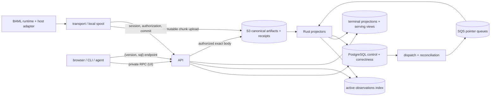

# BAML Studio (Playground) — Canonical Design

**Status:** Canonical implementation authority. Supersedes `stale-studio-design.md` (2026-07-27) in full; where the two disagree, this document wins. Applies the aligned query-surface decisions of 2026-08-04.
**Companion:** `profiling-design.md` owns the local capture substrate: the CCT engine, on-disk formats, the value CAS, compile-time identity, and the local SQL tier mechanics (projector, embedded chDB engine, view catalog v1). This document owns the *product* and the *distributed system*: what users see and do, the observation/run semantic model, capture-to-cloud delivery in every host environment, the hosted platform end to end (S3/PostgreSQL/SQS/ClickHouse), security, reliability, operations, and the validation program.
**Execution order:** `TASK/PLAN.md` (M0–M5).
**Audience:** engineers implementing, reviewing, operating, or inheriting this system. An engineer must not need to read the superseded documents to write code; they remain as decision history only.

## 0. How to use this document

The design is organized in the order a user experiences the product, then in the order bytes flow through the system: product (Part I) → semantic contracts (Part II) → capture and delivery per host (Part III) → local architecture (Part IV) → canonical evidence and the hosted distributed system (Part V) → the analytical store and the SQL surface (Part VI) → API and browser (Part VII) → data access and migrations (Part VIII) → security and reliability (Part IX) → packaging and developer workflow (Part X) → validation (Part XI) → delivery phases and the decision register (Part XII).

### 0.1 Decision labels

- **Locked** — implementation may proceed without another architecture decision.
- **Recommended default** — use this choice unless the named owner overturns it before the stated gate.
- **Benchmark-owned** — the semantic contract is fixed; the physical implementation is selected by a named benchmark.
- **Deferred** — not required for the current phase; the boundary is defined so either future option remains possible, and no current implementation may quietly depend on one.

### 0.2 The 2026-08-04 decisions (applied throughout)

1. **One user-facing query language everywhere: the ClickHouse SQL dialect over versioned, grain-named views.** The BQL pipeline DSL (built) and the StudioQueryV1 JSON AST (designed) are deleted, not deprecated. Natural-language questions are answered by a local agent skill that *generates SQL* against the documented view schema. The query-coverage response machinery — coverage modes, `query explain`, the eligible/examined/matched envelope — is deleted; the evidence facts it computed survive as queryable columns (§5.8).
2. **Hosted querying = a `(version, sql)` endpoint** routing to versioned views on ClickHouse Cloud; tenancy via **row policies (RLS)**; budgets via **role-level settings profiles and quotas**; CID-equality search gated behind value-read authorization (§6.5).
3. **Local = the existing Rust fold engine** (`bex_query`) for the UI **plus an embedded ClickHouse engine (chDB) over Parquet projections** for SQL (clickhouse-local retained as a fallback behind a thin engine seam; verified 2026-08-06 — profiling doc §10.4). No DataFusion, no analytical SQLite catalog.
4. **The UI runs on private RPC** over the fold engine (files + in-process RAM tap) — internal plumbing with no stability contract, not a query surface.
5. **One product surface: `baml playground`** (plus `baml query` for SQL). No separate `baml studio` command or app. No wasm/browser-only querying; promptfiddle-class browser hosts become **server-backed** (one `baml` binary per session). ("Studio" survives only as the initiative/brand name.)

### 0.3 Readiness by phase

| Phase | Scope | Readiness |
|---|---|---|
| **P-1** | Local CLI + SQL over existing `.baml/` artifacts, no cloud | Implementation-ready (profiling doc Q0–Q3 are the SQL-tier work items) |
| **P0-A** | Live local product: playground UI, run debugger, live updates, capture health | Implementation-ready (Q1 resolved: `fail_run` — §14, §65) |
| **P0-B** | Provider attempts, tools, agents, usage from `aaron/custom-llm-providers-v3` | Adapter boundary ready; exact schemas follow the landed runtime contract |
| **P0-C** | Hosted upload, durable commitment, projection, `(version, sql)` endpoint, fleet analytics | Implementation-ready at the service boundary; named product-policy values deferred (§67) |
| **P1** | Deferred scans, rerun, test generation, advanced export | Semantics defined; workflows follow P0 evidence |
| **Enterprise** | Customer-managed dependencies, packaging, identity, retention/durability tiers | Architecture retained; product decisions deferred (§67) |

No phase waits on a later one. P-1 requires no hosted schemas, no ClickHouse Cloud, no authentication, and no tracing-format changes.

---

# Part I — The product

## 1. What BAML Studio is

Studio is the observability product over BAML's always-on profiling substrate, delivered in three forms that share one implementation authority — the same Rust decoders, run reconstruction, value semantics, and view schemas; never separate interpretations of the telemetry:

1. **Local** — `baml playground`: CLI + browser UI + agent surface over `.baml/` artifacts on the developer's machine; no account, no server dependency. `baml query` runs SQL locally.
2. **Hosted** — the multi-tenant service: durable ingest of the same artifacts, fleet-scale querying, sharing, retention, operations.
3. **Offline operations tool** — the same binary reconstructing, repairing, reindexing, exporting, and validating retained artifact sets without the hosted service.

Any ClickHouse row, Parquet file, or browser cache is a *projection*. The artifacts are the evidence. Nothing user-visible is ever manufactured that the runtime did not emit.

## 2. The user journey

Studio uses **observation-centered discovery with run-centered debugging**.

An **observation** is one operation a user may want to find or compare — a BAML call, a provider attempt, a tool invocation, or the root operation of a run. A **run** is the complete execution context that explains how observations relate.

```text
recent operations
-> filter or ask a question
-> select an operation
-> open the containing run
-> inspect calls, threads, timing, values, logs, source, and evidence state
-> compare, reconstruct, rerun, or create a test when appropriate
```

The default list is not restricted to run roots: a failed provider attempt or a slow tool call can be the entry point. Once selected, the debugger shows the complete BAML run, never an isolated generic span.

### 2.1 Core workflows

**Find what went wrong.** List recent failed/incomplete observations; filter by function, kind, provider, model, environment, release, tag, time; open one and see parent, children, containing run, exact source location; inspect the error, typed values, logs, provider metadata, and capture status that actually exist; distinguish an application failure from missing telemetry, delayed projection, unsupported decoding, or redaction.

**Understand a slow execution.** Sort by duration; open the run timeline or flame view; inspect parallel BEX threads and spawn relationships; compare inclusive vs self time where the runtime emitted the evidence; see provider-attempt timing and tool timing when emitted; and never see a false claim about CPU time, wait time, or allocation the runtime did not record.

**Inspect data without loading everything.** See type, size, availability, and bounded previews for inputs/outputs/errors/captures; request one exact retained value on demand; search previews and explicitly indexed paths; run a deferred scan for an unindexed path; and always see whether the answer drew on complete, partial, redacted, expired, unsupported, or lost evidence — as columns and badges, not as a hidden footnote.

**Compare behavior.** Two observations or runs; functions/providers/models/releases/environments/program snapshots over a time range; latency, failure-rate, token, cost, and output-shape changes; and the individual evidence behind every aggregate.

**Work locally or with an agent.** Point the CLI at artifacts; get stable JSON/JSONL; ask a local agent a natural-language question and let it read the schema docs, write SQL, execute bounded queries, fetch runs/values/source by ID, and produce a cited narrative (§7).

**Reuse history — five distinct verbs, never one overloaded "replay":**

1. **Reconstruct** — decode the original artifacts again into the semantic model (no execution, no mutation).
2. **Reindex** — rebuild local or hosted projections from canonical artifacts.
3. **Reopen** — inspect a retained historical run without executing it.
4. **Rerun** — execute the program again with selected historical inputs and explicit configuration (new run identity).
5. **Create a test** — turn selected historical evidence into a reviewable regression fixture.

These are separate commands and separate audit events.

## 3. Questions Studio can answer

The catalog below defines the product more precisely than a list of storage engines. Each row names the required evidence, the normal path, and — the load-bearing column — what Studio must say when evidence is unavailable.

| User question | Required evidence | Normal path | When evidence is unavailable, Studio says |
|---|---|---|---|
| What failed in the last hour? | terminal structural outcomes | observation explorer; `runs_v1`/`errors_population_v1` | which runs are not structurally complete or not yet projected |
| Why did this run fail? | run graph, error, source, values/logs when captured | run debugger | exactly which fields are missing, omitted, redacted, lost, corrupt, or unsupported |
| Which function became slower after a deployment? | function identity, program/deployment dimensions, timing | population views joined across revisions on `definition_key` | unprojected or incomparable cohorts |
| Which provider attempt timed out before the successful retry? | provider-attempt events | observation search inside one run | "attempt facts were not emitted by this runtime version" — never an inferred answer |
| How much did this agent run cost? | usage for every attempt/turn | aggregate emitted usage × user's price table | provider-omitted usage and untraced attempts remain unknown |
| Which tool calls were blocked or modified by a hook? | typed tool/hook-decision events | run event stream | "hook decision facts unavailable" when not emitted |
| Show outputs whose top-level enum variant is `Rejected` | output summaries/schema | indexed summary query | rows whose availability is capture-disabled/redacted/not-indexed are countable beside the matches |
| Find values where `request.customer.email` ends in `.edu` | exact or indexed nested value path | interactive if indexed; deferred scan otherwise | values omitted, redacted, expired, lost, or not scanned — as explicit counts |
| Show all work for application user `123` / session `abc` | explicit application context | observation search on reserved dims/tags | absent context ≠ a user with no activity |
| Open the exact value for this call | retained value/CAS body | authorized, audited point read | the precise availability state and retention state |
| Reproduce this old result | program snapshot, inputs, runtime/config/provider requirements | rerun workflow (§40) | every missing prerequisite, listed before execution |
| Turn this production failure into a test | captured input + selected expectations | fixture-generation workflow (§40) | redaction review required; uncaptured dependencies identified |
| How much CPU did each function use? | CPU-sampling facts | self-time per calling context (profiling doc §7.3) is available; OS-level CPU sampling is not | "fact not emitted" for anything beyond self/await accounting |
| How long was this call waiting rather than executing? | suspend/resume records | await vs self split per context | for legacy artifacts without suspend records: "timing granularity unavailable" |

**Closing invariant:** Studio never converts "no matching indexed row" into "definitely no matching execution." Under the SQL decision this invariant is met by construction and documentation rather than a coverage calculator: population views are complete by contract; instance and value views carry availability/loss columns and evidence ledgers (`exact_windows_v1`, `capture_losses_v1`) that make "what was not evaluated" itself queryable; and the schema documentation teaches the reconciliation idiom for every trap (§39). A zero-match result over rows with `capture_disabled`/`redacted`/`lost` states is not a trustworthy negative, and the docs' own example queries demonstrate checking.

## 4. Product priority

### 4.1 P-1: artifact CLI + SQL before the rest

The first deliverable is a supported CLI that queries current BAML artifacts directly. It must work with: a single session directory; a `.baml/history` tree; sealed and torn (crashed) sessions; incomplete runs; old artifacts lacking future fields; wasm-exported artifact sets readable by the current decoder. It must not require: a hosted account, a server, PostgreSQL/S3/SQS/ClickHouse Cloud, a new tracing format, a complete source tree, or any mutation of the artifacts being inspected. (The chDB engine library is a cached, checksummed local dependency of `baml query` — profiling doc §10.4 — not a service.)

### 4.2 P0 capabilities

Watch an active run update live; open completed/failed/cancelled/abandoned/incomplete runs; inspect call tree, BEX threads, spawn relationships, timeline, flame; inspect inputs/outputs/typed errors/logs/exact values when captured; inspect provider attempts, retries, usage, tools, agent events, resource actions **when the runtime emits those facts**; jump from a call to its BAML source and schema; understand missing/omitted/redacted/lost/corrupt/unsupported/delayed/expired evidence; filter by function, status, snapshot, environment, release, user/session context, provider, model, tags; view latency/failure/token/cost trends from emitted facts; compare runs and cohorts; reconstruct and reindex.

P0 does not authorize Studio to manufacture facts `baml_language` does not emit: no provider HTTP scraping, no inferred hidden retries, no second LLM-event taxonomy beside the language runtime.

### 4.3 P1 and later

Arbitrary retained-value scans; historical rerun with explicit reproducibility prerequisites; test generation with review and redaction; richer exports; selected nested-path indexing policies; advanced cohort/compatibility queries. Annotations, replies, sharing workflows, scoring, prompt management, and a general evaluation platform are **not part of core**; they may be added later as ordinary user-authored control-plane data without touching the observation path.

### 4.4 Non-goals and hard boundaries

P0 is not: a port of the deprecated Engine Studio LLM-event model; a generic APM/OTel backend that flattens BAML semantics into spans; a promise to infer CPU/wait/allocation/attempts/schemas the runtime did not emit; **arbitrary raw SQL access to multitenant physical databases** — the product does offer user-facing SQL, but only over versioned serving views under row policies and quotas, never over physical base tables (§37); indexing every nested byte of every captured value; a cloud requirement for local debugging; a Kubernetes or multi-cloud control plane; exactly-once queue delivery (duplicate-safety is achieved semantically, §33); ClickHouse/Parquet/OTLP as canonical evidence; a collaboration/billing/evaluation suite.

Adapters and exports may interoperate with OTel/Parquet; they cannot replace the artifact and semantic contracts.

---

# Part II — Product concepts and semantic contracts

## 5. Concepts users and implementers share

### 5.1 Artifact

Retained evidence emitted by or derived from a BAML execution: profiling streams (`.bamlseg` CCT segments, `.bamlmeta` lifecycle, `.bamlprof` flight dumps/full traces/raw), value capture roots (`.bamlvalue`) and content-addressed CAS packs, dictionaries, source/schema snapshots when present, explicit run/root attachments, source and run completion manifests (introduced by hosted synchronization), and service-authenticated commit receipts (ditto). Immutable once sealed. A ClickHouse row, Parquet file, or browser snapshot is a projection, not canonical evidence.

### 5.2 Event

One immutable fact emitted by the runtime or a versioned adapter: call start/end, thread start/end, usage update, tool-call lifecycle transition, provider change, run completion. Events are not the default rows users browse; several events may describe one operation.

### 5.3 Observation

One user-facing operation assembled from emitted facts. Every observation has: a stable identity; a kind + schema version; a containing run when known; parent/root correlation when emitted or causally derivable; start and optional end; state and outcome; function/provider/tool/resource identity as applicable; value and metadata references; evidence state; artifact/projection provenance.

Initial kinds are capability-versioned, not hard-coded forever:

| Kind | Availability | Meaning |
|---|---|---|
| `run` | current artifacts | root user-visible execution when a root attachment exists |
| `baml_call` | current artifacts | one language/runtime call in the BEX graph |
| `model_attempt` | after the provider/runner contract lands | one provider attempt, including failed attempts |
| `tool_invocation` | after typed tool events land | one proposed/started/finished tool operation |
| `resource_operation` | after resource events land | poll, resume, session turn, background-job action |

Typed agent events (text deltas, provider changes, roster changes, usage updates, hook decisions, final outcome) remain event-stream facts; they become observations only when they have durable identity, parentage, a terminal condition, and discovery value. A newer runtime may emit a kind an older Studio preserves but cannot project; the kind is preserved and surfaced as `unsupported`, never dropped.

### 5.4 Run

The semantic debugging unit around a root BAML execution. Contains: root attachment + `BoundaryId` when one exists; calls and logical threads; explicit parent and spawn edges; values, errors, logs, and loss records; typed provider/tool/agent/resource facts when emitted; source and schema references; and **six independent state axes** (execution, structural completeness, value completeness, integrity, projection, retention — §49.1). A run is never defined by timestamps or by grouping whatever happened nearby in time.

**Cross-process boundary (recommended default, Q2):** one run = one runtime-owned causal graph in one process/engine graph. Crossing a process/service boundary produces **related runs** with an explicit correlation/parent link — never a merge of independent clocks and artifact streams into one supposedly exact graph. A future distributed-run layer may present related runs together once the runtime defines explicit cross-process propagation.

### 5.5 Program snapshot

The content identity of the BAML source and declared schema that explain an observation — needed to open the source actually in effect, compare before/after a change, avoid mixing incompatible type definitions in one query, decide rerun feasibility, and target test generation. The canonical identity is the compiler's revision identity (`baml_rev_1_…` — profiling doc §6.2; this concept and `RevisionId` are the same object; the hosted control plane stores it as `program_snapshots.source_snapshot_digest` + `declared_schema_digest`). Deployment name, git commit, application build, and release label are separate optional *dimensions* (`program_snapshot_aliases`); byte-identical snapshots may appear in many deployments (Q4, confirmed default: same content = same snapshot).

### 5.6 Effective schema

TypeBuilder-style runtime changes mean the declared snapshot may not describe a call. Contract: affected calls carry `program_schema_digest` + `effective_schema_digest` + an optional bounded, content-addressed `effective_schema_overlay_ref`; overlay size/depth limits are part of the language wire contract; oversized/unsupported overlays produce an explicit state, never an unbounded inline event. Studio never reverse-engineers a schema from returned values. Until the runtime emits this, type-aware queries are documented as partial (Q5, confirmed default).

### 5.7 Application context

Optional customer-supplied correlation (user, conversation, request, tenant, workflow, release). It is not the authenticated Studio user, the Studio tenancy, an ingest session, or a BEX thread. P0 supports bounded indexed tags; the runtime contract may reserve first-class `user_id`/`session_id` so common queries don't depend on tag conventions (Q3, confirmed default). Context freezes when an observation starts; changing it affects later observations and never rewrites history.

### 5.8 Evidence state (what replaced "coverage")

The deleted coverage machinery answered "how much eligible evidence did this result evaluate?" as a per-response envelope. That envelope is gone; **the facts it was computed from survive as data**, so the same question is answerable in SQL. Canonical vocabulary — the enum space of view columns, RPC DTOs, and UI badges, never collapsed to a boolean "has data":

- **Execution**: pending / running / waiting / cancelling / succeeded / failed / cancelled / panicked / abandoned.
- **Body/value availability**: pending / available / missing / omitted / redacted / lost / expired / unsupported / corrupt / not_emitted / capture_disabled / not_indexed.
- **Projection**: pending / active / delayed / failed / rebuilding.
- **Capture guarantee**: off / diagnostic / delivery_required / durable_spool.
- **Headline-reason precedence** (non-overlapping so totals reconcile in user SQL): `unsupported > corrupt > capture_lost > redacted > expired > disabled_by_policy > not_indexed > projection_delayed > complete`. Raw contributing reasons are also stored.

Every dataset that summarizes evidence (per run, per dataset, per indexed path) exposes eligible/evaluated counts, headline state, reason, policy version, and committed/projected watermarks as columns (§38.4). What was deleted is only the coupling of these facts to a query-response envelope and its modes; §39 carries the worked scenarios that used to define coverage behavior, restated as schema documentation.

## 6. The query surface

### 6.1 Why SQL, and why it is safe here (the decision, with its reasoning intact)

The stale design rejected physical SQL as the public contract for five reasons: local and hosted storage differ; physical tables change across projection generations; tenant scope and budgets must be mandatory; BAML domain semantics (grains, value paths, three-valued evidence) need a home; and an agent should construct safe queries without learning private layouts. Those requirements were real. The 2026-08-04 decision does not wave them away — it satisfies each with standard machinery instead of a bespoke language:

| Requirement | How SQL-over-views satisfies it |
|---|---|
| One meaning across local/hosted | one view DDL source (`db/clickhouse/views/`), deployed verbatim to the embedded local engine (init script) and ClickHouse Cloud (migrations) — one engine family, one pinned version stream; a CI conformance corpus asserts identical results on both (§56) |
| Physical churn must not break users | users query **versioned serving views** (`_v1`, `_v2`); physical tables are private, projector/migration-only; a projection generation swap repoints views with no user-visible change (§34) |
| Mandatory scope | hosted: row policies on base tables bind tenancy to the connection's identity — scope is not injected into query text, it is structural (§37.3); local: the filesystem is the scope |
| Mandatory budgets | hosted: settings profiles with MAX-constrained limits + quotas per role (§37.4); local: generated init SQL caps memory/time |
| Domain semantics | grain-named views (`*_population_*` vs `*_instances_*`), evidence-state columns, evidence ledgers, and documentation — the honesty budget moved from enforcement to schema design (§39; accepted residual risk recorded in profiling doc §10.1) |
| Agent safety without private layouts | the documented view catalog + in-database `COMMENT`s rendered by `baml query --schema` are the agent's whole world; base tables carry only the column-scoped grants INVOKER serving requires — never unrestricted access (§37.3) |

What SQL buys that the bespoke path could not: the full expressive surface (joins, window functions, arbitrary aggregation) with zero language maintenance; the massive SQL prior of every agent; and CID columns as a first-class join key (dedup = `GROUP BY cid`; verify-my-fix = self-join on input CID). What it costs, stated plainly: nothing *forces* an agent to consult the evidence ledgers before counting instance rows (BQL failed that closed); local/hosted engine-version drift is structural and must be held down by a pinned local engine, the hosted `compatibility` setting, and the conformance corpus as a release gate; and the old per-query mandatory time-range is gone — nothing forces a WHERE on time, so the fence against whole-history scans is the rows/bytes/time budgets of §37.4 (an accepted delta, recorded here).

### 6.2 The view contract

The public query unit is the **versioned, grain-named view catalog** — view names + columns + version are the stable integration boundary shared by the CLI, the hosted endpoint, agents, scripts, and editors. The v1 catalog (runs_v1, cct_population_v1, cct_windows_v1, llm_population_v1, spawn_edges_v1/spawn_instances_v1, call_instances_v1, exact_windows_v1, value_roots_v1, value_scalars_v1, capture_losses_v1, functions_v1, revisions_v1, derived error/hot views) is specified in profiling-design §10.2 with its design rules (denormalized identity, array histograms with integer-math quantile UDFs, `created_ms` ordering, run-scoped node ids). Hosted adds the observation-grain views over the projection tables (§37.2). Versioning discipline: additive column changes do not bump; grain/meaning changes do; N and N−1 served concurrently; N−2 fails loudly.

Convenience CLI filters (`runs list --status errored`) are RPC/CLI sugar over the same data — never a second query language.

### 6.3 Canonical value paths (kept as a data-model contract)

The query-AST path syntax died with StudioQueryV1, but the canonical structured path encoding survives — it is the keying scheme for indexed paths and path-level policy, independent of any query language:

```text
argument 0
argument named "request" -> field "customer" -> field "email"
output -> union arm "Rejected" -> field "reason"
map key "a.b" -> field "c"        # map-key vs field disambiguation is structural
list wildcard -> field "price"
```

Each path has a canonical encoding and a scoped digest (`path_digest`); display strings are derived and never authoritative. Views expose `path_digest` + a canonical rendering; indexing policy (§38.2) selects paths by digest.

### 6.4 The private RPC surface

The playground UI reads through ~6 private RPC method families served by the fold engine: run list, run snapshot + patches, CCT graph/profile, values list/read, source (the §41 hosted block is the route-level expansion — a superset of the local six). Served directly from fold state and projections; not obligated to route through SQL; no stability contract beyond the UI; free to churn with the UI. Cursor semantics live here (a cursor binds scope, sort key, schema version, projection generation when hosted, durable watermark, and expiry; opaque to callers) — this is the surviving home of the stale design's §6.6 cursor contract.

### 6.5 CID equality (resolved conflict)

The stale design ruled: *"Raw SHA-256 of short values is not a safe general equality index. Equality search uses no token or a tenant-keyed versioned HMAC with canonical type/path/normalization inputs."* The dictionary/confirmation-attack concern is real: a raw content hash of a low-entropy value (an enum variant, a small integer, a name from a list) lets anyone who can see the hash confirm guessed plaintexts.

The decision supersedes the HMAC design with a simpler rule, made possible by the canonical value CAS (CIDs already exist as the storage identity): **CID columns are visible only to principals already authorized to read the underlying values.** Enforced per surface: hosted — value-derived columns (CID, previews, summaries, content digests) exist only in the column-grant manifest of value-read profiles (§37.3); RPC — value reads are authorized and audited; scans — scan authorization implies value-read for the scanned scope; **and every egress**: exports and generated test fixtures re-tokenize or strip CIDs and content digests (an exported Parquet carrying raw CIDs would be a permanent confirmation oracle for its recipients), run-diff output, SSE patches, capture-health surfaces, and audit records carry token forms only, and local→hosted artifact promotion re-tokenizes rather than copying raw CIDs. A principal who can see a CID could read the value anyway, which collapses the attack to "confirming what you may read."

Consequences, stated plainly: (a) hosted CIDs are **tenant-scoped opaque tokens**, not raw local CIDs — the projector applies a **keyed PRF** (HMAC over the raw CID; ≥128-bit output, **never truncated** — truncation would mint collisions that silently corrupt `GROUP BY cid` dedup and verify-my-fix joins, and a value-injecting attacker could force them) under a per-tenant key held in KMS, scoped to the projector role. The transform is deterministic per (tenant, key version); **key rotation happens only at a projection-generation boundary** (§34 — old and new tokens do not join, so rotation is a reprojection). The honest property is "not correlatable across tenants and not reversible without the projection key" — not "impossible for operators": key-holders are governed by audit (§48.6), not cryptography. The schema docs state the hosted and local columns are not comparable; (b) any future product need to expose equality search to principals *broader* than value-readers must resurrect the HMAC-token design — that boundary is the contract, recorded here so nobody widens the grant without noticing.

## 7. Natural-language questions through a local agent

Studio embeds no LLM in the data plane. A local agent skill (Claude/Codex) uses the deterministic CLI:

```text
user question
-> read `baml query --schema` (view docs, grains, trap notes) and `baml playground capabilities`
-> write SQL against the documented views
-> execute bounded queries (`baml query`)
-> check the freshness footer and, for instance-grain queries, the evidence ledgers
-> fetch selected runs/values/source by ID (`baml playground runs show`, `values read`, `source show`)
-> synthesize a cited narrative with IDs the user can open
```

### 7.1 Skill-facing primitives

```text
baml playground capabilities --format json
baml query --schema [--view NAME] --format json
baml query "<sql>" --format json|jsonl
baml playground observations show ID --format json
baml playground runs show|graph|profile RUN --format json
baml playground values read REF --format json
baml playground source show SNAPSHOT [--file ... --span ...]
```

### 7.2 Worked example

> "Why were production requests slower after yesterday's release?"

The skill resolves the local-time interval; discovers release/revision dimensions (`revisions_v1`, snapshot aliases); queries duration aggregates before/after joined on `definition_key` (the documented cross-revision key); checks the cohorts are comparable (same functions present; `capture_losses_v1` quiet; projection watermark past the interval); picks representative slow contexts from `cct_population_v1` ordered by self-time; opens their runs and flame views; reports evidence, unknowns, and clickable IDs. Studio supplies typed facts; the agent interprets; neither silently upgrades a partial result to a complete claim — the skill is *taught* (by the schema docs it must read) to state material unknowns.

### 7.3 The integration boundary

The stale design's claim "the skill never generates ClickHouse SQL" is deliberately inverted: **SQL against documented versioned views is the integration boundary**, shared by every agent, script, editor integration, and future NL interface. The skill never parses human-formatted terminal tables and never sees physical table names.

## 8. Command surface and CLI contract

One command family. Representative surface by phase:

```text
# P-1
baml playground inspect [PATH]
baml playground artifacts list|validate [--deep]
baml playground observations list|show
baml playground runs list|show|graph|profile
baml playground values read REF
baml playground logs list RUN
baml playground reconstruct [--output ...]
baml playground export --format json|jsonl|parquet|otlp
baml playground doctor [--deep]
baml query "<sql>" [--schema] [--hydrate run=<id> role=<r> --max-bytes N | --hydrate --where <sql>] [--hosted|--both] [--no-refresh]

# P0-A
baml playground [serve]          # the UI server (default command)
baml playground tail
baml playground upload --to PROFILE
baml playground reindex
baml playground diff RUN_A RUN_B

# P1
baml playground scan ...
baml playground rerun RUN [explicit options]
baml playground test create RUN [selection/redaction options]
```

`PATH` may be omitted when the project has a discoverable `.baml`. OTLP export is an explicitly lossy interoperability projection, never canonical.

**Output contract:** structured results to stdout; diagnostics/progress to stderr; `--format json` = one versioned envelope; `--format jsonl` = schema-declared records; human output may change cosmetically, JSON meanings require versioning; IDs in human output are copyable and resolvable by a follow-up command. **Exit codes** distinguish success, no match, corrupt artifact, unsupported version, invalid SQL, authorization, transport, cancelled. **Local cancellation:** Ctrl-C terminates the in-process query cleanly (the engine's memory caps and disabled signal handlers guarantee loud failure, never a wedged CLI); hosted cancellation is `DELETE /v1/query/sql/{query_id}` (§37.1). (The stale coverage-coupled rule — "a partial result is never exit 0 unless the coverage mode permits" — dies with coverage modes; SQL limit/partial behavior follows ClickHouse semantics plus the documented freshness footer, which `baml query` prints to stderr so it can never be confused with result rows.)

---

# Part III — Capture and delivery (what sends data to the cloud, and how)

This part answers, environment by environment: what drains telemetry off the hot path, what makes it durable, what uploads it, and what changes per host. The profiling doc owns the *emission* side (records, rings, the consumer); this part owns everything from "complete records exist in a process" to "chunks are durably accepted by the hosted service."

## 9. Capture is not upload

### 9.1 Four responsibilities (locked)

```text
BAML instrumentation -> host-specific drain adapter -> optional durable spool -> optional upload transport
```

- **Instrumentation** (the runtime): emits structural facts and independently managed values/logs. Owns BAML identities and semantics. Never sees S3 credentials, hosted retry policy, cloud tenancy, or ClickHouse schemas.
- **Drain adapter**: drains complete records, preserves ordering metadata, creates local artifact bytes or record-aligned chunks, reports pressure. Placements: in the same process; a native background thread (the shipped default — the prof consumer of profiling doc §5.2); a sidecar/extension; cooperative wasm callbacks; or the standalone agent tailing files another process wrote.
- **Durable spool** (where the host has durable storage): decouples execution from network availability. Owns fsync, immutable chunk files, retry state, and reclamation-after-receipt.
- **Upload transport**: obtains bounded authorization, uploads immutable chunks, commits manifests, retains bytes until the service returns a contiguous durability watermark. Optional in local-only use.

A deployment may combine roles in one process; interfaces and failure reporting remain distinct.

### 9.2 Why an external agent process is not universal

A separate agent process is ideal for long-lived native applications (tails files, uploads later, restarts independently). It cannot be the only shape: Lambda may not permit a durable sidecar sharing the invocation lifecycle; Cloudflare Workers provide no conventional process or filesystem; browser/wasm needs cooperative draining; an embedded library may need delivery-before-return; and some users refuse daemons. "The agent owns networking" therefore means **the transport layer owns networking** — not "an OS process must exist everywhere."

## 10. Capability negotiation and capture modes

### 10.1 Negotiation

At startup or run admission the host adapter declares: capture mode; structural buffer bytes; value/log buffer bytes; spool kind and capacity; whether fsync/durable commit exists; whether remote delivery is available; maximum chunk bytes and age; shutdown/flush budget; supported artifact and event versions. The runtime records the *selected* capability + policy version with the run, so a reader can distinguish "capture was configured as diagnostic" from "durable capture unexpectedly failed."

### 10.2 The four modes (product semantics, not flags)

| Mode | Promise | Suitable hosts | When durable capture cannot continue |
|---|---|---|---|
| `off` | no evidence promised | any | none |
| `diagnostic` | bounded best-effort evidence; incompleteness allowed and surfaced | constrained edge, tests, default local posture (on by default with generous bounds, per the on-by-default initiative) | application continues; evidence state partial/unknown |
| `delivery_required` | an operation is not successfully observed until its evidence is durably accepted (remote or local) | serverless/edge without durable storage | block within budget, then fail the operation or mark observation failure per policy |
| `durable_spool` | admitted structure survives network loss after local durable write | native process/VM/container/desktop | pause admission; apply the structural-exhaustion policy (§14-C) when the spool cannot accept more |

Physics, stated once: **a host with neither memory nor durable storage cannot retain events.** It chooses `off`, tightly bounded `diagnostic`, or waiting for remote durable delivery. There is no architecture providing lossless asynchronous telemetry with zero storage.

## 11. Host matrix — where the mechanism must differ, and why

### 11.1 Native long-lived process, VM, container — `durable_spool`

```text
runtime rings/value queues -> native drain thread -> local .baml/ artifacts + immutable spool chunks -> embedded or standalone uploader
```

The hot path performs no network request, ever. Structural and value planes have separate pressure budgets. Chunk creation and fsync happen off the call-entry path. Network outages grow the bounded spool instead of blocking. A standalone agent may discover/tail artifacts started before it. Crash leaves a torn artifact that reconstruction reports explicitly (torn-tail recovery is golden-pinned — profiling doc §8.2). Container ephemeral disks are acceptable only if the deployment accepts their durability boundary or uploads before termination. The existing native profiler output is what gets uploaded — P-1 and local operation need no spool protocol at all.

### 11.2 AWS Lambda — `delivery_required` or `diagnostic`

```text
in-process runtime + drain adapter -> memory chunk builder -> optional /tmp spool (execution-environment lifetime only) -> batched upload/commit before handler success
```

Why it must differ: `/tmp` is execution-environment storage, **not** durability (a warm environment may return, code must not rely on it); extension shutdown is bounded and can end in forced termination; there is no guaranteed post-response compute. Rules: an extension improves batching but is never the correctness boundary; one-request-per-event is prohibited; chunks close small and bounded (bytes/records/age/handler-completion); in `delivery_required` the handler awaits the durability watermark before returning success; if the remaining invocation budget is insufficient, stop accepting new work or fail the observed operation per policy — never return success hoping an async flush completes. A Lambda *producer* does not imply Lambda *projectors*; producer host and hosted compute are independent choices.

### 11.3 Cloudflare Workers and edge isolates — `delivery_required` or `diagnostic`

```text
wasm/runtime callback -> bounded in-isolate chunk builder -> application-owned fetch/Queue/Durable Object/R2 adapter
```

Why it must differ: no sidecar, no durable local filesystem, small isolate memory, bounded and cancellable post-response work. Rules: the runtime drains cooperatively before the request loses execution time; a strong guarantee requires awaiting a durable queue/object acknowledgement; large values and streaming deltas are externalized or omitted under policy rather than accumulated in memory; the adapter advertises low chunk/buffer limits so the runtime degrades before OOM termination; `diagnostic` may lose the tail on abrupt termination — recorded as evidence state, never silent. The hosted API may offer an edge-friendly batched ingest endpoint where direct object-store authorization is impractical; it still accepts *chunks*, never individual events.

### 11.4 Browser / wasm (resolved needs-decision)

With promptfiddle-class hosts server-backed (§19.3) and browser-local querying deleted, the browser ceases to be a product storage/query host. Surviving scope: **wasm capture for embedded wasm SDK users, `diagnostic` mode only** — in-memory, cooperative drain, 4 MiB recorder, inline-only values; the embedding application hands chunks to its own transport if it wants durability. The stale design's OPFS/IndexedDB durable-spool machinery (quota probing, durable-before-claimed, resume-on-reopen) is **dropped**; revisit only on concrete embedded-wasm demand. Same-page live rendering via the wasm fold build survives for now (profiling doc §17-Q3 tracks its keep-or-drop against the size gate).

### 11.5 Local CLI, tests, offline import

No upload requirement. Reads immutable artifacts; produces rebuildable state (fold state + Parquet projections); never rewrites evidence to make it queryable.

## 12. Performance budgets

Six independent budget domains: structural producer ring; value/log capture queues; chunk builder; local durable spool; upload concurrency; live reconstruction state.

Nine rules:

1. No per-event HTTPS, S3, SQS, PostgreSQL, ClickHouse, or fsync operation — ever, in any mode.
2. Structural capture and value/log capture never share one undifferentiated queue.
3. Values/logs reserve capacity before expensive copying or encoding (reserve-before-copy: a failed reservation does zero work).
4. Large bodies become references; they never inflate structural records.
5. The drain adapter batches complete records.
6. Chunk close uses both age AND size bounds — low-volume runs stay timely, high-volume runs stay efficient.
7. Upload concurrency is bounded by bytes and outstanding authorizations, not task count alone.
8. The live UI consumes incremental semantic patches; it never reconstructs and resends a whole run per event.
9. Every capture benchmark reports application CPU, allocation, latency, memory, and failure impact — not just drain throughput.

Initial chunk tuning envelope (benchmark-owned, not a compatibility promise): stored bytes 8–32 MiB; age 250–1000 ms; records 50k–250k. At the D7 envelope (~2–3 MB/s per producer) the **age bound binds** — chunks close at ≤1 s and a few MB; the byte and record caps bind only at ≥150k records/s. Age tuning trades directly against hosted freshness: a 1000 ms age consumes half the event→queryable p50 budget (§50.6).

## 13. Current runtime behavior versus target

Honest inventory of the substrate as shipped on this branch (post-`fa1fd30` rebuild), against the delivery target:

**Current:** native structural profiling default-on; ring overflow policy abort (dev) / shed-ladder (servers) rather than silent drops; value/log queues bounded with counted losses; crash leaves torn tails that readers recover (golden-pinned); wasm capture cooperative + bounded; sessions seal and history is minted at boundary completion with D1/D2 durability; artifacts do not yet carry the hosted-sync fields (per-logical-thread sequence, completion manifests, chunk envelopes) — those are hosted-phase additions, not local requirements.

**Target (P0-A/P0-C additions):** sink-health independence (a file-write failure must not silently disable live reconstruction); explicit capability + capture policy records; record-aligned versioned chunking for upload; abandonment/pressure/loss as first-class diagnostics everywhere; deterministic sequence/completion via the runtime contract when the language team lands it; older evidence marked inferred/partial, never rewritten.

## 14. Resource exhaustion (scenarios A–F)

Resource exhaustion is not one scenario; each pressure boundary has its own defined behavior.

**A — value/log queue full.** Values/logs are lower priority than structural causality. Skip the body/record per its class budget; increment a stable, non-overlapping loss counter; preserve structural facts; show `value_lost`/`log_lost`/`summary_lost` in the run; never present an absent value as `null`; the application continues unless its own policy requires the value.

**B — structural drain behind, memory remains.** Grow only within the admitted structural budget; wake/increase bounded drain work; emit pressure metrics and a local diagnostic; never drop or sample structural records; no network work on the producer path.

**C — spool full, network unavailable.** Soft boundary, in order: (1) stop admitting new captured runs; (2) reserve capacity for closing already-admitted runs; (3) surface pressure through `doctor`, health, and run diagnostics; (4) attempt upload/reclamation without unbounded concurrency. Hard boundary — apply the run's preselected structural policy:

| Policy | Application effect | Evidence effect |
|---|---|---|
| `fail_run` — **the default (Q1, resolved 2026-08-06)** | current operation fails with a typed observability-capacity error; host process stays alive | evidence through the failure boundary retained; run terminal incomplete/failed |
| `abort_process` | process terminates after a clear fatal diagnostic | strongest "never continue unobserved" stance |
| `continue_incomplete` | application continues | allowed only for runs admitted in `diagnostic` mode; run permanently marked structurally incomplete |

The runtime never switches from a complete guarantee to `continue_incomplete` without recording the change before loss occurs.

**D — no durable storage and no remote.** `delivery_required`: stop before the in-memory reserve is exhausted; retry within the invocation budget; fail the observed operation if durable acceptance is unreachable; never success-and-hope. `diagnostic`: retain bounded evidence; report the undelivered range; allow application success.

**E — process/invocation/isolate/page killed.** The system cannot emit a fact after it stops executing. On next read/sync: a durable open-marker without completion becomes `abandoned`/`incomplete`; a torn trailing record is ignored, the intact prefix retained; no idle timer invents success or failure; the last durable watermark is shown; Studio claims no knowledge of markerless vanished bytes. (Hosted, reconciliation additionally classifies long-quiet open runs `stale_open` — an observability state, not an execution verdict; §29.)

**F — hosted service overloaded after commit.** Committed chunks are durable; projection is *delayed, not lost*. The service slows/stops new upload authorizations before unbounded cost; agents retain uncommitted chunks in spool; committed evidence waits in S3/PG even if every queue message is lost; the UI shows `projection_delayed` with the durable watermark; authorized point reads may reconstruct directly from artifacts when operationally safe.

## 15. Provider, tool, and agent alignment

The language-runtime team's branch `aaron/custom-llm-providers-v3` (owner: Aaron / language team; the landed schema in that branch is the contract of record, and P0-B tracks its landing) defines the language-level source: response metadata (provider, model, request id, finish reason, usage, attributes, raw), usage categories (input/output/cached-input/reasoning/cost), the runner/provider boundary, typed agent events, observer/recorder/hook roles, error capability axes, resource/session/background-job concepts.

**Studio must:** preserve and query these facts when emitted; attach them via explicit identities; retain **every** attempt, not just winners; aggregate usage without replacing attempt records; keep provider metadata as opaque typed/raw body references; apply capture/redaction/size/retention policy; display absent facts honestly.

**Studio must not:** introduce a second provider execution model; scrape HTTP traffic to reconstruct attempts; require a speculative `LlmExchangeV1` before the language design lands; interpret `Meta.raw` as a stable cross-provider schema; reconstruct session state from final values; treat effectful hooks as passive observations; store credentials or authorization headers.

**Adapter contract:** the landed runtime supplies versioned records (`ProviderAttemptStarted/Finished/Failed`, `UsageUpdated`, `ToolCallProposed/Started/Finished/Failed`, `ProviderChanged`, `ResourceOperationStarted/Finished`, `HookDecision`, `AgentRunFinished` — names owned by the landed schema). A versioned adapter in the decode layer (`bex_events`-family) maps them into events and observations; ClickHouse and UI code never parse branch-specific BAML source.

**Raw request/response policy:** raw bodies only under explicit capture choice; stable fields projected; `Meta.raw` and bodies stay value/blob references; authorization headers, cookies, credentials, signed URLs, key material never captured; bodies bounded/redacted/encrypted/lazy; no promise of exact HTTP reproduction unless the runtime supplies the bytes and ordering; the UI states `not_emitted | capture_disabled | redacted | lost | available`, never a blank. None of this is a P-1 prerequisite.

---

# Part IV — Local architecture

## 16. The fold engine and local discovery

The shipped fold engine (`bex_query`) incrementally reconstructs runs, observations, and values from `.baml/` files and from an in-process RAM tap for same-process live runs. Discovery mechanics: it discovers `.baml/history`, `.baml/sessions`, or explicit paths; records file identity, generation, offset, observed size, header digest, prefix digest, and decoder version; tails only complete length-delimited records (the committed-block scan protocol); detects truncate/replace/prefix-mismatch and starts a new diagnostic generation; incrementally reconstructs events/observations/runs/calls/threads/values/logs/losses; reads blobs lazily; and synchronizes/export exact artifacts — never a translation into a foreign cloud-event schema. It serves the private RPC endpoints (§6.4) and bounded CLI reads at interactive latency (2.62 ms run-open, measured — profiling doc §13).

## 17. Local durable state

**What was deleted:** the analytical `catalog.sqlite` + DataFusion stack. Local analytics are fold state (rebuildable, in-memory/mmap) + Parquet projections (rebuildable, manifest-tracked — profiling doc §10.4). The invariant survives retargeted: **delete all rebuildable state, rebuild from artifacts, and the normalized semantic hash is identical.**

**What remains (resolved needs-decision): one small `control.sqlite`,** because the non-rebuildable control responsibilities still exist and need transactional, single-writer durability that flat files don't give cheaply: local identity; root/run attachments not yet canonical in artifacts; capture/index/upload policies; immutable spool ownership; upload authorizations and receipts; contiguous synchronization watermarks; pending operations; migration audit. The decision banned the analytical SQLite stack, not a control store. P-1 runs without it (read-only, no upload).

Durability rules (carried verbatim as requirements): one writer, WAL, `synchronous=FULL`, bounded busy timeout, process lock, checked migrations, restrictive permissions; consistent backup before migration; **corruption stops upload and reclamation and never silently recreates state** (silently recreating would forget receipts and reclaim spool that was never accepted). Spool creation: same-filesystem temp file → fsync → atomic rename → fsync parent dir → transactional ownership commit in control.sqlite. Reclamation: record the contiguous accepted watermark transactionally **before** unlinking spool files. Uploads additionally pin CAS content: the local GC's mark set includes `uploads.pin` (profiling doc §8.6), so value packs referenced by not-yet-accepted chunks cannot be collected under the uploader.

## 18. Local SQL execution

`baml query` = Parquet projections + the embedded chDB engine (clickhouse-local as fallback); the mechanics (projector, manifest + CRC drift detection, hot-tail near-live at ~1–2 s, checksummed library download-on-first-use, embedding hardening, budgeted hydration incl. `--hydrate --where`, WSL-on-Windows, measured 0.4 ms warm-query cost) are owned by profiling-design §10.4/§10.6. A **resident** engine session (the playground server; the M4-stretch SQL box) additionally follows the reader-concurrency and manifest-keyed invalidation contract (profiling §8.6): caches invalidate on manifest-generation change, one engine connection per process, queries serialized through the session. Local specifics that belong to this doc: the projection directory participates in the rebuildability invariant (§17); `baml query` and the RPC surface must agree semantically wherever they overlap (a P0-A gate, §63); and the freshness footer is the CLI's non-SQL honesty channel (projected-through timestamp, hot-tail inclusion, run count in scope, capture losses in scope).

## 19. Local security

### 19.1 The local server

Binds loopback or a Unix socket only; validates `Host` and `Origin`; no wildcard CORS; one-time browser handoff exchanging for a rotated HttpOnly SameSite session cookie; explicit consent before any hosted page connects to a local agent; no filesystem reads from browser-supplied paths; exact value/body reads audited when local policy requires.

### 19.2 Value reads

The values panel and `values read` go through the authorized read path with budgets (byte/depth) and elision markers — the same budgeted hydration contract as everywhere else. Local audit is a policy toggle (on by default when a hosted profile is configured, off for pure-local dev).

### 19.3 Server-backed promptfiddle

Browser-only hosts get a per-session `baml` binary server-side (one binary per session). That per-session server carries the same origin/session discipline as §19.1 plus host-service-owned session lifetime and resource caps (CPU/memory/disk quota per session, TTL cleanup, no cross-session filesystem visibility). The browser never queries storage directly; it talks to its session's server exactly as the local browser UI talks to `baml playground`. The per-session server runs `baml query` under the **hosted lockdown, not the laptop posture**: its generated init SQL sets `readonly = 2`, denies table functions (`file`, `url`, `s3`, `remote` — otherwise arbitrary host-file reads and SSRF, including cloud metadata endpoints, from an anonymous browser session), disables introspection, and caps memory; the engine library's digest is re-verified at every launch and `BAML_CHDB_LIBRARY` is ignored in hosted mode; isolation is per-session uid/container with a read-only rootfs and no shared writable filesystem. The §19.1 consent for hosted-page→local-agent connections is per-origin and expiring.

---

# Part V — Canonical evidence and the hosted distributed system

## 20. Evidence model

### 20.1 Authorities

| Concern | Authority | What it means |
|---|---|---|
| Exact execution evidence | profiling/value artifacts, CAS blobs, source/schema snapshots, attachments, completion manifests, commit receipts — in files or object storage | can be decoded again after any code, schema, or projection bug |
| Hosted transactional state | PostgreSQL | tenancy, authorization, artifact commitment, idempotency, run attachment/completion, policy, outbox, projection checkpoints, generations, audit, deletion |
| Work delivery | SQS Standard | replaceable at-least-once pointers and retry timing; never evidence |
| Hosted analytical data | ClickHouse | rebuildable observation, run-detail, value/log, evidence-state, and rollup projections |
| Local non-rebuildable state | `control.sqlite` (§17) | spool ownership, receipts, pending sync, local attachments/policy |
| Local rebuildable data | fold state + Parquet projections | discovery and analytical acceleration |

### 20.2 Core invariants

1. **Exact evidence is canonical.** Deleting a projection must not delete acknowledged execution evidence.
2. **Commitment is explicit.** An uploaded object is not accepted evidence until its immutable manifest is transactionally committed and a service receipt is anchored.
3. **Projection is asynchronous.** Query delay is different from data loss.
4. **Queues are replaceable.** Losing every SQS message is repairable from PostgreSQL plus object storage.
5. **Structural guarantees are declared.** Complete, diagnostic, and failed capture are distinguishable.
6. **Identity does not depend on arrival time.** Chunks, records, calls, observations, and projection batches use deterministic identities.
7. **Tenant scope is structural.** Scope appears in credentials, keys, rows, cursors, row policies, and audit.
8. **Honesty travels as data.** Documented view semantics + queryable availability/loss/watermark columns; a negative result never claims more than the views assert; absent data is never rendered as false/null. *(Rewritten from "coverage accompanies answers.")*
9. **One semantic implementation.** One decoder/reconstruction stack and one view schema across local, hosted, offline, CLI, browser, and agent surfaces. *(Rewritten from "one semantic query implementation.")*
10. **Platform telemetry is separate.** Studio does not debug its own ingest outage through the customer artifact pipeline.

## 21. Source artifacts, chunks, and derived segments

### 21.1 P-1 reads current formats unmodified

P-1 reads existing artifacts as they are: tolerates documented torn tails, applies current identities, reports missing future metadata as inferred or unavailable. Shipping P-1 requires no artifact redesign.

### 21.2 Three byte-level concepts

- A **source artifact** is the exact runtime-produced file or logical value/blob artifact.
- A **source-range chunk** is an immutable, record-aligned byte range of exactly one source artifact, carrying enough provenance to reconstruct that range byte-for-byte. Chunks are the upload unit.
- A **derived segment** is an acceleration format produced from canonical evidence (a snapshot, a projection). It can improve speed; it cannot close a completeness gap.

The cloud accepts chunks without pretending a chunk is a run.

## 22. The chunk envelope and decode limits

### 22.1 `ArtifactChunkEnvelopeV1`

Wraps a source range for synchronization; does not redefine the profiler's inner records. Contents:

```text
protocol and schema version
tenant, project, environment, cell, ingest lane
source artifact identity and generation
source byte offset, byte length, total length when known
artifact media type and runtime version
stream identity, kind, epoch, sequence, predecessor digest
record count and optional time/causal-sequence bounds
plaintext content digest
envelope digest
compression and encryption metadata
capture policy and loss deltas/totals
source/program schema references when known
```

**Scope fields in the envelope are advisory.** Every projected row derives its tenant/project/environment/cell/lane solely from the PostgreSQL `artifact_chunks` record (authorization-derived); the projector asserts the envelope's claim equals that record and quarantines + security-audits any mismatch (`quarantined_corrupt`) — a tenant lying inside its own envelope can never write into another tenant's rows.

Framing: `magic | envelope_length | canonical_envelope | encoded_payload | authentication_tag`. Deterministic envelope encoding (canonical CBOR); payload compressed before optional application-level encryption; hosted storage always uses provider-side encryption, application envelope encryption is a policy/tier (§48.5).

### 22.2 Hard decode limits (violations quarantined, never partially accepted)

| Item | Limit |
|---|---|
| Stored ordinary chunk | 64 MiB |
| Decoded payload | 256 MiB and ≤32× expansion |
| Records per chunk | 500,000 |
| Individual structural record | 8 MiB (larger bodies use value/blob artifacts) |
| Nested decode depth | 128 |
| Sequence | zero-origin non-wrapping u64 |
| Compression | allowlisted Zstandard settings |
| Header encoding | deterministic CBOR |
| Decode work | streaming byte/allocation/CPU deadlines per task class |

## 23. Completion and root attachment

**Source completion manifest:** final source length, digest, record count, stream sequence, loss counters. **Run/session completion manifest:** the expected stream set, each marked required/optional/omitted/lost/unavailable; binds the run root and execution-result evidence. **Completion is never inferred from an idle timeout** (hosted reconciliation may still classify `stale_open` — an observability state, never a completion — §29). Older imported artifacts without manifests remain usable with explicit downgraded states: `source completeness: inferred/open`, `causal order: timestamp-inferred`, `program schema: unavailable`, `provider attempts: unavailable`.

**Root attachment** is an immutable mapping `boundary_id -> (process_id, engine_id, thread_id, call_id)`. The reconstructor follows explicit causal connectivity from that root; it never guesses a run from a filename or nearest timestamp. An unattached engine session is valid and queryable; the service never manufactures a `BoundaryId`.

## 24. Runtime prerequisites and language-owned records

### 24.1 Missing prerequisites (for the strongest hosted guarantees; not P-1 blockers)

Deterministic per-logical-thread event sequence; `$id`/`SetFunctionId` + heartbeat preservation; explicit source/run completion; sink-independent live/history publication; non-overlapping value-loss counters; incremental run patches; snapshot-at-cursor reconnect; stable adapter records after the provider branch lands. (The stale list also included a bounded durable wasm persistence contract — dropped with the browser-host decision, §11.4.) Until each lands, the decoder preserves evidence and reports the downgrade as data.

### 24.2 `ProgramSchemaManifestV1`

Open historical signatures, compare revisions, interpret declared types without repeating the schema per call:

```text
compiler/schema version
program snapshot and source digest
functions[]: stable definition key, FQN, kind, source span;
  parameters[] (ordinal, name, required/optional, canonical declared type);
  return and throws types
type definitions with stable revision identities
```

### 24.3 `CallArgumentsV1`

Distinguishes explicit null, omitted optional, defaulted, name, order, declared type:

```text
call identity
arguments[]: semantic ordinal and name; supplied|omitted|defaulted;
  declared type identity; value reference or inline bounded value
```

A generic unordered map is not the argument contract.

### 24.4 `CallValueSummaryV1`

Bounded type/shape/size answers when exact capture is off. Role-aware (inputs/outputs/errors): call + role; declared type and actual root kind; encoded bytes; string UTF-8 bytes + Unicode scalar count; immediate child count; optional policy-authorized equality token (per the §6.5 CID rule); exact-body availability + value/blob ref; summary origin + capture/index policy. Computing a summary must not force full serialization or exact-body retention.

### 24.5 Per-logical-thread sequence and effective schema

New structural events carry a zero-origin non-wrapping u64 sequence within (logical thread, epoch); timestamps remain timing evidence; old artifacts use documented timestamp sort + `causal_order=timestamp_inferred`. Effective-schema references per §5.6.

### 24.6 Compatibility behavior

Older artifacts produce explicit downgrade columns (`declared signature unavailable`, `argument order inferred`, `causal order timestamp-inferred`, `effective schema unavailable`, `provider attempt taxonomy unavailable`). Unknown fields/records are preserved and reinterpretable in a later projection generation. A decoder never upgrades a historical guarantee by assumption.

## 25. Hosted topology

### 25.1 The shape of the system



Two read planes leave the API: private RPC for the UI (fold-engine-shaped DTOs over the projections), and the `(version, sql)` endpoint routing to versioned serving views (§37). The **active observations index** is a bounded, rebuildable index of operations that have started but lack terminal evidence — users see running work through it; no durability claim depends on it; its engine/TTL is benchmark-owned (§66), whatever the diagram's node suggests (§29).

**One value, end to end** (the byte path, with owners): VM heap → reserve-and-copy into the TraceHeap at capture (profiling §5.4) → the value drain service canonical-encodes it into CAS chunks + a capture root, group-committed with `manifest.bamlcids` in the same barrier (profiling §9) → the boundary seals → the transport drains sealed bytes into a source-range chunk, envelopes it, fsyncs the spool (§27.3 steps 1–4) → single presigned PUT (§27.2) → batch commit + anchored receipt (§27.4) → outbox → SQS pointer (§27.5) → the projector validates and emits `value_roots_v1` rows plus the CID index (§27.6, §37.5) → visible through `(version, sql)`, or through an audited point read that range-GETs the chunk and budget-hydrates. The same value clicked in the *local* UI never leaves the machine: fold engine → pack read → budgeted decode (profiling §9.4).

### 25.2 Hosted stack (locked)

Terraform as the only infrastructure owner; ECS/Fargate for API, dispatch/reconciliation, sustained projectors, operations workers; S3 for canonical artifacts; SQS Standard for pointer work; managed PostgreSQL for control/correctness; ClickHouse Cloud for analytical projections; a static TanStack SPA calling the Rust API; OIDC for people, scoped service credentials for runtimes/automation. The data path requires none of: Kubernetes/EKS, Lambda, SST/Pulumi/CDK, Kafka, Kinesis, Redis, SNS, EventBridge, ClickPipes, browser-held database credentials. A producer on Lambda/edge changes nothing about the backend. There is **no PostgreSQL→ClickHouse CDC dependency of any kind and no browser→database path**: the projector is the only writer of analytical rows, fed exclusively by the outbox/queue pointer flow.

### 25.3 Regions, cells, ingest lanes

A **region** is the data-residency and failure boundary assigned at project creation. A **cell** is one bounded hosted data-plane allocation inside a region. An **ingest lane** pins a producer/source stream to one cell for its lifetime:

```text
(project_id, routing_epoch, ingest_lane_id) -> cell_id
```

`ingest_lane_id` is a stable hash of producer/source-stream identity over the lane set of that routing epoch. Adding capacity creates a **new routing epoch for new streams**; existing streams stay pinned until an explicit drain/copy/verify/cutover — and **the cutover protocol itself is designed-later work that blocks multi-cell GA** (it must rotate the stream epoch at the boundary with `previous_epoch_root` spanning cells, copy/verify objects whose keys embed the old cell, and split a contiguity ledger across cell databases with cross-database transactions prohibited); v1 is single-cell and adds capacity by new-epoch lane assignment only. The envelope's `cell` field is "cell at authorization time" — a routing record, not authenticated routing truth. Generation pointers are cell-local; multi-cell projects bind cursors and generations per cell (§37.6's cell scoping). Requests are never randomly re-homed.

A cell owns: its object-store bucket/prefix + KMS scope; online/replay/scan/admin queues + DLQs; API/projector capacity and admission budgets; a hot artifact-ledger PG allocation at multi-cell scale; a ClickHouse service/shard or isolated database allocation; observability dimensions, canary, runbooks. The initial deployment may share global control and `cell_000` on one RDS allocation — but two admitted data cells never claim independent failure boundaries while sharing one PG writer.

Single-run requests route to one lane/cell. Project-wide analytics fan out only across the project's bounded lane set and merge **typed partial aggregates or ordered cursors in the API** — never raw high-cardinality rows through PostgreSQL. Raw user SQL does not decompose this way, which forces the §37.6 multi-cell SQL rule.

### 25.4 Admission and backpressure

A cell is admitted from measured safe limits across every dimension: events and encoded bytes/s; chunk commits and PG WAL/index rate; S3 request/byte rate; KMS request rate; projector network/decode/insert throughput; ClickHouse merge and query capacity; hot ledger bytes and compaction rate; query concurrency and tenant skew. **Admitted capacity is bounded twice**: ≤50% of measured sustained maximum on elastic dimensions (projector compute, which scales out), and ≤ sustained/recovery-factor — i.e. ≤20% at the default 5× — on the non-elastic stores that must absorb catch-up in place (PostgreSQL WAL/commit rate, ClickHouse merge capacity), because recovery at N× admitted flows through components that do not scale with task count. The binding constraint per dimension is whichever is lower. Never assume S3/SQS throughput implies PG and ClickHouse can absorb the same load.

Backpressure follows bytes and age, in order: (1) local uncommitted spool bytes/oldest age → (2) committed-but-unprojected bytes/age → (3) projector decoded-byte backlog → (4) ClickHouse insert/merge/query pressure → (5) PG ledger/WAL/compaction pressure.

When a cell cannot safely accept more: preserve accepted chunks; cap projector concurrency before overwhelming ClickHouse; pause new upload reservations for existing sessions; reject new ingest sessions with 429/503 + `Retry-After` + a pause watermark; agents keep spooling locally; the capture-exhaustion policy (§14-C) triggers only when the producer's own reserve is gone. Issued authorizations stay bounded: a producer that ignores pause cannot obtain more signed keys, and bytes uploaded outside valid authorization remain uncommitted orphans — never accepted evidence. Query-side pressure is separately bounded by the ClickHouse role profiles/quotas **and a reserved workload class for projector inserts and merges** (§37.4) — 'a query storm cannot starve projection' is scheduling, not hope.

## 26. Deployable roles, dependencies, credentials

### 26.1 Roles

One versioned multi-call signed Rust image with explicit roles — `agent`, `api`, `dispatch`, `projector`, `operations-worker`, `migrate-postgres`, `migrate-clickhouse`, `replay`, `reindex`, `doctor`, `export` — plus the static SPA artifact.

### 26.2 Service matrix

| Role | Purpose | Inputs | Outputs | Durable state it owns | Required deps | Must NOT receive | Scale/failure behavior |
|---|---|---|---|---|---|---|---|
| agent/transport | local discovery, drain, spool, local API, optional sync | runtime records, local artifacts | local artifacts, immutable chunks, upload commits | `control.sqlite` + spool; rebuildable fold/Parquet state | filesystem; hosted API/object upload when connected | hosted DB credentials; browser-supplied paths | one per host/workspace; network failure grows bounded spool |
| api | auth, RPC reads, `(version, sql)`, ingest authorization/commit, point body reads | HTTP from browser/CLI/agent | JSON/SSE, presigned authority, PG transactions, CH queries | none (PG transactions are the authority) | PG, CH query role, S3 read/attributes authority, OIDC/KMS | CH DDL; unrestricted S3 delete; projector write creds | horizontal; control-plane loss stops ingest but loses no committed objects |
| dispatch | publish outbox, repair, canary | due outbox rows, stale checkpoints | SQS pointers, repair/audit state | PG leases/attempt state only | PG, SQS, S3 attributes | customer body decryption; CH schema mutation | independent; duplicates harmless; outbox priority > reconciliation > canary |
| projector | verify artifacts, build deterministic projections | SQS hints + authoritative PG state + S3 objects | CH batches, PG checkpoints, evidence state | immutable snapshots in S3; PG fenced checkpoints | SQS, PG, S3/KMS, CH insert role | admin privileges; browser secrets; arbitrary tenant scans | scales by pending bytes/age; pre-checkpoint loss retries; stale lease cannot advance |
| operations-worker | scans, exports, deletion steps, replay/reindex ranges | typed SQS op pointer + PG op state | result artifacts/projections, progress | PG op/checkpoint state; S3 results | PG, SQS, S3, bounded CH | online queue budget; unrelated tenant data | separately reserved capacity — scans never delay ingest |
| migrate-postgres / migrate-clickhouse | apply checked-in schemas | signed image + admin endpoint | migration ledger + audit | the store's schema | direct admin role | application traffic; the other store's admin | one-shot singletons; failure halts rollout |
| SPA | discovery + debugging UI | versioned HTTP/SSE | rendering | bounded browser cache | api | any database/object credential beyond narrow body URLs | static hosting |

### 26.3 Credential separation

Distinct principals for: API control transactions; API analytical query (**the SQL endpoint's read-only CH role family under row policies — cannot write CH**); agent ingest authorization; projector object read/decrypt; projector CH insert; operations scan/export/delete; PG migration; CH migration; security-audit export. The API query role cannot write ClickHouse; the projector cannot administer tenants; the browser never receives CH/PG credentials; SQS messages never grant access — workers reload scoped authoritative state.

### 26.4 External dependency matrix

| Dependency | Role | Authority | If unavailable | Rebuild/replacement boundary | Needed by P-1? |
|---|---|---|---|---|---|
| S3/object storage | canonical hosted artifacts + receipts | exact hosted evidence after receipt | new uploads/point bodies fail; committed objects remain | adapter must preserve checksum/create-only/version semantics | No |
| PostgreSQL | control/correctness | transactional truth | ingest/control/routing fails; agents keep spool | PITR restore + receipt/segment reconciliation | No |
| SQS Standard | at-least-once pointers | none | projection delayed | republish from PG state | No |
| ClickHouse | hosted projections + SQL serving | none | fleet analytics delayed; evidence remains | recreate schema, replay active generation from artifacts | No |
| OIDC provider | human authentication | identity assertion only | new logins fail; service creds and bounded sessions per policy | OIDC claims adapter | No |
| KMS/secrets | key protection | key availability | affected uploads/decrypts stop; no plaintext fallback | provider adapter + escrow/rotation runbook | No |
| CDN/static hosting | SPA delivery | none | browser down; CLI/API fine | redeploy immutable assets | No |
| Platform telemetry | operating Studio itself | none for customer evidence | reduced diagnosis; product path never blocks on it | OTLP/Prometheus/JSON portable contract | No |
| Local FS | local artifacts, spool, control | local evidence per mode | behavior follows capture mode + §14 | filesystem adapters; rebuildable state rebuilt, control restored | readable files only |

No dependency substitutes for another: ClickHouse is not artifact backup; SQS is not a ledger; platform logs are not the security audit store.

## 27. The hosted ingest protocol

This is the full byte-flow contract from "the transport holds an fsync'd chunk" to "the chunk is durably accepted, dispatched, and projected."

### 27.1 Session creation

An authenticated agent/adapter creates a short-lived ingest session. The API resolves: tenant, project, environment; home region, ingest lane, cell; capture/index/retention policy; admitted byte/chunk rates and the outstanding-authorization window; supported artifact/envelope versions; required durability level (§49.5).

### 27.2 Upload authorization

The agent first creates and fsyncs the immutable spool object (§17 spool rules), then requests a **batch of exact upload authorizations**, each naming immutable identity, stored length, and full-object checksum. The server reserves bytes/object count and selects immutable sharded object keys; presigned requests bind exact key, expiry, length/checksum headers, required encryption headers, and create-only behavior (required — see below). **Presigned URLs are bearer secrets: never logged, never in browser-visible diagnostics.**

Object key shape (server-selected; the shard prefix spreads request load; the scoped path drives IAM, inventory, lifecycle, and deletion):

```text
artifacts/v1/shard=<hash-prefix>/tenant=<uuid>/project=<uuid>/
environment=<uuid>/cell=<id>/lane=<id>/ledger_date=<yyyy-mm-dd>/
stream_epoch=<uuid>/sequence=<u64>/<chunk_uuid>.bamlchunk
```

**Multipart is forbidden for chunk uploads** — chunks are ≤64 MiB, one PUT each: single-part full-object checksums are the only ones the store verifies end to end, and composite multipart ETags prove nothing. Conditional create (`If-None-Match: *`) is **required** (an object store lacking it fails provider qualification, §53), with the checksum bound in the signed headers. Ingest credentials cannot overwrite or delete. Object key + **version id**, stored length, and full-object checksum become immutable manifest fields — the version id binding means the projector's later GET provably reads the committed bytes. Caller-supplied metadata is never integrity proof. `ledger_date` is pinned at *first* authorization and reused verbatim by every retry of the same chunk identity (§46.4).

### 27.3 Client lifecycle (nine steps)

1. Drain complete records into a source-range chunk.
2. Build the deterministic envelope.
3. Compress, then optionally encrypt.
4. Write and fsync the immutable local spool object (where storage exists).
5. Upload with signed checksum and create-only semantics.
6. Resolve an ambiguous upload by attributes/checksum comparison or byte-identical create-only retry.
7. Batch-commit uploaded manifests to the API.
8. Retain local bytes until the response carries the receipt-backed durability watermark — **min(contiguous committed, contiguous anchored)**, per §27.4.
9. Reclaim only through that contiguous watermark — a later committed sequence never hides an earlier gap.

### 27.4 Commit transaction

The API verifies authenticated scope, authorization, object key/version, stored length, full-object checksum, quota, immutable identity, and manifest syntax — **without downloading, decrypting, or decoding the object** (the commit path is latency-sensitive; semantic validation belongs to the projector). One short PostgreSQL transaction then: idempotently inserts (or resolves) the immutable chunk identity; rejects a conflicting manifest hash; creates projection requirements for the active and any building generation; creates a pending deterministic commit receipt; advances only **contiguous** committed stream heads; writes audit/accounting facts.

After the transaction, the API writes and verifies the deterministic, service-authenticated **receipt object** in S3 and marks the receipt anchored — only then does it acknowledge durable acceptance to the client. Receipt objects live under a deterministic dedicated prefix (`receipts/v1/tenant=…/project=…/ledger_date=…/commit=<id>.receipt`) so a PostgreSQL restore can *list and re-import* them without PG state (§49.2). The receipt proves which exact bytes were accepted; a later semantic verdict (corrupt/unsupported) never erases the acceptance audit.

Two watermarks are tracked per stream: `contiguous_committed_through` (PG transaction order) and `contiguous_anchored_through` (receipts verified in S3). **The client-visible durability watermark is min(committed, anchored)** — so spool reclamation can never outrun receipt anchoring, even when a later commit succeeds while an earlier receipt write is still retrying (the earlier gap holds the watermark down).

### 27.5 Outbox and SQS

The API attempts immediate SQS publication after commit; a transactional outbox guarantees dispatch can republish if the API dies. Messages are small untrusted pointers:

```json
{"version":1,"tenantId":"…","projectId":"…","environmentId":"…","cellId":"…","laneId":"…",
 "ledgerDate":"2026-08-04","chunkId":"…","projectionKind":"online","projectionGeneration":7,"enqueuedAt":"…"}
```

Workers reload and re-verify every scoped field from PostgreSQL before touching data — duplicate, delayed, reordered, or lost messages cannot affect correctness. Four queue classes with reserved capacity: **online projection, replay/reindex, deferred scans, admin/export/deletion.**

| Setting | Online | Replay/reindex | Deferred scan | Admin |
|---|---:|---:|---:|---:|
| Long poll | 20 s, ≤10 msgs | 20 s, ≤10 | 20 s, ≤10 | 20 s, ≤10 |
| Source retention | 4 d | 14 d | 14 d | 14 d |
| DLQ retention | 14 d | 14 d | 14 d | 14 d |
| maxReceiveCount | 8 | 8 | 8 | 8 |
| Initial visibility | max(5 min, 3× processing p99), <12 h | independently measured | checkpointed, <12 h | operation-specific, <12 h |

Workers renew visibility before ⅓ of the interval remains and batch deletes. Work that cannot checkpoint below SQS's ceiling is divided into deterministic ranges — never dependent on an in-memory lease living forever. Queue retention is transport tolerance, not evidence retention. Fair-queue grouping by tenant/project reduces dwell for quiet tenants but is **not** the quota system (byte admission, worker scheduling, and lanes/cells enforce isolation). FIFO queues are not required: semantic order comes from artifacts and checkpoints, not transport.

### 27.6 Projector lifecycle (thirteen steps)

1. Receive a pointer hint.
2. Reload the committed stream/generation requirement from PostgreSQL.
3. Acquire a renewable stream lease with a monotonically increasing **fence epoch**.
4. Start from the durable `next_sequence`; select only a contiguous committed range.
5. Stream objects with bounded parallelism, applying deterministic semantic order.
6. Validate stored checksum, framing, envelope, authentication, scope-equality (envelope vs PG record — §22.1), decompression limits, plaintext digest, record structure, and source range; producer wall-clock bounds are validated here too — event times outside `ledger_date ± policy window` are clamped for partitioning/retention purposes and flagged (`clock_skew_flagged` evidence column), so a skewed producer cannot write into arbitrary partitions or trigger absurd retention.
7. Restore the bounded incremental state snapshot when needed.
8. Emit normalized events, observations, run detail, values/logs, and evidence state.
9. Write deterministic ClickHouse batches — batch id + row ordinals, where **batch partitioning is a pure function of the committed ledger (fixed sequence ranges per batch), never of worker memory, load, or coalescing state** — so a fenced-out worker and its successor produce byte-identical batches.
10. Verify uncertain writes by batch identity and row hashes (read-back), with replica-consistent reads (`select_sequential_consistency` or insert dedup tokens) so a lagging replica cannot produce a false negative and a phantom reinsert.
11. Advance the fenced checkpoint only after required analytical visibility verifies.
12. Delete SQS messages at or below the durable disposition.
13. Emit best-effort wake-up hints; API snapshots/cursors remain authoritative.

The worker holds **no PostgreSQL transaction during S3 or ClickHouse I/O**. Terminal chunk dispositions: `projected | quarantined_corrupt | blocked_unsupported_version | suppressed_tombstoned | retryable_after(ts, reason)`.

State snapshots: immutable S3 objects referenced by sequence/digest from the checkpoint; snapshot at least every 64 chunks / 256 MiB decoded / 30 s of state change; recovery = last snapshot + bounded replay. Snapshots are an optimization, never a substitute for artifacts. On termination: stop receiving, finish only what fits the stop budget, leave the rest to lease/visibility expiry; **never checkpoint or delete after fence loss.** Keep ordinary online chunk p99 comfortably below the task stop timeout.

### 27.7 Reconciliation (correctness work, not cleanup)

Dispatch continuously repairs: uploaded-but-uncommitted objects past grace — via a **delete-intent protocol**: reconciliation writes a PG delete-intent row first, the commit transaction refuses any chunk with a live intent (forcing the client to a fresh authorization), the ledger is re-checked immediately before deletion, and removal is a versioned delete-marker so a lost race is recoverable; grace must exceed max(commit latency, object-listing staleness), and a standing check alerts on "committed chunk whose object carries a delete marker"; committed chunks without published outbox work; published work without terminal checkpoint; expired leases; SQS/DLQ loss; stream gaps and completion disagreement; ambiguous or conflicting ClickHouse batches; tombstoned projects still receiving work; obsolete projection generations; incomplete multipart uploads and quarantine retention. Reconciliation has an SLO, dashboard, alert, and runbook (§51).

### 27.8 Why sustained projectors run on Fargate

They need reusable S3/PG/KMS/CH connections, cross-chunk row coalescing (within deterministic ledger-defined batch boundaries — §27.6 step 9), predictable memory/CPU, replay work exceeding any serverless window, independent online/replay pools, and scaling by pending bytes/oldest age. Lambda may later serve small burst cells; it is not the canonical sustained worker.

---

# Part VI — The analytical store and the SQL surface

## 28. Logical shapes

The API exposes two logical observation shapes — `ObservationSummaryV1` (bounded discovery fields for lists/filters/charts) and `ObservationDetailV1` (complete identity/provenance/relationships/references after selection). The split is locked; it does **not** require two physical tables on day one (§32). Under the SQL decision these shapes are also the basis of the observation-grain serving views (§37.2).

## 29. The active observations index

`observations_active_v1` holds only non-terminal operations: observation identity/kind; run/root/parent when known; function/provider/tool/resource context when known; start time and current execution state; latest causal state version; latest bounded progress/preview; committed and projected watermarks; evidence state so far; expiry.

Rules: rebuildable from committed artifacts + projector checkpoints; short retention after last progress/terminalization; version resolution confined to this bounded working set; never feeds long-range rollups; a terminal observation **shadows** its active row; loss of the index = delayed visibility, never evidence loss. Bounds (benchmark-owned defaults): ≤100k active rows per project; expiry 24 h after last progress; overflow admits new opens and evicts oldest with a counted eviction surfaced in the evidence datasets.

**Staleness is classified, outcomes are never invented.** No idle timer terminalizes an *execution*: nothing ever becomes "failed" or "succeeded" by silence. But hosted reconciliation does apply a recorded classification of *observability* state: an open observation whose stream shows no committed progress past a policy window, with no completion manifest, transitions to `stale_open` — carrying the last committed watermark and the policy id — because "on next read" never happens for a vanished host (§14-E). `stale_open` rows remain discoverable after active-index expiry: the explorer's third surface beside active and terminal.

## 30. Terminal observations

`observations_terminal_v1` holds one visible immutable terminal fact per logical observation per projection generation. Full column inventory (the bounded fields normal list/chart queries need):

```text
scope        tenant, project, environment, generation
identity     observation id/kind/schema version; run, root, parent; BAML call/thread/process identities
operation    function identity + source call site; provider/model/attempt when emitted; tool/resource when emitted
result/time  start/end/duration; terminal status; typed error category
program      program snapshot; compiler/runtime/SDK versions; release/service/application-build dimensions
data summary declared/effective type identity when available; actual root kinds/sizes/child counts;
             body availability + opaque references; policy-authorized bounded preview
usage        provider-emitted token categories, cost, timing; emitted-vs-estimate flags
context      bounded tags + reserved application dimensions (user_id/session_id when landed)
evidence     structural/value/log/schema/provider headline states; capture/redaction/index/retention policy versions
provenance   source artifact/range/record; decoder + projection schema versions; deterministic row and batch hashes
```

Exact bodies, unbounded tags, full event streams, complete graphs, and source files stay in detail datasets or object storage.

## 31. Run-detail datasets

BAML-specific projections for bounded drill-down: runs with independent state axes; calls and threads with full composite identities; graph/spawn edges; the provider/tool/agent/resource event stream; call input/output/error summaries (§38.1); captured-value metadata and selected indexed paths; logs and liveness; source/schema/function dimensions; per-dataset/per-path evidence state; projection integrity. The primary observation list never performs a high-cardinality cross-database join against these; opening one run uses bounded `run_id`-scoped queries.

## 32. Physical layout: one table or two

The product needs summary and detail shapes; the physical split is not assumed. **Recommended default: one physical terminal table + selected ClickHouse column projections**, because it gives one projector write, one correctness boundary, no full/core synchronization, less duplicate storage, and simpler generation migration — and column pruning already makes summary queries cheap when bodies are references. Split into `observations_full_v1`/`observations_core_v1` only if the §60 benchmark proves: summary queries scan materially more bytes or miss SLO from row width; parts/merge/compression degrade under representative metadata; a distinct order key materially improves core queries; or expected detail growth makes one table unsafe. This avoids building a second synchronization path from analogy instead of measurement.

## 33. Duplicate safety, immutability, and why users can trust raw SQL

SQS and object processing are at-least-once; a worker can write a ClickHouse batch and die before learning the outcome; the same logical observation may be physically inserted more than once. The user must still see it exactly once — and now that users run raw SQL against serving views, this contract is the foundation the whole query surface stands on.

**Are entities in ClickHouse immutable? Yes, by contract:**

| Fact | Behavior |
|---|---|
| Terminal runtime observation | immutable |
| Active/incomplete observation | bounded versioned row in the active index only |
| Event/log/loss fact | immutable, duplicate-safe under retry |
| Evidence/reconciliation state | versioned (knowledge changes; history doesn't) |
| Major decoder/schema reinterpretation | new projection generation (§34) |
| Rare correction to terminal evidence | new generation or explicit correction overlay — never in-place mutation |
| Future user-authored metadata | PostgreSQL authority; at most a low-rate analytical copy |

ClickHouse never decides acceptance, ownership, execution success, retention, or deletion completion.

**The duplicate-safety contract:** (1) every terminal observation has a deterministic logical ID and row hash; (2) every batch has a deterministic batch ID and row ordinal; (3) after an uncertain insert the projector reads back by batch ID before reinserting; (4) identical physical duplicates collapse to one semantic fact; (5) same logical ID/version with a **different** row hash is a conflict — represented in serving views as one visible row with `integrity_state='conflicting'` and the disputed columns nulled (populations and rollups still count the observation: a conflict must never silently shrink "what failed last hour"), detailed in `projection_integrity_conflicts_v1`, and never resolved by "latest arrival"; (6) a checkpoint advances only after all required rows verify; (7) **no query — user SQL included — relies on background-merge timing or a finite dedup window.** Physical mechanism (benchmark-owned, §60): a plain immutable MergeTree after failure-injection proves single-write behavior on every supported topology, or a duplicate-safe serving view / verified-segment visibility fallback. Either way, **the serving views expose only duplicate- and conflict-safe results** — users cannot observe the difference, which is exactly the point. `FINAL` and ReplacingMergeTree-style latest-row semantics are not part of any common query path.

**Row provenance** (every analytical row): tenant/project/environment; generation + decoder + projection-schema versions; program snapshot; source artifact/chunk/record identity + digest; logical row ID + semantic version; row hash; batch identity; the full BAML identity chain; projected time + evidence state. Hashed display IDs never replace composite identities.

## 34. Projection generations

A major decoder or physical-schema change: (1) creates generation B; (2) new commits project to active A **and** building B; (3) older committed evidence replays into B from an immutable barrier; (4) validation compares counts, hashes, evidence states, query results, replicas; (5) an atomic PostgreSQL pointer switch activates B; (6) A is retained as a rollback shadow for a bounded window **and keeps receiving dual-projection of new commits for that entire window** — rolling back to a generation that stopped ingesting at activation would serve a hole spanning the whole active period; rollback = pointer repoint + typed cursor recovery (cursors bound to B resnapshot at A's watermark); (7) audited retirement ends the dual write. Requests and cursors bind one generation; temporary double storage/compute is a stated capacity requirement. **Versioned view names are the user-visible face of generations**: `runs_v1` is repointed at generation-B physicals with zero user-visible change — this is why physical churn is safe under a public SQL surface. Caveat carried into user docs: view versioning covers the *result* contract, not the *cost* contract; a re-grain can change a query from index-hit to full-scan under the same name, and hosted quotas then make it fail rather than crawl — the conformance corpus tracks rows-read per catalog query across generations and flags regressions (§56).

## 35. Ordering, partitioning, and query optimization

**Are we optimizing queries? Yes — by design, in five layers:**

1. **Physical order and partitioning** (benchmark-owned, checked into versioned DDL). Starting point: `PARTITION BY month(started_at)`; `ORDER BY (tenant_id, project_id, projection_generation, date(started_at), function_family_or_kind, started_at, observation_id)`. Tenant is **never** the partition key (partition-per-tenant explodes part counts); leading the order key with tenant/project makes every tenant-scoped query a contiguous range read — which is also the §37.3 noisy-neighbor mitigation, since row policies filter but do not partition.
2. **ClickHouse projections** (the feature) for secondary access paths — a measured projection ordered for run-id lookup so run-open is not a scan through the time-ordered primary; candidates only, admitted by the §60 benchmark.
3. **Pre-aggregation where the product needs it** (§36 rollups) — scheduled, verified, checksummed; never insert-time AggregatingMergeTree over duplicate-prone raws. And the deepest pre-aggregation is upstream: CCT population rows arrive *already aggregated by the runtime* (one row per calling context, not per call — the profiling substrate is itself the biggest query optimization in the system).
4. **Query-shape discipline**: the primary list never cross-joins high-cardinality datasets; run detail is `run_id`-scoped; fleet queries merge typed partial aggregates; no unbounded `FINAL`; bounded result/row/byte/time limits per role (§37.4). The catalog's documented example queries are all written to these shapes, and the conformance corpus records their rows-read.
5. **Local tier**: hive-partition pruning on `run_id=` paths, Parquet row-group statistics, zstd, file compaction at ~500 files/view, explicit schemas (no inference), and the embedded-engine invocation (init script + in-process session, 0.4 ms warm) measured against the M2 latency gates (profiling doc §10.4).

## 36. Rollups (the aggregate policy)

Rollups are **scheduled recomputations from verified terminal observations after a lateness watermark** (conflicted rows counted under their `integrity_state`, per §33) — never insert-triggered aggregates over raw rows that may still contain duplicates or conflicts. Initial set: status counts by function/provider/model/release/environment; duration distributions; usage/cost totals from emitted facts; evidence-state counts; each with contributing-count and aggregate checksum columns so a rollup is auditable against its inputs. A late correction or a new generation recomputes the affected closed windows. Rollups surface as grain-named views (`function_rollups_1m_v1`) and are the mergeable shape multi-cell fleet queries use (§37.6).

## 37. The public SQL surface: `(version, sql)` on versioned views

### 37.1 The endpoint

```text
POST /v1/query/sql
{ "version": "v1", "sql": "SELECT ...", "cell": "optional, multi-cell projects only" }
```

`version` names the **contract**: view schema vN + the documented SQL dialect subset + the pinned canonical engine version. The API authenticates, resolves tenant → ClickHouse identity, stamps a query id, executes under the tenant's role, streams results, and audits (statement text, actor, scope, cost). The browser and CLI never hold ClickHouse credentials; every statement transits the API. The stamped `query_id` is returned immediately; `DELETE /v1/query/sql/{query_id}` cancels a running statement (mapped to `KILL QUERY`), and cancellation is advertised in capabilities.

### 37.2 What is queryable

Only **versioned, grain-named serving views** in the serving database. The hosted catalog = the shared catalog (profiling doc §10.2: runs/cct/llm/spawn/value/loss/dictionary views) plus the observation-grain views over §29–§31, by name: `observations_active_v1`, `observations_terminal_v1`; run-detail `calls_v1` / `threads_v1` / `graph_edges_v1` (observation-grain — distinct from the shared catalog's *windowed instance* views `call_instances_v1`/`spawn_instances_v1`, which keep their exact-window grain contract); `operation_events_v1`; `function_definitions_v1` / `function_parameters_v1`; `call_inputs_v1` / `call_outputs_v1` / `call_errors_v1`; `captured_values_v1`; `value_nodes_v1` (P1); `logs_v1`; `capture_losses_v1`; `engine_liveness_v1`; `run_dataset_evidence_v1` / `path_evidence_v1`; `function_rollups_1m_v1`; `projection_visibility_v1` (per-run/dataset projected-through watermarks — the freshness view); `projection_integrity_conflicts_v1`. Tenant roles hold only the column-scoped SELECTs that INVOKER serving requires (§37.3); unrestricted base-table access is projector/migration-only. The stale design's sentence — "hosted multitenant v1 exposes no arbitrary raw SQL; a later tenant-dedicated SQL capability requires independent roles/policies, quotas, and audit" — is superseded **in exactly the way it anticipated**: v1 ships that capability, with those controls, and still never exposes physical tables.

### 37.3 Tenancy: identities, row policies, and column grants

ClickHouse identities are provisioned at the **authorization grain**, not per tenant. The control plane derives a bounded set of grant profiles per tenant — (project set × environment set × value-read?) — and provisions one CH role per distinct profile, with opaquely named users mapped in PostgreSQL; the API selects the identity for each request from the caller's authenticated grants. This is what makes sub-tenant fences real: a service credential scoped to project A cannot read project B or production from a dev grant, and two members of one tenant with different value-read rights hit ClickHouse as *different* identities. Row policies attach to **base tables** and filter on tenant AND project AND environment via an exact server-side mapping table maintained by the control plane — never by string-parsing `currentUser()`, whose name is opaque:

```sql
CREATE ROW POLICY scope ON serving.observations_terminal_v1_base AS PERMISSIVE FOR SELECT
  USING (tenant_id, project_id, environment_id) IN
        (SELECT tenant_id, project_id, environment_id
         FROM serving.scope_grants WHERE ch_role = currentUser())
  TO baml_tenant_roles;
CREATE ROW POLICY admin_all ON serving.observations_terminal_v1_base
  AS PERMISSIVE FOR SELECT USING 1 TO baml_admin_role;   -- MANDATORY, sharp edge 1
```

**Column grants are the second fence.** Serving views are `SQL SECURITY INVOKER`, and INVOKER requires base-table SELECT — so base tables are **column-scoped-grantable, not ungranted** (this corrects the naive "base tables are not grantable" phrasing: what tenants never get is *unrestricted* base access). Every role receives `GRANT SELECT(col, …)` enumerating exactly the columns its profile allows, and **every value-derived column — `cid`, previews, bounded value summaries, and row hashes/content digests computed over customer bytes — is granted only to value-read profiles**: this is the §6.5 gate, enforced as grants rather than prose. Standing rule: *no user-visible column may be an unkeyed hash of customer bytes, and every column derived from value bytes carries the value-read gate* — a 4 KiB plaintext preview is a strictly stronger disclosure than a CID, so "CID-gated but preview-open" is an inversion the design forbids (§37.5). Registry views (`functions_v1`, `revisions_v1`) are tenant-scoped like everything else — function names and source paths are classified data (§48.2).

**Coverage is generated, not remembered:** a migration-time gate enumerates every table in the serving database and fails the migration unless (a) the scope policy and the admin allow-all exist and (b) the column-grant manifest covers the table — a policy-less table cannot ship, including generation-B builds (§61).

Sharp edges, each corpus-tested (§56/§61): (1) once any permissive policy exists, identities with no applicable policy see **zero rows** — the explicit admin/service allow-all is mandatory or dashboards and projector read-backs go dark; (2) a DEFINER view with a privileged definer bypasses the invoker's row policies — INVOKER everywhere; (3) tenancy is probed through the views AND directly against base tables with deployed roles; (4) row policies are *filters, not partitions* — a hostile tenant still burns shared I/O scanning parts before filtering; the tenant-leading ORDER BY (§35.1) plus budgets mitigate, per-tenant cells escalate; (5) error messages must not leak other tenants' object existence — serving-db-only grants close most of it, corpus probes the rest; (6) **distributed execution is disabled for tenant roles** (no Distributed-table access, no parallel replicas): on a fan-out leg `currentUser()` can resolve to the inter-server identity — which holds the allow-all policy — so the corpus asserts policies still filter under any fan-out the deployment enables. The shared-user-plus-session-setting alternative stays rejected: spoofable unless the setting is CONST-constrained and injected out-of-band, fragile where per-profile identities are robust.

### 37.4 Budgets: settings profiles, quotas, and workload classes

```sql
CREATE SETTINGS PROFILE tenant_budget SETTINGS
  readonly = 2 CONST,
  max_execution_time = 30 MAX 30,
  max_rows_to_read = 2000000000 MAX 2000000000,
  max_bytes_to_read = 50000000000 MAX 50000000000,
  max_result_rows = 1000000 MAX 1000000, max_result_bytes = 268435456 MAX 268435456,
  max_memory_usage = 10737418240 MAX 10737418240,
  max_memory_usage_for_user = 21474836480 MAX 21474836480,   -- aggregate per identity, not per query
  max_concurrent_queries_for_user = 4 CONST,
  use_query_cache = 0 CONST,                                  -- the query cache is not row-policy-aware
  allow_introspection_functions = 0 CONST,
  allow_experimental_parallel_reading_from_replicas = 0 CONST,
  join_use_nulls = 1, compatibility = '<pinned-engine-family-version>' CONST   -- same version stream as the local chdb-core pin
  TO baml_tenant_roles;

CREATE QUOTA tenant_hourly KEYED BY user_name
  FOR RANDOMIZED INTERVAL 1 HOUR MAX queries = 2000, read_rows = 50000000000, execution_time = 7200
  TO baml_tenant_roles;
```

**Every lockdown item is expressed as `CONST` or `MAX` in the profile — a prose-only rule does not survive a `SETTINGS` clause.** `readonly = 2` permits `SET`, and a statement-level `SETTINGS` beats profile *defaults* for any unconstrained setting; so nothing is left as a default, and the API additionally parses and rejects statement `SETTINGS` clauses outright (defense in depth ahead of the profile). `compatibility` pins settings-default behavior to the pinned local engine version (partial drift mitigation; the conformance corpus is the real fence).

**Budgets bound the cluster, not just one query:** `max_memory_usage_for_user` caps each identity's aggregate; a server-level concurrent-query/thread ceiling plus ClickHouse workload scheduling place tenant queries in a class with **reserved capacity for projector inserts and merges** — §25.4's "a query storm cannot starve projection" is enforced by scheduling, not hoped. The query plane is itself an admission dimension (per-cell global concurrency cap), measured in §59. Quotas key by identity; since identities are per grant-profile (§37.3), a tenant cannot multiply its quota by minting principals — profiles of one tenant share a tenant-level parent quota.

Lockdown list: grants only on the serving database, never `*.*`; `system.query_log`/`system.processes`/`system.query_views_log` never granted (they leak other tenants' SQL — schema introspection is served by the API's schema endpoint); no table-function grants (`url`, `file`, `s3`, `remote`); `CREATE TEMPORARY TABLE` denied.

### 37.5 Value access through SQL

Three tiers, identical contract sentence locally and hosted: CID columns for equality/dedup/drift (no hydration; §6.5 gating); `value_scalars_v1` bounded previews (≤4 KiB, redaction-respecting) for everyday filtering; explicit budgeted hydration for full bodies — hosted, the API pre-resolves the hydration scope against S3 through the authorized read path into a temp `value_bodies_v1` relation bound to the query — attached as ClickHouse **external data** on the request by the API's query role (the tenant role cannot create tables, temporary or otherwise, per §37.4; external data lives only for the statement) — with the budget enforced *outside* SQL. Executable-UDF hydration is rejected as the primary mechanism (ClickHouse Cloud does not support executable UDFs — it would fork the dialect on exactly the hottest feature).

**Hosted CAS resolution.** Value bodies live inside committed pack-bearing chunks in S3; the projector maintains a private, rebuildable CID index (tenant-scoped token → chunk object ref, offset, length — built while projecting value chunks) that the API's authorized point-read path resolves through: index lookup → ranged S3 GET → decode + verify → budgeted hydration. Same read contract as local; the index is a projection like any other (lose it, rebuild it). Implementation variant (benchmark-owned, §66): the chunk bytes themselves may additionally live in a private, value-read-gated ClickHouse KV table as the hot hydration cache — same contract and budgets, measured point-read latency vs ranged S3 GET decides, and its deletion path must be wired into §48.7 like every store holding customer bytes. The `value_scalars_v1` preview tier is value-read-gated like every value-derived column (§37.3).

### 37.6 Multi-cell SQL (resolved needs-decision)

Raw SQL does not decompose into per-cell partial-aggregate plans the way a typed AST did. **v1 rule: the SQL endpoint is scoped to a single cell.** v1 projects are single-cell, so this is invisible; multi-cell projects address cells explicitly (`cell` parameter) and use the rollup views — which are associative and mergeable — for fleet-wide questions. ClickHouse-native distributed views over cells are the P2 escalation if cross-cell ad-hoc SQL becomes a demonstrated need. A deliberate, recorded deferral.

### 37.7 Error model and capability negotiation for SQL

Typed errors: `invalid_sql` (dialect/view errors, with the engine's message passed through minus any physical-name leakage), `authorization_denied`, `budget_exceeded`, `rate_limited`, `projection_delayed`, plus the general API set (§42.2). Capabilities advertise supported SQL contract versions + view schema versions (replacing the deleted query-operator/coverage-mode advertisement). The schema itself is served by `GET /v1/query/schema?version=v1` — the rendered view catalog with grain comments and trap notes, same content as `baml query --schema`.

## 38. Values, logs, and evidence datasets

### 38.1 Call input summaries

One bounded row per call with equal-length nested arrays for **declared parameter disposition**: ordinal; name; `supplied | omitted | defaulted`; declared type/root kind; actual kind; encoded bytes; string UTF-8 bytes + Unicode scalar count; immediate child count; optional policy-authorized equality token (§6.5); value reference + body availability. Every declared parameter gets a disposition where schema is known; **a missing row is never interpreted as a null argument.**

### 38.2 Value capture × indexing (independent axes)

```text
capture:  capture_none | summary_only | capture_exact
indexing: index_top_level | index_allowlisted_paths | index_full_scalar_bounded
```

Defaults (2026-08-06): **local — `index_full_scalar_bounded` ON** (decoded scalar text searchable out of the box; the machine's own data, full-text search is the flagship local flow); **hosted — previews only, scalar indexing per-project opt-in** (the privacy/cost posture belongs at the trust boundary). Nested-path allowlists remain explicit policy on both planes. `value_nodes_v1` (a P1 view over the private value-nodes table) stores only selected bounded paths (keyed by `path_digest`, §6.3) and policy-authorized scalar forms; exact bodies stay in the CAS/object storage.

### 38.3 Logs

`logs_v1`: timestamp, call identity, level, source location, bounded preview/body reference, availability/loss state, optional policy-approved search text. Protected value bodies are never duplicated into logs.

### 38.4 Evidence-state datasets

`run_dataset_evidence_v1` and `path_evidence_v1` (renamed from `*_coverage_*`): eligible/evaluated counts, headline state, reason, policy version, committed/projected watermarks — with the non-overlapping precedence of §5.8 so totals reconcile in user SQL, plus raw contributing reasons. These, with `exact_windows_v1` and `capture_losses_v1`, are the queryable replacement for the coverage engine.

## 39. Evidence-honest querying (the worked scenarios)

The stale design's coverage scenarios survive as schema documentation — each becomes a documented wrong/right pair in the view docs:

**Structural query** ("failed calls in production"): completeness means contiguous structural evidence through terminal state for every eligible run — missing *values* do not make this incomplete; missing structural ranges do. Right form: query `errors_population_v1`/`observations_terminal_v1`; check `runs_v1.degraded` and structural-completeness states for the cohort.

**Value-predicate query** ("outputs whose customer email ends in .edu"): the eligible universe is calls with an output disposition; rows whose availability is `capture_disabled`/`redacted`/`lost`/`not_indexed` are countable beside the matches. Documented idiom: report matches AND the availability breakdown; a zero-match result with 2,100 unavailable rows is not a trustworthy negative — and the docs' example query computes exactly that breakdown.

**Provider cost query**: completeness requires every attempt and usage fact in the cohort — the winning response alone is insufficient; provider-omitted usage, diagnostic-mode loss, and pre-taxonomy runtimes appear as explicit states to aggregate alongside.

**Point body read**: returns the body or a precise availability state; authorization, policy, retention, and integrity always apply (§48).

## 40. Deferred scans and the history verbs

**Deferred scans (P1).** An interactive query needing unindexed retained bodies beyond byte/time limits is rejected or promoted to a scan, which: validates and authorizes a typed scan-predicate (an SQL-derived WHERE over the value model — a bounded predicate object, not a resurrected query AST); captures an immutable evidence barrier + generation; estimates artifacts/bytes/cost class; requires confirmation above project limits; runs as a cancellable operation; streams artifacts through the shared decoder; evaluates the predicate; reports progress and unavailability reasons; stores bounded temporary results (ClickHouse or Parquet) with scheduled expiry; optionally proposes a future indexed path. Scans use the dedicated queue class and reserved capacity — a multi-terabyte scan cannot delay online projection.

**Reconstruct** re-decodes canonical artifacts with a selected decoder version and emits a semantic hash + diagnostics; no execution, no mutation; comparable against current projections to catch decoder/projector bugs. **Reindex** rebuilds a projection generation from a fixed committed barrier — resumable, deterministic, isolated from online capacity; activation only after validation; failure leaves the active generation untouched. **Reopen** is an ordinary read. **Rerun** executes a new run derived from historical evidence, after a prerequisite report: historical program/source/schema availability; selected inputs and exact-body availability; runtime/compiler compatibility; provider/runner/tool/resource configuration; secrets that cannot be recovered; side-effect/idempotency risk; current-vs-historical policy deltas; expected reproducibility level (`exact | compatible | approximate`). A rerun gets a new identity, links to its source run, never overwrites or "continues" history; effectful operations require an explicit idempotency decision; unavailable secrets are requested from the user, never recovered from telemetry. **Create-a-test** proposes inputs, assertions, target, mocks/provider requirements, redaction findings, uncaptured dependencies, and provenance; the user approves before any file is written; production outputs are not automatically the only correct expectation; fixtures carry no credentials or forbidden bodies.

Every explicit operation — reindex, scan, rerun, test creation, export — carries the same record: actor, immutable evidence barrier, parameters, progress, cancellation, result references, expiry, audit. Reads (reconstruct/reopen) vs explicit audited operations are separate authorization surfaces. Hosted rerun is disabled by default until a sandbox/credential policy is product-approved.

---

# Part VII — API, live updates, and the browser

## 41. The versioned HTTP API

One versioned API for browser/CLI/agents/automation. Transports: REST/JSON for control, RPC reads, and bounded queries; the `(version, sql)` endpoint for SQL; binary/direct-object upload for artifacts; SSE for live patches; optional Arrow IPC later for large tabular results, after measurement. No browser route depends on TanStack server functions; the static SPA calls the Rust API directly, local and hosted.

```text
# read planes
GET  /v1/capabilities
GET  /v1/query/schema?version=v1          # rendered view catalog + grain/trap docs
POST /v1/query/sql                        # (version, sql[, cell]) — §37
DELETE /v1/query/sql/{query_id}           # cancel a running statement

# private RPC (UI contract, versioned with the UI, not a public surface)
GET  /v1/observations/{id}                GET  /v1/observations/{id}/events
GET  /v1/runs/{id}                        GET  /v1/runs/{id}/snapshot
GET  /v1/runs/{id}/patches?after=CURSOR   GET  /v1/runs/{id}/graph
GET  /v1/runs/{id}/profile                GET  /v1/runs/{id}/logs
GET  /v1/runs/{id}/values/{value_id}      POST /v1/runs:diff
GET  /v1/program-snapshots/{id}[/files/{path}]
GET  /v1/schemas/{schema_id}

# ingest (metadata + authorization only; bytes go to object storage)
POST /v1/ingest/sessions
POST /v1/ingest/sessions/{id}/authorizations
POST /v1/ingest/sessions/{id}/chunks:commit
POST /v1/ingest/sessions/{id}:complete
GET  /v1/ingest/sessions/{id}/status

# operations (capability-gated; local-only by default)
POST /v1/runs/{id}:reconstruct   POST /v1/projects/{id}:reindex
POST /v1/runs/{id}:rerun         POST /v1/runs/{id}:create-test
POST /v1/scans                   POST /v1/exports
GET  /v1/operations/{id}         POST /v1/operations/{id}:cancel
```

Convenience list endpoints may exist for browser ergonomics; they are served from the same projections and are not a second query language. The deleted endpoints (`POST /v1/query` with a JSON AST, `POST /v1/query:explain`, the JSON query schema) do not return.

## 42. Capabilities and errors

### 42.1 Capability negotiation

`GET /v1/capabilities`: API version; supported SQL contract + view schema versions; readable artifact/envelope versions; supported observation/event kinds and fields; available datasets; interactive and deferred-scan budgets; body/source read capabilities; rerun/test/export availability; active projection generation + compatible cursor versions; capture adapter capabilities when local. Clients act on capabilities — never on server version-string guessing.

### 42.2 Error model

`invalid_request | invalid_sql | unsupported_capability | authorization_denied | not_found | artifact_corrupt | artifact_unsupported | projection_delayed | budget_exceeded | rate_limited | dependency_unavailable | conflict | cancelled | internal` — each with stable code, human message, request/query id, retryability, bounded structured details. Never secrets, presigned URLs, raw customer bodies, or internal physical SQL. (`coverage_incomplete` and `invalid_semantic_query` die with their machinery.)

## 43. Query execution across storage and cells

```text
authenticate/authorize
-> PostgreSQL resolves project, policy, routing epoch, lane/cell set, active generation
-> RPC reads: scope/time/budget-bounded queries against the owning cell's projections
-> SQL: the (version, sql) path of §37, scoped to one cell
-> project-wide analytics: bounded per-cell subqueries; API merges only typed partial
   aggregates or ordered cursors (composite cursor = per-cell continuations + deterministic global tie-breaker)
-> small control metadata enriched from PostgreSQL
-> exact bodies/source fetched from object storage only on explicit authorized point read
```

The API never streams a high-cardinality ClickHouse scan through PostgreSQL and never fetches all rows per cell for client-side merging. Locally the same requests target the fold engine (RPC) and the embedded chDB engine over Parquet (SQL).

**Cross-plane questions (local × hosted)** are answered without federation machinery, in one dialect: **promote the run** (ingest re-tokenizes its CIDs deterministically under the tenant key, so value-identity joins — verify-my-fix — run hosted-side as ordinary SQL); **`baml query --hosted/--both`** (route the same statement to the endpoint; `--both` prints labeled per-plane results); **hosted export + local `file()` join** for ad-hoc merges. Documented as a "cross-plane questions" page in the Q2 schema docs.

## 44. Live updates and cursors

**Patch contract.** A run/observation patch is a semantic change, not a row update. Kinds: observation/call/thread upsert + terminalize; graph edge addition; value/log availability change; evidence-state change; diagnostic addition; run state change. Every patch has a monotone per-run semantic sequence and a durable watermark; pre-flush patches may be marked volatile (non-resumable after disconnect).

**Snapshot + reconnect.** Client sends an optional durable cursor → server returns one snapshot at a known cursor → then only newer patches; expired/compacted/future cursors get a typed recovery response; a slow consumer is disconnected with its latest recoverable cursor rather than buffering unbounded bytes. Clients reject duplicate, backward, and gapped sequences; applying an old patch over a newer snapshot is prohibited.

**Hosted delivery.** Durable state + SSE, no Redis/SNS/EventBridge as a correctness bus: fenced projector checkpoints coalesce a per-project/lane live watermark; PostgreSQL NOTIFY is a wake-up hint only; API tasks poll subscribed watermarks at bounded cadence; lost notifications add latency, never lose data; keepalives stay under the LB idle timeout; connection/tenant/buffered-byte caps apply. **Authority and sequencing:** the per-run patch sequence is minted by the single stream-lease holder projecting that run's session stream (one lease ⇒ one sequencer; fence epochs prevent split minting), and patches persist in a run-scoped patch log inside the run-detail projection (rebuildable, generation-scoped) — the store SSE compiles from after the client's last durable cursor. On reconnect from a durable cursor, clients discard all state derived from volatile (pre-flush) patches and resume from the snapshot. Poll cadence for watermark subscriptions defaults to 500 ms; per-tenant SSE caps default to 64 connections and 4 MiB buffered per connection (all benchmark-owned).

A dedicated live bus is added only on measured need and never replaces durable cursors. Locally, the same patch stream is fed by the fold engine's RAM tap — one patch contract, two producers.

## 45. Browser experience

### 45.1 Five screens

1. **Observation explorer** — recent/incomplete/failed/slow operations, filters, saved URL state, charts.
2. **Run debugger** — tree, threads, graph, timeline, flame, events, values, logs, source, evidence state.
3. **Comparison** — two runs/observations or two bounded cohorts.
4. **Operations** — scans, uploads, reconstruct/reindex/rerun/test/export progress.
5. **Capture health** — spool, losses, upload state, compatibility, projection diagnostics.

### 45.2 Explorer behavior

Default = terminal-recent ∪ active-index with shadowing; `stale_open` rows are discoverable as a third filterable surface (§29). Time range always visible; fields/filters URL-shareable where safe; active work visually distinct from terminal; observation kind explicit; selecting preserves list position and opens the containing run; **availability/loss/projection-delay badges appear beside results** (the replacement for coverage chips), not buried in a diagnostics tab; no client-side intersection of independently fetched high-cardinality datasets; pagination uses token cursors, never offsets.

### 45.3 Run debugger behavior

Execution state shown separately from structural/value/integrity/projection/retention state; full BAML identities and graph edges, never repeated string stacks; tree/graph/timeline/flame are four projections of one semantic run; large graphs handled by collapse/aggregation/virtualization/incremental fetch; source links only where exact call-site evidence exists; values render lazily and budgeted; event ordering and ambiguity markers preserved; provider/tool/agent/resource facts appear in run context without reducing the run to an LLM trace; every selected item shows copyable CLI/API identifiers.

### 45.4 Performance requirements

Virtualize lists/trees/logs/values/tables; render dense timelines and flames with Canvas/WebGL or aggregated tiles — never one DOM node per event; request summaries above explicit node thresholds (default 5,000 rendered nodes); lazy/range-read bodies and source; abort obsolete requests; cap caches by bytes (default 256 MiB); stream/paginate large results; progressive/incomplete states without layout churn; hover-prefetch under a bounded budget (≤2 concurrent, abandoned on scroll). Interaction budget: run-detail first paint aligns with the §50.6 run-detail row (hosted p95 < 1 s; the local fold path opens in 2.62 ms). All defaults benchmark-owned (§66).

---

# Part VIII — Data access and migrations

## 46. PostgreSQL design

### 46.1 Responsibilities

PostgreSQL owns facts requiring transactional mutation, authorization, idempotency, or workflow coordination: tenants/projects/environments/people/service principals/memberships; routing regions/cells/lanes; program-snapshot ownership references; ingest sessions/quotas/authorizations; immutable chunk/receipt/commitment ledgers and compaction roots; run attachments and state axes; capture/index/retention policies; the transactional projection outbox; stream leases, batches, checkpoints, generations; saved SQL texts and deferred operations; audit, deletion, tombstones, legal holds. It stores **no** row per profiler event, value node, text delta, or log line.

### 46.2 Topology

```text
studio_control        organizations, identities, projects, routing epochs/lanes,
                      global policy pointers, deployment registry, entitlement references
studio_cell_<id>      ingest sessions/authorizations, chunk/receipt/segment ledgers,
                      run attachments/state, outbox/checkpoints/generations,
                      cell-local policy/audit/operations
```

First deployment: both logical databases on one RDS Multi-AZ allocation. Before admitting a second data cell: a separate writer allocation per cell. Cross-database foreign keys and transactions are prohibited.

### 46.3 Key rules

Service IDs are UUIDv7 (sortable, opaque); BAML identities stored separate and complete (never smashed into one string); every tenant-owned primary/unique/foreign key includes tenant + project scope; digests stored binary; wall time is `timestamptz`, artifact-relative time/sequences are integers with typed clock metadata; frequently evolving states use constrained-text lookup tables rather than PG enums; mutable rows carry created/updated + monotonic version; soft-delete denies access first, physical deletion is a separate workflow.

### 46.4 Core schema inventory

```text
-- identity/routing
tenants
projects(tenant_id, project_id, home_region, state, routing_epoch, policy_id)
environments(tenant_id, project_id, environment_id, name, retention_policy_id)
project_lanes(tenant_id, project_id, routing_epoch, lane_id, cell_id, state)
memberships / service_principals / credentials

-- program snapshots (bodies in object storage)
program_snapshots(tenant_id, project_id, snapshot_id,
                  source_snapshot_digest, declared_schema_digest, compiler_version, created_at)
program_snapshot_aliases(tenant_id, project_id, snapshot_id,
                  release, git_revision, application_build, service_name, first_seen_at, last_seen_at)

-- ingest
ingest_sessions(tenant_id, project_id, environment_id, session_id, producer_id, cell_id, lane_id,
                state, capture_policy_id, index_policy_id, durability_level,
                admitted_bytes, committed_bytes, created_at, expires_at, completed_at)
ingest_authorizations(tenant_id, project_id, session_id, authorization_id, ledger_date, object_key,
                expected_bytes, expected_checksum, reserved_at, expires_at, consumed_at)
commit_receipts(tenant_id, project_id, session_id, commit_id, receipt_id,
                manifest_set_digest, receipt_object_ref, receipt_checksum,
                signature_key_version, state, created_at, anchored_at)

-- the artifact ledger
artifact_chunks(ledger_date, tenant_id, project_id, environment_id, cell_id, lane_id,
                chunk_id, session_id, commit_id, source_artifact_id, source_generation,
                stream_id, stream_epoch, stream_kind, chunk_sequence, predecessor_digest,
                content_digest, envelope_digest, object_ref, object_checksum, manifest_hash,
                encoded_bytes, decoded_bytes, record_count, min_event_time, max_event_time,
                artifact_schema_version, decoder_support_state, integrity_state,
                committed_at, tombstoned_at)
stream_heads(tenant_id, project_id, environment_id, cell_id, lane_id,
                stream_id, stream_epoch, ledger_date, previous_epoch, previous_epoch_root,
                contiguous_committed_through, contiguous_anchored_through,
                completion_state, final_sequence, created_at, rotated_at)

-- runs
runs(tenant_id, project_id, environment_id, run_id, boundary_id,
     root_process_id, root_engine_id, root_thread_id, root_call_id, program_snapshot_id,
     execution_state, structural_completeness, value_completeness,
     integrity_state, projection_state, retention_state,
     started_at, ended_at, state_version)
run_artifact_attachments(...) / run_relationships(parent_run_id, child_run_id, relation_kind, evidence_ref)
stream_completions(...)

-- projection workflow
projection_outbox(ledger_date, tenant/project/environment/cell/lane, outbox_id, chunk_id,
     projection_kind, generation, payload, created_at,
     claim_owner, claim_expires_at, next_attempt_at, attempts, published_at, last_error)
projection_stream_checkpoints(tenant_id, project_id, stream_id, stream_epoch, projection_kind, generation,
     next_sequence, lease_owner, lease_epoch, lease_expires_at,
     state_snapshot_ref, state_snapshot_sequence, state_snapshot_digest, blocked_state, updated_at)
projection_batches(tenant_id, project_id, projection_batch_id, projection_commit_id, generation,
     physical_table, batch_manifest_ref, expected_unique_rows, expected_digest, state, verified_at)
projection_generations(tenant_id, project_id, projection_kind, generation, schema_version, decoder_version,
     state, created_at, validated_at, activated_at, retire_after)
cell_backlog_counters(cell_id, work_class, pending_chunks, pending_encoded_bytes,
     pending_estimated_records, oldest_pending_committed_at, incoming_bytes_ewma,
     counter_version, reconciled_at)
```

**Chunk identity** = `(tenant_id, project_id, stream_id, stream_epoch, chunk_sequence)` — **uniqueness excludes `ledger_date`**, which is a partition attribute pinned at first authorization and reused verbatim by every retry of the same identity (persisted with the authorization, never re-derived from the clock), so a next-day retry cannot mint a second identity or object key. Same identity + same immutable manifest hash = idempotent success; any immutable-field difference = conflict + quarantine event.

### 46.5 Ledger compaction

One forever-hot PG row per short chunk is not retained. After a contiguous range is receipt-anchored, dispatch compacts commitment detail into a content-addressed **manifest segment** (ordered chunk ids, digests, object refs/checksums, manifest hashes, byte counts, previous root, Merkle root). One PG row registers the segment and advances a serialized stream root. Hot partitions drop only after a verifier proves: every row covered exactly once; segment objects/checksums exist; required checkpoint segments exist; no conflict/hold/deletion blocks removal; the grace/rollback window elapsed. Replay/reconciliation reads remaining hot rows + immutable segments. The commit path stays segment-aware: a PG-resident segment-membership interval index (stream → compacted sequence ranges + segment root) is consulted by the §27.4 idempotency check, so a client retrying a chunk whose hot row was compacted resolves idempotent against the segment instead of inserting a duplicate the verifier already proved covered.

### 46.6 Transaction and queue rules

No row locks held during decode or ClickHouse writes; claims are short renewable leases with explicit expiry + fence epoch; PostgreSQL is never polled as a ready-job queue (SQS owns delivery timing, retry, DLQ, buffering, fair scheduling); the outbox is a short-lived atomic handoff journal; hot operational rows are partitioned/archived/compacted — not individually deleted as steady state.

### 46.7 Tenant isolation in PG

RLS enabled **and forced** on tenant tables; tenant-facing roles are non-owners without BYPASSRLS; tenant repositories require a scoped transaction that sets tenant/project context transaction-locally; background cross-tenant work uses a small set of reviewed SECURITY DEFINER routines (owned by a non-login definer, PUBLIC revoked, pinned `search_path`, schema-qualified objects, cell/work-class scope validated, bounded statement/lock timeouts, minimal columns returned). Cross-tenant attack tests run with the deployed non-superuser roles (§61).

### 46.8 Connections

Bounded SQLx pools direct to RDS; Terraform rejects a plan where max role connections + reserve exceed 70% of `max_connections`; pool wait is backpressure; migration/maintenance credentials are separate; PgBouncer transaction mode is a tested enterprise option, not baseline.

## 47. Data-access libraries and migrations

**Libraries:** SQLx for PostgreSQL and for `control.sqlite`; the official ClickHouse Rust client; object-store traits (filesystem/memory/S3); no ORM/Prisma.

**SQLx rules:** static queries via checked macros or checked-in `.sql` files; consequential state transitions as reviewed SQL routines; runtime `query_as(&str)` needs explicit exception review; dynamic SQL via QueryBuilder + bound values + closed Rust enums for identifiers/sorts; user text never enters SQL syntax; tenant repositories take a scoped transaction, not a raw pool; dynamic filter modules get integration/property tests; `.sqlx` offline metadata committed and CI-verified; never SQLx and Diesel concurrently (a Diesel reversal is only entertained before broad repository implementation, on stated evidence).

**Schema authority layout:**

```text
db/postgres/migrations/
db/sqlite/control/migrations/
db/clickhouse/migrations/          # physical tables (private)
db/clickhouse/views/               # versioned serving views + SQL UDFs — the ONE source
                                   # deployed verbatim to the embedded local engine and hosted
crates/<storage crates>/queries/   # checked .sql
.sqlx/                             # committed offline metadata
```

**Migration policy:** forward-only in production; immutable after merge (repair with a later migration); expand/backfill/contract across releases; long backfills are operations, not migrations; one migration task per store; replicas never auto-migrate; each service role declares a compatibility range and readiness fails closed outside it; ClickHouse major changes = new versioned tables + a projection generation; rollback via application compatibility/generation pointer, never destructive down-scripts. **User-facing view versions follow the same discipline** (§6.2), and the view DDL directory is migrated in lockstep with the conformance corpus.

**Deployment order:** build/sign image → Terraform plan/apply → PG migration → CH migration → deploy API → deploy dispatch → deploy projectors → ingest-to-query canary → promote → contract-phase cleanup in a later release. Deployment audit records image digest, source commit, migration checksums, actor, time, outcome.

---

# Part IX — Security, reliability, and operations

## 48. Security, privacy, and tenancy

### 48.1 Authentication and authorization

People authenticate via OIDC. Runtime/automation credentials are hashed at rest, rotatable, expiry-bound, scoped to tenant/project/environment/action. Scope derives from authenticated context, never request-body trust. Defense in depth, in order of encounter: API authorization → forced PostgreSQL RLS → ClickHouse row policies + serving-view-only grants (the front line for the SQL endpoint) → S3 IAM/access points → KMS → queue-role separation. The browser receives no database credentials and no broad object-store credentials; a narrowly authorized body-download URL is issued only after an authorized point-read decision. Permission requirements are encoded at route/extractor registration so a handler cannot forget to check.

### 48.2 Data classification

Potentially sensitive customer data: prompts and model responses; BAML inputs/outputs/errors/captures; logs; tool arguments/results; provider raw metadata; source code and schemas; application user/session identifiers; filenames and arbitrary tags. Stable IDs, sizes, counts, timings, types, and function names may also be sensitive and remain tenant-scoped.

### 48.3 Capture and redaction policy

Controls: whole-run admission before capture; guarantee mode; value/log/raw-provider capture on/off; summary-only behavior; field/path allow/deny/redact/tokenize (keyed by canonical path digest, §6.3); maximum body/string/blob sizes; nested index depth/node/key limits; region + durability level; retention/export/deletion. The artifact and every projection record the policy identity and transformation reason. Structural records are never silently sampled after a run was admitted under a complete guarantee; whole-run admission sampling is allowed when recorded.

### 48.4 Raw provider data

Never presumed available; authorization headers/cookies/credentials/signed URLs/key material never captured; capture is explicit and bounded; stable typed fields preferred for analytics; exact body reads lazy, authorized, audited; reasoning data uses runtime-supplied safe summaries/redaction markers.

### 48.5 Encryption and keys

TLS on every hop; S3 SSE-KMS; encrypted PG/CH/queues/logs/backups/local storage; key IDs/versions in metadata, never material; optional application envelope encryption/BYOK behind the same artifact contract (D4); application data keys rotate by session/time/bytes — never one KMS call per chunk; cryptographic erasure claimed only when key topology makes the data independently unrecoverable.

### 48.6 Audit

At least: authentication and credential lifecycle; authorization failures and break-glass; exact value/raw-body/source reads; **every SQL-endpoint query (statement text, actor, scope, cost)**; exports, scans, reruns, test generation, reconstruction, reindex; capture/index/retention policy changes; generation activation/rollback; deletion/legal hold; migration and deployment; administrative impersonation. The **read plane is audited too**: RPC value/log/source/preview reads and SSE subscription establishment (per run) join the list — bulk exfiltration must not be cheaper through an unaudited plane than through the audited SQL endpoint. Body bytes are proxied through the API by default (audit at access time); direct presigned URLs are reserved for large bodies as one-time, sub-minute grants whose S3 access-log entries are joined back into the audit store. ClickHouse tenancy-control DDL (CREATE USER/ROLE/ROW POLICY/GRANT, profile and quota changes) is audited as configuration mutation. Audited SQL statement text itself contains customer data and follows the same classification, retention, and deletion rules as what it queried (§48.2, §48.7). Audit evidence is never only stdout logs.

### 48.7 Deletion

A durable state machine: access tombstoned → live PG/CH/S3 purged → replicas/derived exports/temp scans/caches addressed → backup expiry pending (or blocked by legal hold) → verified deleted. Access denial happens first; final deletion is proven per store; uninstall retains durable stores by default — purge is a separate explicit audited action. Locally, deletion composes with the retention/GC pipeline (profiling doc §8.5–§8.6): tombstones in `retention.log`, CAS liveness sweep, projection-manifest invalidation.

## 49. Reliability semantics

### 49.1 Six independent state axes

| Axis | Example states |
|---|---|
| Execution | pending, running, waiting, cancelling, succeeded, failed, cancelled, panicked, abandoned |
| Structural completeness | open, complete, incomplete/gapped, diagnostic, abandoned, stale_open |
| Value completeness | open, complete, omitted, lost, partial, abandoned |
| Integrity | unverified, verified, truncated, corrupt, conflicting, unsupported, quarantined |
| Projection | pending, active, delayed, failed, rebuilding |
| Retention | live, tombstoned, deleting, backup-expiry-pending, deleted, legal-hold |

A succeeded run may have complete structure, lost values, and delayed projection — the UI/API must show exactly that, never a collapsed single status.

### 49.2 The failure matrix

| Failure | Required behavior |
|---|---|
| Producer dies before any durable write | no durability claim; `incomplete`/`abandoned` when a marker exists |
| Producer dies after spool fsync | retry the identical immutable stream/sequence/digest |
| Upload authorization expires | new authorization for the same immutable identity |
| PUT response ambiguous | verify attributes/checksum or retry create-only with identical bytes |
| Object exists, commit missing | client retries commit; orphan grace precedes cleanup |
| PG committed, receipt not anchored | client/reconciler writes the deterministic receipt; no durable ack until anchored |
| Receipt anchored, SQS publish failed | transactional outbox republishes |
| SQS duplicates/reorders | messages are hints; workers drain contiguous committed ledger state |
| SQS/DLQ retention expires | reconciler republishes missing committed requirements |
| Worker dies before CH write | lease/visibility expiry retries |
| Worker dies after CH write, before checkpoint | read-back by batch id verifies or repairs; fenced stale worker cannot checkpoint |
| Decoder/version unsupported | block requirement, retain exact bytes, reopen under a later decoder generation |
| Checksum/framing/authentication fails | quarantine; retain + audit; never project as valid evidence |
| Completion arrives before all data | run stays incomplete until expected contiguous streams resolve |
| ClickHouse slows | queues buffer; cap writers; delay projection; throttle new ingest before unbounded cost |
| PostgreSQL unavailable | new commit/control requests fail; accepted S3/receipt evidence remains; agents keep spool |
| ClickHouse lost | recreate schema; replay the active generation from canonical evidence |
| PostgreSQL restored behind receipts | import only valid service receipts/commitment segments past the restore point; quarantine arbitrary orphans |
| Project tombstoned | deny access/ingest; workers record `suppressed_tombstoned`; deletion workflow owns purge |
| Projection schema bug | build, validate, activate a new generation |
| Active index lost | rebuild from committed artifacts/checkpoints; terminal history unaffected |
| Local projection cache corrupt | delete and rebuild from artifacts (manifest-verified) |
| Local `control.sqlite` corrupt | stop upload/reclamation; restore/import with user-visible diagnostics; never silently recreate |
| Producer vanishes; no completion ever arrives | reconciliation classifies `stale_open` after the policy window (recorded observability state, never an invented outcome); evidence retained |
| Region lost | evidence to the anchored watermark survives per the durability level (`regional_anchored` does not promise region-RPO-zero — §49.5); other regions' cells unaffected; recovery per the D5 tier, with published RTO/RPO |
| KMS unavailable | uploads needing data keys AND **receipt anchoring (signing keys)** stop — durable acks pause; `delivery_required` operations fail per policy while `durable_spool` producers keep spooling; no plaintext fallback; §51 runbook |
| Structural spool/ring exhausts | apply the §14-C predeclared policy; never silently drop complete-mode structure |

### 49.3 No queue-order dependency

The projector never requires SQS arrival order: it asks PostgreSQL for the contiguous committed range from the durable checkpoint. A gap becomes persisted `blocked_gap` state; later chunks are neither held unbounded in memory nor used to fabricate completeness.

### 49.4 Autoscaling

Scale by weighted work, never message count: pending encoded bytes; oldest committed age; estimated records; incoming byte rate; measured safe bytes/task/s; ClickHouse merge/query pressure; PG transaction/WAL capacity; S3/KMS/network quotas.

```text
desired_tasks = ceil((incoming_bytes_per_s + backlog_bytes / catchup_window_s) / safe_task_bytes_per_s)
```

— clamped by every downstream safe limit; admission per the §25.4 double bound (elastic ≤50%, non-elastic ≤ sustained/recovery-factor).

### 49.5 Durability acknowledgement levels

Each commit response names its level: `regional_anchored` (baseline — object + receipt + PG commitment survive task/AZ failure; not region-RPO-zero) or `cross_region_anchored` (waits for replication confirmation; separate latency/cost/RPO). Agents reclaim spool only at the level their project policy accepts. Baseline-vs-tier is deferred (D5); the wire already carries the level. The `cross_region_anchored` confirmation mechanism (replication-status wait vs LSN confirmation) is part of D5's resolution — the field ships first, its tier semantics are specified when D5 lands; until then no commit response claims the cross-region level.

### 49.6 Backup and disaster recovery

PostgreSQL: Multi-AZ; encrypted automated backups + PITR; migration/deployment audit included; **tested** restore followed by receipt/object reconciliation. Object storage: versioning + full checksums; lifecycle + incomplete-multipart cleanup; inventory/reconciliation; optional cross-region replication by tier; explicit archive-restore behavior. ClickHouse: backups may reduce RTO, but **complete rebuild from canonical evidence is mandatory** and generation activation waits for validation. Release gates require measured restore/replay results, not configuration screenshots.

## 50. Platform observability

### 50.1 Three planes

Customer telemetry (artifacts + projections) / platform telemetry (service logs/metrics/traces, dedicated backend) / security audit (PG + durable export). An ingest outage must not hide the metrics needed to repair ingest.

### 50.2 Portable contract

Structured JSON logs to stdout; OTLP traces/metrics; Prometheus where appropriate; `/health/live`, `/health/ready`, authenticated `/health/dependencies`; bounded dimensions (role, version, deployment, region, cell, queue class, artifact kind, projection version). No tenant/project/run/chunk/call IDs, object keys, or arbitrary function names in metric labels — high-cardinality identity belongs in access-controlled logs/traces. Never log customer values, prompts, raw bodies, credentials, authorization headers, or presigned URLs.

### 50.3 Health semantics

`live` = process/event-loop only; `ready` = can accept assigned work (API readiness requires config + control PG; analytical degradation keeps point/control routes up); `dependencies` = authenticated bounded status + latency. Projector dependency failure pauses receives and emits degradation while retrying; container replacement keys off liveness, not dependency readiness — no restart storms.

### 50.4 End-to-end canary

Per cell, continuously: create a tiny known artifact under a synthetic project → upload/commit through the public path → wait for dispatch/projection → query expected facts through the API (RPC and SQL) → verify count, digest, generation, evidence state, authorization → record event-to-query latency → expire through normal retention. Strictly lower priority than outbox dispatch and reconciliation.

### 50.5 Required metrics

**Agent/capture:** capture_mode; structural buffer bytes/pressure; value/log queue usage + loss totals; spool bytes + oldest age; chunks/bytes created; upload attempts/retries; receipt-backed durability watermark (min committed/anchored — §27.4); local uncommitted chunks; capture hard failures.
**API/outbox:** request rate/errors/auth failures; presign + commit latency; reserved bytes/throttles; receipt pending count/oldest age; digest conflicts; PG pool wait; outbox unsent rows/oldest age; publish attempts/failures.
**Queues/projectors:** visible/inflight/DLQ + oldest age; pending encoded bytes/records; decode throughput; chunk processing latency; unsupported/quarantine counts; lease acquire/renew/loss/fence rejects; blocked gaps; CH rows/bytes/insert latency; batch read-backs/conflicts; checkpoint lag; memory/connections.
**Correctness (PG/CH):** WAL/transactions/locks/deadlocks/autovacuum/bloat; ledger rows/bytes + compaction lag; active parts/merge debt; query latency/scanned bytes/concurrency/timeouts; `uploaded_not_committed`; `committed_not_enqueued`; `enqueued_not_projected`; checksum/hash conflicts; sequence gaps; orphan/quarantine bytes; valid receipts not imported; partial-evidence runs; reconciliation oldest age; active generation.
**SQL endpoint:** per-role/tenant query rate, latency, rows/bytes read, quota rejections, budget kills.

### 50.6 Initial SLO targets (benchmark-owned)

| Measurement | Target |
|---|---:|
| Event → local live view (in-process RAM tap) | p95 < 250 ms (patches push on drain; cadence adapts under an attached live viewer — D8 finalizes) |
| Event → local view (file-fed, cross-process) | p95 < 750 ms (≈ flush cadence + fold; benchmark-owned) |
| Event → hosted live view (SSE) | uncommitted — D8 (floor = projection freshness + §44 poll cadence) |
| Closed chunk → durable hosted acceptance | p95 < 2 s |
| Event → hosted queryable (admitted load) | p50 < 2 s, p95 < 5 s, p99 < 15 s |
| Ordinary run detail | p95 < 1 s |
| Bounded fleet query | p95 < 3 s |
| Local `baml query` end-to-end | p50 < 1 s (profiling doc §10.4 gate) |
| Recovery processing capacity | ≥5× admitted steady state (elastic compute; non-elastic stores sized by the §25.4 double bound) |
| Silent acknowledged structural loss | **zero** |

Page on SLO burn, durability/integrity failures, DLQ/reconciliation gaps, imminent capacity exhaustion — CPU alone is diagnostic.

## 51. Runbooks

Versioned beside Terraform and dashboards; each names incident owner, safe diagnostics, mutation approvals, customer communication, rollback point, recovery evidence. Required set: capture/spool exhaustion; outbox/reconciliation lag; DLQ classification + bounded redrive; corrupt/unsupported quarantine; cell overload/ingest throttling; ambiguous ClickHouse write/conflict; PostgreSQL PITR + receipt import; ClickHouse rebuild/generation rollback; KMS throttle/key disable/loss; orphan/multipart cleanup; migration failure/drift; credential/presigned-URL leakage; deletion/legal-hold blockage; commitment/checkpoint compaction lag; active-index loss/rebuild; cross-tenant security incident; **SQL-endpoint abuse/quota exhaustion**.

---

# Part X — Packaging and developer workflow

## 52. Hosted packaging

Terraform provisions the full AWS reference: regional VPC/subnets/security groups + private service connectivity; ECS cluster + Fargate services (api/dispatch/projectors/operations); one-off migration task definitions; LB/DNS/TLS/WAF + rate limits; versioned/encrypted/checksummed S3 buckets with scoped access policies; SQS queues + DLQs per cell/work class; RDS Multi-AZ + backups/PITR + bounded pools; same-region ClickHouse Cloud + private connectivity where supported; KMS keys, secrets, workload IAM, OIDC integration; platform telemetry, dashboards, alarms, canaries. Terraform is the only resource owner; durable stores carry destroy protection (purge is an explicit audited operation); state is encrypted, versioned, locked, least-privilege, and split to bound blast radius.

## 53. Enterprise and provider qualification

**Enterprise v1 ships:** signed amd64/arm64 OCI images by digest; SBOM + provenance attestation; an ECS/Fargate Terraform module; external PostgreSQL/ClickHouse/S3-compatible/KMS/OIDC contracts (endpoint/secret configuration); migrations, preflight, doctor, conformance, replay, reindex, restore, export, deletion tools; dashboards/alerts/runbooks as code; a pinned compatibility matrix. No EKS requirement; Helm/Kubernetes is deferred until a contracted customer requires it, and then packages stateless roles only (D3).

**Provider qualification** (advertise a combination only after it passes): permission/version preflight; clean install + previous-release upgrade; migration/application rollback compatibility; object checksum/create-only/multipart semantics; queue duplicate/delay/DLQ behavior; task termination/checkpoint recovery; backup restore + object-to-ClickHouse rebuild; OIDC/authorization + cross-tenant tests; air-gapped image/signature verification where claimed; uninstall retaining durable stores. Cloud-only accelerators (e.g. ClickPipes) are optional behind already-portable contracts, never required.

## 54. Developer experience

**Local topology:** Rust and TypeScript run natively (fast rebuild/HMR); dependencies in Compose only when the phase needs them — pinned PostgreSQL (hosted-control tests), pinned ClickHouse (analytical tests; the same pinned version `baml query` downloads), a narrow S3-compatibility container, deterministic dev identity, optional local OTLP/Grafana. **libchdb (chDB) is the vendored, checksummed engine dependency of `baml query`** (profiling doc §10.4), with clickhouse-local cached as the fallback engine; CI caches both by checksum and runs the memory-cap/signal-handler embedding tests.

**Command surface:** `mise install` + `pnpm install` bootstrap, then `just playground-cli | playground-agent | playground-deps | playground-dev | playground-observe | playground-test | playground-test-system | playground-images | playground-preview-up PR | playground-preview-down PR | playground-down | playground-reset` — `*-reset` is explicitly destructive and worktree-scoped; normal shutdown retains data.

**Worktree isolation:** Compose project name, ports, database names, bucket namespace, and volumes derive from the worktree ID; parallel worktrees never share state unintentionally.

**Testcontainers and real-provider contracts:** unit tests use memory/filesystem object-store adapters; repository/system tests use Testcontainers PG/CH applying their own migrations; a narrow S3-compatible container tests signing/multipart/retry; **real AWS tests** prove IAM, checksums, conditional create, multipart, KMS, SQS, and termination behavior. No emulator is claimed as evidence for AWS semantics it cannot implement.

**Crate boundaries (hosted phases):** responsibility, not deployment, draws crate lines. The local substrate's `bex_events` (formats/decode), `bex_engine` (capture), and `bex_query` (fold/reconstruction) are joined in the hosted phases by crates for: artifact envelopes/manifests; projection (deterministic batches + generations); storage adapters (postgres / clickhouse / object-store); api (DTOs, cursors, patches, capabilities); operations (reconstruct/reindex/rerun/test/export/doctor). Deployment code schedules work; it may never reimplement decoding, call-graph reconstruction, value semantics, or observation assembly (invariant 9).

**Preview environments:** Terraform creates scoped per-PR resources with hard cost/lifetime quotas and TTL cleanup; ordinary UI/API PRs do not get a full data-service cluster; production data is never copied into previews by default.

---

# Part XI — Validation

## 55. Golden semantic corpus

Real + generated artifacts across runtime/decoder versions; the local CLI, local agent, hosted projector, and offline reconstruction must produce **identical normalized semantic hashes and evidence-state outputs**. Contents: deep/parallel call trees and spawn edges; equal timestamps + cross-ring migration; `$id`/function identity + heartbeats; success/typed error/cancellation/panic/abandonment; values of every kind plus omission/redaction/loss; provider attempts/retries/usage/raw availability (as schemas land); agent events, tools, hooks, resources, sessions, background jobs (ditto); truncation, corrupt framing/checksums, unknown fields; duplicate/missing/late/reordered/conflicting chunks; old/new schema manifests + effective-schema availability; diagnostic/delivery-required/durable-spool capture modes. The shipped substrate's golden suites (`bex_events` golden v1/v2, canon, prof-gate — profiling doc §12) are the foundation this corpus extends.

## 56. SQL conformance (replaces semantic-query conformance)

A fixture corpus of SQL statements against the versioned views must return **identical normalized rows, order, and aggregates** on (a) the pinned embedded engine (chdb-core) over local Parquet projections and (b) hosted ClickHouse Cloud (staging) — one engine family, one pinned version stream — re-run on every Cloud channel upgrade notice and every local pin bump; divergence is a release blocker or a documented erratum. Includes: the full user-story catalog (§3); trap cases with asserted outputs (instance-count-as-total; `ORDER BY run_id`; cross-revision `function_id` grouping; empty instance windows; hosted-vs-local CID comparison); integer-quantile fixtures (bit-identical against the Rust fold engine); NaN/±0.0 fixtures; availability-precedence reconciliation (non-overlapping totals); version negotiation (old client/new views, new client/old capability); rows-read per catalog query tracked across projection generations (>N× regression flags). Tenancy probes run through views **and** directly against base tables with deployed roles (§37.3).

## 57. Fast PR suite

Rust unit/property/fuzz/golden; TS unit/component; decoder compatibility; view-schema + generated-client checks; SQLx offline metadata; empty-to-head PG and control-sqlite migrations; ClickHouse DDL + serving-view duplicate/conflict tests; Testcontainers repository tests; the commit → outbox → queue → projector → ClickHouse → API path; deployed non-owner RLS/authorization attack tests **including the SQL endpoint** (row policies + profiles + quotas); release image builds + Terraform validate/plan.

## 58. Main/nightly suite

Full Compose black-box path; real AWS S3/SQS/KMS contract tests; previous-release upgrade + N−1 compatibility; process/worker crash at **every durable boundary**; commit/receipt-anchor crash + PITR receipt import; ambiguous ClickHouse insert + conflict quarantine; generation build/cutover/rollback races; stream-lease expiry/fencing + SIGTERM; lost notifications/API replacement/SSE recovery; browser end-to-end; hot-tenant/noisy-neighbor; load/catch-up/recovery; backup restore + deletion/legal-hold workflows; Lambda/edge host-adapter termination + pressure tests for supported modes (browser rows per the §11.4 scope).

## 59. Performance corpus

Open-loop workloads: sustained producer rates to the 50k committed-chunk-records/s envelope (see D7's unit definition); many small tenants + hot projects; tiny/median/multi-GB runs; no-value/summary-only/exact-value/large-blob modes; highly parallel deep graphs; late/partial upload + interruption; provider retry/tool/agent mixes; simultaneous live viewers + point details + fleet analytics + scans + replay.

Measured: application CPU/allocations/memory/latency interference; capture buffer/spool behavior + hard-boundary UX; upload/commit throughput/latency; S3/SQS/PG/KMS requests/bytes/WAL/hot rows; projector decode/write throughput + memory; ClickHouse insert size/parts/merge debt/compression/disk amplification; query p50/p95/p99 + scanned bytes + memory + concurrency; backlog recovery + full reindex time; cost per M records / retained TB / query / scanned TB. New benchmark-owned items: the embedded-engine-over-Parquet envelope (file sizing, partitioning, cold/warm latency) for `baml query`; and the **projector throughput target** — decoded MB/s per task and tasks per cell, derived from admitted byte rate × recovery factor (initial working target: ≥64 MiB/s decoded per task).

## 60. Physical-layout and duplicate benchmark

From one canonical corpus, compare: one terminal table + column projections vs full/core split; plain immutable table + read-back proof vs duplicate-safe serving view/verified-segment visibility; active-index engines/settings; run-lookup projections/orderings. Record: latency + scanned bytes; compressed bytes/observation; rows written per logical observation; parts/merge debt; insert throughput + recovery; uncertain-write correctness under failure injection; generation/backfill complexity + cost.

**Acceptance — and these guarantees must hold under the user-facing SQL views, since users query them directly:** common list/chart queries use no unbounded `FINAL`, no generic latest-version aggregation, no high-cardinality cross-database join; exactly one semantic terminal observation visible; conflicts detected, not hidden; active-index loss rebuilds without evidence loss; completed child operations visible while a root remains open; zero-match answers distinguishable from unknown via availability columns; the selected design meets SLOs with recovery headroom.

## 61. Security test program

Consolidated (the answer to "how are we testing security"):

- **Cross-boundary attacks, continuously:** deployed non-superuser roles attempt reads AND writes across every boundary — tenant, project, environment, value-read grant — through API routes, PG (RLS probes incl. SECURITY DEFINER routines), ClickHouse (through serving views AND base tables; DEFINER/INVOKER checks; policy-absent-identity checks; fan-out/`currentUser()` legs), S3 (key-scope escapes), cursors, exports, scans, SSE, and the SQL endpoint. Release acceptance requires zero successes (§62).
- **SQL-endpoint hardening:** grant-surface audit (serving db only; no system tables; no table functions; introspection off); quota/budget exhaustion behavior (typed errors, no partial silent results); statement audit completeness; error-message leakage probes (other tenants' object names must not appear); spoofed-scope attempts (per-profile identities make scope non-textual).
- **Ingest hardening:** presigned-URL discipline (never logged; expiry honored; create-only enforced; out-of-authorization uploads stay orphans); envelope decode fuzzing against the §22.2 limits (oversize/depth/expansion/compression bombs → quarantine, never partial acceptance); receipt forgery attempts (service-authenticated receipts verify).
- **Decode-layer fuzzing:** artifact/envelope fuzzers run in the PR suite (fast corpus) and nightly (long corpus) against every versioned decoder; any panic is a release blocker (quarantine is the only acceptable failure mode).
- **Secret hygiene:** CI secret-scanning on logs from every system test (no credentials/presigned URLs/customer bodies in platform logs); metric-label cardinality lint (no tenant/run identifiers).
- **Cross-boundary writes:** forged-envelope scope poisoning (must quarantine + security-audit, never project — §22.1); duplicate-identity and conflicting-manifest injections.
- **Sub-tenant probes:** intra-tenant cross-project and cross-environment reads; partial-rights principals attempting `cid`/preview/digest access (column-grant enforcement — §37.3).
- **Settings escalation:** statement-`SETTINGS` attempts to raise budgets, re-enable introspection, or enable the query cache / parallel replicas (profile CONST/MAX + API-side rejection — §37.4).
- **Generated coverage assertion:** the migration-time gate enumerating every serving-DB table (scope policy + admin policy + column-grant manifest present) — coverage is generated, never remembered (§37.3).
- **Local surface:** Host/Origin validation tests; session-handoff replay tests; path-traversal probes against the local server; per-session promptfiddle isolation tests (no cross-session filesystem or memory visibility); table-function and filesystem sandbox-escape probes against per-session promptfiddle servers (§19.3).
- **Audit completeness (read plane):** assertions that RPC/SSE reads land in audit, not just SQL statements.

## 62. Release acceptance

A release is not ready until: every acknowledged chunk is recoverable after injected process/queue failure; semantic hashes match local/hosted/offline; **no cross-boundary read or write succeeds — across tenant, project, environment, or value-read grant — through API, PG, CH, S3, cursor, export, scan, SSE, or SQL endpoint**; migration and rollback compatibility passes; the canary meets admitted SLOs; projection loss rebuilds within declared RTO; every new failure mode has metrics + alert + runbook; P-1 JSON/JSONL contracts and **versioned view schemas** have compatibility fixtures; the SQL conformance corpus is green on both engines.

---

# Part XII — Delivery and decisions

## 63. Delivery sequence

**P-1 — local CLI + SQL** *(includes profiling doc phases Q0–Q3)*. Deliver: versioned decoders as the readable contract; normalized event/run/observation/value model; read-only discovery/import; the Parquet projector + `baml query` + documented view schema v1 + conformance corpus; `baml playground` P-1 commands with stable JSON/JSONL; golden corpus + semantic hash; zero cloud dependency. **Gates:** current artifacts inspectable and SQL-queryable; torn/incomplete/unsupported evidence explicit; deleting rebuildable state reproduces identical semantics; an agent skill answers the §3 catalog through CLI + SQL against the documented schema alone.

**P0-A — live local product** *(Q1 resolved: `fail_run` — §65)*. Deliver: incremental local service (fold engine + `control.sqlite`); SPA explorer + run debugger on private RPC; live patches/cursors; graph/thread/timeline/flame; source/value/log views; comparison/reconstruct/reindex/export; capture capability/health UI; native adapter hardening to declared modes. **Gates:** full product with no cloud; §14 pressure scenarios pass as specified; index/projection loss rebuilds from local evidence; local RPC, CLI, and SQL agree semantically.

**P0-B — provider/tool/agent depth** *(starts after the language schemas land)*. Deliver: versioned adapter; `model_attempt`/`tool_invocation`/`resource_operation` kinds with identity/terminal rules; UI projections + availability states; raw metadata under policy; no duplicated provider model. **Gates:** every emitted attempt visible; usage reconciles to attempts; parentage/terminal golden fixtures pass; older runtimes show unsupported/not-emitted, never empty success.

**P0-C — hosted platform** *(includes profiling doc phase Q4)*. Deliver: Terraform foundation; reserved presigned upload; receipt-backed commit + contiguous watermark; outbox/queues/fenced projectors/reconciliation/quarantine; active + terminal projections; **`(version, sql)` endpoint + versioned views + row policies + role quotas**; SSE; OIDC/service credentials/audit/encryption/canary. **Gates:** acknowledged-chunk survival incl. tested PG restore; no duplicate semantic observations; object-to-ClickHouse rebuild passes; published freshness/query/recovery/cost envelope met; §61 cross-tenant suite green incl. the SQL endpoint.

**P1 — depth.** Deferred scans; rerun prerequisites + provenance; reviewable test fixtures; richer exports + optional indexed paths; program/effective-schema cohort queries. **Gates:** rerun never overwrites history and lists every non-reproducible dependency; tests require explicit review; scan cost/cancellation auditable and isolated.

**Enterprise.** Signed artifacts; Terraform module; dependency contracts; identity integration; retention/durability tiers; optional BYOK; install/upgrade/restore/reindex/observe/uninstall conformance.

## 64. Locked decisions

Supersession (this doc over the stale set); observation-centered discovery / run-centered debugging; P-1 CLI-first before cloud; existing artifacts canonical, projections rebuildable; capture/drain/spool/upload separated; runtime owns BAML facts (no second provider model); exact artifacts + PG commitment = hosted truth (SQS/CH losable and rebuildable); Terraform/ECS/S3/SQS/PG/CH stack; bounded rebuildable active index; terminal observations immutable; summary/detail as logical shapes, physical split benchmark-owned; duplicate delivery never duplicates semantic results; collaboration/evaluation outside core; **one user-facing query language = ClickHouse SQL over versioned grain-named views (local embedded chDB/Parquet, clickhouse-local fallback; hosted `(version, sql)`); UI on private RPC; NL via a local agent generating SQL; honesty via documented schema + grain naming + queryable evidence columns (absent data never rendered as false/null); no wasm/browser-only querying; promptfiddle hosts server-backed one-binary-per-session; one command family `baml playground` + `baml query`.**

## 65. Defaults confirmed and questions outstanding

**Confirmed defaults:** Q2 cross-process = related runs with explicit links; Q3 app context = bounded tags now, reserved `user_id`/`session_id` later, frozen at observation start; Q4 snapshot = content identity, deployment as dimension; Q5 effective schema = base digest + bounded overlay, never inferred from values.

**Resolved in this revision:** local SQL engine = embedded chDB with clickhouse-local fallback (2026-08-06, empirically verified — §0.2.3, profiling §10.4); local full-scalar indexing ON by default, hosted opt-in (§38.2); canonical value paths kept as a data-model contract (§6.3); browser/wasm host reduced to diagnostic-only embedded capture, OPFS spool dropped (§11.4); `control.sqlite` retained for non-rebuildable control state (§17); multi-cell SQL cell-scoped in v1 with rollups as the mergeable fleet shape (§37.6); CID equality gated by value-read authorization with per-tenant hosted tokens, HMAC retired to the boundary condition (§6.5); Q6 (human coverage-mode default) deleted with its machinery.

**Q1 — resolved 2026-08-06: `fail_run` is the structural-exhaustion default** (typed observability-capacity error, host process alive, evidence retained), with `abort_process` as a strict opt-in flag and `continue_incomplete` permitted only for diagnostic-admitted runs. P0-A is unblocked; landing it is an M4 work item. (Provenance: standing recommendation of both designs, applied per `TASK/PLAN.md`; flag to flip.)

## 66. Benchmark-owned decisions

One-table vs full/core split (default: one + projections); plain-immutable vs duplicate-safe serving fallback (default: fallback until failure-injection clears plain); active-index engine/TTL; chunk thresholds (8–32 MiB / 250–1000 ms / 50k–250k); ClickHouse ordering/projections/indexes (§35 starting keys); cell admission double bound (§25.4); initial SLO values (§50.6); 5× recovery factor; **clickhouse-local-over-Parquet performance envelope for `baml query`**; projector throughput target (decoded MB/s per task, §59); chunk-KV hydration cache vs CID-index + ranged GET (§37.5); ClickHouse text-index acceleration over `value_nodes_v1` (§38.2).

## 67. Deferred decisions (bounded)

D1 hosted identity provider (OIDC-claims boundary holds either way); D2 one-command enterprise deploy scope; D3 Kubernetes (contract-driven only); D4 BYOK/envelope-encryption tier; D5 cross-region durability tier (wire already carries the level); D6 billing (usage facts emitted, workflow external); D7 producer envelope commitment — 50k/s defined as *records inside committed chunks per second per producer* (tape/value/meta records; CCT deltas are shape-bound, which is exactly the aggregation-before-upload reconciliation that keeps ~7 M pairs/s local capacity and a 50k records/s upload envelope consistent); test envelope until declared otherwise; D8 final SLO values + error budgets; D9 retention defaults per artifact/dataset class; D10 collaboration (PG-authoritative if ever added); **D11 (added 2026-08-06): DataFusion-everywhere is the named exit from ClickHouse Cloud** — triggers: CH Cloud cost/dependency becomes untenable; repeated conformance errata from Cloud-channel drift; a designed hot tier exists for the freshness SLO; per-request scoped storage credentials added as a second enforcement layer. If ever taken, take it before hosted GA (saved tenant SQL doubles the price). Full analysis: `TASK/thoughts-on-query/review.md`.

## 68. Questions no longer requiring adjudication

"Live overlay" → the active observations index (§29). "Duplicate-safe" → at-least-once physical writes cannot duplicate user-visible facts; conflicts quarantined (§33). Full/core → logical now, physical benchmark-later (§32). Raw LLM capture → follows runtime emissions + policy (§15). Observation kinds → capability-versioned per landed contracts (§5.3). Collaboration → removed from core. StudioQueryV1-vs-BQL → dissolved: both deleted in favor of SQL-over-views (§6.1).

## 69. Handoff checklist

An inheriting engineer must be able to locate and answer: artifact/envelope/view schema versions and compatibility; supported observation kinds + adapter versions; active decoder/projection generations per cell; capture modes + exhaustion policy per environment; Terraform state/module versions + durable-resource protection; PG/control-sqlite/CH migration heads + checksums; routing epochs, lane/cell map, admitted capacity; queue/DLQ redrive + reconciliation state; receipt/object/commitment/checkpoint roots; capture/index/retention policies; **SQL contract versions + view catalog + conformance results**; encryption key ownership/rotation/break-glass; dashboards/SLOs/alerts/runbooks; latest restore + rebuild test results; deletion/legal-hold workflows; latest load/cost envelope; golden corpus results. Unwritten operator knowledge = incomplete handoff.

---

# Appendices

## Appendix A — State and availability vocabulary

Execution: `pending running waiting cancelling succeeded failed cancelled panicked abandoned`. Body/value availability: `pending available missing omitted redacted lost expired unsupported corrupt not_emitted capture_disabled not_indexed`. Projection: `pending active delayed failed rebuilding`. Capture guarantees: `off diagnostic delivery_required durable_spool`. Headline precedence: `unsupported > corrupt > capture_lost > redacted > expired > disabled_by_policy > not_indexed > projection_delayed > complete`. Clients never collapse these into a boolean "has data."

## Appendix B — Semantic identity rules

Preserve full `(process, engine, thread, call)` identities; root attachment is explicit; parentage uses causal edges, not time; artifact-local function ids are not cross-run identities (cross-revision comparison uses program snapshot + `definition_key`/FQN/source identity — profiling doc §6.3; dense compile-time function_ids are per-revision by design); observation IDs are domain-separated deterministic digests over full scoped keys; projection row IDs include tenant/project/generation (+ subordinal where needed); a retry produces the same logical ID and row hash; a conflict is never overwritten or resolved by latest arrival.

## Appendix C — Canonical SQL examples (replacing the deleted StudioQueryV1 examples)

```sql
-- Failed observations in the last hour (population-grain truth + instance-grain drill-down)
SELECT observation_id, kind, run_id, fqn, error_category
FROM observations_terminal_v1
WHERE status = 'failed' AND started_at > now() - INTERVAL 1 HOUR
ORDER BY started_at DESC LIMIT 100;

-- p95 latency by function × revision, joined honestly across revisions
-- (created_ms lives on runs_v1; both UDFs ship in the profiling doc §10.2 catalog DDL)
SELECT c.definition_key, c.revision_id,
       cct_bucket_upper_ns_v1(cct_hist_quantile_v1(sumForEach(c.hist), 0.95)) AS p95_ns,
       sum(c.ends_ok + c.ends_err) AS calls
FROM cct_population_v1 c JOIN runs_v1 r USING (run_id)
WHERE r.created_ms > toUnixTimestamp64Milli(now64() - INTERVAL 7 DAY)
GROUP BY c.definition_key, c.revision_id
ORDER BY p95_ns DESC LIMIT 50;

-- Value predicate — matches, plus the availability companion the docs require beside it
SELECT count() AS matched
FROM value_scalars_v1 s JOIN value_roots_v1 r USING (cid)
WHERE r.role = 'output' AND r.captured_ts > now() - INTERVAL 7 DAY
  AND s.preview ILIKE '%.edu%';
-- companion: what in scope could NOT be evaluated (a zero-match with rows here is not a negative)
SELECT reason, sum(eligible - evaluated) AS unavailable
FROM run_dataset_evidence_v1
WHERE dataset = 'values' GROUP BY reason ORDER BY unavailable DESC;

-- Verify-my-fix: same inputs, did outputs change across two runs?
SELECT a.function_id, a.cid AS input_cid,
       any(ao.cid) AS out_before, any(bo.cid) AS out_after,
       any(ao.cid) != any(bo.cid) AS changed
FROM value_roots_v1 a
JOIN value_roots_v1 b  ON a.cid = b.cid AND a.role='input' AND b.role='input'
                       AND a.run_id='RUN_BEFORE' AND b.run_id='RUN_AFTER'
JOIN value_roots_v1 ao ON ao.run_id=a.run_id AND ao.call_id=a.call_id AND ao.role='output'
JOIN value_roots_v1 bo ON bo.run_id=b.run_id AND bo.call_id=b.call_id AND bo.role='output'
GROUP BY a.function_id, a.cid;
```

## Appendix D — Glossary (delta over profiling-design Appendix B)

**Observation** — bounded queryable summary of one operation. **Active observations index** — short-retention rebuildable projection of started-not-terminal operations. **Source-range chunk** — immutable record-aligned byte range of one source artifact; the upload unit. **Receipt** — service-authenticated proof that an immutable manifest set was durably accepted; the reclamation trigger. **Ingest lane / cell / region** — stream-to-capacity pinning / bounded data-plane allocation / residency+failure boundary. **Projection generation** — one versioned interpretation, built/validated/activated/rolled back as a unit; versioned views are its user-visible face. **Grain-named view** — `*_population_*` (complete aggregate contract) vs `*_instances_*` (windowed exact rows; counts are lower bounds). **`(version, sql)` endpoint** — the hosted query surface; version names (views + dialect subset + engine pin). **Evidence state** — the Appendix A vocabulary; never a boolean. **Spool** — bounded local durable queue of immutable chunks awaiting accepted synchronization. **Watermark** — highest contiguous *proven* sequence, never merely highest seen.

## Appendix E — Source alignment and supersession map

Synthesized from: `stale-studio-design.md` (2026-07-27) — every section carried, amended, or explicitly deleted per the disposition below; `profiling-design.md` (the as-built substrate + SQL tier); `old-references/bql-vs-sql.md` + research corpus (the query-language decision history); the live branch code (`bex_engine`, `bex_events`, `bex_query`, CCT profiling, canonical value CAS); `aaron/custom-llm-providers-v3` for provider semantics; provider documentation for AWS/ClickHouse/PostgreSQL constraints.

Supersession deltas from the stale doc, exhaustively: §5.8 coverage + §6 StudioQueryV1 (+ explain, modes, envelope) + §17.5 + Q6 + Appendix C JSON examples + §10.7 DataFusion/SQLite analytics + `catalog.sqlite` **deleted**; §6.3 value paths kept as data contract; §8.5 browser row reduced to diagnostic-only embedded capture; §10.2/10.3 commands renamed into `baml playground`/`baml query`; §19.2 query endpoints replaced by `(version, sql)` + schema endpoint; §23.3 `*_coverage_*` renamed to evidence-state datasets; §23.5 HMAC equality replaced by authorization-gated CIDs; §23.8's anticipated SQL capability promoted to the v1 surface with its demanded controls; invariants 8/9 rewritten; everything else carried as-is at full fidelity. Where any detail is found in the stale doc but not here, treat it as an omission to fix in this document — not as still-current authority.

## Appendix F — Final position

Studio is local-first and artifact-centered. Its first useful boundary is a CLI that inspects and SQL-queries the evidence BAML already writes. Its product is an observation explorer that opens into an exact run debugger. Its natural-language interface is a local agent writing SQL against documented versioned views — no LLM in the data plane. Its hosted architecture preserves exact artifacts before deriving any index, and its reliability comes from explicit guarantees, receipts, deterministic identities, evidence-state data, and rebuildable projections — never from hoping queues deliver once or databases finish merging. Implementation begins with P-1.
