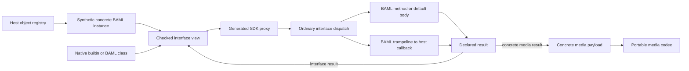

# BAML interfaces across SDKs, canonical builtin aliases, and media

Implementation tracking: [plan](INTERFACES_IMPLEMENTATION_PLAN.md). Changes since the BEP discussion: [adjustments and findings](INTERFACES_DESIGN_ADJUSTMENTS.md). User-facing proposal: [BEP-073](https://beps.boundaryml.com/beps/73).

Status: target design; implementation is in progress. The [plan](INTERFACES_IMPLEMENTATION_PLAN.md) records verified API coverage and remaining gaps.

User-facing companion: [Using BAML interfaces from Python, TypeScript, and Rust](/Users/aaron/projects/baml/baml_language/INTERFACES_USER_GUIDE.md). Its ordinary client/agent examples and advanced host-implementation examples are part of the target SDK experience.

Empirical follow-up: [interface probe results](/Users/aaron/projects/baml/baml_language/INTERFACE_PROBE_RESULTS.md) records executable language probes and current-runtime experiments, including failures that changed this proposal. A successful API prototype is distinguished from an implemented bridge test.

Research baseline: `1c1342347` on `aaron/journal-user-content`, inspected 2026-09-04. The existing untracked `JOURNAL_MEDIA_DESIGN.md` is an input, not an implementation oracle. The requested `type_system.md` and `JOURNAL_MEDIA.DESIGN.md` are named `TYPE_SYSTEM.md` and `JOURNAL_MEDIA_DESIGN.md` in this checkout. Both repository BAML skills were read; `skills/baml-core/SKILL.md` is newer than `.agents/skills/baml-core/SKILL.md`. Language semantics below follow `TYPE_SYSTEM.md` and implementation evidence when the skills differ.

Reading guide: [decisions](#1-decision), [current evidence](#2-what-exists-today), [aliases](#3-one-source-of-truth-for-compiler-aliases), [media](#4-open-media-and-explicit-conversion), [B-1683](#5-b-1683-the-concrete-callback-failure), [bridge inventory](#6-bridge-inventory-and-the-shared-transfer-model), [runtime](#7-runtime-architecture-for-live-interfaces), [ownership](#8-ownership-scheduling-and-failures), [generated code by language](#9-exactly-what-sdk-generation-should-emit), [PIL](#10-passing-real-images-including-pil), [all interfaces and provider clients](#11-interface-methods-baml-defined-provider-clients-and-runners), [implementation plan](#12-implementation-plan-and-acceptance-gates), [tests](#13-conformance-and-validation-plan).

## 1. Decision

Make BAML-defined classes that implement BAML interfaces usable from every supported SDK: construct or receive the object, pass it at interface parameters, and call its useful methods with its original identity and state. This includes provider clients, streaming clients, runners, iterators, generic methods, and concrete-`Self` operations. Media and canonical aliases remain in scope. Host implementations use the same method/callback machinery as a secondary direction. This PR does not implement direct cross-language field access or shared mutable array/map/object storage. Stateful methods remain supported: state stays in its owning language, and either side can invoke methods that operate on it. Deliver the scoped work in one PR; §12 defines internal implementation checkpoints, not separate releases.

Make `media` an ordinary, open marker interface implemented by the concrete builtin types `image`, `audio`, `video`, and `pdf`. Retain those four concrete semantic types; their runtime layouts, SDK wrappers, and encoding may change. A host object can implement the interface through a registered adapter while retaining its own concrete identity. The marker requires no `snapshot()` or conversion method. Consumers needing an image can accept the separate `ImageSource` capability; persistence APIs define their own accepted payloads and capture policy.

Give every compiler-recognized builtin one canonical public spelling. Put the spelling, semantic target, member owner, arity, source visibility, and construction policy in one typed `compiler_aliases` registry. For example, user code writes `image`, `string`, and `json`; `baml.media.Image`, `baml.String`, and `baml.json.json` become implementation-only spellings. In this checkout the string carrier is `baml.String`, not `baml.std.String`.

Make bridge support a property of the semantic type and transfer boundary, independent of whether the operation is an entrypoint call, a return, a host callback argument, a callback result, or an interface method. Replace the current ABI and value protocol where needed with one coherent model shared by every bridge. B-1683 supplies an observable failure case to cover in the new design, not a requirement to preserve its current codec or a separate patch-first deliverable.

The central invariant is:

> A value retains one concrete runtime type. An interface reference adds a checked view and dispatch evidence; it never replaces the value's concrete identity.

This preserves reflection, matching, associated types, coherence, and the ability to send a value back to its original owner. It also makes the implementation reusable for database connections, model clients, iterators, and host services rather than inventing a media-specific foreign-object system.

Callbacks and interfaces share one lifetime model: ordinary calls automatically retain the callable/captured state or receiver/witness for as long as BAML needs it. An optional explicit scope supplies earlier revocation for either kind. Interface support must not introduce mandatory binding or scope blocks where ordinary host callbacks require none. Explicit implementation declarations establish nominal conformance; they are not a separate lifetime discipline.

### Decisions at a glance

| Question | Decision |
|---|---|
| Is `media` a union or an interface? | Open interface. A separate closed `MediaValue` union describes the supported concrete payloads. |
| Must every media object produce a concrete payload? | No. `media` starts as an explicit marker. Conversion is a separate capability, such as `ImageSource.to_image()`. |
| Is `snapshot()` required for matching or bridges? | No. Interface matches require `_`; bridges retain the concrete receiver and its checked interface view. |
| Does `image` become an interface? | No. It remains the concrete builtin. Use an `ImageSource` contract when accepting arbitrary host image producers. |
| Can a PIL image pass as `image`? | Through an explicit conversion to a BAML image. Through a registered adapter it can pass as `media`/`ImageSource` while retaining its own concrete identity. |
| Is MIME an associated type? | Not on the base `media` contract. MIME is per-value metadata. Optional typed MIME contracts can use associated types without weakening their exact-binding rules. |
| Are carrier names public alternatives? | No, after migration. They remain internal member/documentation anchors. |
| Should the compiler erase `TyKind::Media`? | No. Surface aliases do not determine runtime representation. |
| Is an interface transferable as JSON? | No automatic transfer of behavior. In-process references and explicit portable data conversion are different operations. |
| Do interfaces work in only Python? | One runtime protocol and codegen contract, with language-specific projections and explicit capability checks. |
| Does this PR expose mutable fields across bridges? | No. Pass data and call methods; BAML-owned objects may mutate in BAML methods, and host-owned objects in host methods. No generated live field getters/setters or shared-storage views. |
| Do interfaces need scopes that callbacks do not? | No. Both use automatic ownership and the runtime’s default lifetime. Explicit shorter scopes revoke both kinds of host registration. |
| Does `Agent.run(spec)` require interface conversion or extra field calls? | No. Infer Out from the spec, return a native result record, and read `result.value` directly. Nested live objects retain their references. |
| Is this all one PR? | Yes. Media, canonical aliases, general interfaces, provider clients, and all supported bridges land together. The implementation checkpoints are internal to that PR. |
| Must the current ABI, SDK APIs, or encodings remain compatible? | No. Ship a coordinated breaking replacement where it improves the design; preserve BAML's semantic guarantees, not historical representations. |

### 1.1 Design freedom and delivery policy

This is a redesign with one coordinated cutover. Existing code is evidence about what must be replaced and which behavior users need. It does not impose compatibility contracts on the new ABI, protocol tags, native handle categories, generated wrappers, constructors, package layout, or callback implementation. No legacy adapter layer, dual codec, deprecated parallel API, or unchanged historical snapshot is required to complete this work.

The invariants come from `TYPE_SYSTEM.md`: concrete identity, transparent aliases, exact associated bindings, coherent implementations, open interface membership, sound effects, and mutable-container variance. Ownership, cancellation, and defined boundary behavior must also be correct. These are properties of the resulting design, not concessions to the existing implementation.

Publish the compiler, runtime, protocol schema, and supported SDKs as one compatible generation. Check the ABI major and shared schema fingerprint before accepting values or starting calls; reject mismatched generations with an actionable diagnostic. Older generated clients and incompatible compiled packages may require regeneration/recompilation. Do not build fallback paths merely to run them unchanged. Migration notes and source fixes explain the cutover without keeping a second runtime design alive.

Make the ordinary SDK path seamless: generated codecs automatically project a known concrete implementing reference to the required interface, preserving its receiver. Do not require or generate per-interface `.as_client()`/`.as_streaming_client()` methods merely to expose this internal operation. Passing a value at the declared parameter type supplies the needed interface context. Bind/register a foreign implementation once; generated adapters own the repeated checking, dispatch, and lifetime work. This automation establishes a real witness and never treats an arbitrary same-shaped host object as already implementing a BAML interface.

Tests verify the resulting language and API behavior across every bridge. Update or replace tests that assert obsolete representations. Reproducing the image-callback scenario is useful; freezing its old protobuf, wrapper shape, or handle path is not a goal.

### 1.1.1 Local host methods and bridge calls

A registered host object still belongs to its host language. Calling an ordinary method on the original object may remain a local call, with native error and scheduling behavior. When BAML invokes that object, the SDK validates the arguments/results and retains the invocation until actual completion. Both paths act on the same receiver and require the owner's synchronization when they overlap. Generated BAML-owned refs always cross the bridge; an explicitly bound SDK ref also retains its checked invocation semantics.

Do not require SDK interception of every local call or replace every Python method override with a proxy. Conversely, explicit generic handlers are registration callbacks, not ordinary native methods with deceptively different parameters. Defaults authored in BAML still use the bridge when invoked from a host implementation source.

Python context injection must preserve usable local calls: generate an optional keyword-only `ctx` for context-aware host implementations, supply it on bridged calls, and let local calls omit it. The adapter must not manufacture a frame or registration merely to create/validate a Pydantic object. Final context naming must avoid collisions with BAML parameters; freeze and compile-check that surface before broad codegen work.

### 1.2 PR boundary: one state owner, methods across the bridge

“Do not implement mutability” here means no new direct shared-field/container mutation protocol across languages. It does not make BAML classes immutable, prohibit mutating methods, or forbid callers in two languages from invoking the same object. The rule is one authoritative owner of each live receiver's state; the other side gets a checked method-capable reference, not a second writable field replica.

| In this PR | Outside this PR |
|---|---|
| BAML-defined concrete classes and interface refs, usable through methods and direct interface arguments | Live receiver field getters/setters generated by the bridge |
| Stateful BAML methods, including a host call that dispatches to BAML | Host accessors for BAML interface fields and foreign VM field-slot dispatch |
| Methods on an explicitly registered native implementation, including a BAML call that dispatches to the host | Shared `ListRef`/`MapRef`/`ObjectRef` container backings, nested foreign mutation, field-path synchronization or copyback |
| Ordinary data arguments/results copied at the boundary, recursively preserving explicitly live children | A promise that changing a returned native data record edits the original receiver |
| Nominal witnesses, default/generic methods, callbacks, media, provider clients and lifetime correctness | Automatic collection of arbitrary cross-runtime cycles |

Preserve interface field declarations and VM field links in compiler metadata. A BAML-owned implementation of a field-bearing interface can still cross as an opaque checked receiver and expose its callable methods; BAML methods/defaults can use the existing BAML-owned fields internally. The host proxy does not expose the interface's fields. Reject binding a native implementation whose interface or transitive requirements require fields with an explicit unsupported-field-binding diagnostic; do not silently omit required storage or initialize a copied fake implementation. This asymmetry reflects the scoped bridge operations, not a change to BAML interface semantics.

This is a design-only deliverable. Production implementation follows review; language probes establish existing behavior and do not implement the proposed SDK/ABI.

## 2. What exists today

### 2.1 The language already provides the right semantics

[`TYPE_SYSTEM.md`](/Users/aaron/projects/baml/baml_language/TYPE_SYSTEM.md) requires concrete runtime identity, transparent aliases, open existential interfaces, invariant mutable containers, exact associated-type bindings, and coherent implementations. A bridge cannot weaken these rules by deciding that an object “looks like” an interface, copying out its fields, or changing its type tag to the interface's name.

[`InterfaceDef` and `RuntimeImplRule`](/Users/aaron/projects/baml/baml_language/crates/bex_vm_types/src/types/interface.rs) already carry interface identity, requirements, fields, methods, errors, defaults, associated bindings, implementation targets, and dispatch frames. Defaults are adopted by the resolver; they are not copied into every implementor. Interfaces themselves have no concrete dispatch tag.

There is also an existing runtime witness mechanism. [`type_kinds.rs`](/Users/aaron/projects/baml/baml_language/crates/bex_vm/src/package_reflect/type_kinds.rs:198) validates field links and registers ordinary runtime implementation rules. It currently rejects interfaces with required methods lacking default bodies, and its coherence check has a documented gap against existing blanket implementations. General host implementations must extend and repair this machinery, not treat today's structural witness builder as already sufficient.

### 2.2 Alias knowledge is partially centralized, but still duplicated

There is no current `compiler_aliases` module. These are the important existing pieces:

| Source | Current responsibility / gap |
|---|---|
| [`primitive.rs`](/Users/aaron/projects/baml/baml_language/crates/baml_type/src/primitive.rs) | `PrimitiveType`, its 11 members, public spellings, carrier paths, and `BuiltinTypeName` for `json`/`void`/`never`/`unknown`. Good seed for the registry. |
| [`names.rs`](/Users/aaron/projects/baml/baml_language/crates/baml_type/src/names.rs:233) | `builtin_primitive()` and `builtin_alias()` recognize media carriers and canonical display spellings. |
| [`lower_type_expr.rs`](/Users/aaron/projects/baml/baml_language/crates/baml_compiler2_ast/src/lower_type_expr.rs:522) | Separate keyword-to-AST match. `json` becomes a stdlib alias path; media becomes a dedicated media node. Generic arguments on some primitives are currently discarded. |
| [`lower.rs::class_ty`](/Users/aaron/projects/baml/baml_language/crates/baml_compiler2_hir_ty/src/lower.rs:1583) | Bridges scalar and container carriers plus `Future`; does not bridge the media carrier classes. `class_self_ty` delegates here. |
| [`method_resolution.rs`](/Users/aaron/projects/baml/baml_language/crates/baml_compiler2_hir_ty/src/method_resolution.rs:95) | Two parallel builtin-type-to-member-owner tables: source and precompiled package lookup. Both recognize concrete media. |
| [`infer.rs::static_qualifier_ty`](/Users/aaron/projects/baml/baml_language/crates/baml_compiler2_hir_ty/src/infer.rs:8005) | Yet another primitive/media spelling table for static calls. |
| [`type_kind.rs::builtin_companion_of`](/Users/aaron/projects/baml/baml_language/crates/baml_type/src/type_kind.rs:109) | Separate construction policy; explicitly excludes `baml.media.Image` today. |

The present failure is therefore deeper than pretty printing: a name printer knows `baml.media.Image` means `image`, while type lowering can still produce a distinct nominal class type. A public-spelling ban alone would hide this bug without repairing `Self`, implementations, precompiled packages, and internal stdlib references.

### 2.3 The journal design addresses a different layer

[`JOURNAL_MEDIA_DESIGN.md`](/Users/aaron/projects/baml/baml_language/JOURNAL_MEDIA_DESIGN.md) correctly separates concrete media payloads from journal content blocks, and gives user turns and tool results a shared content vocabulary. Preserve that direction and its per-provider lowering responsibilities.

This proposal supersedes its decision to permit both carrier and keyword spellings in user code and its “no SDK or wire changes” constraint. Alias resolution, media, general interfaces, and the ABI may be redesigned together. The journal's distinction between content and provenance remains useful independently of its current representation.

Keep three different concepts separate:

- `media`: an open classification contract, possibly backed by a live host object; it promises no conversion or persistence behavior.
- `MediaValue`: a concrete payload, one of `image | audio | video | pdf`.
- `ai.content.Media`: a journal block containing a concrete payload plus provenance.

The last name is not a compiler alias and should not be banned. It denotes a genuinely different type.

### 2.4 Interface types are not yet a complete SDK feature

The common SDK [`Symbol` enum](/Users/aaron/projects/baml/baml_language/crates/baml_codegen_types/src/symbols.rs:6) has functions, classes, enums, and aliases, but no interface declaration. The shared type family can carry `Ty::Interface`; that does not give an emitter the members, defaults, requirements, or implementation evidence necessary to generate a working interface SDK.

This must be fixed in the common export model. Merely teaching each backend to print a different name for `Ty::Interface` would produce convincing signatures with unusable runtime behavior—the same category of failure seen in B-1683.

## 3. One source of truth for compiler aliases

### 3.1 Registry shape

Add `crates/baml_type/src/compiler_aliases.rs` (proposed new file). It must depend only on foundational type/name definitions, not AST, HIR, SDK generators, or VM objects.

```rust
// Proposed schema, not code currently in the repository.
struct BuiltinDescriptor {
    id: BuiltinId,                        // stable semantic identifier
    spelling: SurfaceSpelling,            // identifier or syntax constructor
    target: SemanticTarget,
    member_owner: Option<BuiltinPath>,    // package identity + path
    arity: Arity,
    source_policy: SourcePolicy,
    construction: ConstructionPolicy,
}

enum SemanticTarget {
    Primitive(PrimitiveType),
    Array,
    Map,
    Future,
    Metatype,
    StdlibAlias(BuiltinPath),
    StdlibInterface(BuiltinPath),
    VoidReturn,
    Never,
    Unknown,
}

enum SurfaceSpelling {
    Identifier(&'static str),
    PostfixArray,                         // T[]
    MapConstructor,                       // map<K, V>
    Qualified(BuiltinPath),               // e.g. reflect.Type
}
```

Use one declarative table/macro to generate forward and reverse lookups. Assign serialized primitive/type discriminants explicitly in the new versioned schema; table order must not accidentally choose them. Existing wire or Borsh numbers may change in the coordinated cutover. `BuiltinId` is not a serialized declaration tag unless deliberately assigned one.

`PrimitiveType::alias`, `builtin_class_path`, `BuiltinTypeName`, `QualifiedTypeName::builtin_alias`, completion candidates, and construction diagnostics become views over this registry. Do not leave a second handwritten mapping behind under a different name. Semantic consumers still match typed variants to implement operations; the registry centralizes correspondence, not all compiler behavior.

### 3.2 Complete inventory

| Public source form | Semantic target | Internal member/definition owner | Public use of owner |
|---|---|---|---|
| `int`, `bigint`, `float`, `bool`, `string`, `null`, `uint8array` | Existing primitive kinds | `baml.Int`, `Bigint`, `Float`, `Bool`, `String`, `Null`, `Uint8Array` | Rejected after migration |
| `image`, `audio`, `video`, `pdf` | Existing `Media(kind)` leaves | `baml.media.Image`, `Audio`, `Video`, `Pdf` | Rejected after migration |
| `json` | Existing recursive structural alias | `baml.json.json` | Rejected after migration |
| `T[]` | List constructor | `baml.Array<T>` | Rejected after migration |
| `map<K, V>` | Map constructor | `baml.Map<K, V>` | Rejected after migration |
| `media` (new) | Ordinary interface existential | `baml.media.Media` (new interface declaration) | Rejected in public source; definition remains addressable internally |
| `reflect.Type` | Existing metatype | `reflect.Type` | Allowed; this is already the canonical public form |
| `baml.future.Future<V, E>` | Existing future kind | Same | Allowed; no new short alias proposed |
| `void` | Return-only syntax, with existing unit semantics | None | Not an ordinary general-purpose type alias |
| `never`, `unknown` | Existing bottom and top types | None | Intrinsics, no fake nominal declarations |

`_`, literals, optionals, and union syntax are grammar/type-algebra constructs, not aliases to companion classes. The registry can expose their contextual legality to tooling without inventing carrier identities. `MediaKind::Generic` is an existing internal enum case, not the new open interface: do not reinterpret old generic-media tags as interface witnesses.

Array and map canonicalization needs syntax-aware edits: `baml.Array<T>` becomes `T[]`, with parentheses when necessary; `baml.Map<K,V>` becomes `map<K,V>`. A scalar string-replacement table is insufficient. Existing container members are instance members; future static container APIs must gain an intentional public surface before their internal owners are hidden. Do not invent an `array` type keyword just for symmetry.

### 3.3 Resolution and source policy are distinct stages

1. Resolve a written name or builtin syntax to a semantic definition, retaining the written origin and span.
2. Check whether that spelling is allowed in the caller's source context.
3. Instantiate arity/type arguments and produce the canonical `Ty`.
4. Use the same descriptor to find inherent members, lower `Self`, emit documentation, and display the resulting type.

All carrier spellings must canonicalize internally, even when public source use is an error. This is how the stdlib can continue declaring a carrier while `Self` and its `implements` target denote the builtin kind. There must never be an inhabitable nominal `baml.media.Image` in addition to the builtin image.

The visibility exception is for compiler-owned definition contexts and trusted compiler expansion, determined by source/package provenance. It is not “anything whose path starts with `baml`” and not a user-settable flag. Stdlib ordinary signatures should migrate to canonical aliases too; only carrier declarations and compiler-generated internal references require the escape hatch.

Apply the spelling rule to annotations, alias RHSs, generic arguments, patterns, `is`, implementation targets, projections, class literals, static qualifiers, imports/reexports if introduced, and reflection APIs that resolve a source spelling. A user cannot bypass it with `type MyImage = baml.media.Image`; `type MyImage = image` remains legal because user aliases are part of the language. “One spelling” governs compiler-provided synonyms, not a ban on user abstractions.

Diagnostics should say `Use image; baml.media.Image is an implementation-only builtin companion` and offer an AST-based fix. Invalid primitive type arguments must produce arity errors, not disappear. Navigation from `image` may open the internal declaration, but completions, hovers, `describe`, signatures, generated BAML, and copied examples use `image`.

Binary package loading and internal reflection retain semantic IDs. Do not run source-spelling deprecations over serialized types or treat a display-name rewrite as a runtime identity change. A precompiled package interface must canonicalize identically to source compilation.

### 3.4 Why not just write `type image = baml.media.Image`?

For `json`, a real alias is the implementation. For `image`, the RHS class currently exists to attach members to an intrinsic representation. A plain alias to an ordinary class would preserve the wrong nominal identity unless the compiler already knows the class is an intrinsic companion.

A generated, virtual prelude can *display* the conceptual declaration:

```baml
// Explanatory only; compiler-owned bindings, not a user-editable second registry.
type image = <builtin image>
type json = <stdlib recursive json alias>
type media = <stdlib Media interface>
```

The typed registry supplies that binding. It avoids a bootstrapping cycle, preserves `TyKind::Media`, and handles constructors and return-only syntax that ordinary aliases cannot describe uniformly. Later, inherent `implement image { ... }` syntax could remove carrier classes without changing identity or public APIs; that is optional cleanup, not a prerequisite.

### 3.5 Migration policy

Implement canonicalization, migration diagnostics, automated fixes, and hard errors for public carrier spellings in the same PR. Update the stdlib, SDK fixtures, documentation, generated examples, and repository-controlled downstream projects before marking the PR ready. Include the codemod and migration instructions for external projects, and document the change as a breaking language/toolchain release. These are internal implementation checkpoints, not separate PRs or a deferred enforcement phase.

The spelling rule applies to BAML. Host code uses idiomatic SDK names such as `BamlImage`; it need not write Python `image` or Rust `string`. Generators must project the semantic builtin directly and must not generate a second model named `baml.media.Image` with an opaque `_data` field.

## 4. Open media and explicit conversion

### 4.1 Minimal contract

The following is proposed BAML library source. `media` is the new compiler binding to `baml.media.Media`; these APIs do not exist today. Start with an explicit marker interface: classification is useful without requiring every implementor to support a particular transport or storage representation.

```baml
// In baml.media; public named support types remain ordinary declarations.
type MediaValue = image | audio | video | pdf;

interface Media {}

// The compiler-owned carrier binding targets the actual primitive.
implements Media for image {}
// Analogous implementations for audio, video, pdf.

// A separate capability for consumers that need a concrete image.
class MaterializeError { message: string }
interface ImageSource {
    function to_image(self) -> image throws MaterializeError
}

implements ImageSource for image {
    function to_image(self) -> image throws never { self }
}
```

The empty interface is nominal and opt-in. An arbitrary value does not implement `media` just because there are no members to check. Compiler implementation facts and explicit host registration remain required. A host object may implement this marker without providing an image conversion, bytes, MIME metadata, or any serializable representation.

Keep the contracts flat. An `ImageSource` implementation is not automatically a `media` implementation, and a `media` implementation is not automatically an `ImageSource`. Native images implement both; a PIL adapter can explicitly register both on the same synthetic concrete type. A service that produces images may implement only `ImageSource`. No `from_image_source` wrapper is needed merely to pass or classify the original object. Avoid a blanket implementation unless the library intentionally reserves that implementation space.

There is no universal `snapshot()`, including a renamed equivalent, on `media`. Add shared operations only when a consumer needs a defined contract. `ImageSource.to_image()` is an explicit example: it can encode a host image and return a concrete `image`, but no general interface bridge operation invokes it automatically. Further conversion or metadata capabilities can be separate ordinary interfaces rather than assumptions attached to the marker.

`MediaValue` is a transparent alias for the four concrete payload types, useful for APIs that accept precisely those values. It is not a required associated output type or return type of `media`. `MaterializeError` belongs to the optional `ImageSource.to_image()` conversion contract and is its throwing effect, separate from its `image` return type. An adapter translates expected image-encoding failures into this error; returning audio from `to_image()` is a contract violation. Bridge contract violations, cancellation, and runtime shutdown remain separate infrastructure failures (§8).

### 4.2 Matching

```baml
function describe(value: media) -> string {
    match (value) {
        let i: image => "native image",
        let a: audio => "native audio",
        let v: video => "native video",
        let p: pdf => "native pdf",
        _ => "another media implementation",
    }
}

function describe_payload(payload: baml.media.MediaValue) -> string {
    match (payload) {
        let i: image => "image payload",
        let a: audio => "audio payload",
        let v: video => "video payload",
        let p: pdf => "pdf payload",
    }
}
```

The first match requires `_`, even after enumerating every implementation currently known to the compiler. The second can omit `_` because its static input type is the transparent alias `image | audio | video | pdf`; it does not receive an interface. Neither match requires conversion. A registered PIL adapter matches its adapter's concrete identity, or an interface it implements; it does not match `image`. An explicit `to_image()` call produces a separate concrete image value that does.

No user callback runs during `is`, type-pattern matching, reflection, union selection, or membership checking. These operations consult the concrete type and registered implementation facts. Automatically materializing to make a type test succeed would make a type test effectful, change identity, and violate the type-system model.

The new `media` interface must use ordinary interface membership and dispatch. Do not special-case `MediaKind::Generic` as “all implementors,” and do not teach normalization that the four known builtins exhaust the interface. Existing internal generic-media values must remain rejected at a concrete `image` boundary unless converted into an explicitly supported concrete kind.

### 4.3 MIME and associated types

The MIME **value** belongs to the concrete descriptor and remains `string?`, matching current constructors. A single `image` type can carry PNG, JPEG, WebP, or unspecified MIME. The associated type of `(image, SomeInterface)` cannot vary for each image instance.

Also, these are different interface instantiations:

```baml
// Optional future contract, not required for base media.
interface TypedMime {
    type Mime
    function mime(self) -> Self.Mime? throws never
}
// TypedMime<Mime = string> and TypedMime<Mime = "image/png">
// have different exact associated bindings.
```

A default `type Mime = string` fills an omitted binding with `string`; it does not mean “there exists any Mime subtype.” Consequently it cannot provide a heterogeneous base type for implementations choosing different literal MIME types. Do not erase those differences at the bridge.

If statically constrained formats are useful, define a separate concrete wrapper such as `PngImage` that validates construction, implements `TypedMime<Mime="image/png">`, and separately opts into `media`. It may also implement `ImageSource` if consumers need a concrete image conversion. It remains a wrapper, not a subtype of the concrete builtin image. This leaves the base media contract simple while exercising real associated-type support in the bridge.

Associated types are especially useful for interfaces such as `Decoder { type Output; decode(...) -> Self.Output }`, where the result shape is genuinely determined by the implementing type. §9 specifies code generation for that case.

### 4.4 Payload sources, conversion, and content capture

A concrete media value is currently a descriptor backed by a URL, file, or base64 data. It already has a portable codec; it needs no `snapshot()` method to cross a bridge. `ImageSource.to_image()` on a native image returns that image without fetching a URL or loading a file. On a PIL adapter it can encode the selected image state according to the adapter's documented policy.

Conversion to a concrete descriptor and capture of external content are separate operations. Base64/owned bytes capture content; a URL or file descriptor may name mutable content. Exact replay requires a persistence policy that resolves and stores bytes or a durable immutable artifact reference. Neither implementing `media` nor returning a concrete image promises exact replay. Do not claim that an immutable descriptor makes the resource it names immutable.

Use the unified concrete-media representation in §6.2; BEP-038 and today's wrappers are inputs to replace, not frozen encodings. A URL in a descriptor is data; bridge conversion must not unexpectedly fetch it. A host callback receiving an `image` gets the generated concrete image value and chooses whether to read its referenced content. Provider references can be additional explicitly modeled source variants when needed; they are not implied by interface membership.

### 4.5 Journal and prompt integration

Keep the journal's stored media payload concrete. `UserMessage.of` can accept `(string | baml.media.MediaValue | Text | ai.content.Media)[]` and wrap those values into ordinary blocks. It must not accept arbitrary `media` and assume that classification supplies a conversion method. Preserve the explicit element type because mutable arrays are invariant; an existing `image[]` is not assignable to an array of that wider element type without building a new array.

For a PIL adapter, call `source.to_image()` explicitly, then pass the returned image to the journal constructor. The conversion may throw `MaterializeError`; merely wrapping an existing concrete payload adds no materialization effect. A convenience preparation API may explicitly accept `ImageSource` and declare that conversion effect, but it is a library adapter, not part of interface transport. Complete fallible preparation before appending the event, so a failure cannot leave a partially appended turn. A selected producer is called once per explicit preparation; replay and traces do not call it again.

Prompt and provider APIs likewise declare the capabilities they consume. Existing concrete prompt rendering continues using concrete payloads. A future renderer accepting a live source must call its declared capability through the ordinary async interface path; low-level synchronous Rust stringification must not secretly call Python. A consumer receiving only `media` can match supported concrete types or capabilities and handle `_`; it cannot assume every implementation has bytes or converts to `MediaValue`.

Use a concrete prompt payload and retain the journal's content-block/provenance distinction. `ai.PromptPart` and related APIs may change together with their callers when that simplifies the representation. Per-provider capability decisions remain in the provider lowerers. This document makes no new claims about which current provider API accepts media at which position; the earlier journal document explicitly requires those to be verified during implementation.

## 5. B-1683: the concrete callback failure

The [Linear issue](https://linear.app/boundaryml2/issue/B-1683/images-cannot-be-passed-into-python-callbacks) reports a BAML call to a Python decision callback whose first argument is `image`. Initial host-to-BAML screenshots and screenshot callback returns work, but a BAML-to-Python callback argument fails with an error saying inline `media_value` is forbidden and a handle is expected.

### 5.1 Root cause and current checkout

The native callback producer [`sys_native/src/host_impls.rs`](/Users/aaron/projects/baml/baml_language/crates/sys_native/src/host_impls.rs:97) uses `CffiHandleTableOptions::for_wire()`. That option sets media/prompt serialization to true in [`handle_table.rs`](/Users/aaron/projects/baml/baml_language/crates/bridge_ctypes/src/handle_table.rs:42). The shared [`external_to_outbound`](/Users/aaron/projects/baml/baml_language/crates/bridge_ctypes/src/value_encode.rs:120) consequently emits portable media, including when media is nested in a callback argument container.

In the Python source preceding commit `52b927bc9`, the decoder rejected those inline variants. The opposite direction encoded a media wrapper through its `_data` handle, explaining the directionality precisely. This was a disagreement about representation between the producer and consumer, not a limitation of the `image` type or an inherent inability of Python to receive images.

**The inspected checkout already contains a targeted representation repair.** Commit `52b927bc9` (`Redesign FunctionSpec and streaming projections`, 2026-08-31) added portable Python media support. Current [`proto.py::_decode_media`](/Users/aaron/projects/baml/baml_language/sdks/python/src/baml_bridge/proto.py:962) reconstructs the appropriate wrapper from kind/source/MIME, [`decode_value`](/Users/aaron/projects/baml/baml_language/sdks/python/src/baml_bridge/proto.py:1265) accepts `media_value`, and the inbound path at [line 432](/Users/aaron/projects/baml/baml_language/sdks/python/src/baml_bridge/proto.py:432) writes portable media too.

The reported failure is therefore not established as reproducible on this source baseline. A stale deployed bridge, SDK/runtime mismatch, or another path must be checked before asserting the affected application's issue is resolved. Source inspection is not an end-to-end test, and this document does not claim the Linear issue is resolved or change its status. Diagnosing the deployed version does not constrain the replacement ABI.

### 5.2 Required behavior in the new bridge

Design one concrete-media path for arguments, results, callbacks, and interface methods in the new ABI. Generate every SDK against that schema and test the complete Python callback scenario on a matched build. Use offline SDK fixtures so a live model or access to the affected downstream application is not required to validate the redesign.

Neither today's `for_wire()` nor `for_in_process()` is a contract to preserve. Replace the options and their consumers with the explicit transfer model in §6. A one-sided producer/decoder change would still leave inconsistent call paths; a coordinated ABI change is authorized. Buffers may use owned native storage, but concrete image values must remain readable independently of the callback frame and engine.

Example behavior fixtures, independent of the old representation:

```baml
function inspect_image<E>(
    screen: image,
    inspect: (image) -> string throws E,
) -> string throws E {
    inspect(screen)
}

function transform_image<E>(
    screen: image,
    transform: (image) -> image throws E,
) -> image throws E {
    transform(screen)
}
```

The Python callback must actually inspect MIME/source and return an image in the second case. Test both a host-created image and an image constructed in BAML; otherwise a host-object shortcut can hide the broken path. Cover nested list/map/class/union/optional values, URL/encoded-bytes/file sources, base64 convenience construction, all four media kinds, sync and async callbacks, typed callback errors, cancellation, and keeping a received image after the callback returns. A plain image value must not require a still-live engine or callback frame to remain readable.

The shared fixture already declares `call_media_roundtrip_callback` at [main.baml:156](/Users/aaron/projects/baml/baml_language/sdk_tests/fixtures/function_calls/baml_src/ns_host_callable_tests/main.baml:156). Go exercises it at [test_host_callables_test.go:379](/Users/aaron/projects/baml/baml_language/sdk_tests/crates/go/function_calls/customizable/test_host_callables_test.go:379); the Python [host callable tests](/Users/aaron/projects/baml/baml_language/sdk_tests/crates/python_pydantic2/function_calls/customizable/test_host_callables.py) do not yet cover that case. Python has a narrower portable codec unit test at [test_portable_values.py:26](/Users/aaron/projects/baml/baml_language/sdks/python/tests/test_portable_values.py:26). Extend this existing coverage instead of creating a separate test harness.

Also test prompt AST callback transfer because the original mismatch covers that neighboring value variant. Invalid/missing payload variants must fail with a protocol error, not silently decode to `None`.

## 6. Bridge inventory and the shared transfer model

The repository contains more implementations than its README maturity labels suggest. The generator list in [`generator_fields.rs`](/Users/aaron/projects/baml/baml_language/crates/baml_codegen_types/src/generator_fields.rs:10) and source/tests are the inventory authority; README statements that Java is a stub or that no C# client exists are stale relative to the code inspected here. Support below means an implemented path exists, not that every SDK fixture passes.

| SDK / environment | Implemented transport and scheduling | Concrete media today | Interface generation today |
|---|---|---|---|
| Python / Pydantic 2 | PyO3/native bridge, shared protobuf values, registered host callables; sync and async wrappers | `BamlImage` and siblings; current public encode/decode is portable data | Interface value annotations become `typing.Any`; empty interface tokens support type metadata, not behavior |
| TypeScript / Node | N-API bridge; shared protobuf codec; BAML→JS calls hop through a ThreadsafeFunction and accept immediate results or Promises | Native-backed wrappers, portable media encode/decode | Value types become `unknown`; reflection tokens only |
| TypeScript / browser and workers | Generated web SDK uses `bridge_typescript_web`, wasm-bindgen and `sys_wasm` host callbacks | Same semantic portable media data; backing storage depends on the web bridge | Same shared generator gap; separate executor/realm constraints |
| Go | Dynamically loaded C ABI, callback IDs, goroutine dispatch and protobuf values | Native-backed media wrapper, portable inbound encoding | Interface value types unsupported; interface type tokens exist |
| Rust | Published bridge loads the C ABI; owned callables; separate callback executor | **Generator currently rejects media; no complete Rust media wrapper** despite media protocol/ABI pieces | Interface values and interface generic bounds unsupported |
| C# | C ABI, managed async dispatcher; sync/Task entrypoints, cancellation tokens, managed ownership | Immutable URL/owned-byte media values; file input is captured eagerly | Validator rejects interfaces; special iterator rewrites are not general interface support |
| Java | Active generator and bridge; C ABI wrapper, callback registry, executor/CompletableFuture completion | Native-handle-backed media wrappers with Cleaner/AutoCloseable ownership | Interfaces fall back to `Object`; no real contract/proxy generation |
| Swift | Active early generator; C ABI, sync/async throws entrypoints, async Sendable callbacks | Native handles with cached portable representation and ARC cleanup | Unsupported signatures, including interfaces, are skipped and recorded |
| C++ | Active generator; C ABI, typed futures, callback completion | Portable URL/base64/file value wrappers | Unsupported interfaces cause enclosing symbols to be skipped |
| Ruby / Sorbet | Private initialization/runtime-identity checkpoint, no current public generated-call SDK | No implemented public media/call surface | No `OutputType` or generator; future target, not current parity |

Evidence anchors for the matrix:

- Python: [`translate_ty.rs`](/Users/aaron/projects/baml/baml_language/sdks/python/rust/sdkgen_python_pydantic2/src/translate_ty.rs:160), [`lib.rs`](/Users/aaron/projects/baml/baml_language/sdks/python/rust/sdkgen_python_pydantic2/src/lib.rs:133), [`proto.py`](/Users/aaron/projects/baml/baml_language/sdks/python/src/baml_bridge/proto.py:432).
- TypeScript: [`translate_ty.rs`](/Users/aaron/projects/baml/baml_language/sdks/typescript/sdkgen_typescript_shared/src/translate_ty.rs:49), [`proto.ts`](/Users/aaron/projects/baml/baml_language/sdks/typescript/bridge_typescript/typescript_src/proto.ts:961), [`web host_value.rs`](/Users/aaron/projects/baml/baml_language/sdks/typescript/bridge_typescript_web/src/host_value.rs:11). The separate `crates/bridge_wasm` playground/LSP bridge is not the generated browser SDK.
- Go: [`types.rs`](/Users/aaron/projects/baml/baml_language/sdks/go/sdkgen_go/src/types.rs:254), [`host_callable.go`](/Users/aaron/projects/baml/baml_language/sdks/go/baml_go/host_callable.go:15), [`media.go`](/Users/aaron/projects/baml/baml_language/sdks/go/baml_go/media.go:393).
- Rust: [`translate_ty.rs`](/Users/aaron/projects/baml/baml_language/sdks/rust/sdkgen_rust/src/translate_ty.rs:243), [`host_value.rs`](/Users/aaron/projects/baml/baml_language/sdks/rust/bridge_rust/src/host_value.rs:209), [`runtime.rs`](/Users/aaron/projects/baml/baml_language/sdks/rust/bridge_rust/src/runtime.rs:78).
- C#: [`bridge README`](/Users/aaron/projects/baml/baml_language/sdks/csharp/bridge_csharp/src/README.md:120), [`BamlMedia.cs`](/Users/aaron/projects/baml/baml_language/sdks/csharp/bridge_csharp/src/Values/BamlMedia.cs:155), [`semantic.rs`](/Users/aaron/projects/baml/baml_language/sdks/csharp/sdkgen_csharp/src/semantic.rs:731).
- Java: [`translate_ty.rs`](/Users/aaron/projects/baml/baml_language/sdks/java/sdkgen_java/src/translate_ty.rs:181), [`BamlFfi.java`](/Users/aaron/projects/baml/baml_language/sdks/java/baml_bridge/src/main/java/baml_bridge/BamlFfi.java:750), [`BamlHandle.java`](/Users/aaron/projects/baml/baml_language/sdks/java/baml_bridge/src/main/java/baml_bridge/BamlHandle.java:142).
- Swift: [`translate_ty.rs`](/Users/aaron/projects/baml/baml_language/sdks/swift/rust/sdkgen_swift/src/translate_ty.rs:78), [`Media.swift`](/Users/aaron/projects/baml/baml_language/sdks/swift/Sources/BamlBridge/Media.swift:126), [`Handle.swift`](/Users/aaron/projects/baml/baml_language/sdks/swift/Sources/BamlBridge/Handle.swift:4).
- C++: [`sdkgen_cpp`](/Users/aaron/projects/baml/baml_language/sdks/cpp/sdkgen_cpp/src/lib.rs:1660), [`media.h`](/Users/aaron/projects/baml/baml_language/sdks/cpp/bridge_cpp/include/baml/media.h:78), [`future.h`](/Users/aaron/projects/baml/baml_language/sdks/cpp/bridge_cpp/include/baml/future.h:4).
- Ruby: [`README`](/Users/aaron/projects/baml/baml_language/sdks/ruby/bridge_ruby/README.md:1), [`native.rb`](/Users/aaron/projects/baml/baml_language/sdks/ruby/bridge_ruby/lib/baml/bridge/native.rb:30).

These distinctions affect implementation order. Rust media support is a prerequisite for an image-bearing interface in Rust. Ruby needs a call/value/ownership layer before interface emission is meaningful. Java/Swift/C++ must replace erasure or skipped symbols with complete support or explicit generation errors. Python/TypeScript reflection tokens must not be mistaken for value codecs.

There are scheduling gaps as well. Node synchronous calls reject raw host callbacks because blocking its event loop prevents callback dispatch; live host-backed interface proxies must follow the same restriction. Go host callbacks currently lack a per-call context even though outer BAML calls accept one. Rust's bridge does not yet expose complete call cancellation. Returned Node BAML closures are currently synchronous. The interface rollout must add the async/cancellation paths it needs rather than claiming existing callback support already covers them.

### 6.1 Two kinds of crossing

**Portable value transfer** copies a semantic data value. Scalars, generated data models with only recursively portable fields, and concrete media use this path. An aggregate containing a callable, resource, stream, function spec, opaque host value, or interface reference is session-local even if its outer shape is a generated class. Media wire data contains the concrete kind, optional MIME, and exactly one source variant. Decode the same value form in every direction. Handle-backed host implementations may reconstruct a local wrapper internally; that does not make the portable wire data a live interface capability.

**Live capability transfer** keeps behavior and identity attached to an owner. Functions, streams, and general interface receivers use this path. A handle is scoped to a runtime/session, has a checked kind, and keeps its receiver and declaration/witness alive. It cannot be reconstructed from JSON or a public type name.

Replace `CffiHandleTableOptions::for_wire()` and its representation switches with two explicit operations: session transfer and portable-data export. Generate a common recursive value schema that distinguishes data leaves, aggregates, and checked capability references. Session transfer admits all three and uses the same encode/decode rules in every call direction. Portable export traverses the same semantic values but rejects live capabilities unless a caller has explicitly converted them. This distinction follows lifetime and execution semantics; it does not preserve either of today's CFFI modes.

The public transfer matrix must be recursive and uniform:

| Semantic value | Argument / return / callback arg / callback return | Persistence / another session |
|---|---|---|
| Concrete `image`/`audio`/`video`/`pdf` | Portable concrete media descriptor | Portable, subject to the source's environmental meaning |
| Interface receiver | Checked live interface view | Reject; use an explicitly supported data conversion/export contract if one exists |
| Ordinary array/map/data-record argument or result | Copy the data structure; recursively retain explicit callable/interface/resource children | Portable only when all children are portable |
| Any aggregate containing callable/interface/stream/resource/function-spec capabilities | Mixed value structure or concrete live facade, retaining all nested capabilities | Reject until all capability-bearing elements are explicitly converted |
| Associated-type result | Codec for the realized associated type | Its realized type's rule |
| Host opaque object without an interface witness | Opaque capability only where explicitly accepted | Reject |

A file path can cross as a descriptor, but it is not portable *content* when a remote host cannot access that path. Portable-data export that promises content portability must resolve the file to owned content explicitly. That is distinct from same-session callback transfer.

### 6.1.1 Non-class implementations and copied values

An interface implementation target is a semantic BAML type, not necessarily a nominal class. The current stdlib declares `implements<T> Iterable for T[]` and `implements Iterable for string` in `baml/ns_iter/iter.baml`. `Iterable.iter()` returns a separate `Iterator`; `ArrayIterator<T>` supplies the array traversal state. Export these out-of-body rules, substitute their type parameters and associated pins, and preserve them for precompiled packages just as for in-class implementations.

The receiver representation must therefore support builtin/aggregate/immediate values as well as class instances and host receivers. Retain a GC root or owned value as appropriate, plus its exact concrete type and checked implementation witness. Do not cast all receivers to class storage, manufacture a public wrapper class, or replace the concrete type with the interface name. Method dispatch uses the compiler's implementation rule, including builtin methods and BAML defaults.

| Declared boundary type | Projection | State and identity |
|---|---|---|
| `string[]` | Copied native list/array/slice/Vec | Subsequent native edits do not update the BAML source array. |
| `Iterable<Item=string, Error=never>` with a BAML array receiver | Checked `IterableRef` with exact Item/Error bindings | Retains the BAML array; passing the ref back preserves that receiver. |
| `Iterator<Item=string, Error=never>` | Checked `IteratorRef` | `next()` advances the owner-held iterator state; bridge fields stay unavailable. |
| Interface implemented by a string or another immediate builtin | Checked interface view retaining the value and its exact type | Class allocation is not required; do not promise observable allocation identity for an immediate value. |

Builtin data codecs take precedence over the authored-class behavior heuristic in §11.7. Adding `Iterable` to arrays must not globally change every array result into a live collection proxy. An interface-typed position is an explicit live projection, whereas a concrete array-typed position uses the ordinary data codec. This adds no shared mutable host collection storage.

Native collection input needs a separate decision from returning a BAML-owned array. A Python list, JS array, Go slice or Rust Vec does not become a host implementation by having iteration operations. For this PR, an interface input accepts an existing checked ref or explicitly declared adapter. A concrete-data-to-interface convenience conversion may be added only with an exact source BAML type and checked implementation rule: it copies data into BAML ownership, then projects that new receiver. Until that API is specified and tested, use a BAML function taking `T[]` and returning the desired interface. That function is an ordinary working route through the proposed codecs, without introducing an unsettled helper name.

A host adapter instead keeps state in the host and runs host methods. The two routes must not be conflated. Do not infer Item from the first element, the current contents, native iteration protocols, or the destination interface alone; empty collections, unions and custom implementors make that unsound. A statically known source type or explicit generated token supplies type information. Preserve exact associated bindings and container invariance.

A generated nominal record is another concrete-data input, distinct from an untyped native collection. If its BAML declaration implements the requested interface, accept the generated record by validating its concrete declaration, generic arguments and fields, copying it into BAML, and checking that implementation. Do not change the defining package's Record projection to Live merely to make interface admission work. A returned interface view retains the BAML copy; it does not retain or synchronize the original native record. Reject unsupported declarations, wrong associated pins and invalid fields before the receiving body runs, and release any provisional references on failure. F41 implements this shared admission path and verifies the direct generated Python case; complete native input projection and other language ports remain required.

### 6.2 Unified concrete-media representation

Use one semantic descriptor in every SDK and both bridge directions:

```text
MediaData {
    kind: Image | Audio | Video | Pdf,
    mime_type: string?,
    source: Url(string) | File(string) | Bytes(OwnedBuffer),
}
```

`Bytes` contains encoded media content, not an untyped raw pixel matrix. Prefer native bytes across the ABI instead of base64; use base64 only where an external JSON/provider format requires it. A `from_base64` convenience constructor decodes into this representation. `from_bytes` accepts encoded content directly. Validate the source shape and concrete kind without performing network or filesystem I/O.

Give each SDK the same constructor semantics with idiomatic host names: `from_url`/`from_file` create descriptors, while explicit content-capture operations perform I/O and declare its errors. Replace inconsistent existing host behavior in this PR and document the change. Do not retain an eager `from_file` in one language solely for compatibility. The choice of lazy descriptor construction is about explicit I/O and effects, not preserving the old BAML implementation.

Concrete media values must have a usable lifetime independent of a BAML engine in this delivery. Share immutable owned buffers where possible; any native buffer owner has retain/release semantics independent of an engine/session capability lease. Web/WASM backends may copy into host-owned storage when necessary. Remove wrapper dependence on engine-owned media handles. ABI layouts, media tags, and SDK constructors can change together to implement this model; no old-wire decoder or duplicate wrapper is required.

## 7. Runtime architecture for live interfaces

### 7.1 The receiver is concrete; the view is existential

Represent the boundary view conceptually as:

```text
InterfaceView {
    owner: RuntimeSessionId,
    receiver: RootedConcreteValue,
    interface: RealizedInterfaceIdentity,   // head + generic args + assoc pins
    witness: ValidatedResolvedImpl,
    lease: OwnershipLease,
}
```

This is a bridge/runtime side object, not a new BAML concrete type. A BAML `image` viewed as `media` remains an image. A BAML class remains that class. A host adapter is a runtime-created concrete adapter class. The view can be cached, but the cache key must include the receiver, session, and exact interface instantiation.

Do not use the optional type description on an existing `TaggedHeapHandle` as authority. [`BexExternalAdt`](/Users/aaron/projects/baml/baml_language/crates/bex_external_types/src/bex_external_value.rs:80) already distinguishes trusted handle kinds from diagnostic type decoration. Extend that discipline: the engine resolves the owned table entry and checks its interface contract. A string such as `"baml.media.Media"`, an SDK class name, or a user-supplied `BamlTy` does not prove implementation.

For native media viewed through an interface, the engine may retain its `Arc<MediaValue>` plus the builtin concrete type as the receiver root. It need not manufacture a nominal class instance. Passing, retaining, matching, or projecting the interface requires no conversion. If an explicit operation returns a concrete image—for example `ImageSource.to_image()`—that result uses the ordinary portable media codec and can outlive the interface view. A marker-only `media` view exposes no such method.



### 7.2 Proposed public ABI operations

Define a new major version of the C ABI and a matching WASM API from the same semantic schema. Replace the old function table where useful; do not constrain the design to appending entries or expose raw VM pointers. SDKs do not compile arbitrary BAML source at runtime to implement basic interface calls.

```text
register_host_type(schema, method_dispatch, release) -> HostTypeToken
bind_host_object(type_token, host_object_key) -> OwnedReceiverToken
project_interface(receiver, expected_interface_token) -> OwnedInterfaceView
invoke(target, realized_method_args, arguments, call_context)
    -> asynchronous completion
retain_view(view) -> OwnedInterfaceView
release_view(view)

InvocationTarget = Function(function_ref)
                 | Method(checked_receiver_view, member_id)
```

Names are proposed ABI names, not current exports. Use one invocation/completion model for functions, callbacks and interface/concrete-class methods. Arguments, generic frames, cancellation, errors, scheduling and lease adoption use shared machinery. A method may mutate its receiver at the owner; this is ordinary method execution, not a field-write operation in the bridge. Direction chooses the owning executor, not a different value codec. SDK helpers delegate to this operation. Direct field access and mutable-storage operations are deferred (§7.6); do not add them to this PR's ABI or claim they are available through a generic invoke escape hatch.

Define capability reference roles for concrete objects, interface views, callable/type capabilities, resources, and host registrations in the new schema. Replace the fragmented old handle discriminants; there is no requirement to preserve `HOST_VALUE_OPAQUE`, `HOST_VALUE_CALLABLE`, or `ADT_RUNTIME_VALUE`. Share receiver ownership where roles refer to the same object, and validate the role before using it. Raw host references and method dispatch tables stay in their owning registry. Diagnostic type decoration never replaces the receiver identity and witness held by that registry.

Capability references include or are scoped by their owning session and generation. Multiplexed transports must carry enough owner identity to select and validate that session. Reject stale, wrong-role, wrong-session, and forged references before dispatch. Check the ABI major and schema fingerprint at initialization (§1.1), before interpreting any value or reference. All in-scope interface features are mandatory in this generation; there is no old-runtime fallback or per-feature negotiation that permits a partially implemented SDK to advertise general interface support.

### 7.3 Host implementation registration

A generated adapter registration describes:

- A stable adapter identity within its owning package and session. The application selects a concrete adapter type; each object instance does not create a new type.
- Fully realized interface heads, generic arguments, associated bindings, transitive requirements, and method/field contracts.
- The concrete adapter's runtime class identity, distinct from the foreign language class name and from every builtin type.
- A provided-method bitmap/table and callback dispatcher. Native adapter binding rejects interfaces with required fields, including inherited requirements, in this PR. Actual BAML instances keep their existing VM field links; no host-accessor table is added.
- The host executor/loop and ownership scope.

The runtime validates registration atomically before exposing any object of that type. The descriptor selects retained interface declarations, complete associated bindings and provided method names. Each method takes its full contract from that declaration: calling modes, parameters, return/error types and all generic slots/bounds. This follows host-callable ascription. A descriptor does not submit a second native signature or replace the declaration with a weaker contract. The runtime rejects missing/duplicate/unknown methods, unsupported fields, invalid requirements/pins and overlapping implementations before publication. Check declaration identity, not display names.

Native signature compatibility belongs to the generated Host contract and adapter: host type checkers apply parameter contravariance and result/error covariance where supported, and binders validate callable shape/calling convention where the language exposes it. A native method may accept broader inputs or return a narrower type, while its BAML-visible method retains the interface contract. Dynamic annotations and a generated signature hash cannot prove a host body obeys that contract. Validate actual arguments, returns and thrown values on every crossing, including each generic invocation. An unchecked native implementation can therefore fail on invocation; binding does not execute it to discover its behavior. F57 makes this responsibility split explicit rather than requiring a separate runtime native-signature algebra.

Validate a batch against the complete proposed implementation set before publishing it. A new implementation may satisfy the bound of an existing blanket rule, making another row in the same batch overlap. Give the resolver a private view of all staged rules, including during recursive bound checks; check uniqueness by concrete receiver and interface input arguments, independently of associated outputs. Reject unresolved registration templates before running that proof. Only publish after contract and coherence checks succeed, using one table write. A failed registration exposes neither a type nor provisional dispatch rows. The weak dispatch index remains a lookup structure, not an ownership root. F54 implements this staging/coherence mechanism for reflected classes and builders; adapter-specific conformance checks remain pending.

F56 adds a shared declaration-constraint gate. Compiled predicates preserve the exact generic parameter, Self or associated projection being constrained and the interface's written pins. The gate requires every associated output exactly once, then proves generic bounds, associated bounds and full `requires` instantiations against the staged world. Projection substitution must use that same world; reconstructing a published-world resolver would lose pending bindings. An applicable blanket can satisfy a requirement without an explicit duplicate witness. Reflected classes/builders now use this gate, replacing their head-only requirement check. Host method conformance and binding remain separate pending work. The serialized predicates require artifact format 7 and matching regenerated SDK bytecode.

Use a synthetic runtime class containing an opaque host reference, plus ordinary `RuntimeImplRule` entries whose provided methods are bridge trampolines. Default methods remain the BAML interface's actual default bodies. A host override can request `call_default(member, frame)` through a checked invocation context, mirroring BAML `default.method()` without recursively calling its own override; reject it for a required method without a default. This reuses the existing type system and resolver. Trampolines must be ordinary VM `Object::Function` bodies that invoke a host closure stored on the instance. Pointing `MethodImpl` directly at an `Object::HostClosure` is insufficient: direct calls can work while bound method creation/invocation still assumes an ordinary function target ([vm.rs](/Users/aaron/projects/baml/baml_language/crates/bex_vm/src/vm.rs:6505)). Test `let f = receiver.method; f(...)` for a concretely typed receiver as well as direct calls. Do not infer that BAML permits reifying an existential method value; it currently rejects that case (§11.2). The host adapter package owns its synthetic concrete types, satisfying the spirit of the orphan rule; registering an adapter must never add a new implementation to an unrelated builtin or user class.

Expose type registration separately from instance creation: `HostType = register_type(vtable, pins)` followed by `HostType.create(state)`. Each registration gets a unique concrete identity; multiple instances share that identity. Cache trampoline code by shape, but never infer nominal identity or share a vtable merely because two registrations have the same interface shape. One concrete adapter type has one coherent implementation of a realized interface. Different behavior requires a different adapter type, not replacing a table while existing values are live. A convenience one-object binder can allocate a private registration, while explicit type registration supports multiple objects, static constructors, and concrete-Self operations. Type registration is immutable; hot reload creates a new generation and new type identities. Existing handles pin the old declarations and methods until their leases end.

F55 implements the ordinary receiver-method body, below the still-pending registration API. Each instance retains its provided callbacks through the existing `HostValueArc` ownership. Each invocation realizes the declaration's signature in its complete frame and creates a checked monomorphic host closure for that call. A shared monomorphic closure would incorrectly reuse the first generic choice. Defaults and bound methods use ordinary VM dispatch. Advanced `GenericCall` delivery of the full frame, receiverless host methods, and SDK binders remain pending; a correct realized value signature alone cannot tell an advanced handler the choice of an unused type parameter.

The heap must own registration code independently of its weak lookup index:

```text
live interface / instance / type reference
                  |
             concrete class
                  |
            private package
                  |
      implementation rules -> method functions -> helper functions

instance -> retained host callbacks -> captured host receiver
```

The private package is not installed in a global strong registry. Its class/rule/function cycle is a normal traced heap cycle and becomes collectible when no live reference reaches it. Runtime-created functions mark that package as their owner so GC traces and forwards their resolved helper constants. F55 adds this ownership to reflected witnesses too: the earlier weak-table tests rooted class and rule independently and therefore missed the absent class-to-rule edge. Receiver-only GC tests are required. Collection timing still follows ordinary callable GC; this graph does not establish cross-language cycle collection or a bounded-memory guarantee for an idle singleton.

Optional calling modes also need source-to-SDK verification. The current interface declaration grammar rejects parameter default expressions and `flag?: bool`. F55 tests optional slots directly in runtime method metadata; it does not claim either source form works. Resolve that language/API gap before advertising optional host-interface methods.

F57 adds a checked VM registration operation and separate instance creation. An implementation descriptor is a template over `[Self]`, allowing `I<Self>` and `Peer=Self` without publishing a provisional type. Accepted methods use the declaration's exact contract and defaults; callback slots follow declaration order. Instances retain an opaque host receiver in addition to their callable slots, including marker and all-default interfaces. The private type owner records only the expected slot count, not any instance or host receiver. Keeping a type alive must not keep its dead instances alive. Receiverless host implementations still reject explicitly; their type-owned callback path, advanced GenericCall transport and SDK binders remain pending.

F58 adds the owning engine boundary: immutable adapter type capabilities retain the class and callback interface contracts; independently created instance handles retain the original host receiver. Descriptor heads resolve from program declarations or authenticated same-engine declaration handles under a heap permit, with nested kind/arity checks before substitution. Returned capabilities contain no movable VM pointers. Interface projection can consume the retained type contract directly, preserving dynamic associated identity. This is verified engine API, not yet a shared bridge endpoint or generated host binder. See plan F58 for the executed checks and remaining gates.

F59 defines the bridge registration frame as `[Self, explicit type arguments...]`. The existing named/definition/reference type-evidence choices apply to those arguments, resolved once per registration. Missing slots reject before publication. The registration response is an aggregate of owned keys covered by one delivery receipt; its adapter-type key is an administrative capability, not an ordinary BAML value. Preparation retains borrowed keys synchronously and captures every transferred instance input before target validation. Shared Rust helpers implement this protocol. F60 connects a private register/create/project request and structured outcome to Python/Node native result receipts; native verification is tracked separately in the plan. The first generated binder slice is recorded in F61 below; remaining binder surfaces and C/Wasm exports are pending. The administrative outcome distinguishes registration metadata from BAML values and reuses the ordinary failure envelope. Preparation precedes admission checks so rejected requests still release transferred inputs.

F61 returns every realized interface obligation once, including marker/all-default interfaces; callback slots identify an obligation index and authored member. Projection uses that retained type instead of reimporting an associated definition with a fresh identity. The first generated Python surface now supplies ordinary `FooHost` protocols and `await FooRef.bind(implementation)` for supported nongeneric required-interface graphs. Generated typing and selected canonical execution pass (plan F61). Associated/generic typed binders, automatic implementation sources, context injection, scopes and other language binders remain required; this narrow implementation does not replace their proposed APIs.

### 7.4 Calls and validation

Engine-owned receiver → host:

1. The outbound conversion is directed by the declared type. At an interface position, project the concrete receiver into the exact interface view and root it.
2. The host decodes a generated proxy with that interface's API. It does not need every possible implementor in its generated typemap.
3. A proxy method invokes the engine with the view token, member ID, and arguments.
4. The engine resolves the original receiver and witness and uses ordinary virtual dispatch. Defaults and associated projections resolve there.
5. The result follows the realized result type's normal codec.

Host-owned receiver → BAML:

1. The user explicitly binds a host implementation, registers a typed adapter, or opts into a generated implementation base whose codec performs that binding automatically. No arbitrary object is accepted merely because it has a same-named method.
2. The registry retains the object and binds it to the registered synthetic concrete type.
3. BAML receives the concrete adapter value through an existential interface position; reflection and `is` consult its registered facts.
4. Virtual dispatch calls the bridge trampoline, which schedules the host method and suspends the BAML fiber.
5. Completion validates the returned value/error and resumes the fiber.

Sending a view back to its originating engine returns the same receiver. Sending a host-owned view back to its originating host may provide explicit `unwrap_host()` access; the ordinary generated API continues returning a view/proxy so its contract, ownership, and sync/async behavior remain predictable. Never automatically unwrap to an unrelated raw object in one direction and return a proxy in another.

Inbound encoders must recognize trusted generated refs and callables **before** any generic host-callable, structural-model, or host-adapter conversion. Reuse their existing receiver/callable capability and exact type facts. The real Python returned-closure probe demonstrates why this ordering is required: today's encoder re-registers an engine-owned `BamlClosure` as a Python callback, which reenters a synchronous runtime call from a Tokio worker and panics. A returned interface proxy must never take that adaptation path. Test both callable and object refs with repeated engine→host→engine transfers, including nested containers and failures during argument encoding.

#### The interface contract and implementation frame are different

An interface-reference call retains both. The interface declaration determines the caller's argument names, required/defaulted modes, accepted types, success type and error type. The resolved implementation determines the body and its concrete type-argument frame. Never reconstruct an interface reference's public contract from the implementation signature: an implementation may accept a wider input or return a more specific type. A concrete facade instead uses the concrete method contract resolved by the compiler (§11.7); it must not silently substitute the wider existential contract.

For example, an interface declaring `accept(text: string)` still rejects an integer when its implementation accepts `unknown`. A declaration returning `Child` still returns a live `Child` interface view when its implementation returns a concrete `NamedChild`. A legal `-> Self` return produces a view with the same interface arguments and associated pins; `Self.Output` instead resolves to its exact associated type. Capturing the method as a callable must retain these distinctions after the original interface wrapper is released.

The caller's argument layout must survive lowering and dispatch; reading only the concrete callee's arity is insufficient. This applies to ordinary BAML calls as well as bridge calls, including a callable passed through a narrower function type or to a native higher-order function. Adjustment F12 records the discovered failures and the shared dispatch correction.

Required arguments map to implementation slots by position; optional arguments map by name. An implementation may add optional parameters or reorder them under BAML's function-subtyping rules. Omitted parameters run the selected implementation's defaults. Extra implementation options do not become callable through a narrower interface view. This mapping must be shared by host invocation, captured-callable invocation and native higher-order calls; differing frame lengths must never consume unrelated operand-stack values.

The ABI stores value-slot layouts separately from generic type arguments, runtime IDs and debug metadata. A layout records required positions and optional names; it is not another runtime type. MIR carries the checked call layout into a serialized bytecode side table, which the loader translates to compact instruction addresses. Resolving a constant function target must preserve this layout. Indirect calls require one, including synthetic host-entry trampolines; only compiler-synthesized direct calls using the exact target convention may omit it. Native higher-order helpers supply required positional slots; reflection supplies the named slots it checked. Both enter the same mapper. Validate the complete mapping before consuming caller values.

Optional-parameter subtyping does not require a new callable wrapper. The function keeps its identity, captures and type-argument frame; each call maps its arguments to the executable target. This also covers bridge-returned function handles, which never went through a source-level coercion wrapper. Checked interface methods still retain their separate public type contract: removing argument adapters does not remove interface validation.

Use the compiler's complete method signature and frame for required methods and defaults alike, including inferred effects and method-owned bounds. Keep the realized caller contract's declaration heads in the GC traversal, alongside the receiver and implementation frame. The implementation work records this requirement in adjustment F11; native SDK validation remains required.

### 7.5 Associated types and dynamic calls

Carry interface generic arguments and associated bindings independently in the common descriptor and wire type. Flattening them into host-language generic parameters is only a code-generation projection. For example `Decoder<Output=string>` maps to a host `Decoder[str]`, but the runtime knows `Output` was chosen by the implementor and cannot be repinned arbitrarily by the caller.

Passing a reflected type within its runtime preserves the original type capability. Passing it to another runtime fails, whether it appears as a generic argument or an ordinary value. Importing portable definitions is an explicit, separate operation that creates fresh declarations; a displayed name or exported schema never substitutes for a live reference. Prepare and retain method receivers and type evidence before executor handoff, so disposing the caller's reference cannot invalidate a prepared call. Dropping that prepared call must release its temporary ownership even if it never executes. See adjustment F19 for the verified shared-bridge checkpoint and remaining protocol work.

An existential must be complete under `TYPE_SYSTEM.md`: missing required associated pins fail at compilation/code generation, or at registration for a dynamically assembled contract. Do not fill them with `Any`, `object`, `unknown`, or `string`. Default bindings mean exactly their declared defaults.

Generate the existential-callable surface from the compiler's callability result. A covariant top-level `Self` return remains legal and returns another checked view; `Self.Assoc` uses the exact pinned type. Nonreceiver `Self` arguments and invariant `Self` positions require the concrete receiver/type views in §11.4. Generic methods use the specialization/frame protocol in §11.2–11.3. These features must not cause the interface itself to disappear. Reject incompatible runtime/SDK generations at initialization; a missing implementation of an in-scope operation in a supported backend blocks completion of the PR.

The full design in §11 makes generic methods work with explicit runtime type tokens and validated dictionaries. Rust/Go/Swift host restrictions mean there is no universal “emit native generic virtual method” strategy. Generic methods are a required part of the replacement ABI and every supported SDK in the same PR. Marker transfer and simple method dispatch can be earlier internal checkpoints, but are not a shipping subset.

### 7.6 Stateful methods, data copies, and the deferred field protocol

#### State can change without exposing fields across the bridge

A checked ref addresses the original receiver. Calling its method executes at the receiver's owner, where normal language mutation rules apply. The bridge does not copy out receiver state, run its methods against a native replica, or synchronize two heaps after a call. “One state owner” is a bridge boundary rule, not a new BAML restriction on mutation or on who can initiate a method call.

For a BAML-owned counter:

```baml
interface Counter {
    function add(self, amount: int) -> int throws never
    function current(self) -> int throws never
}

class BamlCounter {
    stored_count: int,

    implements Counter {
        function add(self, amount: int) -> int throws never {
            self.stored_count = self.stored_count + amount;
            self.stored_count
        }
        function current(self) -> int throws never {
            self.stored_count
        }
    }
}

function MakeCounter() -> Counter throws never {
    BamlCounter { stored_count: 0 }
}

function AddInBaml(counter: Counter, amount: int) -> int throws never {
    counter.add(amount)
}
```

The target Python API is:

```python
counter = await MakeCounter_async()
assert await counter.current() == 0
assert await counter.add(2) == 2
assert await AddInBaml_async(counter, 3) == 5
assert await counter.current() == 5
```

The first mutation was requested by Python; the second by another BAML function. Both execute BAML methods against the same BAML-owned instance. No `.stored_count` proxy property, `set_stored_count`, field-marshalling protocol or mutable host replica is needed. Generated concrete classes and their interface views preserve this same receiver when passed back. Python/TS/Rust walkthroughs are in the user guide.

The [stateful-method probe](/Users/aaron/projects/baml/baml_language/interface_probes/baml/stateful_methods/baml_src/main.baml) runs these method/alias operations entirely in the existing BAML runtime: initial `0`, first method result `2`, passing the interface to another function produces `5`, and an earlier interface alias observes `5`. A previously read scalar remains `2`. The probe passes checking, execution and its one BAML test. It proves the language-side behavior; the generated host calls above are proposed and need actual bridge tests in implementation.

The reverse direction follows the same rule. A Python/TS/Rust implementation of the method-only `Counter` interface owns its native state. A BAML `counter.add(3)` dispatches to that native method, which updates its own object. BAML receives the result, not a mutable replica of the native fields. BAML defaults may call those methods, but may not be used to smuggle unsupported native field requirements through registration. Native owner code can access its own fields under its own synchronization discipline; the remote language cannot directly write them.

#### Passing information means documented copies or explicit live references

Method signatures select the boundary representation:

- Scalars and concrete media are data values. An earlier scalar result does not update when the receiver changes later.
- Arrays, maps and methodless data-class results are copied native data structures. Editing that returned data does not change the receiver; a caller wanting a change invokes a declared method with new data. Preserve explicit callable/interface/resource children as live refs recursively.
- An interface or behavior-bearing class result is a checked live receiver. Calling its methods operates on its own state. Different referenced objects can have different owners; there is no single-language restriction on an entire object graph.
- A live receiver's fields are not exported as automatically generated readable/writable properties. If users need state information, expose a declared method such as `current()` or `describe() -> CounterInfo`. If a data snapshot needs deep detachment inside BAML as well, its method body constructs it explicitly; the host data boundary itself already copies data-valued results.

`RunResult.value` and other ordinary record fields stay idiomatic native fields. `RunResult.journal` holds a live BAML Journal: calling an authored journal method can change BAML-owned journal state. Assigning a different journal to the copied result record is a local record edit. These operations do not provide direct remote field mutation.

One state owner is not a lock or transaction. Concurrent method calls can interleave, especially across suspension or reentry. Await sequential calls when their ordering matters; implement synchronization/atomicity in the owner when required. A mutating method that fails or is canceled after committing a change does not automatically roll that change back. Avoid holding a bridge/global lock while executing application code.

#### Deferred: direct field and shared-container interoperability

The existing [field/alias probe](/Users/aaron/projects/baml/baml_language/interface_probes/baml/interface_field_mutability/baml_src/main.baml) remains evidence of BAML semantics, not this PR's work list. A future direct-field bridge would need owner-dispatched field operations and identity-preserving nested array/map/class storage. A copied getter plus a setter would be insufficient: retained child aliases must survive parent-slot replacement without retargeting. Those requirements are deliberately deferred together.

In this PR, do not emit `get_field`/`set_field` helpers merely from live receiver fields, do not introduce `ListRef`/`MapRef`/`ObjectRef`, and do not add host accessor slots or foreign mutable-storage backends to the VM. Authored methods with names such as `set_mode` remain ordinary supported methods. Live proxies expose no writable receiver-field copies; attempts to assign receiver fields should fail with guidance to call an authored method, rather than creating a misleading shadow property. Native data records retain ordinary local fields. Field metadata stays available to compiler/type checking, and BAML-side field operations on BAML-owned instances continue to work. Native binding of field-requiring interfaces fails clearly; their valid BAML-owned implementations can still expose method-only SDK views.

## 8. Ownership, scheduling, and failures

### 8.1 Ownership contract

#### The same model as host callables

A closure has a callable entrypoint and captured state. An interface has a shared receiver, several operations, and checked implementation evidence. Both can escape their original call and be retained by BAML. The additional operations and type information do not introduce a different ownership discipline. Use the same registration, retain/release, call-admission, cancellation, and completion machinery for both; include bound methods in that machinery. Direct shared-storage views are deferred.

| Value | What its live ownership must retain |
|---|---|
| Plain function pointer | Its code and any owning module/code generation needed to call it safely |
| Host callable / closure | The callable, captured state, signature and owning execution context |
| Interface reference | The implementing receiver, methods/default dependencies, checked witness/type pins and owning execution context |
| Nested live object | Its own receiver and owner, independently of an enclosing copied record or another proxy |
| Concrete `BamlImage` | Its immutable owned media buffer or source descriptor; no host callback registration |

This follows the intent of the current Python callback implementation: [`register_host_callable`](/Users/aaron/projects/baml/baml_language/sdks/python/rust/bridge_python/src/host_value.rs:92) stores a strong Python reference, and `host_release_callback` removes it when the final `HostValueArc` is dropped. Ordinary callback parameters do not require user-managed registration. This is evidence for the baseline, not a claim that the current implementation already satisfies the new protocol. Its registry is currently process-wide, and its [cleanup test](/Users/aaron/projects/baml/baml_language/sdks/python/tests/test_host_callable.py:98) is marked `xfail` because a heap-held closure may remain until engine GC runs. Reuse the ownership principle while replacing the registry/ABI as required; do not inherit delayed-GC behavior as an API requirement or mistake that test for a passing cleanup guarantee.

Concrete Python media currently [encodes its payload](/Users/aaron/projects/baml/baml_language/sdks/python/src/baml_bridge/proto.py:432). Using it does not call the original Python object. A PIL-backed `ImageSource`, in contrast, retains a live adapter because `to_image()` invokes host behavior. Projecting a concrete image to `media` can create a runtime-owned checked view; it does not make the original portable image depend on a host registration or keep the original Python wrapper alive.

#### Automatic ownership at ordinary call boundaries

Passing a native callable or an explicitly declared interface implementation automatically establishes the required engine ownership. Returning an existing checked function/interface reference retains its original receiver instead of adapting it again. An input is not borrowed only until the entrypoint returns: a stored BAML reference, captured callback, returned proxy or active operation can retain it longer. The ordinary SDK path uses the runtime's default lifetime and requires neither a scope block nor a manual handle-management API.

Python's implementation base and the TypeScript/Rust implementation factories declare interface membership; they do not initialize a separate lifetime regime. An explicit binder remains useful for an otherwise undeclared adapter, exact type choices, an explicit runtime, or a shorter scope. Already generated clients and returned refs need none of that at ordinary argument positions.

#### Owned transfers and independent references

Each successful outbound live-capability encode (function, interface, concrete object or resource reference) transfers one owned view lease to the recipient. Inbound encoding of an existing proxy clones/retains a lease for the call and does not consume the user's proxy. The callee takes ownership at an explicit adoption point. Until then, the encoder owns rollback of every retained token if encoding, allocation, dispatch, or decoding fails. An aggregate transfer either adopts all its tokens or releases every unadopted token.

The replacement transport must carry an ownership receipt outside the encoded value payload. The receipt identifies a staged transfer in its runtime/session; the stage owns engine leases and any host-registration Arcs needed to decode the message. This lets a recipient discard an unread or malformed payload without finding handles inside it. Validate receipts through the runtime, not by trusting a list of numeric keys from the payload.

| Transfer state | Owner and next action |
|---|---|
| Encoding | The encoder owns all temporary references; any failure rolls back the entire graph. |
| Staged for delivery | The receipt owns them until adoption or discard. Failed delivery discards it. |
| Decoding | The SDK holds provisional wrappers and the receipt. No wrapper independently releases a lease still owned by the receipt. |
| Adopted | The runtime atomically assigns claimed leases to SDK wrappers and releases unclaimed ones. The SDK then enables ordinary wrapper disposal. |
| Discarded | The runtime releases all unadopted ownership, including retained host registrations. Repeated discard is harmless; adoption after discard fails. |

Keep provisional wrappers strongly reachable until decoding commits or fails. This also covers model validation that replaces or rejects a decoded child. Cache hits can reuse an existing proxy and leave the incoming lease unclaimed. A cancelled call's late-result handler must discard the receipt even when it never decodes the value. Runtime teardown retires outstanding stages; an open runtime must retire ordinary failed transfers without waiting for teardown. Do not publish a new interface-capable ABI while any supported bridge still treats receiving raw bytes as unconditional successful adoption.

Shared implementation status (F21–F28): `bridge_ctypes::OutboundEncoder` produces an `EncodedTransfer`, and `TransferSession` stages/adopts/discards it through a separate `TransferReceipt`. `PendingDelivery` owns cleanup until transport handoff. `bridge_cffi::invoke_prepared_encoded` uses that encoder for call/result classification. Each failed encode attempt rolls back before fallback encoding; claimed keys remain owned until unclaimed cleanup succeeds. Cleanup runs outside both session and handle-table locks. Python and Node function results now retain an owned native envelope through provisional decoding and model validation; issuing-runtime replacement/shutdown closes pending sessions. Python and Node callback arguments use the same owned decode/adopt boundary before user entry; Node queue rejection and null-environment delivery release the owned message. Their unhandled spawned-error notifications now carry owned envelopes too, including errors reported during shutdown. A broken reporter discards provisional ownership and cannot revoke already adopted references. Other native result/decoder paths, C callback transports and introspection outputs still need the same port, and their temporary `into_unreceipted` path must disappear before the ABI cutover. This machinery does not itself revoke interfaces or drain running host work.

Returned opaque host values use owned table entries too. The internal HostReference discriminator identifies a table lease retaining HostValueArc, not a raw host-registry key. Copies, receipt adoption, partial failure and pass-back follow ordinary table ownership; same-host lookup resolves the table entry to the original registration while retaining it. This replaces the earlier separate outbound host-retention list. Final reference-role/session metadata and all native host-lookup consumers still need their coordinated cutover. A numeric table key must never be looked up directly in a host registry. Last-reference cleanup must also drain notifications queued by dropping the SDK's last runtime owner, without depending on a future call.

Completion messages must distinguish a present null result or throw from an absent payload. Use explicit success/error/panic arms with value presence; the current out-of-band error flag plus an empty protobuf payload cannot represent that distinction. This belongs in the same versioned transfer/invocation cutover, alongside the mandatory schema handshake.

A view lease roots the receiver, concrete type, interface declaration, implementation rule, default-method dependencies, and runtime generation. A host receiver also retains its host registry entry. Registration gives a synthetic class an explicit public field schema; reflection, `AnyClass`, and data snapshots must never expose hidden host keys, callback slots, or registry metadata. Release is idempotent at the SDK wrapper level; final native table ownership is released once. Finalizers are fallback cleanup, not the only deterministic API.

Proxy caches are weak; multiple interface views of one receiver share its identity and can have independent leases. Ending a callback frame does not invalidate a retained view. An in-flight invocation owns a temporary lease, so closing the user's proxy cannot free its receiver while executing. Cancellation completes the call once; late host completions discard results and release any transferred resources.

Every host registration belongs to a runtime lifetime boundary; a shorter `BridgeScope` is optional. Ordinary native callbacks, Python interface implementations, TypeScript's implementation factory, Rust's owned implementation wrapper, and their automatic input adaptation use the selected SDK runtime's default scope for top-level calls when none is supplied; nested adaptation inherits the registration context described below. Users should not need a scope block merely to pass a greeter. A scope records revocation/teardown authority but does not permanently root every object ever registered: live VM references, host proxy leases, and active calls retain the actual registry entry. Release that entry when its last live ownership obligation ends.

Default scope is an upper bound on validity, not a retention policy. A long-running runtime processing a bounded number of live requests must not accumulate one permanent host registration per completed request. Once the relevant host/VM collection and release passes have completed, dead acyclic registrations must be reclaimable without scope or runtime shutdown. Include their per-instance witness/dispatch metadata, staged transfers and cache entries in that accounting; moving a leak from receiver storage into an immortal registration/type cache does not satisfy the contract. Shared declaration metadata can remain while it has real users; ephemeral registration metadata requires reclamation or a bounded cache policy.

Schedule VM collection/release processing for foreign-object pressure and quiescent cleanup rather than relying only on unrelated VM heap growth. Drain pending release queues while the runtime stays open. This addresses the current callback test's low-allocation retention problem; it does not promise immediate host GC or finalization. In particular, JavaScript may omit finalizer delivery, so automatic mode cannot promise a deterministic memory bound in the absence of host collection/release. Explicit local disposal and scope revocation remain the deterministic ownership/authority operations, subject to real active-work completion. Application-held values, cross-runtime cycles and uncooperative work must be reported separately from dead bridge registrations.

Release notification is itself an ownership handoff. A full scheduling queue must not discard the only record that a host registry entry can be removed. Keep pending releases until the owning host registry acknowledges them, coalesce wakeups, and make retries idempotent. Once idle, release pending-key storage rather than keeping a history of completed registrations. Environment teardown can discard notifications only when that environment's registry is also being destroyed; closing an ordinary SDK reference is not that event.

Error reporting can cause the last release too. If a synchronous reporter drops an error, the engine may still hold its own reporting copy until that reporter returns. Drain again after reporting, outside heap permits and registry locks; draining only before the callback is insufficient. Shutdown must also drain releases caused by dropping the runtime itself. F28 adds these drains after a Python failure-path test exposed cleanup that otherwise required another SDK operation. Retained Python diagnostic tracebacks can independently retain application locals; that is distinct from an unreleased bridge registration.

Node implementation status (F27): a native pending-key set now feeds acknowledged JS deletion batches through one unreferenced wakeup channel. Burst, retry, reentrant enqueue, idle-storage and process-exit tests exercise this transport. This fixes the bounded release queue's dropped notifications; it does not establish timely VM collection or full worker support. The existing process-global callback slot still needs per-environment routing and teardown as part of the final reference/session protocol. A transient JS delivery failure retries without losing keys; an unexpected native enqueue failure preserves them for a later enqueue retry and is logged. Do not claim automatic recovery from arbitrary broken transport state.

**Object ownership and process activity are separate.** Retaining a callable or interface receiver keeps its state valid; it does not by itself mean that Node has work to finish. A registered callback's delivery channel must not keep an otherwise idle process alive. Actual foreground and background operations must keep the process alive until their callbacks and outcomes settle. Automatic exit first waits for active work with admission still open, so a callback can call BAML again; explicit shutdown then closes admission and performs the final drain. Include retiring runtimes in that wait without permanently rooting their heaps. This does not promise that arbitrary application work will terminate, or that unreachable registrations in a running server are collected immediately.

F50 verifies this distinction through real Node subprocesses: completed callbacks, retained callable values, delayed foreground calls, background callback re-entry, retiring-runtime callbacks and background error delivery. The generated interface consumer also exits normally without forced GC or manual shutdown. Browser/worker teardown and repeated process revival by other `beforeExit` listeners remain separate lifecycle gates.

Closing an explicit scope or the runtime revokes new operations on its host callables and interface receivers, requests cancellation, and drains admitted work before retiring the corresponding bridge roots. Reference counting alone cannot collect arbitrary cycles spanning the VM and a host GC—for example a host object retaining a proxy whose VM object retains that host object. Generated caches must avoid creating such cycles. Scope/runtime teardown breaks eligible bridge roots after drain; it does not guarantee when a host collector will run. Default-scope application cycles can persist for the runtime's lifetime. A host worker that never terminates can prevent safe drain indefinitely. Do not promise universal cross-runtime cycle collection or bounded reclamation without a stronger tracing/isolation protocol.

Reference release is not application resource cleanup. Neither proxy release nor scope teardown discovers and calls arbitrary `close`, `aclose`, `dispose`, or similarly named methods on a host object. Native destruction follows native ownership rules when the last real owner disappears. Applications separately own their connections, files, PIL resources and async cleanup; an opt-in owned-resource adapter would need its own explicit cleanup contract. A native application reference can legitimately keep an object alive after its bridge registration is retired.

For Python proxies, prefer `weakref.finalize` (or equivalent native wrapper deallocation) that enqueues release of the proxy's lease, with `close()` invoking the same idempotent release path. The finalizer must capture only detached release state, never the proxy, a bound method of the proxy, or a strong path back to it. It cannot await, call user cleanup, or synchronously reenter the runtime. The runtime owns draining its release queue and makes late releases after shutdown harmless. User implementations need no `__del__`. Finalizing the original host object cannot be the mechanism that releases a registry root retaining that object: that would prevent the finalizer from running. Releasing a host proxy also must not revoke an independent reference still retained by BAML. Python's [weakref documentation](https://docs.python.org/3/library/weakref.html#finalizer-objects) describes the finalizer capture constraint; the [Pydantic/lifetime probe](/Users/aaron/projects/baml/baml_language/interface_probes/python/pydantic_lifetime.py) exercises these ownership distinctions in an isolated model.

TypeScript's deterministic local cleanup uses explicit resource management: checked refs and owned implementation wrappers implement `[Symbol.dispose]()` as the same idempotent local release operation as `close()`. `using greeter = Greeter.implement(...)` disposes the local wrapper at block exit while independently retained BAML refs remain valid. Closing an implementation wrapper prevents its future use/binding and releases its local ownership; native registry entries must retain their own host state, not depend on that disposed wrapper. A bridge scope/runtime instead implements `[Symbol.asyncDispose]()` to await revocation, cancellation, and draining. Do not provide a synchronous scope disposer that silently starts asynchronous teardown without awaiting it. `using` does not mean revoking every reference to the underlying object.

TypeScript uses `FinalizationRegistry` as a fallback to enqueue detached proxy-lease releases, with no target reference in the held state or cleanup closure. ECMAScript permits finalization to be delayed or omitted, so GC timing cannot be a correctness or deterministic-resource-cleanup condition; disposal hooks, explicit close, and runtime shutdown remain available. The SDK owns the registry and release queue; applications write no destructor. See the [ECMAScript memory-management specification](https://tc39.es/ecma262/multipage/managing-memory.html#sec-finalization-registry-objects).

Rust implementation wrappers own `Arc`-backed host state. `Clone` shares that state, `Drop` releases local ownership, and any VM reference or active call retains its own ownership. Destruction of the last native `Arc` drops the host value; releasing a bridge lease can still require deferred runtime cleanup. Do not block or await in ordinary `Drop`. Early revocation and draining bridge work use explicit async scope close/shutdown; application-owned resources retain their own native cleanup contracts. Rust reference cycles also require weak edges or teardown; `Arc` is not a cycle collector. See Rust's [Arc](https://doc.rust-lang.org/std/sync/struct.Arc.html) and [Drop](https://doc.rust-lang.org/std/ops/trait.Drop.html) contracts.

Closed/revoked views fail safely. They never become valid tokens for a newly created runtime through numeric key reuse. Cross-runtime passing is rejected even when type names match; explicitly snapshot data or introduce a separately specified remote-object protocol.

#### Optional scopes apply to callbacks and interfaces alike

Use one scope identity and revocation state for both registrations. Python/TypeScript expose `scope.callable(fn)` as a synchronous owned callback-input declaration; Rust exposes the typed equivalent. This helper selects a scope without registering the callback until an ordinary call encodes it. Matching callback parameter types supply/validate the signature through the ordinary codec. The original native callable is unchanged. Explicit interface binders use the same scope through their existing `scope` argument. Neither form is needed for default-lifetime calls.

A checked reference always keeps its originating authority. Passing it through a longer-lived caller, projecting another interface, extracting a bound method, or returning a nested live object cannot re-register it in the default scope. For newly adapted values, registration context travels through the codec: a top-level ordinary input defaults to the runtime; newly returned host callbacks/implementations and reentrant work from a scoped host operation inherit that operation's registration scope unless the application explicitly supplies an independently registered source. Existing checked values keep their own origin. Propagate this context recursively through aggregates; do not infer lifetime from a host object's shape or from which parameter type happens to be expected.

An explicit independent registration of the same raw host object is a different BAML receiver/registration, with its own authority and ownership. Closing one does not close the raw native object or revoke the other. SDK caches must not deduplicate registrations across scopes, mutate an existing receiver's origin, or use native object equality as registration identity.

The proposed scope state machine is `Open → Closing → Closed`:

1. Invocation admission acquires its temporary ownership atomically with checking scope state. Local proxy close racing admission either wins before admission (the call fails) or leaves the admitted call's ownership intact. Scope close prevents new registrations, retains/projections that grant a usable view, and new operations, including new reentrant calls; already admitted work retains the state it needs to finish and release resources.
2. `begin_close()` is an explicit nonwaiting revocation request. `close()` requests revocation and awaits actual drain. Concurrent close callers share one teardown operation; canceling a waiter does not undo revocation or abandon teardown. A synchronous local-reference disposer is not a substitute for awaited scope close.
3. If a callback attempts to await closure of a scope whose drain includes that callback or an ancestor awaiting it, begin revocation and reject the self-drain with an infrastructure error. Never wait for the current call to complete itself. It can request `begin_close()` and unwind; an outside owner can await `close()`.
4. Cancellation of a waiter is separate from termination of host work. Closing waits for actual registered worker completion and completion cleanup. Python blocking work should use the call context’s tracked worker helper rather than an untracked `to_thread` task. The baseline has no guaranteed drain deadline. If a timeout API is offered, it reports incomplete closure and keeps safe runtime/worker ownership; it must not claim success or free state still accessible to host code.
5. Retire registry/release-table ownership only after the affected operations drain. Drain or invalidate queued releases before stopping their executor. Remaining closed wrappers are harmless, generation-checked tombstones. A late finalizer cannot access destroyed runtime tables or act on a reused numeric key.

These are proposed replacement-runtime requirements, not claims about today's callback implementation. Error names and low-level layouts must be finalized in implementation; the admission, revocation, ownership and self-drain outcomes are the design choices.

#### Which use cases change?

| Use case | Required behavior |
|---|---|
| Ordinary callback or host interface argument | Automatic registration/retention at the call boundary; no required scope |
| Client override / `Agent.run(spec)` | Same ordinary call shape; codecs retain needed clients, closures, streams and nested refs automatically |
| BAML stores a callback or interface beyond the call | Keep captured state/receiver alive until retained ownership ends, subject to its originating scope |
| Host stores a returned callback/interface ref | Own an independent checked reference; call it later on the same live runtime |
| Local `close()` / `using` / `Drop` | Release this SDK wrapper's ownership; do not revoke other BAML or host references |
| Request-scoped callback or service | Explicitly choose a shorter scope; escaping refs do not extend permission beyond its closure |
| Stateful methods / information results | Run changes at the receiver owner; ordinary data results are copies, and nested live objects retain their own receivers (§7.6) |
| Concrete image / live PIL producer | Own image data normally; retain a PIL producer as live callback/interface state until its owners release it |
| Cross-runtime cycle / uncooperative worker | Same limitations as callbacks; require cycle-breaking teardown / real completion, not a new interface-only scope rule |

Transfer/cancellation races still need an implementation-level staging ledger: one completion/adoption decision must own every token, including nested references in results and errors. Failed decoding releases the staged aggregate, cancellation discards unadopted late results, and duplicate delivery cannot duplicate ownership or release twice. In-process bridges should share an atomic transaction record; any transport that can lose an adoption acknowledgement must define recovery before it can claim the same guarantee. GC/finalizer timing alone is not the oracle for those tests.

### 8.2 Scheduling and reentrancy

BAML method syntax remains synchronous-looking, but interface host calls are suspendable effects in the VM. Reuse the host-call scheduler and cancellation machinery.

- Python dispatches on the registered Python execution context/event loop, acquiring the GIL only for Python work. Do not hold the GIL while synchronously waiting on a callback that needs it.
- Node dispatches through the established JS thread/event loop mechanism; never block that loop waiting for a Promise it must execute.
- Browser/worker WASM uses async JS dispatch and remains within its owning instance/realm. A browser object is not a native CFFI pointer.
- Go dispatches in a goroutine with `context.Context`; callbacks must not require blocking the originating C callback stack.
- C# uses its asynchronous dispatcher with `CancellationToken`; Java uses an executor and `CompletionStage`; Swift uses a task/executor; Rust/C++ use their runtime/executor abstraction.

A callback may call BAML again. No global VM/registry lock can be held while user code executes or while awaiting it. Locks protect lookup/adoption briefly; leases protect lifetime after unlocking. Preserve call IDs, parent trace context, runtime identity, and cancellation across reentrant calls. Cancellation is cooperative; do not claim to forcibly terminate arbitrary Python or native code.

Track the call tree and any work the bridge itself dispatches. For Python adapters, provide `await ctx.run_blocking(fn, *args)` on `HostCallContext`: the runtime registers the worker before launch, owns its actual completion independently of the waiting coroutine, and retains the receiver/context until completion. Cancellation can finish the waiter without removing that worker from the scope's drain set. Use equivalent tracking for the other bridges' executor-dispatched work. An arbitrary task/thread the application detaches outside these helpers is not discoverable by the bridge and is not included in a promise to drain registered work; its native owner remains responsible for joining and cleanup. Any later use of checked BAML refs still validates their origin and fails safely after revocation. Do not advertise scope close as a general host-language task collector.

The canonical generated proxy surface is asynchronous. Provide synchronous facades only where safe, with a deterministic reentrancy/loop check. This avoids conflating BAML's `throws` set with whether a host implementation completes immediately. SDK implementations can offer synchronous host methods via an explicit adapter that wraps their result; they need not execute CPU-bound work on an event loop by default.

Invocation context is shared policy for host callables and interface methods. The generated context-aware callable adapter must offer the same cancellation and tracked-work facilities as an interface adapter. Ordinary context-free callbacks remain supported through declared adapter metadata; do not discover a signature by speculative invocation or catching a user TypeError. Caller controls on free functions and methods follow the same native convention. `HostCallContext` is supplied by the SDK on entry to host work, not by an ordinary Python/TS/Rust ref caller. See [the codegen review](INTERFACES_CODEGEN_REVIEW.md#3-context-and-genericcall-are-different-things) for the user-facing distinction.

### 8.3 Error contracts

Distinguish three outcomes using the existing result/panic machinery:

1. A declared BAML error value satisfies the realized `throws` type and crosses as that value.
2. A native host exception can retain its original host identity through an opaque reference, but it is a catchable BAML `HostCallable` error only where the declared contract admits it. A typed adapter translates expected failures to the declared error where appropriate.
3. A contract violation (wrong return type, wrong field value, undeclared thrown value, forged/stale view) is a bridge/runtime failure using the established panic or protocol-failure channel. It must not be injected into a narrower ordinary `throws` set.

For `throws never`, a host failure cannot be smuggled in as a declared error. Infrastructure cancellation/shutdown is also separate from the method's application-error set. Host languages that cannot express typed throws still carry the exact error descriptor in generated metadata and validate it at runtime. Go/Rust/C++ wrappers distinguish typed application errors from bridge failure and cancellation in their error carrier.

The engine validates host completions against the invocation's retained return/error contracts after reacquiring its heap permit and before resuming BAML. Transport code validates envelopes and ownership transfers; it cannot decide interface membership from names alone. F41 removes the competing native/WASM name-only return guards, which rejected valid copied-record implementations before the authoritative check. The engine preserves strict field validation on results, including `int` versus `float`, rather than applying argument coercions to make an invalid host result fit.

Decode infrastructure failures without consulting a user-generated class typemap. The Python closure probe exposed a primary nested-runtime panic masked by a second error about unknown `baml.panics.SdkPanic`. The infrastructure channel must remain decodable when an application type is missing, malformed, or stale, and preserve the original diagnostic.

The Python function-result implementation now uses SDK-owned `BamlFailureValue(class_name, fields)` for builtin bridge errors and panic payloads. `.message` exposes a string message when present; fields retain decoded values, and pass-back preserves the builtin class name rather than encoding a map. Setup panics use the same representation. This applies to the failure envelope; ordinary application errors still decode through their generated models under transactional ownership. Same-host HostCallable errors recover the original Python exception before releasing delivery ownership. A missing named function is an InvalidArgument caller error, while an invalid host result is a HostContractViolation panic. Remaining native transports must preserve this separation too; this Python checkpoint is not completion of their error or ownership paths.

An interface view is not implicitly serializable by `baml.json`, Pydantic, Jackson, `JSON.stringify`, or a trace exporter. Trace identity and redacted descriptive metadata without invoking host methods. Concrete media values use the normal media encoding. Exporting data from a live object requires a declared capability; some objects offer none. Default methods execute in BAML so error inference, behavior, and interface evolution have one implementation.

## 9. Exactly what SDK generation should emit

### 9.1 Shared interface IR comes first

Extend the common `SymbolPool` with a shared interface declaration and implementation graph. The implementation stores this in `SymbolPool.interfaces`: interface declarations are keyed by semantic name, while implementation rules carry a receiver type pattern instead of requiring a class key. Derive the interface record from the existing compiler `PackageInterface::ExportedType::Interface` contract ([package_interface.rs](/Users/aaron/projects/baml/baml_language/crates/baml_compiler2_hir_ty/src/package_interface.rs:76)), which already retains these semantics; do not create a second source of interface truth. Populate the SDK-specific projection from compiler semantics in [`baml_ide/src/symbol_pool.rs`](/Users/aaron/projects/baml/baml_language/crates/baml_ide/src/symbol_pool.rs:151), not by having each generator rediscover interface definitions from names in signatures.

The graph uses `baml_type::RuntimeTy` for symbolic signatures: it retains associated projections and frame-indexed parameters while excluding compiler recovery/inference states. Existing native signature transformations preserve this graph rather than rewriting semantic pins. This shared representation is implemented first; generators still need to consume it for naming, reachability, native signatures and bridge descriptors. Graph presence alone is not completed SDK support.

An exported interface needs:

```text
Interface {
  identity, source_origin, documentation,
  implementation_policy: Open | CompilerAutomatic | Sealed,
  generic_parameters { bounds, defaults },
  associated_types { names, bounds, defaults },
  requires { full interface instantiations },
  fields { stable declaration index, name, realized type expression, mutability }, // metadata only in this PR
  methods {
    identity, declaration index, name,
    own_generics, positional_and_optional_parameters,
    return_type, throws_type, default_body_identity,
    existential_callability, bridge_capabilities
  }
}
```

Export declaration identity and a separate schema fingerprint. Method IDs are resolved against the loaded declaration and fingerprint, not guessed from names or presumed stable indices after an incompatible edit. Do not hash public alias spellings into semantic identity.

Emit the following artifacts for every interface, respecting its implementation policy and §1.2’s field boundary. Field-bearing interfaces keep descriptors and BAML-owned method proxies; their native binders report the unsupported field requirement rather than claiming a complete native implementation:

1. A host implementation contract, containing required members.
2. A generated, lease-owning existential proxy/ref with all existential-callable members, including defaults and legal required-interface members.
3. A typed binder/adapter and optional override table, producing a real registered witness.
4. A descriptor and recursive codec that preserves concrete receiver identity and all generic/associated bindings.
5. A concrete interface view and a concrete type witness for concrete-`Self` and receiverless operations, plus generic method specializers/handlers where needed (§11).

For a marker such as `media`, emit the descriptor, explicit binder, checked ref, and ownership/projection support in every target, with empty member and override tables. The generated ref has no `snapshot`, `to_image`, or other invented application method. An empty Python Protocol, TypeScript interface, Go interface, or equivalent native contract is not evidence of BAML conformance: the explicit binder still registers a concrete adapter and witness. Register multiple interfaces on the same adapter type when one object supports both classification and conversion; projecting between checked views preserves that object's identity. Tests must cover marker interfaces even though they require no method trampoline.

Generated concrete implementing references are accepted directly at interface parameters: the parameter codec checks their known implementation and obtains a view of the same receiver. The bridge's `project_interface` operation is internal; its existence does not require a generated `as_<Interface>()` method. The same rule applies when passing an interface ref to a required interface, such as `StreamingClient` to `Client`. A portable DTO initializer is different: creating an engine object from it copies/validates data, so the API must distinguish initialization from projecting an already live receiver. Returning a live interface does not silently turn it into a DTO. The projection analysis in §11.7 defines the new value/live model; legacy copy behavior is not a compatibility requirement.

Input signatures must express this acceptance to the host type checker. Generate a shared interface-input abstraction implemented by generated concrete facades, checked refs, and explicitly declared host implementation sources, using host protocols/interfaces where expressible, Rust conversion traits, and C++ conversion constructors. It carries a checked projection capability or an immutable host-registration declaration, not arbitrary method-shaped structural data. For associated/generic interfaces it includes the exact realized pins. Where a container or host language requires explicit conversion, expose one idiomatic conversion at construction; never make the caller extract handles or register an already generated BAML object. Return positions still use the canonical checked ref. A dynamic projection/type token is useful for an actually ambiguous instantiation or runtime-discovered type, not as boilerplate on a known concrete implementor. Compile-test direct `ResponsesClient` arguments and direct `StreamingClientRef` arguments at `Client` positions.

This is a promise about the generated input API, not universal implicit coercion in host languages. In Python, annotate inputs with the generated `ClientInput` protocol rather than the concrete `ClientRef` wrapper class. Go can accept a `ClientInput` interface directly; Rust can accept `&impl ClientInput`, with `Option<&dyn ClientInput>` for an optional borrowed client. Both generated concrete clients and returned refs implement that input contract. Encoding validates and retains an owned receiver/view lease before asynchronous work can outlive the input borrow.

Rust's input trait must be object-safe and separate from the bidirectional `BamlValue` codec. The current [`BamlValue` supertrait](/Users/aaron/projects/baml/baml_language/sdks/rust/bridge_rust/src/baml_value.rs:39) requires `Sized`; inheriting it makes `&dyn ClientInput` impossible. An input trait exposes locally owned input state: an existing checked receiver capability or a declared host source. Concrete value codecs keep construction, decoding, and static type operations. Stored options clone local ownership synchronously; they do not hold a borrowed trait object past its lifetime or require an async registration/projection call in a setter. Registration and session/witness/revocation validation happen when encoding the invocation. The Rust probes compile and execute this shape and reject the unsuitable alternatives.

Containers need separate treatment. An existing Go `[]*ResponsesClient` does not automatically become `[]ClientInput`, and an existing Rust `Vec<&ResponsesClient>` does not become `Vec<&dyn ClientInput>`. Construct a container with the interface input element type, or explicitly map/convert an existing container. Likewise, assigning to a concrete `ClientRef`-typed variable is not the same operation as supplying a `ClientInput` argument. These host typing constraints can require an idiomatic conversion, but do not justify mandatory `.as_client()` calls on ordinary function arguments. Keep them distinct from BAML's own invariant mutable-container rule.

### 9.2 Common fixture for all generated examples

These examples specify **new generated APIs and their helper contract**, not code already emitted today. Imports and unrelated overloads are omitted. Runtime names such as `InterfaceRef`, `HostCallContext`, `CallOptions`, and typed descriptor tokens are proposed SDK support APIs; their behavior is defined by §§7–8. Proxy constructors remain internal so users cannot forge a witness. Method bodies shown use those proposed helpers; final snapshots should pin the complete emitted files.

```baml
class DecodeError { message: string }

interface Decoder {
    type Output
    function decode(self, input: image) -> Self.Output throws DecodeError
    function label(self) -> string throws never { "decoder" }
}

function use_decoder(value: Decoder<Output=string>, input: image)
    -> string throws DecodeError {
    value.decode(input)
}
```

`Decoder<Output=string>` always keeps that exact pin. The generated `DecoderHost<T>` shape may use native generic syntax, but binding requires or derives an exact BAML type token for `T`. The descriptor contains the exact `DecodeError` contract even where the language signature cannot encode it.

For optional `label` overrides, emit an explicit override table/options object. Omitting an override adopts the BAML body; a missing required `decode` rejects binding. Do not generate a second copy of the BAML default in each host language.

For an interface with `requires`, its generated host binding contract includes the required interfaces' members and exact pins. A convenience binder registers that whole declared requirement graph on one concrete host type. Thus `StreamingClientRef.bind(implementation, ...)` can bind a host object providing both Client and StreamingClient behavior in one call. Unrelated additional interfaces use the explicit multi-interface host-type registration path. This is generated from the declarations rather than a streaming-client special case.

### 9.2.1 Associated types: caller types, implementation types, and errors

Generate each associated binding as an invariant parameter of the interface reference and its input role, in declaration order. Keep ordinary interface type parameters and associated bindings distinct in metadata; disambiguate host names on collision. The `Decoder` example above has one associated type, Output, and a fixed declared `DecodeError`:

| Language | Returned interface type | Caller method | Host implementation contract |
|---|---|---|---|
| Python | `DecoderRef[T]` | `async decode(input: BamlImage) -> T` | `DecoderHost[T]` describes an async method returning T. Explicit binding takes `output: BamlType[T]`. |
| TypeScript | `DecoderRef<T>` | `decode(input: BamlImage): Promise<T>` | `DecoderHost<T>` provides `(input, ctx) => T \| Promise<T>`; registration takes an exact `BamlType<T>`. |
| Go | `DecoderRef[T]` | `Decode(context.Context, baml_go.Image) (T, error)` | `DecoderHost[T]` provides that method; registration takes `TypeToken[T]`. |
| Rust | `DecoderRef<T>` | `async fn decode(&self, BamlImage) -> Result<T, Error<DecodeError>>` | `DecoderHost` declares `type Output: BamlValue`; derive its descriptor from `H::Output`. |

These are signature excerpts; §§9.3–9.6 define complete binder/ref sketches and implementation contexts. Python `await` yields T and raises an SDK exception on failure; TS awaits Promise<T>; Go returns a value/error pair; Rust `.await` yields Result and `.await?` yields T. Host handlers' context is supplied by the bridge, not by callers of the generated ref.

`Decoder<Output=string>` returns `DecoderRef[str]`, `DecoderRef<string>`, `DecoderRef[string]`, or `DecoderRef<String>` respectively. A generated concrete BAML decoder already carries the Output choice and satisfies the corresponding input role without binding again. The native token is needed when declaring a host implementation, not on every method call. Native annotations alone do not prove runtime conformance. Go's `any` constraint permits a native type syntactically but does not provide a BAML codec; registration must resolve a supported exact descriptor.

Associated error types are also retained even in languages without typed exceptions. For `Iterable` and `Iterator`, emit invariant `[Item, Error]` / `<Item, Error>` parameters on ref/input types in declaration order. Thus `Iterator<Item=string, Error=ReadError>` has the following next-call contract (the generated `Done` is a distinct sentinel, not null):

| Language | Success and failure surface |
|---|---|
| Python | `IteratorRef[str, ReadError].next()` awaits to `str \| Done`; declared failures raise the SDK BAML-error wrapper containing a ReadError value. |
| TypeScript | `IteratorRef<string, ReadError>.next()` returns `Promise<string \| Done>`; declared failures reject with the SDK BAML-error wrapper containing a ReadError value. |
| Go | `IteratorRef[string, ReadError].Next(ctx)` returns `(IteratorNext[string], error)`; `IteratorNext[T]` is the generated tagged union for T versus Done; typed BAML-error wrappers retain the declared failure value. |
| Rust | `IteratorRef<String, ReadError>::next()` is async and yields `Result<IteratorNext<String>, Error<ReadError>>`; `IteratorNext<T>` is the generated union enum for T versus Done. |

`IteratorNext` is the proposed generated name for this otherwise anonymous union, not an extra wire wrapper. Freeze its emitted variant/accessor names in union-codegen snapshots and use the same union policy as other methods. Error remains part of runtime witness validation even where it does not appear in an exception annotation. In Go, preserve every associated binding in the descriptor and generic ref types; native `error` is not the BAML Error binding itself. Rust host traits use associated Item/Error types. Python, TypeScript and Go host registration take matching descriptors for bindings not derived from trusted generated metadata. BAML `never` has an uninhabited native projection/type token, not `None`, `void`, `nil`, or a wildcard error contract.

A default associated binding is an exact default. Bindings involving a runtime-created BAML type must carry its checked descriptor and dynamic-value codec, rather than pretending it is a generated model. A bridge needing a dynamic projection must expose it explicitly. Unsupported static projections produce a codegen diagnostic with the relevant member and supported alternative; unsupported runtime bindings fail before publishing the registration. `Agent.run<Out>` is different: its Out is specialized per invocation, not added as an associated parameter to Agent.

Required-interface projection substitutes the declared `requires` bindings in full. For example, `Iterator<Item=string, Error=ReadError>` supplies `Iterable<Item=string, Error=ReadError>`; projection must not reapply Iterable's default Error=never. The receiver and its implementation remain the same. Its `iter()` method has `throws never` but returns an Iterator whose later `next()` calls have `throws ReadError`. Preserve both contracts in nested native types and checked method metadata. Host registration validates the complete required-interface bundle before publication, without requiring a second registration of that receiver. See the paired signatures in [the codegen review](INTERFACES_CODEGEN_REVIEW.md#required-interfaces-preserve-bindings-not-just-method-names).

Export transitive required views after compiler normalization under the root interface's bounds. Preserve root parameters symbolically and resolve intermediate associated projections. A requirement with unspecified associated bindings is a constraint, not an exact existential view; codegen must not manufacture those pins from declaration defaults. Only emit native exact-input evidence for views whose bindings are determined.

Required-input evidence and inherited callable members are separate outputs. A generated IteratorRef must both satisfy the appropriate IterableInput and expose the compiler-resolved `iter()` method directly. Use the same BAML member-resolution rules for generated signatures and runtime dispatch: root declarations shadow their own requirement closure, identical realized declarers deduplicate, and distinct candidates preserve ambiguity. Carry the selected declaring view and its complete contract into checked dispatch; do not resolve by method name alone or weaken concrete-Self restrictions. Required views retain the same receiver and implementation world without copying state or registering a host object again. F43 verifies compiler-resolved caller metadata, emitted runtime targets and generated Python inherited invocation for determined associated bindings. F44 adds checked Python declaring-view specialization for a requirement with an unpinned associated result: the original ref explains which fully specified ref to select, and the selected ref exposes the ordinary method. The full unpinned fixture now generates and executes. General dependent projections and other backend mappings remain implementation gates.

#### Review contract for generated examples

The internal [codegen review note](INTERFACES_CODEGEN_REVIEW.md) walks through these roles with a two-associated-type fixture, exact native result shapes, context/handler types and non-class failure cases. It records proposed APIs and remaining proof; it is not a BEP update or a claim of generated SDK support.

Explain fixed associated bindings before introducing generic handlers. `Source<Output=string>` needs an ordinary string-returning method, whereas a method's own `T` is selected per invocation. A required-interface bound that leaves an associated type unspecified needs additional checked evidence before a native caller can promise a concrete result. These are separate codegen cases; see [the three type choices](INTERFACES_CODEGEN_REVIEW.md#three-type-choices-users-should-not-confuse). Review caller support and host-implementation support separately in every backend, using the [example packets](INTERFACES_CODEGEN_REVIEW.md#review-packets-for-the-next-bep-revision).

Each example must distinguish three roles: a BAML-owned value returned as a checked ref, an input accepting that ref or a declared implementation, and the native implementation contract. A generated `ResponsesClient` is in the first category; users importing it are using the existing BAML implementation, not writing a Python or TypeScript implementation of OpenAI behavior.

For associated types, show the substitution before the host syntax. For example, a receiver implementing `Iterator<Item=string, Error=ReadError>` fixes both bindings for its lifetime. Its `next` result is `string | Done`, and its application error is `ReadError`. Python and TS expose those bindings through generic ref/input types and registration descriptors; Rust additionally uses associated types on the host trait; Go uses generic ref/input types and explicit descriptors. The native exception or `error` channel does not replace the Error binding. The tables above are proposed projections, not evidence that these declarations are generated today.

F51 implements Node's checked declaring-view selection as `await value.as_interface(TargetRef.type(...))`. The selector takes typed `BamlType<T>` evidence in ordinary-argument order followed by associated-declaration order; native admission checks the existing receiver. This is the counterpart of Python's `await value.as_interface(TargetRef[...])`, needed when the original view does not expose sufficient associated bindings. Existing concrete inputs, client overrides and already specified views require no extra conversion. See the [verified TypeScript walkthrough](INTERFACES_CODEGEN_REVIEW.md#selecting-a-checked-view-in-typescript-verified-in-f51) and plan F51 for exact generation, declaration-consumer and execution evidence. General method evidence and compositions involving root-scoped reflected conformance remain open.

Before promoting an example to the BEP, compile the full example against actual generated output: imports, construction, input type, method signature, invocation, awaited result and error handling. Include one incompatible associated binding that fails native checking where expressible, plus a dynamic boundary test that fails before the receiver executes. Show optional caller options separately from SDK-supplied host context. Introduce `call: GenericCall` only in the advanced `bind_handlers` section, with `HostOutcome` as its handler result; ordinary users should encounter normal methods first.

Distinguish declaration support, receiver conformance and invocation validation using [the review's failure-stage matrix](INTERFACES_CODEGEN_REVIEW.md#what-can-we-check-before-a-method-runs). Registration never trial-runs a user method to prove conformance. A host completion violation is detected after the host body executes; rejecting its output cannot undo owner-language side effects. Include Error-only binding mismatches in native negative checks and dynamic admission tests, with Output held constant, so untyped exception channels cannot accidentally erase associated identity.

### 9.2.2 Projection order and crossing direction

Use the shared checked interface graph to build a semantic emission plan before rendering native syntax. Preserve the declaration's caller contract separately from implementation signatures. Identify generic parameters by declaration/slot; substitute interface parameters, associated defaults, required-interface pins and concrete Self before projecting each member. Method-owned parameters remain generic. A valid unresolved `T.Output` must remain symbolic or use a checked dynamic/specialization projection; do not route it through error recovery to `Any`/`unknown`.

Projection is directional. Native arguments sent to BAML use the interface input role; BAML results delivered to native callers use checked refs. Conversely, ordinary host bodies receive checked refs from BAML and may return values accepted by the matching input role. Validate returned implementation sources during completion, including associated pins and provisional ownership. Apply the same rule recursively to callbacks and nested values. Native mutable-container invariance still applies: direction-aware codecs and input shapes cannot be replaced by an unsafe cast between containers of refs and inputs.

Generate declarations, descriptor bindings, dispatch and output-decoder registration from that plan. Otherwise an accurate stub can promise methods on a value that the decoder exposes only as a raw handle. The plan must cover free functions and inherent methods as well as interface declarations; dropping associated projections or injected client parameters earlier in symbol collection defeats downstream codegen.

Native input evidence must describe every complete implementation view, including multiple instantiations of one generic interface. It must retain associated pins even when they appear only in the error contract. Python's initial implementation uses private invariant witness types and overloaded proof methods; these are generated typing details, never runtime authority or new user responsibilities. Both native checking and actual admission must pass for each input representation, including copied records. The initial direct-head/union translation is not the recursive directional projection required above.

See [the source-to-signature walkthrough](INTERFACES_CODEGEN_REVIEW.md#6-how-the-generator-gets-from-baml-to-those-signatures) for the current source audit, native direction table and ordered acceptance cases. This is an implementation requirement, not a claim that those generated APIs have passed validation.

### 9.3 Python

```python
T = TypeVar("T")
T_co = TypeVar("T_co", covariant=True)

class DecoderHost(Protocol[T_co]):
    async def decode(
        self, input: BamlImage, *, ctx: HostCallContext | None = None
    ) -> T_co: ...

@dataclass(frozen=True)
class DecoderOverrides:
    label: Callable[[HostCallContext], Awaitable[str]] | None = None

class DecoderRef(Generic[T]):
    # Constructor is bridge-internal; _view is an owned checked lease.
    _view: InterfaceRef

    @classmethod
    async def bind(
        cls, implementation: DecoderHost[T], *, output: BamlType[T],
        scope: BridgeScope | None = None, overrides: DecoderOverrides | None = None,
    ) -> "DecoderRef[T]":
        scope = resolve_bridge_scope(scope)  # Explicit scope or selected SDK runtime's default.
        view = await scope.bind_interface(
            DECODER.with_assoc(Output=output), implementation, overrides
        )
        return cls._from_view(view)

    async def decode(self, input: BamlImage, *, options: CallOptions | None = None) -> T:
        return await self._view.invoke(DECODER_DECODE, (input,), options)

    async def label(self, *, options: CallOptions | None = None) -> str:
        return await self._view.invoke(DECODER_LABEL, (), options)

    def close(self) -> None:
        self._view.close()

    def clone(self) -> "DecoderRef[T]":
        return self._from_view(self._view.clone())
```

`DecoderHost` covariance describes only the Python producer's static shape. `DecoderRef[T]` and the exact associated token remain invariant. `isinstance(x, Protocol)`, arbitrary inheritance, Pydantic field shape, or the existing typemap's MRO lookup must never establish a BAML implementation witness. A generated implementation base can declare explicit registration intent; the same binder still validates its contract and creates the trusted ref at the first crossing.

The SDK supplies context when invoking an ordinary host body; a direct Python call can omit it. Use this same optional keyword-only shape on generated host contracts and implementation examples. Context injection follows generated adapter metadata, not argument-count guessing or retrying a call after TypeError. An authored argument named `ctx` requires a collision-free generated context parameter, preserving the authored wire name. Freeze that naming policy with native compile checks before emission. Explicit default-override callbacks are binder configuration, rather than ordinary local methods, and may require the SDK-supplied context.

Provide an optional generated `GreeterImplementation` base alongside `GreeterHost` and `GreeterRef`. It works with ordinary Python classes and as a mixin beside Pydantic's `BaseModel`. It declares the exact interface contract and supplies the generated input role, so static input typing accepts it directly. Required methods can be abstract; inherited default methods forward to BAML through an automatically obtained view. Binding remains lazy at an async call boundary, with no registration or I/O during model construction, validation, copying, or deserialization. The Pydantic probe confirms abstract-base composition, required-method enforcement, ordinary field validation, and data-only model dumps with Pydantic 2.13.3. It does not implement automatic BAML binding.

The opted-in class determines one concrete adapter type per runtime generation and fully specified implementation descriptor. Required interfaces and explicitly selected unrelated implementations register together. Associated pins must be supplied by exact generated type metadata or the explicit binder, never inferred from a Pydantic field's current value. In this base-class surface, overriding an inherited generated interface member is an explicit override; record it in the generated override table and distinguish it from inherited bridge forwarding methods. The lower-level `Host` plus `Ref.bind` surface retains its explicit overrides argument. Reject host/framework name collisions with a diagnostic directing the user to an explicit adapter/binder, which can represent the supported method surface without changing Pydantic's methods. Native field-bearing interface binding remains deferred (§1.2).

At the boundary, recognize existing checked refs first, then these explicitly opted-in native implementations. A merely method-shaped `DecoderHost` still needs `bind`. Reuse an active receiver for the same Python object, session, registration, and ownership scope; serialize concurrent first bindings so they cannot create two active identities. Use a weak identity cache with an identity check and generation protection, not equality-based lookup. Mutable Pydantic models are unhashable, and equal models can be distinct implementations; the probe rejects a plain `WeakKeyDictionary` strategy. Cache entries must not own a proxy or host object through their values. No lease belongs in model fields/private copyable state. A copied model is a new host instance; copying or validating an existing checked ref preserves its defined reference semantics. An existing ref never gets rebound into another runtime.

Generate Pydantic schemas for interface input roles that validate and preserve either a checked ref with the required descriptor or an explicitly opted-in native implementation. Validation records no new runtime implementation facts and performs no async binding. Interface output roles accept checked refs. JSON input cannot construct a live interface from a dictionary. A native implementation's own `model_dump()` can export its declared data/configuration fields; serializing it through an interface-typed field must reject portable export of the live capability. The dumped fields do not reconstruct its registered identity. These integrations use Pydantic's [custom type schema support](https://pydantic.dev/docs/validation/latest/concepts/types/#customizing-validation-with-__get_pydantic_core_schema__).

The `ImageSource` projection uses the same machinery without an associated parameter:

```python
class ImageSourceHost(Protocol):
    async def to_image(self, *, ctx: HostCallContext | None = None) -> BamlImage: ...

class ImageSourceRef:
    @classmethod
    async def bind(cls, implementation: ImageSourceHost, *, scope: BridgeScope | None = None
                   ) -> "ImageSourceRef": ...
    async def to_image(self, *, options: CallOptions | None = None) -> BamlImage: ...
    def close(self) -> None: ...
```

Provide a generated synchronous facade separately for callers outside an active event loop, following existing SDK conventions. The async protocol remains the canonical live-interface surface. A helper can adapt an ordinary synchronous implementation explicitly, choosing its executor.

### 9.4 TypeScript / Node / browser / workers

```typescript
export interface DecoderHost<Output> {
  decode: (input: BamlImage, ctx: HostCallContext) => Output | Promise<Output>;
}
export interface DecoderOverrides {
  label?: (ctx: HostCallContext) => string | Promise<string>;
}

export class DecoderRef<Output> implements Disposable {
  // Generated private brand makes this invariant in Output under strictFunctionTypes.
  declare private readonly outputType: (value: Output) => Output;
  private constructor(private readonly view: InterfaceRef) {}

  static async bind<O>(implementation: DecoderHost<O>, options: {
    output: BamlType<NoInfer<O>>;
    scope?: BridgeScope;
    overrides?: DecoderOverrides;
  }): Promise<DecoderRef<O>> {
    const scope = resolveBridgeScope(options.scope);
    const view = await scope.bindInterface(
      DECODER.withAssoc({ Output: options.output }), implementation, options.overrides
    );
    return new DecoderRef<O>(view);
  }
  decode(input: BamlImage, options?: CallOptions): Promise<Output> {
    return this.view.invoke(DECODER_DECODE, [input], options);
  }
  label(options?: CallOptions): Promise<string> {
    return this.view.invoke(DECODER_LABEL, [], options);
  }
  close(): void { this.view.close(); }
  [Symbol.dispose](): void { this.close(); }
  clone(): DecoderRef<Output> { return new DecoderRef(this.view.clone()); }
}
```

`ImageSourceHost` has `to_image: (ctx: HostCallContext) => BamlImage | Promise<BamlImage>`; `ImageSourceRef.to_image(options?: CallOptions): Promise<BamlImage>`. Methods preserve BAML names; class/type names follow the generator's naming policy.

The ordinary native-implementation surface is a generated synchronous factory: `Greeter.implement({ greet(name, ctx) { ... } })`. It returns a `GreeterImplementation` value implementing `GreeterInput`, carrying immutable registration intent and owned host state. It accepts immediate or Promise-returning handlers. It performs no runtime registration, I/O, or async work during construction. At an async function boundary, resolve and validate this source into a checked receiver in that call's runtime/default scope. Default methods such as `greeter.label()` forward through the same async BAML invocation path. A JS class instance implementing the host contract can be supplied to the factory too, preserving its method receiver; no inheritance or decorator configuration is required.

Factory output is an implementation source, not an already-validated `GreeterRef`. Use private SDK registration metadata plus runtime validation; neither a cast nor TypeScript's erased `implements GreeterHost` clause supplies that metadata. Preserve the declaration's full fixed interface set, requirements, exact associated pins, and explicit override table. For associated interfaces, `Decoder.implement(implementation, { output: types.string })` uses the same invariant token and `NoInfer` policy as `bind`. A new factory call intentionally creates a new adapter instance, even if it wraps the same raw object; reusing the returned implementation preserves its active identity. Caches of bound views must remain weak and keyed by runtime, generation, scope, and implementation identity. Retained VM leases, rather than a permanent cache root, keep the actual host implementation alive.

Generate `Disposable` implementation wrappers/refs and an `AsyncDisposable` bridge scope. Scoped host registration can use:

```typescript
await using scope = await bamlSdk.bridgeScope();
using greeter = await GreeterRef.bind(implementation, { scope });
await Welcome_async(greeter, "Ada");
```

Both awaits on the scope line are intentional: one awaits construction, the other awaits disposal at block exit. LIFO cleanup releases this greeter wrapper before closing the scope. Await operations that must finish inside the scope; returning their Promise without awaiting can begin disposal before they finish. Default runtime ownership still needs no explicit scope. Applications may keep a longer-lived implementation with `const` and explicitly dispose it later, with finalization as fallback. Default-method invocations and generated calls use the same SDK runtime selection; multi-runtime applications must choose it explicitly. Concurrent async first-use binding shares one in-progress registration per implementation/runtime/generation/scope, with rollback on failure.

Node support has two independent parts: the symbols and the source syntax. On the inspected Node 22.22.2 (V8 12.4), both `Symbol.dispose` and `Symbol.asyncDispose` exist, but untransformed `using` and `await using` throw SyntaxError. [Node 24.0.0](https://nodejs.org/en/blog/release/v24.0.0) enabled native explicit resource management. TypeScript has supported these declarations since [5.2](https://www.typescriptlang.org/docs/handbook/release-notes/typescript-5-2.html) and can lower them to older JavaScript targets. For Node 22, generate/compile the SDK JavaScript to ES2022 and include `ESNext.Disposable` in TypeScript's libs; do not rely on the runtime parsing the new syntax. Emitted examples using only disposal hooks need no native syntax support. Browser targets must provide the standard symbols where unavailable; type declarations alone do not install them. Keep `.close()` and `try/finally` usable for plain JavaScript consumers targeting older parsers.

Use invariant function-valued brands on exact `BamlType<T>`, interface refs, and interface input contracts, and function-valued properties for host callback contracts. A brand written as a method remains bivariant under TypeScript's method exception even with strict checking; the probe reproduces that widening. Host object literals can still implement these contracts with ordinary method syntax. Keep shared branding declarations in a generated internal module accessible to sibling generated modules, and omit them from the public application exports. Their accessibility is not a runtime security boundary.

The binder uses `NoInfer<O>` for its output token so it checks the inferred or explicitly selected Output instead of silently reconciling it with a wider token. The TypeScript probe shows `DecoderHost<string>` plus a `BamlType<string | number>` widening O in the previous signature. Such a wider output contract can be sound when deliberately chosen—use `bind<string | number>(...)`—but it must not arise accidentally from joint inference. Tokens and returned refs keep that exact chosen binding. These signatures require TypeScript's built-in `NoInfer`; the probes use TypeScript 5.8.3.

The same emitted interfaces use a Node or web executor supplied by the bridge. Promise-returning proxies work regardless of whether the original receiver is BAML-owned or host-owned. Do not expose synchronous proxy methods in Node/web. A sync BAML entrypoint receiving a live interface with possible host behavior must reject the unsafe call before dispatch, just as raw callbacks do today. Avoid trying to infer safety from whether one earlier call happened to return immediately.

TypeScript's structural type system and generic erasure are not runtime proof. The actual descriptor comes from the binder; `as DecoderRef<string>` casts cannot bypass validation. A `declare` brand emits no runtime symbol at all, as the executable probe confirms. Runtime codecs must look up the trusted receiver/session/witness independently even if static checking is disabled or bypassed with `any`. `HostCallContext.signal` carries per-invocation cancellation, not the lifetime of the registration.

### 9.5 Go

```go
type DecoderHost[Output any] interface {
    Decode(ctx context.Context, input baml_go.Image) (Output, error)
}

type DecoderTypes[Output any] struct {
    Output baml_go.TypeToken[Output]
}

type DecoderRef[Output any] struct {
    view baml_go.InterfaceRef
}

func BindDecoder[Output any](
    ctx context.Context, scope *baml_go.BridgeScope,
    impl DecoderHost[Output], types DecoderTypes[Output],
    overrides *DecoderOverrides,
) (DecoderRef[Output], error) {
    view, err := scope.BindInterface(ctx, decoderDescriptor(types), impl, overrides)
    return DecoderRef[Output]{view: view}, err
}

func (d DecoderRef[Output]) Decode(ctx context.Context, input baml_go.Image) (Output, error) {
    return baml_go.InvokeInterface[Output](ctx, d.view, decoderDecode, input)
}
func (d DecoderRef[Output]) Label(ctx context.Context) (string, error) {
    return baml_go.InvokeInterface[string](ctx, d.view, decoderLabel)
}
func (d DecoderRef[Output]) Close() error { return d.view.Close() }
```

`TypeToken[T]` is a proposed typed wrapper over the existing `BAMLType`; it prevents accidental mismatches in generated APIs while the runtime still validates its semantic type. `DecoderOverrides` has an optional `Label func(context.Context) (string,error)` field. A generated `ImageSourceHost` has `ToImage(context.Context) (baml_go.Image,error)`; `ImageSourceRef` exposes the same method plus ownership operations.

Use a concrete generic ref for the existential and a Go interface for host implementations. This distinguishes an unregistered Go implementation from a checked BAML value and avoids generic methods on interfaces. Go interfaces can have methods using the containing type's parameters, but not methods declaring their own type parameters; the [Go specification](https://go.dev/ref/spec#Interface_types) constrains that projection.

Proxy calls return `error` even for BAML `throws never`, because cancellation and bridge failures remain possible. Generated typed application-error wrappers preserve BAML values. Add a per-host-call context to the low-level dispatcher; the current `HostCallableFunc` has none. Copying `DecoderRef` shares one ref state with idempotent `Close`, while explicit `Clone` acquires an independent owned lease; do not let ordinary Go struct copying duplicate ownership of a raw native key.

### 9.6 Rust

Rust first needs a portable `BamlImage` (and other media) value codec and generator support. The following is the proposed output after that prerequisite:

For ordinary host implementations, generate a synchronous `Greeter::implement(H)` constructor returning an owned `GreeterImplementation`, where H implements the generated `GreeterHost` trait. The wrapper holds an immutable host registration descriptor and Arc-backed host state, implements `GreeterInput`, and exposes async interface methods/defaults. Users pass `&greeter` directly to generated functions; the input codec binds against the selected runtime's default scope at the async boundary. No explicit scope, async `bind`, or user `Drop` implementation is needed. Preserve type parameters and exact associated pins in the wrapper; `Decoder::implement(H)` derives the Output token from `H::Output`. A generated options-bearing constructor supplies explicit default overrides when needed. The lower-level scoped binder shown below remains available for exact lifetime control.

Choose this owned implementation wrapper rather than silently treating every `Arc<H: GreeterHost>` as a complete BAML concrete type. A direct Arc input trait is expressible, but Rust cannot enumerate every other interface trait implemented by H. Registering whichever interface happens to appear in the next parameter would make the concrete implementation set depend on call order or fragment one apparent object into several adapter types. The factory declares one fixed interface bundle, including all `requires` dependencies; unrelated interfaces use the explicit multi-interface host-type registration API. That bundle determines one synthetic concrete type before any calls, and all views share its receiver. This is the same explicit declaration step as TypeScript's factory and Python's generated base. A future derive/attribute macro could declare the complete bundle on H and support direct Arc inputs, but that macro is not necessary for this API and ordinary Rust trait implementations alone must not imply that reflection exists.

Generate a synchronous object-safe input operation returning owned input state, conceptually `ExistingView | HostImplementationSource`, separate from `BamlValue`. Existing refs clone a checked local lease; implementation wrappers clone their local Arc. Options builders can store either before a runtime is selected. Actual registration/projection happens during async encoding; existing refs always take the checked pass-back path first. Avoid blanket native-host input impls overlapping the explicit generated facade/ref impls. Different factory-created wrappers are distinct adapter instances; cloning a wrapper preserves one instance and its mutable state. Its host state must be `Send + Sync + 'static`, since BAML can retain it after the calling Rust stack frame ends.

```rust
pub type BoxFuture<'a, T> =
    Pin<Box<dyn Future<Output = T> + Send + 'a>>;

pub trait DecoderHost: Send + Sync + 'static {
    type Output: baml_bridge::BamlValue + Send + Sync + 'static;
    fn decode<'a>(
        &'a self,
        input: BamlImage,
        ctx: baml_bridge::HostCallContext,
    ) -> BoxFuture<'a, Result<Self::Output, baml_bridge::Error<DecodeError>>>;
}

pub struct DecoderRef<O> {
    view: baml_bridge::InterfaceRef,
    // Associated pins are invariant, independent of Rust output covariance.
    output: PhantomData<fn(O) -> O>,
}

impl<O> Clone for DecoderRef<O> {
    fn clone(&self) -> Self {
        Self { view: self.view.clone(), output: PhantomData }
    }
}

pub async fn bind_decoder<H: DecoderHost>(
    scope: &baml_bridge::BridgeScope,
    implementation: H,
    overrides: DecoderOverrides,
) -> Result<DecoderRef<H::Output>, baml_bridge::SdkError> {
    let output_ty = <H::Output as
        baml_bridge::baml_value::internal::__BamlValuePrivate>::baml_ty();
    let view = scope.bind_interface(
        DECODER.with_assoc("Output", output_ty), implementation, overrides
    ).await?;
    Ok(DecoderRef { view, output: PhantomData })
}

impl<O: baml_bridge::BamlValue> DecoderRef<O> {
    pub async fn decode(
        &self, input: BamlImage,
    ) -> Result<O, baml_bridge::Error<DecodeError>> {
        self.decode_with_options(input, Default::default()).await
    }
    pub async fn decode_with_options(
        &self, input: BamlImage, options: baml_bridge::CallOptions,
    ) -> Result<O, baml_bridge::Error<DecodeError>> {
        self.view.invoke(DECODER_DECODE, (input,), options).await
    }
    pub async fn label(
        &self,
    ) -> Result<String, baml_bridge::Error<std::convert::Infallible>> {
        self.label_with_options(Default::default()).await
    }
    pub async fn label_with_options(
        &self, options: baml_bridge::CallOptions,
    ) -> Result<String, baml_bridge::Error<std::convert::Infallible>> {
        self.view.invoke(DECODER_LABEL, (), options).await
    }
}
```

The generated binder registers the descriptor and callbacks through the same proposed helper contract as the Python/TS examples. Lifetime-generic `decode<'a>` supports borrowing the receiver and is compatible with a trait object whose `Output` is fixed; it does not introduce a type-generic virtual method. Internally store an `Arc<dyn DecoderHost<Output=O>>` and keep it alive throughout the future. Implement ref `Clone` manually: the compiler probe shows that deriving it on this generic wrapper adds an unnecessary `O: Clone` bound. Cloning a reference never requires cloning a method's possible output value, including a runtime-generated model.

For statically represented types, derive the associated type token from the existing sealed conversion metadata (`__BamlValuePrivate::baml_ty()`), rather than asking a Rust user to provide a second potentially inconsistent token. A shared `DynamicValue` wrapper cannot identify one runtime-created BAML type through its Rust type alone: that path needs an explicit checked per-instance descriptor and matching dynamic codec, with final binder spelling still to be specified. Never bind its associated type as unknown merely because its native representation is erased. `ImageSourceHost` is the same trait without `Output`, with `to_image(...) -> BoxFuture<Result<BamlImage, Error<MaterializeError>>>`; `ImageSourceRef` is its owned proxy. `Clone` retains and `Drop` releases the interface lease. Explicit close/revoke belongs to the scope or a shared ref state and must have defined semantics across clones.

Ordinary Rust methods, factories, and free functions require no caller-created `CallContext`. A reference carries its runtime; factories/free functions use the selected SDK runtime. Generate opt-in `_with_options` siblings consistently for per-call controls, with ordinary entrypoints supplying defaults. `CallOptions` does not retarget an existing reference to another runtime. Resolve generated-name collisions before emission. Incoming `HostCallContext` is separate: the bridge creates it for host implementations and callbacks. It represents an invocation, not ownership. Rust maps `throws never` to the existing `Error<std::convert::Infallible>` surface.

Add cancellation plumbing to the Rust bridge before claiming parity. `Error<E>` includes the exact declared BAML error plus separately classified bridge/panic/cancellation outcomes; it does not mean every arbitrary Rust error is a legal BAML throw.

The user guide chooses typed Rust options builders for optional named arguments: `ExtractResumeOptions::default().client(&client)`, `AgentOptions::default().client(&client).max_steps(12)`, and provider factory options derived from their actual signatures. Generate the builders from each callable's optional parameters. Omission, explicit null where legal, and supplied values remain distinct. Interface setters accept the generated input trait and retain a checked reference when storing it; options cannot contain a dangling borrow. A function without optional arguments needs no options parameter. This API may replace the old `OptionalArg` ergonomics in the same breaking cutover.

### 9.7 C#

```csharp
public interface IDecoderHost<TOutput> {
    Task<TOutput> DecodeAsync(BamlImage input, BamlHostCallContext context);
}

public sealed class DecoderRef<TOutput> : IDisposable {
    private readonly BamlInterfaceRef view;
    internal DecoderRef(BamlInterfaceRef view) { this.view = view; }

    public Task<TOutput> DecodeAsync(
        BamlImage input, CancellationToken cancellationToken = default) =>
        view.InvokeAsync<TOutput>(DecoderMembers.Decode, input, cancellationToken);

    public Task<string> LabelAsync(CancellationToken cancellationToken = default) =>
        view.InvokeAsync<string>(DecoderMembers.Label, cancellationToken);

    public DecoderRef<TOutput> Clone() => new(view.Clone());
    public void Dispose() => view.Dispose();
}

public static class DecoderHost {
    public static async Task<DecoderRef<TOutput>> BindAsync<TOutput>(
        BamlBridgeScope scope, IDecoderHost<TOutput> implementation,
        BamlType<TOutput> outputType, DecoderOverrides? overrides = null,
        CancellationToken cancellationToken = default) {
        var view = await scope.BindInterfaceAsync(
            DecoderDescriptor.WithOutput(outputType), implementation,
            overrides, cancellationToken);
        return new DecoderRef<TOutput>(view);
    }
}
```

Generate `IImageSourceHost.ToImageAsync(BamlHostCallContext) -> Task<BamlImage>` and `ImageSourceRef.ToImageAsync(CancellationToken) -> Task<BamlImage>`. Associated bindings become invariant generic arguments. A typed `BamlType<T>` is a proposed facade over existing type descriptors; use the generated codec registry rather than reflection-only inference so trimming stays safe and the implementation avoids reflection-only dependence. The current C# bridge explicitly does not support NativeAOT; this proposal does not claim otherwise.

`DecoderOverrides.LabelAsync` is optional. Declared throws remain in descriptor metadata and documentation; current `BamlErrorException` carries the typed thrown value. Host implementations need a supported public way to throw a generated BAML error value; add that API where the current bridge only has internal construction paths. Reuse managed host-exception identity, cancellation, and `SafeHandle`/lease discipline. A sync facade is optional and must pass the same executor safety checks as other sync bridge calls.

### 9.8 Java

```java
public interface DecoderHost<O> {
    CompletableFuture<O> decode_async(Image input, BamlHostCallContext context);
}

public final class DecoderRef<O> implements AutoCloseable {
    private final InterfaceRef view;
    DecoderRef(InterfaceRef view) { this.view = view; }

    public CompletableFuture<O> decode_async(Image input, BamlCallContext context) {
        return view.invoke(DecoderMembers.DECODE, input, context);
    }
    public CompletableFuture<String> label_async(BamlCallContext context) {
        return view.invoke(DecoderMembers.LABEL, context);
    }
    public DecoderRef<O> retain() { return new DecoderRef<>(view.retain()); }
    public void close() { view.close(); }
}

public final class DecoderBindings {
    public static <O> CompletableFuture<DecoderRef<O>> bind(
        BridgeScope scope, DecoderHost<O> implementation,
        BamlType<O> outputType, DecoderOverrides overrides) {
        return scope.bindInterface(DecoderDescriptor.withOutput(outputType),
                                   implementation, overrides)
                    .thenApply(DecoderRef::new);
    }
}
```

`ImageSourceHost.to_image_async(BamlHostCallContext) -> CompletableFuture<Image>`; the ref has `to_image_async(BamlCallContext)` and deterministic close. Preserve Java generator case conventions. Use `CompletableFuture` initially because the current dispatcher recognizes that concrete type; supporting arbitrary `CompletionStage` requires a deliberate dispatcher extension.

Generic erasure requires the typed runtime descriptor token. Do not replace interface values with `Object`. Completion failures preserve the current `BamlError` value carrier; native exception identity and cancellation remain separate. A Cleaner is fallback release. Expose a synchronous facade only through safe executor-aware waiting, not an unconditional default interface method that blocks.

### 9.9 Swift

```swift
public protocol BamlTypeRepresentable: BamlEncodable, BamlDecodable {
    static var bamlType: BamlType { get }
}

public protocol DecoderHost<Output>: Sendable {
    associatedtype Output: BamlTypeRepresentable & Sendable
    func decode_async(_ input: BamlImage,
                      context: BamlHostCallContext) async throws -> Output
}

public final class DecoderRef<Output: BamlTypeRepresentable & Sendable> {
    private let view: BamlInterfaceRef
    internal init(_ view: BamlInterfaceRef) { self.view = view }

    public func decode_async(_ input: BamlImage,
                             context: BamlCallContext) async throws -> Output {
        try await view.invoke(DecoderMembers.decode, input, context: context)
    }
    public func label_async(context: BamlCallContext) async throws -> String {
        try await view.invoke(DecoderMembers.label, context: context)
    }
    public func close() { view.close() }
    deinit { view.close() }
}

public func bindDecoder<H: DecoderHost>(
    _ implementation: H, in scope: BamlBridgeScope,
    overrides: DecoderOverrides = .init()
) async throws -> DecoderRef<H.Output> {
    let view = try await scope.bindInterface(
        DecoderDescriptor.withOutput(H.Output.bamlType),
        implementation: implementation, overrides: overrides)
    return DecoderRef(view)
}
```

`BamlImage` here is a proposed public reexport for the current generated `Baml.baml.media.Image` projection; use the existing qualified host type until that reexport is introduced. It is an SDK naming decision, unrelated to BAML's source-spelling ban. `H.Output.bamlType` represents generated codec metadata; it must not be inferred from the Swift class's display name.

Emit `ImageSourceHost` with `to_image_async(context:) async throws -> BamlImage` and `ImageSourceRef` with the corresponding proxy. Keep the bridge's established untyped `throws` surface, with exact BAML application-error metadata and current `BamlThrownValue`/`BamlError` carriers. A blanket `@unchecked Sendable` on the proxy is not the implementation: make its lease/executor state thread-safe, then expose checked sendability where possible. Actor-isolated host implementations need an explicit executor hop.

### 9.10 C++

```cpp
template<class Output> struct generated_decoder_codec;

template<class Output>
struct decoder_host {
  virtual ~decoder_host() = default;
  virtual baml::task<Output, DecodeError> decode_async(
      baml::image input, baml::host_call_context context) = 0;
};

template<class Output>
class decoder_ref {
  baml::interface_ref view_;
  friend struct generated_decoder_codec<Output>;
  explicit decoder_ref(baml::interface_ref view) : view_(std::move(view)) {}
public:
  baml::task<Output, DecodeError> decode_async(
      baml::image input, baml::call_context context) {
    return view_.template invoke<Output, DecodeError>(
        decoder_members::decode, std::move(input), std::move(context));
  }
  baml::task<std::string, baml::never> label_async(baml::call_context context) {
    return view_.template invoke<std::string, baml::never>(
        decoder_members::label, std::move(context));
  }
};

template<class Output>
baml::task<decoder_ref<Output>, baml::registration_error> bind_decoder(
    baml::bridge_scope& scope,
    std::shared_ptr<decoder_host<Output>> implementation,
    decoder_overrides overrides = {});
```

`interface_ref` is a checked runtime-owned type whose public construction from raw keys is forbidden; the emitted `decoder_ref` constructor is private/friended to its binder/codec. `image_source_host` has `to_image_async(host_call_context) -> baml::task<baml::image, MaterializeError>`; `image_source_ref` owns its proxy lease.

Use templates for associated pins, deriving the BAML type from `codec<Output>`. Do not put a method template on a virtual interface. For errors containing open interfaces, E must be an open tagged carrier (e.g. a FailureRef arm), not an enumeration of today's known implementing classes. The universal dynamic API carries an exact typed error value where no native E exists.

`baml::task<T,E>` is a required new host-constructible completion abstraction: the current `baml::future<T,E>` is tied to engine call state and cannot simply be returned by arbitrary host implementations. The task must support ready/deferred host completion, typed errors, cancellation, and ownership. Keep C++17 usable; C++20 coroutine support can be additive.

Copy/move semantics must use a shared lease object or an explicit retain, never copy a raw owned key. RAII releases leases. A sync `get()` facade may throw the current typed BAML error carrier while preserving separate infrastructure outcomes.

### 9.11 Ruby / Sorbet: a future target, not an existing feature

Ruby needs a generator, public call/value codecs, media values, callback completion, and deterministic resource ownership first. The target emission can be:

```ruby
module DecoderHost
  extend T::Helpers
  extend T::Sig
  extend T::Generic
  interface!
  Output = type_member(:out)

  sig do
    abstract.params(input: Baml::Media::Image, context: Baml::HostCallContext)
            .returns(Baml::Task[Output])
  end
  def decode_async(input, context:); end
end

class DecoderRef
  extend T::Generic
  Output = type_member # exact associated pin: invariant ref

  def decode_async(input, context:)
    @view.invoke_async(DecoderMembers::DECODE, [input], context: context)
  end
  def label_async(context:)
    @view.invoke_async(DecoderMembers::LABEL, [], context: context)
  end
  def close
    @view.close
  end
end

# Proposed binder, with an explicit BAML type token despite Sorbet generics:
ref = DecoderBindings.bind(host, output: Baml::Types::String, scope: scope)
```

`ImageSourceHost` analogously declares `to_image_async(context:) -> Baml::Task[Baml::Media::Image]`. An explicit adapter permits a Ruby object to implement the contract without monkey-patching its class. Tasks/executor hops must respect Ruby's GVL; finalizers only backstop `close`. Live references cannot be marshaled or reused after fork. Do not advertise this API until the underlying call protocol exists.

### 9.12 Required shape of generated interface codecs

All language-specific binders above compile to the same contract:

```text
encode_interface(value, expected):
  resolve the receiver from a checked concrete ref, interface ref, or binding
  require the receiver belongs to this session
  resolve its implementation of expected with the exact generic/assoc pins
  project_interface(receiver, expected), acquiring one owned transfer view
  record that view in the transaction and emit its token

decode_interface(token, expected):
  resolve token's kind/session and adopt its lease transactionally
  validate the resolved view against expected
  construct the generated proxy for expected, retaining its concrete receiver
```

Generated constants such as `DECODER_DECODE` refer to descriptor-resolved members; they are not user-controlled member names. Invocations validate against the member's realized signature after substitution. All nested interface positions use this same codec.

Ordinary BAML call boundaries accept checked refs/concrete facades and explicitly declared implementations through their generated input role. Python's generated implementation base and TypeScript/Rust implementation factories invoke the same binder automatically (§§9.3–9.6). An arbitrary `DecoderHost<T>` with a matching method shape still needs explicit declaration/binding. Both paths use the same descriptor, ownership, associated-pin validation, and registration protocol; automatic binding changes call-site ergonomics, not type semantics.

### 9.13 Public helpers used by the user guide

The companion guide specifies a usable SDK surface as well as interface types. Generate or provide these helpers consistently; they are target APIs, not claims about existing exports:

- **Registration scopes:** Top-level ordinary callback and Python/TypeScript/Rust implementation inputs use the selected SDK runtime's default registration scope. Internal scope resolution preserves existing origins and verifies an explicit or inherited scope before falling back to that default (§8.1); it does not initialize a new runtime implicitly. Optional shorter scopes use Python `async with baml_sdk.bridge_scope() as scope`, TypeScript `await using scope = await bamlSdk.bridgeScope()`, or Rust `baml_sdk::bridge_scope()` with async `scope.close()` and drop cleanup. They attach to that SDK's initialized runtime. Closing revokes both scoped host callbacks and scoped interface/class operations, requests cancellation, and awaits actual bridge-work drain according to §8. It does not close independently owned application resources. Retaining an interface ref does not keep a closed registration scope usable. Generated default-method forwarders select the same SDK runtime as free functions; multi-runtime applications use explicit binding/context when that selection is ambiguous.
- **Implementation constructors:** Python's generated implementation base, TypeScript's `Greeter.implement(...)`, and Rust's `Greeter::implement(...)` declare a complete adapter contract and preserve the native implementation's owned state. These are local declarations, not async BAML factories or already-checked interface refs. They perform runtime binding only when used at an async call boundary. TypeScript wrappers provide `close()`/`Symbol.dispose`; Rust wrappers implement `Clone`/`Drop`. All inherited defaults still execute in BAML.
- **Expected application errors:** Python `raise_baml(value)` and TypeScript `throwBaml(value)` raise the SDK's typed BAML-error wrapper. Rust `Error::thrown(value)` constructs its typed thrown variant without requiring the user to manufacture trace fields. Returned values and error types are still validated. Rust `HostCallContext::check_cancelled()` yields a type-compatible infrastructure/cancellation result; it never fabricates a value of the declared application error type.
- **Advanced generic handlers:** `GenericCall` describes one invocation through the checked frame in §11.3, not an object lifetime. Its `argument(name)` returns a checked dynamic value retaining nested references; `return_value(value)` produces a validated `HostOutcome`. Keep these handlers in a separately named registration API, proposed as `Echo.bind_handlers(...)`, returning the ordinary callable ref. Prefer adapters to normal host methods wherever the full generic contract can be preserved; method-level type parameters alone do not require a public frame handler. Export the advanced `GenericCall` and `HostOutcome` types from `@boundaryml/baml-bridge` and the equivalent Web package for explicit annotations in examples. No protobuf or raw registry key appears in application code.
- **Explicit disambiguation:** `InterfaceRef.view(value)` in Python/TypeScript and `InterfaceRef::view(&value)` in Rust check an existing concrete/interface reference and return a view for that declared interface; associated pins are supplied where needed. This async advanced operation is for method-name ambiguity or explicit dynamic type selection. Ordinary input codecs continue projecting automatically, and this helper neither binds arbitrary unregistered host objects nor changes concrete identity.
- **Naming:** the guide uses `_async` for generated free-function async siblings and `_spec_async` for typed spec factories. Live proxy methods themselves are async and keep the BAML method name. Ordinary Rust calls require no caller-created context; opt-in `_with_options` siblings supply per-call controls consistently for functions, methods and factories. The receiver determines the runtime for instance calls. Factory and accessor names in the guide are target generation examples, not a promise to retain all legacy overloads.

### 9.14 Detect failures at the earliest informed boundary

| Failure | Required detection point | Diagnostic / guarantee |
|---|---|---|
| Invalid implementation, unresolved required member, or contradictory exact pin in BAML | BAML compilation | Use compiler semantics for builtin and class targets alike. |
| A reachable static member cannot be projected by an SDK | SDK generation | Name backend, declaration/member, unsupported part and explicit dynamic/handler alternative where supported. Never silently omit it. |
| Host implementation lacks membership, required methods, supported field contract, codec, or correct pins | Binding or argument encoding before dispatch | Validate the complete witness before publishing a registration; roll back temporary leases on failure. |
| Native collection at an interface input without an explicit conversion/adapter | Native type check where expressible; encoding otherwise | Explain the expected interface and the typed-data factory or adapter route. Do not guess element types or register a duck-typed implementation. |
| Closed, wrong-runtime, or revoked ref | Each invocation's admission | Reject before invoking the receiver; race-safe admission and active ownership still apply. |
| Actual host argument/result/error violates the realized contract | Invocation decoding/completion, before delivery to the target language | Report expected and actual semantic types; release partially adopted results. Registration cannot prove arbitrary future host behavior. |

A dynamic host language or unsafe cast can bypass a native static check; runtime checks remain mandatory. A missing static native model alone is not proof that an interface is unsupported: prefer the checked dynamic-value projection where it preserves the contract. ABI incompatibility is detected before any values cross (§1). Retained refs keep their checked concrete type and implementation; a later cast cannot change associated bindings.

An interface input's associated pins do not select a concrete materialization type. `Iterable<Item=string>` admits arrays, strings and other implementations. Native collections therefore require the explicit typed-data conversion or host adapter described above even when nonempty. A typed-data conversion creates BAML-owned data and uses its existing implementation. A host adapter retains a host receiver with its own declared implementation identity; binding it neither registers a blanket native-collection implementation nor changes BAML's array implementation. Separate backend callability from host-implementation eligibility in diagnostics: inability to express an ordinary native generic implementation does not by itself prevent calling that BAML method through a checked ref.

## 10. Passing real images, including PIL

### 10.1 Existing concrete image paths

These are current construction APIs; entrypoint names are application-specific and omitted. Supply the resulting value to any generated BAML parameter typed `image`, or return it from an image callback. The receiving callback must support the same portable payload representation.

| Language | Construct a URL image today |
|---|---|
| Python | `BamlImage.from_url("https://example.invalid/a.png", mime_type="image/png")` |
| TypeScript | Use the bridge's exported `BamlImage.fromUrl(url, mime)` constructor; generated media aliases point to its wrapper |
| Go | `baml_go.NewImageFromUrl(url, &mime)` returns `(Image, error)` |
| C# | `BamlImage.FromUrl(url, "image/png")` |
| Java | `Image.from_url(url, "image/png")` |
| C++ | `baml::image::from_url(url, std::string("image/png"))` |
| Swift | `Baml.baml.media.Image(_data: try BamlMedia.fromUrl(.image, url, mimeType: "image/png"))` in the current generated shape |
| Rust | Missing media wrapper/generator support; implement this before an image-bearing SDK API can be promised |
| Ruby | Missing public call/media surface |

The URLs here are inert test descriptors, not resources the bridge should fetch during argument encoding. For byte-exact image content, construct from encoded bytes or use an explicit capture API. This table records today's APIs; §6.2 defines the unified constructor and source semantics to generate in the replacement SDKs.

### 10.2 A PIL adapter through the proposed generated interface

This example combines existing PIL operations with the **proposed** `ImageSourceHost`/`ImageSourceRef` API and the new `BamlImage.from_bytes` constructor from §6.2. `MaterializeError` and `raise_baml` are the new library error plus a proposed public typed-error helper (`raise_baml` always raises and is typed as `NoReturn`). It makes no claim that these generated APIs run on the current checkout.

```python
import asyncio
import io
import threading
from PIL import Image as PILImage
from baml_bridge.baml_py import BamlImage

class PilImageSource:
    def __init__(self, image: PILImage.Image) -> None:
        # Explicit policy: own a pixel snapshot, normalize to RGBA, encode PNG.
        # This adapter does not track later mutations of the caller's PIL image.
        self._image = image.convert("RGBA")
        self._lock = threading.Lock()

    def _encode(self) -> BamlImage:
        buffer = io.BytesIO()
        with self._lock:
            self._image.save(buffer, format="PNG")
        return BamlImage.from_bytes(
            buffer.getvalue(),
            mime_type="image/png",
        )

    async def to_image(self, *, ctx: HostCallContext | None = None) -> BamlImage:
        try:
            if ctx is None:
                # Ordinary local call, outside an SDK invocation.
                return await asyncio.to_thread(self._encode)
            ctx.raise_if_cancelled()
            return await ctx.run_blocking(self._encode)
        except (OSError, ValueError) as error:
            raise_baml(MaterializeError(message=str(error)))

async def prepare(pil_image, scope):
    source = await ImageSourceRef.bind(PilImageSource(pil_image), scope=scope)
    concrete_image = await source.to_image()
    # concrete_image can go into the existing image APIs immediately.
    # source itself can cross the bridge at an ImageSource parameter.
    # Passing that reference does not invoke to_image().
    return concrete_image, source
```

`Image.save` writes an encoded PNG to the buffer; raw `Image.tobytes()` would not produce an encoded PNG/JPEG file. Pillow's [Image documentation](https://pillow.readthedocs.io/en/stable/reference/Image.html#PIL.Image.Image.save) describes these distinct operations. The adapter's encoding/alpha/metadata policy is explicit and application-owned. The lock serializes concurrent encodes of the adapter-owned image; the registry must not assume arbitrary PIL operations are thread-safe. The proposed `ctx.run_blocking` helper tracks the actual worker as described in §8.2. Cancellation of the awaiting coroutine does not stop the encoding worker or remove it from the scope’s drain set. Once the actual worker finishes, the runtime can discard any late result and release the worker’s ownership. If native encoding never finishes, scope shutdown cannot promise prompt reclamation.

This is the principled meaning of “PIL implements a BAML image thing”: an adapter is a concrete host-backed value implementing `ImageSource`; its explicit conversion produces the concrete `image` type. The example binds only `ImageSource`. An application wanting the same adapter to pass at a `media` parameter registers both interfaces on that adapter type (§7.3) and projects the same receiver; no wrapper or conversion call is needed. If raw PIL instances should be accepted ergonomically, a registry can associate an exact host type with this adapter factory, but the generated input type and documentation must distinguish binding a reference from requesting an image conversion. It must not claim that a PIL object already has BAML's image layout.

For a callback declared `(image) -> Result`, keep passing `BamlImage`. If that callback needs PIL pixels, explicitly decode/fetch through the selected source policy. For a callback declared `(ImageSource) -> Result`, pass an interface proxy and allow it to call `to_image`. These two signatures intentionally promise different capabilities.

## 11. Interface methods, BAML-defined provider clients, and runners

**The single PR covers every BAML interface, not only the methods-only media subset.** The checkpoints in §7 and §12 sequence implementation within that PR. Every valid interface must have an exported descriptor and an SDK reference representation. Every operation that is legal at a particular BAML receiver type must have either an idiomatic typed projection or a generated, runtime-checked invocation form. Operations that BAML itself forbids on an existential remain unavailable on that existential.

A language limitation may change the host API shape; it must not silently delete an interface, an implementing class, an LLM override argument, or an entire function. The following choices are part of this design rather than unanswered implementation questions.

### 11.1 Three levels of API, chosen by semantic expressibility

| BAML operation | SDK representation |
|---|---|
| Ordinary existential-callable method, fully realized types | Typed async method on `InterfaceRef<...>` as in §9 |
| Generic method callable through an existential | Generated method-specialization object carrying explicit type tokens, with a typed call surface where the host can express it |
| Method needing concrete `Self` (e.g. a second Self parameter, invariant `Self[]`) | A concrete receiver projection `InterfaceFor<C,...>`; never expose it on the bare existential |
| Interface field | Preserve metadata; expose no bridge field operations in this PR. BAML-owned receivers retain callable methods; reject native field-requiring bindings (§1.2). |
| Static/interface-qualified operation without a receiver | Explicit concrete implementor/type token, then a generated callable; do not invent a receiver |
| Host cannot express a realized BAML type statically | A checked `BamlValue` or `ConcreteObjectRef` plus its exact type token, with typed encode/decode operations; never a silently accepted unvalidated `Any` |

The shared compiler must export its actual existential-callability result. The current [`signature_breaks_one_self`](/Users/aaron/projects/baml/baml_language/crates/baml_compiler2_hir_ty/src/method_resolution.rs:1673) is more precise than a blanket “no Self outside receiver”: it permits a covariant top-level `-> Self` (including through unions/optionals), rejects `Self` in nonreceiver parameters and invariant containers, and permits pinned `Self.Assoc` projections.

For a legal `-> Self`, keep the original concrete receiver's type in the result and validate against it. The host existential method returns an interface ref with the same pins, rather than pretending that every implementor returns the host wrapper class itself. A concrete `InterfaceFor<C>` projection can return `ConcreteObjectRef<C>` instead. This should use the compiler's rule, not eight handwritten approximations.

### 11.2 Generic methods: specialize calls, not the interface's meaning

The real stdlib [`ai.Runner`](/Users/aaron/projects/baml/baml_language/crates/baml_builtins2/baml_std/ai/runner.baml:6) demonstrates why generic methods cannot be dismissed as an obscure follow-up:

```baml
interface Runner {
    type Error = never
    function run<Out>(self, spec: FunctionSpec<Out>) -> RunResult<Out> throws Self.Error
}
```

`Out` belongs to each call. It must not become a fixed associated type of the runner. Generate `RunnerRef<E>` (and `RunnerFor<C,E>`) with the exact `Error=E` binding fixed per receiver; the default `never` is used only when that is the actual realized witness. The invocation examples below assume such a checked `RunnerRef<E>` and preserve E in the declared error descriptor/result carrier. One runner may execute `FunctionSpec<Person>` and then `FunctionSpec<Invoice>`.

Generate a common method handle that binds the method's own generics before invocation:

```text
runner.run.specialize(Out = TypeToken<Person>)
  : SpecializedInvocation<(FunctionSpec<Person>), RunResult<Person>, Runner.Error>
```

This specialization is a nonserializable SDK invocation builder. Do not infer callback eligibility from the builder's existence: the compiler rejects method-value extraction when concrete Self remains erased (`ErasedSelfMethodValue`), while supported bound-method values can retain a resolved receiver and invocation frame. The builder sends a checked interface-call command. Passing it as a BAML callback requires an explicit, correctly typed callable projection with its own ownership; it must not happen through an unchecked cast or accidental host adaptation.

For either direct invocation or a supported bound-method handle, retain the complete resolved frame: implementation/default-owner arguments followed by method arguments. Receiver class arguments alone cannot reconstruct it, especially for primitive receivers and default bodies. A captured `echo<string>` must reject an integer argument before entering the method; it must not infer a new specialization from that value. An output-only specialization such as `empty<string>() -> string[]` must retain its element type even with no arguments or elements to inspect. Argument conversion alone is not validation. Check the realized argument, result and error contracts using authoritative runtime type identity, including live references and associated pins.

Representative emitted host surfaces (proposed):

| Language | Typed generic-method invocation |
|---|---|
| Python | `await runner.run(spec)` for a typed spec; `_types={"Out": types.Person}` only when explicit selection is needed |
| TypeScript | `await runner.run(spec)` for a typed spec; `{ types: { Out: types.Person } }` supplies an explicit token when needed |
| Go | `RunRunner[Person](ctx, runner, spec, types.Person)` as a generated free generic function; Go methods cannot declare new type parameters |
| Rust | `runner.run(&spec).await` infers `Person` from the spec; `run::<Person>` is available for explicit selection on the concrete ref wrapper |
| C# | `await runner.RunAsync<Person>(spec, Types.Person, ct)` |
| Java | `runner.<Person>run_async(spec, Types.person(), ctx)` |
| Swift | `try await runner.run_async(spec, output: Person.bamlType)` with a generic method on the concrete wrapper |
| C++ | `runner.run_async<Person>(spec, baml::type_of<Person>(), ctx)` on the concrete proxy template |
| Ruby | `runner.run_async(spec, types: { Out: Baml::Types::Person })`, returning a checked result wrapper with the exact token |

For an existing typed `FunctionSpec<Out>`, obtain the runtime Out token from the spec in Python/TypeScript and from its typed codec in Rust. Do not require a duplicate token at ordinary call sites. The runtime validates type arguments and bounds, realizes associated projections, constructs the exact function contract, and validates arguments/results/errors. This invokes the existing BAML method with its ordinary generic frame. It does not compile a new meaning for the interface or rely on a name-based cast.

The concrete [`ai.Agent`](/Users/aaron/projects/baml/baml_language/crates/baml_builtins2/baml_std/ai/runner.baml:29) must expose its implemented `Runner.run` directly. `Agent.new(client=...)` accepts a generated concrete client without explicit projection; `agent.run(spec)` selects that configured client or the spec's default. The Agent is not generic in Out, and its actual Error binding comes from its implementation, not Runner's default `never`. Emit typed `RunResult<Out>` as a record with ordinary `value`, `journal`, and `usage` fields. Its journal is a live reference; its value uses Out's projection. Reading `result.value` is local, while calling a method on `result.journal` invokes the live object. §11.7 defines these copied-outer, shared-child semantics. No `.as_runner()` step or async result-field getter is required.

For languages with poor static representation of some BAML type, also emit a checked bound-method API:

```text
bound = runner.methods.run.specialize({ Out: runtime_type })
result = await bound.call_checked([typed_function_spec])
```

`call_checked` accepts typed boundary values and checks membership before entering BAML. Its result records the exact realized type and offers `decode_as<T>(token)`. This is an explicit dynamic API, not the silent erasure used by current generators. It is especially useful for runtime-created schemas; it is not a replacement for typed overloads where those can be generated.

### 11.3 Host implementations with generic methods

A host `Runner` implementation must support the universal `run<Out>` contract. Registering a finite list of specializations does **not** prove that contract. Do not install a global witness from “we registered handlers for Person and Invoice.” A restricted set would need a different, explicitly restricted BAML contract.

Choose this universal fallback for all target languages:

```text
GenericHostMethod {
  declared_signature,  // verified against the interface's generic declaration
  invoke(frame: RealizedCallFrame) -> async HostOutcome
}

RealizedCallFrame {
  declaring_interface_member_id, optional_receiver_identity,
  checked_self_type, interface_args, implementor_qualified_associated_bindings,
  ordered_named_method_type_args, checked_generic_bound_witnesses,
  checked_required_interface_projections,
  positional_typed_values, supplied_optional_typed_values, // omission stays absent
  exact_return_type, exact_error_type, call_context
}
```

Values in this frame pair an exact type token with a portable value or checked live ref, never an arbitrary serialized host pointer. `HostOutcome` distinguishes success (including unit/void versus nullable data), a declared typed throw, contract/panic failure, and caller cancellation; it does not collapse all outcomes into one error value. Generated accessors decode parameters according to the frame and `frame.return_value(value)` validates the result against the exact return type. The engine repeats validation on adoption. This exposes the same dynamic type information that BAML's own dynamically monomorphized execution already uses.

For a host runner, the generated handler can manipulate a `FunctionSpecRef` and `RunResult` through their typed runtime schema without knowing `Out` at code-generation time. For a generic identity method it can return the typed input. For a decoder it can use the supplied output type's codecs. Generic bounds are present as checked interface capabilities; operations required by those bounds use normal interface views.

The frame is an internal bridge contract, not a mandatory user implementation signature. Prefer generated adapters to ordinary native methods when they preserve all allowed specializations, bounds, associated projections, and effects. A native model missing at code-generation time does not alone prove that such an adapter is impossible: checked dynamic values and generated bound-operation adapters may suffice. Conversely, supporting a finite set of native types does not establish a universal implementation. Do not rely on method templates being virtual or on Rust type-generic methods being dyn-compatible.

Keep an explicit checked handler path available in every supported language. The proposed `Echo.bind_handlers({ echo: handler })` accepts handler configuration and returns the normal interface ref. Ordinary `EchoHost`/implementation declarations must not silently change `echo(value)` into `echo(GenericCall)`. Generate separate handler types or builders with names that identify their registration role. The SDK constructs each `GenericCall`; callers use ordinary typed arguments on the returned ref. `HostOutcome` stays inside this advanced API and the transport. Default bodies, identity, effects, and ownership are identical for native adapters and explicit handlers.

The typed dynamic-value API is a prerequisite, not exposed protobuf: Java, Swift, C++, and Rust need public `BamlValue`/`DynamicValue` wrappers with exact type tokens, structural inspection, recursive lease ownership, and `encode_as`/`decode_as` helpers. Extend existing Go/C# value APIs to the same contract. An unsupported native model then changes ergonomics, not semantic access. Structural inspection applies to copied data values. A live `ConcreteObjectRef` exposes checked identity/type and supported methods, not a dynamic field-access escape hatch; dynamic generic support does not reintroduce the deferred mutation protocol.

Registration validates that every required generic member has a complete dispatch implementation of the right declared shape: either a generated native adapter satisfying the full contract or an explicitly registered universal handler. As with any foreign callback, static metadata cannot prove arbitrary host code's behavior for every value or type. Actual calls validate inputs/outputs; a host returning the wrong type or declaring an unsupported specialization is a contract failure, not a license to manufacture an incorrect BAML value. This is the same trust boundary as a non-generic host method, with explicit type evidence retained.

### 11.3.1 Native adapter eligibility must be explicit

Record a generator decision for each exported host member: ordinary typed adapter, ordinary method over checked dynamic arguments, or explicit advanced handler. Never infer support from the host language name alone. Generic caller methods on a BAML-owned ref remain typed/inferred where possible regardless of the host-implementation choice.

Before locking the emitted host contract, probe identity over primitives, a generated record, and a runtime-created record; then a bounded operation, `FunctionSpec<Out> -> RunResult<Out>`, a live child, and a mismatched result. A bridge that cannot implement a native adapter must still provide the advanced handler and must report which contract requires it. An adapter must not silently register a partial specialization set. The per-language eligibility table and any ergonomics limits are an implementation-plan gate, not an already demonstrated capability.

### 11.4 Concrete Self, coherence, and multiple interfaces

For `interface Equals { function equals(self, other: Self) -> bool ... }`, emit no `EqualsRef.equals(EqualsRef)` method: those receivers could have different concrete types. Provide `EqualsFor<C>.equals(ConcreteObjectRef<C>)`, obtained from a concrete class ref or a checked `try_concrete(type_token)` projection. The runtime validates exact concrete identity and realized class arguments on both operands. `try_concrete` is a checked downcast, never a relabeling operation. A private/runtime-created type may lack a user-nameable static token; only explicitly available reflection/type capabilities enable its concrete dynamic operations. The SDK must not grant an ambient ability to reveal otherwise hidden concrete types.


A host type registration owns a single synthetic concrete class and its complete set of interface implementations. Bind `ai.Client` and `ai.stream.StreamingClient` on the same synthetic class when both are provided; do not create unrelated per-interface concrete types for the same adapter. Each view points to that same instance. `requires` does not copy methods or invent implementations; registration includes or resolves the required witness and validates its exact generic/associated instantiation.

A package can provide out-of-body implementations for its own classes or interfaces according to BAML's coherence rules. Codegen must collect them as well as in-class implementations. Two interfaces can declare the same method name; keep distinct member identities and expose qualified views to disambiguate. Only generate a concrete-class convenience forwarding method when the compiler proves the member choice unambiguous. Diamond-shaped `requires` graphs deduplicate the same realized requirement, not merely a textual name.

Blanket implementations and runtime-created classes also participate. A newly registered host class may satisfy a blanket rule; resolve that with the ordinary solver, enforce coherence before publishing the registration, and retain any default-method owner dependencies. Do not enumerate a permanently closed list of implementors in SDK output.

Compiler-derived or sealed interfaces remain subject to their language rules. `Concrete` already has a blanket implementation; `AnyClass`/`AnyFunction` have automatic conformance machinery, and a written `AnyFunction` implementation is rejected. Generate their descriptors and legal reflection/call surfaces, but do not allow a host registration to forge a prohibited implementation. Automatic/blanket facts satisfy requirements without inserting duplicate rules. This supports all **legal** interface uses rather than weakening compiler restrictions.

### 11.5 Provider clients: the exact current gaps

The actual [`ai.Client`](/Users/aaron/projects/baml/baml_language/crates/baml_builtins2/baml_std/ai/turn.baml:58) contract is:

```baml
interface Client {
    function id(self) -> string throws never
    function render(self, input: ModelTurnInput)
        -> baml.http.Request throws ai.errors.InvokeError
    function invoke(self, input: ModelTurnInput)
        -> ModelTurn throws ai.errors.InvokeError
}
```

[`StreamingClient`](/Users/aaron/projects/baml/baml_language/crates/baml_builtins2/baml_std/ai/ns_stream/stream.baml:48) requires `Client` and adds `invoke_stream(ModelTurnInput) -> TurnStream throws InvokeError`. [`openai.ResponsesClient`](/Users/aaron/projects/baml/baml_language/crates/baml_builtins2/baml_std/openai/responses.baml:25) has a real `new` factory and explicitly implements both. So do several other provider clients; reliability wrappers accept/store `Client` values as well.

There are at least three distinct exporter problems:

1. The shared pool has no interface declaration/implementation relation; it explicitly excludes impl-owned methods from ordinary class methods. That was appropriate for avoiding fake free functions, but there is no interface emission path to replace them.
2. The pool deliberately **strips the injected `client` parameter from LLM functions and their companions** at [symbol_pool.rs:524](/Users/aaron/projects/baml/baml_language/crates/baml_ide/src/symbol_pool.rs:524). A test at [line 900](/Users/aaron/projects/baml/baml_language/crates/baml_ide/src/symbol_pool.rs:900) asserts that omission. Printing a client class alone would still leave host callers unable to use the ordinary per-call override.
3. The client's full signature graph includes behavior-bearing objects and interfaces, not only a simple constructor. `ModelTurnInput.prompt` is a function, `Journal` and `Toolbox` have behavior/state, `TurnStream` contains callbacks and an SSE resource, and `InvokeError` contains the open `ai.errors.Failure` interface. The recursive codec must retain those live children inside otherwise ordinary records; deep-copying the entire graph as portable data drops functionality or exposes runtime internals.

Do not claim that every provider class is entirely absent solely because it has `implements`; some class shells/statics may already be emitted by a backend. The proven omissions are the interface contract, implementation methods/relations, typed interface values, and the common injected client override. The acceptance test concerns the usable end-to-end client surface, not whether a class name exists in a generated file.

### 11.6 Provider clients: resulting generated API

Emit a live generated concrete facade for behavior-bearing classes, including `ResponsesClient`, and typed interface views over it. Its factory runs the BAML factory in the engine and returns a checked concrete reference. The public class name denotes this live facade. Generate separate data/config projections only when there is a useful data operation, not to preserve an obsolete class shell; give them distinct names such as `ResponsesClientConfig`. Its internal fields/resources are not required constructor arguments in the host SDK. `new` defaults and keyword modes come from the BAML factory descriptor. Update all generated callers and document the breaking change in the same PR.

For Python, the examples use `baml_sdk.vendor.openai`, matching the current [package routing](/Users/aaron/projects/baml/baml_language/sdks/python/rust/sdkgen_python_pydantic2/src/routing.rs:99). Keeping that route is a naming choice, not a compatibility constraint. The async surface below is primary; generate a consistent safe sync facade where supported rather than retaining every historical overload. Any namespace or naming change must be applied to the generated surface, examples, and consumers together.

```python
# Proposed generated APIs. Constructor arguments come from responses.baml::new.
class ResponsesClient:
    @classmethod
    async def new_async(
        cls, *, model: str = "gpt-4o-mini",
        api_key: Credential | None = None, base_url: Credential | None = None,
        request_timeout_ms: int | None = None,
        time_to_first_token_timeout_ms: int | None = None,
        temperature: float | None = None, top_p: float | None = None,
        max_output_tokens: int | None = None, reasoning_effort: str | None = None,
        reasoning_summary: str | None = None, verbosity: str | None = None,
        parallel_tool_calls: bool | None = None, store: bool = False,
        request_body: Json | None = None, headers: dict[str, str] | None = None,
        query_params: dict[str, str] | None = None, capture_wire: bool = True,
    ) -> "ResponsesClient": ...

    # Satisfies generated ClientInput and StreamingClientInput directly.
    async def id(self) -> str: ...
    async def render(self, input: "ModelTurnInput") -> "Request": ...
    async def invoke(self, input: "ModelTurnInput") -> "ModelTurn": ...
    async def invoke_stream(self, input: "ModelTurnInput") -> "TurnStream": ...
    def close(self) -> None: ...

class ClientRef:
    async def id(self) -> str: ...
    async def render(self, input: "ModelTurnInput") -> "Request": ...
    async def invoke(self, input: "ModelTurnInput") -> "ModelTurn": ...

class StreamingClientRef:
    # Also satisfies ClientInput through the declared requires relation.
    async def invoke_stream(self, input: "ModelTurnInput") -> "TurnStream": ...
    # Also emit unambiguous required Client members as convenience forwarding.
```

Public inherent methods on the concrete class remain available too; the excerpt focuses on the currently missing implementation surface. Constructor defaults above are copied from this source baseline, not recommendations about provider models.

Then a generated application call accepts the interface override:

```python
client = await baml_sdk.vendor.openai.ResponsesClient.new_async(model="my-model", api_key=None)
result = await baml_sdk.ExtractResume(text, client=client)
stream = await baml_sdk.ExtractResume.stream(text, client=client)
```

`ExtractResume` and its `.stream` spelling are illustrative application APIs; the exact companion naming follows each generator. The parameter's semantic descriptor is `Client?` or `StreamingClient?` according to the **actual elaborated signature**. Its Python input annotation is correspondingly `ClientInput | None` or `StreamingClientInput | None`, accepting both generated concrete implementors and checked refs. Annotating only with the concrete `ClientRef`/`StreamingClientRef` wrapper class would contradict the direct-call example. Other backends use their interface-input projection from §9.1. Remove the special parameter stripping in the common pool; do not recreate it in individual backends. Keep `@spec`'s actual signature distinct rather than adding an override that BAML does not declare there.

Other language projections use the same descriptors:

| Language | Factory / concrete facade | Client interface method signature example |
|---|---|---|
| TS | `await ResponsesClient.new({ model, api_key })` | `invoke(input: ModelTurnInput, options?: CallOptions): Promise<ModelTurn>` |
| Go | `NewResponsesClient(ctx, options)` | `Invoke(context.Context, ModelTurnInput) (ModelTurn,error)` |
| Rust | `ResponsesClient::new(options).await` | `invoke(&self, ModelTurnInput) -> Result<ModelTurn, Error<InvokeError>>` in an async method |
| C# | `await ResponsesClient.NewAsync(options, ct)` | `Task<ModelTurn> InvokeAsync(ModelTurnInput input, CancellationToken ct)` |
| Java | `ResponsesClient.new_async(options, ctx)` | `CompletableFuture<ModelTurn> invoke_async(ModelTurnInput input, BamlCallContext ctx)` |
| Swift | `try await ResponsesClient.new_async(options)` | `invoke_async(_ input: ModelTurnInput) async throws -> ModelTurn` |
| C++ | `responses_client::new_async(options, ctx)` | `baml::task<model_turn, invoke_error> invoke_async(model_turn_input, call_context)` |
| Ruby (after base SDK) | `ResponsesClient.new_async(options)` | `invoke_async(input, context:) -> Baml::Task[ModelTurn]` with exact descriptor metadata |

Generate constructors for ChatClient, GenericClient, OpenRouterClient, AzureClient, OllamaClient, ImageClient, Anthropic/Gemini clients, and other referenced providers from their own declarations. Do not maintain another hardcoded list of provider class names. An image-only client does not gain `StreamingClient` unless its real implementation says so. Retry/fallback/round-robin wrappers must accept real interface refs and preserve their mutable state across calls.

### 11.7 Reachability, records, and classes with behavior

Build SDK reachability over the full public declaration graph: configured root packages/functions/classes, signatures, generic bounds/defaults, associated projections, requirements, errors, implemented interfaces, public factories, and public inherent/implementation methods. Include referenced dependency declarations such as `openai` and `ai`. Offer package roots for users who want provider constructors without adding a dummy BAML function solely to make them reachable. Preserve compiler-internal hiding rules for genuinely private plumbing, not for an entire semantic category like interfaces.

Add a shared projection analysis with these cases:

- In ordinary value positions, methodless data classes use generated native records with ordinary fields. Project each field recursively: portable children remain data, live children remain checked references or callable proxies. The outer record is copied at the boundary, even when it contains live children.
- Explicit builtins such as concrete media and Prompt use their dedicated portable codecs.
- Classes with exported authored instance behavior, and runtime-managed resource objects themselves, use concrete live facades with generated public methods. Do not generate live field properties/accessors. Merely containing a callback, resource, or interface reference does not force an outer record into a live facade.
- An interface position always uses a checked interface view, whether the implementor is a builtin, a data class, a live class, or a host adapter.
- Authored methods returning ordinary arrays/maps/data records use their data projection; their copies are not shared mutable field views. Methods returning interfaces/behavior-bearing objects use checked live refs. Direct field/storage projection is deferred (§7.6).

A class does not become behavior-bearing merely because the compiler synthesized an internal serialization implementation, it opts into an empty marker such as `media`, or it has a static factory. An otherwise data-only marker implementor keeps its concrete record projection; an interface-typed position still uses a checked live view. An authored implementation with callable instance members, including inherited defaults, does introduce behavior. Field declarations alone do not cause SDK field accessors to be generated. If a formerly copied class acquires such a contract and its default projection changes, treat that as an SDK compatibility change. An explicit data view can support data-oriented consumers alongside the live API.

The defining package owns this default projection. Count its inherent instance methods and its class-headed implementation rules, including out-of-body rules and inherited defaults from dependency interfaces. A downstream extension or a blanket implementation does not rewrite another declaration's default codec: callers obtain that behavior through an interface-typed view. This preserves the same record/live representation when a precompiled package is imported into different applications. Changing the defining package's own contract can change its generated API. Choose once per class declaration, including generic classes with conditional implementations; each method or interface conversion still checks the particular type arguments. This does not make an implementation applicable to every specialization.

Export and serialize this compiler-owned decision with the class, and give all generators the same metadata. Do not derive it independently from a host method list or recursively from fields. Dedicated compiler-carrier codecs take precedence. Runtime-created records without a generated native model still need an exact concrete reference or an explicit portable definition/value operation; a diagnostic name cannot select a static class codec.

Keep projection and portability separate. Whether a class itself needs a live facade depends on its own contract. Whether a record can be exported to another session depends recursively on its children. Compute reachability and recursive portability over strongly connected declaration components; do not transitively turn every parent of a live child into a live facade. Mixed records use §6.1's session-transfer codec and are rejected by portable export while they contain live capabilities.

This is an explicit boundary contract, not a claim that BAML classes have value identity internally. The [BAML probes](/Users/aaron/projects/baml/baml_language/interface_probes/baml/RESULTS.md) confirm that assignment, return, and field reads preserve class aliases inside BAML. Copying a record across an SDK boundary creates a new outer record and copies its data-valued children; every live child retains its original receiver. Replacing a host record's field changes that local record, not the original BAML object's field. Calling a method on a nested live child affects the shared child. Passing the record back validates and constructs a new outer BAML value; it does not synchronize earlier copies. An API requiring changes to that original object must expose authored methods on a live interface/class contract. Direct live outer-field mutation is deferred. Preserving every BAML class alias across the boundary would instead require changing ordinary data models to live objects too; this design deliberately chooses record ergonomics for data contracts.

A factory returning a live class needs an outbound `ConcreteObjectRef` capability as well as interface views. Use the new shared reference model for both static and runtime-created classes, replacing the limited `ADT_RUNTIME_VALUE` category. Concrete and interface roles share the rooted receiver and ownership implementation; parameter encoding obtains the required checked view of the same object automatically. These live facades expose authored methods, including owner-side mutating methods, but no automatically generated field accessors. Do not populate them with stale writable field copies.

Selecting a generated concrete facade requires declaration evidence checked against that SDK's package metadata, plus its actual class arguments. A diagnostic name on the wire is insufficient: a runtime-created class can have the same name and fields as a static declaration. The final decoder must distinguish a matching generated declaration from a dynamic or unavailable declaration. Use an owned dynamic reference for the latter, preserving its exact receiver for checked calls and pass-back. Do not select a copied model or generate a static method target by concatenating its display name. Concrete inherent methods, implementation methods and defaults must resolve through their compiler-owned method metadata; their owners need not be the same declaration.

Export a separate concrete caller contract using the compiler's member resolution, including its ambiguity checks. A provided method can have a more specific return or error type, different required argument names, or extra optional arguments compared with its interface declaration. A concrete call exposes the selected concrete signature; a call through an interface reference exposes that interface's signature. Defaults still resolve to their declaring interface with concrete `Self`. Retain parameter names and omission modes for generated keyword calls even where type normalization would discard names for function subtyping. Keep the class's generic frame separate from a default method's own frame: matching parameter names or numeric indices do not make them the same variable.

For example, suppose `Source<Output=string, Error=string>` declares `read(self) -> Self.Output throws Self.Error`, and `TextSource` provides `read(self) -> string throws never`:

| Caller's static view | Success type | Declared BAML error type |
|---|---|---|
| Concrete `TextSource` facade | `string` | `never` |
| `Source<Output=string, Error=string>` reference to the same object | `string` | `string` |

The concrete method's narrower error does not change the implementation's `Error=string` binding. Native input acceptance must use complete compiler-resolved interface bindings, including block-level overrides and defaults, rather than infer them from methods. For a generic class, export unconditional methods and input evidence only when its declared bounds prove applicability. Preserve conditional rules for checked specialization; an implementation only for `Box<string>` does not make every `Box<T>` a valid input. Ambiguous names require qualification and must not acquire an arbitrary generated winner. These rules also apply to source-less packages. They introduce neither writable host fields nor an explicit `.as_client()` step.

Implementation checkpoint: F33 adds these shared concrete contracts and views; native facade generation still needs to consume them. Static type tags are derived from names and therefore are not SDK schema fingerprints. A hash of a name cannot establish that a generated declaration matches the loaded program.

Concrete interface methods need a distinct invocation operation, not an existential call followed by a cast of its result. F36 shares receiver/world validation, complete-obligation checks, implementation/default selection and generic bound checking between both operations. Existential invocation keeps the interface declaration's contract. Concrete invocation keeps the selected callee's contract, including concrete `Self`, required parameter names, extra optional parameters and refined result/effect types. Both produce an owned bound callable, retaining the receiver and selected type frame through GC.

For generated concrete classes, the call target must identify the expected class declaration and the compiler-selected interface obligation. Resolve that declaration in the issuing engine and compare its actual declaration pointer with the retained instance's class. Instantiate the obligation's class slots from the instance's stored type arguments; keep method arguments in their own frame. Never substitute a native annotation or a handle's diagnostic type. Perform substitution with live declaration heads so a captured runtime-created type does not become a same-named static type. Reject unresolved slots, wrong associated bindings and another class's receiver before invoking a body. This does not infer applicability for conditional rules or choose among ambiguous methods: the compiler still controls the public generated method set, while the engine checks the requested obligation on the actual value.

F36 adds the engine operations; common bridge target encoding and generated facades still need to consume them. The operation for a known generated class uses its static declaration selector. General dynamic callers retain their checked declaration/view evidence and must not select a generated facade by name. Keep this distinction when completing declaration negotiation and the native fallback API.

F37 connects that operation to an explicit common concrete-interface-method target. The request carries the receiver, expected class, interface pattern and positional method evidence. Preparation pins the ConcreteObject entry and borrowed live type evidence before yielding; argument transfers are consumed even when target validation fails. Python uses its existing issuing-runtime owned-call helper and result receipts for this request. Build the complete target inside the encoder's rollback boundary and retain the receiver's typemap for both directions. This connects invocation and ownership, but does not yet emit the concrete facade methods/input types or supply the corresponding native helper in every SDK.

F38 extends the common target to `ConcreteMethodTarget` with an explicit dispatch selector: an interface obligation or an inherent method. A missing selector (or `inherent=false`) is invalid. Both branches validate the receiver against the expected class and retain it through the prepared call. An inherent method uses the class’s authored receiver method, its captured class arguments, and separately supplied method arguments. It cannot select a static factory or an interface implementation body by treating its name as an inherent member. Argument, result, and error checking use the selected concrete callable contract. This allows a generated concrete facade to expose both kinds of methods without global-runtime dispatch or copying its fields. Native facade emission remains the next step; the selector itself is internal ABI, not an extra parameter users provide.

F39 begins native facade emission in Python. It reuses the ordinary method emitter's signature/import machinery with a concrete dispatch selector, preserving class and method variable identities before choosing Python names. Optional arguments are omitted with a sentinel so BAML executes its default expression. A generated call prepares its receiver before returning the result coroutine. Concrete generic methods currently require explicit method type choices; inference for operations such as `Agent.run(spec)` remains an implementation gate, and the final user API must not acquire unnecessary type-selection steps.

The actual generated generic probe exposed incomplete associated bindings on exported method targets. A declaring obligation from member lookup is not necessarily a complete view. The shared compiler export now pairs it with the unique complete implemented view already proved for that receiver, preserving explicit pins and defaults. Missing or ambiguous matches are diagnosed during export; native generators must not reconstruct bindings from parameter/result annotations. The concrete method's own signature remains unchanged.

F34 adds an exact-bundle pairing path for generated concrete facades. The SDK records the identity of the bytecode artifact it ships; the loader validates that artifact before attaching its identity to the engine. Outbound conversion records a static declaration's name together with that identity while holding the existing heap permit. It supplies no such evidence for runtime-created declarations. The native handle table retains the evidence, so provisional decoding can check it without invoking BAML or acquiring a heap permit. A mismatch fails decoding and releases the aggregate's provisional ownership. A matching bundle permits lookup of that static declaration's generated facade; a dynamic or unavailable declaration keeps its exact dynamic reference. Copies retain the same issuing runtime and typemap.

This is evidence that the SDK and engine use the same complete program, not a claim that differing artifacts necessarily have incompatible schemas. It is sufficient for the ordinary generated SDK initialization path and for separate runtimes loaded from the same artifact. Source-created runtimes currently supply no bundle evidence. General declaration-level negotiation for another program that contains a compatible package remains a separate protocol gate; do not infer it from matching names or advertise that interoperability as implemented. Bundle identity does not grant cross-runtime handle portability, alter associated pins, or replace call admission checks. Neither loading metadata nor creating a generated wrapper adopts a provisional reference early.

Generated functions and factories must check their SDK/runtime binding before running the body. The F34 decoder check protects facade selection after an outcome is produced; it cannot prevent side effects from a stale generated call. Carry the selected SDK runtime and declaration contract into admission rather than consulting a later global singleton. This remains required when the concrete caller APIs are emitted.

F35 implements the selected-runtime part for Python's generated named calls. The generated SDK captures its initialized runtime and typemap. A runtime binding holds a weak engine reference and its exact transfer session; admission consumes transferred arguments, rejects a closed session, then retains the engine for the admitted call and outcome. Reinstalling the same bytecode still creates a different session: old functions cannot silently target it. Argument type lookup uses the captured map in a scoped context, and result decoding retains that map across suspension. The SDK module may remain imported after shutdown without keeping the closed engine heap alive. This does not yet provide independent runtime construction, compatible-declaration negotiation, or an atomic revoke-and-drain barrier.

Keep the ownership distinction visible in user explanations: holding an SDK function is not holding an implementing object. A live interface/concrete reference or an admitted call retains its receiver as required; a generated function only selects where a future call will be admitted. A global default runtime is not permission for its registration table to keep every past object forever. Other callback, stream and runtime-value paths must acquire the same issuer/codec discipline before this is an all-bridge guarantee. Python callback executor selection and context-manager cancellation still need that audit.

`RunResult<Out>` and `ModelTurnInput` are methodless records, so emit ordinary fields with these recursive projections:

| Record | Field | Generated value |
|---|---|---|
| `RunResult<Out>` | `value` | Native value/record or live ref according to Out |
| | `journal` | Live `Journal` facade |
| | `usage` | Native `Usage` data record |
| `ModelTurnInput` | `prompt` | Typed async BAML callable proxy |
| | `journal` | Live `Journal` facade |
| | `toolbox` | Live `Toolbox` facade |
| | `output_type` | Checked reflected-type capability with the exact runtime type |

For example, a Python client calls `await input.prompt(output_format)` directly; it does not first await a getter to obtain the callback. The same callable remains bound to the original prompt captures when the envelope is copied or passed back. This depends on the checked-capability path in §7.4: today's Python returned-closure probe demonstrates why generic host re-adaptation is incorrect. These are validated typed records, not unvalidated dictionaries. The Client contract says clients do not write the journal; that remains a library contract, not an inferred bridge permission. Enforcing it requires a read-only Journal view/interface in BAML, since the current Journal has public mutators.

`TurnStream` remains live; expose its public methods without requiring host code to manufacture `_sse`, `_decode`, or `_event_source` fields. `ModelTurn` has authored instance methods and therefore receives a live facade; a generated data initializer can be encoded to create it, and an explicit data view can serve data-only consumers. There is no universal snapshot requirement. `baml.http.Request` is currently plain structural data ([http.baml:8](/Users/aaron/projects/baml/baml_language/crates/baml_builtins2/baml_std/baml/ns_http/http.baml:8)), so `Client.render` returns its generated record; the separate HTTP `Response`/SSE objects are live resources. Document any transition from a copied record to a live facade in the same PR, including the changed mutation and ownership semantics.

The current C# request/prompt restrictions, C++ nested-callable restrictions, and Rust media gap are explicit dependencies of this milestone. Supporting the client head alone does not satisfy it.

### 11.8 Interfaces in errors and functions, not only arguments

Invocation keeps the checked parameter, result and error types as exact runtime declarations for the whole call, including across suspension and moving GC. Names in serialized metadata are descriptions; they cannot recover the identity of a declaration created by runtime compilation. This applies recursively inside unions, arrays, maps and record fields. Two separately compiled interfaces with the same name remain different types. Callable dispatch also uses the function's owning package, and implementation lookup follows the exact declarations involved in the interface obligation.

Generic inference must preserve that identity before conversion begins. Infer a live interface argument from its checked view, including its associated pins, and preserve live children inside copied containers. Apply explicit type choices before solving the remaining variables with the ordinary variance rules. The solved declarations must drive both input validation and the execution frame; a separate name-based inference pass cannot establish those facts. Materialize definition-carrying host types once per call and share those exact declarations across its inputs and outputs. See F18 for implementation evidence and open annotation cases.

An omitted callback effect and explicit `throws never` are different contracts. For a new host callback with no error-type evidence, its implicit effect may be `unknown`; preserve explicit effects on an existing BAML callable. The current runtime layout erases compiler-only implicit effect parameters, so it does not yet preserve every inferred effect exactly. An explicit `never` stays empty, and an unexpected native exception follows the contract-violation panic channel. Runtime metadata must start from the compiler's elaborated signature and use the canonical runtime slot layout, instead of reconstructing types from authored spelling.

`ai.errors.InvokeError` includes `Failure`, whose `retry_safety()` method drives retry decisions. The SDK must support an interface in an error union using the same identity/witness mechanism. It cannot enumerate today's failure classes and assume the set is closed. A host client may throw a registered `Failure` implementation if the declared `InvokeError` contract accepts it.

Retain a live error view for behavior and a portable diagnostic snapshot for durable messages/tracebacks. This snapshot is bridge-owned diagnostic data (type display name, already-available message/trace/cause), not a reconstructible copy of an arbitrary open Failure implementation and not a reason to run host getters. A computed retry-safety snapshot would be a separately requested fact. After the runtime closes, the snapshot stays printable; calling live methods fails as a closed reference. Do not silently replace a known `RateLimited`/`NetworkFailure` with `UnknownError` merely because it implements an interface. Preserve an already-typed cancellation/timeout when the actual declared error alias includes it; §8's separate infrastructure channel is not permission to alter an explicitly declared error member.

BAML-legal bound method values, functions stored in fields, returned functions, and optional/nested callbacks must all use the same async-capable callable machinery. This includes a host callable returned by BAML: export its existing checked callable handle, rather than rejecting it or registering a new host adapter. Preserve exact parameter declarations when the returned callable is later invoked outside its original package frame, including interface-valued arguments and their nested children. Display names are insufficient for that invocation. SDK existential invocation builders remain separate local commands, as above.

Accept a fully realized callback signature containing interfaces or the genuine `unknown` top type. Reject unresolved type parameters at binding; validate actual returns and errors when they arrive. The engine now retains both completion contracts on the suspended thread, traces and forwards their declaration heads during GC, and checks interface values against their exact declarations. Copied record fields are checked before input coercion can repair a bad host result (for example, an integer supplied for a float field). JSON retains its stricter data-only, finite-number boundary rules. A genuine bridge panic remains outside `throws E`, including `throws never`, but its payload must satisfy the panic declaration's own schema. These engine checks replace the old interface-return blacklist; native SDK registration and completion paths must carry the same evidence. Structural resemblance alone never establishes an interface implementation. See adjustment F17 and the implementation plan for tested coverage and remaining gates.

This closes the practical loop: a Python client can receive a `ModelTurnInput`, call its BAML prompt callback with media, return a `ModelTurn`, produce a stream, throw a typed failure, and be wrapped by a BAML retry client without losing identity or requiring a provider-specific bridge.

## 12. Implementation plan and acceptance gates

The dependency order and live status are maintained in [INTERFACES_IMPLEMENTATION_PLAN.md](INTERFACES_IMPLEMENTATION_PLAN.md); A–H below remain acceptance areas, not a competing execution schedule. Deliver A–H in one PR after this design is reviewed. They are internal implementation and review checkpoints, optionally organized as separate commits, with no independent merges or partial releases. The PR is ready only when their scoped acceptance gates pass across all supported generators: BAML-defined implementing classes, method-capable interface refs, data transfer and usable provider clients. Direct field/shared-storage interoperability is excluded by §1.2, not an unfinished gate.

### A. Specify observable media behavior, including B-1683

Use the Python callback scenario and shared SDK fixtures to specify the new media behavior across every call direction. Replace assertions tied to obsolete encodings or wrappers. Verify Node/web, Go, C#, Java, Swift, and C++ share the same semantic descriptor and lifetime behavior, distinguishing implemented support from skipped fixtures. Include Rust media values/codegen in this PR; building Ruby's missing base SDK remains outside scope. Deployed version diagnostics remain useful when following up on B-1683, but are not a prerequisite for redesigning the ABI.

Acceptance: a BAML-created image reaches a Python callback that inspects it, returns it, retains it, and can use it after the callback frame and engine end. No live model needed. The replacement bridge passes this behavior end-to-end; no legacy codec or wrapper compatibility is required.

### B. Canonicalize builtin identity and centralize aliases

Introduce `compiler_aliases`; migrate all lookup/display/member/construction consumers; bridge media carriers to `TyKind::Media`; apply that to `Self` and implementations. Generate the new versioned type encoding from explicit semantic IDs. Remove the artificial JSON conversions used solely to bridge image/carrier types. Migrate `ai.MediaPart`/prompt/journal declarations to the canonical concrete spellings or their canonical payload alias.

Acceptance: every descriptor round-trips through spelling/semantic target/member owner; media aliases behave identically in source and precompiled package compilation; invalid arity is diagnosed. No host-facing extra carrier model is generated.

### C. Export the complete interface graph

Use compiler `PackageInterface` semantics to add interfaces, implementation relations, requirements, method callability, fields, associated bindings, effects, and automatic/sealed policy to the SDK export layer. Replace token-only discovery and silent erasure/skipping. Add public package roots and deterministic graph closure/projection analysis.

Preserve symbolic types until the native projection has enough information to resolve them. In particular, `Self.Output` in an interface declaration is a valid type expression, not a compiler error or `unknown`. The current `symbol_pool.rs::convert_tir_leaf` groups associated projections with error recovery and erases them to `Unknown`; that path cannot supply the new interface API. The shared export representation must retain the projection's base, declaring interface and member, together with scoped generic identities, bounds, exact associated bindings and throwing effects. Resolve Output from the receiver's checked witness and method type parameters from the individual invocation. Do not flatten both into unqualified names or ask each backend to reconstruct them from source text.

Keep implementation rules separate from class declarations. `PackageInterface::impls` already carries `for_ty_pattern`, generic bounds, associated bindings and method targets for both in-class and out-of-body implementations. Export those rules directly so `T[]` and `string` do not disappear from the SDK graph. Any missing policy or presentation metadata must come from the authoritative compiler declarations; absence must not be interpreted as permission to implement a sealed or automatic interface. The exact Rust representation of this shared export model remains an implementation choice, but lossless semantic export is an acceptance gate before native signature generation.

Acceptance: every stdlib interface has a descriptor; primitive/container implementations, free implementations, and default methods are represented. `ResponsesClient` includes its `Client` and `StreamingClient` relationships. No implementation method leaks out as a fake free function.

### D. Add shared live references and host concrete registrations

Implement the replacement ABI, common invocation/value schema, `InterfaceView`/concrete object/type views, transactional leases, type/session identity validation, unique host-type registration, trampolines, and ordinary virtual dispatch. Fix dynamic witness coherence against static and blanket rules. Route direct and bound method calls through the same ordinary function targets. Add the ABI-generation/schema check, regenerate every protocol consumer, and remove obsolete encode/decode paths and handle categories. Include engine-independent media buffers and wrappers in every supported SDK.

Acceptance: host→BAML→host and BAML→host→BAML round trips preserve concrete identity, exact pins, dispatch, and defaults. Closing/canceling/failing any step releases only the leases it owns. A forged, wrong-kind, stale, or foreign-session handle fails before method execution. Incompatible ABI generations fail at initialization; a matched generation supports every method form in this PR without legacy fallbacks, and diagnoses deferred native field-binding requests explicitly.

### E. Complete interface methods and owner-side stateful behavior

Implement concrete-Self/type witnesses, generic method specialization, universal host generic frames and public dynamic values, nested callbacks, async bound methods and per-host-call cancellation. Prioritize BAML-defined concrete implementations and their method-capable SDK views. Prove state changes persist through methods and repeated pass-back of the same receiver. Method-only host implementations use the same ownership model and retain native state at the host. Preserve field requirements in metadata; emit no direct field accessors or shared-storage views, and reject unsupported native field bindings before registration. Automatic interfaces retain their compiler rules.

Acceptance: fixtures for `Runner.run<Out>`, `Iterator`/`Iterable` with generic defaults, `Read` defaults, operator methods, `FromJson`, owner-stateful Counter/Journal methods, and `Failure` error unions all pass. BAML-owned field-bearing implementations retain callable methods without SDK field access; native field-bearing bindings fail explicitly. Each backend has native typed ergonomics where expressible and the checked dynamic API elsewhere.

### F. Generate usable clients throughout the SDKs

Emit live provider/reliability-client facades, public factories, implementation methods, required-interface views, and their complete type graph. Restore elaborated client override parameters in both free-function and class-method companion export paths. Support `ModelTurnInput`, Prompt callback, Journal, Toolbox, `reflect.Type`, concrete media, Request, ModelTurn, TurnStream, FunctionSpec, and InvokeError recursively.

Acceptance: construct an OpenAI client in the SDK, pass it directly as an LLM override, render a request without network, invoke against a local scripted transport, obtain a stream, and wrap it in retry/fallback. These calls compile with the concrete client and require no explicit interface projection. Also implement a fake Client in each host language and let BAML invoke it—including a prompt callback carrying media and a typed Failure result. Repeat with a method-generic Runner.

The offline contract must cover every active generator. Rust's media support and each backend's missing callable/resource leaf support are included in this PR. Ruby's initialization-only scaffold is not counted as a supported SDK; building its base call/value SDK remains outside scope. The chosen future Ruby interface projection is specified in §9.11.

### G. Add media interfaces and explicit consumer conversions

Declare the `media` marker, `MediaValue`, `ImageSource`, adapters, and builtin implementations. Keep journal/prompt payloads concrete and exercise explicit `ImageSource.to_image()` conversion before insertion. Preserve the earlier journal document's block/provider lowering responsibilities and define content capture at the persistence boundary. Add the PIL example as an optional integration with no mandatory Pillow dependency in generated SDKs. Do not add a universal conversion or snapshot requirement to `media` or the bridge protocol.

Acceptance: a marker-only host object passes through every supported bridge without supplying or invoking conversion methods. Matching `media` requires `_` even when all known implementors are listed; matching a `MediaValue` argument is exhaustive over its concrete union. A host adapter never tests as concrete `image`; the result of its explicit `to_image()` call does. Journal constructors accept concrete payloads and reject unconverted marker references. Explicit preparation calls a selected producer once, and replay never calls it again. Reference-only URL/file storage is distinguished from exact content capture.

### H. Enforce canonical spellings and document the migration

Run the source-aware codemod, update all stdlib/examples/fixtures and generated BAML, and include migration diagnostics and enabled hard errors for public carrier spellings in this PR. Document the breaking change and external migration procedure. Update `TYPE_SYSTEM.md` to record media companion identity, the public spelling policy, and foreign concrete implementations. Rewrite the affected sections of `JOURNAL_MEDIA_DESIGN.md` around open interfaces, explicit conversion, and the journal's concrete payload and capture policy.

Acceptance: one public compiler-provided spelling everywhere; internal declaration origins lower to the same semantic types. Rebuilt packages and regenerated SDKs agree on the new schema. Incompatible artifacts fail with a regeneration/recompilation diagnostic. Document any SDK namespace changes alongside the BAML source changes; do not preserve old binary identities or alias spellings as a second supported surface.

## 13. Conformance and validation plan

### 13.1 Tests that expose semantic mistakes

| Area | Required assertions |
|---|---|
| Alias registry | Complete primitive/container/special-form inventory; unique spellings; correct arity; two-way mapping; array parentheses; no source/precompiled drift |
| Identity | Alias reflection equality; internal carrier `Self`; no nominal carrier instances; user class with similar name remains distinct |
| Source restriction | Every type/static/pattern/impl/projection position; alias-chain bypass rejected; canonical user alias allowed; stdlib provenance cannot be spoofed |
| Media | Four kinds × URL/encoded-bytes/file × four call directions; base64 convenience conversion; nested union/list/map/optional/class; malformed kind/source/MIME; no encoding-triggered I/O; readable after engine shutdown |
| ABI cutover | New SDK/runtime generation initializes and supports the full member matrix; mismatched schema/major fails before calls; no required legacy layouts, tags, or fallback codecs |
| Interface membership | Native builtin, static class, runtime class, registered host class; no duck-typing witness; `_` required even after enumerating all known implementors; no conversion during matching |
| Marker interfaces | Empty member tables still export/bind/round-trip with nominal witnesses; unrelated objects fail membership; no synthesized snapshot or implicit conversion; marker alone does not force a DTO into a live facade |
| Explicit media conversion | Marker-only media need not implement ImageSource; to_image returns image with a separate throwing effect; journal rejects unconverted live refs; conversion/capture failures happen before append; replay never invokes the producer |
| Associated types | Exact pins and defaults, multiple bindings, generic interfaces, recursive/runtime type tokens, bounds, and wrong-return-type rejection |
| Requirements/coherence | Multiple `requires` instantiations, collisions, diamonds, blanket overlap, duplicate dynamic registration, automatic/sealed rules |
| Methods | Required/default/override, direct/bound calls, errors, receiverless static calls, bare covariant Self return, nonreceiver Self, invariant Self containers |
| Generic methods | Two unrelated `Runner.run<Out>` calls on one receiver; runtime-created Out with no native class; generic defaults; effect type args; no finite-table universal witness |
| Owner-side stateful methods | BAML class state persists across host calls, BAML pass-back and aliases; native method-only implementor mutates native state when called by BAML; detached scalar/data results stay unchanged; ordered calls observe updates; concurrency and cancellation do not imply transactions |
| Field boundary | Preserve compiler field metadata and existing BAML field behavior; BAML-owned field-bearing witnesses can expose callable methods; no generated SDK field properties/getters/setters; native binding with direct or inherited field requirements fails before publication |
| Mixed records | Direct `RunResult.value` and `ModelTurnInput.prompt`; copied outer-field replacement stays local; nested Journal mutation and callback captures remain shared; pass-back retains original capabilities; portable export rejects live children |
| Callbacks | Required/optional/nested/returned/bound functions, async host callbacks, BAML reentry, parameter modes/defaults, media in callback arguments/results |
| Lifetimes | Run the same ownership scenarios for callbacks, interfaces, concrete object refs and bound methods: retain beyond parent call, weak caches, clone/close, GC movement, rollback, late completion, exception paths and eligible cycle teardown |
| Shared scope semantics | Automatic default lifetime for native callbacks and interface sources; scope.callable and scoped interface binding; origin preserved through projection, nested live returns and reentry; separate registrations of one native object; admission/close races; concurrent close; deterministic self-drain rejection; canceled close waiter; uncooperative worker keeps closing runtime safe; no inferred application-resource cleanup |
| Long-running default runtime | Repeated temporary callbacks and interface implementations with bounded live concurrency; after host/VM collection and release-queue drain, receiver/registration counts return to baseline and metadata/cache growth is bounded without runtime shutdown; low-allocation and idle cleanup; separate retained-value, delayed-finalization, cycle and stuck-worker controls |
| Python automatic ownership | Optional default scope; proxy collection releases only its lease; retained BAML ref keeps host alive; no registry self-root through finalizer/cache; release queue after shutdown; Pydantic equality/copy/unhashable cases; concurrent first binding; no binding during model validation or serialization |
| TypeScript/Rust implementation sources | Synchronous factory with fixed descriptor; lazy binding; clone/repeated-input identity; complete requires graph; no expected-type-driven witness mutation; owned input can outlive caller; defaults invoke BAML; existing checked refs never rebound |
| TypeScript explicit resource management | `using` releases only local ownership on success/exception; `await using` awaits scope revocation/cleanup; idempotent close; retained BAML receiver remains live after proxy disposal; Node 22 downlevel execution and supported native-syntax target; absent-symbol handling for browser targets |
| Clients | OpenAI concrete factory and methods; explicit Client/StreamingClient views; actual elaborated overrides; retry/fallback state; prompt callback; TurnStream; Failure error behavior |
| Export/generation | No interface erasure or skipped public declaration; graph closure; deterministic generation; all applicable public APIs compile against the language's SDK |

Use actual type-tag equality and observable dispatch/mutation, not only printed names. Include two runtime-created types with the same display name to catch forged identity and stale typemap assumptions. Test the same host type with several instances and several interface views; test different host-type registrations of the same shape that must remain nominally distinct.

For lifecycle tests, use deterministic handle/registry counters and explicit collection/shutdown hooks where available. Do not make finalizer timing alone the oracle. Large image tests should assert that live interface references do not repeatedly copy image payloads or invoke conversion, while explicit concrete payload transfer has the expected bounded copies. Performance measurements are gates for accidental per-field/per-method marshalling blowups, not grounds to weaken type checks.

Drive an additional export audit from the compiler's complete interface declarations, not a handwritten allowlist: every public interface must have a generated descriptor and a documented method projection in every target. Preserve field metadata, document that field access is not projected, and reject unsupported native field bindings rather than erasing the interface. Use these representative semantic fixtures to exercise that audit:

| Real declaration family | Behavior the fixture must prove |
|---|---|
| `baml.io.Read` / `Write` | Required methods plus defaults calling back into the same host receiver |
| `Add<Rhs>.Output`, `Index<Idx>.Output`, `Summable.Sum` | Generic interface parameters, associated result types/bounds, and primitive/container implementations |
| `Iterator` / `Iterable` | Requires with `Self.Item`/`Self.Error` substitution; generic lazy defaults and computed error-union pins |
| `ai.Runner` | One fixed Error associated binding, a different Out method argument on each call, runtime-created output schema |
| `Sortable.sort() -> Self` | Legal covariant Self return through an existential, preserving concrete identity |
| `Equals.eq(other: Self)` / `Comparable` | Concrete-only invocation; incompatible concrete receiver rejected |
| `FromJson` / `crypto.GenerateKey` | Receiverless dispatch from a concrete type witness and associated results |
| `reflect.AnyClass` / `AnyFunction` | Automatic conformance and generic reflection operations without exposing bridge internals or admitting prohibited manual implementations |
| `media` / a marker-only host fixture | Explicit conformance with no required members, open matching, checked reference transfer without conversion or serialization |
| A field-bearing BAML interface fixture | Valid BAML-owned instance crosses and callable methods/defaults operate on its owner fields; SDK exposes no field access; native adapter binding reports unsupported field requirements |
| `Failure` / `Client` / `StreamingClient` | Open error behavior and the complete provider-client graph |

In particular, [`Iterator.map`](/Users/aaron/projects/baml/baml_language/crates/baml_builtins2/baml_std/baml/ns_iter/iter.baml:28) is a default method with `R` and callback-error `E2` parameters. The generated semantic signature is:

```text
IteratorRef<Item,E>.map<R,E2>(Callable<Item,R,E2>)
  -> IteratorRef<R, normalize(E | E2)> throws never
```

The map call itself is lazy/infallible at the application-error level; the new iterator's `next` has the computed error union. Preserve the distinction. `flat_map` adds another iterable/error binding; it must not flatten everything to `unknown`. Languages lacking a native spelling for the normalized result union return a checked dynamic iterator ref with that exact runtime pin, while typed union wrappers remain available when expressible.

### 13.2 Offline client fixture

Build a small BAML project exposing:

- A constructor/accessor for an OpenAI ResponsesClient and an ImageClient, verifying their different interface sets.
- A `Client`-typed function that calls `id`, `render`, and `invoke` using a seeded `ModelTurnInput`.
- A streaming counterpart that pulls `TurnStream.next` and `final_turn`, checking termination and cancellation.
- A host-implemented fake client that calls the provided prompt callback and returns a deterministic text/media turn.
- A typed failure implementation whose `retry_safety()` affects a retry wrapper; preserve the original failure concrete type.
- A Runner used with two static output types and one runtime-created output type.
- A retained client, journal, and stream reused across more than one top-level SDK call.

Use a local mock provider/recording harness for request/stream tests. Do not require credentials or paid model calls to validate interface code generation or media callback transfer. Leave live provider behavior to the separate provider integration tests.

### 13.2.1 Shared SDK fixtures and executable parity

Use a new shared `sdk_tests/fixtures/interfaces/baml_src/` tree for interface calls, host implementations, state, ownership, media, and generic handlers. Add client/agent scenarios to the existing `llm_functions` recording harness. The implementation plan names canonical cases and the required native assertions.

`tools/sdk-parity-lint/run` inventories exact `<category>/<name>` declarations across ten SDK environments; it does not execute them. Existing gaps are tolerated by its baseline. Rust `TEST_MODS` gates, Java green-fixture lists, TypeScript runtime gates, and C#'s current `integration`-only discovery all need explicit attention. The CI `sdk-test-coverage` job only checks SDK-directory matrix entries. Do not call either check evidence of successful interface execution.

For this feature, require both discovered canonical cases and native execution in every applicable environment. Add shared-fixture C# coverage with canonical discovery rather than duplicating BAML sources or waiving all new cases. No new feature case may be satisfied only by a disabled module, skipped test, or source inspection. Pure type/compiler rejection cases and language-specific syntax/disposal tests use their appropriate layers. Record justified platform exceptions separately; portable interface behavior must run in Node, Chromium, and workerd from the same TypeScript corpus.

### 13.3 Commands and repository test discipline

All Cargo commands run from `baml_language/`. Use nextest, not `cargo test`, except when explicitly running doctests. Narrow filters during development; the test names below are planned additions and must be adapted to the actual names when implemented.

```sh
# Narrow component and SDK checks after the corresponding fixtures exist.
cargo nextest run -p baml_type -E 'test(/alias/)'
cargo nextest run -p bridge_ctypes -E 'test(/media|interface/)'
cargo nextest run -p sdk_test_python_pydantic2 -E 'test(/function_calls/)'
cargo nextest run -p sdk_test_typescript -E 'test(/function_calls/)'
cargo nextest run -p sdk_test_typescript_web -E 'test(/function_calls/)'
cargo nextest run -p sdk_test_go -E 'test(/function_calls/)'
cargo nextest run -p sdk_test_rust -E 'test(/function_calls/)'
```

Run equivalent fixture gates for `sdk_test_csharp`, `sdk_test_java`, `sdk_test_cpp`, and `sdk_test_swift` on their supported environments. A skipped fixture or soft-failed generator is not a passing conformance gate. Validate emitted Python types, TS strict typing, Go compilation, Rust bounds/dyn compatibility, C# trimming, Java generic tokens, Swift concurrency checks, and C++17 compilation. Ruby gets a real gate when its base SDK lands.

For snapshot and broad compiler/runtime validation after implementation:

```sh
cargo insta test --test-runner nextest --dnd \
  -p baml_tests -p baml_cli -p baml_lsp2_actions \
  --all-features --unreferenced=reject --check

cargo nextest run --all-features --workspace \
  --exclude baml_tests --exclude baml_cli --exclude baml_lsp2_actions \
  --exclude 'sdk_test_*' --exclude baml_bridge
```

Use `cargo insta test --test-runner nextest --dnd --accept` deliberately when reviewing changed snapshots. Remove orphan snapshots and never commit `.snap.new`. These broad jobs do not replace the SDK matrix, which they explicitly exclude. Protocol regeneration scripts containing old `cargo test` commands must be invoked through their nextest equivalent under the repository's testing rules.

This task produced design documents and isolated probes. No production compiler/SDK/runtime code was changed and the broad implementation tests above were not run. The [probe report](/Users/aaron/projects/baml/baml_language/INTERFACE_PROBE_RESULTS.md) records the narrower compiler/runtime experiments and host API models actually executed. Proposed APIs and snippets are design contracts, not a claim of generated-code compilation on this baseline.

## 14. Alternatives and why this design chooses differently

| Alternative | Assessment |
|---|---|
| Replace every concrete media type with an interface | Conflates a specific concrete image value with arbitrary objects offering a capability. Keep that semantic distinction; its layout, rendering API, and encoding can be redesigned. |
| Require snapshot/conversion on every media object | Couples classification and bridge transport to one storage vocabulary. Consumers declare conversion capabilities or accept concrete payloads; media membership alone promises neither. |
| Eliminate `TyKind::Media` and infer media from a class path | Spreads string-based identity decisions through compiler/VM/SAP/SDKs. A source alias does not require removing a concrete runtime kind. |
| Treat `media` as just the four-type union | Useful as `MediaValue`, but cannot represent a live arbitrary host implementation. |
| Put `Mime = string` on the base interface as a wildcard | It is an exact pin, so this does not mean “any MIME.” Keep per-value metadata and separate optional typed contracts. |
| Permit all companion spellings indefinitely | Repairs assignability but keeps two public spellings and recurring generated-signature confusion. Canonicalize internally and migrate source visibility. |
| Trust host Protocol/interface inheritance | Native structural/static typing does not establish BAML nominal identity, associated bindings, effects, or coherence. Bind through a checked runtime registration. |
| Reuse raw opaque host handles as interface values | Missing concrete type, witness, dispatch, member signatures, and bound-method behavior. Use a synthetic concrete implementor and checked views. |
| Serialize interface objects as data classes | Loses methods/defaults, mutable state, resource identity, and open implementors. Explicit snapshots are valid; silent replacement is not. |
| Keep the old handle taxonomy and add special cases | The replacement ABI uses one receiver ownership model with checked roles for builtin/scalar/static-class/host values. Existing discriminants may be removed; their historical meanings do not constrain the new schema. |
| Generate hidden BAML helper functions for every interface call | Useful implementation technique for fixed methods, and valid for an initial prototype. The shared operation still needs a checked descriptor, exact receiver/pins, generic frame, and lifecycle. Avoid an unbounded public helper namespace or separate per-language semantics. |
| Extend portable `BamlTyDef` witnesses with executable host callbacks | Its current definitions are portable and mint fresh runtime identity on decode. Reuse its type-schema pieces, but keep live method registrations in a session-owned registration protocol. Re-decoding definitions on every call would lose identity. |
| Put a `HostClosure` directly in every `MethodImpl` | Direct dispatch may work while bound method construction assumes `Object::Function`. Ordinary generated trampolines preserve all call forms. |
| Snapshot native implementation fields to satisfy an interface | Does not implement the native object’s live fields. Defer native field-bearing bindings; keep state in one owner and expose authored methods. Ordinary data-result copies remain supported. |
| Native generic interfaces in every language | There is no uniform native virtual-method representation. Prefer native adapters where the full contract is expressible and separate explicit handlers elsewhere; the universal frame remains available internally. |
| A finite generic specialization table as a complete host implementation | Unsoundly claims universal support. It is only an optimization over a universal handler or a separately restricted contract. |
| One host concrete type per interface shape | Conflates independently registered behavior, static constructors, and Self identity. Unique HostType registrations own vtables; only code templates share shape caches. |
| Fix only Python image callbacks | Covers one observed failure but leaves client overrides, nested functions, open errors, generic runners, and other SDKs incomplete. The new behavior suite spans the whole replacement model. |
| Preserve the old ABI through compatibility shims | Adds a second set of representation, ownership, and dispatch rules without serving the requested end state. Use a coordinated versioned cutover and regenerate consumers. |

## 15. Scope boundaries and remaining implementation choices

The semantic invariants are fixed above. Native generic adapter eligibility and final context/handler signatures must still be settled through the plan’s focused probes; do not claim those proposed surfaces already work. Other implementation choices include: whether checked views use separate table rows or shared receiver rows plus view records; whether first host trampolines hold one callable per method or use a single receiver/slot dispatcher; and which caches avoid redundant type realization. Each must preserve the same identity, ownership, and conformance contract.

Explicit boundaries:

- Live interface references are local to a runtime/session/realm. A network RPC object system, distributed leases, and cross-process execution are separate protocols; portable media/data already crosses those boundaries explicitly.
- Fully automatic cross-runtime cycle collection is not promised. In a global singleton runtime, cycles may persist until explicitly broken or an optional scope can safely retire their roots after actual work drains.
- Direct cross-language field access/mutation and shared mutable container backings are outside this PR. Stateful authored methods are in scope; one language owns each receiver’s state, and either language may request changes through its methods.
- Public constructor naming and async suffixes should form a consistent idiomatic API in each host language. Existing names can change in this PR. The semantic descriptors and generated conformance snapshots, not historical wrappers or handwritten provider lists, define the actual API.
- Ruby is currently a scaffold, not a supported bridge with missing interface sugar. Building its base SDK remains outside this PR; §9.11 records its future interface projection.
- C# NativeAOT remains outside current support. Browser/worker code remains subject to its actual platform capabilities, including filesystem/network behavior; interfaces do not make unavailable OS operations possible.
- Provider-specific HTTP schemas and media placement are governed by the journal/provider design and implementation tests. This document changes the language/bridge model, not provider API capabilities.

The intended result is that `image`, `json`, and `string` have one unambiguous BAML spelling; native and host-backed values participate in ordinary interface dispatch with accurate concrete identity; and a generated provider client is usable as a Client, StreamingClient where implemented, a nested value, a callback argument/result, and a component of a generic runner in every implemented SDK.


### Implementation note: typed method evidence (F52)

Generated TypeScript interface and live concrete generic methods now derive their native type from required invariant `BamlType<T>` tokens. SDK-bound `FooType(...)` factories represent nominal classes/enums; `FooRef.type(...)` represents an interface view. These create type evidence, not receiver registrations. The [codegen walkthrough](INTERFACES_CODEGEN_REVIEW.md#explicit-method-choices-f52) shows the concrete API and its remaining gates. The [adjustment log](INTERFACES_DESIGN_ADJUSTMENTS.md#f52--method-generics-need-typed-evidence-enum-values-need-contextual-decoding) explains contextual enum decoding and the unresolved nested-witness limitation. This is a partial implementation milestone, not completion of the cross-bridge interface design.
