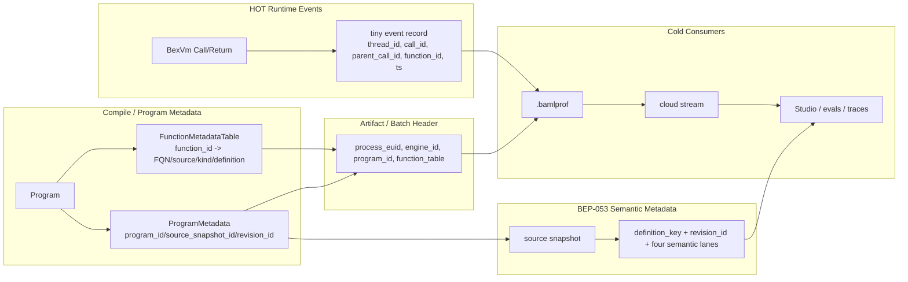

# BEX Event Identity & Program Metadata — Implementation Design

## 0. TL;DR

Runtime events need cheap local IDs. Studio, disk replay, and `$id` need globally meaningful IDs. Function hashing needs semantic version metadata. These are related, but they are not the same problem.

The design is a **three-layer identity model**:

1. **Runtime identity** — process / engine / BEX thread / call. This is the identity of one runtime invocation.
2. **Program metadata identity** — program/source snapshot and function metadata table. This lets event records resolve `function_id` into FQN/source/kind/definition metadata.
3. **Semantic version identity** — BEP-053 hash lanes, revision IDs, and source snapshot IDs. This tells Studio which version of a function/type/program ran.

**Core decisions**

1. **`CallRef` is a reversible encoding, not a hash.** Default `$id` is the tuple `(process_euid, engine_id, thread_id, call_id)` encoded as a string. `decode(encode(x)) == x`.
2. **`call_id` is per BEX thread.** It is cheap to mint and only globally meaningful when scoped by `(process_euid, engine_id, thread_id)`.
3. **`function_id` is runtime metadata, not semantic identity.** It is compact, local to a program/engine, and indexes the function metadata table. It is not stable across recompiles and is not a function hash.
4. **Events carry compact IDs; metadata carries meaning.** Hot events use `thread_id`, `call_id`, `parent_call_id`, and `function_id`. File/batch headers carry `process_euid`, `engine_id`, `program_id`, and the function table.
5. **Hashing does not happen on the event hot path.** Runtime events join to semantic hashes through `program_id + function_id -> FunctionMetadata -> BEP-053 metadata`.

**Product contract.** A user-facing ID should be stable enough to paste into a CLI or Studio URL and recover the exact runtime call. A function version should be stable enough to group traces/evals by semantic version and source revision. These are separate outputs of the same metadata system.

---

## 1. Goals & Non-Goals

| # | Goal |
|---|------|
| G1 | **Globally meaningful call IDs** — every runtime call can be named by a reversible `CallRef`. |
| G2 | **Cheap hot-path IDs** — minting IDs is O(1), local to the BEX thread where possible, and does not allocate strings. |
| G3 | **Multiple engines per process** — IDs do not collide when a host process owns multiple `BexEngine`s. |
| G4 | **Function metadata table** — every `function_id` resolves to stable display/source metadata and a semantic metadata join key. |
| G5 | **BEP-053 bridge** — tracing events can be joined to source snapshots, revisions, and semantic hash lanes without putting hashes on every event. |
| G6 | **`$id` language primitive** — reading `$id` is deterministic, cheap, and works even when tracing is disabled. |
| G7 | **Disk/cloud/playground compatible** — the same IDs work for `.bamlprof`, cloud uploads, playground replay, and future Studio links. |

**Non-goals for this document:** ring-buffer implementation, protobuf wire details, renderer/flamegraph implementation, semantic hash algorithms, cloud source-upload protocol, payload capture/redaction, LLM/HTTP tracing, CPU-time profiling.

---

## 2. Architecture



**Separation of duties**

- The **VM** mints cheap local IDs and emits compact runtime events.
- The **event artifact/header** scopes those IDs with process, engine, and program metadata.
- The **function metadata table** maps compact `function_id` to human and semantic metadata.
- The **BEP-053 pipeline** computes semantic versioning from the uploaded program/source snapshot.
- The **renderer/cloud/Studio** joins runtime events to function metadata and semantic version metadata off the hot path.

This keeps the hot path small while still making events self-describing enough for disk replay and cloud ingestion.

---

## 3. Identity Model (`ids.rs`)

Four runtime levels, each scoped by the level above it:

```text
process_euid   [u8; 16]   globally unique per process lifetime
engine_id      u64        one BexEngine within a process
thread_id      u64        one logical BEX thread within an engine
call_id        u64        one function call within a BEX thread
```

Suggested Rust surface:

```rust
pub struct ProcessEuid([u8; 16]);
pub struct EngineId(u64);
pub struct ProgramId([u8; 16]);        // opaque; exact source is OPEN
pub struct SourceSnapshotId([u8; 32]); // optional in runtime header; server may own

pub struct BexThreadId(u64);
pub struct FunctionId(u32);
pub struct CallId(u64);

pub struct ThreadRef {
    process_euid: ProcessEuid,
    engine_id: EngineId,
    thread_id: BexThreadId,
}

pub struct CallRef {
    process_euid: ProcessEuid,
    engine_id: EngineId,
    thread_id: BexThreadId,
    call_id: CallId,
}

pub enum RuntimeId {
    DefaultCall(CallRef),
    OverrideUuid([u8; 16]),
}
```

### 3.1 `process_euid`

Generated once per process lifetime.

```text
Do use:
  UUID / 128-bit random / UUIDv7-style value.

Do not use:
  OS PID alone.
```

PIDs are reused, not globally unique, and not stable across machines/containers. `process_euid` scopes all local numeric IDs before they leave the process.

### 3.2 `engine_id`

A monotonic `u64` within the process.

```text
Why it exists:
  A host process can own multiple BexEngine instances.
  function_id/thread_id/call_id may otherwise collide.
```

If there is only one engine today, `engine_id = 0` is still valid. The field prevents future rewrites.

### 3.3 `thread_id`

A logical BEX thread ID, not an OS thread ID.

```text
Root BAML invocation:
  gets a thread_id.

spawn:
  creates another thread_id in the same process/engine.
```

Thread IDs are scoped by `(process_euid, engine_id)`.

### 3.4 `call_id`

A function invocation ID, minted monotonically within one BEX thread.

```text
thread_id = 7
  call_id = 1
  call_id = 2
  call_id = 3

thread_id = 8
  call_id = 1
  call_id = 2
```

This avoids a global atomic on every call. A bare `call_id` is not globally meaningful; a `CallRef` is.

### 3.5 `function_id`

A compact runtime metadata key.

```text
function_id scope:
  program_id / engine_id

function_id is:
  good for hot events and profiler frames.

function_id is not:
  a hash;
  stable across recompiles;
  enough for Studio semantic versioning;
  enough for cross-run identity by itself.
```

Cross-run human display can use FQN. Studio/versioning should use BEP-053 semantic metadata.

---

## 4. `CallRef` and `$id`

### 4.1 Default `$id`

By default, `$id` is the current call's `CallRef`:

```text
CallRef = process_euid + engine_id + thread_id + call_id
```

The rendered string is a reversible encoding:

```rust
impl CallRef {
    pub fn encode(&self) -> String;
    pub fn decode(s: &str) -> Result<CallRef>;
}
```

**Load-bearing property:**

```text
decode(encode(call_ref)) == call_ref
```

This is intentionally **not a hash**. Exact encoding gives collision-free reversibility and keeps semantic function hashes conceptually separate from runtime call IDs.

### 4.2 Encoding format

Recommended format:

```text
baml_call_1_<base64url(version || process_euid || engine_id || thread_id || call_id)>
```

Binary payload:

```text
version       u8
process_euid [u8; 16]
engine_id    u64 big-endian
thread_id    u64 big-endian
call_id      u64 big-endian
```

Why include a version byte:

```text
- allows changing encoding later;
- makes decode errors cleaner;
- avoids guessing between default IDs and override IDs.
```

### 4.3 `$id` override

Default ID:

```text
no SetId event
$id = CallRef::encode(process_euid, engine_id, thread_id, call_id)
```

Override ID:

```text
SetId { thread_id, call_id, id: [u8; 16] }
$id = baml_id_1_<base64url(id)>
```

Rules:

```text
- `call_id` is still minted even if `$id` is overridden.
- Override ID is carried by a `SetId` event.
- Reusing one override ID for two calls is a documented usage error.
- Runtime does not validate global uniqueness of user-supplied override IDs in MVP.
```

### 4.4 Why `CallRef` is not `function_id`

```text
function_id:
  which definition/frame is running?

call_id / CallRef:
  which invocation of that definition is this?
```

Example:

```text
function_id = 42  // user.ExtractResume

CallRef A = one run for resume_1.pdf
CallRef B = another run for resume_2.pdf
```

Same function. Different calls.

---

## 5. Event Identity Contract

Antonio's event file stores a header plus six MVP events. This document specifies how IDs should be interpreted.

### 5.1 File/batch header

```rust
struct EventFileHeaderV1 {
    process_euid: [u8; 16],
    engine_id: u64,
    program_id: ProgramId,
    source_snapshot_id: Option<SourceSnapshotId>,
    revision_id: Option<RevisionId>,
    started_at_epoch_ns: u128,
    function_table: FunctionMetadataTable,
}
```

`process_euid`, `engine_id`, and `program_id` are header-only. They do not need to be repeated in every event.

### 5.2 Core events

```rust
enum DiskEventV1 {
    StartThread {
        thread_id: u64,
        parent_thread_id: Option<u64>,
        parent_call_id: Option<u64>,
        name: Option<String>,
        timestamp_ns: u64,
    },

    CallFunction {
        thread_id: u64,
        call_id: u64,
        parent_call_id: Option<u64>,
        function_id: u32,
        timestamp_ns: u64,
    },

    SetId {
        thread_id: u64,
        call_id: u64,
        id: [u8; 16],
        timestamp_ns: u64,
    },

    EndFunction {
        thread_id: u64,
        call_id: u64,
        status: FunctionEndStatus,
        timestamp_ns: u64,
    },

    EndThread {
        thread_id: u64,
        status: ThreadEndStatus,
        timestamp_ns: u64,
    },

    Heartbeat {
        timestamp_ns: u64,
    },
}
```

### 5.3 Parent call rules

For ordinary nested calls inside one BEX thread:

```text
CallFunction {
  thread_id: T1,
  call_id: 12,
  parent_call_id: 11,
}
```

`parent_call_id` is same-thread only.

For thread/spawn edges:

```text
StartThread {
  thread_id: T2,
  parent_thread_id: T1,
  parent_call_id: 12,
}
```

`StartThread` is where cross-thread parent identity lives. `CallFunction` does not need `parent_thread_id` because its parent call is inside the same thread.

### 5.4 Why emit `parent_call_id` instead of reconstructing it later?

The producer can compute it cheaply:

```rust
let parent_call_id = current_thread.call_stack.last().copied();
emit(CallFunction { parent_call_id, ... });
```

Writing it into the event avoids forcing every consumer to reconstruct perfect stacks from perfect event order.

Benefits:

```text
- stackless renderer;
- partial cloud ingest is easier;
- disk replay is more robust;
- corrupt/incomplete traces are easier to debug;
- spawn linking is explicit;
- future out-of-order or multi-consumer paths are safer.
```

---

## 6. Program and Function Metadata

The event hot path emits `function_id`. The header carries the table that makes it meaningful.

```rust
struct FunctionMetadataTable {
    functions: Vec<FunctionMetadata>,
}

struct FunctionMetadata {
    function_id: FunctionId,

    // Display/debug metadata.
    fqn: String,
    display_name: String,
    source_file: Option<String>,
    source_span: Option<SourceSpan>,
    kind: FunctionKind,
    origin: FunctionOrigin,

    // Ownership / nesting.
    owner_type: Option<DefinitionKey>,       // e.g. class owning a method
    parent_function: Option<DefinitionKey>,  // e.g. lambda enclosed by function
    lambda_path: Option<String>,             // stable lexical path if available

    // BEP-053 semantic join metadata.
    definition_key: Option<DefinitionKey>,
    package_name: Option<String>,
    namespace: Vec<String>,

    // Optional if available in runtime artifact; server may compute/attach later.
    source_snapshot_id: Option<SourceSnapshotId>,
    revision_id: Option<RevisionId>,
    semantic_lanes: Option<SemanticLanes>,
}

struct SemanticLanes {
    direct_interface: Hash256,
    effective_interface: Hash256,
    direct_implementation: Option<Hash256>,
    effective_implementation: Option<Hash256>,
}
```

### 6.1 What must be in the MVP table?

Required for Antonio's MVP profiler:

```text
function_id
FQN
display name
source file/span if available
kind/origin if available
```

Required for BEP-053 / Studio bridge:

```text
program_id
source_snapshot_id or enough to resolve source snapshot in cloud
definition_key or enough to derive it server-side
```

Optional in runtime v1:

```text
full semantic lane hashes
revision_id
class member/schema lane metadata
lambda definition hash
```

The clean approach is: runtime includes cheap metadata; cloud/server enriches with canonical semantic hashes from source snapshot.

### 6.2 FQN is display, not durable semantic version

FQN is useful for flamegraphs and profile diff.

FQN is not enough for Studio versioning because the same FQN can have:

```text
- different implementation hash;
- different interface hash;
- same semantic hash in a later revision;
- changed dependency-only effective hash;
- renamed but semantically equivalent function;
- multiple package/source snapshots over time.
```

Therefore:

```text
profile diff v1:
  FQN is acceptable.

Studio versioning:
  use source_snapshot_id + revision_id + definition_key + semantic lanes.
```

---

## 7. BEP-053 Hashing Join

Runtime tracing and function hashing meet at metadata, not at event emission.

### 7.1 Event record

```text
CallFunction {
  thread_id,
  call_id,
  parent_call_id,
  function_id,
  timestamp_ns,
}
```

### 7.2 Header

```text
EventFileHeader {
  process_euid,
  engine_id,
  program_id,
  source_snapshot_id?,
  function_table,
}
```

### 7.3 Cloud / Studio enrichment

```text
program_id + function_id
  -> FunctionMetadata
  -> definition_key
  -> source_snapshot_id
  -> revision_id
  -> semantic lanes
```

### 7.4 Semantic lane reminder

For functions/methods/lambdas:

```text
direct_interface
effective_interface
direct_implementation
effective_implementation
```

For classes:

```text
class_schema_direct_interface
class_schema_effective_interface
class_member_direct_interface
class_member_effective_interface
```

Methods themselves are also functions and get function/method lanes.

For enums/type aliases:

```text
direct_interface
effective_interface
```

### 7.5 Reverts and revision identity

Semantic hash equality does not collapse historical revisions.

Example:

```baml
T1: function a() {}
T2: function a() { let x = 0 }
T3: function a() {}
```

```text
T1 direct_implementation = H_empty, revision = R1
T2 direct_implementation = H_let,   revision = R2
T3 direct_implementation = H_empty, revision = R3
```

Studio should treat T3 as a new revision occurrence, even though its semantic implementation hash equals T1.

Recommended rule:

```text
revision_id identifies chronology/source snapshot occurrence.
semantic hashes identify content equivalence.
```

---

## 8. Layering Rules

### 8.1 Runtime must not compute semantic hashes on the hot path

Do not put hash computation in:

```text
BexVm::Call
BexVm::Return
ring push
protobuf transcode
```

Those paths should only carry compact IDs.

### 8.2 `FunctionId` must not leak as a durable external identity

Bad:

```text
Studio URL: /trace/function/42
```

Good:

```text
Studio URL: /trace/call/<CallRef>
Studio function join: source_snapshot_id + definition_key
```

### 8.3 Bare local IDs must not leave unscoped

Bad:

```text
call_id = 12
thread_id = 7
```

Good:

```text
CallRef = process_euid + engine_id + thread_id + call_id
ThreadRef = process_euid + engine_id + thread_id
```

### 8.4 Metadata must have one source of truth

Do not let disk, cloud, playground, and Studio each define their own function metadata shape.

Recommended:

```text
FunctionMetadataTable v1 is the single shared structure.
Cloud may enrich it with BEP-053 semantic lanes.
Consumers must preserve unknown/additive fields.
```

---

## 9. Examples

### 9.1 Simple nested call

```baml
function a() {
  b()
}

function b() {}
```

Events:

```text
StartThread  thread=1 parent_thread=null parent_call=null
CallFunction thread=1 call=1 parent_call=null function=a
CallFunction thread=1 call=2 parent_call=1    function=b
EndFunction  thread=1 call=2 status=Ok
EndFunction  thread=1 call=1 status=Ok
EndThread    thread=1 status=Completed
```

Default IDs:

```text
a call = CallRef(process, engine, thread=1, call=1)
b call = CallRef(process, engine, thread=1, call=2)
```

### 9.2 Spawned child thread

```baml
function a() {
  spawn "child" { b() }
}

function b() {}
```

Events:

```text
StartThread  thread=1 parent_thread=null parent_call=null
CallFunction thread=1 call=1 parent_call=null function=a
StartThread  thread=2 parent_thread=1    parent_call=1 name="child"
CallFunction thread=2 call=1 parent_call=null function=<spawn-closure>
CallFunction thread=2 call=2 parent_call=1    function=b
EndFunction  thread=2 call=2 status=Ok
EndFunction  thread=2 call=1 status=Ok
EndThread    thread=2 status=Completed
EndFunction  thread=1 call=1 status=Ok
EndThread    thread=1 status=Completed
```

Why `StartThread` needs `parent_thread_id`:

```text
parent_call_id = 1 is ambiguous without parent_thread_id,
because call IDs are per thread.
```

### 9.3 Function hash join

Runtime event:

```text
CallFunction function_id=10 thread=1 call=3
```

Header:

```text
program_id=P1
function_id=10 -> fqn="user.ExtractResume", definition_key="function:user.ExtractResume"
```

Studio:

```text
P1 + definition_key
  -> direct_interface=...
  -> effective_interface=...
  -> direct_implementation=...
  -> effective_implementation=...
```

The event stays tiny. Studio still knows exactly which semantic version ran.

### 9.4 `$id` override

```baml
foo($id = baml.id.new())
```

Events:

```text
CallFunction thread=1 call=4 function=foo
SetId        thread=1 call=4 id=<uuid>
EndFunction  thread=1 call=4 status=Ok
```

Consumers resolve:

```text
if SetId exists:
  $id = override uuid
else:
  $id = CallRef(process, engine, thread, call)
```

---

## 10. Implementation Plan

| Milestone | Scope | Owner |
|---|---|---|
| **M0 — ID types** | `ids.rs`: `ProcessEuid`, `EngineId`, `BexThreadId`, `CallId`, `FunctionId`, `CallRef`, `ThreadRef`; reversible encode/decode tests. | Paulo |
| **M1 — Engine/process scoping** | Generate `process_euid`; allocate `engine_id`; ensure event file/batch headers receive both. | Paulo + Antonio boundary |
| **M2 — Call ID minting** | Per-BEX-thread `call_id` counter; current-call stack; expose cheap current call context to VM. | Paulo/Antonio boundary |
| **M3 — Function metadata table** | Assign `function_id`; build table with FQN/source/kind/origin; attach to Program/EventFileHeader. | Paulo |
| **M4 — `$id` read/override** | Default `$id = CallRef`; `baml.id.new()`; `SetId` event; override behavior tests. | Paulo |
| **M5 — BEP-053 join fields** | Add `program_id`, `source_snapshot_id`, `definition_key`/metadata hook; document server enrichment path. | Paulo |
| **M6 — Integration with event storage** | Antonio's event records use `thread_id`, `call_id`, `parent_call_id`, `function_id`; header carries scoping metadata. | Antonio |

Fake event files can be generated after M0/M3 to unblock renderer and cloud experiments.

---

## 11. Tests

### 11.1 Encoding tests

```text
CallRef round trips.
ThreadRef round trips.
Different process_euid gives different encoded IDs.
Different engine_id gives different encoded IDs.
Different thread_id gives different encoded IDs.
Different call_id gives different encoded IDs.
Malformed IDs fail cleanly.
Version byte mismatch fails cleanly.
```

### 11.2 Uniqueness/scoping tests

```text
Two threads can both mint call_id=1 without collision after CallRef encoding.
Two engines can both mint thread_id=1/call_id=1 without collision after CallRef encoding.
Two processes can mint identical local IDs without CallRef collision.
```

### 11.3 Parent edge tests

```text
Nested call emits parent_call_id in same thread.
Root call emits parent_call_id=None.
Spawn emits StartThread(parent_thread_id, parent_call_id).
Child thread root call emits parent_call_id=None inside its own thread.
```

### 11.4 `$id` tests

```text
Reading $id returns default CallRef if no override.
Override emits SetId and changes visible $id.
call_id is minted even when tracing is disabled.
CallRef is not minted as a string unless $id is read or artifact/rendering needs it.
```

### 11.5 Function metadata tests

```text
Every emitted function has a function_id.
function_id resolves to FQN/source/kind.
Methods have owner type metadata.
Lambdas have parent/lambda-path metadata when available.
Function table is stable for one compiled Program.
Function table need not be stable across recompiles.
```

### 11.6 Hash join tests

```text
Event with program_id + function_id can resolve to definition_key.
Same semantic hash in two revisions is not collapsed if revision_id differs.
FQN-only grouping is not used for Studio semantic identity.
```

---

## 12. Deferred / Open

### OPEN: `ProgramId` source

Options:

1. Client/compiler-generated opaque ID.
2. Source snapshot ID.
3. Cloud-assigned ID after program/source upload.
4. Pair: local `program_id` plus cloud `source_snapshot_id`.

Recommendation for v1:

```text
Use an opaque ProgramId in runtime artifacts.
Allow cloud/server to map ProgramId -> SourceSnapshotId -> semantic metadata.
Do not require runtime to compute semantic hashes.
```

### OPEN: source snapshot and revision placement

Question:

```text
Does the event header carry source_snapshot_id/revision_id directly,
or only program_id and let cloud resolve the rest?
```

Recommendation:

```text
Carry program_id always.
Carry source_snapshot_id if cheaply available.
Carry revision_id only if Studio/cloud has assigned it.
```

### OPEN: lambda definition identity

Runtime can display lambdas as `<anonymous:N>`, but BEP-053 needs stable lambda definition identity.

Recommendation:

```text
function_id table should include parent function and lexical lambda path when available.
Do not use source spans as durable semantic identity.
```

### OPEN: event IDs

MVP can rely on file offset/order for event identity.

Future cloud retries may need:

```text
EventRef = process_euid + engine_id + local_event_seq
```

or:

```text
EventRef = CallRef + event_seq_within_call
```

Keep this deferred until cloud idempotency requirements are known.

### DEFERRED: payload identity

Args/results/errors/LLM payloads should attach to `CallRef`/`call_id`, but payload capture/redaction is phase 2.

---

## Appendix A — Decision Ledger

| Area | Decision |
|---|---|
| Runtime identity | Quad: `process_euid` ▸ `engine_id` ▸ `thread_id` ▸ `call_id`. |
| `call_id` scope | Per BEX thread. Durable only inside `CallRef`. |
| `CallRef` | Reversible encoding of the quad, not a hash. |
| `$id` default | Current `CallRef::encode(...)`. |
| `$id` override | `SetId` event with opaque UUID; duplicate override reuse is user error. |
| `function_id` | Compact runtime metadata key; per program/engine; not a semantic hash. |
| Function metadata | Header/table maps `function_id -> FQN/source/kind/definition metadata`. |
| Hashing join | `program_id + function_id -> FunctionMetadata -> BEP-053 semantic metadata`. |
| Hot path | Emit compact IDs only; do not compute or serialize semantic hashes. |
| Parent call | `CallFunction.parent_call_id` is same-thread and emitted by VM. |
| Spawn edge | `StartThread.parent_thread_id + parent_call_id` links child thread to spawning call. |
| FQN | Display/profile-diff key, not Studio semantic identity. |
| Revision vs semantic hash | Reverted code can have same semantic hash but different `revision_id`. |

---

## Appendix B — Sync Checklist With Antonio

Use this as the contract checklist before implementation splits.

1. **Header fields**
   - `process_euid`
   - `engine_id`
   - `program_id`
   - `function_table`

2. **Event fields**
   - `StartThread(thread_id, parent_thread_id?, parent_call_id?, name?, timestamp)`
   - `CallFunction(thread_id, call_id, parent_call_id?, function_id, timestamp)`
   - `SetId(thread_id, call_id, uuid, timestamp)`
   - `EndFunction(thread_id, call_id, status, timestamp)`
   - `EndThread(thread_id, status, timestamp)`
   - `Heartbeat(timestamp)`

3. **Scope agreement**
   - `call_id` is per thread.
   - `function_id` is per program/engine.
   - no bare local ID leaves unscoped.

4. **Parent agreement**
   - `CallFunction.parent_call_id` is same-thread.
   - `StartThread.parent_thread_id + parent_call_id` is cross-thread spawn edge.

5. **Hashing agreement**
   - tracing does not compute hashes;
   - events join to BEP-053 through `program_id + function_id` metadata;
   - FQN is not enough for Studio versioning.

6. **Implementation boundary**
   - Paulo owns `ids.rs`, `CallRef`, `$id`, function metadata table, hash join.
   - Antonio owns ring, protobuf artifact, consumer, renderer.
