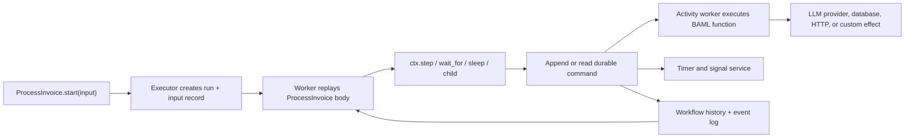

> **Status:** DRAFT — follow-on design for BEP-064. The `workflow`
> declaration and every `baml.workflow.*` API on this page are proposed and
> do not compile on this branch unless a section explicitly says otherwise.

# 10. Workflows

## Abstract

A workflow is code-defined orchestration whose progress can outlive the
process that started it. BAML already has the right language for expressing
the graph: typed functions, `let`, `match`, loops, `spawn`, and `await`. It
does not need a second DAG language or a provider pretending to be a graph.
The missing piece is durability.

This page proposes a workflow layer above BEP-064's task/provider model:

- an LLM function remains the best way to express one typed model task;
- a `workflow` declaration composes tasks, ordinary functions, custom
  providers, external effects, timers, signals, and child workflows;
- `ctx.step(...)` is the durable boundary around effects;
- an executor owns the journal, scheduling, retries, timers, signals, and
  deterministic replay;
- `WorkflowRun<T>` is the resource for observing and controlling one run;
- provider resources cross durable boundaries through tokens, never by
  serializing providers, tasks, closures, or live resources.

The core rule is:

> **Providers execute AI interactions. Workflow executors preserve
> orchestration progress.**

A workflow is therefore not a sixth provider capability. A provider may
offer a background job or a suspendable agent resource; those are still
provider-owned operations. A workflow may use those resources, but it does
not become a provider.

Normative words such as MUST, SHOULD, and MAY have their usual RFC meanings.

## Status at a glance

This design deliberately separates what works now from what requires new
compiler/runtime work:

| Surface | Status | What it means |
| --- | --- | --- |
| Ordinary BAML orchestration | **Available today** | Write a normal function using tasks, functions, `spawn`, and `await`. It restarts from the beginning if the process dies. |
| Host-authored durable workflow calling BAML activities | **Shippable first** | Temporal, DBOS, Restate, Inngest, or an application worker owns durability; generated BAML functions are its typed activities. |
| Runtime-validated local journal | **Incremental runtime work** | Canonical JSON can validate stored values at runtime, but cannot statically prove checkpoint safety. |
| `workflow`, `ctx.step`, transparent `wait_for` | **New syntax + runtime protocol** | These are compiler intrinsics backed by an executor, not an ordinary BAML library implementation. |
| Compiler-known checkpointable types | **New type-system work** | A marker interface is insufficient; the compiler must recursively inspect the value shape. |
| Production BAML-authored engine adapters | **Later host/runtime work** | Replaying BAML orchestration on an external engine needs a worker/interpreter integration, not just `load`/`save` callbacks. |

This distinction matters. A small BAML memoizer can demonstrate checkpoint
ideas, but it cannot atomically commit an effect, suspend a typed call,
deliver a signal, or wake a worker after a crash.

## The recommended direction in five rules

1. Keep every single typed model operation as an LLM function whenever
   possible.
2. Compose calls in an ordinary BAML function until the composition itself
   must survive process death.
3. Then change the outer declaration to `workflow` and wrap every effect in
   a named `ctx.step`; keep pure control flow as normal BAML.
4. Cross waits with typed signals and cross process boundaries with tokens,
   never by serializing providers, tasks, closures, or live resources.
5. Let a workflow executor own durability. Let providers keep owning AI
   interaction semantics and provider-specific resources.

## Vocabulary

BEP-064 already uses **task** for an LLM function. Workflow documentation
uses different words so the layers do not blur:

| Word | Meaning |
| --- | --- |
| Task | One typed LLM function, implemented by a prompt |
| Step or activity | One durably recorded effect inside a workflow |
| Workflow | Typed orchestration code |
| Workflow run | One durable execution of a workflow definition |
| Executor | The component that journals commands and schedules workers |
| Worker | A process that replays workflow code or executes activities |
| Provider background job | Remote work owned by an AI provider |
| Future | In-process concurrency returned by `spawn`; not durable |

“Step” is the user-facing spelling. “Activity” is the executor term for the
generated callable that actually performs that step.

## Start with the smallest honest abstraction

Not every sequence of calls needs a durable workflow.

### In-process orchestration: use an ordinary function

This is valid BAML-style orchestration today:

```baml
function build_case(document: pdf, customer_id: string) -> CaseReport {
  let invoice_future = spawn { ExtractInvoice(document) }
  let customer_future = spawn { LoadCustomerSummary(customer_id) }

  let invoice = await invoice_future
  let customer = await customer_future

  AssessCase(invoice, customer)
}
```

The types, concurrency, and LLM tasks are all real language features. If the
process exits halfway through, the caller runs `build_case` again. Use this
form when that is acceptable.

### Provider-owned deferred work: use the background driver

```baml
let job = ai.drivers.submit_background(DeepResearch.task(topic), ai.BackgroundOptions {
  idempotency_key: "research-" + ticket_id,
})
```

Here the provider owns one remote operation. `Job<T>` knows its provider
identifier, parser, polling protocol, and cancellation rules. This is not a
general workflow: it cannot durably coordinate your database write, human
approval, and three other providers.

### Process-surviving orchestration: use a `workflow`

Use the proposed workflow layer when the sequence itself must survive:

- a worker restart;
- a delay of hours or days;
- a human or external-system signal;
- multiple effects that need stable idempotency coordinates;
- fan-out whose completed branches must not rerun;
- a child workflow;
- a provider job whose token must be resumed later.

## The proposed authoring model

A workflow declaration looks like an ordinary typed function with two pieces
of durable metadata:

```baml
workflow ProcessInvoice(input: InvoiceRef) -> ProcessInvoiceOutput {
  id: "billing.process_invoice"
  version: "1"

  // Ordinary BAML control flow goes here.
}
```

- `id` is the stable logical identity. It defaults to the package-qualified
  declaration name for local development, but production deployments SHOULD
  set it explicitly so a source rename does not orphan existing runs.
- `version` selects compatible workflow code. It is required for a durable
  deployment.
- The compiler provides an implicit `ctx: baml.workflow.Context` inside the
  body.
- The input and output types MUST be checkpointable.
- A workflow is not directly callable as `ProcessInvoice(input)`. That
  spelling would promise an immediate `ProcessInvoiceOutput` even when the
  run is waiting for three days. The generated `.start` selector returns a
  truthful `WorkflowRun<ProcessInvoiceOutput>`.

The common case remains task-first: model calls are ordinary LLM function
calls placed inside durable steps.

## End-to-end example: model call, approval, and side effect

The following entire surface is proposed. It is the intended user
experience, not code that currently compiles.

```baml
class InvoiceRef {
  invoice_id: string,
  object_url: string,
}

class Invoice {
  vendor: string,
  total: float,
  currency: string,
  risk_reason: string?,
}

class ApprovalRequest {
  invoice_id: string,
  vendor: string,
  total: float,
  risk_reason: string,
}

enum ApprovalDecision {
  Approved
  Rejected
}

class LedgerReceipt {
  entry_id: string,
}

class ProcessInvoiceOutput {
  invoice: Invoice,
  receipt: LedgerReceipt?,
  rejected: bool,
}

function ExtractInvoice(document_text: string) -> Invoice {
  provider: InvoiceModel
  prompt: `Extract the invoice.

           ${document_text}

           ${ctx.output_format}`
}

signal FinanceApproval(request: ApprovalRequest) -> ApprovalDecision {
  id: "billing.finance_approval"
  version: "1"
}

workflow ProcessInvoice(input: InvoiceRef) -> ProcessInvoiceOutput {
  id: "billing.process_invoice"
  version: "1"

  let document_text = ctx.step(
    "download",
    () -> string {
      download_invoice_text(input.object_url)
    },
  )

  let invoice = ctx.step(
    "extract",
    () -> Invoice {
      ExtractInvoice(document_text)
    },
  )

  let needs_approval =
    invoice.total >= 10_000.0 || invoice.risk_reason != null

  if (needs_approval) {
    let decision = ctx.wait_for(
      "finance-review",
      FinanceApproval,
      ApprovalRequest {
        invoice_id: input.invoice_id,
        vendor: invoice.vendor,
        total: invoice.total,
        risk_reason: invoice.risk_reason ?? "high-value invoice",
      },
    )

    if (decision == ApprovalDecision.Rejected) {
      return ProcessInvoiceOutput {
        invoice: invoice,
        receipt: null,
        rejected: true,
      }
    }
  }

  let receipt = ctx.step(
    "post-ledger",
    (activity: baml.workflow.ActivityContext) -> LedgerReceipt {
      post_invoice_to_ledger(
        invoice,
        idempotency_key = activity.idempotency_key(),
      )
    },
    options = baml.workflow.StepOptions {
      retry: baml.workflow.ActivityRetry {
        max_attempts: 3,
        replay: ai.ReplayKind.RequiresIdempotencyKey,
      },
    },
  )

  ProcessInvoiceOutput {
    invoice: invoice,
    receipt: receipt,
    rejected: false,
  }
}
```

Starting it is deliberately uneventful:

```baml
let run = ProcessInvoice.start(
  InvoiceRef {
    invoice_id: "inv-9137",
    object_url: "s3://invoices/inv-9137.txt",
  },
  executor = ProductionWorkflows,
  options = baml.workflow.StartOptions {
    run_id: null,
    idempotency_key: "process-invoice-inv-9137",
    tags: { "invoice_id": "inv-9137" },
  },
)

database.save("inv-9137", baml.json.to_string(run.token()))
```

If the caller loses the `start` response before saving the token, it repeats
the same call and key. The executor returns the already-created run after
verifying the input fingerprint; it does not create a second run.

A different process can resume the local handle:

```baml
let token: baml.workflow.WorkflowRunToken<ProcessInvoiceOutput> =
  baml.json.from_string(database.load("inv-9137"))

let run = ProcessInvoice.resume(token, executor = ProductionWorkflows)

match (run.poll()) {
  let done: baml.workflow.WorkflowCompleted<ProcessInvoiceOutput> =>
    show(done.value),
  let active: baml.workflow.WorkflowRunning =>
    reschedule(active.suggested_poll_after),
  let waiting: baml.workflow.WorkflowWaiting =>
    show_approval_form(waiting.waits),
  let failed: baml.workflow.WorkflowFailed =>
    alert(failed.failure),
  let cancelled: baml.workflow.WorkflowCancelled =>
    show_cancelled(cancelled.reason),
}
```

When the UI submits the approval, it addresses the exact pending wait:

```baml
run.signal(
  FinanceApproval,
  wait = wait_ref_from_form,
  value = ApprovalDecision.Approved,
  idempotency_key = "approval-form-7821",
)
```

The executor validates all four identities: run, wait coordinate, signal,
and reply schema. Sending an approval to a risk-review wait is an error, not
a stringly typed event that happens to be ignored.

## What happens under the hood

The user writes control flow; the compiler and executor turn effect
boundaries into commands.



### Conceptual desugaring

Given:

```baml
let invoice = ctx.step(
  "extract",
  () -> Invoice { ExtractInvoice(document_text) },
)
```

the compiler conceptually generates a named, typed activity for the captured
values:

```baml
// Compiler-generated pseudocode; not user-visible BAML.
class ProcessInvoice`extract`Input {
  document_text: string,
}

function ProcessInvoice`extract`Activity(
  input: ProcessInvoice`extract`Input,
  activity: baml.workflow.ActivityContext,
) -> Invoice throws baml.errors.CallError | baml.errors.UnknownError {
  ExtractInvoice(input.document_text)
}
```

and lowers the coordinator expression to a workflow command:

```text
ctx.command(
  StepCommand {
    site_id: "extract",
    dynamic_key: null,
    input_schema: type_id<ProcessInvoice$extract$Input>,
    output_schema: type_id<Invoice>,
    input: ProcessInvoice$extract$Input { document_text },
  },
  activity = ProcessInvoice$extract$Activity,
)
```

The exact generated symbols are private. The important contract is that the
closure does not get serialized or sent through the ordinary host-call ABI.
The compiler turns it into a named activity with checkpointable inputs.
This is why `ctx.step<T>(..., () -> T)` is an intrinsic even though it looks
like a normal generic method.

The workflow declaration also produces a definition value and companion
selectors:

```text
WorkflowDefinition<InvoiceRef, ProcessInvoiceOutput> {
  id: "billing.process_invoice",
  version: "1",
  input_schema: ...,
  output_schema: ...,
  coordinator: ProcessInvoice$body,
}

ProcessInvoice.start(input, executor?, options?) -> WorkflowRun<ProcessInvoiceOutput>
ProcessInvoice.resume(token, executor?) -> WorkflowRun<ProcessInvoiceOutput>
ProcessInvoice.definition -> WorkflowDefinition<InvoiceRef, ProcessInvoiceOutput>
```

These selectors belong to workflow declarations only. LLM functions expose
only `.task`; workflow resources need `.start`/`.resume` because they are
compiler-defined durable declarations rather than library execution policy.

### Replay, not continuation snapshots

The executor never serializes a VM stack, closure, provider object, or
`Future`. It restarts the coordinator from its input and substitutes
journaled command results.

For the invoice example, the first execution might be:

| Sequence | Coordinator reaches | Executor action |
| ---: | --- | --- |
| 1 | `step("download")` | Run activity; store its typed input and output |
| 2 | `step("extract")` | Run the LLM task; store the `Invoice` |
| 3 | `wait_for("finance-review")` | Record the wait and park the run |
| 4 | approval arrives | Atomically deduplicate, store reply, and schedule the run |
| 5 | replay reaches `download` | Return stored text; do not download again |
| 6 | replay reaches `extract` | Return stored invoice; do not call the model again |
| 7 | replay reaches `wait_for` | Return the stored decision |
| 8 | `step("post-ledger")` | Run the activity and store the receipt |
| 9 | function returns | Store `WorkflowCompleted<ProcessInvoiceOutput>` |

Transparent parking is a runtime control effect. On the first
`wait_for`, the worker unwinds internally without exposing a
`Waiting | T` union to every user function. Once the signal exists, replay
makes the same source expression evaluate to the typed reply. An ordinary
stdlib function cannot implement that behavior by itself.

## Step coordinates and the journal

Every durable command has a stable coordinate:

```text
executor namespace
  + workflow definition id
  + workflow version
  + run id
  + parent/child path
  + lexical site id
  + deterministic dynamic key path
```

The coordinate is identity. Input and schema fingerprints are guards.
Attempt number is telemetry. These MUST NOT be conflated.

### Never use an input hash as identity

This is a compile error:

```baml
// COMPILE ERROR: the site id must be a source literal.
ctx.step("price-" + hash(item), () -> Price { price(item) })
```

Two equal line items can be legitimate distinct effects, while a code change
that passes a different input to an existing step should be reported as
nondeterminism rather than treated as a cache miss.

Use a stable semantic key:

```baml
for (let line in invoice.lines) {
  let priced = ctx.step(
    "price-line",
    () -> PricedLine { price(line) },
    key = line.line_id,
  )
  prices.push(priced)
}
```

The executor rejects a duplicate coordinate before scheduling the
conflicting effect.
If one replay reaches the same command coordinate twice, the second visit is
a `DuplicateCoordinate`/`NonDeterministic` error even when its input is
identical; it is never silently treated as another read of the first result.
The compiler SHOULD require `key =` whenever a command site appears in a
loop, recursion, or keyed fan-out.
For index-based loops, the index is acceptable only when ordering and
membership are themselves deterministic and versioned. Business identifiers
are safer.

Dynamic fan-out needs stronger preflight than an ordinary scheduler-driven
`map + spawn` can provide. V1 uses a typed workflow primitive:

```baml
let enriched = ctx.parallel_map(
  "enrich-customer",
  customers,
  (customer: Customer) -> string { customer.id },
  (
    customer: Customer,
    activity: baml.workflow.ActivityContext,
  ) -> EnrichedCustomer {
    enrich(customer)
  },
)
```

`parallel_map` evaluates every pure key function first, rejects duplicate
keys before scheduling any item, and then creates one activity coordinate
per key. When a key is supplied, the item index is not part of identity, so
reordering inputs preserves history; returned values still follow current
input order. Start and completion order never participate in identity.

This primitive is typed fan-out, not a heterogeneous `Step[]` graph. V1
rejects effectful ordinary `spawn` inside a durable workflow because its
scheduler interleaving is not a replay contract. A later structured-
concurrency lowering may reserve named branch paths before starting fibers
and compare history as a causal partial order per branch. Ordinary
`spawn`/`await` remains the right current surface for non-durable functions.

### Journal invariants

For every command coordinate, the executor stores at least:

- command kind and stable coordinate;
- definition identity and version;
- canonical input bytes plus input type fingerprint;
- canonical success value or normalized failure snapshot;
- output/error type fingerprint;
- scheduling attempt and timestamps;
- parent trace and child-run identity;
- commit status.

A journal read failure is fatal. It is never interpreted as “no checkpoint,”
because doing so may repeat an effect.

A completion-write failure leaves the activity in an **unknown commit**
state. It is never reported as best-effort success. The executor may run the
activity again according to its policy, which is why activities are
at-least-once and need idempotency.

## Checkpointable values

Workflow inputs, outputs, step inputs, step results, signal requests/replies,
and child-workflow boundaries MUST be checkpointable.

Checkpointability is a compiler-known recursive property, not a user marker
interface. A class cannot honestly opt in if it contains an opaque host
handle three fields down.

The intended static rule is:

- primitives, enums, and recursively checkpointable classes are allowed;
- lists, tuples, and maps are allowed when their contents are allowed;
- aliases preserve the property of their target;
- a versioned explicit codec MAY make a normally opaque value checkpointable;
- `ai.Task<T>`, `Provider`, closures, function values, `Future`,
  streams, `Job`, `Session`, `Live`, sockets, database handles, and arbitrary
  host objects are rejected;
- `unknown` and interface existentials are rejected unless an explicit
  closed encoding is declared;
- arbitrary thrown error objects are not assumed checkpointable.

For large documents and media, store an immutable external reference rather
than journal bytes:

```baml
class DocumentRef {
  url: string,
  content_sha256: string,
}
```

The first implementation MAY validate at runtime with canonical
`baml.json.to_string<T>` / `from_string<T>` plus schema fingerprints. That
is a useful milestone, but its error is late and it does not replace the
compiler rule.

## Deterministic coordinator rules

The coordinator body is replayed, so code outside durable commands MUST be
deterministic.

Allowed outside `ctx.step`:

- pure arithmetic, collection operations, and construction;
- `if`, `match`, loops, and deterministic helper functions;
- `spawn`/`await` around workflow commands whose branch coordinates are
  deterministic;
- values from workflow input or prior durable commands;
- executor-supplied `ctx.now`, `ctx.id`, `ctx.sleep`, `ctx.wait_for`, and
  `ctx.child`.

Forbidden outside `ctx.step`:

- calling an LLM task or provider;
- HTTP, filesystem, database, or environment reads;
- system time, nondeterministic random values, and process identifiers;
- mutation of process-global state;
- reading a live resource;
- starting detached work unknown to the executor.

Examples:

```baml
// Wrong: replay may choose a different branch.
if (baml.sys.now() > deadline) { ... }

// Right: the executor records one logical value for this command.
let now = ctx.now("decision-time")
if (now > deadline) { ... }

// Wrong: a crash after this call can replay it invisibly.
let invoice = ExtractInvoice(text)

// Right: the call is a named activity.
let invoice = ctx.step(
  "extract",
  () -> Invoice { ExtractInvoice(text) },
)
```

The compiler SHOULD enforce the effect boundary. Until effect checking is
available, the runtime MUST compare the replayed command sequence to
history. A changed command kind, coordinate, input fingerprint, or schema is
a `NonDeterministic` failure, not a cache miss.

## The proposed context surface

This is the conceptual normative API. The methods are intrinsics backed by
the active executor:

```baml
class baml.workflow.ActivityRetry {
  max_attempts: int,
  replay: ai.ReplayKind,
  initial_delay: baml.time.Duration?,
  max_delay: baml.time.Duration?,
}

class baml.workflow.StepOptions {
  retry: ActivityRetry?,
  timeout: baml.time.Duration?,
}

class baml.workflow.StartOptions {
  run_id: string?,
  idempotency_key: string?,
  tags: map<string, string>,
}
```

With no retry option, an activity gets one attempt. A start idempotency key
is scoped to executor namespace + definition id; repeating it with the same
input fingerprint returns the existing run, while repeating it with a
different input is an error. A caller-supplied `run_id` has the same
create-or-return semantics. Supplying both `run_id` and `idempotency_key` is
a typed error, which avoids ambiguous collision precedence; omitting both
asks the executor to generate an id and accepts that `start` cannot be
recovered safely after a lost response.

```baml
interface baml.workflow.Context {
  function step<T, E>(
    self,
    id: string,
    body:
      (() -> T throws E)
      | ((ActivityContext) -> T throws E),
    key: string? = null,
    options: StepOptions? = null,
  ) -> T throws baml.errors.WorkflowError

  function parallel_map<A, T, E>(
    self,
    id: string,
    items: A[],
    key_of: ((A) -> string throws never),
    body:
      ((A) -> T throws E)
      | ((A, ActivityContext) -> T throws E),
    options: StepOptions? = null,
  ) -> T[] throws baml.errors.WorkflowError

  function wait_for<P, R>(
    self,
    id: string,
    signal: Signal<P, R>,
    request: P,
    key: string? = null,
  ) -> R throws baml.errors.WorkflowError

  function sleep(
    self,
    id: string,
    duration: baml.time.Duration,
    key: string? = null,
  ) -> void throws baml.errors.WorkflowError

  function now(
    self,
    id: string,
    key: string? = null,
  ) -> baml.time.Instant throws baml.errors.WorkflowError

  function id(
    self,
    id: string,
    key: string? = null,
  ) -> string throws baml.errors.WorkflowError

  function child<I, O>(
    self,
    id: string,
    definition: WorkflowDefinition<I, O>,
    input: I,
    key: string? = null,
  ) -> O throws baml.errors.WorkflowError

}

interface baml.workflow.ActivityContext {
  function idempotency_key(self) -> string throws never
  function attempt(self) -> int throws never
  function heartbeat(self, details: string? = null) -> void
    throws baml.errors.WorkflowError
}
```

Every `id` parameter in this interface is rendered as `string` because BAML
does not otherwise need literal-string types, but workflow lowering requires
a string literal at the call site. A variable, interpolation, concatenation,
or function result is a compile error. Dynamic identity belongs only in
`key =` or `key_of`. This gives the compiler a stable lexical site token and
prevents changed input from manufacturing a new command.

`E` lets the intrinsic accept a throwing activity body; an uncaught `E` is
normalized to the durable failure model below rather than reconstituted as
an arbitrary error object on replay. A nonthrowing body infers `E = never`.

The zero-argument body is ergonomic sugar for a body that ignores its
`ActivityContext`. The compiler-generated activity always receives that
executor-local context; it is not captured or checkpointed. The context is
the only place to obtain the stable activity idempotency key, attempt number,
and heartbeat channel, so coordinator-only operations such as `wait_for` and
`child` cannot accidentally run inside an activity.

`ctx.id` yields a stable UUID-like value per command coordinate.
`activity.idempotency_key()` is stable across activity attempts. Neither
includes the attempt number.

The surface intentionally omits a generic `checkpoint(value)` call.
Durability attaches to effects and wait points; sprinkling snapshots through
pure code makes ownership and replay behavior harder to see.

## Activity retries and idempotency

Workflow replay, activity retry, and provider retry are three different
operations:

| Layer | What reruns | What it is for | Main risk |
| --- | --- | --- | --- |
| Provider retry | One provider interaction inside an activity | Rate limits, transient transport failures | Duplicate provider request or cost |
| Activity retry | The entire `ctx.step` body | Worker crash or a step-level transient failure | Repeating every effect in the body |
| Workflow replay | The coordinator from the beginning | Reconstructing progress after every command or restart | Nondeterministic control flow |

Completed activity results are substituted during workflow replay, so replay
does not intentionally rerun the activity. But there is always a crash
window:

```text
external effect succeeds
    -> worker crashes before completion record commits
    -> executor cannot know whether the effect happened
    -> activity may run again
```

The retryable execution model is **at-least-once activity delivery**, not
exactly-once effects. With retries disabled, an unknown first attempt stops
the workflow instead of repeating it; with retries enabled, the activity may
run again. Neither mode can prove that a nontransactional external effect
happened exactly once, and the framework MUST never claim otherwise.

The default `StepOptions.retry.max_attempts` is `1`. Users opt in to
activity retry because a provider's internal retry policy and an activity
retry policy multiply:

```text
3 provider attempts × 3 activity attempts = up to 9 provider calls
```

For side effects, pass the activity context's idempotency key to the external
system:

```baml
let receipt = ctx.step(
  "charge-card",
  (activity: baml.workflow.ActivityContext) -> ChargeReceipt {
    charge_payment(
      order.total,
      idempotency_key = activity.idempotency_key(),
    )
  },
  key = order.id,
  options = baml.workflow.StepOptions {
    retry: baml.workflow.ActivityRetry {
      max_attempts: 3,
      replay: ai.ReplayKind.RequiresIdempotencyKey,
    },
  },
)
```

If an effect cannot accept an idempotency key and is unsafe to repeat,
leave activity retries disabled and route an unknown-commit failure to
manual reconciliation.

`ai.ReplayPolicy` still governs provider wrappers inside the activity
(page 8). It does not automatically declare the *whole activity* replayable;
the activity may contain other effects the provider policy knows nothing
about.

`ActivityRetry.replay` applies page 8's same decision rule to the whole
activity. For `RequiresIdempotencyKey`, the executor constructs the policy
with `activity.idempotency_key()`. A failure retries only when:

1. the failure implements `baml.errors.Failure`;
2. `ai.may_replay` accepts its failure predicates and the activity policy;
3. `max_attempts` has not been reached.

An unclassified error never retries automatically. `max_attempts` includes
the first delivery; worker lease loss counts as an attempt once the executor
cannot prove that the activity never started.

`StepOptions.timeout` requests cooperative cancellation, but cancellation of
an arbitrary external effect is best effort. A timeout is conservatively
retryable but effectful unless the activity can assert that no effect happened.
A later attempt may overlap a timed-out one, so `Safe` or
`RequiresIdempotencyKey` is mandatory for retry. A late completion is
accepted only while its attempt still owns the command's compare-and-set;
otherwise it is retained as an audit event and cannot overwrite the chosen
result.

### Durable failures

Arbitrary error objects are not safely serializable: they may contain host
state or interface witnesses that cannot be reconstructed. An activity
failure is always persisted as data:

```baml
class baml.workflow.FailureSnapshot {
  kind: string,
  message: string[],
  retryable: bool,
  effectful: bool,
  policy_refusal: bool,
  resumable: bool,
  unsupported: bool,
  attributes: map<string, string>,
}
```

In the first implementation, `ctx.step` normalizes an uncaught activity
error to `WorkflowError(ActivityFailed)` with this snapshot. Domain outcomes
that workflow code needs to branch on SHOULD be returned as checkpointable
data:

```baml
enum ChargeDisposition {
  Charged
  Declined
}

class ChargeResult {
  disposition: ChargeDisposition,
  receipt: ChargeReceipt?,
  decline_reason: string?,
}

let charge = ctx.step(
  "charge",
  () -> ChargeResult {
    charge_or_describe_decline(order)
  },
)

if (charge.disposition == ChargeDisposition.Declined) {
  return send_to_review(order, charge.decline_reason)
}
```

A later compiler may preserve a typed thrown `E` when `E` is statically
checkpointable. This design does not depend on that feature.

## Timers, signals, and suspension

### Durable timers

`ctx.sleep` records a timer and parks the run. No worker process sleeps:

```baml
ctx.sleep(
  "remind-reviewer",
  baml.time.Duration.from_hours(24),
)
```

The executor atomically records the timer and its wake-up target. Replaying
before it fires parks again; replaying after it fires returns immediately.
`ctx.now("...")` similarly records one logical instant instead of rereading
the wall clock on every replay.

### Typed signals

A signal declaration is a stable request/reply channel:

```baml
signal LegalReview(request: LegalReviewRequest) -> LegalDecision {
  id: "contracts.legal_review"
  version: "1"
}
```

The compiler exposes that declaration as a native
`Signal<LegalReviewRequest, LegalDecision>` value carrying the stable id,
version, and request/reply schema identities. Host SDKs generate the same
typed send surface; callers do not pass unvalidated JSON events.

`ctx.wait_for` records the request and returns the typed reply after delivery:

```baml
let decision = ctx.wait_for(
  "legal-review",
  LegalReview,
  LegalReviewRequest {
    contract_id: contract.id,
    summary: summary,
  },
)
```

A run can have multiple concurrent waits, including several instances of the
same signal. Delivery therefore addresses a `WaitRef`, not just a signal
name:

```baml
class baml.workflow.WaitRef {
  run_id: string,
  command_path: string,
  signal_id: string,
  request_schema: string,
  reply_schema: string,
}
```

The signal operation has the following semantics:

1. validate that the wait belongs to the run and declared signal;
2. validate and decode the reply as `R`;
3. deduplicate by caller-supplied idempotency key;
4. atomically store the reply and make the run runnable;
5. return success if the same key and same value were already accepted;
6. throw `SignalRejected` for a mismatched value, closed run, resolved wait
   with a different key, or signal/schema mismatch.

Approval is a signal, not a provider capability and not an exception.
“Waiting” is a `WorkflowRun` status, not part of the workflow's declared
`Output` type.

## Child workflows

Reusable, independently observable orchestration is a child workflow:

```baml
let customer = ctx.child(
  "enrich-customer",
  EnrichCustomer.definition,
  EnrichCustomerInput { customer_id: order.customer_id },
  key = order.customer_id,
)
```

The executor derives the child run identity from the parent run and command
coordinate. Replaying the parent reconnects to the same child; it does not
start another one. The parent can park while the child waits.

Use an ordinary helper function when the code is pure or should share the
parent's run history. Use a child workflow when it needs independent
lifecycles, visibility, cancellation policy, or reuse.

Inside a workflow, call `ctx.child` rather than `Child.start`. A raw
`.start` would create an untracked sibling that replay could duplicate.

## `WorkflowRun<T>`: the resource boundary

The executor-owned run follows page 6's resource/token pattern:

```baml
class baml.workflow.WorkflowCompleted<T> {
  value: T,
}

class baml.workflow.WorkflowRunning {
  suggested_poll_after: baml.time.Duration?,
}

class baml.workflow.PendingWait {
  wait: WaitRef,
  signal_id: string,
  request: json?,       // redacted according to the workflow trace policy
}

class baml.workflow.WorkflowWaiting {
  waits: PendingWait[],
}

class baml.workflow.WorkflowFailed {
  failure: FailureSnapshot,
}

class baml.workflow.WorkflowCancelled {
  reason: string?,
}

interface baml.workflow.WorkflowRun<T> {
  function poll(self)
    -> WorkflowCompleted<T>
     | WorkflowRunning
     | WorkflowWaiting
     | WorkflowFailed
     | WorkflowCancelled
    throws baml.errors.WorkflowError

  function signal<P, R>(
    self,
    signal: Signal<P, R>,
    wait: WaitRef,
    value: R,
    idempotency_key: string,
  ) -> void throws baml.errors.WorkflowError

  function events(
    self,
    after: EventCursor? = null,
  ) -> WorkflowEventStream throws baml.errors.WorkflowError

  function cancel(
    self,
    reason: string? = null,
  ) -> void throws baml.errors.WorkflowError

  function token(self) -> WorkflowRunToken<T> throws never
  function cleanup(self) -> void
}
```

`poll` expresses terminal workflow failure as a status. Errors thrown by
`poll`, `signal`, `events`, and `cancel` are control-plane failures such as
an unavailable executor or invalid token.

`cleanup()` releases a local handle, subscription, or connection. It MUST
NOT cancel the durable run. Cancellation is always explicit.

### Run tokens

A `WorkflowRun<T>` is process-local. A
`WorkflowRunToken<T>` is serializable and non-secret. Its encoded claims
include:

- executor instance name and namespace;
- workflow definition id and version;
- run id;
- output type identity;
- token format version and integrity data.

It never contains provider credentials, an executor connection, workflow
input, a `Task<T>`, or a closure. The configured executor validates token
ownership on resume.

The executor instance name is operationally important. “Resume this run”
means reconnect to the durable store that owns it, not pick any object that
happens to implement an interface.

## Events and observability

A workflow event has a monotonically increasing sequence within a run and a
reconnectable cursor:

```baml
class baml.workflow.EventCursor {
  sequence: bigint,
}

class baml.workflow.WorkflowEvent {
  cursor: EventCursor,
  run_id: string,
  parent_run_id: string?,
  command_path: string?,
  attempt: int?,
  timestamp: baml.time.Instant,
  kind: string,
  attributes: map<string, string>,
}
```

The durable event log includes structural lifecycle events:

- run started/completed/failed/cancelled;
- activity scheduled/started/completed/failed/retried;
- timer scheduled/fired;
- wait created and signal accepted;
- child workflow started/completed;
- replay nondeterminism or version failure.

Consumers reconnect with the last cursor and deduplicate by sequence.
Attempt numbers make retries visible without changing step identity.

Model token deltas, local logs, and high-volume tracing MAY be live,
best-effort telemetry linked to the command path. They are not automatically
part of durable workflow history. Buffering an entire nested model stream
and emitting it after completion is not “live streaming,” while journaling
every token can make replay storage prohibitively expensive.

A workflow event stream is also not
`Stream<Partial<T>, T>`. Workflow events describe orchestration; partial
values describe incremental parsing of one task. Keeping the types separate
prevents tool calls, timers, and approvals from masquerading as pieces of
the final output.

## Using LLM tasks, custom providers, and custom capabilities

The workflow layer is agnostic to what happens inside a step. It records
checkpointable inputs and outcomes; the activity may use any provider or
capability available to ordinary BAML code.

### Preferred: call an LLM function

```baml
let plan = ctx.step(
  "make-plan",
  () -> Plan {
    MakePlan(goal, constraints)
  },
)
```

This is the default because the LLM function already provides:

- a stable task identity for traces and evals;
- a typed input/output contract;
- prompt rendering and `ctx.output_format`;
- provider overrides;
- the standard `.task` value and testing surface.

The workflow adds durability around the task; it does not replace its DSL.

### Direct custom-provider call

If an interaction genuinely does not fit an LLM function, call the provider
inside a step:

```baml
let verdict = ctx.step(
  "vendor-classification",
  () -> Verdict {
    let task = ai.task<Verdict>(
      AcmeModel,
      prompt`Classify ${document_text}.
             ${ctx.output_format}`,
    )

    AcmeModel.generate<Verdict>(task).value
  },
)
```

The tagged `prompt` template is converted to a lazy `PromptAst` render
recipe; once provider and `Verdict` are known, the runtime supplies the
provider-sensitive context and output schema. This is the same task seam
used by an LLM function, just without a named task.
Inside the tagged template, `ctx` is the prompt-render context (including
`ctx.output_format`), not the surrounding workflow context.

The cost of skipping the LLM function is intentional: there is no named task
for evals, prompt inspection, or SDK discovery. Use the direct form for
provider-specific protocols, not merely to avoid declaring a five-line task.

`AcmeModel` above is a named worker configuration. A provider value created
in coordinator local state cannot be captured into a step, because
`Provider` is not checkpointable. The activity may resolve a named provider
or construct one from worker-local environment inside its body.

### A user-defined capability

Suppose a custom provider exposes embeddings:

```baml
interface EmbeddingProvider requires ai.Provider {
  function embed(
    self,
    text: string,
  ) -> float[] throws EmbeddingError
}

function embed_document(
  provider: EmbeddingProvider,
  text: string,
) -> float[] throws EmbeddingError {
  provider.embed(text)
}
```

The workflow uses it like any other effect:

```baml
let vector = ctx.step(
  "embed-document",
  () -> float[] {
    embed_document(AcmeEmbeddings, document_text)
  },
)
```

No workflow capability registration occurs. The provider implements its
semantic interaction; the step supplies durability. If the activity result
is checkpointable and retry policy is honest, the layers compose.

## Provider resources inside a workflow

Live resources are not checkpointable. Their tokens are.

For a provider background job, split submission and observation into durable
steps:

```baml
class JobReady<T> {
  value: T,
}

class JobStillRunning {
  retry_after: baml.time.Duration,
}

class JobTerminated {
  failure: baml.workflow.FailureSnapshot,
}

let token = ctx.step(
  "submit-research",
  (activity: baml.workflow.ActivityContext) -> ai.JobToken {
    let job = ai.drivers.submit_background(
      DeepResearch.task(topic),
      ai.BackgroundOptions {
        idempotency_key: activity.idempotency_key(),
      },
    )
    defer { job.cleanup() }
    job.token()
  },
)

let poll_number = 0
let report: Report? = null

while (report == null) {
  let observation = ctx.step(
    "poll-research",
    () -> JobReady<Report> | JobStillRunning | JobTerminated {
      let job = ResearchModel.resume_job<Report>(token)
      defer { job.cleanup() }
      normalize_job_poll(job.poll())
    },
    key = `poll-${poll_number}`,
  )

  match (observation) {
    let ready: JobReady<Report> => { report = ready.value; },
    let pending: JobStillRunning => {
      ctx.sleep(
        "research-poll-delay",
        pending.retry_after,
        key = `poll-${poll_number}`,
      )
      poll_number += 1
    },
    let stopped: JobTerminated => {
      throw workflow_failure(stopped.failure)
    },
  }
}
```

The temporary `Job<Report>` encapsulates the provider-specific remote id,
owner, parser, polling rules, and cleanup behavior while the activity is
running. Only its non-secret `JobToken` enters the workflow journal. On a
later worker, `ResearchModel.resume_job` reconstructs the resource using
configured credentials and validates ownership.

A standard `baml.workflow.await_job` helper can package this loop once the
semantics are stable. It is a workflow helper over `JobToken`, not a new
provider capability.

Provider-owned suspend/resume follows the same rule. If a provider owns an
agent run, it may return an `AgentRun` resource with `token` and
`resume_agent`. That capability is honest for the provider-owned run. It is
not the mechanism used to durably suspend arbitrary BAML control flow.

## Agents in workflows

### First phase: the whole agent is one activity

```baml
let outcome = ctx.step(
  "research-agent",
  options = baml.workflow.StepOptions {
    retry: baml.workflow.ActivityRetry { max_attempts: 1 },
  },
  () -> ai.Done<Report> | ai.BudgetReached | ai.Handoff {
    ai.drivers.run_agent(
      ResearchQuestion.task(question),
      ai.AgentOptions { budget: ai.Budget { max_steps: 12 } },
    )
  },
)
```

This is a useful v1 boundary. Replay stores the final agent outcome and
aggregate trace metadata.

The outcome itself must pass checkpoint validation. If a provider transcript
contains opaque values, the activity returns a user-defined checkpointable
summary instead of journaling the raw transcript.

It is safe only when tools are:

- read-only;
- provider-owned;
- independently idempotent; or
- protected by their own durable/idempotency system.

If the worker crashes on turn eight, any configured automatic retry or later
manual retry restarts the whole activity. A shell command or database
mutation from turn four can therefore happen again. With retries disabled,
the safer outcome is a failed/unknown-commit workflow that an operator
reconciles.

### Later: a durable agent protocol

Fine-grained durable agents record each model turn and each task-owned tool
dispatch under a coordinate such as:

```text
workflow run / step / agent turn / provider tool-call id
```

That design can park on a typed approval signal before dispatching a tool,
resume provider-owned agent state by token, and replay completed tool
results without rerunning them. It requires an executor-aware agent driver
and is intentionally later than whole-agent-as-step.

The workflow layer should supply the durable primitives; it should not force
every provider to implement a workflow-oriented `Steppable` capability.

## Workflows as tools

A workflow has one fixed signature `I -> O`. A model tool also needs a fixed
argument schema, output schema, and executable handler. The honest adapter
is therefore typed and direct:

```baml
let customer_tool = LookupCustomer.as_tool(
  executor = ProductionWorkflows,
  timeout = baml.time.Duration.from_seconds(30),
)
```

Conceptually, the generated binding:

1. derives the tool schema from `I`;
2. validates model arguments as `I`;
3. starts a child run whose id derives from the parent agent/tool-call id;
4. waits for completion;
5. returns `O` as the tool result.

V1 permits this adapter only for workflows that complete within the handler
timeout without parking for an external signal, a long timer, or a waiting
child. A normal tool handler cannot return “the workflow is waiting for a
human” and later continue the same model turn.

For a long-running or waiting workflow, use one of two explicit models:

- a start tool whose result is a serializable child-run token, plus later
  status tools; or
- a durable parent-agent protocol that can propagate suspension.

The workflow does **not** implement `ai.GenerationProvider`. That interface is
universally generic:

```baml
function generate<T>(task: Task<T>) -> Response<T>
```

A fixed `Workflow<I, O>` cannot accept every `Task<T>` or produce every
`T` without dynamically decoding a prompt into `I` and casting `O` to an
unrelated requested type. A typed tool binding preserves the real signature.

## Executor boundary and custom engines

The conceptual executor contract is:

```baml
interface baml.workflow.Executor {
  function start<I, O>(
    self,
    definition: WorkflowDefinition<I, O>,
    input: I,
    options: StartOptions? = null,
  ) -> WorkflowRun<O> throws baml.errors.WorkflowError

  function resume<O>(
    self,
    token: WorkflowRunToken<O>,
  ) -> WorkflowRun<O> throws baml.errors.WorkflowError
}
```

This interface describes the user-facing dependency. A production executor
is not expected to be an ordinary BAML class: it needs atomic storage,
leases, queues, timers, worker registration, and host callbacks. The
runtime/SDK supplies adapters and exposes configured executor values to
BAML.

Illustrative host bootstrap:

```typescript
// Proposed SDK shape, not current API.
baml.workflows.registerExecutor(
  "production",
  temporalExecutor({
    namespace: "billing",
    taskQueue: "baml-workflows",
    connection,
  }),
)
```

The stable name `production` goes in run tokens; the connection and
credentials do not.

### The first production integration

The first useful engine integration does not require BAML-authored durable
workflows. A host workflow can call generated BAML functions as activities:

```typescript
// Schematic Temporal-style code. Exact generated SDK names are out of scope.
export async function processInvoice(input: InvoiceRef) {
  const text = await activities.download(input.objectUrl)
  const invoice = await activities.extractInvoice(text) // generated BAML task

  if (invoice.total >= 10_000) {
    await conditions.waitForFinanceApproval(input.invoiceId)
  }

  return await activities.postLedger(invoice)
}
```

This is production-grade as soon as the host engine adapter and activity
wrappers are sound.

Running a BAML-authored `workflow` on Temporal/DBOS/Restate/Inngest is a
larger step. The adapter must execute or interpret the BAML coordinator,
translate each intrinsic to engine commands, and feed history back on
replay. A generic `StepStore.load/save` callback cannot provide those
semantics.

### Local executors

The stdlib/runtime SHOULD include:

- `InMemoryExecutor` for deterministic unit tests and demos;
- `SqliteExecutor` for local development and single-node durability.

Neither should pretend to provide multi-node scheduling guarantees it does
not implement. Production adapters document their own leasing, retention,
encryption, and availability contracts.

## Error model

Workflow errors form one family:

```baml
enum baml.errors.WorkflowFailureKind {
  EngineUnavailable
  Journal
  ActivityFailed
  UnknownCommit
  NonDeterministic
  VersionMismatch
  Decode
  SignalRejected
  Cancelled
}

interface baml.errors.WorkflowError requires baml.errors.Failure {
  function workflow_kind(
    self,
  ) -> baml.errors.WorkflowFailureKind throws never
}
```

The inherited `Failure` predicates remain the cross-system decision axis.
Engine/journal failures may be retryable; unknown-commit failures are
effectful; decode/version/nondeterminism/signal-rejection failures are
terminal; cancellation is a policy refusal. `workflow_kind()` carries the
workflow-specific diagnostic.

Examples:

- an HTTP 429 inside an LLM activity is initially a provider
  `CallError`; if the activity exhausts its policy, the workflow records an
  `ActivityFailed` snapshot;
- a database outage while polling a run is `EngineUnavailable`;
- history says `extract` returned `InvoiceV1` but code asks for
  `InvoiceV2`: `VersionMismatch` or `Decode`;
- replay reaches `charge` with a different input fingerprint:
  `NonDeterministic`;
- an approval targets a closed wait: `SignalRejected`.

`Unsupported` is not the default for workflow failures. It remains correct
only when a caller asks a configured adapter for a genuinely unsupported
operation.

## Definition versions and code changes

Four identities MUST remain separate:

1. logical workflow definition id;
2. definition version and compatible worker routing;
3. run id;
4. worker/activity attempt id.

A build SHA alone is not a versioning policy. Deployments must either retain
workers for old workflow versions, migrate histories with explicit tooling,
or fail resume with `VersionMismatch`. They MUST NOT silently route an old
history to arbitrary new code.

Within one version:

- changing a step id is removing one command and adding another;
- changing a dynamic key changes identity;
- changing a checkpoint schema changes its fingerprint;
- inserting a command before an already-recorded command changes replay;
- changing pure code is safe only when it produces the same command sequence
  and inputs for existing history.

V1 uses exact-version routing. A later BEP may add explicit patch markers and
history migrations; this page does not invent implicit compatibility.

## Security and privacy

Workflow histories may contain prompts, model outputs, business data, tool
arguments, approvals, and external identifiers. Executors MUST support:

- field-level redaction inherited from BAML types and task traces;
- encryption at rest and in transit;
- retention policies per workflow definition;
- access control by namespace and run;
- signed or integrity-protected non-secret tokens;
- redacted failure snapshots and events;
- audit records for signals, cancellation, and manual replay.

Provider credentials, provider objects, task render closures, executor
connections, and live resource handles MUST never be journaled.

An idempotency key is an identifier, not an authorization secret. External
systems must still authenticate the activity worker.

## Testing

Workflow tests should be deterministic and fast. They should not wait for
wall-clock time or call a real model unless explicitly marked integration.

Proposed test shape:

```baml
test "high-value invoice waits, then posts once" {
  let executor = baml.workflow.InMemoryExecutor {
    activities: baml.workflow.FakeActivities {
      "download": "Vendor: Acme\nTotal: 12000 USD",
      "extract": Invoice {
        vendor: "Acme",
        total: 12_000.0,
        currency: "USD",
        risk_reason: null,
      },
    },
  }

  let run = ProcessInvoice.start(
    InvoiceRef {
      invoice_id: "inv-1",
      object_url: "fixture://inv-1",
    },
    executor,
  )

  executor.run_until_blocked()
  let waiting = assert.waiting(run.poll(), signal = FinanceApproval)

  run.signal(
    FinanceApproval,
    waiting.waits[0].wait,
    ApprovalDecision.Approved,
    idempotency_key = "test-approval",
  )

  executor.run_until_idle()
  assert.completed(run.poll())
  assert.activity_calls("post-ledger") == 1

  executor.replay_from_start(run.token())
  assert.activity_calls("post-ledger") == 1
}
```

The executor test kit SHOULD support:

- fixture results and failures by command coordinate;
- virtual time and deterministic timer advancement;
- injecting typed signals;
- crash-before-effect, crash-after-effect, and crash-before-commit points;
- replaying from an empty worker;
- asserting command history and attempt counts;
- swapping task providers for fixture providers;
- version-mismatch and schema-mismatch tests.

The most important invariant test is not “the workflow returned the right
value.” It is “after every crash point, no completed coordinate is
accidentally treated as missing, and every possibly repeated effect has an
honest idempotency story.”

## Implementation plan

Each phase is useful on its own and states what it cannot yet promise.

### Phase A — BAML functions as host-engine activities

- Generate or document typed activity wrappers for BAML functions and tasks.
- Provide examples for Temporal, DBOS, Restate, and Inngest.
- Keep orchestration host-authored.
- No new BAML syntax.

This is the first production recommendation.

### Phase B — workflow runtime protocol and local shell

- Define run/definition/token wire formats and the command journal.
- Add a host-backed `InMemoryExecutor`.
- Add per-definition generated start/resume bridges.
- Validate checkpoint values with canonical JSON and type fingerprints.
- Support `ctx.step` without signals or timers.

This phase is runtime-checked and local; it does not claim static
checkpointability or production durability.

### Phase C — compiler workflow surface

- Parse and lower `workflow` declarations.
- Generate named activities for step closures and captured inputs.
- Add effect restrictions to coordinator bodies.
- Add compiler-recursive checkpointability diagnostics.
- Add stable command-coordinate generation and replay validation.

### Phase D — durable lifecycle

- `WorkflowRun<T>`, tokens, poll, cancellation, and cleanup.
- durable timers and `ctx.now`/`ctx.id`;
- typed signals, wait refs, atomic delivery, and deduplication;
- cursor-based structural events;
- child workflows.

### Phase E — production executors

- engine-specific worker/interpreter adapters;
- old-version worker routing;
- leases, retries, retention, encryption, and operational tooling;
- SQLite single-node executor with precisely documented guarantees.

### Phase F — AI-specific workflow adapters

- standard `await_job` helper over provider `JobToken`;
- workflow-as-tool bindings;
- whole-agent-as-step trace integration;
- fine-grained durable agent turns and tool dispatch;
- approval signals inside durable agent loops.

Workflow work is a follow-on track. It does not block BEP-064's provider
acceptance criteria; the provider/task/resource seam should be stable
enough for executors to call before native workflows are implemented.

## Alternatives considered

### Make `Workflow` implement `Provider`

Rejected as the general model. A workflow has a fixed `I -> O` signature;
`GenerationProvider` promises `Task<T> -> Response<T>` for every `T`. Bridging them
requires runtime prompt decoding and an unsafe output cast. It also mixes
orchestration lifecycle with AI interaction capability. Typed tool or child
workflow adapters cover the honest cases.

### Add `Durable` or `Suspendable` as provider wrappers

Rejected for application-owned workflows. A provider wrapper can observe
provider calls, but not arbitrary database effects, timers, signals, or
tool handlers. It sees only part of the program and cannot atomically govern
the rest. A provider-owned suspendable run remains a valid resource
capability when the provider truly owns that state.

### Describe the workflow as `Step[]` or a portable DAG

Rejected. Heterogeneous outputs force `unknown` carry values or elaborate
type-level graph machinery. BAML already has typed control flow, loops,
branches, functions, and concurrency. The executor history can visualize
the graph after execution without making users author a second language.

### Snapshot the VM continuation

Rejected. Opaque stacks and closures are fragile across compiler/runtime
versions, difficult to inspect or migrate, and likely to capture providers,
handles, or secrets. Replay from typed input plus a command journal is more
portable and auditable.

### Implement durability as a library `step(store, id, closure)`

Useful for a demo, insufficient as the contract. A library callback cannot
atomically coordinate an external effect with journal commit, transparently
park a `T`-returning function, wake timers, deduplicate signals, or safely
move a generic closure through today's host boundary. The ergonomic method
therefore lowers to a runtime intrinsic.

### Return `Waiting | T` from every suspendable function

This is the only pure-library state-machine option, but it infects every
helper's signature and makes users manually propagate suspension. It remains
a reasonable fallback for embedders that cannot support replay intrinsics;
it is not the primary BAML surface.

### Use `Future<T>` for a workflow run

Rejected. A future represents an in-process computation and disappears with
the process. A workflow run is durable, pollable, signalable, cancellable,
and resumable by token.

### Key steps by name plus input hash

Rejected. Equal inputs can be distinct loop iterations, while changed input
at an existing coordinate is nondeterminism. Stable site/dynamic paths are
identity; hashes are guards.

### Promise exactly-once steps

Rejected because an external effect and journal commit cannot generally be
one transaction. The useful promise is at-least-once execution plus stable
idempotency coordinates, explicit unknown-commit states, and deterministic
substitution of committed results.

### Add `.workflow` to every LLM task

Rejected. A workflow is authored orchestration, not a way to execute one
task. One-task background work is already
`drivers.submit_background(MyTask.task(...))`. A workflow declaration gets
its own `.start`/`.resume` selectors without adding lifecycle companions to
LLM functions.

## Acceptance criteria

The workflow proposal is ready to call implemented only when:

1. A workflow can call an ordinary LLM task inside `ctx.step` and retain the
   task's trace identity and typed output.
2. A user-defined provider or capability can run inside a step with no
   workflow-specific registration.
3. Replaying a completed step returns its stored typed result without
   executing its activity.
4. A journal read error is terminal and never treated as a cache miss.
5. A completion-write failure surfaces unknown commit and exercises the
   configured at-least-once policy.
6. Loop and fan-out coordinates cannot alias on equal inputs or scheduler
   order.
7. Input or schema drift at an existing coordinate produces a typed
   nondeterminism/version error.
8. Noncheckpointable captures such as providers, tasks, closures,
   futures, and live resources receive a compiler diagnostic.
9. A typed signal atomically records its reply, deduplicates delivery, and
   wakes the exact wait.
10. A durable timer survives worker shutdown without keeping a process
    asleep.
11. `WorkflowRun<T>` polls all terminal/nonterminal states, emits a
    non-secret token, resumes on its configured executor, and separates
    cleanup from cancellation.
12. Structural events reconnect from a cursor without presenting model
    tokens as workflow `Partial<T>` values.
13. Provider jobs cross steps as `JobToken` and resume on a configured
    provider; no `Job` or provider is journaled.
14. Old histories route to compatible workflow versions or fail explicitly;
    they never silently execute arbitrary current code.
15. Crash-point tests demonstrate the documented at-least-once boundary and
    stable `ctx.step_key()`.
16. At least one production engine can run generated BAML activities before
    native BAML-authored workflow support is claimed.

## Practical decision guide

| You need | Use |
| --- | --- |
| Several typed calls that may restart together | Ordinary BAML function |
| Parallel work in one process | `spawn` / `await` |
| One provider-owned long call | `drivers.submit_background(Task<T>)` / `Job<T>` |
| One provider-owned session or live connection | The corresponding resource |
| Orchestration that survives process death | `workflow` + executor |
| One typed model operation in that workflow | LLM task inside `ctx.step` |
| A provider-specific operation | Direct provider/custom capability inside `ctx.step` |
| A human or external callback | Typed `signal` + `ctx.wait_for` |
| A durable delay | `ctx.sleep` |
| Reusable long-lived sub-orchestration | `ctx.child` |
| An agent with safe/read-only tools | Whole agent inside one step |
| A side-effecting durable agent | Fine-grained executor-aware agent protocol |
| Expose a short nonwaiting workflow to a model | Typed `as_tool` binding |

## Open questions

1. Should production workflow ids be required explicitly, or may a package
   manifest freeze default qualified names?
2. What is the smallest useful typed-error preservation beyond
   `FailureSnapshot` in the first release?
3. Should `as_tool` be compiler-restricted to workflows with no external
   waits, or should it require an explicit adapter mode?
4. Which version-migration primitives deserve a separate BEP after
   exact-version routing ships?
5. Should `SqliteExecutor` be a stdlib development tool or a separately
   versioned runtime package?
