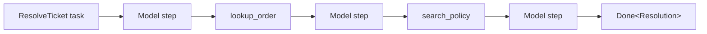
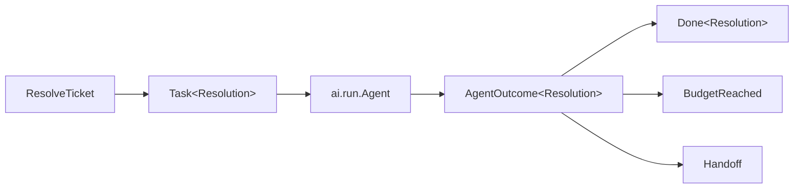
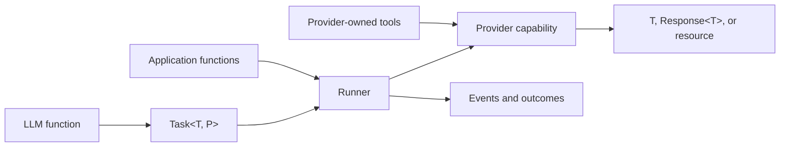

# BEP-064: AI Functions and Agents

## Summary

An LLM function describes a job and the type of result we want.

Sometimes we want to call that function normally. Sometimes we want to stream
it, give it tools, run it in the background, or send it to an external agent.
We should not need a different kind of LLM function for every lifecycle.

Every LLM function can therefore create a typed `Task`. A runner decides how
that task runs.

## Start with an agent

Here is the main idea:

```baml
class Ticket {
  id: string,
  message: string,
}

class Resolution {
  reply: string,
  resolved: bool,
}

/// Look up the latest status of an order.
function lookup_order(order_id: string) -> string {
  "Order is out for delivery."
}

/// Search the support policy documents.
function search_policy(query: string) -> string {
  "Orders may be replaced when they have not moved for seven days."
}

function ResolveTicket(ticket: Ticket) -> Resolution {
  provider: "openai/gpt-5.6-luna"

  prompt: `
    Help the customer with this support ticket.

    Use the available tools when you need more information.

    ${ticket}

    ${ctx.output_format}
  `

  tools: [
    lookup_order,
    search_policy,
  ]
}

let outcome: ai.AgentOutcome<Resolution> = ResolveTicket.task(ticket).run(
  runner = ai.run.Agent.new(),
)
```

There are only three new ideas here:

- `.task(...)` creates the LLM function call without running it.
- `ai.run.Agent` chooses the application-managed agent lifecycle.
- `AgentOutcome<Resolution>` describes how the agent finished.

The tools are ordinary BAML functions. The LLM function declares its default
tools, and `Agent.new()` inherits them. There is no second dispatcher that
switches over tool names.

## See what happened

An illustrative run might look like this:

```console
$ baml run support.main

[INFO] ResolveTicket started
[INFO] called tool: lookup_order("order-42")
[INFO] tool returned: "Order order-42 is out for delivery."
[INFO] called tool: search_policy("out for delivery")
[INFO] tool returned: "Orders may be replaced after seven days without movement."
[INFO] ResolveTicket returned: Resolution {
  reply: "Your order is out for delivery and should arrive soon.",
  resolved: true,
}
```

This trace is illustrative. The observability pages define the typed events
that a CLI, test, or application may render this way.



## What comes back

An explicit Agent run may finish in three ways:

| Outcome | Meaning |
| --- | --- |
| `Done<T>` | The Agent produced the LLM function's final value |
| `BudgetReached` | The Agent stopped safely and can be resumed |
| `Handoff` | The Agent asked the application to take over |

```baml
type AgentOutcome<T> =
  Done<T>
  | BudgetReached
  | Handoff
```

For `ResolveTicket`, the type is `AgentOutcome<Resolution>`.



The application decides what each outcome means:

```baml
let resolution = match (outcome) {
  let done: ai.Done<Resolution> => done.value,

  let stopped: ai.BudgetReached => {
    log.info(`Agent stopped after ${stopped.steps_taken} steps`);
    queue_for_review(stopped.conversation)
  },

  let handoff: ai.Handoff => {
    log.info(`Agent requested a handoff to ${handoff.to}`);
    transfer_to_human(handoff)
  },
}
```

The final `Resolution` remains visible inside `Done<Resolution>`. It does not
disappear into an untyped agent result.

## The normal call stays simple

Most callers only want the declared return type:

```baml
let resolution: Resolution = ResolveTicket(ticket)
```

A direct LLM function call always returns its declared `T` or throws. Because
`ResolveTicket` declares application tools, BAML uses the standard Agent loop
and collapses its terminal outcome:

```text
Done<T>        → return T
BudgetReached  → throw AgentIncomplete
Handoff        → throw AgentIncomplete
```

`AgentIncomplete` retains the conversation and details about why the run
stopped. The explicit Agent form is available when those outcomes are normal
application control flow:

```baml
let outcome = ResolveTicket.task(ticket).run(
  runner = ai.run.Agent.new(),
)
```

This gives us a simple rule:

| LLM function declaration | Direct-call behavior |
| --- | --- |
| No application `tools:` | Use bounded provider completion |
| Has application `tools:` | Use the standard BAML Agent loop |

Provider-owned tools do not count as application tools. A hosted search or
code-execution service runs inside the provider's own bounded operation.

## What BAML creates for an LLM function

One LLM declaration gives the program two typed entry points:

```baml
ResolveTicket(ticket)       // Run now and return Resolution
ResolveTicket.task(ticket)  // Describe the call as Task<Resolution, OpenAi>
```

At a high level, the direct call is the task form plus BAML's standard direct
lifecycle:

```baml
// Conceptual code, generated by BAML.
function ResolveTicket(ticket: Ticket) -> Resolution {
  ai.internal.run_direct(
    ResolveTicket.task(ticket),
  )
}
```

The generated task companion captures the declaration's arguments, provider,
prompt recipe, return type, and application tools. Creating the task performs
no I/O. `run_direct` applies the completion-or-Agent rule from the previous
section.

These generated pieces keep `ResolveTicket` as the semantic identity in
graphs, traces, errors, and tests. The exact compiler representation is an
implementation detail.

## A task is a call that has not run yet

Creating a task does not contact a model:

```baml
let task = ResolveTicket.task(ticket)
```

A task remembers:

- the LLM function's identity;
- its arguments and prompt recipe;
- its declared return type;
- its selected provider;
- its default application tools; and
- tags used by graphs, logs, and tests.

Its type is conceptually:

```baml
Task<Resolution, SupportProvider>
```

`Resolution` is the function's output promise. `SupportProvider` is the concrete
provider type selected by `provider:`. Keeping both types lets BAML check whether
a runner is compatible with the selected provider.

The task also keeps the LLM function visible in traces and graph
visualizations. Running it through a generic runner does not turn it into an
anonymous model call.

## A runner chooses the lifecycle

A runner is an ordinary configured value:

```baml
task.run(
  runner = ai.run.Agent.new(),
)
```

The runner controls:

- whether there is one model interaction or several;
- whether BAML executes application tools;
- whether the caller receives metadata, a stream, or a resource;
- whether work continues remotely;
- when execution stops; and
- which result type the caller receives.

Standard runners live in `ai.run`:

| What you want | API | What comes back |
| --- | --- | --- |
| Normal typed result | `ResolveTicket(ticket)` | `Resolution` |
| Typed result with metadata | `ai.run.CompletionWithMeta` | `Response<Resolution>` |
| Exactly one model interaction | `ai.run.Generation` | `Resolution` |
| Incremental output | `ai.run.Stream` | `Stream<ResolutionPartial, Resolution>` |
| Application-managed tools | `ai.run.Agent` | `AgentOutcome<Resolution>` |
| Semantic retry | `ai.run.Retry` | The inner runner's output |
| Provider fallback | `ai.run.Fallback` | The inner runner's output |
| Remote background work | `ai.run.Background` | `Job<Resolution>` |
| Managed voice interaction | `ai.run.VoiceAgent` | `null` when the session ends |

Runners may be small adapters or large state machines. The shared idea is that
they choose an execution lifecycle and preserve an exact output type.

## Providers perform model operations

The `provider:` field selects a configured provider. A provider owns
backend-specific work:

- model and endpoint configuration;
- authentication and headers;
- request and response formats;
- provider-specific message blocks;
- native tool-call encoding;
- request IDs and usage;
- exact continuation state; and
- safe transport retries inside one operation.

A provider advertises the operations it supports through capability
interfaces such as:

- `CompletionProvider`;
- `GenerationProvider`;
- `StreamingProvider`;
- `ToolCallingProvider`;
- `BackgroundProvider`;
- `RealtimeProvider`; and
- `BatchProvider`.

Most application code does not call these interfaces directly. A runner asks
for the capability it needs.

For example, `ai.run.Agent` requires tool-aware provider turns.
`ai.run.Stream` requires streaming. A raw live session requires realtime.
When the concrete provider type is known, incompatible combinations are compile
errors rather than failed requests.

## There are two useful agent loops

The important question is: who executes the tools?

| | Provider-managed loop | BAML Agent runner |
| --- | --- | --- |
| Runs where? | Inside the vendor or service | Inside BAML |
| Executes which tools? | Provider-owned tools | Application BAML functions |
| Examples | Hosted web search, code execution, coding harness | `lookup_order`, `search_policy`, MCP tools |
| Application sees | Usually a final response, job, or provider event stream | Every model step, tool call, result, and stop |
| Configuration | Provider configuration | Hooks, limits, registry, and observers |
| Result | `T`, `Response<T>`, or a resource | `AgentOutcome<T>` |

A provider-managed loop may search the web and run code entirely on the
vendor's infrastructure:

```text
BAML → provider service
           ├── vendor web search
           ├── vendor code execution
           └── final T
```

From BAML, that is one bounded provider completion.

An application tool is different. OpenAI cannot execute the user's
`lookup_order` function. The BAML Agent owns that loop:

```text
BAML Agent
    ├── ask provider for the next step
    ├── receive lookup_order call
    ├── execute the BAML function
    ├── submit its result
    └── ask the provider again
```

The provider owns `begin`, `step`, and `submit`. The Agent owns everything
between those calls. Both loops are useful, but they never own the same
application-tool execution.

## Tools are ordinary functions

Application tools use normal BAML declarations:

```baml
/// Search the support policy documents.
function search_policy(
  query: string,
  include_archived: bool = false,
) -> string {
  "Orders may be replaced when they have not moved for seven days."
}
```

BAML reads the function's name, documentation, parameters, defaults, return
type, and error type. The model sees a schema. The application retains the
real function value.

Defaulted parameters remain optional in the tool schema. Closures and bound
methods may retain application state, while captured values and bound `self`
remain hidden from the model.

A plain function is the short form. `ai.tool(function)` exposes optional
metadata and policy:

```baml
ai.tool(transfer_to_human).as_handoff()
```

Both forms retain the real function as a `baml.AnyFunction`. The Agent invokes
that function directly after validating the model's named arguments.

The declaration's `tools:` field supplies the task's default roster:

```baml
function ResolveTicket(ticket: Ticket) -> Resolution {
  provider: "openai/gpt-5.6-luna"
  prompt: `
    Resolve this support ticket.
    ${ticket}
    ${ctx.output_format}
  `
  tools: [lookup_order, search_policy]
}
```

An Agent runner treats its own `tools` setting as an override:

| Agent setting | Meaning |
| --- | --- |
| `tools = null` | Inherit tools from the task |
| `tools = []` | Start without application tools |
| `tools = [...]` | Replace the task's application tools |

Provider-owned tools stay on the provider configuration because the provider,
not BAML, executes them.

## Conversations preserve provider state

A visible message list may not contain everything needed to continue a
provider interaction. Providers may also retain tool-call IDs, encrypted
reasoning blocks, cache handles, or remote continuation IDs.

BAML therefore uses two related concepts:

| Type | Owner | Purpose |
| --- | --- | --- |
| `MessageHistory` | Application | Editable, displayable, portable messages |
| `Conversation` | Provider | Exact state required to continue |

An Agent resumes a conversation through runner configuration:

```baml
function ResolveTicket(ticket: Ticket) -> Resolution {
  provider: "openai/gpt-5.6-luna"
  prompt: `
    Continue resolving this ticket.
    ${ticket}
    ${ctx.output_format}
  `
  tools: [lookup_order]
}

let outcome = ResolveTicket.task(ticket).run(
  runner = ai.run.Agent.new(
    conversation = saved_conversation,
  ),
)
```

Moving to another provider requires explicit message import. The import
reports whether the move was exact, message-only, or lossy. A display name is
never used as provider identity.

## Live operations return resources

Some operations do not naturally produce one immediate value:

- background jobs;
- batches;
- provider sessions;
- realtime connections;
- managed caches; and
- external harness sessions.

These operations return resources with their own lifecycle.

A raw live session is opened directly:

```baml
function VoiceSupport(customer_id: string) -> null {
  provider: "openai/gpt-realtime"
  prompt: `
    Help customer ${customer_id} over a live voice session.
  `
}

let session = ai.open_live(
  VoiceSupport.task(customer_id),
  channel,
);

defer { session.close() }
```

Opening a raw provider resource is not a runner. A managed voice agent is:

```baml
function VoiceSupport(customer_id: string) -> null {
  provider: "openai/gpt-realtime"
  prompt: `
    Help customer ${customer_id} over a live voice session.
  `
  tools: [lookup_order]
}

VoiceSupport.task(customer_id).run(
  runner = ai.run.VoiceAgent.new(
    audio = audio_device,
    channel = channel,
  ),
)
```

`VoiceAgent` owns microphone input, audio output, barge-in, application tools,
and session shutdown.

## Resources have deterministic and fallback cleanup

Resource types define `cleanup()`:

```baml
let job = task.run(
  runner = ai.run.Background.new(),
);

defer { job.close() }
```

`defer` is the normal way to guarantee an explicit operation at scope exit.
If a resource becomes unreachable first, BAML calls its special `cleanup()`
function during garbage collection. The implementation makes `close()` and
`cleanup()` idempotent with each other.

Remote resources should not depend only on an eventual garbage collection
cycle. Production code uses `defer` when the lifetime is known.

## Runners are extensible

The runner protocol is small:

```baml
interface Runner<Input> {
  type Output
  type Error

  function run(self, input: Input) -> Self.Output throws Self.Error
}
```

Associated output types keep different lifecycles precise:

```text
CompletionWithMeta → Response<T>
Agent             → AgentOutcome<T>
Background        → Job<T>
Stream            → Stream<TPartial, T>
```

Configured runners keep their settings on their class and implement `Runner`
directly. Libraries and applications may add runners without compiler plugins.
Simple callbacks, tool handlers, transports, and middleware remain ordinary
function values.

Standard runners live together in `ai.run`. Custom runners appear through
editor completion, documentation, and interface-implementor tooling. There is
no heterogeneous runtime registry that erases input and output types.

## The design in one picture



| Part | Owns |
| --- | --- |
| LLM function | Arguments, prompt, declared return type, and default tools |
| Task | One unexecuted LLM function call |
| Runner | Lifecycle, portable policy, and output shape |
| Provider | Backend protocol and exact provider state |
| Application | Business data, handlers, UI, and effects |
| Resource | One live operation and its cleanup |

## Design rules

1. Calling an LLM function normally remains the easiest path.
2. Every LLM function can create one typed task value.
3. Declared application tools use the standard BAML Agent loop on a direct
   call.
4. A direct call always returns `T` or throws.
5. An explicit Agent returns `AgentOutcome<T>`.
6. A runner chooses the execution lifecycle.
7. Providers implement only the capabilities they support.
8. Application tools are executable BAML functions.
9. Provider-owned tools remain provider configuration.
10. Exact provider state uses `Conversation`, not a plain message array.
11. Long-lived operations return resources.
12. Resources support idempotent cleanup.
13. Raw resource operations do not need artificial runner classes.
14. Libraries may add runners and providers without compiler plugins.

## Read the examples

The remaining pages introduce the API through complete LLM functions:

- [**Tasks and runners**](./pages/tasks-and-runners.md): direct calls,
  metadata, generation, streaming, provider configuration, and custom runners.
- [**Tools and agents**](./pages/tools-and-agents.md): application tools,
  parallel execution, hooks, MCP discovery, limits, and handoffs.
- [**Routing and reliability**](./pages/routing-and-reliability.md): retry,
  fallback, routing, provider switching, and idempotency.
- [**Conversations and state**](./pages/conversations-and-state.md): message
  history, compaction, resumption, and provider imports.
- [**Media and live sessions**](./pages/media-and-live-sessions.md): images,
  PDFs, audio, transcription, raw live sessions, and voice agents.
- [**Observability and testing**](./pages/observability-and-testing.md):
  events, cost, ordinary BAML tests, live checks, and provider evaluation.
- [**Production resources**](./pages/production-resources.md): background
  jobs, batches, caches, cleanup, and deployment.
- [**External harnesses**](./pages/external-harnesses.md): coding agents,
  permissions, steering, interruption, and resumption.
- [**Build your own**](./pages/build-your-own.md): custom runners, providers,
  capabilities, transports, and resources.

Each example starts by naming the small set of `ai` utilities it uses, shows a
complete LLM function with `provider:` and `prompt:`, and then explains the
behavior and configuration introduced on that page.
