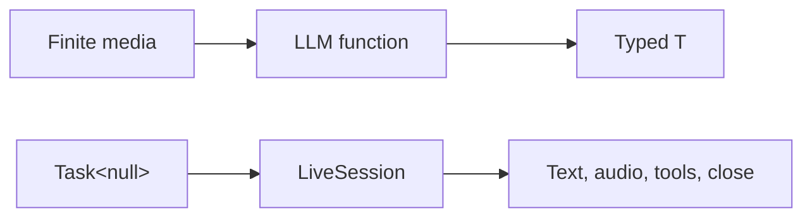

# Media and live sessions

Images, PDFs, and finite audio are ordinary typed inputs. An open realtime
interaction is different: it returns a live resource.

## Utilities used

| Utility | Purpose |
| --- | --- |
| `image`, `pdf`, `audio` | Typed media values |
| `ai.open_live` | Opens a raw provider session |
| `ai.run.VoiceAgent` | Owns a managed voice lifecycle |

## Example

```baml
class ImageDescription {
  summary: string,
  visible_text: string[],
}

function InspectImage(value: image) -> ImageDescription {
  provider: "openai/gpt-5.6-luna"
  prompt: `
    Describe this image and extract visible text.

    ${value}

    ${ctx.output_format}
  `
}

let description = InspectImage(receipt_image)
```

A finite media value fits a normal typed call. A realtime conversation does
not have one intrinsic final `T`, so it uses a `Task<null>` and returns events
through `LiveSession`.



## Continue

- [Images, PDFs, and audio](./media-and-live-sessions/images-pdfs-and-audio.md)
- [Bounded audio streams](./media-and-live-sessions/bounded-audio-streams.md)
- [Transcribe audio](./media-and-live-sessions/transcribe-audio.md)
- [Open a live session](./media-and-live-sessions/open-a-live-session.md)
- [Run a voice agent](./media-and-live-sessions/run-a-voice-agent.md)
- [Handle barge-in](./media-and-live-sessions/handle-barge-in.md)
- [Live-session tools](./media-and-live-sessions/live-session-tools.md)
