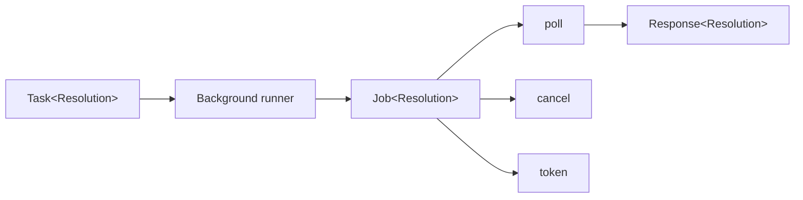

# Production resources

Background jobs, batches, caches, and sessions outlive one ordinary function
call. They return resources with explicit controls and cleanup.

## Utilities used

| Utility | Purpose |
| --- | --- |
| `ai.run.Background` | Submits a task for remote work |
| `ai.Job<T>` | Polls, cancels, and resumes deferred work |
| `close()` | Releases the local job handle deterministically |
| `cleanup()` | GC fallback for an abandoned handle |

## Example

```baml
class Resolution {
  reply: string,
}

function DeepResolveTicket(message: string) -> Resolution {
  provider: BackgroundModel
  prompt: `
    Carefully investigate and resolve this support ticket.

    ${message}

    ${ctx.output_format}
  `
}

function submit_deep_resolution(
  message: string,
) -> ai.Job<Resolution> {
  DeepResolveTicket
    .task(message)
    .run(
      runner = ai.run.Background.new(
        idempotency_key = "ticket-1042:deep-resolution",
      ),
    )
}
```

The job owns provider coordinates and polling state. The task remains the
description submitted to it. Because this function returns the job, ownership
passes to its caller; it must not defer cleanup before returning.



## Continue

- [Poll, cancel, and resume a job](./production-resources/poll-cancel-and-resume-a-job.md)
- [Submit a batch](./production-resources/submit-a-batch.md)
- [Provider-managed caches](./production-resources/provider-managed-caches.md)
- [Cleanup and defer](./production-resources/cleanup-and-defer.md)
- [Deployment and transports](./production-resources/deployment-and-transports.md)
- [Capability negotiation](./production-resources/capability-negotiation.md)
