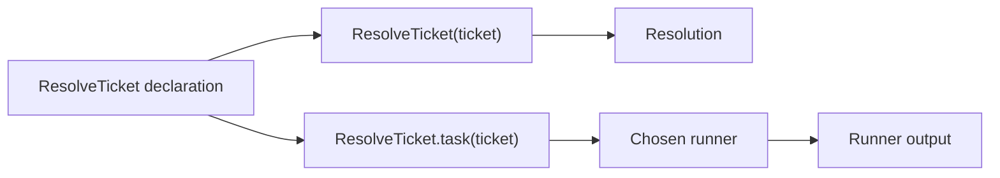

# Tasks and runners

An LLM function may run immediately, or it may become a task that another
piece of code runs later.

## Utilities used

| Utility | Purpose |
| --- | --- |
| `Name.task(...)` | Creates an LLM function call without executing it |
| `Task<T, P>` | Keeps the result type and selected provider type |
| `ai.run.CompletionWithMeta` | Runs bounded completion and keeps metadata |

## Start with a normal call

```baml
class Ticket {
  id: string,
  message: string,
}

class Resolution {
  reply: string,
  resolved: bool,
}

function ResolveTicket(ticket: Ticket) -> Resolution {
  provider: "openai/gpt-5.6-luna"
  prompt: `
    Resolve this support ticket.

    ${ticket}

    ${ctx.output_format}
  `
}

let resolution: Resolution = ResolveTicket(ticket)
```

The direct call is the normal application API. It returns `Resolution` or
throws.

Create a task when the application wants to choose the lifecycle:

```baml
let task = ResolveTicket.task(ticket)

let response: ai.Response<Resolution> = task.run(
  runner = ai.run.CompletionWithMeta.new(),
)
```

Creating `task` performs no network I/O.



## What a task remembers

| Part | Example |
| --- | --- |
| Function identity | `ResolveTicket` |
| Arguments | `ticket` |
| Return type | `Resolution` |
| Selected provider | `openai/gpt-5.6-luna` |
| Prompt recipe | The function's `prompt:` block |
| Application tools | The function's `tools:` block, when present |

The result and provider are both part of the task's type:

```baml
Task<Resolution, OpenAi>
```

This lets a runner preserve `Resolution` while statically asking for a
capability supported by `OpenAi`.

## Common runner outputs

| Runner | Output |
| --- | --- |
| `Completion` | `T` |
| `CompletionWithMeta` | `Response<T>` |
| `Generation` | `T` after exactly one model interaction |
| `Stream` | `Stream<TPartial, T>` |
| `Agent` | `AgentOutcome<T>` |
| `Background` | `Job<T>` |

The LLM function still owns `T`. The runner decides how `T` becomes
observable.

## Continue

- [Task values](./tasks-and-runners/task-values.md)
- [Completion and generation](./tasks-and-runners/completion-and-generation.md)
- [Response metadata](./tasks-and-runners/response-metadata.md)
- [Streaming a task](./tasks-and-runners/streaming-a-task.md)
- [Provider configuration](./tasks-and-runners/provider-configuration.md)
- [Provider overrides](./tasks-and-runners/provider-overrides.md)
- [Provider capabilities](./tasks-and-runners/provider-capabilities.md)
- [Write a custom runner](./tasks-and-runners/custom-runner.md)
