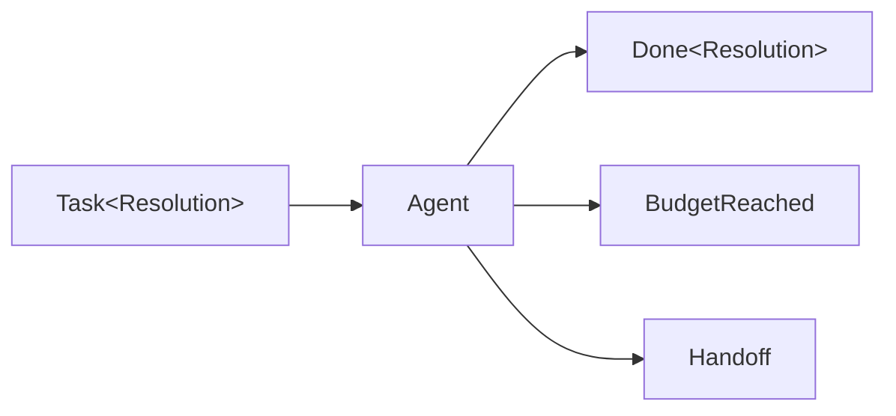

# Tools and agents

Application tools are ordinary BAML functions. Put the default roster on the
LLM function, then choose the Agent runner when the application wants every
terminal outcome.

## Utilities used

| Utility | Purpose |
| --- | --- |
| `tools:` | Declares default application tools |
| `ai.run.Agent` | Runs the application-managed tool loop |
| `ai.AgentOutcome<T>` | Describes how the Agent finished |

## Example

```baml
class Resolution {
  reply: string,
  resolved: bool,
}

/// Look up an order.
function lookup_order(order_id: string) -> string {
  "Order is out for delivery."
}

/// Search support policy.
function search_policy(query: string) -> string {
  "Replace an order only after seven days without movement."
}

function ResolveTicket(message: string) -> Resolution {
  provider: "openai/gpt-5.6-luna"
  prompt: `
    Resolve this support ticket.

    ${message}

    ${ctx.output_format}
  `
  tools: [lookup_order, search_policy]
}

let outcome: ai.AgentOutcome<Resolution> = ResolveTicket
  .task("Where is order order-42?")
  .run(
    runner = ai.run.Agent.new(),
  )
```

```console
[INFO] called tool: lookup_order("order-42")
[INFO] tool returned: "Order is out for delivery."
[INFO] ResolveTicket returned: Resolution {
  reply: "It is on the way.",
  resolved: true,
}
```

The model receives tool schemas. BAML retains and executes the real functions.

## Agent outcomes



Use a direct call when only `Resolution` matters:

```baml
let resolution = ResolveTicket("Where is order order-42?")
```

Use the explicit Agent when stopping and handoff are normal control flow.

## Continue

- [The Agent runner](./tools-and-agents/agent-runner.md)
- [Multiple and parallel tools](./tools-and-agents/multiple-and-parallel-tools.md)
- [Tool errors and invalid arguments](./tools-and-agents/tool-errors-and-invalid-arguments.md)
- [Hooks and approvals](./tools-and-agents/hooks-and-approvals.md)
- [Modify or block tool calls](./tools-and-agents/modify-or-block-tool-calls.md)
- [Dynamic tool registry](./tools-and-agents/dynamic-tool-registry.md)
- [Discover MCP tools](./tools-and-agents/discover-mcp-tools.md)
- [Handoffs and limits](./tools-and-agents/handoffs-and-budgets.md)
- [Remove or replace tools](./tools-and-agents/remove-or-replace-tools.md)
- [Provider-owned tools](./tools-and-agents/provider-owned-tools.md)
