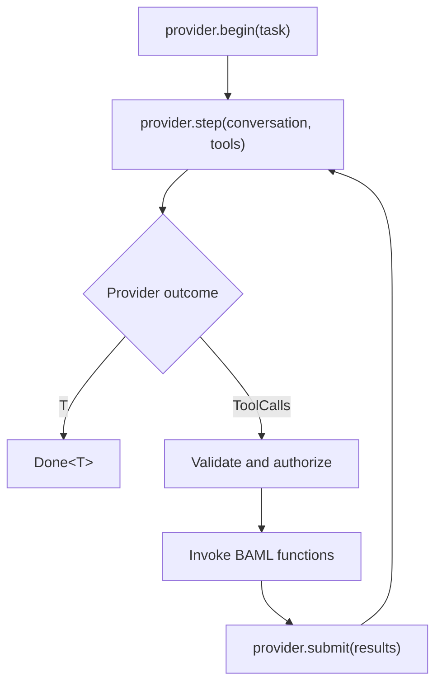

# The Agent runner

The Agent runner owns an application tool loop and returns
`AgentOutcome<T>`.

## Utilities used

| Utility | Purpose |
| --- | --- |
| `ai.run.Agent` | Runs provider turns and application tools |
| `ai.Done<T>` | Final typed value |
| `ai.BudgetReached` | Resumable stop |
| `ai.Handoff` | Application takeover |

## Example

```baml
class Resolution {
  reply: string,
  resolved: bool,
}

function lookup_order(order_id: string) -> string {
  "Order is out for delivery."
}

function ResolveTicket(message: string) -> Resolution {
  provider: "openai/gpt-5.6-luna"
  prompt: `
    Resolve this support ticket.

    ${message}

    ${ctx.output_format}
  `
  tools: [lookup_order]
}

let outcome = ResolveTicket.task("Where is order order-42?").run(
  runner = ai.run.Agent.new(),
);

match (outcome) {
  let done: ai.Done<Resolution> => log.info(done.value),
  let stopped: ai.BudgetReached => queue_for_review(stopped.conversation),
  let handoff: ai.Handoff => transfer_to_human(handoff),
}
```

## The loop



The provider owns wire turns and exact conversation state. The Agent owns
application dispatch, limits, hooks, observers, and termination.

## Configuration

Common settings come first:

| Setting | Default | Meaning |
| --- | --- | --- |
| `tools` | Inherit task tools | Override the application roster |
| `max_steps` | Provider or library limit | Maximum provider steps |
| `max_cost_usd` | No additional limit | Maximum reported cost |
| `conversation` | Start new | Resume exact provider state |

Advanced settings are optional:

| Setting | Meaning |
| --- | --- |
| `tool_registry` | Authoritative mutable roster for dynamic runs |
| `hooks` | Execution decisions and approvals |
| `observers` | Read-only event listeners |
| `recorders` | Persistent event sinks |
| `state` | Application state visible to hooks |
| `run_id` | Application-supplied run identity |

The factory uses normal default arguments and returns a fully initialized
runner. BAML class fields do not have defaults, so the factory supplies every
field when it constructs the value.

For ordinary runs, `tools` is either the task roster or its replacement. When
`tool_registry` is supplied, that registry is the authoritative roster and
`tools` must remain `null`. This avoids two configuration values competing to
own the same names.

## Invariants

- Every provider tool call receives exactly one correlated result.
- Unknown, invalid, and blocked calls become tool results when repair is
  possible.
- Application functions never cross the provider boundary.
- A provider switch imports portable messages explicitly.
- Limits are checked between provider steps.
- `Done<T>` preserves both `T` and the final `Conversation`.

[Back to tools and agents](../tools-and-agents.md)
