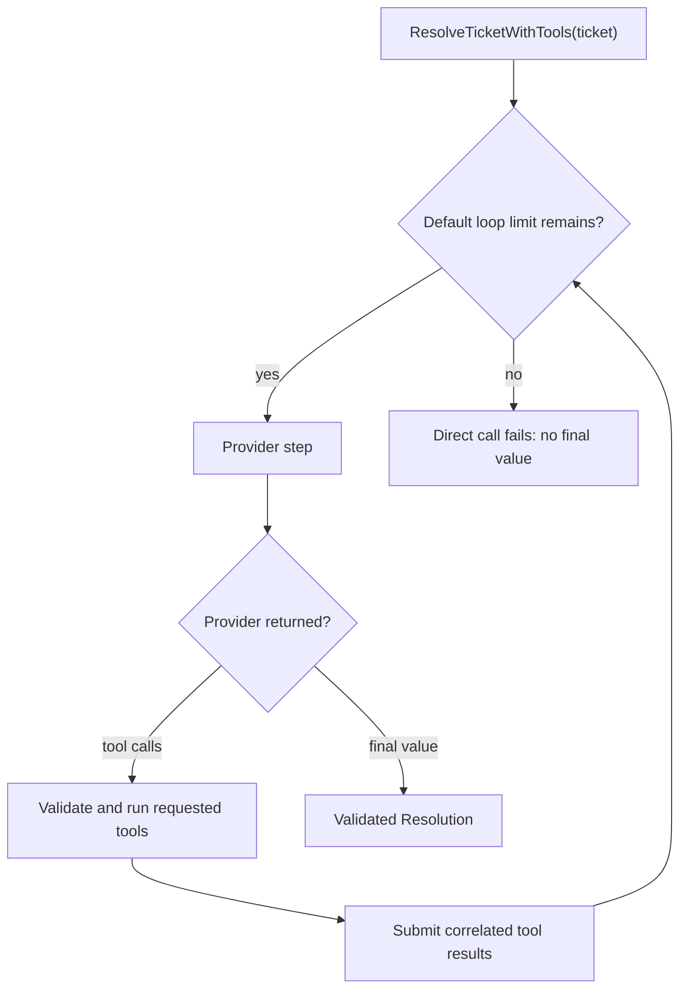
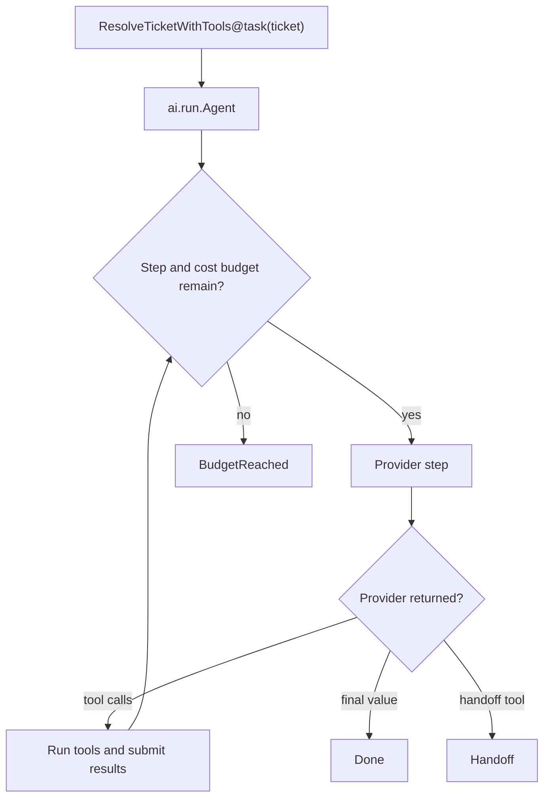

# BEP-064: AI Functions and Agents

BAML lets an LLM function use ordinary BAML functions as tools. Start with a
typed function, add the tools it may call, and call it like any other
function.

## An agent in one minute

```baml
class SupportTicket {
  id: string,
  subject: string,
  body: string,
  customer_tier: string,
}

enum TicketPriority {
  Low
  Normal
  Urgent
}

class Resolution {
  category: string,
  priority: TicketPriority,
  summary: string,
  reply: string,
}

/// Search the support knowledge base.
function search_knowledge(query: string) -> json throws never {
  { "query": query, "article": "Duplicate charges are normally pending authorizations." }
}

/// Look up a customer account.
function lookup_account(customer_id: string) -> json throws never {
  { "customer_id": customer_id, "status": "active", "tier": "pro" }
}

function ResolveTicketWithTools(ticket: SupportTicket) -> Resolution {
  provider: "openai-responses/gpt-5.6-luna"

  prompt: `
    Resolve ticket ${ticket.id}. Use the available tools before answering.

    Subject: ${ticket.subject}
    Body: ${ticket.body}

    ${ctx.output_format}
  `

  tools: [
    search_knowledge,
    lookup_account,
  ]
}


// call it here!
let ticket = SupportTicket {
  id: "T-100",
  subject: "Charged twice",
  body: "I see two charges for order O-42.",
  customer_tier: "pro",
};

let resolution: Resolution = ResolveTicketWithTools(ticket)
```

### What happens



Tools belong to the function: they are part of the model-facing contract the
prompt describes, and the list accepts ordinary BAML functions, methods, and
closures (anything callable). How they reach the model is the provider
adapter's decision — native function-calling when the wire supports it, a
prompt-rendered tool protocol otherwise — so the same function works on
providers without native tool support. The plain completion path executes
requested tools within the provider's bounded default lifecycle and returns
the final `T` or fails. Choose `ai.run.Agent` when the application must control
the loop or receive explicit `Done`, `BudgetReached`, or `Handoff` outcomes.
Choose `ai.run.Generation` when exactly one model interaction is required.

That is the common path. BAML sends the prompt, runs any requested tools, and
returns the declared `Resolution`.

### Illustrative output

These lines show the shape of a run; they are not captured output:

```console
[INFO] called tool: search_knowledge("duplicate charge")
[INFO] called tool: lookup_account("C-42")
[INFO] ResolveTicketWithTools returned Resolution { category: "billing", ... }
```

The return type is also the model's output schema. A tool's signature is also
its input schema. You do not need to describe either one again.

## Use a runner when the lifecycle matters

The normal call returns `T`. Create a task when you need to choose how the
same call runs:

```baml
let outcome = ResolveTicketWithTools@task(ticket).run(
  runner = ai.run.Agent<Resolution>.new(
    budget = ai.Budget { max_steps: 8, max_cost_usd: null },
  ),
)
```

### What happens



### Illustrative output

```console
[INFO] Agent started: ResolveTicketWithTools
[INFO] step 1: provider requested search_knowledge
[INFO] Agent finished: Done<Resolution>
```

The task still represents `ResolveTicketWithTools(ticket)`. The runner only changes
the lifecycle and the result you receive. For example, another runner can
stream the result, submit background work, preserve response metadata, or
send the task to a coding harness.

## If you have used the Vercel AI SDK

The ideas are similar. BAML keeps the model-facing contract — signature,
prompt, output type, default tools — in one typed LLM function; lifecycle
concerns (streaming, tool loops, retry, background work) live in reusable
runners rather than in the function itself.

| Goal | BAML | Vercel AI SDK |
| --- | --- | --- |
| Structured output | `function F(...) -> T` | `Output.object({ schema })` |
| Add a local tool | Put an ordinary function in `tools: [...]` | Define `tool({ inputSchema, execute })` |
| Run a tool loop | Call `F(...)` or use `ai.run.Agent` | Configure `ToolLoopAgent` and call `.generate(...)` |
| Stream instead | Run the same task with `ai.run.Stream` | Call `.stream(...)` or `streamText(...)` |
| Extend the system | Implement `Runner` or a provider capability | Implement the `Agent` interface or wrap a model |

This is a map between concepts, not a compatibility layer. The comparison
uses the current [Vercel AI SDK agent](https://ai-sdk.dev/docs/reference/ai-sdk-core/tool-loop-agent)
and [structured output](https://ai-sdk.dev/docs/reference/ai-sdk-core/output)
APIs.

## The AI toolbox at a glance

You do not need all of this to start. The comments show when each part becomes
useful. `ai` holds portable contracts and orchestration. Provider namespaces
hold provider configuration, wire behavior, and provider-owned resources.

Flat `ai` is the first afternoon's surface; capability-specific machinery
lives one namespace down (`baml describe ai.tools` etc. lists each).

```text
ai                             // CORE — what every program touches
├── Task<T>                    // one LLM function call that has not run yet
├── ResponseWithMetadata<T>    // typed value plus ResponseMetadata and Usage
├── Conversation               // exact state for continuing an agent
├── MessageHistory             // editable, portable messages
├── Failure, Effects           // the error channel (+ default errors)
├── retry(...), fallback(...)  // provider wrappers for reliability
├── Done, BudgetReached, Handoff, Budget // agent outcomes and limits
│
├── Provider                   // how BAML communicates with a model or AI service
├── CompletionProvider         // return one bounded typed result
├── GenerationProvider         // perform exactly one model interaction
├── StreamingProvider          // stream partials and a final typed result
│
├── run                        // how a typed task proceeds; usually runner = ...
│   ├── Agent                  // task.run(runner = ...): run application tools
│   │   ├── prepare_step       // change provider, tools, or stop before a step
│   │   ├── before_tool_call   // allow, replace, or block a proposed call
│   │   ├── after_tool_call    // inspect each completed application tool
│   │   └── on_event           // lightweight callback for run events
│   ├── CompletionWithMeta     // return ResponseWithMetadata<T> (value + metadata)
│   ├── Stream                 // return partials, then final T
│   ├── Background, Batch      // return remote work handles
│   ├── Transcribe, TranscribeWithMeta // finite audio to text
│   ├── VoiceAgent             // managed realtime voice loop
│   └── Harness                // coding agents; on_event observes live progress
│
├── tools                      // tool machinery (ToolCallingProvider lives here)
│   ├── tool(...)              // add policy/metadata to an ordinary function tool
│   ├── ToolRegistry           // change the roster between agent steps
│   ├── ToolCall, ToolResult   // correlated tool calls and results
│   ├── BeforeToolCall, AfterToolCall // payloads for the agent's tool hooks
│   └── tool_from_json_schema  // wrap discovered (e.g. MCP) remote tools
├── realtime                   // Channel, LiveSession, open_live(...), RealtimeProvider
├── transcription              // transcription protocol and audio streams
├── sessions                   // provider-owned session continuations
├── jobs                       // Job, Batch: poll/cancel handles
├── observe                    // observers, run events, usage accounting
├── harness                    // HarnessSession: steer, interrupt, save, resume
├── messages                   // message parts and prompt adapters (internals)
├── testing                    // FakeProvider and friends — deterministic doubles
│
openai
├── Responses                  // typed calls, tool calling, and background jobs
└── Realtime                   // OpenAI Realtime sessions and configuration
    └── internal               // wire models and provider-owned continuation state

anthropic
├── Messages                   // Anthropic Messages configuration
├── OutputMode, ToolMode       // strict/SAP output and native/prompt tools
└── internal                   // Messages wire state and schema helpers

google
├── vertex
│   └── Gemini                 // Gemini on Vertex AI, using ADC/OAuth or API key
├── ai
│   └── Gemini                 // Gemini API / Google AI configuration
├── internal                   // shared Gemini wire and schema helpers
└── Cache, CreateCache         // named caches (Gemini-only; plumbed automatically)

claude_code
└── ClaudeCodeCli              // local Claude Code harness adapter
```

Provider values such as `openai.Responses`, `anthropic.Messages`,
`google.vertex.Gemini`, and `google.ai.Gemini` keep model, authentication,
endpoint, wire behavior, and provider-specific options together. They
implement small interfaces from `ai`, so an incompatible runner can fail at
type-check time without making provider internals part of the portable API.
Every provider supplies its own prompt-rendering shorthand; `ai` does not
silently choose a model vendor.

A provider owns communication: authentication, wire behavior, parsing, and
provider-owned state (server-side conversation continuations, uploaded files,
provider-managed caches, live session handles). A runner owns the reusable
lifecycle of a typed task:
completion, streaming, tool loops, retry, background work, or a harness.
Changing only a model or base URL usually creates another provider value, not
another provider type. The [tasks and runners guide](./pages/tasks-runners-and-results.md)
includes the full decision rule.

## Pick the guide that matches your job

There are twelve focused guides. Each one starts with a complete LLM
function and keeps nearby variations on the same page.

| I want to... | Read |
| --- | --- |
| Give an LLM ordinary BAML tools | [Agents and tools](./pages/agents-and-tools.md) |
| Choose a runner, add a provider, or keep metadata | [Tasks, runners, and results](./pages/tasks-runners-and-results.md) |
| Add tools during a run or connect MCP | [Dynamic tools and MCP](./pages/dynamic-tools-and-mcp.md) |
| Understand OpenAI schemas, result tools, or parallel calls | [OpenAI structured outputs and tool calling](./pages/structured-outputs-and-tool-calling.md) |
| Approve effects, set limits, or hand off | [Approvals, limits, and handoffs](./pages/approvals-limits-and-handoffs.md) |
| Continue or move a conversation | [Conversations and resuming](./pages/conversations-and-resuming.md) |
| Stream typed output or work with media | [Streaming, media, and transcription](./pages/streaming-media-and-transcription.md) |
| Route, retry, or fall back safely | [Routing, retry, and fallback](./pages/routing-retry-and-fallback.md) |
| Run remote work or reuse cached context | [Jobs, batches, and caches](./pages/jobs-batches-and-caches.md) |
| Build a realtime voice experience | [Voice and live sessions](./pages/voice-and-live-sessions.md) |
| Test deterministically and inspect runs | [Testing and observability](./pages/testing-and-observability.md) |
| Use a coding harness or add your own runner | [Harnesses and custom extensions](./pages/harnesses-and-custom-extensions.md) |

BAML can support more lifecycles than these examples show. The important
pattern stays small: an LLM function describes the typed job, a task holds one
unexecuted call, and a runner decides how it runs.
