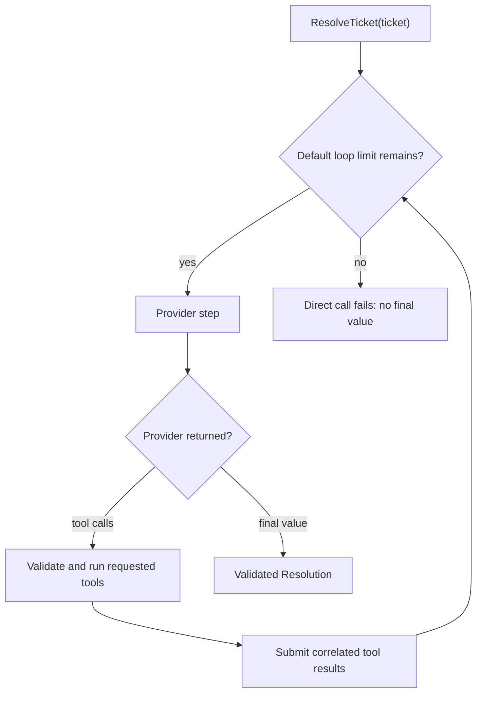
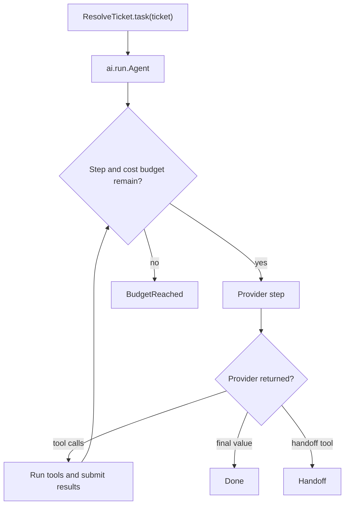

# BEP-064: AI Functions and Agents

BAML lets an LLM function use ordinary BAML functions as tools. Start with a
typed function, add the tools it may call, and call it like any other
function.

## An agent in one minute

```baml
class Ticket {
  id: string,
  message: string,
}

class Resolution {
  reply: string,
  resolved: bool,
}

/// Look up the latest status of an order.
function lookup_order(order_id: string) -> string {
  "Order is out for delivery."
}

/// Search the support policy documents.
function search_policy(query: string) -> string {
  "Orders may be replaced after seven days without movement."
}

function ResolveTicket(ticket: Ticket) -> Resolution {
  provider: "openai/gpt-5.6-luna"

  prompt: `
    Help the customer with this support ticket.

    Use the available tools when you need more information.

    ${ticket}

    ${ctx.output_format}
  `

  tools: [
    lookup_order,
    search_policy,
  ]
}


// call it here!
let resolution: Resolution = ResolveTicket(ticket)
```

### What happens



That is the common path. BAML sends the prompt, runs any requested tools, and
returns the declared `Resolution`.

### Illustrative output

These lines show the shape of a run; they are not captured output:

```console
[INFO] called tool: lookup_order("order-42")
[INFO] called tool: search_policy("out for delivery")
[INFO] ResolveTicket returned Resolution { resolved: true, ... }
```

The return type is also the model's output schema. A tool's signature is also
its input schema. You do not need to describe either one again.

## Use a runner when the lifecycle matters

The normal call returns `T`. Create a task when you need to choose how the
same call runs:

```baml
let outcome = ResolveTicket.task(ticket).run(
  runner = ai.run.Agent.new(
    max_steps = 8,
  ),
)
```

### What happens



### Illustrative output

```console
[INFO] Agent started: ResolveTicket
[INFO] step 1: provider requested lookup_order
[INFO] Agent finished: Done<Resolution>
```

The task still represents `ResolveTicket(ticket)`. The runner only changes
the lifecycle and the result you receive. For example, another runner can
stream the result, submit background work, preserve response metadata, or
send the task to a coding harness.

## If you have used the Vercel AI SDK

The ideas are similar. BAML keeps the model-facing contract in one typed LLM
function and lets runners reuse it.

| Goal | BAML | Vercel AI SDK |
| --- | --- | --- |
| Structured output | `function F(...) -> T` | `Output.object({ schema })` |
| Add a local tool | Put an ordinary function in `tools: [...]` | Define `tool({ inputSchema, execute })` |
| Run a tool loop | Call `F(...)` or use `ai.run.Agent` | Configure `ToolLoopAgent` and call `.generate(...)` |
| Stream instead | Run the same task with `ai.run.Stream` | Call `.stream(...)` or `streamText(...)` |
| Extend the system | Implement `Runner` or a provider capability | Implement the `Agent` interface or wrap a model |

This is a map between concepts, not a compatibility layer. The comparison
uses the current [Vercel AI SDK agent](https://ai-sdk.dev/docs/reference/ai-sdk-core/tool-loop-agent)
and [structured output](https://ai-sdk.dev/docs/reference/ai-sdk-core/output)
APIs.

## The AI toolbox at a glance

You do not need all of this to start. The comments show when each part becomes
useful. `ai` holds portable contracts and orchestration. Provider namespaces
hold provider configuration, wire behavior, and provider-owned resources.

```text
ai
├── Task<T, P>                 // one LLM function call that has not run yet
├── Response<T>, Meta, Usage   // typed value plus provider details
├── Conversation              // exact state for continuing an agent
├── MessageHistory            // editable, portable messages
│
├── Provider                  // how BAML communicates with a model or AI service
├── CompletionProvider        // return one bounded typed result
├── GenerationProvider        // perform exactly one model interaction
├── StreamingProvider         // stream partials and a final typed result
├── ToolCallingProvider       // participate in an application-managed tool loop
├── RealtimeProvider          // open a provider-owned live session
     ......
│
├── run                       // how a typed task proceeds; usually runner = ...
│   ├── Agent                 // task.run(runner = ...): run application tools
│   │   ├── prepare_step      // change provider, tools, or stop before a step
│   │   ├── before_tool_call  // allow, replace, or block a proposed call
│   │   ├── after_tool_call   // inspect each completed application tool
│   │   └── on_event          // lightweight callback for run events
│   ├── CompletionWithMeta    // return Response<T> (contains metadata + output)
│   ├── Stream                // return partials, then final T
│   ├── Retry, Fallback       // wrap another runner
│   ├── Background, Batch     // return remote work resources
│   ├── Transcribe, TranscribeWithMeta // finite audio to text
│   ├── VoiceAgent            // managed realtime voice loop
│   └── Harness                // coding agents; on_event observes live progress
│
├── tools
│   ├── tool(...)             // add policy to an ordinary function tool
│   ├── ToolRegistry          // change the roster between agent steps
│   └── AgentObserver         // watch events without changing the run
│
├── resources
│   ├── Job, Batch, Cache     // remote work with poll/cancel/delete
│   ├── BatchQueue            // mixed task types with typed item handles
│   ├── LiveSession           // raw bidirectional provider session
│   ├── HarnessSession        // steer, interrupt, save, or resume a harness
│   ├── open_live(...)        // open a raw live provider session
│   ├── create_cache(...)     // create reusable provider context
│   └── mcp.connect(...)      // discover remote tools
│
openai
├── Chat                       // ordinary typed calls, streams, and tool calling
├── Responses                  // durable OpenAI Responses background jobs
├── Realtime                   // OpenAI Realtime sessions and configuration
├── RealtimeSession            // provider-owned live WebSocket state
├── AudioTranscription         // finite audio transcription adapter
└── Conversation               // exact OpenAI chat/tool state

anthropic
└── Messages                   // Anthropic model and transport configuration

google
└── Gemini                     // Gemini configuration and managed caches

claude_code
└── ClaudeCodeCli              // local Claude Code harness adapter
```

Provider values such as `openai.Chat` and `anthropic.Messages` keep model,
authentication, endpoint, wire behavior, and provider-specific options
together. They implement small interfaces from `ai`, so an incompatible runner
can fail at type-check time without making provider internals part of the
portable API. Every provider supplies its own prompt-rendering shorthand; `ai`
does not silently choose a model vendor.

A provider owns communication: authentication, wire behavior, parsing, and
provider-owned state. A runner owns the reusable lifecycle of a typed task:
completion, streaming, tool loops, retry, background work, or a harness.
Changing only a model or base URL usually creates another provider value, not
another provider type. The [tasks and runners guide](./pages/tasks-runners-and-results.md)
includes the full decision rule.

## Pick the guide that matches your job

There are eleven focused guides. Each one starts with a complete LLM
function and keeps nearby variations on the same page.

| I want to... | Read |
| --- | --- |
| Give an LLM ordinary BAML tools | [Agents and tools](./pages/agents-and-tools.md) |
| Choose a runner, add a provider, or keep metadata | [Tasks, runners, and results](./pages/tasks-runners-and-results.md) |
| Add tools during a run or connect MCP | [Dynamic tools and MCP](./pages/dynamic-tools-and-mcp.md) |
| Approve effects, set limits, or hand off | [Approvals, limits, and handoffs](./pages/approvals-limits-and-handoffs.md) |
| Continue or move a conversation | [Conversations and resuming](./pages/conversations-and-resuming.md) |
| Stream typed output or work with media | [Streaming, media, and transcription](./pages/streaming-media-and-transcription.md) |
| Route, retry, or fall back safely | [Routing, retry, and fallback](./pages/routing-retry-and-fallback.md) |
| Run remote work or reuse cached context | [Jobs, batches, and caches](./pages/jobs-batches-and-caches.md) |
| Build a realtime voice experience | [Voice and live sessions](./pages/voice-and-live-sessions.md) |
| Test deterministically and inspect runs | [Testing and observability](./pages/testing-and-observability.md) |
| Use a coding harness or add your own runner | [Harnesses and custom extensions](./pages/harnesses-and-custom-extensions.md) |

BAML can support more lifecycles than these examples show. The important
pattern stays small: an LLM function describes the typed job, a task holds one
unexecuted call, and a runner decides how it runs.
