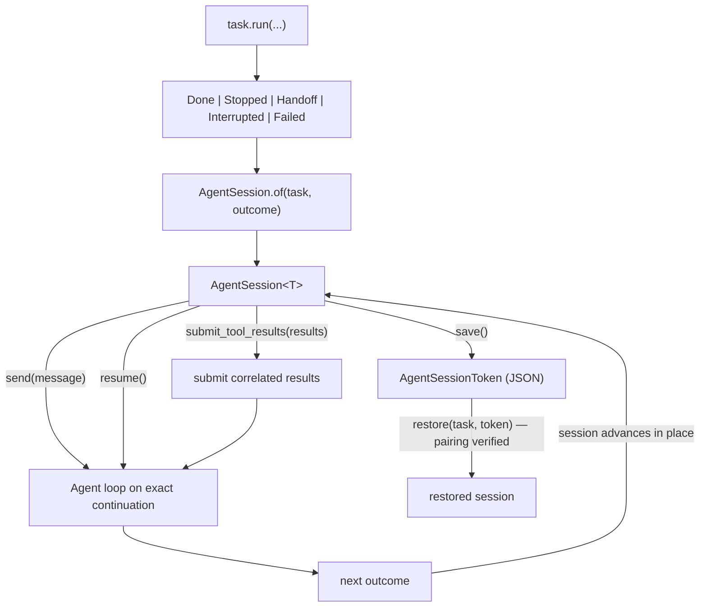

# Agent sessions

An LLM function makes a simple promise: call it with typed arguments, get a
typed `T` back. One call, one value.

Agents stretch that promise across time. The value you want still has type
`T`, but producing it now spans model steps, tool calls, user turns,
interruptions, and sometimes process restarts. `ai.run.AgentSession<T>` is
the value you hold between those moments.

## The problem: an agent outlives its call

Multi-turn agent state has two halves with different owners:

| Half | Contents | Owner |
| --- | --- | --- |
| Conversation | Wire IDs, thinking signatures, server-side response state | The provider, as an opaque `ai.Conversation` |
| Contract | Output type `T`, tool roster, prompt, task identity | Your code, as an `ai.Task<T>` |

Every continuation needs both halves, and they must be the *same* pairing
that started the conversation. Without a session, applications carry the two
halves in separate variables and re-pair them by hand on every turn. That
convention fails in ways the compiler never sees:

- **Silent intent.** "Resume the unfinished turn" and "start a new turn"
  differ only in whether you remembered to append a message before running.
  Forgetting to append, or appending twice, produces a wrong conversation
  with no error.
- **Unchecked pairing.** Nothing stops you from running a conversation
  against the wrong task, the wrong tool roster, or a different output type.
  The mistake surfaces later, as a fingerprint mismatch or as odd model
  behavior — not at the line that caused it.
- **Pretend fresh runs.** Continuing meant re-rendering a full
  `MyFn@task(...)` whose prompt and provider were then silently ignored,
  because the conversation already owned both.

A session closes all three gaps. It binds the two halves at construction,
names each continuation intent as a method, and re-verifies the pairing when
a saved session crosses a process boundary.

## How a session relates to the LLM function

The type parameter is the thread that connects everything. Your LLM function
declares `-> T`. Its task is `ai.Task<T>`. A completed turn is `ai.Done<T>`
with `value: T`. The session is `AgentSession<T>`, and
`session.complete(message)` hands `T` back. At every layer, the type you
asked for is the type you hold — the session just carries that promise
between turns.

## Utilities used

| Utility | What it does |
| --- | --- |
| `ai.run.AgentSession<T>` | Pairs a task with its exact provider conversation |
| `AgentSession.start(task)` | Opens a session at turn zero — no model request; turn one and turn N are the same code path |
| `AgentSession.of(task, outcome)` | Builds a session from any Agent outcome (sugar over `from`) |
| `AgentSession.from(task, source)` | One constructor for both poles: an exact `Conversation` or portable `Messages` |
| `session.send(message)` | New turn: reports whatever happened (outcome union); a plain string, one message, or a batch |
| `session.complete(message)` | New turn: demands the finished `T` or throws `ai.IncompleteRun` |
| `session.resume()` | Continues an unfinished turn without adding a message |
| `session.submit_tool_results(results)` | Answers a handoff with exactly-once correlation, then continues |
| `session.steer(note)` | Injects a mid-conversation instruction (not from the end user); local, rides into the next continuation |
| `session.phase()` | What the model is waiting for: `AwaitingMessage \| AwaitingToolResults { calls } \| Unreported` |
| `session.turns()` / `session.last_turn()` | The turn-structured transcript: `ai.run.Turn[]` with per-turn messages, usage, and metadata |
| `session.fork()` | An independent branch, copied through the provider's save/restore capability |
| `session.export()` / the `Messages` arm of `from` | The visible crossings between exact and portable state |
| `session.move_to(provider)` | Export → import in one call; non-destructive |
| `session.save()` / `AgentSession.restore(task, token)` | Durable checkpoint and structurally-verified re-pairing |
| `task.complete(runner?)` | One-shot: direct-call semantics with configuration |

## Start a session

Open a session at turn zero and send the first user turn:

```baml
let session = ai.run.AgentSession<Resolution>.start(ResolveTicket@task(sample_ticket()));
let outcome = session.send("My invoice shows a duplicate charge.");
```

`start` makes no model request: the provider's `begin` renders the task's
prompt into a fresh conversation, and turn one is then the same
`session.send(...)` call as turn fifty. For conversational use, the task's
prompt IS the instructions — inject documents or context through the task's
arguments at this first render, and send everything dynamic afterwards as
messages.

When you already hold an outcome — from an explicit `task.run` — pair it
with the task that produced it via the `of` sugar:

```baml
let task = ResolveTicket@task(sample_ticket());
let outcome = task.run(runner = ai.run.Agent<Resolution>.new());
let session = ai.run.AgentSession<Resolution>.of(task, outcome);
```

Any outcome starts a session — a completed turn, a policy stop, a handoff,
an interruption, or an involuntary `Failed` stop are all valid session
states; `session.phase()` tells you which continuation makes sense next.
Continuation state from anywhere else enters through the one constructor
`AgentSession.from(task, source)`, with the same pairing checks: pass an
exact `Conversation` (a provider-level restore, hand-driven protocol steps)
to use it as-is, or a portable `ai.Messages` history to reconstruct through
the provider's `ConversationImportProvider` capability — possibly lossy;
use the provider-level `import_messages` directly when the fidelity report
matters.

A session's fields are private (`_task`, `_conversation`, `_busy`) — read
them through `session.task()` and `session.conversation()`. The
construction-time invariants only hold when sessions are built through
`start`/`of`/`from`/`restore`; writing a literal with the underscore fields
bypasses those checks and should read as deliberate internal access.

## Continue with a new message

`send` declares the intent "begin a new application turn." It appends the
message to the exact provider continuation, runs the loop, and advances
the session in place. The task's prompt is not re-rendered; the conversation
already contains it.

```baml
let outcome = session.send("Add a rest day in Kyoto.");
// session now points at the advanced conversation — keep using it

// A drained queue can be one turn: send accepts a batch
let outcome = session.send([
    ai.ChatMessage.user("Also add Nara."),
    ai.ChatMessage.user("And keep the budget under $3k."),
]);
```

`send` and `complete` accept `string | ai.Message | ai.Message[]`. The plain
string is the everyday call — it desugars to one `ai.ChatMessage.user`
message. Reach for an explicit `ai.Message` when the turn carries media
parts, or a batch when several queued messages should enter as one turn.

`send` refuses a conversation with unanswered tool calls — that state is a
handoff, and the error says so: call `submit_tool_results`. One session
runs one continuation at a time; a concurrent second call fails immediately
with `ai.run.SessionBusy` instead of racing.

There is no successor object to thread: one session per line of
conversation, continued turn after turn. Inspect `outcome` for what happened
this turn; the session is already positioned for the next one.

When a stop would be exceptional rather than expected, demand the finished
value with `complete`:

```baml
let revised: Resolution = session.complete("Add a rest day.");
```

If the turn stops early, `complete` throws `ai.IncompleteRun`. The
conversion is lossless: the error carries the actual `Stopped |
Handoff | Interrupted` outcome, and the session has still advanced to that
committed checkpoint — so a catch site can inspect the cause and `resume`
or `submit_tool_results` on the same session. `Done` is unrepresentable in
that field; the type proves the unwrap cannot misfire. Match on `send`'s
outcome union when stops are normal control flow; `complete` when they are
not. The same pair exists for one-shots: `task.run(runner)` reports, and
`task.complete(runner?)` demands — direct-call semantics with
configuration. `ai.IncompleteRun` is its own term in the `throws` union,
not an `ai.Failure` — a generic failure catch arm never absorbs a resumable
stop by accident.

## When the run itself fails: the `Failed` outcome

A provider fault after the turn has made progress — the entry append
committed, or at least one model step completed — does not throw. It
returns `ai.Failed { cause, conversation, steps_taken, usage }`: the last
committed state with the classified failure inside. The session has
advanced to that state, so recovery is the same verb as every other stop:

```baml
match (session.send(msg)) {
    let failed: ai.Failed => {
        // transient? back off and continue from the committed boundary —
        // no re-appended message, no re-run tools
        session.resume()
    },
    // ...
}
```

A failure *before* any progress still throws — nothing was committed, so
the ordinary catch patterns and step-level `ai.retry` apply unchanged. The
invariant: **a continuation returns an outcome at a committed state, or
throws having changed nothing.**

## Resume an unfinished turn

`resume` declares the opposite intent: continue the *same* turn from its last
committed checkpoint, appending nothing. Use it after a policy stop or a
cooperative interruption:

```baml
match (outcome) {
    let interrupted: ai.Interrupted => {
        // The session already sits at the committed checkpoint.
        // Later — same process or, via save/restore, a different one:
        let continued = session.resume(
            runner = ai.run.Agent<Resolution>.new(max_steps = 60),
        );
    },
    // ...
}
```

## Answer a handoff

A `Handoff` outcome means the model called a tool that your application must
execute. `submit_tool_results` submits the correlated results and continues
the turn — providers require every pending call ID to receive exactly one
result before the conversation can advance:

```baml
let outcome = session.submit_tool_results([
    ai.tools.ToolOk.of(handoff.call, { "status": "booked" }),
]);
```

One question — *what is the model waiting for?* — selects the continuation
method:

| The model is waiting for… | Call |
| --- | --- |
| A new user message | `send` |
| Nothing — permission to continue an unfinished turn | `resume` |
| Correlated tool results for a handoff | `submit_tool_results` |

## Steer mid-conversation

`session.steer("...")` injects an instruction that is NOT from the end
user — a compaction summary, freshly fetched context, a policy change. It
is local: no model request happens; the note rides into the next `send` or
`resume`. Under the hood it appends `ai.ChatMessage.steer(note)`, a
`System`-role portable message that each adapter maps honestly onto its
wire — OpenAI renders a developer item, Anthropic and Gemini render tagged
user-role content:

```baml
session.steer("The customer is on the enterprise plan; do not offer refunds over $500.");
let outcome = session.send("Can I get this charge reversed?");
```

## Read the transcript as turns

`session.turns()` returns the turn-structured transcript — one
`ai.run.Turn { messages, usage, metadata }` per committed continuation,
derived from the conversation's portable history plus the per-turn
accounting the session records at each commit. `Turn.assistant_text()`
concatenates the assistant-role text, which is what a chat UI renders;
`session.last_turn()` is the most recent turn or null before the first one:

```baml
let outcome = session.send("Summarize where we are.");
match (session.last_turn()) {
    let turn: ai.run.Turn => {
        log.info(turn.assistant_text());
        log.info(turn.usage);
    },
    null => {},
}
```

The transcript is session-local: it covers turns advanced through THIS
session object, so a restored session starts with an empty transcript even
though its conversation carries the full history.

## Fork a conversation

Conversation state advances in place as a session continues, so exploring
two continuations from the same point requires forking first. The copy goes
through the provider's own save/restore capability — a provider-blessed
duplicate of opaque continuation state, never a raw memory copy — so
providers without `ResumableAgentProvider` cannot fork and say so with
`Unsupported`. Each fork is independent; neither branch can observe the
other:

```baml
let optimistic = session.fork();
let cautious = session.fork();
let sunny = optimistic.send("Assume sunny weather.");
let stormy = cautious.send("Assume typhoon season.");
// each fork advanced independently; `session` itself is untouched
```

This is the exact-state counterpart to forking an application-owned
`ai.MessageHistory`. Portable history forks survive provider switches but
give up exact continuation; session forks keep exact continuation but stay
with the conversation's provider. Both are legitimate — choose by which
property you need.

## Save and restore a session

A session has three pieces of state with three different owners, and only one
of them serializes:

| Piece | Owner | Across processes |
| --- | --- | --- |
| Conversation | Provider | Serialized by `ResumableAgentProvider` into a `ConversationToken` |
| Task | Your code | Re-supplied at restore time — tools are function values and do not serialize |
| Runner | Your code | Stateless policy; rebuild it |

`save` produces a small, JSON-serializable token that records the
provider's conversation token *plus* the task's package-qualified identity,
its output fingerprint, and its **structural contract fingerprint** —
output type, provider protocol, and the tool schemas the model can see:

```baml
let token = session.save();
baml.fs.write("session.json", baml.json.stringify(token));
```

`restore` is where the binding pays off. The application re-supplies the
task; the token verifies it is a **structurally compatible** task — same
identity, same output type, same tool contract — before any model request
happens. (Handler implementations are unprovable, which is the same reason
tasks don't serialize; the contract is what the model can observe.) A
mismatched task fails with a typed `SessionMismatch` at the restore line,
not as confusing model behavior three turns later:

```baml
let token = baml.json.from_string<ai.run.AgentSessionToken>(baml.fs.read("session.json"));
let session = ai.run.AgentSession<Resolution>.restore(ResolveTicket@task(sample_ticket()), token);
let outcome = session.resume(runner = ai.run.Agent<Resolution>.new());
```

Sessions exist only at committed outcome boundaries — the same checkpoints
cooperative cancellation uses — so every save point is a consistent,
resumable state. Providers that hold conversation state server-side produce
tiny tokens (an ID); providers that carry history serialize it fully. A
provider without `ResumableAgentProvider` fails `save` with
`baml.errors.Unsupported`.

### What happens



## What sessions do not change

Providers are untouched. They still implement `begin`, `step`, and `submit`,
plus the optional append and save/restore capabilities, and they never own
the loop. The runner is still pure policy — step limits, stop policy, tool
limits, observers — passed per call. `task.run` remains the execution
boundary for fresh runs; session methods are the declared-intent entry
points for continuations, and both drive the same Agent loop.

One glossary note, because three unrelated things say "session":
`ai.run.AgentSession<T>` is this page — the typed continuation handle for
multi-turn Agent work, and the only general-purpose session surface.
`ai.harness.HarnessSession` is an external coding/research harness's own
long-lived workspace (see [Harnesses and custom
extensions](harnesses-and-custom-extensions.md)). A realtime session in
`ai.realtime` is a live audio/event connection (see [Voice and live
sessions](voice-and-live-sessions.md)). None of them share state or
methods.

Runnable examples:

```console
baml run --from crates/baml_tests/baml_src_temp2 \
  ai_scenarios.agent_session

baml run --from crates/baml_tests/baml_src_temp2 \
  ai_scenarios.save_and_resume

baml run --from crates/baml_tests/baml_src_temp2 \
  ai_scenarios.memory_agent
```

The memory agent is the full picture: its REPL holds `Session { transcript,
continuation }` — application state next to the stdlib pairing — starts a
session on the first turn, `send`s each later turn, and treats an ESC
interruption as an ordinary session state to continue from.
