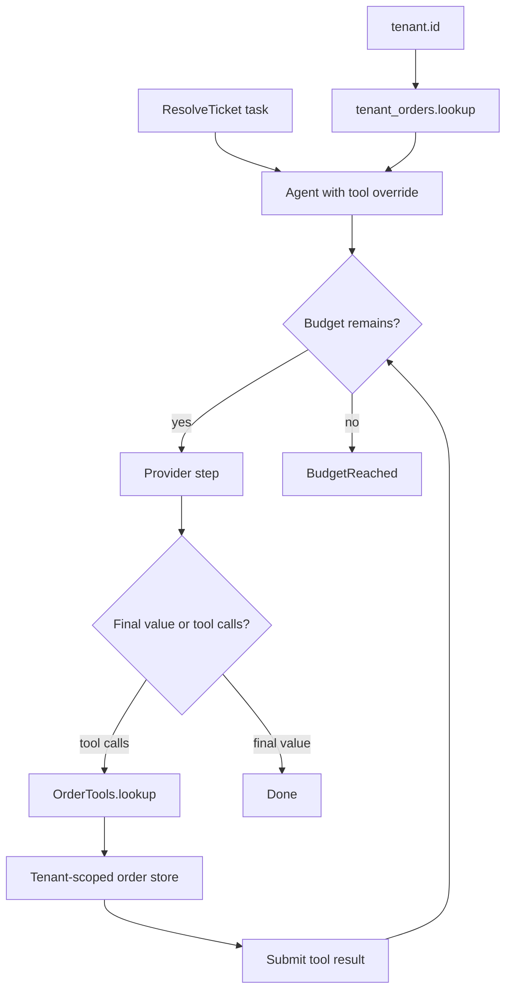

# Agents and tools

Use an ordinary BAML function as a tool. Its documentation tells the model
when to use it, its parameters become the input schema, and its return value
goes back to the model.

## Utilities used

| Utility | What it does |
| --- | --- |
| `tools: [...]` | Declares the LLM function's default tools |
| `ai.run.Agent` | Runs the provider and application tools in a loop |
| `ai.AgentOutcome<T>` | Keeps explicit completion, stop, and handoff outcomes |

## Example

```baml
class Ticket {
  id: string,
  message: string,
}

class Resolution {
  reply: string,
  resolved: bool,
}

/// Look up an order in the application database.
function lookup_order(order_id: string) -> string {
  orders.get_status(order_id)
}

/// Search the current support policy.
function search_policy(query: string) -> string {
  policies.search(query)
}

function ResolveTicket(ticket: Ticket) -> Resolution {
  provider: "openai/gpt-5.6-luna"
  prompt: `
    Resolve this support ticket.
    Use tools when you need current order or policy information.

    ${ticket}

    ${ctx.output_format}
  `
  tools: [
    lookup_order,
    search_policy,
  ]
}

let resolution: Resolution = ResolveTicket(ticket)
```

### What happens


### Illustrative output

```console
[INFO] ResolveTicket started
[INFO] called tool: lookup_order(order_id = "order-42")
[INFO] tool returned: "out for delivery"
[INFO] ResolveTicket returned Resolution { resolved: true, ... }
```

The direct call is usually enough. If the model requests `lookup_order`, BAML
validates its named arguments, invokes the real function, sends the result
back, and continues until it has a valid `Resolution`.

The model cannot choose captured values or bound `self`. This makes closures
and bound methods useful for tenant-scoped tools:

```baml
class OrderTools {
  tenant_id: string,

  function lookup(self, order_id: string) -> string {
    orders.for_tenant(self.tenant_id).get_status(order_id)
  }
}

let tenant_orders = OrderTools { tenant_id: tenant.id };

let outcome = ResolveTicket.task(ticket).run(
  runner = ai.run.Agent.new(
    tools = [
      tenant_orders.lookup,
      search_policy,
    ],
  ),
)
```

### Tenant-scoped tool flow



### Illustrative output

```console
[INFO] Agent tool override: tenant_orders.lookup, search_policy
[INFO] called bound tool: lookup(order_id = "order-42")
[INFO] lookup used captured tenant_id = "tenant-7"
```

Passing `tools` to `Agent.new` replaces the tools declared on the LLM
function. Omitting it inherits the declaration. Passing `tools = []` disables
application tools for that run.

## When you need the exact outcome

An explicit Agent run returns one of three outcomes:

| Outcome | Meaning |
| --- | --- |
| `ai.Done<T>` | The final typed value is ready |
| `ai.BudgetReached` | The run stopped safely and can be continued |
| `ai.Handoff` | The application should take over |

```baml
let outcome: ai.AgentOutcome<Resolution> = ResolveTicket.task(ticket).run(
  runner = ai.run.Agent.new(max_steps = 8),
);

match (outcome) {
  let done: ai.Done<Resolution> => show(done.value),
  let stopped: ai.BudgetReached => queue_for_review(stopped.conversation),
  let handoff: ai.Handoff => transfer_to_human(handoff),
}
```

Use the direct call when incomplete outcomes are exceptional. Use the explicit
runner when stop, resume, or handoff is normal application control flow.
