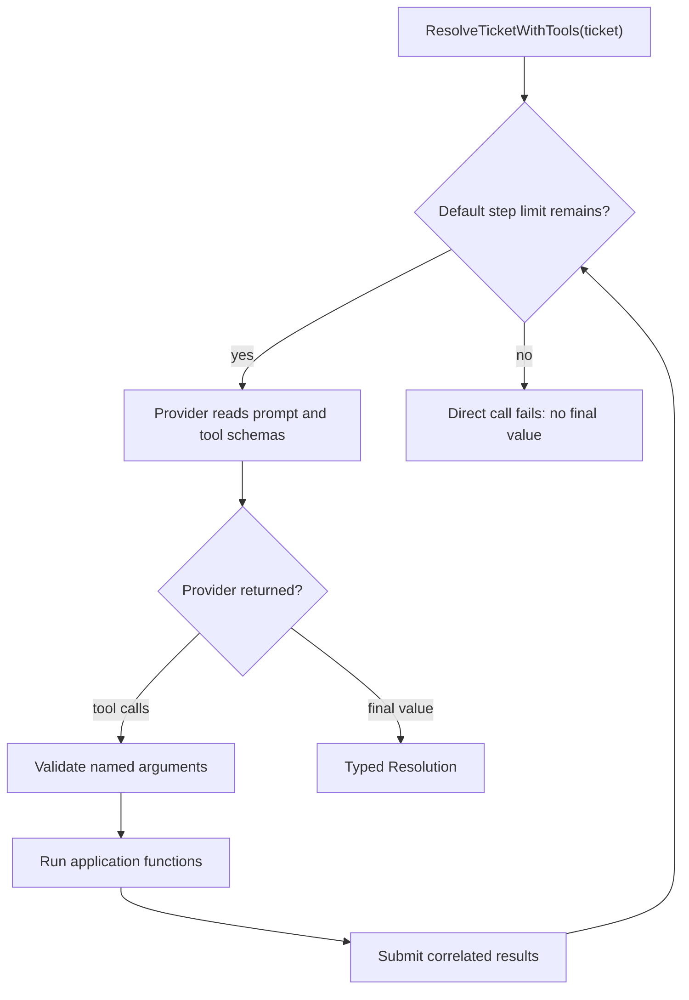
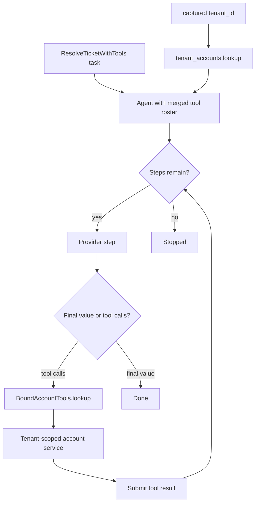

# Agents and tools

Use an ordinary BAML function as a tool. Its documentation tells the model
when to use it, its parameters become the input schema, and its return value
goes back to the model.

## Utilities used

| Utility | What it does |
| --- | --- |
| `tools: [...]` | Declares the LLM function's default tools |
| `ai.run.Agent` | Runs the provider and application tools in a loop |
| `ai.Done<T> \| ai.Stopped \| ai.Handoff \| ai.Interrupted \| ai.Failed` | The explicit Agent outcome union |

## Example

```baml
enum TicketPriority {
  Low
  Normal
  Urgent
}

class SupportTicket {
  id: string,
  subject: string,
  body: string,
  customer_tier: string,
}

class Resolution {
  category: string,
  priority: TicketPriority,
  summary: string,
  reply: string,
}

/// Search the support knowledge base.
function search_knowledge(query: string) -> json throws never {
  { "query": query, "article": "Duplicate charges are normally pending authorizations." }
}

/// Look up a customer account.
function lookup_account(customer_id: string) -> json throws never {
  { "customer_id": customer_id, "status": "active", "tier": "pro" }
}

function ResolveTicketWithTools(ticket: SupportTicket) -> Resolution {
  provider: fast_model()
  prompt: `
    Resolve ticket ${ticket.id}. Use the available tools before answering.

    ${ctx.output_format}
  `
  tools: [
    search_knowledge,
    lookup_account,
  ]
}

let resolution: Resolution = ResolveTicketWithTools(sample_ticket())
```

### What happens



### Illustrative output

```console
[INFO] ResolveTicketWithTools started
[INFO] called tool: search_knowledge(query = "duplicate charge")
[INFO] tool returned: { "query": "duplicate charge", "article": "Duplicate charges are normally pending authorizations." }
[INFO] ResolveTicketWithTools returned Resolution { category: "billing", ... }
```

The direct call is usually enough. If the model requests `search_knowledge`,
BAML validates its named arguments, invokes the real function, sends the
result back, and continues until it has a valid `Resolution`.

The generated direct call uses a default `ai.run.Agent` internally. The
provider returns `ToolCalls`; it never invokes `search_knowledge` itself. The
Agent owns argument validation, `reflect.call_any`, result correlation, and
the next provider step.

The model cannot choose captured values or bound `self`. This makes closures
and bound methods useful for tenant-scoped tools:

```baml
class BoundAccountTools {
  tenant_id: string,

  /// Look up an account with a bound application service.
  function lookup(self, customer_id: string) -> json throws never {
    { "tenant_id": self.tenant_id, "customer_id": customer_id }
  }
}

let tenant_accounts = BoundAccountTools { tenant_id: "tenant-42" };

let outcome = ResolveTicketWithTools@task(sample_ticket()).run(
  runner = ai.run.Agent<Resolution>.new(
    tools = [
      tenant_accounts.lookup,
      search_knowledge,
    ],
  ),
)
```

### Tenant-scoped tool flow



### Illustrative output

```console
[INFO] Agent tool roster (merged): lookup_account, lookup, search_knowledge
[INFO] called bound tool: lookup(customer_id = "C-1")
[INFO] lookup used captured tenant_id = "tenant-42"
```

Passing `tools` to `Agent.new` MERGES with the tools declared on the LLM
function: the task's declared roster stays available, and a runner tool with
the same name as a declared tool wins. Set `replace_tools = true` to make
the runner list the whole roster (`tools = [], replace_tools = true`
disables application tools for that run). Omitting `tools` inherits the
declaration unchanged.

`tools` is a run-scoped VALUE: the roster is snapshotted into the run, so
nothing the loop does to it is visible outside. For a deliberately live,
shared roster — MCP bootstrap, handler-driven adds and removes — pass
`tool_registry = ai.tools.ToolRegistry.new(...)` instead: the loop re-reads
it before every step, and `StepPlan` roster changes apply to it and persist
after the run. The two supply points are mutually exclusive; passing both
is an `ai.InvalidRequest`.

Tool handlers may be ANY function — including LLM functions, which is how
agent-as-tool composes: the inner function's own Agent run happens inside
the handler, and its typed result flows back as the tool result. A handler
that throws produces an `ai.tools.ToolError { id, message, cause }` result:
the model sees the rendered `message` and self-corrects, while the TYPED
original error rides in `cause` for `after_tool_call` callbacks and
observers. One shape is refused up front: a task whose OUTPUT TYPE is
`ai.tools.ToolCalls` is ambiguous (a provider step returns
`T | ToolCalls`), so the Agent rejects it with a clear `ai.InvalidRequest`
— return your own type and let the Agent execute the tools.

## When you need the exact outcome

An explicit Agent run returns one of five outcomes:

| Outcome | Meaning |
| --- | --- |
| `ai.Done<T>` | The final typed value is ready |
| `ai.Stopped` | A voluntary policy stop (`reason` is `"max_steps"`, `"stop_when"`, or a `StepPlan` stop's reason); safe to continue |
| `ai.Handoff` | The application should handle one exact tool call |
| `ai.Interrupted` | Cooperative cancellation reached a committed, resumable boundary |
| `ai.Failed` | A classified failure after committed progress — resume the carried conversation |

```baml
let outcome:
    ai.Done<Resolution>
    | ai.Stopped
    | ai.Handoff
    | ai.Interrupted
    | ai.Failed =
  ResolveTicketWithTools@task(sample_ticket()).run(
    runner = ai.run.Agent<Resolution>.new(
      max_steps = 8,
    ),
  );

match (outcome) {
  let done: ai.Done<Resolution> => log.info(done.value),
  let stopped: ai.Stopped => log.info(stopped.reason),
  let handoff: ai.Handoff => log.info(handoff.call.name),
  let interrupted: ai.Interrupted => log.info(interrupted.reason),
  let failed: ai.Failed => log.info(failed.cause),
}
```

Use the direct call when incomplete outcomes are exceptional. When you want
configuration but still only the final value, `task.complete(runner?)` is the
middle ground: it returns `T` and throws `ai.IncompleteRun` on a stop. Use
the explicit runner when stop, resume, or handoff is normal application
control flow. A cooperative interruption retains a fully committed
conversation. A handoff retains the provider's call ID; build the correlated
result with `ai.tools.ToolOk.of(handoff.call, output)` or
`ai.tools.ToolError.of(handoff.call, message)` and continue through
`session.submit_tool_results(results)` on
`ai.run.AgentSession.of(task, outcome)`.

Runnable examples:

```console
baml run --from crates/baml_tests/baml_src_temp2 \
  ai_scenarios.one_tool

baml run --from crates/baml_tests/baml_src_temp2 \
  ai_scenarios.agent_loop

baml run --from crates/baml_tests/baml_src_temp2 \
  ai_scenarios.multiple_and_parallel_tools
```
