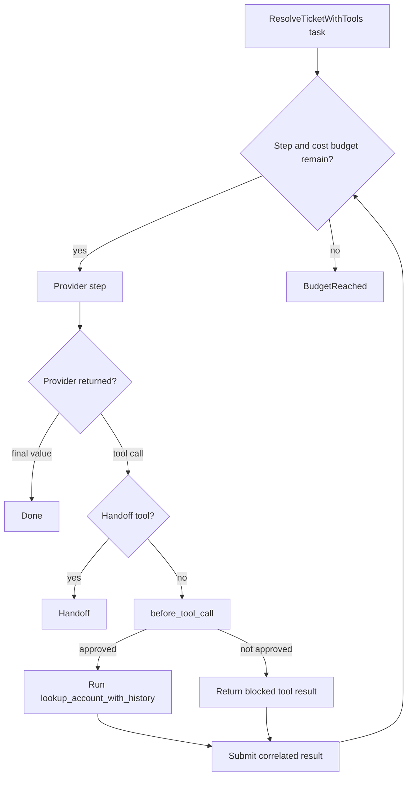

# Approvals, limits, and handoffs

Prompts guide model behavior. Agent callbacks enforce application policy. Pass
approval, authorization, argument rewriting, and blocking logic directly to
`Agent.new(...)`.

## Utilities used

| Utility | What it does |
| --- | --- |
| `before_tool_call` callback | Makes a decision before an Agent runs a tool |
| `prepare_step` callback | Changes the next provider, tool roster, or stop decision |
| `ai.tools.ToolDecision` | Allows, replaces, or blocks one tool call |
| `ai.Budget { max_steps, max_cost_usd }` | Stops work between provider steps |
| `ai.tools.tool(...).as_handoff()` | Marks a tool call as application takeover |

## Example

```baml
enum TicketPriority {
  Low
  Normal
  Urgent
}

class Resolution {
  category: string,
  priority: TicketPriority,
  summary: string,
  reply: string,
}

/// Look up an account with optional history.
function lookup_account_with_history(
  customer_id: string,
  include_history: bool = false,
) -> json throws never {
  { "customer_id": customer_id, "include_history": include_history }
}

/// Look up a customer account.
function lookup_account(customer_id: string) -> json throws never {
  { "customer_id": customer_id, "status": "active", "tier": "pro" }
}

function ResolveTicketWithTools(ticket: SupportTicket) -> Resolution {
  provider: "openai-responses/gpt-5.6-luna"
  prompt: `
    Resolve ticket ${ticket.id}. Use the available tools before answering.
    Hand the account over to a person when the request needs authority you
    do not have.

    ${ctx.output_format}
  `
  tools: [
    lookup_account_with_history,
    ai.tools.tool(lookup_account).as_handoff(),
  ]
}

let history_approved = false;

let outcome = ResolveTicketWithTools@task(sample_ticket()).run(
  runner = ai.run.Agent<Resolution>.new(
    before_tool_call = (event) -> {
      if (event.call.name == "lookup_account_with_history" && !history_approved) {
        ai.tools.ToolDecision.block("human approval required")
      } else {
        ai.tools.ToolDecision.allow(event.call)
      }
    },
    budget = ai.Budget { max_steps: 8, max_cost_usd: 0.25 },
  ),
)
```

### What happens



### Illustrative output

```console
[INFO] proposed tool: lookup_account_with_history(customer_id = "C-1", ...)
[INFO] before_tool_call: blocked "human approval required"
[INFO] returned blocked result to the model
[INFO] Agent returned Handoff { to: "lookup_account", ... }
```

A blocked call still receives a correlated tool result. The model can explain
the denial, choose another action, or request a handoff. The blocked function
does not run.

A handoff tool never runs at all: when the model calls a tool marked
`.as_handoff()`, the Agent returns `ai.Handoff` with the tool's name and
arguments before dispatch, and the application takes over from there.

## Handle every terminal outcome

Each outcome carries what the caller needs to continue:

- `ai.Done<T> { value, meta, conversation }` — the final typed value, the
  response metadata, and the conversation that produced it.
- `ai.BudgetReached { conversation, steps_taken, reason }` — a safe stop with
  everything needed to resume. `Budget` is multi-dimensional — `max_steps`
  and/or `max_cost_usd` — and `reason` names the limit that tripped.
- `ai.Handoff { to, args, conversation, steps_taken }` — a tool marked
  `.as_handoff()` fired; the application takes over with the tool's arguments
  and the conversation so far.

```baml
match (outcome) {
  let done: ai.Done<Resolution> => log.info(done.value.reply),

  let stopped: ai.BudgetReached => {
    // Save stopped.conversation and resume after the limit or approval changes.
    log.info(`stopped after ${stopped.steps_taken} steps: ${stopped.reason}`)
  },

  let handoff: ai.Handoff => {
    // The application takes over handoff.to with handoff.args.
    log.info(`handoff requested: ${handoff.to}`)
  },
}
```

Both incomplete outcomes retain the conversation. The application can inspect
it, save it, or resume it after a limit or approval changes.

## What callbacks can change

| Callback | Common decisions |
| --- | --- |
| `before_tool_call` | Allow, rewrite arguments, replace, or block |
| `after_tool_call` | Record, redact, or normalize the result |
| `prepare_step` | Change the tool roster, switch providers, or request a safe stop |

Observers are different: they can log the same events, but they cannot change
execution.
