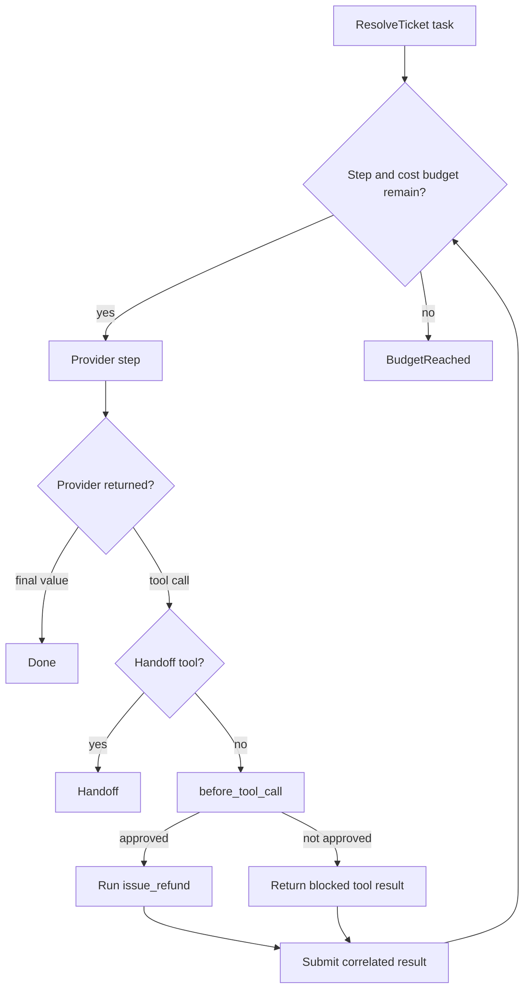

# Approvals, limits, and handoffs

Prompts guide model behavior. Agent callbacks enforce application policy. Pass
approval, authorization, argument rewriting, and blocking logic directly to
`Agent.new(...)`.

## Utilities used

| Utility | What it does |
| --- | --- |
| `before_tool_call` callback | Makes a decision before an Agent runs a tool |
| `prepare_step` callback | Changes the next provider, tool roster, or stop decision |
| `ai.ToolDecision` | Allows, replaces, or blocks one tool call |
| `max_steps`, `max_cost_usd` | Stops work between provider steps |
| `ai.tool(...).as_handoff()` | Marks a tool call as application takeover |

## Example

```baml
class Resolution {
  reply: string,
  resolved: bool,
}

function issue_refund(
  order_id: string,
  amount_usd: float,
  idempotency_key: string,
) -> string {
  refunds.issue(order_id, amount_usd, idempotency_key)
}

function transfer_to_human(reason: string) -> string {
  reason
}

function ResolveTicket(message: string) -> Resolution {
  provider: "openai/gpt-5.6-luna"
  prompt: `
    Resolve this support ticket.
    Ask for a human when the request needs authority you do not have.

    ${message}

    ${ctx.output_format}
  `
  tools: [
    issue_refund,
    ai.tool(transfer_to_human).as_handoff(),
  ]
}

let refund_approved = false;

let outcome = ResolveTicket.task("Refund order-42.").run(
  runner = ai.run.Agent.new(
    before_tool_call = (event) -> {
      if (event.call.name == "issue_refund" && !refund_approved) {
        ai.ToolDecision.block("human approval required")
      } else {
        ai.ToolDecision.allow(event.call)
      }
    },
    max_steps = 8,
    max_cost_usd = 0.25,
  ),
)
```

### What happens



### Illustrative output

```console
[INFO] proposed tool: issue_refund(order_id = "order-42", ...)
[INFO] before_tool_call: blocked "human approval required"
[INFO] returned blocked result to the model
[INFO] Agent requested handoff: transfer_to_human
```

A blocked call still receives a correlated tool result. The model can explain
the denial, choose another action, or request a handoff. The blocked function
does not run.

## Handle every terminal outcome

```baml
match (outcome) {
  let done: ai.Done<Resolution> => send(done.value),

  let stopped: ai.BudgetReached => {
    log.info(`stopped after ${stopped.steps_taken} steps`);
    queue_for_review(stopped.conversation)
  },

  let handoff: ai.Handoff => {
    log.info(`handoff requested: ${handoff.reason}`);
    open_human_case(handoff.conversation)
  },
}
```

Both incomplete outcomes retain the conversation. The application can inspect
it, save it, or resume it after a limit or approval changes.

## What callbacks can change

| Callback | Common decisions |
| --- | --- |
| `before_tool_call` | Allow, rewrite arguments, replace, or block |
| `after_tool_call` | Record, redact, or normalize the result |
| `prepare_step` | Change the tool roster, switch providers, or request a safe stop |

Observers are different: they can log the same events, but they cannot change
execution.
