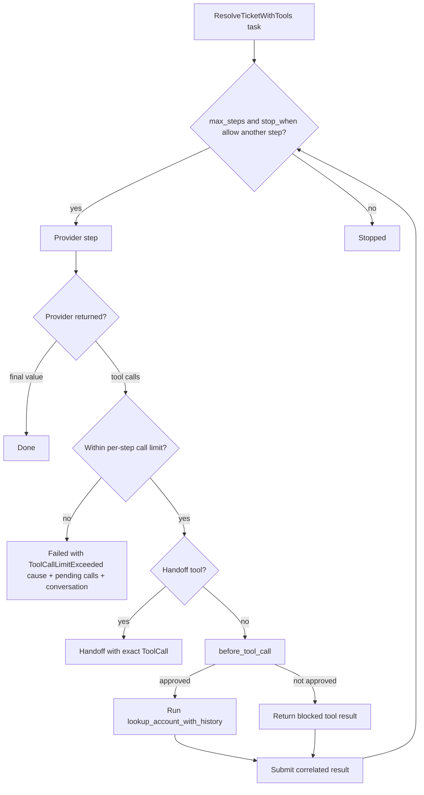

# Approvals, limits, and handoffs

Prompts guide model behavior. Agent callbacks enforce application policy. Pass
approval, authorization, argument rewriting, and blocking logic directly to
`Agent.new(...)`.

## Utilities used

| Utility | What it does |
| --- | --- |
| `before_tool_call` callback | Makes a decision before an Agent runs a tool |
| `prepare_step` callback | Changes the next provider, tool roster, or stop decision |
| `ai.tools.ToolDecision` | Allows, replaces, or blocks one tool call |
| `max_steps` | Caps the number of provider steps (default 32; `null` is unlimited) |
| `stop_when` | Caller stop policy, checked at every committed boundary with the same `ai.tools.StepContext` that `prepare_step` receives |
| `max_tool_calls_per_step` | Rejects an oversized provider tool batch before any tool effect |
| `ai.tools.tool(...).as_handoff()` | Returns one exact call to the application before dispatch |
| `ai.tools.ToolOk.of(call, output)` / `ai.tools.ToolError.of(call, message)` | Builds one correlated result for a pending call |
| `session.submit_tool_results(results, runner?)` | Answers pending calls and continues the turn |

## Example

```baml
enum TicketPriority {
  Low
  Normal
  Urgent
}

class Resolution {
  category: string,
  priority: TicketPriority,
  summary: string,
  reply: string,
}

/// Look up an account with optional history.
function lookup_account_with_history(
  customer_id: string,
  include_history: bool = false,
) -> json throws never {
  { "customer_id": customer_id, "include_history": include_history }
}

/// Look up a customer account.
function lookup_account(customer_id: string) -> json throws never {
  { "customer_id": customer_id, "status": "active", "tier": "pro" }
}

function ResolveTicketWithTools(ticket: SupportTicket) -> Resolution {
  provider: fast_model()
  prompt: `
    Resolve ticket ${ticket.id}. Use the available tools before answering.
    Hand the account over to a person when the request needs authority you
    do not have.

    ${ctx.output_format}
  `
  tools: [
    lookup_account_with_history,
    ai.tools.tool(lookup_account).as_handoff(),
  ]
}

let history_approved = false;
let price = ai.observe.TokenPrice {
  input_per_million: 3.0,
  output_per_million: 15.0,
};

let outcome = ResolveTicketWithTools@task(sample_ticket()).run(
  runner = ai.run.Agent<Resolution>.new(
    before_tool_call = (event) -> {
      if (event.call.name == "lookup_account_with_history" && !history_approved) {
        ai.tools.ToolDecision.block("human approval required")
      } else {
        ai.tools.ToolDecision.allow(event.call)
      }
    },
    max_steps = 8,
    stop_when = (context) -> {
      ai.observe.estimated_cost(context.usage, price) > 0.25
    },
    max_tool_calls_per_step = 1,
  ),
)
```

There is no built-in spend cap: `ai.Usage` counts tokens, and dollar
accounting is the application's judgment. `ai.observe.TokenPrice` plus
`ai.observe.estimated_cost(usage, price)` express that judgment inside
`stop_when` (or an observer), where the application controls the price table
and the threshold.

### What happens



### Illustrative output

```console
[INFO] proposed tool: lookup_account_with_history(customer_id = "C-1", ...)
[INFO] before_tool_call: blocked "human approval required"
[INFO] returned blocked result to the model
[INFO] Agent returned Handoff { call: ToolCall { id: "call_42", name: "lookup_account", ... }, ... }
```

A blocked call still receives a correlated tool result. The model can explain
the denial, choose another action, or request a handoff. The blocked function
does not run.

A handoff tool never runs inside the Agent. When the model calls a tool marked
`.as_handoff()`, the Agent returns `ai.Handoff` with the exact `ToolCall`
before dispatch. The call retains its provider correlation ID, name, and
arguments.

A handoff must be unambiguous. If one model step mixes a handoff with an
application call, or returns several handoff calls, the Agent returns
`ai.Failed` with an `ai.InvalidRequest` cause before executing anything.

## Enforce the number of tool calls in one step

Provider wire options such as `parallel_tool_calls = false` tell a model how
it should respond. They are not an application policy boundary: a provider,
model, proxy, or future adapter can still return an unexpected batch. Put the
hard limit on the runner:

```baml
let outcome = ResolveTicketWithTools@task(sample_ticket()).run(
  runner = ai.run.Agent<Resolution>.new(
    max_tool_calls_per_step = 1,
  ),
)
```

`max_tool_calls_per_step` has these exact semantics:

- `null` (the default) accepts any non-empty, valid batch and preserves the
  existing parallel-tool behavior.
- `0` rejects every tool request while still allowing a final `T`.
- `N` accepts at most `N` calls from one provider `step`.
- Handoff calls count. Therefore a limit of zero rejects a handoff, while a
  limit of one permits one unambiguous handoff.
- Negative values are invalid configuration and fail before `provider.begin`.

The Agent first validates the provider's correlation envelope, then checks
the count. On a count violation it has not emitted a tool-call event, invoked
`before_tool_call`, delivered a handoff, run a handler, or invoked
`after_tool_call`.

The typed `ai.ToolCallLimitExceeded` failure carries:

| Field | Meaning |
| --- | --- |
| `provider` | Provider that returned the batch |
| `max_tool_calls_per_step` | Configured runner limit |
| `actual_tool_calls` | Number returned by this step |
| `calls` | Exact pending calls, including correlation IDs |
| `conversation` | Provider-owned continuation at the pending-call boundary |
| `steps_taken` | Number of completed provider steps |

Its `effects()` reports `Effects.None`: no application tool effect has
occurred. But the provider step itself committed, so the run does not throw —
it returns `ai.Failed { cause: ai.ToolCallLimitExceeded, ... }` at the
committed boundary. It is a fault rather than `Stopped` because the
provider conversation contains unresolved calls. The application must
explicitly accept or reject every call before taking the next model step.

For example, an application can reject the batch and resume without replaying
the model step:

```baml
let task = ResolveTicketWithTools@task(sample_ticket());

let outcome = task.run(
  runner = ai.run.Agent<Resolution>.new(max_tool_calls_per_step = 1),
);

match (outcome) {
  let failed: ai.Failed => match (failed.cause) {
    let limited: ai.ToolCallLimitExceeded => {
      let session = ai.run.AgentSession<Resolution>.of(task, failed);
      let rejected = limited.calls.calls.map((call) -> {
        ai.tools.ToolError.of(call, "only one tool call is allowed per step")
      });
      let continued = session.submit_tool_results(
        rejected,
        runner = ai.run.Agent<Resolution>.new(max_tool_calls_per_step = 1),
      );
      log.info(continued)
    },
    _ => log.info(failed.cause),
  },
  _ => log.info(outcome),
}
```

Submitting correlated errors is one policy choice. An application may instead
inspect and fulfill the pending calls externally with `ai.tools.ToolOk.of`.
Either way, `submit_tool_results` validates the complete batch: every pending
call ID must receive exactly one correlated result before the run resumes.

## Handle every terminal outcome

Each outcome carries what the caller needs to continue, and every variant
carries `steps_taken` and cumulative whole-run `usage`:

- `ai.Done<T> { value, metadata, conversation, steps_taken, usage }` — the
  final typed value, the response metadata, and the conversation that
  produced it.
- `ai.Stopped { conversation, steps_taken, usage, reason }` — a voluntary
  policy stop with everything needed to resume. `reason` names which policy
  fired: `"max_steps"`, `"stop_when"`, or a `StepPlan` stop's reason.
- `ai.Handoff { call, conversation, steps_taken, usage }` — a tool marked
  `.as_handoff()` fired; `call` is the exact `ai.tools.ToolCall` the
  application must resolve.
- `ai.Interrupted { conversation, steps_taken, usage, reason }` — cooperative
  cancellation reached a committed boundary with no unsubmitted application
  tool results.
- `ai.Failed { cause, conversation, steps_taken, usage }` — a classified
  failure occurred after this run had committed progress: a continuation's
  entry append or submit, or at least one completed provider step. The
  conversation is the last committed state. A failure before any progress
  still throws, so ordinary catch patterns and step-level `ai.retry`
  semantics are unchanged.

```baml
match (outcome) {
  let done: ai.Done<Resolution> => log.info(done.value.reply),

  let stopped: ai.Stopped => {
    // Save stopped.conversation and resume after the limit or approval changes.
    log.info(`stopped after ${stopped.steps_taken} steps: ${stopped.reason}`)
  },

  let handoff: ai.Handoff => {
    // The application takes over the exact correlated call.
    log.info(`handoff requested: ${handoff.call.name} (${handoff.call.id})`)
  },

  let interrupted: ai.Interrupted => {
    // This conversation can resume directly with a fresh cancellation token.
    log.info(`interrupted after ${interrupted.steps_taken} steps`)
  },

  let failed: ai.Failed => {
    // Resume the carried conversation; never blind-replay a stopped run.
    log.info(`failed after ${failed.steps_taken} steps`)
  },
}
```

All incomplete outcomes retain the conversation. `Stopped`,
`Interrupted`, and `Failed` can resume that state through
`session.resume()`. A `Handoff` still has a pending provider call, so the
application must submit its result through `session.submit_tool_results`
first.

## Complete a handoff and resume

The application performs the external work, creates one result correlated to
`handoff.call.id`, and submits it through the session:

```baml
function resume_after_handoff(
  handoff: ai.Handoff,
  external_output: json,
) -> ai.Done<Resolution> | ai.Stopped | ai.Handoff | ai.Interrupted | ai.Failed
    throws ai.Failure | baml.errors.UnknownError | baml.errors.Unsupported {
  let session = ai.run.AgentSession<Resolution>.of(
    ResolveTicketWithTools@task(sample_ticket()),
    handoff,
  );

  let result = ai.tools.ToolOk.of(handoff.call, external_output);
  session.submit_tool_results([result])
}
```

`ai.tools.ToolOk.of(handoff.call, ...)` copies the exact call ID. Use
`ai.tools.ToolError.of(handoff.call, message)` when the external work fails.
In either case, `submit_tool_results` is the only continuation for a
conversation stopped at a handoff: it validates that each pending call
receives exactly one correlated result and rejects a submission when nothing
is pending, while `send` on the same state throws `ai.InvalidRequest`
pointing back at `submit_tool_results`.

## What callbacks can change

| Callback | Common decisions |
| --- | --- |
| `before_tool_call` | Allow, rewrite arguments, replace, or block |
| `after_tool_call` | Record, redact, or normalize the result |
| `prepare_step` | Change the tool roster, switch providers, or request a safe stop |

Observers are different: they can log the same events, but they cannot change
execution.
