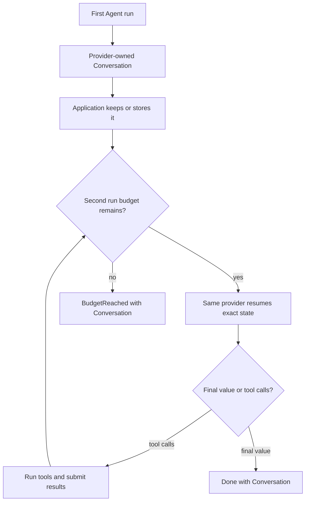

# Conversations and resuming

An Agent returns a `Conversation` with the exact provider state needed to
continue. Pass it back to `Agent.new` when the next run uses the same provider.

## Utilities used

| Utility | What it does |
| --- | --- |
| `Conversation` | Preserves exact continuation state |
| `conversation.messages()` | Returns portable, editable messages |
| `Agent.new(conversation = ...)` | Continues the exact conversation |
| `save_conversation` | Produces an opaque token for later restoration |

## Example

The example uses the shared support-ticket models (`SupportTicket`,
`Resolution`, `sample_ticket()`), the shared tool `search_knowledge`, and the
shared provider values `fast_model()` (an `openai.OpenAIProvider`) and `careful_model()`
(an `anthropic.AnthropicProvider`).

```baml
function ResolveTicketWithTools(ticket: SupportTicket) -> Resolution {
  provider: fast_model()
  prompt: `
    Resolve ticket ${ticket.id}. Use the available tools before answering.

    ${ctx.output_format}
  `
  tools: [search_knowledge]
}

let ticket = sample_ticket();

let first = ResolveTicketWithTools@task(ticket).run(
  runner = ai.run.Agent<Resolution>.new(
    budget = ai.Budget { max_steps: 2, max_cost_usd: null },
  ),
);

let conversation = match (first) {
  let done: ai.Done<Resolution> => done.conversation,
  let stopped: ai.BudgetReached => stopped.conversation,
  let handoff: ai.Handoff => throw baml.errors.Unsupported {
    message: "resolve the handoff call before resuming: " + handoff.call.name,
  },
};

let continued = ResolveTicketWithTools@task(ticket).run(
  runner = ai.run.Agent<Resolution>.new(
    conversation = conversation,
    budget = ai.Budget { max_steps: 6, max_cost_usd: null },
  ),
)
```

### What happens



### Illustrative output

```console
[INFO] first run stopped after 2 steps
[INFO] retained conversation: provider = "openai"
[INFO] resuming conversation with 1 completed tool call
[INFO] continued run returned Done<Resolution>
```

When a conversation is passed, the runner resumes with the provider that owns
it — the conversation is authoritative continuation state. Provider state may
contain more than visible messages, such as tool-call IDs, encrypted reasoning
blocks, or continuation handles. Provider conversations also record a
versioned output fingerprint containing both the nominal type and a canonical
JSON Schema. An Agent rejects a missing fingerprint, a different type, or a
same-named type whose structure changed before sending another request.

## Save it for another process

`save_conversation` and `restore_conversation` come from
`ai.ResumableAgentProvider`. `openai.OpenAIProvider`,
`anthropic.AnthropicProvider`, and both Gemini adapters implement the flat
Agent conversation protocol for their native modes. A provider can seal and
reopen only conversations it owns:

```baml
let model = fast_model();

let token = model.save_conversation(conversation);
log.info({ "provider": token.provider, "version": token.version });

let restored = model.restore_conversation(token);

let outcome = ResolveTicketWithTools@task(ticket).run(
  runner = ai.run.Agent<Resolution>.new(conversation = restored),
)
```

### Illustrative output

```console
[INFO] saved conversation token: provider = "openai", version = 1
[INFO] restored provider-owned conversation
[INFO] resumed ResolveTicketWithTools
```

The token is an `ai.ConversationToken`: opaque and versioned. Serialize it
with `baml.json.stringify(token)` and store it anywhere. It contains
continuation coordinates, not application credentials.

For OpenAI, Anthropic, and Google, `ToolMode.Prompt` conversations retain the
original task render recipe in memory. Their `save_conversation`,
`restore_conversation`, and `import_messages` operations are unsupported in
that mode. Use `ToolMode.Native`, or start a new task from portable messages.

## Move to another provider

A conversation belongs to one provider. To switch, export portable messages
and let the destination provider import them. The destination must implement
`ai.ConversationImportProvider`. `openai.OpenAIProvider`,
`anthropic.AnthropicProvider`, and both Gemini adapters provide message import
for supported native conversations:

```baml
let destination = openai.OpenAIProvider {
  ...openai.responses(),
  model: "gpt-5.6-luna",
  api_key: baml.env.get_or_panic("OPENAI_API_KEY"),
};

let imported = destination.import_messages<Resolution>(
  conversation.messages(),
);

log.info(imported.fidelity);
log.info(imported.warnings);

let outcome = ResolveTicketWithTools@task(ticket)
  .with_provider(destination)
  .run(
    runner = ai.run.Agent<Resolution>.new(
      conversation = imported.conversation,
    ),
  )
```

### Illustrative output

```console
[INFO] exported 6 portable messages
[INFO] imported conversation into destination provider
[WARN] import fidelity: MessagesOnly
[INFO] continued with provider = "openai"
```

The `ai.ConversationFidelity` on the import reports whether the move was
`Exact`, `MessagesOnly`, or `Lossy`. Switching provider labels without
importing state is never a valid resume.

Import transfers portable role/content history, not every provider-private
artifact. Encrypted reasoning blocks, cache handles, and provider-specific
continuation IDs can be lost. Callers must inspect `fidelity` and `warnings`
before treating an import as equivalent to a native resume.

Runnable scenarios:

```console
baml run --from crates/baml_tests/baml_src_temp2 \
  ai_scenarios.application_owned_history

baml run --from crates/baml_tests/baml_src_temp2 \
  ai_scenarios.save_and_resume
```
