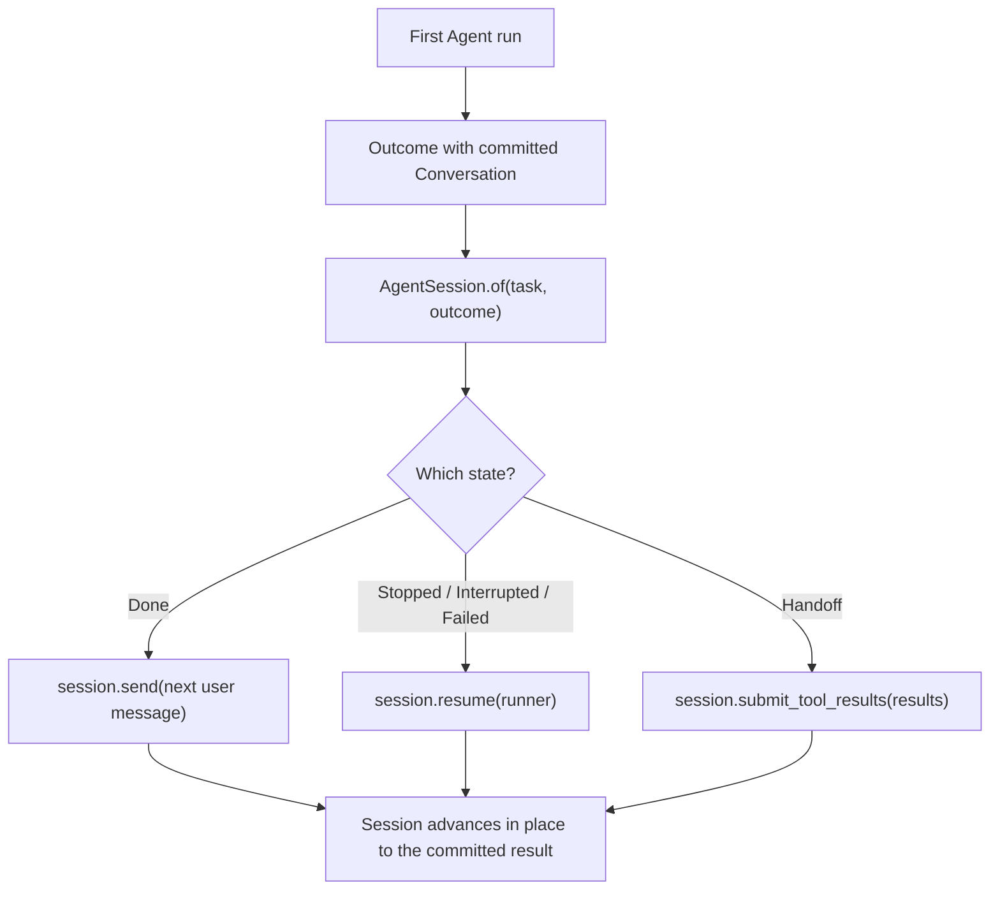

# Conversations and resuming

Every Agent outcome carries a `Conversation` with the exact provider state
needed to continue. Pair that outcome with its task in an
`ai.run.AgentSession` and continue through named methods — `send` for a new
user turn, `resume` for an unfinished one, `submit_tool_results` for a
handoff. Conversations, appends, tokens, and imports are the provider layer
beneath sessions.

## Utilities used

| Utility | What it does |
| --- | --- |
| `ai.run.AgentSession.start(task)` | Opens a session at turn zero — no model request; turn one and turn N are the same code path |
| `ai.run.AgentSession.of(task, outcome)` | Pairs a task with the conversation carried by any outcome (sugar over `from`) |
| `ai.run.AgentSession.from(task, source)` | The one constructor for continuation state — an exact `Conversation` or portable `Messages` |
| `session.send(message, runner?)` | Begins a new user turn; a plain string is the everyday call |
| `session.complete(message, runner?)` | Sends a turn that must finish; throws `ai.IncompleteRun` otherwise |
| `session.resume(runner?)` | Continues the same unfinished turn |
| `session.submit_tool_results(results, runner?)` | Answers a handoff's pending calls |
| `session.save()` / `ai.run.AgentSession.restore(task, token)` | Moves a session across processes |
| `session.export()` | The portable history out — the visible crossing to the portable pole |
| `session.move_to(provider)` | Moves the history to another provider in one call (export → import) |
| `Agent.new(cancel = ...)` | Requests a resumable stop at a committed boundary |
| `Conversation` | Provider-owned exact continuation state beneath every session |

## Example

The example uses the shared support-ticket models (`SupportTicket`,
`Resolution`, `sample_ticket()`), the shared tool `search_knowledge`, and the
shared provider values `fast_model()` (an `openai.OpenAIProvider`) and `careful_model()`
(an `anthropic.AnthropicProvider`).

```baml
function ResolveTicketWithTools(ticket: SupportTicket) -> Resolution {
  provider: fast_model()
  prompt: `
    Resolve ticket ${ticket.id}. Use the available tools before answering.

    ${ctx.output_format}
  `
  tools: [search_knowledge]
}

let ticket = sample_ticket();
let task = ResolveTicketWithTools@task(ticket);

let first = task.run(
  runner = ai.run.Agent<Resolution>.new(max_steps = 2),
);

let session = ai.run.AgentSession<Resolution>.of(task, first);

let continued = match (first) {
  let done: ai.Done<Resolution> => done,
  let handoff: ai.Handoff => session.submit_tool_results([
    ai.tools.ToolOk.of(handoff.call, { "status": "resolved by the application" }),
  ]),
  _ => session.resume(
    runner = ai.run.Agent<Resolution>.new(max_steps = 6),
  ),
}
```

### What happens



### Illustrative output

```console
[INFO] first run stopped after 2 steps
[INFO] session paired task with committed conversation: provider = "openai"
[INFO] session.resume continued with 1 completed tool call retained
[INFO] continued run returned Done<Resolution>
```

Every outcome variant is a valid session state. A completed turn, a policy
stop, a handoff, an interruption, and a classified failure after committed
progress all carry the committed conversation, so `AgentSession.of` accepts
all five. Which continuation applies depends on the variant: `resume`
continues an unfinished turn after `Stopped`, `Interrupted`, or
`Failed`; a `Handoff` is a legitimate session state whose only continuation
is `submit_tool_results`. Call `session.phase()` to see what the model is
waiting for — `AwaitingMessage`, `AwaitingToolResults { calls }`, or
`Unreported` — without retaining the outcome.

A session advances in place: `send`, `resume`, and `submit_tool_results` run
the loop and update the session's conversation to the committed result before
returning. Hold one session per line of conversation. Starting a continuation
while another is in flight throws `ai.run.SessionBusy`; to explore two
continuations from the same point, call `session.fork()` first — it copies
the conversation through the provider's own save/restore capability, and
throws `baml.errors.Unsupported` if the provider lacks
`ResumableAgentProvider`.

A session continues with the provider that owns its conversation — the
conversation is authoritative continuation state. Provider state may contain
more than visible messages, such as tool-call IDs, encrypted reasoning
blocks, or continuation handles. Provider conversations also record a
versioned output fingerprint containing both the nominal type and a canonical
JSON Schema — providers opt in by reporting `ai.output_fingerprint<T>()` from
`output_type_fingerprint()`. Both session construction and the Agent reject a
different type or a same-named type whose structure changed before sending
another request. A null fingerprint SKIPS the guard, exactly like the
`pending_calls` null convention: application-defined conversations that do
not report one are honored, not rejected.

## Start a fresh user turn

Send the next user message through the session. `send` appends it to the
exact conversation inside the run boundary — it is the continuation's first
commit — and the task's prompt is not re-rendered, because the conversation
already contains it:

```baml
let task = ResolveTicketWithTools@task(ticket);
let first = task.run(runner = ai.run.Agent<Resolution>.new());

let session = ai.run.AgentSession<Resolution>.of(task, first);

let second = session.send("Check whether the same issue affected invoice 42.")
```

When the next turn must produce the final value, demand it:

```baml
let resolution: Resolution = session.complete("Summarize the final resolution.")
```

`send` and `complete` accept `string | ai.Message | ai.Message[]`. A plain
string is the everyday call — it desugars to one `ai.ChatMessage.user`
message. Pass an explicit `ai.Message` when the turn needs media parts, or a
`Message[]` batch when a drained queue should enter as one turn. For a
conversation that has no first outcome yet, open it with
`ai.run.AgentSession.start(task)` instead: `begin` renders the task's prompt
into a fresh conversation with no model request, and every user turn —
first or fiftieth — is the same `session.send(...)` call.

`complete` throws `ai.IncompleteRun` if the turn stops early. The session
still advances to that committed checkpoint, so a catch site can `resume` or
`submit_tool_results` on the same session — a demanded completion never
destroys the partial run.

Do not rebuild a completed conversation from `session.export()` merely to add
the next user message. That would discard response IDs, encrypted reasoning
blocks, thought signatures, and other provider-owned continuation state.
`send` requires the conversation to be at a completed-turn boundary: a
conversation with unanswered tool calls refuses `send` with
`ai.InvalidRequest` pointing at `submit_tool_results`.

### The provider layer beneath `send`

The session dispatches the append through the conversation owner. Providers
implement the lower-level `ai.ConversationAppendProvider` capability, which
`conversation.append_message(...)` and `conversation.append_messages(...)`
also use directly:

```baml
interface ConversationAppendProvider requires AgentProvider {
  function append_messages(
    self,
    conversation: ai.Conversation,
    messages: ai.Messages,
  ) -> null
}
```

Appending MUTATES the conversation in place and is statement-shaped (returns
null); a failing append leaves the conversation unchanged — the adapter
atomicity rule. Current rules are deliberately narrow:

- appended messages are user turns — including user messages with media
  parts — or `System`-role steering messages built with
  `ai.ChatMessage.steer(...)`; assistant- and tool-role appends are rejected;
- the complete batch is validated before either the portable or provider wire
  history is mutated;
- the exact provider instance that owns the conversation performs the append;
- the output-type fingerprint is preserved unchanged;
- unresolved provider tool calls must be completed through `submit` first.

A steering message is a mid-conversation instruction that is NOT from the
end user — a compaction summary, fresh context, a policy change.
`session.steer("...")` is the session-level spelling. Adapters map it
honestly per wire: OpenAI renders a developer item; Anthropic and Gemini
render tagged user-role content.

A committed `submit` boundary is appendable. For example, cooperative
interruption may return after application tool effects have run and their
correlated results have been recorded, but before the next provider request.
Appending a user message keeps those resolved results in the next request; it
does not execute the tools again. Provider-internal result functions used for
typed output are closed in the wire history in the same way.

OpenAI Responses, Anthropic Messages, Google AI Gemini, and Vertex Gemini
support exact append in native and prompt-tool modes. Native adapters retain
their provider-specific state:

| Provider | Exact state retained while appending |
| --- | --- |
| OpenAI Responses | `previous_response_id`, pending resolved input items, and response output state |
| Anthropic Messages | complete content blocks, including signed/opaque thinking blocks |
| Google AI / Vertex Gemini | complete `contents`, including `thoughtSignature` fields |
| Prompt-tool modes | original task render recipe and the in-process text-tool transcript |

`ToolMode.Prompt` append is exact only within the live process because those
conversations retain a render closure and cannot currently be sealed by
`save_conversation`.

Reliability wrappers preserve this behavior. `ai.retry` delegates append to
its exact inner conversation. `ai.fallback` delegates to the currently active
member and pins itself to that member after a successful append; switching
members afterward would lose the appended provider-owned state. If an owner
does not implement `ConversationAppendProvider`,
`conversation.append_message(...)` throws `baml.errors.Unsupported`.

If you drive the append layer — or the begin/step/submit protocol — by hand,
`ai.run.AgentSession.from(task, conversation)` re-enters the session surface
with the same invariant checks as every other session entry.

## Interrupt and resume an Agent

Cooperative interruption retains exact continuation state without returning
half of a tool transaction:

```baml
let task = ResolveTicketWithTools@task(ticket);
let cancel = baml.spawn.CancelToken.new();
let running = spawn {
  task.run(
    runner = ai.run.Agent<Resolution>.new(cancel = cancel),
  )
};

// Called later by an application supervisor.
let _ = cancel.cancel();

let resumed = ai.run.AgentSession<Resolution>
  .of(task, await running)
  .resume(
    runner = ai.run.Agent<Resolution>.new(cancel = baml.spawn.CancelToken.new()),
  )
```

The Agent observes its passive cancellation token before a provider request
or after the complete tool-result batch has been submitted. Cancellation
during a request or tool dispatch is deferred to the next such boundary. The
returned conversation therefore has no pending application calls, and
`session.resume()` continues it without replaying committed tools. Use a
fresh, uncancelled token on the resuming runner; `CancelToken` is one-shot.

Do not call `running.cancel()` when continuation state is required.
`Future.cancel()` makes the Future itself terminal and `await` throws
`baml.panics.Cancelled`; it cannot return `ai.Interrupted`. Likewise, do not
attach the same token to `baml.spawn.options(cancel = ...)`.

A final value or handoff returned by the model step racing cancellation wins
over interruption. These outcomes are already terminal. Tool effects cannot
be rolled back, so a slow or externally visible effect is allowed to finish
before the resumable interruption is returned.

## Save it for another process

`session.save()` produces an `ai.run.AgentSessionToken` — a small,
JSON-serializable value. The provider seals the conversation half; the task
half is recorded as identity plus fingerprints so `restore` can verify the
pairing. Sessions exist only at committed outcome boundaries, so every save
point is a consistent, resumable state:

```baml
let token = session.save();
log.info({ "task": token.task_identity });

// In a fresh process, re-supply the task — tasks are code and do not
// serialize — and restore verifies the pairing before any model request.
let restored = ai.run.AgentSession<Resolution>.restore(
  ResolveTicketWithTools@task(ticket),
  token,
);

let next = restored.send("The customer replied; reopen the investigation.")
```

### Illustrative output

```console
[INFO] saved session token: task = "ai_scenarios.ResolveTicketWithTools"
[INFO] restored session in a fresh process
[INFO] continued with session.send(...)
```

The token pairs the provider's own `ai.ConversationToken` — opaque and
versioned — with the package-qualified `task_identity`, the
`output_fingerprint`, and the `contract_fingerprint` of the task it was saved
under. Serialize it with `baml.json.stringify(token)` and store it anywhere.
It contains continuation coordinates, not application credentials.

`restore` throws `ai.run.SessionMismatch` when the token was saved under a
different task identity or a structurally different task contract — output
type, provider protocol, or tool schemas. "Same task" means structurally
compatible: a task with an equal contract fingerprint restores; it does not
have to be the same value.

### The provider layer beneath `save`

`save_conversation` and `restore_conversation` come from
`ai.ResumableAgentProvider` and seal only the conversation half.
`openai.OpenAIProvider`, `anthropic.AnthropicProvider`, and both Gemini
adapters implement the flat Agent conversation protocol for their native
modes. A provider can seal and reopen only conversations it owns. When you
restore at this layer yourself, re-enter the session surface with
`ai.run.AgentSession.from(task, restored_conversation)`.

For OpenAI, Anthropic, and Google, `ToolMode.Prompt` conversations retain the
original task render recipe in memory. Their `save_conversation`,
`restore_conversation`, and `import_messages` operations are unsupported in
that mode. Use `ToolMode.Native`, or start a new task from portable messages.

## Move to another provider

A conversation belongs to one provider. `session.move_to(provider)` switches
in one call — export the portable history, import it into the destination,
return a new session there:

```baml
let destination = openai.OpenAIProvider {
  ...openai.responses(),
  model: "gpt-5.6-luna",
  api_key: baml.env.get_or_panic("OPENAI_API_KEY"),
};

let moved = session.move_to(destination);

let outcome = moved.send("Continue the investigation.")
```

`move_to` is non-destructive: the original session is unchanged and stays
valid on its original provider, so a refused or failed move loses nothing —
rollback is free. It refuses a session awaiting tool results (the
destination never issued those call IDs; answer them with
`submit_tool_results` first). The import half goes through the destination's
`ai.ConversationImportProvider` capability — the only way a conversation
moves between providers — and throws `baml.errors.Unsupported` if the
provider lacks it. `openai.OpenAIProvider`, `anthropic.AnthropicProvider`,
and both Gemini adapters provide message import for supported native
conversations.

The spelled-out equivalent is `AgentSession.from` on the exported history:

```baml
let portable = session.export();

let moved = ai.run.AgentSession<Resolution>.from(
  ResolveTicketWithTools@task(ticket).with_provider(destination),
  portable,
)
```

When the fidelity report and warnings matter, drop to the provider layer and
bridge back with the `Conversation` arm of `from`:

```baml
let imported = destination.import_messages<Resolution>(portable);
log.info(imported.fidelity);
log.info(imported.warnings);

let moved = ai.run.AgentSession<Resolution>.from(
  ResolveTicketWithTools@task(ticket).with_provider(destination),
  imported.conversation,
)
```

### Illustrative output

```console
[INFO] exported 6 portable messages
[INFO] imported conversation into destination provider
[WARN] import fidelity: MessagesOnly
[INFO] continued with provider = "openai"
```

The `ai.ConversationFidelity` on the import reports whether the move was
`Exact`, `MessagesOnly`, or `Lossy`. Switching provider labels without
importing state is never a valid resume.

| Operation | Provider owner | Private continuation state | Reported fidelity |
| --- | --- | --- | --- |
| `session.send(...)` / `session.resume(...)` / `session.submit_tool_results(...)` | Same exact instance | Preserved | Exact by construction |
| `session.fork()` | Same instance, provider-blessed copy | Preserved in each branch | Exact |
| `session.save()` / `AgentSession.restore(task, token)` | Compatible instance/configuration | Preserved in opaque token | Exact |
| `session.move_to(provider)` — or `session.export()` + `AgentSession.from(task, portable)` | Changes to destination | Reconstructed or discarded | Inspect provider-level `ConversationImport.fidelity` |
| Editing `conversation.messages()` alone | No provider continuation is changed | Not applied to exact state | Portable application data only |

Import transfers portable role/content history, not every provider-private
artifact. Encrypted reasoning blocks, cache handles, and provider-specific
continuation IDs can be lost. `export` is always the visible crossing to the
portable pole — exact provider state does not survive it. Callers must
inspect `fidelity` and `warnings` before treating an import as equivalent to
a native resume.

Runnable scenarios:

```console
baml run --from crates/baml_tests/baml_src_temp2 \
  ai_scenarios.application_owned_history

baml run --from crates/baml_tests/baml_src_temp2 \
  ai_scenarios.save_and_resume
```
