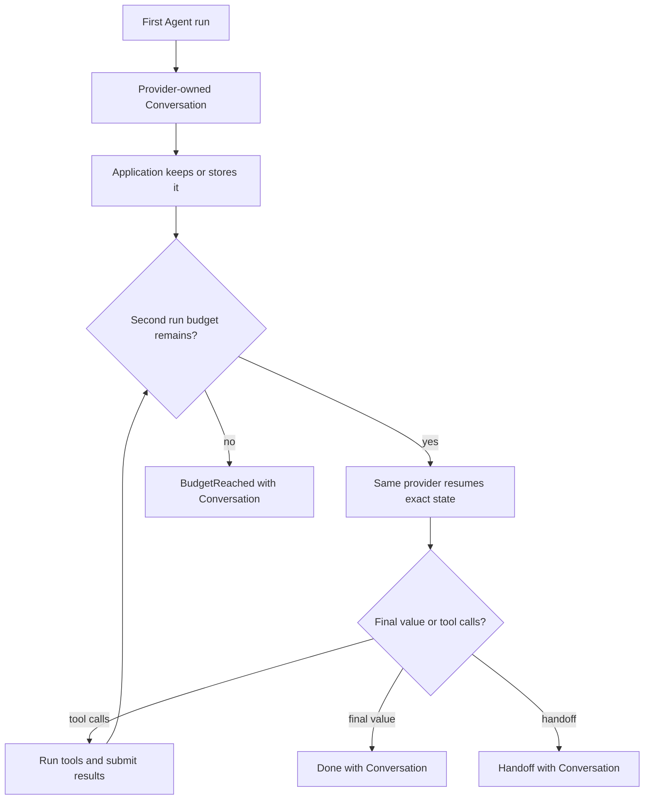
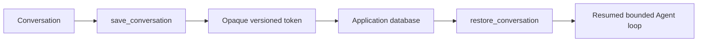
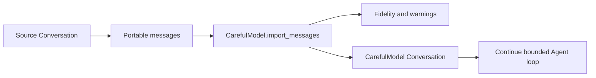

# Conversations and resuming

An Agent returns a `Conversation` with the exact provider state needed to
continue. Pass it back to `Agent.new` when the next run uses the same provider.

## Utilities used

| Utility | What it does |
| --- | --- |
| `Conversation` | Preserves exact continuation state |
| `conversation.messages()` | Returns portable, editable messages |
| `Agent.new(conversation = ...)` | Continues the exact conversation |
| `save_conversation` | Produces an opaque token for later restoration |

## Example

```baml
class Resolution {
  reply: string,
  resolved: bool,
}

function lookup_order(order_id: string) -> string {
  orders.get_status(order_id)
}

function ResolveTicket(message: string) -> Resolution {
  provider: SupportModel
  prompt: `
    Continue resolving this support ticket.

    ${message}

    ${ctx.output_format}
  `
  tools: [lookup_order]
}

let first = ResolveTicket.task(
  "Find order-42 and tell me what we still need.",
).run(
  runner = ai.run.Agent.new(max_steps = 2),
);

let conversation = match (first) {
  let done: ai.Done<Resolution> => done.conversation,
  let stopped: ai.BudgetReached => stopped.conversation,
  let handoff: ai.Handoff => handoff.conversation,
};

let continued = ResolveTicket.task(
  "The customer confirmed the shipping address. Continue.",
).run(
  runner = ai.run.Agent.new(
    conversation = conversation,
    max_steps = 6,
  ),
)
```

### What happens



### Illustrative output

```console
[INFO] first run stopped after 2 steps
[INFO] retained conversation: provider = "support-model"
[INFO] resuming conversation with 1 completed tool call
[INFO] continued run returned Done<Resolution>
```

The runner checks that the selected provider owns the conversation before any
request is sent. Provider state may contain more than visible messages, such
as tool-call IDs, encrypted reasoning blocks, or continuation handles.

## Save it for another process

```baml
let token = SupportModel.save_conversation(conversation);
database.save("ticket-42", baml.json.stringify(token));

let stored = baml.json.from_string<ai.ConversationToken>(
  database.load("ticket-42"),
);

let restored = SupportModel.restore_conversation(stored);

let outcome = ResolveTicket.task("Continue.").run(
  runner = ai.run.Agent.new(conversation = restored),
)
```

### What happens



### Illustrative output

```console
[INFO] saved conversation token: provider = "support-model", version = 1
[INFO] loaded token for ticket-42
[INFO] restored provider-owned conversation
[INFO] resumed ResolveTicket
```

The token is opaque and versioned. It contains continuation coordinates, not
application credentials.

## Move to another provider

A conversation belongs to one provider. To switch, export portable messages
and let the destination provider import them:

```baml
let imported = CarefulModel.import_messages(conversation.messages());

log.info(imported.fidelity);
log.info(imported.warnings);

let outcome = ResolveTicket
  .task("Give the final recommendation.")
  .with_provider(CarefulModel)
  .run(
    runner = ai.run.Agent.new(
      conversation = imported.conversation,
    ),
  )
```

### What happens



### Illustrative output

```console
[INFO] exported 6 portable messages
[INFO] imported conversation into CarefulModel
[WARN] import fidelity: messages-only
[INFO] continued with provider = "careful-model"
```

The import reports whether the move was exact, messages-only, or lossy.
Switching provider labels without importing state is never a valid resume.
