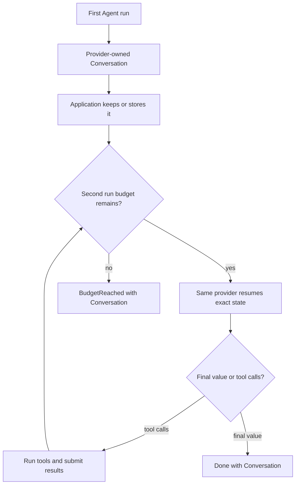

# Conversations and resuming

An Agent returns a `Conversation` with the exact provider state needed to
continue. Pass it back to `Agent.new` when the next run uses the same provider.

## Utilities used

| Utility | What it does |
| --- | --- |
| `Conversation` | Preserves exact continuation state |
| `conversation.messages()` | Returns portable, editable messages |
| `conversation.append_message(...)` | Adds one fresh user message without flattening exact state |
| `conversation.append_messages(...)` | Atomically adds a batch of fresh user messages |
| `Agent.new(conversation = ...)` | Continues the exact conversation |
| `Agent.new(cancel = ...)` | Requests a resumable stop at a committed boundary |
| `Interrupted` | Returns the last committed conversation and step count |
| `save_conversation` | Produces an opaque token for later restoration |

## Example

The example uses the shared support-ticket models (`SupportTicket`,
`Resolution`, `sample_ticket()`), the shared tool `search_knowledge`, and the
shared provider values `fast_model()` (an `openai.OpenAIProvider`) and `careful_model()`
(an `anthropic.AnthropicProvider`).

```baml
function ResolveTicketWithTools(ticket: SupportTicket) -> Resolution {
  provider: fast_model()
  prompt: `
    Resolve ticket ${ticket.id}. Use the available tools before answering.

    ${ctx.output_format}
  `
  tools: [search_knowledge]
}

let ticket = sample_ticket();

let first = ResolveTicketWithTools@task(ticket).run(
  runner = ai.run.Agent<Resolution>.new(
    budget = ai.Budget { max_steps: 2, max_cost_usd: null },
  ),
);

let conversation = match (first) {
  let done: ai.Done<Resolution> => done.conversation,
  let stopped: ai.BudgetReached => stopped.conversation,
  let handoff: ai.Handoff => throw baml.errors.Unsupported {
    message: "resolve the handoff call before resuming: " + handoff.call.name,
  },
  let interrupted: ai.Interrupted => interrupted.conversation,
};

let continued = ResolveTicketWithTools@task(ticket).run(
  runner = ai.run.Agent<Resolution>.new(
    conversation = conversation,
    budget = ai.Budget { max_steps: 6, max_cost_usd: null },
  ),
)
```

### What happens



### Illustrative output

```console
[INFO] first run stopped after 2 steps
[INFO] retained conversation: provider = "openai"
[INFO] resuming conversation with 1 completed tool call
[INFO] continued run returned Done<Resolution>
```

When a conversation is passed, the runner resumes with the provider that owns
it — the conversation is authoritative continuation state. Provider state may
contain more than visible messages, such as tool-call IDs, encrypted reasoning
blocks, or continuation handles. Provider conversations also record a
versioned output fingerprint containing both the nominal type and a canonical
JSON Schema. An Agent rejects a missing fingerprint, a different type, or a
same-named type whose structure changed before sending another request.

## Start a fresh user turn

Do not rebuild a completed conversation from `conversation.messages()` merely
to add the next user message. That would discard response IDs, encrypted
reasoning blocks, thought signatures, and other provider-owned continuation
state. Append to the exact conversation instead:

```baml
let first = ResolveTicketWithTools@task(ticket)
  .run(runner = ai.run.Agent<Resolution>.new());

let continued = match (first) {
  let done: ai.Done<Resolution> => {
    done.conversation.append_message(
      ai.ChatMessage.user("Check whether the same issue affected invoice 42."),
    )
  },
  _ => throw baml.errors.Unsupported {
    message: "this example expects the first turn to finish",
  },
};

let second = ResolveTicketWithTools@task(ticket).run(
  runner = ai.run.Agent<Resolution>.new(
    conversation = continued,
  ),
)
```

`append_message` and `append_messages` are local operations. They do not make
an HTTP request. The next `Agent.run` resumes the existing conversation and
performs the next provider step. The existing conversation remains
authoritative for provider identity and output type; the task still supplies
the matching `T`, tool roster, runner policy, and budgets.

The application API dispatches through the conversation owner. Providers
implement the lower-level `ai.ConversationAppendProvider` capability:

```baml
interface ConversationAppendProvider requires AgentProvider {
  function append_messages(
    self,
    conversation: ai.Conversation,
    messages: ai.Messages,
  ) -> ai.Conversation
}
```

Current rules are deliberately narrow:

- every appended message must have role `User`;
- every appended part must be portable text;
- the complete batch is validated before either the portable or provider wire
  history is mutated;
- the exact provider instance that owns the conversation performs the append;
- the output-type fingerprint is preserved unchanged;
- unresolved provider tool calls must be completed through `submit` first.

A committed `submit` boundary is appendable. For example, cooperative
interruption may return after application tool effects have run and their
correlated results have been recorded, but before the next provider request.
Appending a user message keeps those resolved results in the next request; it
does not execute the tools again. Provider-internal result functions used for
typed output are closed in the wire history in the same way.

OpenAI Responses, Anthropic Messages, Google AI Gemini, and Vertex Gemini
support exact append in native and prompt-tool modes. Native adapters retain
their provider-specific state:

| Provider | Exact state retained while appending |
| --- | --- |
| OpenAI Responses | `previous_response_id`, pending resolved input items, and response output state |
| Anthropic Messages | complete content blocks, including signed/opaque thinking blocks |
| Google AI / Vertex Gemini | complete `contents`, including `thoughtSignature` fields |
| Prompt-tool modes | original task render recipe and the in-process text-tool transcript |

`ToolMode.Prompt` append is exact only within the live process because those
conversations retain a render closure and cannot currently be sealed by
`save_conversation`.

Reliability wrappers preserve this behavior. `ai.retry` delegates append to
its exact inner conversation. `ai.fallback` delegates to the currently active
member and pins itself to that member after a successful append; switching
members afterward would lose the appended provider-owned state. If an owner
does not implement `ConversationAppendProvider`,
`conversation.append_message(...)` throws `baml.errors.Unsupported`.

## Interrupt and resume an Agent

Cooperative interruption retains exact continuation state without returning
half of a tool transaction:

```baml
let cancel = baml.spawn.CancelToken.new();
let running = spawn {
  ResolveTicketWithTools@task(ticket).run(
    runner = ai.run.Agent<Resolution>.new(cancel = cancel),
  )
};

// Called later by an application supervisor.
let _ = cancel.cancel();

let checkpoint = match (await running) {
  let interrupted: ai.Interrupted => interrupted.conversation,
  let done: ai.Done<Resolution> => done.conversation,
  let stopped: ai.BudgetReached => stopped.conversation,
  let handoff: ai.Handoff => handoff.conversation,
};

let resumed = ResolveTicketWithTools@task(ticket).run(
  runner = ai.run.Agent<Resolution>.new(
    conversation = checkpoint,
    cancel = baml.spawn.CancelToken.new(),
  ),
)
```

The Agent observes its passive cancellation token before a provider request
or after the complete tool-result batch has been submitted. Cancellation
during a request or tool dispatch is deferred to the next such boundary. The
returned conversation therefore has no pending application calls and can be
passed directly to a new Agent without replaying committed tools.

Do not call `running.cancel()` when continuation state is required.
`Future.cancel()` makes the Future itself terminal and `await` throws
`baml.panics.Cancelled`; it cannot return `ai.Interrupted`. Likewise, do not
attach the same token to `baml.spawn.options(cancel = ...)`.

A final value or handoff returned by the model step racing cancellation wins
over interruption. These outcomes are already terminal. Tool effects cannot
be rolled back, so a slow or externally visible effect is allowed to finish
before the resumable interruption is returned.

## Save it for another process

`save_conversation` and `restore_conversation` come from
`ai.ResumableAgentProvider`. `openai.OpenAIProvider`,
`anthropic.AnthropicProvider`, and both Gemini adapters implement the flat
Agent conversation protocol for their native modes. A provider can seal and
reopen only conversations it owns:

```baml
let model = fast_model();

let token = model.save_conversation(conversation);
log.info({ "provider": token.provider, "version": token.version });

let restored = model.restore_conversation(token);

let outcome = ResolveTicketWithTools@task(ticket).run(
  runner = ai.run.Agent<Resolution>.new(conversation = restored),
)
```

### Illustrative output

```console
[INFO] saved conversation token: provider = "openai", version = 1
[INFO] restored provider-owned conversation
[INFO] resumed ResolveTicketWithTools
```

The token is an `ai.ConversationToken`: opaque and versioned. Serialize it
with `baml.json.stringify(token)` and store it anywhere. It contains
continuation coordinates, not application credentials.

For OpenAI, Anthropic, and Google, `ToolMode.Prompt` conversations retain the
original task render recipe in memory. Their `save_conversation`,
`restore_conversation`, and `import_messages` operations are unsupported in
that mode. Use `ToolMode.Native`, or start a new task from portable messages.

## Move to another provider

A conversation belongs to one provider. To switch, export portable messages
and let the destination provider import them. The destination must implement
`ai.ConversationImportProvider`. `openai.OpenAIProvider`,
`anthropic.AnthropicProvider`, and both Gemini adapters provide message import
for supported native conversations:

```baml
let destination = openai.OpenAIProvider {
  ...openai.responses(),
  model: "gpt-5.6-luna",
  api_key: baml.env.get_or_panic("OPENAI_API_KEY"),
};

let imported = destination.import_messages<Resolution>(
  conversation.messages(),
);

log.info(imported.fidelity);
log.info(imported.warnings);

let outcome = ResolveTicketWithTools@task(ticket)
  .with_provider(destination)
  .run(
    runner = ai.run.Agent<Resolution>.new(
      conversation = imported.conversation,
    ),
  )
```

### Illustrative output

```console
[INFO] exported 6 portable messages
[INFO] imported conversation into destination provider
[WARN] import fidelity: MessagesOnly
[INFO] continued with provider = "openai"
```

The `ai.ConversationFidelity` on the import reports whether the move was
`Exact`, `MessagesOnly`, or `Lossy`. Switching provider labels without
importing state is never a valid resume.

| Operation | Provider owner | Private continuation state | Reported fidelity |
| --- | --- | --- | --- |
| `conversation.append_message(...)` | Same exact instance | Preserved | Exact by construction |
| `save_conversation` / `restore_conversation` | Compatible instance/configuration | Preserved in opaque token | Exact |
| `destination.import_messages<T>(conversation.messages())` | Changes to destination | Reconstructed or discarded | Inspect `ConversationImport.fidelity` |
| Editing `conversation.messages()` alone | No provider continuation is changed | Not applied to exact state | Portable application data only |

Import transfers portable role/content history, not every provider-private
artifact. Encrypted reasoning blocks, cache handles, and provider-specific
continuation IDs can be lost. Callers must inspect `fidelity` and `warnings`
before treating an import as equivalent to a native resume.

Runnable scenarios:

```console
baml run --from crates/baml_tests/baml_src_temp2 \
  ai_scenarios.application_owned_history

baml run --from crates/baml_tests/baml_src_temp2 \
  ai_scenarios.save_and_resume
```
