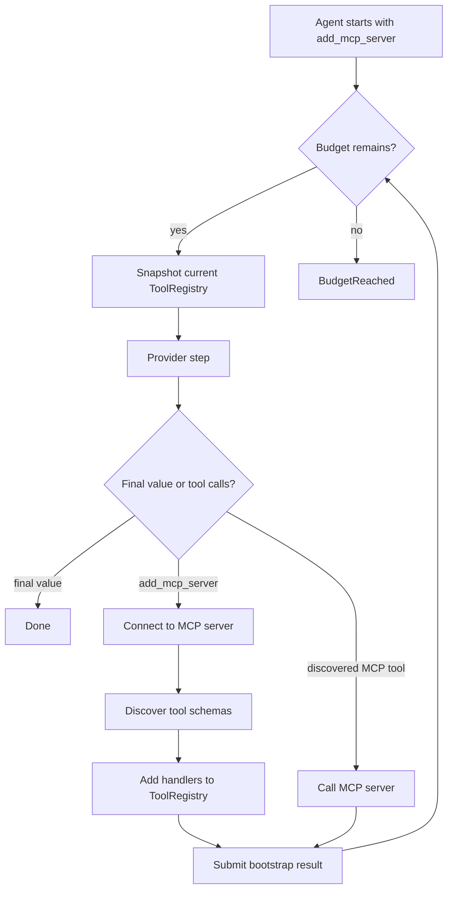
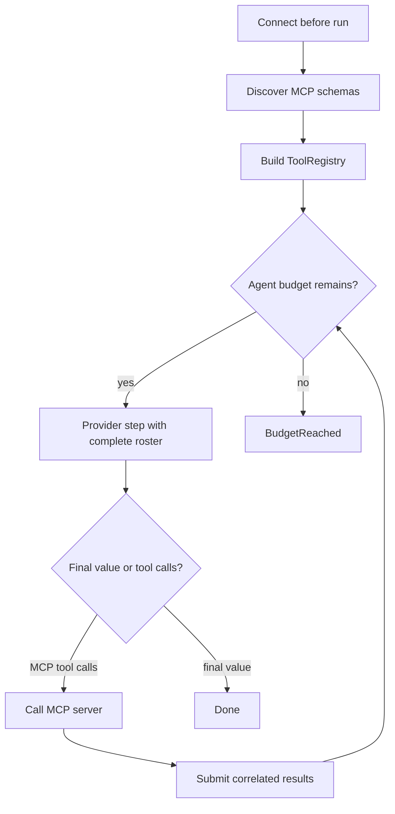

# Dynamic tools and MCP

Some agents know all their tools up front. Others discover tools while they
work. Use a `ToolRegistry` when the roster may change between model steps.

## Utilities used

| Utility | What it does |
| --- | --- |
| `ai.ToolRegistry` | Holds the active application tools |
| `ai.mcp.connect` | Opens an MCP connection |
| `connection.list_tools()` | Reads the server's tool definitions |
| `ai.tool_from_json_schema` | Turns a runtime schema and handler into a tool |

## Example

This agent starts with one tool: `add_mcp_server`. Calling it connects to a
server and adds that server's tools for the next model step.

```baml
class Resolution {
  reply: string,
  sources: string[],
}

function ResolveTicket(message: string) -> Resolution {
  provider: "openai/gpt-5.6-luna"
  prompt: `
    Resolve this support ticket.
    Add an approved MCP server if you need capabilities that are not available.

    ${message}

    ${ctx.output_format}
  `
}

class McpDiscovery {
  registry: ai.ToolRegistry,
  connections: ai.mcp.Connection[],

  /// Connect to an approved MCP server and enable its tools.
  function add_mcp_server(self, server_url: string) -> string {
    //# Connect and keep the resource alive for the whole agent run.
    let connection = ai.mcp.connect(server_url);
    self.connections.push(connection);

    //# Convert each discovered schema into an executable BAML tool.
    for (let definition in connection.list_tools()) {
      self.registry.add(
        ai.tool_from_json_schema(
          definition.name,
          definition.description,
          definition.input_schema,
          (args) -> {
            connection.call(definition.name, args)
          },
        ),
      )
    }

    "MCP tools will be available on the next step"
  }

  function close(self) -> null {
    for (let connection in self.connections) {
      connection.close()
    }
  }

  function cleanup(self) -> void {
    self.close()
  }
}

let registry = ai.ToolRegistry.new([]);
let discovery = McpDiscovery {
  registry: registry,
  connections: [],
};
registry.add(discovery.add_mcp_server);

defer { discovery.close() }

let outcome = ResolveTicket.task(
  "Find the account policy for customer-7.",
).run(
  runner = ai.run.Agent.new(
    tool_registry = registry,
  ),
)
```

### What happens



### Illustrative output

```console
[INFO] called tool: add_mcp_server("https://support.example/mcp")
[INFO] connected MCP server: support
[INFO] discovered tools: search_policy, lookup_account
[INFO] tool roster changed for step 2
[INFO] called MCP tool: search_policy({ "customer_id": "customer-7" })
```

The registry is authoritative for this run. A tool added during one step is
offered on the next step. Tool names are unique, and replacement is explicit.

The generated handlers retain the MCP connection they call. Keep connections
alive until the Agent finishes, close them with `defer`, and provide
`cleanup()` as the garbage-collection fallback.

## Simpler variation: discover before the run

If the server and roster are known before execution, connect first and pass
the resulting tools directly:

```baml
let connection = ai.mcp.connect(support_server_url);
defer { connection.close() }

let registry = ai.ToolRegistry.new([]);
for (let definition in connection.list_tools()) {
  registry.add(
    ai.tool_from_json_schema(
      definition.name,
      definition.description,
      definition.input_schema,
      (args) -> {
        connection.call(definition.name, args)
      },
    ),
  )
}

let outcome = ResolveTicket.task(message).run(
  runner = ai.run.Agent.new(
    tool_registry = registry,
  ),
)
```

### What happens



### Illustrative output

```console
[INFO] connected MCP server before Agent start
[INFO] discovered 2 tools
[INFO] Agent started with: search_policy, lookup_account
[INFO] Agent finished; closing MCP connection
```

Use this version when the model does not need to decide whether or when to add
the server.
