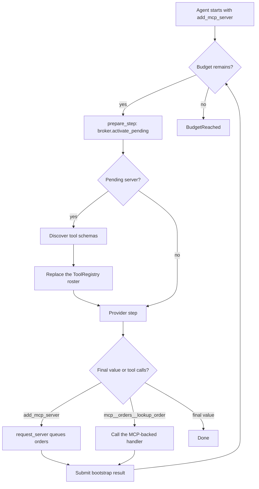
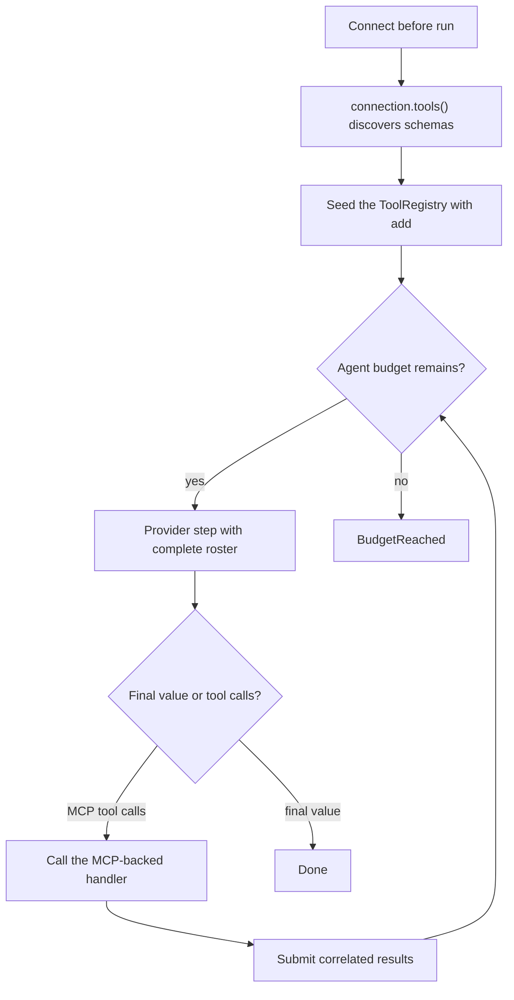

# Dynamic tools and MCP

Some agents know all their tools up front. Others discover tools while they
work. Use a `ToolRegistry` when the roster may change between model steps.

## Utilities used

| Utility | What it does |
| --- | --- |
| `ai.tools.ToolRegistry` | Holds the active application tools |
| `ai.tools.tool(...)` | Wraps a function or bound method as a tool |
| `ai.tools.tool_from_json_schema` | Turns a runtime schema and handler into a tool |
| `prepare_step` and `ai.tools.StepPlan` | Applies the complete next tool roster before a model step |

## Example

This agent starts with one tool: `add_mcp_server`. Calling it queues a server
connection, and the `prepare_step` callback activates that server's tools for
the next model step.

```baml
enum TicketPriority {
  Low
  Normal
  Urgent
}

class Resolution {
  category: string,
  priority: TicketPriority,
  summary: string,
  reply: string,
}

function McpBootstrap(order_id: string) -> Resolution {
  provider: "openai-responses/gpt-5.6-luna"
  prompt: `
    Find the status of order ${order_id}. You must first call add_mcp_server
    with server "orders". After that succeeds, call the newly available
    orders MCP lookup tool.

    ${ctx.output_format}
  `
}

class FakeMcpConnection {
  discoveries: int,
  looked_up_orders: string[],

  function tools(self) -> ai.tools.Tool[] throws never {
    self.discoveries = self.discoveries + 1;
    [ai.tools.tool_from_json_schema(
      "mcp__orders__lookup_order",
      "Look up an order through the connected orders MCP server.",
      {
        "type": "object",
        "properties": { "order_id": { "type": "string" } },
        "required": ["order_id"],
      },
      self.lookup_order,
    )]
  }

  function lookup_order(self, order_id: string) -> json throws never {
    self.looked_up_orders.push(order_id);
    { "order_id": order_id, "status": "shipped" }
  }
}

class McpServerBroker {
  connection: FakeMcpConnection,
  pending_servers: string[],
  connected_servers: string[],

  /// Connect an MCP server and add its tools on the next agent turn. Available server: orders.
  function request_server(self, server: string) -> json throws never {
    if (server != "orders") {
      return { "server": server, "status": "unknown_server" };
    }
    if (self.connected_servers.filter((name: string) -> bool { name == server }).length() == 0
        && self.pending_servers.filter((name: string) -> bool { name == server }).length() == 0) {
      self.pending_servers.push(server);
    }
    { "server": server, "status": "connection_requested" }
  }

  function activate_pending(self, current_tools: ai.tools.Tool[]) -> ai.tools.Tool[]? throws never {
    let pending = self.pending_servers.slice(0, self.pending_servers.length());
    self.pending_servers = [];
    let next_tools = current_tools.slice(0, current_tools.length());
    let changed = false;
    //# Activate MCP servers requested by the model
    for (let server in pending) {
      if (server == "orders"
          && self.connected_servers.filter((name: string) -> bool { name == server }).length() == 0) {
        //## Discover and add this server's tools to the next roster
        for (let tool in self.connection.tools()) {
          next_tools.push(tool);
          changed = true;
        }
        self.connected_servers.push(server);
      }
    }
    if (changed) { next_tools } else { null }
  }
}

function add_mcp_server_tool(broker: McpServerBroker) -> ai.tools.Tool throws never {
  ai.tools.tool(
    broker.request_server,
    name = "add_mcp_server",
  )
}

function mcp_broker() -> McpServerBroker throws never {
  McpServerBroker {
    connection: FakeMcpConnection { discoveries: 0, looked_up_orders: [] },
    pending_servers: [],
    connected_servers: [],
  }
}

let broker = mcp_broker();
let registry = ai.tools.ToolRegistry.new([add_mcp_server_tool(broker)]);

let outcome = McpBootstrap@task("O-42").run(
  runner = ai.run.Agent<Resolution>.new(
    tools = [],
    tool_registry = registry,
    prepare_step = (context) -> {
      ai.tools.StepPlan {
        provider: null,
        tools: broker.activate_pending(context.tools),
        stop: null,
      }
    },
  ),
)
```

### What happens



### Illustrative output

```console
[INFO] called tool: add_mcp_server(server = "orders")
[INFO] tool returned: { "server": "orders", "status": "connection_requested" }
[INFO] tool roster changed for step 2: add_mcp_server, mcp__orders__lookup_order
[INFO] called MCP tool: mcp__orders__lookup_order(order_id = "O-42")
[INFO] Done: Resolution { summary: "Order checked through MCP", ... }
```

The registry is authoritative for this run. A tool added during one step is
offered on the next step. Tool names are unique, and replacement is explicit:
a non-null `StepPlan.tools` is the complete next roster.

The generated handlers retain the connection they call:
`mcp__orders__lookup_order` is `connection.lookup_order` bound to the broker's
live connection, so the broker keeps that connection alive for the whole
Agent run. (`FakeMcpConnection` stands in for a real MCP client here; a
production broker speaks the MCP wire protocol but exposes the same `tools()`
surface.)

## Simpler variation: discover before the run

If the server and roster are known before execution, discover first and seed
the registry directly:

```baml
let broker = mcp_broker();

let registry = ai.tools.ToolRegistry.new([]);
for (let tool in broker.connection.tools()) {
  registry.add(tool);
}

let outcome = ResolveTicketWithTools@task(sample_ticket()).run(
  runner = ai.run.Agent<Resolution>.new(
    tool_registry = registry,
  ),
)
```

### What happens



### Illustrative output

```console
[INFO] discovered 1 tool before Agent start
[INFO] Agent started with: mcp__orders__lookup_order
[INFO] Agent finished without changing the roster
```

Use this version when the model does not need to decide whether or when to
add the server. `ResolveTicketWithTools` is the tool-using function from
[Agents and tools](agents-and-tools.md); when a `tool_registry` is passed, it
is authoritative and the function's declared tools are not offered.
