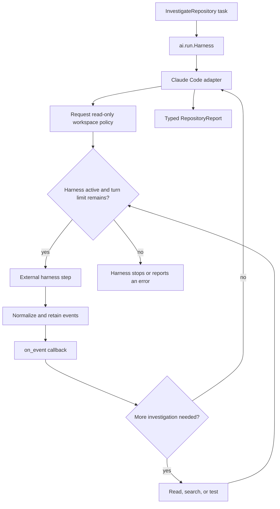
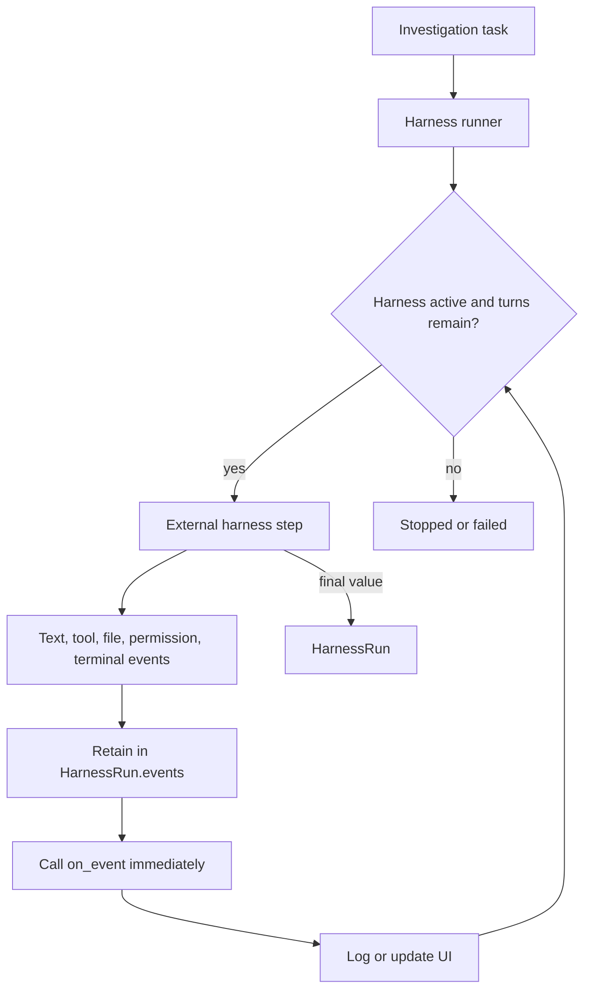
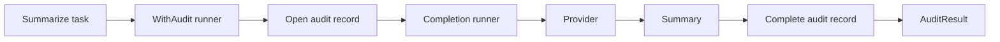

# Harnesses and custom extensions

Use a harness runner for an external coding agent or sandbox. If a lifecycle
does not exist in `ai.run`, a library can implement `Runner` and give
`Task.run` a new typed result.

## Utilities used

| Utility | What it does |
| --- | --- |
| `ai.run.Harness<T>` | Runs a task and can report normalized events through `on_event` |
| `ai.HarnessRun<T>` | Returns the typed value, retained events, and resume token |
| `ai.HarnessSession` | Advanced control for steering, interruption, save, and resume |
| `ai.Runner<Input>` | Protocol for adding a lifecycle |
| `claude_code.ClaudeCodeCli` | Adapts the local Claude Code CLI to the harness contracts |
| Provider capability interfaces | Add only the operations a provider supports |

## Example: a coding harness

```baml
class RepositoryReport {
  cause: string,
  recommendation: string,
}

function InvestigateRepository(issue: string) -> RepositoryReport {
  provider: CodingModel
  prompt: `
    Investigate this repository issue without changing files.

    ${issue}

    ${ctx.output_format}
  `
}

let report = InvestigateRepository.task(issue).run(
  runner = ai.run.Harness<RepositoryReport>.new(
    harness = ClaudeCode.new(
      allowed_tools = ["read", "search", "test"],
    ),
    cwd = "/workspace",
    permission_mode = "read-only",
    sandbox = "workspace",
    on_event = (event) -> {
      ui.show(event)
    },
  ),
)
```

### What happens



### Illustrative output

```console
[INFO] opening harness: cwd = "/workspace"
[INFO] requested policy: read-only, sandbox = "workspace"
[INFO] event: tool_call_proposed search("payment retry")
[INFO] event: tool_call_proposed test("billing::retry")
[INFO] event: run_finished
[INFO] harness returned RepositoryReport { cause: "...", ... }
```

Permissions are runtime configuration, not prompt suggestions. A harness
adapter must reject a requested boundary it cannot enforce.

`on_event` is optional and does not change the result type. The harness invokes
it while work is happening and also retains those events in `run.events`:

```baml
let seen: string[] = []

let run = InvestigateRepository.task(issue).run(
  runner = ai.run.Harness<RepositoryReport>.new(
    harness = ClaudeCode,
    cwd = "/workspace",
    permission_mode = "read-only",
    on_event = (event) -> {
      seen.push(event.kind())
      log.info(event)
    },
  ),
)

assert.equal(seen, run.events.map((event) -> { event.kind() }))
let report = run.value
```

### Event callback flow



### Illustrative output

```console
[INFO] harness run opened
[INFO] event: search "payment retry"
[INFO] event: test billing::retry passed
[INFO] event: final RepositoryReport
```

The callback is for observation. It cannot rewrite an event or change harness
policy. Use a `HarnessSession` when the application needs bidirectional
control:

```baml
let session = ClaudeCode.open(
  ai.HarnessOptions {
    cwd: "/workspace",
    permission_mode: "read-only",
    sandbox: "workspace",
    attributes: {},
  },
)

ClaudeCode.steer(session, "Inspect the retry path first.")
let run = ClaudeCode.run(
  session,
  InvestigateRepository.task(issue),
  (event) -> {
    log.info(event)
  },
)

let token = ClaudeCode.save_session(session)
```

The normal runner opens and owns a session for you. The explicit session API is
for steering, interruption, and resumption—not for ordinary event listening.

An external harness is not automatically an LLM provider just because it may
call models internally. From BAML's point of view, a coding harness owns a
larger lifecycle: workspace access, permissions, tools, events, steering, and
resumption. The harness adapter exposes those operations, while the
`ai.run.Harness` runner decides how a `Task` enters that lifecycle.

## Other kinds of runners

`Harness` is one runner shape, not the extension model for every integration.
A runner may execute a task directly, wrap another runner, combine several
executions, or move work across a process boundary.

| Runner shape | Examples | Typical output |
| --- | --- | --- |
| Direct lifecycle | Completion, stream, application tool loop, transcription | `T`, `Response<T>`, a stream, or an explicit outcome |
| Policy wrapper | Retry, fallback, timeout, rate limit, circuit breaker, audit | Usually the inner runner's output, with additional errors or policy |
| Composite | Routing, racing compatible providers, ensemble, judge-and-select | A selected `T` or a typed aggregate |
| Durable boundary | Background work, workflow engine, scheduler, human-review queue | A typed job, workflow, or review handle |
| External harness | Coding, research, browser, or data-analysis agent with its own tools and session | `HarnessRun<T>` |

A custom runner is a good fit when the extension:

1. consumes an `ai.Task` rather than one application's domain object;
2. can be reused by several LLM functions;
3. has a precise `Output` and `Error`;
4. declares only the provider capabilities it actually needs; and
5. owns clear cancellation, cleanup, event, and replay semantics.

Do not make a runner merely to rename a function call. Change an LLM function
when the prompt or typed contract changes, configure a provider value when
only model or endpoint settings change, and use an observer when code only
watches events. A runner is justified when execution semantics or the result
shape changes.

## Example: wrap an existing runner

A runner is a configured class with an associated output and error type:

```baml
class Summary {
  title: string,
  bullets: string[],
}

class AuditResult<T> {
  value: T,
  audit_id: string,
}

function Summarize(article: string) -> Summary {
  provider: "openai/gpt-5.6-luna"
  prompt: `
    Summarize this article.

    ${article}

    ${ctx.output_format}
  `
}

class WithAudit<T, P extends ai.Provider> {
  inner: ai.Runner<
    ai.Task<T, P>,
    Output = T,
    Error = ai.CallError | baml.errors.UnknownError,
  >,
  label: string,

  implements ai.Runner<ai.Task<T, P>> {
    type Output = AuditResult<T>
    type Error = ai.CallError | baml.errors.UnknownError

    function run(
      self,
      task: ai.Task<T, P>,
    ) -> AuditResult<T> throws ai.CallError | baml.errors.UnknownError {
      let audit_id = audits.start(self.label);
      let value = self.inner.run(task);
      audits.complete(audit_id);

      AuditResult<T> {
        value: value,
        audit_id: audit_id,
      }
    }
  }
}

let recorded: AuditResult<Summary> = Summarize.task(article).run(
  runner = WithAudit<Summary, openai.Chat> {
    inner: ai.run.Completion.new(),
    label: "article-summary",
  },
);

log.info(`audit record: ${recorded.audit_id}`);
let summary = recorded.value
```

### What happens



### Illustrative output

```console
[INFO] opened audit record audit_42 for article-summary
[INFO] Completion returned Summary
[INFO] completed audit record audit_42
[INFO] returned AuditResult<Summary>
```

The associated `Output` makes the return type of `task.run(...)` precise.
There is no untyped registry, and adding the runner does not require changing
BAML itself. `WithAudit` delegates the provider interaction but intentionally
changes the result from `Summary` to `AuditResult<Summary>`. If the application
only needs to copy events to a log, use an observer instead.

The example shows the successful path. A production wrapper must also mark
the audit record failed or cancelled on every non-success exit.

## Extending providers

A provider implements common identity plus only the capabilities it can
honestly execute:

```text
Provider
├── CompletionProvider
├── GenerationProvider
├── StreamingProvider
├── ToolCallingProvider
├── BackgroundProvider
├── BatchProvider
└── RealtimeProvider
```

A custom runner asks for the smallest capability it needs. A stream runner
requires `StreamingProvider`; an application tool loop requires
`ToolCallingProvider`; a durable background runner requires
`BackgroundProvider`. The constraint makes an unsupported pairing a type
error before a request starts.

Add a provider adapter when the extension changes the authentication protocol,
transport, request rendering, response parsing, provider events, or
provider-owned state. Add a runner when it changes how a `Task` is executed.
If both are new, define the provider capability first and place a reusable
runner above it. Unrelated providers do not need to implement the new
capability.

Provider implementations live in their own namespaces. An OpenAI adapter
implements `ai.*Provider` contracts from `openai`; an Anthropic adapter does so
from `anthropic`. Provider-specific request types, parsing, usage fields, and
resource state do not become part of the portable `ai` surface.

Configuration fields are the simplest extension point when an existing
provider protocol already fits. Reach for another provider interface only
when several adapters share a real multi-method capability. Reach for a runner
only when application-visible execution or its typed result changes.
