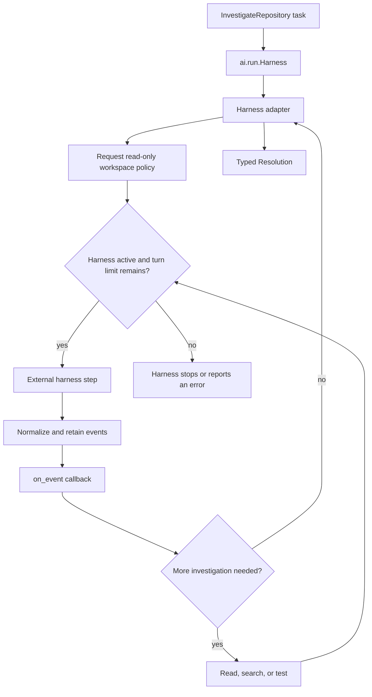
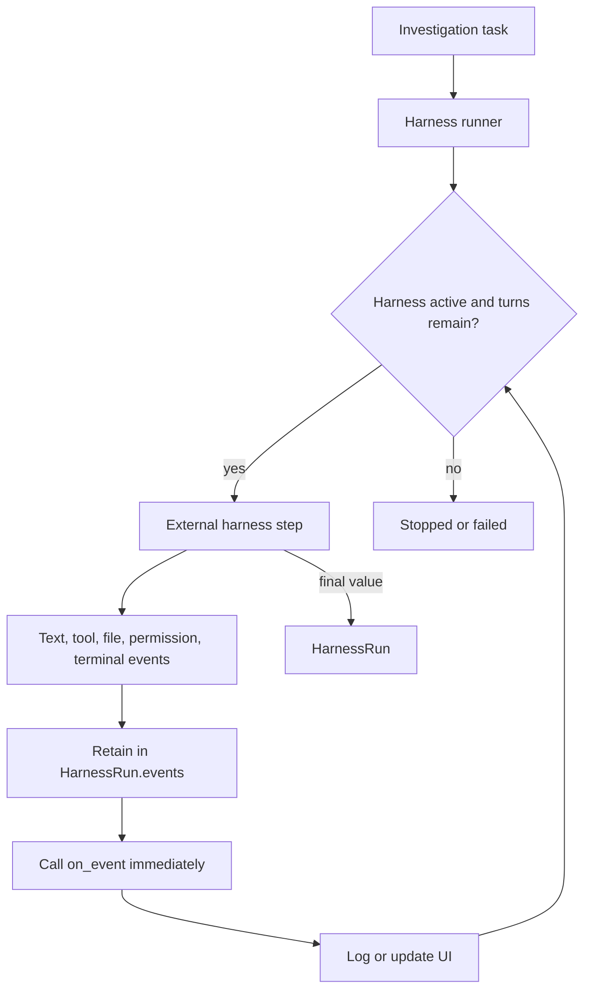

# Harnesses and custom extensions

Use a harness runner for an external coding agent or sandbox. If a lifecycle
does not exist in `ai.run`, a library can implement `ai.Runner` and give
`Task.run` a new typed result.

## Utilities used

| Utility | What it does |
| --- | --- |
| `ai.run.Harness<T>` | Runs a task and can report normalized events through `on_event` |
| `ai.harness.HarnessRun<T>` | Returns the typed value, retained events, portable history, and resume token |
| `ai.harness.HarnessSession` | Advanced control for steering, interruption, save, and resume |
| `ai.harness.Harness` | Protocol a harness adapter implements: open, run, steer, interrupt, save, restore |
| `ai.Runner<Input>` | Protocol for adding a lifecycle |
| `claude_code.ClaudeCodeCli` | Adapts the local Claude Code CLI to the harness contracts |
| Provider capability interfaces | Add only the operations a provider supports |

## Example: a coding harness

```baml
class Resolution {
  category: string,
  priority: TicketPriority,
  summary: string,
  reply: string,
}

function InvestigateRepository(ticket: SupportTicket) -> Resolution {
  provider: "openai/gpt-5.6-luna"
  prompt: `
    Investigate this support ticket and propose a resolution.
    Ticket: ${ticket.id}
    Subject: ${ticket.subject}
    Body: ${ticket.body}
    Customer tier: ${ticket.customer_tier}

    ${ctx.output_format}
  `
}

let run = InvestigateRepository@task(sample_ticket()).run(
  runner = ai.run.Harness<Resolution>.new(
    fake_model_harness(),
    cwd = "/workspace",
    permission_mode = "read-only",
    sandbox = "workspace",
    attributes = { "team": "support" },
  ),
);

let resolution: Resolution = run.value
```

`fake_model_harness()` builds an `ai.harness.ModelHarness`, an in-process
adapter that implements the full `ai.harness.Harness` contract and doubles as
the blueprint for an external implementation. A real coding harness plugs into
the same runner. `claude_code.ClaudeCodeCli` adapts the local Claude Code CLI:

```baml
let coding_harness = claude_code.ClaudeCodeCli {
  executable: "claude",
  model: "haiku",
  cwd: "/workspace",
  timeout_ms: 60000,
  max_turns: 3,
  max_application_tool_steps: 4,
  max_budget_usd: "0.10",
  permission_mode: "dontAsk",
  tools: ["WebFetch"],
  allowed_tools: ["WebFetch"],
  safe_mode: true,
  persist_session: false,
  harness_sessions: [],
}
```

### What happens



### Illustrative output

```console
[INFO] opening harness: cwd = "/workspace"
[INFO] requested policy: read-only, sandbox = "workspace"
[INFO] event: model_started model-harness(fake)
[INFO] event: run_finished
[INFO] harness returned Resolution { category: "billing", ... }
```

Permissions are runtime configuration, not prompt suggestions. A harness
adapter must reject a requested boundary it cannot enforce.

`on_event` is optional and does not change the result type. The harness invokes
it while work is happening and also retains those events in `run.events`:

```baml
let observed: string[] = [];

let run = InvestigateRepository@task(sample_ticket()).run(
  runner = ai.run.Harness<Resolution>.new(
    fake_model_harness(),
    cwd = "/workspace",
    permission_mode = "read-only",
    on_event = (event: ai.observe.AgentEvent) -> null {
      observed.push(event.kind());
      log.info(event);
      null
    },
  ),
);

assert.equal(observed.length(), run.events.length());
let resolution = run.value
```

### Event callback flow



### Illustrative output

```console
[INFO] event: model_started
[INFO] event: usage
[INFO] event: run_finished
[INFO] observed 3 events, run retained 3
```

The callback is for observation. It cannot rewrite an event or change harness
policy. Use a `HarnessSession` when the application needs bidirectional
control:

```baml
let harness = fake_model_harness();

let session = harness.open(
  ai.harness.HarnessOptions {
    cwd: "/workspace",
    permission_mode: "read-only",
    sandbox: "workspace",
    attributes: { "team": "support" },
  },
);

harness.steer(session, "Focus on billing code.");
let run = harness.run<Resolution>(
  session,
  InvestigateRepository@task(sample_ticket()),
  (event: ai.observe.AgentEvent) -> null {
    log.info(event);
    null
  },
);

let token = harness.save_session(session)
```

The normal runner opens and owns a session for you. The explicit session API is
for steering, interruption, and resumption—not for ordinary event listening.
`harness.interrupt(session)` stops the session, and
`harness.restore_session(token)` reclaims it later from the opaque token.

An external harness is not automatically an LLM provider just because it may
call models internally. From BAML's point of view, a coding harness owns a
larger lifecycle: workspace access, permissions, tools, events, steering, and
resumption. The harness adapter exposes those operations, while the
`ai.run.Harness` runner decides how a `Task` enters that lifecycle.

## Other kinds of runners

`Harness` is one runner shape, not the extension model for every integration.
A runner may execute a task directly, wrap another runner, combine several
executions, or move work across a process boundary.

| Runner shape | Examples | Typical output |
| --- | --- | --- |
| Direct lifecycle | Completion, stream, application tool loop, transcription | `T`, `ResponseWithMetadata<T>`, a stream, or an explicit outcome |
| Policy wrapper | Retry, fallback, timeout, rate limit, circuit breaker, audit | Usually the inner runner's output, with additional errors or policy |
| Composite | Routing, racing compatible providers, ensemble, judge-and-select | A selected `T` or a typed aggregate |
| Durable boundary | Background work, workflow engine, scheduler, human-review queue | A typed job, workflow, or review handle |
| External harness | Coding, research, browser, or data-analysis agent with its own tools and session | `HarnessRun<T>` |

A custom runner is a good fit when the extension:

1. consumes an `ai.Task` rather than one application's domain object;
2. can be reused by several LLM functions;
3. has a precise `Output` and `Error`;
4. declares only the provider capabilities it actually needs; and
5. owns clear cancellation, cleanup, event, and replay semantics.

Do not make a runner merely to rename a function call. Change an LLM function
when the prompt or typed contract changes, configure a provider value when
only model or endpoint settings change, and use an observer when code only
watches events. A runner is justified when execution semantics or the result
shape changes.

## Example: a custom runner

A runner is a configured class with an associated output and error type:

```baml
class NegotiatedRun {
  provider: string,
  mode: string,
  output: string,
}

class CapabilityNegotiationRunner {
  function new() -> CapabilityNegotiationRunner throws never {
    CapabilityNegotiationRunner {}
  }

  implements ai.Runner<ai.Task<Resolution>> {
    type Output = NegotiatedRun
    type Error = ai.Failure
      | baml.errors.UnknownError
      | baml.errors.Unsupported
      | baml.errors.Io
      | baml.errors.LlmClient

    function run(
      self,
      task: ai.Task<Resolution>,
    ) -> NegotiatedRun throws ai.Failure
        | baml.errors.UnknownError
        | baml.errors.Unsupported
        | baml.errors.Io
        | baml.errors.LlmClient {
      //# Narrow the erased provider to the strongest supported interaction
      match (task.provider) {
        let stream: ai.StreamingProvider => {
          let resolution = stream.stream<Resolution$stream, Resolution>(task).final();
          NegotiatedRun {
            provider: stream.name(),
            mode: "stream",
            output: resolution.reply,
          }
        },
        let completion: ai.CompletionProvider => {
          let resolution = completion.complete<Resolution>(task).value;
          NegotiatedRun {
            provider: completion.name(),
            mode: "completion",
            output: resolution.reply,
          }
        },
        _ => throw baml.errors.Unsupported {
          message: "task provider cannot resolve a ticket: " + task.provider_name(),
        },
      }
    }
  }
}

let negotiated: NegotiatedRun = InvestigateRepository@task(sample_ticket()).run(
  runner = CapabilityNegotiationRunner.new(),
);

log.info(`selected mode: ${negotiated.mode}`);
let reply = negotiated.output
```

### Illustrative output

```console
[INFO] task provider supports completion only
[INFO] completion returned Resolution
[INFO] returned NegotiatedRun { provider: "openai(gpt-5.6-luna)", mode: "completion", ... }
```

The associated `Output` makes the return type of `task.run(...)` precise.
There is no untyped registry, and adding the runner does not require changing
BAML itself. `CapabilityNegotiationRunner` delegates the provider interaction
but intentionally changes the result from `Resolution` to `NegotiatedRun`. If
the application only needs to copy events to a log, use an observer instead.

The example shows the successful path. A production runner that acquires
resources must also release them on every non-success exit, for example with a
`defer` block around remote cleanup.

## Extending providers

A provider implements common identity plus only the capabilities it can
honestly execute:

```text
ai.Provider
├── ai.CompletionProvider
├── ai.GenerationProvider
├── ai.StreamingProvider
├── ai.tools.ToolCallingProvider
├── ai.jobs.BackgroundProvider
├── ai.jobs.BatchProvider
├── ai.transcription.TranscriptionProvider
└── ai.realtime.RealtimeProvider
```

A custom runner asks for the smallest capability it needs. A stream runner
requires `ai.StreamingProvider`; an application tool loop requires
`ai.tools.ToolCallingProvider`; a durable background runner requires
`ai.jobs.BackgroundProvider`. The runner narrows `task.provider` to that
capability and rejects an unsupported pairing with `baml.errors.Unsupported`
before a request starts.

Add a provider adapter when the extension changes the authentication protocol,
transport, request rendering, response parsing, provider events, or
provider-owned state. Add a runner when it changes how a `Task` is executed.
If both are new, define the provider capability first and place a reusable
runner above it. Unrelated providers do not need to implement the new
capability.

Provider implementations live in their own namespaces. An OpenAI adapter
implements `ai.*Provider` contracts from `openai`; an Anthropic adapter does so
from `anthropic`. Provider-specific request types, parsing, usage fields, and
resource state do not become part of the portable `ai` surface.

Configuration fields are the simplest extension point when an existing
provider protocol already fits. Reach for another provider interface only
when several adapters share a real multi-method capability. Reach for a runner
only when application-visible execution or its typed result changes.
