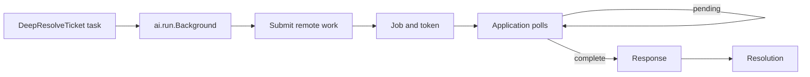
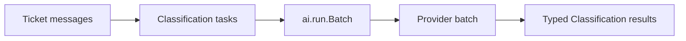
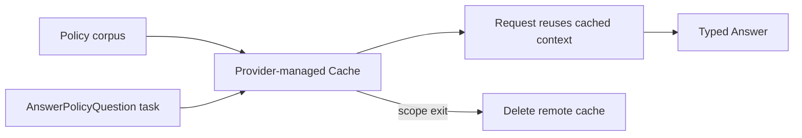

# Jobs, batches, and caches

Background jobs, batches, and provider-managed caches outlive one immediate
function call. They return resources that can be polled, resumed, cancelled,
or deleted.

## Utilities used

| Utility | What it does |
| --- | --- |
| `ai.run.Background` | Starts remote work and returns `Job<T>` |
| `ai.run.Batch<T>` | Submits homogeneous tasks together |
| `ai.create_cache` | Creates provider-managed context |
| `openai.Responses` | Implements durable OpenAI background jobs |
| `google.Gemini` | Implements Gemini managed caches |
| `defer` | Cleans up a resource on every scope exit |

## Example: background work

```baml
class Resolution {
  reply: string,
  resolved: bool,
}

function DeepResolveTicket(message: string) -> Resolution {
  provider: BackgroundModel
  prompt: `
    Investigate and resolve this support ticket.

    ${message}

    ${ctx.output_format}
  `
}

function wait_for_resolution(
  job: ai.Job<Resolution>,
) -> Resolution {
  while (true) {
    match (job.poll()) {
      let response: ai.Response<Resolution> => return response.value,
      null => baml.sys.sleep(baml.time.Duration.from_seconds(1)),
    }
  }

  baml.sys.panic("unreachable")
}

function resolve_ticket_in_background(
  message: string,
) -> Resolution {
  let job: ai.Job<Resolution> = DeepResolveTicket
    .task(message)
    .run(
      runner = ai.run.Background.new(
        idempotency_key = "ticket-1042:deep-resolution",
      ),
    );

  defer {
    if (job.status() == ai.JobStatus.Pending) {
      job.cancel()
    }
  }

  wait_for_resolution(job)
}
```

### What happens



### Illustrative output

```console
[INFO] submitted background job: job_1042
[INFO] persisted resume token for job_1042
[INFO] poll: pending
[INFO] poll: running
[INFO] poll: completed
[INFO] received Resolution { resolved: true, ... }
```

Persist `job.token()` when another worker will continue polling. The token
contains stable resume coordinates, not credentials. `cancel()` is idempotent
and cooperates with the resource's cleanup policy.

## Variation: submit a batch

```baml
class Classification {
  category: string,
}

function ClassifyTicket(message: string) -> Classification {
  provider: BatchModel
  prompt: `
    Classify this support ticket.

    ${message}

    ${ctx.output_format}
  `
}

function classify_tickets(
  messages: string[],
) -> Classification[] {
  let tasks = messages.map((message) -> {
    ClassifyTicket.task(message)
  });

  let batch: ai.Batch<Classification> = ai.run.Batch<Classification>.new(
    provider = BatchModel,
    idempotency_key = "daily-ticket-classification",
  ).run(tasks);

  defer {
    if (batch.status() == ai.JobStatus.Pending) {
      batch.cancel()
    }
  }

  while (batch.status() == ai.JobStatus.Pending) {
    baml.sys.sleep(baml.time.Duration.from_seconds(1))
  }

  batch.results().map((response) -> { response.value })
}
```

### What happens



### Illustrative output

```console
[INFO] submitted batch: 250 Classification tasks
[INFO] batch status: validating
[INFO] batch status: completed
[INFO] collected 250 Classification results
```

The simple batch API is homogeneous: every item returns `Classification`. For
mixed task types, use `BatchQueue`; each submitted item receives its own typed
result handle.

## Variation: reuse provider-managed context

```baml
class Answer {
  text: string,
}

function AnswerPolicyQuestion(question: string) -> Answer {
  provider: CachedModel
  prompt: `
    Answer this policy question.

    ${question}

    ${ctx.output_format}
  `
}

function answer_with_policy_cache(
  policy_corpus: ai.Messages,
  question: string,
) -> Answer {
  let cache = ai.create_cache(
    provider = CachedModel,
    messages = policy_corpus,
    ttl = baml.time.Duration.from_minutes(30),
  );

  defer { cache.delete() }

  cache.run(AnswerPolicyQuestion.task(question)).value
}
```

### What happens



### Illustrative output

```console
[INFO] created provider cache: policy-corpus, ttl = 30m
[INFO] cache hit for AnswerPolicyQuestion
[INFO] returned Answer { text: "...", ... }
[INFO] deleted provider cache
```

Use `defer` when the lifetime is known. Resource `cleanup()` methods provide a
garbage-collection fallback, but remote resources should not wait on eventual
GC during normal production execution.
