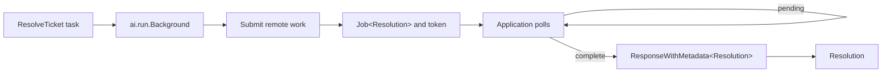

# Jobs, batches, and caches

Background jobs, batches, and provider-managed caches outlive one immediate
function call. They return resources that can be polled, resumed, cancelled,
or deleted.

## Utilities used

| Utility | What it does |
| --- | --- |
| `ai.run.Background<T>` | Runner: starts remote work and returns an `ai.jobs.Job<T>` handle |
| `ai.run.Batch<T>` | Submits homogeneous tasks together as one `ai.jobs.Batch<T>` |
| `google.CreateCache` | Explicit named caches (Gemini-specific) |
| `google.Gemini` | Implements Gemini managed caches |
| `openai.Responses` | Implements durable OpenAI background jobs |
| `defer` | Cleans up a resource on every scope exit |

A `Task<T>` is work that has not started; an `ai.jobs.Job<T>` is a handle to
work a provider has already accepted. `ai.run.Background<T>` is the runner
that turns the first into the second; `poll()`, `cancel()`, and `token()`
live on the handle.

## Example: background work

```baml
class Resolution {
  category: string,
  priority: TicketPriority,
  summary: string,
  reply: string,
}

function ResolveTicket(ticket: SupportTicket) -> Resolution {
  provider: openai.Responses {
    model: "gpt-5.6-luna",
    api_key: baml.env.get_or_panic("OPENAI_API_KEY"),
    base_url: null,
  }
  prompt: `
    Resolve this support ticket.
    Subject: ${ticket.subject}
    Body: ${ticket.body}

    ${ctx.output_format}
  `
}

function wait_for_resolution(
  job: ai.jobs.Job<Resolution>,
) -> Resolution {
  while (true) {
    match (job.poll()) {
      let response: ai.ResponseWithMetadata<Resolution> => return response.value,
      null => {
        baml.sys.sleep(baml.time.Duration.from_seconds(1)) catch (e) {
          _ => null
        };
      },
    }
  }

  baml.sys.panic("unreachable")
}

function resolve_ticket_in_background(
  ticket: SupportTicket,
) -> Resolution {
  let job: ai.jobs.Job<Resolution> = ResolveTicket@task(ticket)
    .run(
      runner = ai.run.Background<Resolution>.new(
        idempotency_key = "ticket-" + ticket.id,
      ),
    );

  defer {
    if (job.status() == ai.jobs.JobStatus.Pending) {
      job.cancel()
    }
  }

  wait_for_resolution(job)
}
```

### What happens



### Illustrative output

```console
[INFO] submitted background job: ticket-T-100
[INFO] persisted resume token for ticket-T-100
[INFO] poll: pending
[INFO] poll: pending
[INFO] poll: complete
[INFO] received Resolution { category: "billing", ... }
```

Persist `job.token()` when another worker will continue polling. The token
contains stable resume coordinates, not credentials; a fresh process rebuilds
a handle from it with `provider.resume_job<Resolution>(token)` and its own
configured provider. `cancel()` is idempotent and cooperates with the
resource's cleanup policy.

## Variation: submit a batch

```baml
function resolve_tickets_as_batch(
  tickets: SupportTicket[],
) -> Resolution[] {
  let provider = ai.testing.FakeBatchProvider { inner: fake_resolution() };

  let tasks = tickets.map((ticket: SupportTicket) -> ai.Task<Resolution> {
    ResolveTicket@task(ticket).with_provider(provider)
  });

  let batch: ai.jobs.Batch<Resolution> = ai.run.Batch<Resolution>.new(
    provider,
    idempotency_key = "daily-ticket-resolution",
  ).run(tasks);

  defer {
    if (batch.status() == ai.jobs.JobStatus.Pending) {
      batch.cancel()
    }
  }

  while (batch.status() == ai.jobs.JobStatus.Pending) {
    baml.sys.sleep(baml.time.Duration.from_seconds(1)) catch (e) {
      _ => null
    };
  }

  batch.results().map((response: ai.ResponseWithMetadata<Resolution>) -> Resolution {
    response.value
  })
}
```

### Illustrative output

```console
[INFO] submitted batch: 250 ResolveTicket tasks
[INFO] batch status: pending
[INFO] batch status: complete
[INFO] collected 250 Resolution results
```

The batch runner consumes the task collection as a whole, so its provider is
named up front and must implement `ai.jobs.BatchProvider`. The example uses
the deterministic `ai.testing.FakeBatchProvider` from the scenario corpus;
any batch-capable adapter fits the same slot. The batch API is homogeneous:
every item returns `Resolution`, and `results()` preserves each item's
`ResponseWithMetadata<Resolution>`. Mixed output types belong in separate
batches.

## Variation: reuse provider-managed context

Named caches are not a portable concept: only Gemini exposes them, and
OpenAI/Anthropic manage prompt caching transparently on the wire. The portable
`ai` namespace therefore has no cache API. Providers that cache transparently
just do it; Gemini's named caches live in the `google` namespace, and the
Gemini adapter plumbs an active cache into every request of a conversation —
explicit `google.CreateCache` / `cache.delete()` is for applications that
manage cache lifetime themselves.

```baml
function answer_with_policy_cache(
  policy_corpus: ai.Messages,
  ticket: SupportTicket,
) -> Resolution {
  let provider = google.Gemini {
    model: "gemini-2.5-flash",
    api_key: baml.env.get_or_panic("GOOGLE_API_KEY"),
    base_url: null,
    created_keys: [],
    deleted_keys: [],
  };

  let cache = google.CreateCache.new(
    policy_corpus,
    baml.time.Duration.from_minutes(30),
  ).run(provider);

  defer { cache.delete() }

  cache.run<Resolution>(ResolveTicket@task(ticket)).value
}
```

### Illustrative output

```console
[INFO] created provider cache: policy-corpus, ttl = 30m
[INFO] cache hit for ResolveTicket
[INFO] returned Resolution { category: "billing", ... }
[INFO] deleted provider cache
```

Cache creation is provider-first: there is no task until the cache resource
exists, so `google.CreateCache.new(messages, ttl)` runs against the provider
and returns the `Cache` resource. Use `defer` when the lifetime is known.
Remote resources should not wait on eventual garbage collection during normal
production execution; delete them explicitly on every exit path.
