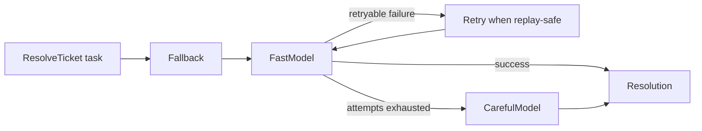
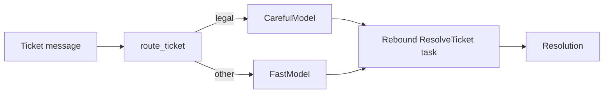

# Routing, retry, and fallback

Routing chooses a provider before work starts. Retry repeats a safe failure.
Fallback moves to another compatible provider after a failure.

## Utilities used

| Utility | What it does |
| --- | --- |
| `task.with_provider(...)` | Routes one task before execution |
| `ai.run.Retry` | Repeats the inner runner when replay is safe |
| `ai.run.Fallback` | Tries compatible providers in order |
| `ReplayPolicy` | Describes whether an operation may be repeated |

## Example

```baml
class Resolution {
  reply: string,
  resolved: bool,
}

function ResolveTicket(message: string) -> Resolution {
  provider: FastModel
  prompt: `
    Resolve this support ticket.

    ${message}

    ${ctx.output_format}
  `
}

let task = ResolveTicket.task("I was charged twice.");

let resolution = task.run(
  runner = ai.run.Fallback.new(
    runner = ai.run.Retry.new(
      runner = ai.run.Completion.new(),
      max_attempts = 3,
    ),
    providers = [
      FastModel,
      CarefulModel,
    ],
  ),
)
```

### What happens



### Illustrative output

```console
[INFO] provider attempt: FastModel
[WARN] FastModel returned rate_limit; replay is safe
[INFO] retrying FastModel: attempt 2 of 3
[WARN] FastModel attempts exhausted
[INFO] falling back to CarefulModel
[INFO] CarefulModel returned Resolution { resolved: true, ... }
```

The wrappers preserve the inner runner's result type, so this expression still
returns `Resolution`. Before each fallback attempt, the task is rebound and
re-rendered for that provider.

Fallback is ordered recovery, not load balancing. It continues only after a
failure that is retryable and safe to replay. Its provider list must contain at
least one provider; an empty fallback is rejected as invalid configuration.

## Route before running

Use ordinary application code when tenant policy, data residency, cost, or
request type can choose the provider up front:

```baml
function route_ticket(message: string) -> ai.CompletionProvider {
  if (message.to_lower_case().contains("legal")) {
    CarefulModel
  } else {
    FastModel
  }
}

let message = "I need help with a legal notice.";
let routed = ResolveTicket
  .task(message)
  .with_provider(route_ticket(message));

let resolution = routed.run(
  runner = ai.run.Completion.new(),
)
```

### What happens



### Illustrative output

```console
[INFO] route_ticket matched policy: legal
[INFO] rebound task to CarefulModel
[INFO] rendered provider-specific request
[INFO] Completion returned Resolution
```

The router returns the capability required by the runner. An incompatible
provider is therefore a type error instead of a failed request.

## Be careful after side effects

Retrying a read is different from retrying a refund. After an application tool
succeeds, a later model failure does not make the entire Agent run replay-safe.
Give remote effects idempotency keys and configure replay policy explicitly:

```baml
function issue_refund(
  order_id: string,
  idempotency_key: string,
) -> string {
  refunds.issue(order_id, idempotency_key)
}
```

When policy cannot prove safety, retry fails with `CannotRetry` and explains
which boundary made replay unsafe.
