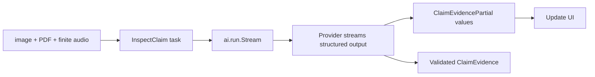
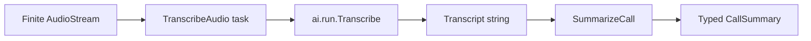

# Streaming, media, and transcription

LLM functions can accept images, PDFs, and finite audio as typed values. Run
the same task with `ai.run.Stream` when the application should receive partial
output before the final typed value.

## Utilities used

| Utility | What it does |
| --- | --- |
| `image`, `pdf`, `audio` | Typed finite media values |
| `ai.run.Stream<TPartial, T>` | Produces partial values and one final `T` |
| `ai.AudioStream` | A finite sequence of audio chunks |
| `ai.run.Transcribe` | Converts finite audio to text |

## Example

```baml
class ClaimEvidence {
  merchant: string?,
  amount: float?,
  notes: string[],
}

function InspectClaim(
  receipt: image,
  statement: pdf,
  explanation: audio,
) -> ClaimEvidence {
  provider: "openai/gpt-5.6-luna"
  prompt: `
    Review the receipt, statement, and recorded explanation.

    Receipt:
    ${receipt}

    Statement:
    ${statement}

    Explanation:
    ${explanation}

    ${ctx.output_format}
  `
}

function inspect_claim_with_progress(
  receipt_image: image,
  bank_statement: pdf,
  customer_recording: audio,
) -> ClaimEvidence {
  let stream = InspectClaim
    .task(receipt_image, bank_statement, customer_recording)
    .run(
      runner = ai.run.Stream<ClaimEvidencePartial, ClaimEvidence>.new(),
    );

  for (let partial in stream) {
    ui.show_claim_progress(partial)
  }

  stream.final()
}
```

### What happens



### Illustrative output

```console
[INFO] InspectClaim stream opened with image, PDF, and audio
[INFO] partial: merchant = "Acme"
[INFO] partial: amount = 42.50
[INFO] partial: notes += "statement contains a duplicate charge"
[INFO] stream finalized as ClaimEvidence
```

`ClaimEvidencePartial` is the partial view of the declared output. It may have
unfinished fields while bytes are arriving. `stream.final()` is parsed and
validated as the full `ClaimEvidence`.

The provider adapter chooses the wire representation for each media value.
The LLM function keeps a provider-independent signature.

## Transcribe, then run an LLM function

Transcription is a separate bounded operation. This keeps audio transport
settings out of the summarization prompt:

`ai.TranscriptionProvider` is the portable capability. A concrete adapter such
as `openai.AudioTranscription` owns the provider's audio encoding, endpoint,
response parsing, and usage fields.

```baml
class CallSummary {
  customer_request: string,
  promised_action: string?,
}

function SummarizeCall(transcript: string) -> CallSummary {
  provider: "openai/gpt-5.6-luna"
  prompt: `
    Summarize this support call.

    ${transcript}

    ${ctx.output_format}
  `
}

function TranscribeAudio(audio: ai.AudioStream) -> string {
  provider: TranscriptionModel
  prompt: `
    Transcribe this finite customer-support recording.
  `
}

function summarize_recorded_call(
  recorded_audio_stream: ai.AudioStream,
) -> CallSummary {
  let transcript = TranscribeAudio
    .task(recorded_audio_stream)
    .run(
      runner = ai.run.Transcribe.new(
        language = "en",
        prompt = "Customer-support call",
      ),
    );

  SummarizeCall(transcript)
}
```

### What happens



### Illustrative output

```console
[INFO] transcription started: language = "en"
[INFO] transcription completed: 3m 12s of audio
[INFO] SummarizeCall started
[INFO] returned CallSummary { customer_request: "...", ... }
```

The task owns the audio argument, the `TranscriptionModel` provider, and the
function's prompt. `Transcribe` owns only transcription policy such as the
language and an optional vocabulary-hint override. Like every other runner, it
is selected through `task.run(...)`; callers do not invoke the runner with raw
audio.

Use `TranscribeWithMeta` when you also need the transcription request ID and
usage. It runs the same task and returns `ai.Response<string>`. A finite
`AudioStream` ends; a live microphone belongs to a `LiveSession` or
`VoiceAgent`.

## Retry boundary

Before the first partial becomes visible, a safe policy may replay the whole
stream. After the application observes output, replay could duplicate text or
effects. Streaming runners track that boundary so retry policy can fail
closed.
