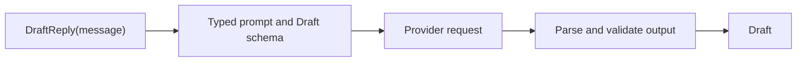
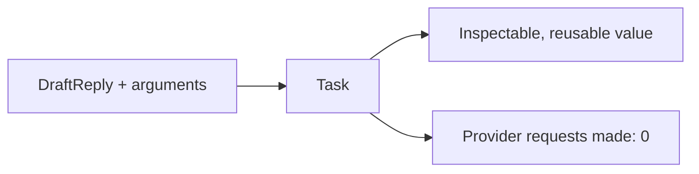
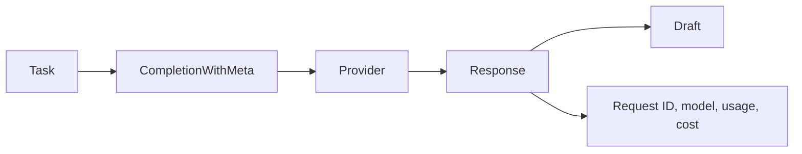
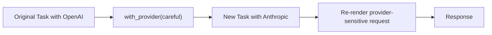

# Tasks, runners, and results

An LLM function has two entry points: call it now, or create a task and choose
a runner.

## Utilities used

| Utility | Result |
| --- | --- |
| Direct call | The declared `T` |
| `ai.run.Completion` | `T` |
| `ai.run.CompletionWithMeta` | `ai.Response<T>` |
| `ai.run.Generation` | `T` after exactly one provider interaction |
| `ai.run.Stream` | Partial values followed by a final `T` |

## Example

```baml
class Draft {
  subject: string,
  body: string,
}

function DraftReply(message: string) -> Draft {
  provider: "openai/gpt-5.6-luna"
  prompt: `
    Draft a helpful support reply.

    ${message}

    ${ctx.output_format}
  `
}

let draft: Draft = DraftReply("My package is late.")
```

### What happens



### Illustrative output

```console
[INFO] calling DraftReply with provider openai
[INFO] provider returned structured output
[INFO] validated Draft { subject: "About your late package", ... }
```

Creating a task does not contact the provider:

```baml
let task = DraftReply.task("My package is late.")
```

### Task construction flow



### Illustrative output

```console
[INFO] created Task<Draft> for DraftReply
[INFO] provider requests made: 0
```

The task remembers the LLM function, arguments, provider, prompt recipe,
return type, and declared tools. You can run that same typed job in different
ways.

## Keep provider metadata

```baml
let response: ai.Response<Draft> = task.run(
  runner = ai.run.CompletionWithMeta.new(),
);

log.info(response.meta.request_id);
log.info(response.meta.usage);
send(response.value)
```

### What happens



### Illustrative output

```console
[INFO] request_id = "req_42"
[INFO] provider = "openai", model = "gpt-5.6-luna"
[INFO] usage = { input_tokens: 84, output_tokens: 38 }
```

`Response<T>` keeps the value and metadata together. Metadata may include the
provider, model, request ID, finish reason, token usage, and reported cost.

## Override the provider

Use `$provider` on a direct call or `.with_provider(...)` on a task:

```baml
let careful = anthropic.Messages {
  model: "claude-sonnet-4-6",
  api_key: baml.env.get_or_panic("ANTHROPIC_API_KEY"),
  base_url: null,
  extra_headers: null,
  extra_body: null,
};

let direct = DraftReply(
  "My package is late.",
  $provider = careful,
);

let response = task
  .with_provider(careful)
  .run(runner = ai.run.CompletionWithMeta.new());
```

### What happens



### Illustrative output

```console
[INFO] original task provider unchanged: openai
[INFO] rebound copy to anthropic/claude-sonnet-4-6
[INFO] CompletionWithMeta returned Response<Draft>
```

Rebinding returns a new task and re-renders provider-sensitive prompt details.
The original task is unchanged.

## Provider or runner?

A provider answers **how BAML communicates with a model or remote AI
service**. A runner answers **how an existing task proceeds and what typed
result its lifecycle returns**.

| The extension changes... | Add... |
| --- | --- |
| Authentication protocol or signing, endpoint protocol, request rendering, response parsing, provider events, or provider-owned continuation state | A provider adapter |
| Only the model, base URL, credentials, headers, or supported options for an existing protocol | A provider value or configuration |
| How a task runs: once, as a stream, in a tool loop, with retry or fallback, in a batch, through a durable workflow, or through a harness | A runner |
| Policy around an existing lifecycle, such as auditing, rate limits, a circuit breaker, or replay rules | A runner that wraps another runner |
| A provider-owned resource with no immediate task result, such as a live session or managed cache | A provider capability and resource operation |
| Only the prompt, arguments, output type, or default tools | The LLM function or a copied task; neither a new provider nor a new runner |

When an integration introduces both a new wire protocol and a useful
lifecycle, implement the provider capability first. Add a runner when that
lifecycle can work with any provider that implements the capability. This
keeps vendor details below the capability boundary and reusable orchestration
above it.

For example:

- Another OpenAI-compatible base URL is usually another configured
  `openai.Chat` value.
- A vendor with its own authentication, message format, streaming events, and
  continuation handles needs a provider adapter.
- A durable human-review queue that can accept tasks from several providers is
  a runner.
- Creating or deleting one vendor's managed prompt cache is a provider-owned
  resource operation, even if a portable helper exposes the shared capability.

The shorthand is: **providers know how to communicate; runners know how work
proceeds**.

## A quick runner rule

Use a direct call until you need a different output shape or lifecycle. Then
create a task and pick the runner whose return type matches the work:

```text
CompletionWithMeta  → Response<T>
Agent               → AgentOutcome<T>
Stream              → Stream<TPartial, T>
Background          → Job<T>
Batch               → Batch<T>
```
