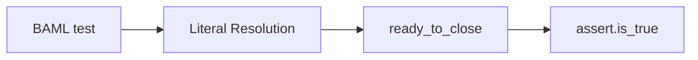
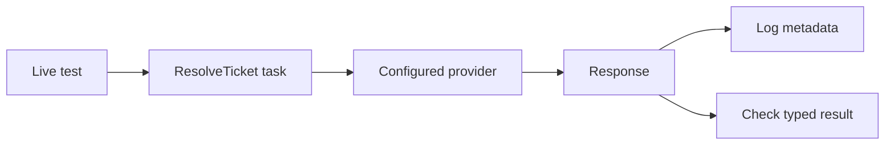
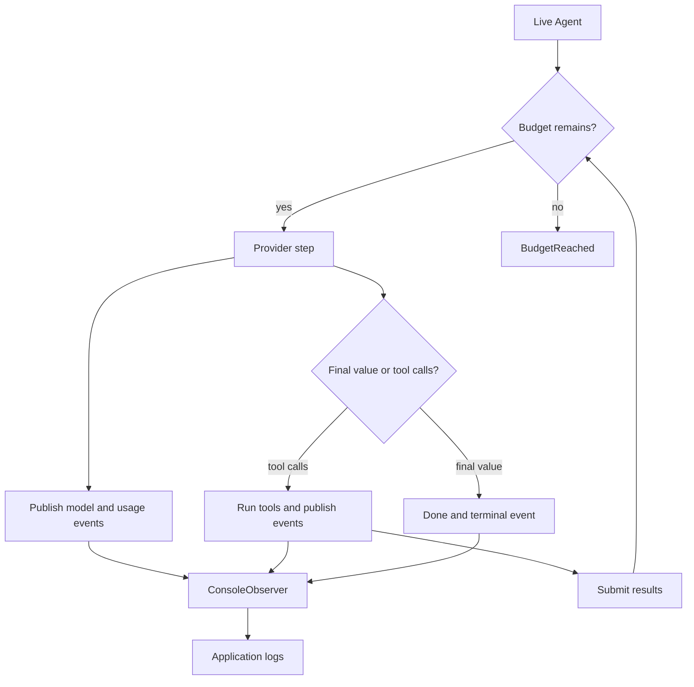

# Testing and observability

BAML tests are ordinary BAML code. Test pure workflow logic with literal typed
values. Use small, clearly named live tests when you need to check a prompt or
provider. Use observers and response metadata to understand live runs.

## Utilities used

| Utility | What it does |
| --- | --- |
| `test` and `testset` | Define BAML tests |
| `assert.*` | Checks typed values |
| `ai.AgentObserver` | Watches an Agent without changing it |
| `ai.Response<T>.meta` | Keeps request, usage, and provider details |

## Example: test workflow code without a model

```baml
class Resolution {
  reply: string,
  resolved: bool,
}

function ResolveTicket(message: string) -> Resolution {
  provider: "openai/gpt-5.6-luna"
  prompt: `
    Resolve this support ticket.

    ${message}

    ${ctx.output_format}
  `
}

function ready_to_close(resolution: Resolution) -> bool {
  resolution.resolved && resolution.reply.length() > 0
}

test "a resolved ticket is ready to close" {
  let resolution = Resolution {
    reply: "The duplicate charge will be reversed.",
    resolved: true,
  };

  assert.is_true(ready_to_close(resolution))
}
```

### What happens



### Illustrative output

```console
[INFO] running pure BAML test
[PASS] a resolved ticket is ready to close
```

This test is fast and deterministic because it does not call
`ResolveTicket`. It checks the business rule that consumes the LLM function's
typed result.

## Variation: make the model call explicit

Prompt and provider behavior need a real model. Keep those tests small and
put them in a clearly named live testset:

```baml
testset "live-provider" {
  test "ResolveTicket returns a useful reply" {
    let response = ResolveTicket
      .task("I was charged twice.")
      .run(
        runner = ai.run.CompletionWithMeta.new(),
      );

    log.info({
      "provider": response.meta.provider,
      "request_id": response.meta.request_id,
      "usage": response.meta.usage,
    });

    assert.is_true(ready_to_close(response.value))
  }
}
```

### What happens



### Illustrative output

```console
[INFO] provider = "openai"
[INFO] request_id = "req_..."
[INFO] usage = Usage { input_tokens: 81, output_tokens: 27 }
[PASS] ResolveTicket returns a useful reply
```

## Variation: observe a live Agent

```baml
function lookup_order(order_id: string) -> string {
  orders.get_status(order_id)
}

class ConsoleObserver {
  implements ai.AgentObserver {
    function on_event(self, event: ai.AgentEvent) -> null {
      log.info(event)
    }
  }
}

function resolve_with_logs(
  message: string,
) -> ai.AgentOutcome<Resolution> {
  ResolveTicket.task(message).run(
    runner = ai.run.Agent.new(
      tools = [lookup_order],
      observers = [ConsoleObserver {}],
    ),
  )
}
```

### What happens



### Illustrative output

```console
[INFO] ModelStartedEvent { provider: "openai" }
[INFO] ToolCallEvent { phase: "started", name: "lookup_order" }
[INFO] UsageEvent { input_tokens: 144, output_tokens: 32 }
[INFO] RunFinishedEvent { outcome: "done" }
```

Observers receive model, tool, provider, usage, and terminal events. They
cannot block a tool or change the run; use an Agent callback for that.

For a bounded call, use `CompletionWithMeta` and inspect
`response.meta.usage`. Missing usage stays `null`; BAML does not invent token
or cost data that the provider did not report.

## Choose the right kind of test

| Layer | What it proves |
| --- | --- |
| Pure BAML tests | Business logic and transformations |
| Application-owned provider doubles | Deterministic orchestration cases your application chooses to model |
| Credentialed live tests | Provider compatibility and model quality |

If an application needs a provider double, it can implement the relevant
provider capability in its own test sources. That is ordinary application
code, not a standard `ai` utility.

Task values also make provider matrices straightforward: rebind one task with
`.with_provider(...)`, run each provider, and compare the same declared output
contract.
