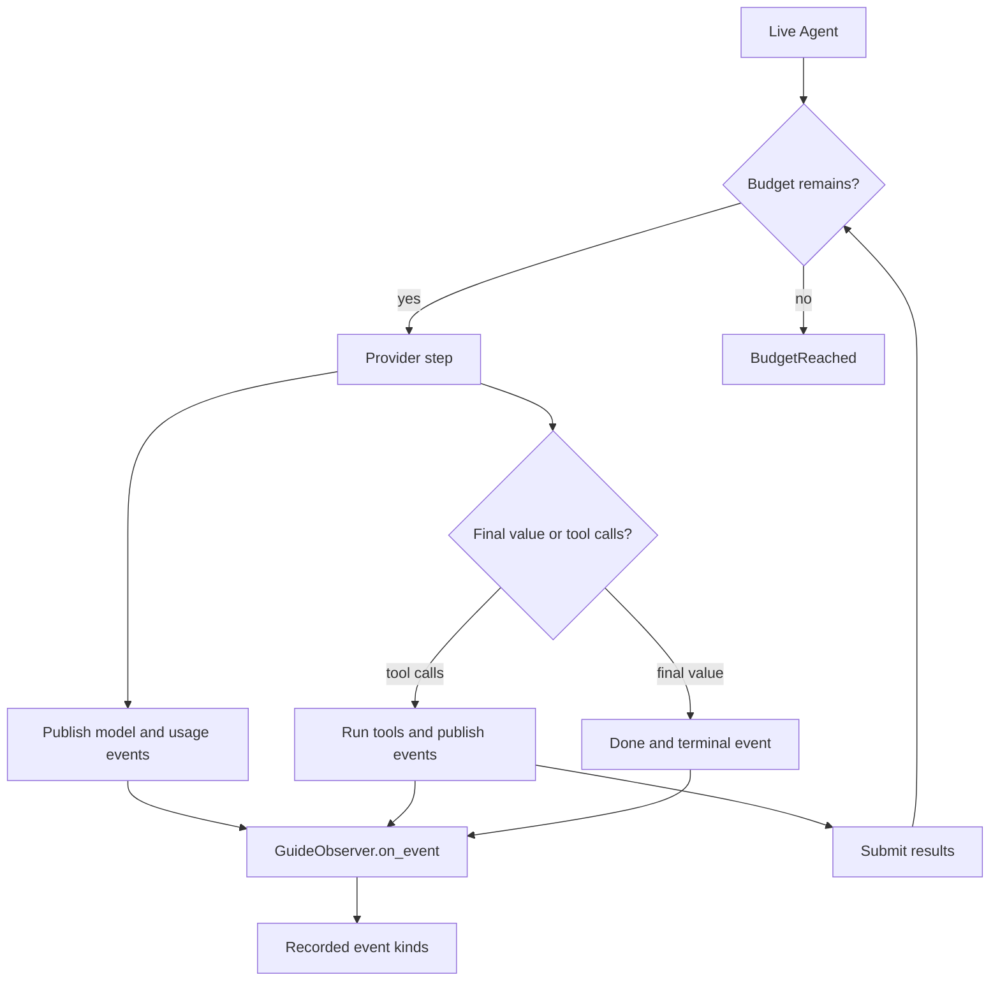

# Testing and observability

BAML tests are ordinary BAML code. Test pure workflow logic with literal typed
values. Use small, clearly named live tests when you need to check a prompt or
provider. Use observers and response metadata to understand live runs.

## Utilities used

| Utility | What it does |
| --- | --- |
| `test` and `testset` | Define BAML tests |
| `assert.*` | Checks typed values |
| `ai.observe.AgentObserver` | Watches an Agent without changing it |
| `ai.Done<T>.metadata` | Keeps request, usage, and provider details |
| `ai.testing.FakeProvider` | Deterministic provider double with failure injection |

## Example: test workflow code without a model

```baml
enum TicketPriority {
  Low
  Normal
  Urgent
}

class SupportTicket {
  id: string,
  subject: string,
  body: string,
  customer_tier: string,
}

class Resolution {
  category: string,
  priority: TicketPriority,
  summary: string,
  reply: string,
}

function ResolveTicket(ticket: SupportTicket) -> Resolution {
  provider: "openai-responses/gpt-5.6-luna"
  prompt: `
    Resolve this support ticket.
    Subject: ${ticket.subject}
    Body: ${ticket.body}

    ${ctx.output_format}
  `
}

function ready_to_close(resolution: Resolution) -> bool {
  resolution.reply.length() > 0 && resolution.summary.length() > 0
}

test "a resolved ticket is ready to close" {
  let resolution = Resolution {
    category: "billing",
    priority: TicketPriority.Urgent,
    summary: "Duplicate charge",
    reply: "The duplicate charge will be reversed.",
  };

  assert.is_true(ready_to_close(resolution))
}
```

### Illustrative output

```console
[INFO] running pure BAML test
[PASS] a resolved ticket is ready to close
```

This test is fast and deterministic because it does not call
`ResolveTicket`. It checks the business rule that consumes the LLM function's
typed result.

## Variation: make the model call explicit

Prompt and provider behavior need a real model. Keep those tests small and
put them in a clearly named live testset:

```baml
testset "live-provider" {
  test "ResolveTicket returns a useful reply" {
    let outcome = ResolveTicket@task(sample_ticket()).run(
      runner = ai.run.Agent<Resolution>.new(),
    );

    match (outcome) {
      let done: ai.Done<Resolution> => {
        log.info({
          "provider": done.metadata.provider,
          "request_id": done.metadata.request_id,
          "usage": done.metadata.usage,
        });
        assert.is_true(ready_to_close(done.value))
      },
      let stopped: ai.BudgetReached => {
        throw baml.errors.Unsupported {
          message: "live test stopped: " + stopped.reason,
        }
      },
      let handoff: ai.Handoff => {
        throw baml.errors.Unsupported {
          message: "live test handed off to " + handoff.call.name,
        }
      },
    }
  }
}
```

### Illustrative output

```console
[INFO] provider = "openai"
[INFO] request_id = "req_..."
[INFO] usage = Usage { input_tokens: 81, output_tokens: 27 }
[PASS] ResolveTicket returns a useful reply
```

## Variation: observe a live Agent

```baml
/// Search the support knowledge base.
function search_knowledge(query: string) -> json throws never {
  { "query": query, "article": "Duplicate charges are normally pending authorizations." }
}

class GuideObserver {
  kinds: string[],

  implements ai.observe.AgentObserver {
    function on_event(self, event: ai.observe.AgentEvent) -> null throws never {
      self.kinds.push(event.kind());
      null
    }
  }
}

function resolve_with_logs(
  ticket: SupportTicket,
) -> ai.Done<Resolution> | ai.BudgetReached | ai.Handoff {
  let observer = GuideObserver { kinds: [] };
  let outcome = ResolveTicketWithTools@task(ticket).run(
    runner = ai.run.Agent<Resolution>.new(
      tools = [search_knowledge],
      observers = [observer],
    ),
  );
  log.info(observer.kinds);
  outcome
}
```

`ResolveTicketWithTools` is the tool-using function from
[Agents and tools](agents-and-tools.md). The signature spells out the explicit
Agent outcome union.

### What happens



### Illustrative output

```console
[INFO] ["model_started", "usage_updated", "tool_call_proposed", "tool_call_started", "tool_call_finished", "model_started", "usage_updated", "run_finished"]
```

Observers receive model, tool, provider, usage, and terminal events. They
cannot block a tool or change the run; use an Agent callback for that.

For a normal model run, inspect `Done.metadata.usage`. The Agent accumulates
usage reported by each step. Provider fields that are absent remain absent;
BAML does not invent token or cost data.

## Choose the right kind of test

| Layer | What it proves |
| --- | --- |
| Pure BAML tests | Business logic and transformations |
| Deterministic fakes (`ai.testing.FakeProvider`) | Orchestration, retry, and recovery paths without a model |
| Credentialed live tests | Provider compatibility and model quality |

`ai.testing.FakeProvider` returns a fixed payload —
`ai.testing.fake_output_provider(...)` builds one — and injects failures on
demand: with `failures_remaining: 1` it throws a classified failure once, then
succeeds, which exercises the same recovery paths a live provider would. An
application can still implement a provider capability in its own test sources
when it needs behavior the standard fakes do not model.

Task values also make provider matrices straightforward: rebind one task with
`.with_provider(...)` — for example `fast_model()` or `careful_model()` — run
each provider, and compare the same declared output contract.

Runnable scenario entry points:

```console
baml run --from crates/baml_tests/baml_src_temp2 \
  ai_scenarios.observe_a_call

baml run --from crates/baml_tests/baml_src_temp2 \
  ai_scenarios.observe_an_agent

baml run --from crates/baml_tests/baml_src_temp2 \
  ai_scenarios.fakes_and_failure_injection
```
