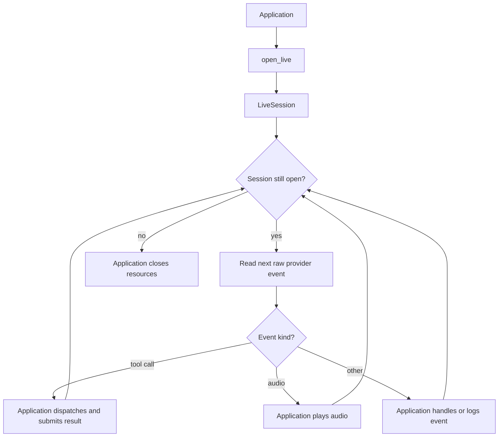

# Voice and live sessions

Use `VoiceAgent` when BAML should own microphone input, audio playback,
application tools, barge-in, and shutdown. Use `open_live` when the application
needs the raw bidirectional session.

## Utilities used

| Utility | What it does |
| --- | --- |
| `ai.run.VoiceAgent` | Runs a complete managed voice lifecycle |
| `ai.RealtimeAudioDevice` | Captures and plays audio |
| `ai.RealtimeAudioFormat` | Describes the encoding, sample rate, and channels |
| `ai.Channel` | Carries provider frames and trace data |
| `ai.open_live` | Opens a raw `LiveSession` |
| `openai.Realtime` | Configures and opens an OpenAI realtime session |

## Example: managed voice

```baml
function lookup_order(order_id: string) -> string {
  orders.get_status(order_id)
}

function VoiceSupport(customer_id: string) -> null {
  provider: "openai/gpt-realtime"
  prompt: `
    Help customer ${customer_id} over a live voice call.
    Keep answers brief and confirm before making changes.
  `
  tools: [lookup_order]
}

VoiceSupport.task("customer-7").run(
  runner = ai.run.VoiceAgent.new(
    audio = audio_device,
    channel = trace_channel,
    barge_in_after_ms = 500,
  ),
)
```

### What happens


### Illustrative output

```console
[INFO] live session opened for customer-7
[INFO] user speech committed
[INFO] called tool: lookup_order(order_id = "order-42")
[INFO] assistant audio started
[INFO] barge-in detected after 500 ms; playback cancelled
[INFO] live session closed
```

The runner pumps microphone input alongside provider events, executes
application tools, interrupts playback after sustained user speech, and closes
the session and audio device on every exit path. Before starting the event
loops, it verifies that the audio device and provider session agree on input
and output formats.

The concrete provider owns its wire requirements. For example,
`openai.Realtime` declares the format accepted by its session; the portable
`ai` runner does not assume an OpenAI encoding or sample rate.

| Setting | Meaning |
| --- | --- |
| `audio` | Microphone and playback device |
| `channel` | Provider channel and optional trace sink |
| `barge_in_after_ms` | Speech duration before interrupting playback |
| `completion_tool` | Optional tool that ends the call |

## Variation: raw live session

```baml
let session = ai.open_live(
  VoiceSupport.task("customer-7"),
  channel,
);

defer { session.close() }

for (let event in session) {
  match (event) {
    let delta: ai.AssistantAudioDelta => audio_device.play(delta.audio),
    let calls: ai.LiveToolCalls => dispatch_live_tools(session, calls),
    let closed: ai.LiveClosed => break,
    _ => log.debug(event),
  }
}
```

### What happens



### Illustrative output

```console
[INFO] raw live session opened
[DEBUG] AssistantAudioDelta { bytes: 4096 }
[INFO] LiveToolCalls { name: "lookup_order" }
[INFO] submitted correlated tool result
[INFO] LiveClosed
```

The raw form is intentionally lower level. The application owns event
dispatch, tool results, interruption, and cleanup.

A live session is different from a finite `audio` or `AudioStream`: it has no
natural immediate return value and remains open until one side closes it.
