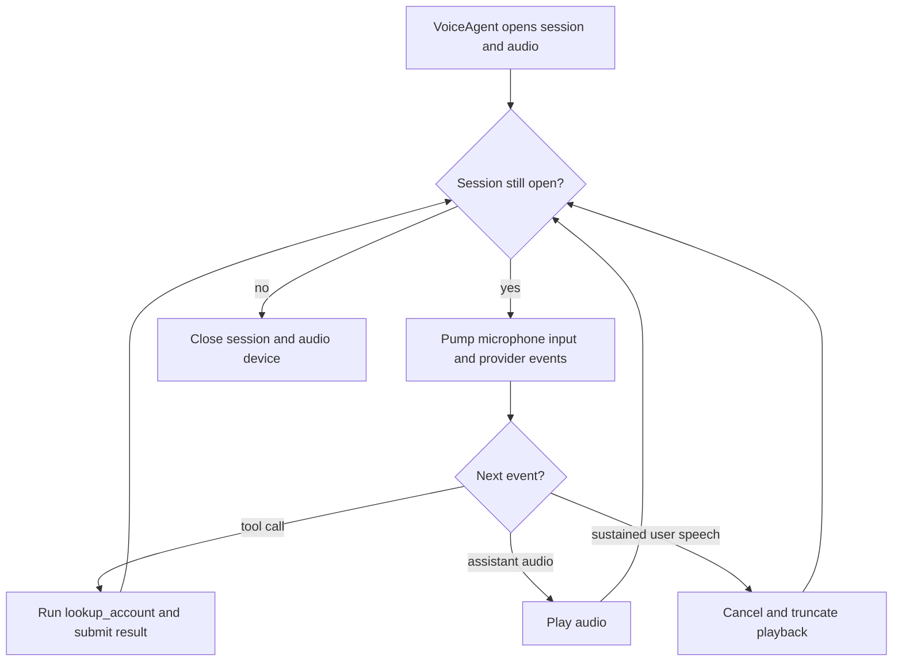
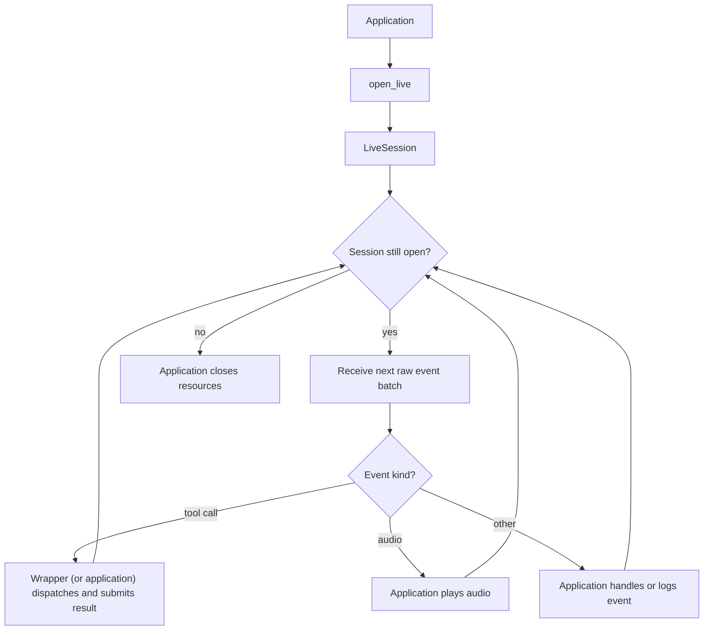

# Voice and live sessions

Use `VoiceAgent` when BAML should own microphone input, audio playback,
application tools, barge-in, and shutdown. Use `ai.realtime.open_live` when
the application needs the raw bidirectional session — a `LiveSession` you send
audio/text frames into and receive provider events from directly, with no
runner managing turns, tools, or shutdown for you.

## Utilities used

| Utility | What it does |
| --- | --- |
| `ai.run.VoiceAgent` | Runs a complete managed voice lifecycle |
| `ai.realtime.RealtimeAudioDevice` | The capture/playback interface the application implements |
| `ai.realtime.RealtimeAudioFormat` | Describes the encoding, sample rate, and channels |
| `ai.realtime.Channel` | Receives copies of the raw frames exchanged with the provider |
| `ai.realtime.open_live` | Opens a raw `LiveSession` (a resource, so no `.run(...)`) |
| `ai.realtime.with_automatic_tools` | Opt-in tool dispatch for a raw `LiveSession` |
| `openai.Realtime` | Configures and opens an OpenAI realtime session |

## Example: managed voice

```baml
/// Look up a customer account.
function lookup_account(customer_id: string) -> json throws never {
  { "customer_id": customer_id, "status": "active", "tier": "pro" }
}

function VoiceSupport(instructions: string) -> null {
  provider: "openai/gpt-realtime"
  prompt: `${instructions}`
}

function run_voice_support(
  audio_device: ai.realtime.RealtimeAudioDevice,
  trace_channel: ai.realtime.Channel,
) -> null {
  VoiceSupport@task("Help the caller with their account. Keep answers brief and confirm before making changes.")
    .with_tools([lookup_account])
    .run(
      runner = ai.run.VoiceAgent.new(
        audio = audio_device,
        channel = trace_channel,
        barge_in_after_ms = 500,
      ),
    )
}
```

### What happens



### Illustrative output

```console
[INFO] live session opened
[INFO] user speech committed
[INFO] called tool: lookup_account(customer_id = "C-1")
[INFO] assistant audio started
[INFO] barge-in detected after 500 ms; playback cancelled
[INFO] live session closed
```

The runner pumps microphone input alongside provider events, executes
application tools, interrupts playback after sustained user speech, and closes
the session and audio device on every exit path. Before starting the event
loops, it verifies that the audio device and provider session agree on input
and output formats.

The concrete provider owns its wire requirements. For example,
`openai.Realtime` declares the format accepted by its session; the portable
`ai` runner does not assume an OpenAI encoding or sample rate.

| Setting | Meaning |
| --- | --- |
| `audio` | Microphone and playback device |
| `channel` | Sink that receives the session's raw provider frames |
| `barge_in_after_ms` | Speech duration before interrupting playback |
| `completion_tool` | Optional tool that ends the call |

## Variation: raw live session

```baml
function pump_voice_support(
  audio_device: ai.realtime.RealtimeAudioDevice,
  channel: ai.realtime.Channel,
) -> null {
  let raw_session = ai.realtime.open_live(
    VoiceSupport@task("Help the caller with their account."),
    channel,
  );
  let session = ai.realtime.with_automatic_tools(raw_session, [lookup_account]);

  defer { session.close() }

  let done = false;
  while (!done) {
    let batch = session.receive();
    if (batch.length() == 0) {
      done = true;
    }
    for (let event in batch) {
      match (event) {
        let delta: ai.realtime.AssistantAudioDelta => audio_device.play_output(delta.audio),
        let results: ai.realtime.LiveToolResults => log.debug(results.results),
        let closed: ai.realtime.LiveClosed => {
          done = true;
        },
        _ => log.debug(event),
      }
    }
  }
  null
}
```

### What happens



### Illustrative output

```console
[INFO] raw live session opened
[DEBUG] AssistantAudioDelta { audio: 4096 bytes }
[DEBUG] LiveToolCalls { calls: [ToolCall { name: "lookup_account" }] }
[INFO] submitted correlated tool result
[INFO] LiveClosed
```

The raw form is intentionally lower level. The application owns event
dispatch, tool results, interruption, and cleanup. Tool execution is opt-in:
without `with_automatic_tools`, the session surfaces
`ai.realtime.LiveToolCalls` and the application submits correlated results
with `session.submit_tool_results(...)`. Interruption belongs to the session
too, via `session.cancel_response()` and
`session.truncate_assistant_audio(played_ms)`.

A live session is different from a finite `audio` value or
`ai.transcription.AudioStream`: it has no natural immediate return value and
remains open until one side closes it.
