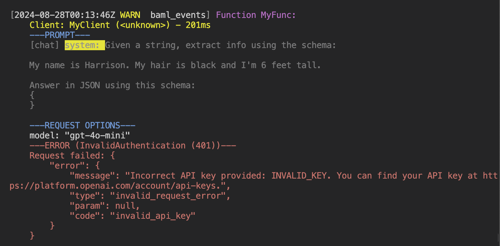

You can add logging to determine what the BAML runtime is doing.

To enable logging, set the `BAML_LOG` environment variable:
```sh
# default is warn
BAML_LOG=info
```

| Level | Description |
|-------|-------------|
| `error` | Fatal errors by BAML |
| `warn` | Logs any time a function fails (includes LLM calling failures, parsing failures) |
| `info` | Logs every call to a function (including prompt, raw response, and parsed response) |
| `debug` | Way more than you think you need |
| `trace` | Everything and more |
| `off` | No logging |


Example log:


---

Since `>0.54.0`:

To truncate each log entry to a certain length, set the `BOUNDARY_MAX_LOG_CHUNK_CHARS` environment variable:

```sh
BOUNDARY_MAX_LOG_CHUNK_CHARS=3000
```

This will truncate each part in a log entry to 3000 characters.
