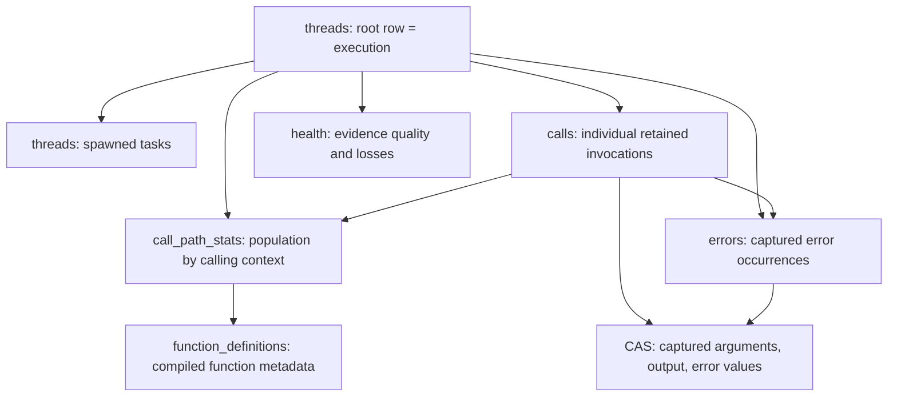

# BAML query: the old schema and a proposed BTEL catalog

Design draft, 2026-09-24. This is a reader/query contract, not a runtime implementation change or a SQLite DDL migration.

Later implementation note: [population outcome counts](btel-query-outcomes.md)
are now preserved by the background processor and exposed in the implemented
SQL catalog. References below to missing aggregate outcomes describe the
earlier producer revision being compared; invocation starts and throw
provenance are still unavailable.
The [remaining parity review](btel-query-parity-review.md) is the current
question-oriented prioritization, including the playground outcome wiring;
the version comparison and proposed catalog below are historical.

Read sections 1–3 for the old system, 4–5 for the mapping, and 6 onward for the proposed new catalog. The old inventory covers all **157 columns in nine relations**, plus the one shipped convenience view. A “relation” here simply means something SQL can select from, whether it is implemented as a table, a view, or a provider.

## 1. Which versions are we comparing?

The references were checked against the remote repository, not just the local checkout:

| Reference | Revision / status | What it establishes |
|---|---|---|
| Old implementation on `origin/canary` | `b0c93ca3bdd16fdf548f74bc5261779a565a410b` | The old public schema and its DataFusion providers. |
| Vaibhav's snapshots branch, PR [#4953](https://github.com/BoundaryML/baml/pull/4953) | `0c30d21021526ba1c2369e9e021b9d28ac1dc823`, open | The BTEL/CAS producer underlying our prototype. |
| Cloud delivery, PR [#4958](https://github.com/BoundaryML/baml/pull/4958) | `778a5f002e084e4c534af7b4a58ee066b564eed1`, open | Later delivery work; its recording protobuf is unchanged from the snapshots base. |
| Trace options, PR [#4983](https://github.com/BoundaryML/baml/pull/4983) | `d708130b783da1dc36aac90a4d25e122b07ff656`, open | Later capture-policy work; its recording protobuf is also unchanged from the snapshots base. |
| Opus's query prototype | Uncommitted work in this worktree, based on #4953 | Adds the reader/index and function/argument metadata publication. |

At this check, **the BTEL rewrite is not merged into canary**. Canary has no `btel_*` crates. The file-sink PR [#4950](https://github.com/BoundaryML/baml/pull/4950) is also still open. This document does not rebase the prototype or assume later stack work has landed.

The old schema source is [canary's catalog.rs](https://github.com/BoundaryML/baml/blob/b0c93ca3bdd16fdf548f74bc5261779a565a410b/baml_language/crates/baml_query/src/catalog.rs); actual row construction is in [relations.rs](../baml_language/crates/baml_query_profiles/src/relations.rs). The latter is unchanged between our base and the checked canary revision. The old [human guide](../TASK/baml-query-catalog.md) is useful but is not exact: for example it says `stream_id` where the catalog says `process_id`, describes `namespace` as a list when SQL exposes text, and omits `call_path_overflow_reason`.

The `baml_query` catalog left in this worktree is also not an exact copy of canary: Vaibhav's stack removed `threads.runtime_id` and `calls.runtime_ids`. They are included below because they were part of the old system.

BTEL references: [recording.proto](../baml_language/crates/btel_publisher/proto/recording.proto), [completion aggregation](../baml_language/crates/btel_processor/src/lib.rs), [aggregate semantics](../baml_language/crates/btel_processor/src/aggregate.rs), and [prototype catalog](../baml_language/crates/baml_query_btel/src/catalog.rs). The original local-query architecture is `/media/tony/WesternDigitalNvmeSsd/Code/query_plan.flushded_out.md`, particularly its identity, aggregate, clock, and producer-contract sections.

## 2. What the old tables represent

Imagine one host invocation of `Main`. It calls `Validate` 1,000 times at the same call site and spawns two tasks that call `Fetch`.

- There is one **execution**: the whole host invocation.
- There are three **logical threads**: the root and two spawned tasks. These are Bex/VM tasks, not OS threads.
- There are many **function invocations**. The profiler can count them without retaining a full record for each.
- A **call path** identifies a function in a calling context: “`Validate`, called at this site, below this parent path.” Those repeated `Validate` calls update one context's counters. Calling `Validate` from a different parent or site can produce another context.
- A **retained call** is an individual invocation for which structural evidence was kept. Captured arguments/output are a further, separate concern: retaining the call does not promise that all its values are available.
- An **error capture** records an error occurrence at its origin. Several retained calls can terminate because that one error propagates through them.
- A **function definition** describes the compiled function independently of how many times it ran.



The arrows show useful relationships, not promises that every referenced row survives recording losses. In particular a call's parent or an error's throwing call need not be in the retained `calls` table.

The central rule is: **`COUNT(*) FROM calls` counts retained invocations, not the whole observed call population.** The population counters live in `call_path_stats`.

In the old schema there is no separate `executions` table or view. An execution is the root row of `threads`; listing executions means selecting `parent_thread_id IS NULL`.

## 3. Complete old-schema dictionary

Canonical names end in `_v1`; the short names below are aliases. `call_path_stats` also has alias `cct_population`; `calls` also has alias `retained_calls`.

Types below describe the old Arrow/DataFusion contract: `text` = UTF-8, `u32/u64` = unsigned integer, `timestamp` = UTC nanoseconds, `list<text>` = an actual Arrow list, and `value` = an opaque BAML value handle with lazy decoding. A `?` means SQL NULL is allowed. Absence of `?` does not prove the producer never lost evidence; old providers sometimes used fallback values.

### 3.1 `threads`: one row per logical thread (35 fields)

Declared key: `(execution_id, thread_id)`. First, the fields applicable to every thread:

| Field | Old type | Meaning |
|---|---|---|
| `execution_id` | text | Root thread ID of the execution containing this thread. |
| `thread_id` | text | This logical thread's durable ID, not an OS thread ID. |
| `parent_thread_id` | text? | The spawning thread; NULL on roots in the normal complete case. |
| `spawn_call_id` | text? | Recorded call associated with spawning this thread, when available. |
| `spawn_function_id` | u32? | Function ID obtained by looking up `spawn_call_id` in retained call starts. The catalog calls this the spawned function; the provider actually follows that recorded call reference. |
| `spawn_fqn` | text? | Fully qualified name of that function. |
| `spawn_site_file` | text? | Source file containing the spawn expression. |
| `spawn_site_line` | u32? | Its 1-based source line. |
| `name` | text? | User-assigned thread name; an empty recorded name becomes NULL. |
| `kind` | text | `root` or `spawn`. |
| `started_ns` | u64 | Start relative to the old process clock zero. The provider falls back to the execution's start, or zero, if the thread start is missing. |
| `ended_ns` | u64? | Thread end on that same process-relative clock; absent without an end fact. |
| `started_at` | timestamp? | Start converted to wall time using the process anchor. |
| `ended_at` | timestamp? | End converted to wall time. |
| `end_status` | text? | Thread outcome: `completed`, `cancelled`, or `errored`; NULL without an end fact. |

The remaining fields are populated only on **root rows**, even though they are columns of the same table:

| Field | Old type | Meaning |
|---|---|---|
| `process_id` | text? | Durable writing-process identity, not its OS PID. |
| `engine_id` | u64? | Engine instance inside that process. |
| `program_id` | text? | Compiled-program identity used to scope the function table. |
| `revision_id` | text? | Optional compiled revision label from engine metadata. |
| `source_label` | text? | Optional human-readable source label. |
| `runtime_id` | text? | Old `baml_id_1_…` token visible to the host/program for the root. Distinct from SQL's execution ID. Present on canary; removed in the BTEL stack. |
| `entry_function_id` | u32? | Function on the root retained span, if that span survived. |
| `entry_fqn` | text? | Fully qualified entry-function name. |
| `status` | text? | Execution state: `running`, `abandoned`, `succeeded`, `failed`, `cancelled`, or `panicked`. Derived from root lifecycle records and process liveness. |
| `index_state` | text? | Completeness of root/index evidence: `complete`, `no_root_ended`, `root_started_lost`, or `index_corrupt`. Separate from success/failure. |
| `duration_ns` | u64? | Root-span inclusive time when available, otherwise execution end minus start. |
| `total_calls` | u64? | Sum of population invocation-start counters, including unattributed overflow buckets. |
| `total_errors` | u64? | Population count of calls ending in error, not count of distinct thrown errors. |
| `total_cancelled` | u64? | Population count of cancelled calls. |
| `calls_retained` | u64? | Number of spans with a surviving retained start. |
| `threads_total` | u64? | Number of thread entries in the folded execution. |
| `value_state` | text? | Summary of recorded input/output value states: `none` if no occurrences, `partial` if any is explicitly lost, otherwise `complete`. This does not verify all CAS objects or all error captures. |
| `data_first_seq` | u64? | First data-file sequence attributed by execution metadata. |
| `data_last_seq` | u64? | Last such sequence. |
| `data_file_count` | u64? | Number of data files attributed to the execution. |

The old catalog comment says thread listing reads no data files. The actual provider calls `folds.fold(...)` to obtain threads, spans, and totals; do not treat that comment as a performance guarantee.

### 3.2 `call_path_stats`: population counters by calling context (27 fields)

Declared key: `(execution_id, call_path_id)`. A row is a context, not a particular invocation. It combines deltas from the execution's data files. It can also be a synthetic overflow bucket when the producer could not attribute calls to a normal path.

| Field | Old type | Meaning |
|---|---|---|
| `execution_id` | text | Owning execution. |
| `call_path_id` | text | Context hash; synthetic rows use `overflow:<reason>:<edge>`. |
| `parent_call_path_id` | text? | Parent context; NULL on roots and synthetic overflow rows. |
| `depth` | u32 | Parent-chain depth, with roots at zero. |
| `function_id` | u32 | Function identity within the execution's compiled program. |
| `fqn` | text? | Fully qualified function name. |
| `definition_key` | text? | Logical function identity intended to survive recompilation; distinct from numeric runtime ID. |
| `kind` | text? | Execution implementation: `bytecode`, `sysop`, `native`, or `native_unresolved`. It is not an LLM/not-LLM classification. |
| `origin` | text? | Function provenance: the provider emits `user`, `companion`, `internal`, `builtin`, or `auto_derive`. |
| `call_site_file` | text? | File containing the calling expression, not the callee's definition file. |
| `call_site_line` | u32? | 1-based calling-expression line. |
| `call_site_start` | u32? | Start offset of the calling-expression span. |
| `call_site_end` | u32? | End offset of that span. |
| `edge_kind` | text | `root`, `call` (synchronous), or `spawn`. |
| `calls_started` | u64 | Number of observed invocation entries into this context. |
| `calls_selected` | u64 | Number selected by capture policy for individual records; can exceed surviving `calls` rows. |
| `completed_ok` | u64 | Number of successful terminal invocations. |
| `completed_error` | u64 | Number of errored terminal invocations. |
| `completed_cancelled` | u64 | Number of cancelled terminal invocations. |
| `completed_exit` | u64 | Number ending through the old explicit-exit outcome. |
| `inclusive_ns` | u64 | Accumulated invocation time including nested work. |
| `direct_child_ns` | u64 | Accumulated inclusive time of direct synchronous children. Spawned work is not subtracted as synchronous child time. |
| `await_ns` | u64 | Time attributed to awaiting/suspension in the context. |
| `self_ns` | u64 | Inclusive time minus synchronous-child time minus await time, derived by the fold. Not a hardware CPU-time measurement. |
| `await_count` | u64 | Number of await suspensions. |
| `timing_complete` | boolean | Whether the timing counters/derivation avoid recorded loss, saturation, and invalid subtraction. |
| `overflow_reason` | text? | Why calls could not be assigned to a normal context; only populated on synthetic overflow rows. |

Old large timing sums are reduced to `u64` at the provider boundary; saturation makes timing incomplete. These implementation limits are not a reason to silently clamp the new reader's raw evidence.

### 3.3 `calls`: individual retained invocations (35 fields)

Declared key: `(execution_id, call_id)`. The old provider emits a row only if `SpanStart` survived. End-only evidence contributes to diagnostics rather than becoming a call row.

| Field | Old type | Meaning |
|---|---|---|
| `execution_id` | text | Owning execution. |
| `call_id` | text | Exact invocation identity, not the function or call-path identity. |
| `parent_call_id` | text? | Recorded parent-call identity; the referenced call might not be retained. |
| `thread_id` | text | Logical thread executing this invocation. |
| `call_path_id` | text? | Population context for this call; NULL for overflow contexts. |
| `call_path_overflow_reason` | text? | Why this call has an overflow context. |
| `function_id` | u32 | Function identity within the compiled program. |
| `fqn` | text? | Fully qualified function name. |
| `definition_key` | text? | Logical cross-revision function identity. |
| `kind` | text? | `bytecode`, `sysop`, `native`, or `native_unresolved`. |
| `edge_kind` | text | `root`, `call`, or `spawn`. |
| `call_site_file` | text? | File of the calling expression. |
| `call_site_line` | u32? | Its 1-based line. |
| `call_site_start` | u32? | Its span start offset. |
| `call_site_end` | u32? | Its span end offset. |
| `started_ns` | u64 | Invocation start relative to process clock zero. |
| `ended_ns` | u64? | End on that clock; NULL without an end record. |
| `duration_ns` | u64? | Inclusive duration from the end record. |
| `started_at` | timestamp? | Wall-clock start. |
| `ended_at` | timestamp? | Wall-clock end. |
| `status` | text? | `ok`, `errored`, `cancelled`, or `exited`; NULL without an end record. |
| `selection_reasons` | list<text> | Policy reasons for retaining the span: `root`, `llm`, `manual`. |
| `roles` | list<text> | Value-role policy flags on the start record: `input`, `output`, `error`. Not proof that those blobs are present. |
| `runtime_ids` | list<text> | Initial old runtime token followed by recorded overrides in annotation order. Present on canary; removed in the BTEL stack. |
| `args_state` | text | Input-capture state: `available`, `not_captured`, `lost:<reason>`, or `not_applicable`. |
| `output_state` | text | The corresponding output-capture state. |
| `error_state` | text | The corresponding terminal-error-value state, obtained through the error link. |
| `args_cid` | text? | Input CAS content identity; usable without opening the blob. |
| `output_cid` | text? | Output CAS content identity. |
| `error_cid` | text? | Error-value CAS content identity. |
| `args` | value? | Virtual named-argument object, e.g. `args['customer']['age']`. |
| `output` | value? | Virtual return value. |
| `error` | value? | Virtual terminal-error value. |
| `error_id` | text? | Link to the captured error occurrence in `errors`. |
| `error_lost_reason` | text? | Explicit reason a terminal-error link was lost. |

The value-state fields describe producer evidence. `available` means a content reference was recorded; resolving it can still discover a missing/corrupt object. The query outcome separately reports hydration failures. A captured BAML `null`, an absent field, and a missing blob are different cases.

### 3.4 `errors`: captured error occurrences (19 fields)

Declared key: `(execution_id, error_id)`. This is **not** `calls WHERE status = 'errored'`. One throw can unwind through several calls; a caught throw might not cause the root to fail. The old error identity includes a thread and unwind ordinal, not the hash of the error value.

| Field | Old type | Meaning |
|---|---|---|
| `execution_id` | text | Execution containing the error occurrence. |
| `error_id` | text | Identity of this capture/unwind occurrence. |
| `throw_call_id` | text | Invocation in which it was raised; may not have a retained call row. |
| `throw_thread_id` | text | Logical thread where it was raised. |
| `throw_call_path_id` | text? | Its calling context, when attributable. |
| `throw_function_id` | u32 | Function where it was raised. |
| `throw_fqn` | text? | That function's fully qualified name. |
| `throw_site_file` | text? | File containing the throw site. |
| `throw_site_line` | u32? | Its 1-based line. |
| `throw_site_start` | u32? | Its span start offset. |
| `throw_site_end` | u32? | Its span end offset. |
| `kind` | text | `fresh` or `rethrow`. |
| `source` | text | Where error handling entered: `bytecode`, `native_call`, `engine_call`, or `future_resume`. |
| `value_state` | text | Error-value capture evidence: `available`, `not_captured`, or `lost:<reason>`. |
| `value_cid` | text? | CAS identity of the error value. |
| `value` | value? | Lazy error value. |
| `stack_complete` | boolean | Whether the context chain covers root to throw without structural gaps. Names can still use placeholders if metadata is absent. |
| `stack` | list<text> | Root-to-throw function names reconstructed from the context tree. The provider returns an empty list if it cannot reconstruct a complete chain. |
| `terminal_call_ids` | list<text> | Retained calls whose terminal-error link targets this occurrence. |

### 3.5 `function_definitions`: compiled function dictionary (15 fields)

Declared key: `(program_id, function_id)`. Rows come from a durable compiled function table, including entries whether or not each function ran.

| Field | Old type | Meaning |
|---|---|---|
| `program_id` | text | Compiled program owning this function table. |
| `function_id` | u32 | Numeric identity local to that program. |
| `fqn` | text | Fully qualified function name. |
| `display_name` | text | Short UI label. |
| `definition_key` | text? | Logical identity across revisions; a rename changes it. |
| `kind` | text | `bytecode`, `sysop`, `native`, or `native_unresolved`. |
| `kind_detail` | text? | Optional kind-specific detail. |
| `origin` | text | `user`, `companion`, `internal`, `builtin`, or `auto_derive`. |
| `source_file` | text? | Definition's source file, not a call site. |
| `source_start` | u32? | Definition span start offset for editor navigation. |
| `source_end` | u32? | Definition span end offset. |
| `package` | text? | Owning package. |
| `namespace` | text | Namespace components joined with dots by the provider. |
| `revision_id` | text? | Revision label inherited from engine metadata. |
| `source_label` | text? | Human-readable label inherited from engine metadata. |

### 3.6 `health`: quality and loss accounting (6 fields)

Declared key: `(execution_id, metric)`, but the provider can emit several `data_issue` or overflow rows with different reasons. **The implementation does not make that declared key unique.** This should be corrected rather than copied.

| Field | Old type | Meaning |
|---|---|---|
| `execution_id` | text | Execution being described. |
| `metric` | text | Counter, flag, or diagnostic name. |
| `plane` | text | `execution`, `cct`, `overflow`, `process`, or `data`. |
| `value` | u64 | Counter value or encoded boolean. Its interpretation depends on the metric. |
| `edge_kind` | text? | Edge category for an overflow bucket. |
| `reason` | text? | Overflow reason or a diagnostic's details. |

The old execution metrics include `corrupt_records`, capacity/join failures, unmatched call/thread facts, invalid clocks, file-publication failures, structural/value transport exhaustion, and counters tracing error captures and terminal-error links from observation through commitment. The CCT adds `counter_saturated`, `await_counter_saturated`, and `self_time_underflow`. Overflow rows count unassigned invocation starts. Data rows describe missing/corrupt files and decoding problems.

There is a misleading statement in the old human guide: “no positive health values means nothing was lost.” Some positive values are normal counts, and `data_state = 1` means **complete**. Interpret each metric; neither a positive value nor an empty result is a universal error/completeness test.

### 3.7 `processes`: internal writer-process inventory (8 fields)

Internal profile only (`BAML_INTERNAL` / playground), key `process_id`. A row can outlive its process.

| Field | Old type | Meaning |
|---|---|---|
| `process_id` | text | Durable writer-process identity. |
| `os_pid` | u32? | Operating-system PID from the stream header. |
| `zero_unix_ns` | u64? | Wall-clock anchor for the process-relative clock zero. |
| `baml_version` | text? | Producing BAML version. |
| `os_arch` | text? | Producing platform/architecture. |
| `alive` | boolean | Whether the writer's stream lock was held when the query bound the store. |
| `meta_hw` | u64 | Committed metadata-file high-water sequence. |
| `data_hw` | u64 | Committed data-file high-water sequence. |

### 3.8 `store_files`: internal old-file inventory (8 fields)

Internal profile only, declared key `(process_id, plane, sequence)`.

| Field | Old type | Meaning |
|---|---|---|
| `process_id` | text | Writer owning the file. |
| `plane` | text | `meta` or `data`. |
| `sequence` | u64 | File sequence within that plane. |
| `path` | text | Store-relative file path. |
| `record_or_group_count` | u64? | Number of metadata records or execution data groups; NULL if unreadable. |
| `payload_len` | u64 | Provider actually reports file byte length, or zero if unreadable. |
| `checksum_ok` | boolean | Provider sets this to the overall decode success result. |
| `decode_ok` | boolean | Same overall decode success result; checksum and decode are not independently reported. |

### 3.9 `value_index`: internal old-CAS inventory (4 fields)

Internal profile only, key `cid`. The provider scans and decodes readable old CAS objects; this is not a cheap view over references in call rows.

| Field | Old type | Meaning |
|---|---|---|
| `cid` | text | Old `bamlv_1_…` content ID. |
| `codec` | u32 | Old CAS body codec. |
| `body_len` | u64 | Decoded envelope's body length in bytes. |
| `path` | text | Store-relative object path. |

### 3.10 `hot_call_paths`: the one shipped convenience view

```sql
SELECT execution_id, fqn, call_path_id, self_ns, inclusive_ns, calls_started
FROM call_path_stats
WHERE overflow_reason IS NULL AND timing_complete
ORDER BY self_ns DESC;
```

It contributes no additional evidence or storage. `executions`, `top_functions`, `slow_calls`, and `llm_calls` are **not** shipped views in the checked old catalog. The source explicitly excludes `llm_calls` because `kind` is an implementation kind, not an LLM category.

## 4. What the current BTEL files actually provide

Each immutable recording segment contains a recording ID and sequence, with some combination of the following. References can resolve in earlier or later segments.

| Evidence | What is present | What it does not establish |
|---|---|---|
| Recording header | Random recording identity, wire version, optional source snapshot fingerprint | Process identity/PID, old engine/program identity, liveness |
| Thread definition and completion | Logical thread ID, optional parent **node** ID, spawn path, start tick, clock epoch; completion tick and outcome | User thread name; whether a missing completion means currently running or abandoned |
| Call-path definition | Defining thread, parent path, visible caller function, caller bytecode PC, callee function, synchronous/spawn edge | Source line of the calling expression; old stable context hash |
| Function definition | Runtime function ID; full metadata or an explicit unavailable observation | A complete inventory of all compiled functions; metadata for every runtime-created function |
| Aggregate delta | Path plus reentry bit, completion count, duration ticks, self-await ticks | Started count, selection count, outcome distribution, await count, loss counters |
| Function announcement | Call ID, parent node, path, start tick, optional input CAS ID | A required announcement for every retained call |
| Function/late completion | Call ID, parent node, path/reentry, start/end/self-await ticks, outcome, announcement dependency, optional output/error CAS ID | Throw identity/site, rethrow/source, error-propagation links, selection reasons |
| Clock definition/state | Clock domain, conversion scale, calibration, UTC anchor and uncertainty, validity observations | Finality unless explicitly marked final |
| Recording end | Terminal extent after a normal shutdown, once every recorded run settled ([recording completion](btel-query-recording-completion.md)) | Proof that every cloud file, blob or capture arrived; an end for crashed recordings or ones with runs still attached |
| CAS blob | Verified owned snapshot graph; positional argument slots or a captured value | Old value IDs, universal media retrieval, or parameter names without the metadata extension |

The prototype adds parameter-slot names and publishes available static function metadata. That is an unmerged prototype addition, not something the base producer already wrote. The later cloud/trace-options heads checked above have not independently added these wire fields.

Three semantic differences require special care:

1. **Completion counts:** the processor emits one aggregate sample for each timing/span completion. A live invocation that has not completed is not yet in those counters. Therefore new `call_count` is not old `calls_started`.
2. **Recursion:** BTEL can collapse direct recursive reentries onto a base path, keeping separate normal/reentry aggregate nodes. Population count includes both. Semantic path-inclusive time uses normal-node time; summing every invocation's duration is a different metric. The exact recursion tree is not recoverable from aggregate counters alone.
3. **Parents:** a thread or call's recorded parent can be either a thread or a retained function node. It describes the telemetry hierarchy, which can skip invocations that were only timed. Preserve it, and derive parent-thread/parent-call relationships separately. A missing resolved parent is not proof of a root.

## 5. Map every old field group to BTEL

**Direct** means wire evidence exists. **Derived** means reader/index work can produce the field without new runtime evidence. **Changed** means there is useful related data, but old semantics cannot be preserved literally. **Missing** means the current recording cannot answer it; a SQL table cannot reconstruct it. “Derived” is not a claim that Opus has already implemented it.

### 5.1 Old `threads`

| Old fields | Mapping / decision |
|---|---|
| `execution_id`, `thread_id` | **Derived/direct:** scoped telemetry IDs. Execution is the resolved root thread. Preserve root identity as execution identity. |
| `parent_thread_id` | **Derived:** follow the recorded parent node to its owning thread. Can be unresolved. |
| `spawn_call_id` | **Derived/changed:** expose a spawning retained-call reference only when the parent node is known to be a call. Keep original `parent_node_id` too. |
| `spawn_function_id`, `spawn_fqn` | **Derived:** callee from the spawn call-path definition; document this explicitly rather than inheriting old provider ambiguity. |
| `spawn_site_file`, `spawn_site_line` | **Missing:** bytecode PC and caller identity exist; durable caller-PC-to-source metadata does not. A callee definition span is not a substitute. |
| `name` | **Missing:** not recorded. |
| `kind` | **Derived:** root/spawn from a known thread definition; unknown if only a reference exists. |
| `started_ns`, `ended_ns` | **Changed:** retain raw ticks + epoch, expose execution-relative offsets/UTC conversions. Do not relabel ticks as old process-relative nanoseconds. |
| `started_at`, `ended_at`, `duration_ns` | **Derived:** checked clock conversion; NULL when unsupported by current clock evidence. Execution duration is root-thread lifetime, explicitly distinct from an individual root call. |
| `end_status` | **Direct:** completion outcome maps to completed/errored/cancelled. |
| `process_id`, `engine_id` | **Missing:** recording identity replaces their role in scoping, but is not equivalent to either. |
| `program_id` | **Changed:** optional `source_snapshot_id` is provenance, not the scope of BTEL runtime function IDs and not the same old identity. |
| `revision_id`, `source_label` | **Missing:** no equivalents in current recording headers. |
| `runtime_id` | **Removed:** old runtime tokens were removed in the stack. Do not reintroduce them as fake aliases of telemetry IDs. |
| `entry_function_id`, `entry_fqn` | **Derived with ambiguity:** use a unique root-entry path/call supported by evidence. NULL + unresolved/conflict state when not provable. |
| `status` | **Changed:** known root outcomes can become succeeded/failed/cancelled. Otherwise incomplete; cannot claim running, abandoned, or panicked from missing completion alone. |
| `index_state` | **Changed:** replace old meta-plane states with recording prefix state and structural resolution state. |
| `total_calls` | **Changed:** expose `completed_calls`, from aggregates, not invocation starts. |
| `total_errors`, `total_cancelled` | **Missing population metrics:** only **retained** outcome counts can be derived. Name them `retained_errored_calls` / `retained_cancelled_calls`. |
| `calls_retained` | **Derived/changed:** count distinct retained calls supported by announcements **or completions**, including valid late/end-only evidence. |
| `threads_total` | **Derived:** threads currently attributed to this root, including it; not a promised final count. |
| `value_state` | **Changed:** capture-reference evidence plus separate lazy resolution outcomes. Cannot infer “all expected values present” without policy/loss evidence. |
| `data_first_seq`, `data_last_seq`, `data_file_count` | **Changed:** can compute observed segment provenance after attribution, but there is no old root-end manifest of expected execution files. Use recording-level watermarks and internal provenance first. |

### 5.2 Old `call_path_stats`

| Old fields | Mapping / decision |
|---|---|
| `execution_id`, `call_path_id`, `parent_call_path_id`, `depth` | **Derived/direct, changed identity:** scoped recording-local path ID, nullable resolved execution/depth; paths are no longer old stable context hashes. Preserve recursive reentry separately. |
| `function_id`, `fqn`, `definition_key`, `kind`, `origin` | **Direct/derived:** callee ID plus nullable recorded metadata. Runtime function IDs are 64-bit and recording-scoped in this catalog. |
| `call_site_file`, `call_site_line`, `call_site_start`, `call_site_end` | **Missing source mapping:** retain `caller_function_id` and `caller_pc` now. |
| `edge_kind` | **Derived:** synchronous/spawn wire edge; root is a structural interpretation requiring root-thread evidence. |
| `calls_started` | **Missing:** use explicitly named `completed_calls`; these are different in live and truncated recordings. |
| `calls_selected` | **Missing:** retained-row count is not a count of capture decisions before losses. |
| `completed_ok`, `completed_error`, `completed_cancelled`, `completed_exit` | **Missing population distribution:** aggregate deltas omit outcomes. Retained outcomes cannot stand in for them. There is also no current `exited` outcome. |
| `inclusive_ns` | **Derived with changed recursion model:** normal-node inclusive ticks converted using valid clock evidence. |
| `direct_child_ns` | **Derived:** sum semantic inclusive time of direct synchronous child paths, excluding spawn edges. Requires resolved structure and compatible clock interpretation. |
| `await_ns` | **Derived:** normal + reentry self-await totals for the path. |
| `self_ns` | **Derived:** inclusive minus synchronous children minus await; NULL if unsupported/underflow. In a live prefix, completed children can precede the still-running parent, so incomplete-window subtraction is not proof of producer corruption. |
| `await_count` | **Missing:** only await duration is stored. |
| `timing_complete` | **Changed:** separate clock validity/finality, structural resolution, and whether this calculation is supported by the indexed prefix. |
| `overflow_reason` | **Missing old evidence:** no old unattributed overflow-bucket records. Reader arithmetic issues are a different thing and belong in `issues`. |

### 5.3 Old `calls`

| Old fields | Mapping / decision |
|---|---|
| `execution_id`, `call_id`, `thread_id`, `call_path_id` | **Direct/derived:** new scoped IDs; execution/function can remain unresolved without dropping the call row. |
| `parent_call_id` | **Changed:** original `parent_node_id` plus resolved node kind and optional parent call. This is telemetry ancestry, not necessarily the immediate VM frame. |
| `call_path_overflow_reason` | **Missing:** no equivalent old overflow bucket. Expose resolution/conflict issues instead. |
| `function_id`, `fqn`, `definition_key`, `kind`, `edge_kind` | **Derived:** through recorded path and metadata, with honest NULLs for unresolved links. |
| `call_site_file`, `call_site_line`, `call_site_start`, `call_site_end` | **Missing source mapping:** keep caller function/PC through `call_paths`. |
| `started_ns`, `ended_ns` | **Changed:** raw ticks and epoch; explicitly named relative offsets replace process-relative ns. |
| `duration_ns`, `started_at`, `ended_at` | **Derived:** checked clock conversion; individual recursive calls retain their own duration. |
| `status` | **Direct/changed:** ok/errored/cancelled from completion, NULL otherwise. Missing completion is explained by a separate evidence state, not guessed cancellation. No `exited`. |
| `selection_reasons`, `roles` | **Missing policy evidence:** current BTEL does not serialize the old reason/role bits. Capture IDs indicate evidence actually present, not what policy requested. |
| `runtime_ids` | **Removed:** no old runtime-ID/override events. |
| `args_state`, `output_state`, `error_state` | **Changed:** reference/pending/not-recorded/not-applicable/conflicted evidence states. Cannot recover old typed loss reasons when no capture reference was emitted. |
| `args_cid`, `output_cid`, `error_cid` | **Direct/derived:** 128-bit snapshot IDs; completion outcome separates output from error. Use snapshot-format-aware identity, not old `bamlv_1_` IDs. |
| `args`, `output`, `error` | **Supported via reader:** lazy CAS handles. Named input access requires the prototype argument-layout metadata. Positional slots remain usable without names. |
| `error_id`, `error_lost_reason` | **Missing:** errored completions contain an optional error-value snapshot, not an error-occurrence identity or terminal-error link. |

### 5.4 Old `errors`

| Old fields | Mapping / decision |
|---|---|
| `execution_id`, `error_id` | **Missing error-occurrence relation:** an errored call has an execution ID, but there is no independently identified throw/unwind capture. |
| `throw_call_id`, `throw_thread_id`, `throw_call_path_id`, `throw_function_id`, `throw_fqn` | **Missing origin:** a call ending in error is not necessarily the call that threw. |
| `throw_site_file`, `throw_site_line`, `throw_site_start`, `throw_site_end` | **Missing:** no throw-site evidence. |
| `kind`, `source` | **Missing:** fresh/rethrow and error entry source are not serialized. |
| `value_state`, `value_cid`, `value` | **Related data only:** available on errored retained calls, but cannot be assigned to distinct old-style error occurrences. |
| `stack_complete`, `stack` | **Missing throw stack:** can show a failing call's recorded ancestry, not certify it as the original throw stack. Aggregate paths may collapse recursive frames. |
| `terminal_call_ids` | **Missing causal linkage:** equal error CAS IDs mean equal captured content, not the same error occurrence. |

Proposal: offer `error_calls` now, with an explicitly retained-call grain. Report old error-occurrence inspection as unsupported, rather than exposing an empty `errors` table that looks like “no errors.” Restoring that feature requires a separate producer contract.

### 5.5 Old `function_definitions`

| Old fields | Mapping / decision |
|---|---|
| `program_id`, `function_id` | **Changed scope:** `(source, recording, runtime function ID)` replaces `(program, u32 function ID)`. Optional source fingerprint does not make IDs comparable across recordings. |
| `fqn`, `display_name`, `definition_key`, `kind`, `origin` | **Direct when metadata published:** nullable, with definition state. Prototype publishes static metadata on first use; unavailable/dynamic definitions remain visible by ID. |
| `kind_detail` | **Partial:** `sys_op_name` can supply sysop detail; not a general replacement for every possible old detail. |
| `source_file`, `source_start`, `source_end`, `package` | **Direct when present** in function metadata. Definition locations do not identify call sites. |
| `namespace` | **Derived:** join recorded namespace components for old-style display; retain components losslessly too. |
| `revision_id`, `source_label` | **Missing:** no current wire fields. |

The new dictionary covers referenced/observed function identities, not every compiled function. Add parameter layout, owner-type key, parent-function key, and lambda path because the new metadata supports them.

### 5.6 Old `health`, `processes`, `store_files`, and `value_index`

| Old relation and fields | Mapping / decision |
|---|---|
| `health.execution_id`, `metric`, `plane`, `value`, `edge_kind`, `reason` | **Partial/changed:** reader diagnostics can be scoped to recordings/executions/subjects. Old runtime loss counters and overflow buckets are not serialized. Replace them with explicit `issues`; absence of issues is not proof of no producer loss. Do not fabricate zero counters. |
| `processes.process_id`, `os_pid`, `baml_version`, `os_arch`, `alive` | **Missing:** no process header or comparable writer-liveness protocol. A recording is not a process. |
| `processes.zero_unix_ns` | **Changed:** explicit clock epochs/UTC anchors replace the single process-zero model. |
| `processes.meta_hw`, `data_hw` | **Changed:** one recording sequence domain; expose observed/indexed/terminal sequences. |
| `store_files.process_id`, `plane`, `sequence` | **Changed key:** source + recording + segment sequence. No meta/data planes. |
| `store_files.path`, `payload_len` | **Direct discovery:** source-relative locator and file bytes, with portable logical names. |
| `store_files.record_or_group_count` | **Changed:** independent definition, aggregate, and span-event counts instead of old groups. |
| `store_files.checksum_ok`, `decode_ok` | **Changed:** explicit decoding/fingerprint-verification states. A reader-computed fingerprint is not a producer-provided checksum. |
| `value_index.cid`, `codec`, `body_len`, `path` | **Changed:** format-aware snapshot ID, snapshot format, byte length when observed, and locations. Metadata queries must not scan/verify the whole CAS. Referenced-but-missing objects must remain distinguishable from present ones. |

`hot_call_paths` can be rebuilt on the new semantic timing fields, but its count column must be `completed_calls`, not `calls_started`. Sort order should be requested by the consuming query.

## 6. Proposed BTEL logical schema: catalog v2

This section is a **proposal**, not a description of tables already implemented. It gives the complete logical surface for the evidence available today, and explicitly identifies capabilities that need additional producer work. It does not claim literal v1 parity. New identities, nullability, clocks, completion counts, and error semantics make a new catalog major version appropriate.

Keep familiar names where their meaning survives. Add `recordings`, `executions`, and explicit structure/clock/issue relations. Separate call-path definitions from statistics so a known path can exist before its first completion. The unversioned aliases bind to the selected catalog version; `_v1` must never silently name v2 data with different semantics.

### 6.1 Shared identity, types, and evidence rules

**Identity.** A source is an explicitly registered store. A recording belongs to that source and can contain many host executions. Function/thread/call/path/clock IDs are scoped to that recording. Use opaque public TEXT IDs that encode the necessary source, recording, and entity namespace; retain original wire IDs losslessly internally. Thread and call IDs use the same **node** namespace because a wire parent can refer to either. `execution_id` is exactly its root's `thread_id`. Function, path, and clock namespaces remain distinct.

Every recording-scoped relation includes `source_id` and `recording_id`, abbreviated **S** below. `recording_id` is the 32-hex-digit wire ID, so its key includes `source_id`. Other opaque IDs include scope; a join on one of those IDs is unambiguous. The spelling/escaping of the opaque ID is an implementation detail to freeze before release, not something callers should parse. Equal wire recording IDs registered under different sources do not automatically merge their evidence.

**Types.** `ID` and ordinary strings are TEXT. Counts and interpreted nanoseconds use INTEGER when representable; unsupported/overflowed results are NULL with a diagnostic. Raw ticks and exact reduced sums use an explicitly documented `exact_uint` logical type rendered as decimal TEXT; raw signed UTC anchors use `exact_int`. These diagnostic types are not ordinary SQLite numeric columns and must not be silently cast to floating point. Preserve individual input deltas if a bounded accumulator overflows. No raw evidence is discarded merely because it exceeds signed 64-bit.

SQLite integers are signed, booleans use 0/1, and there is no dedicated timestamp storage class. Therefore interpreted UTC values use canonical RFC 3339 TEXT with a fixed fractional precision, plus signed Unix-nanosecond INTEGER companions where representable. Plain metadata arrays use documented JSON TEXT or child relations; captured BAML values remain a distinct logical `baml_value` type. These are explicit catalog choices, not automatic equivalence to Arrow's unsigned/list/timestamp types. [SQLite types](https://www.sqlite.org/datatype3.html), [JSON support](https://www.sqlite.org/json1.html).

**Uncertainty.** `?` denotes nullable below. A referenced-but-undefined object may have an identity row with `definition_state = unresolved`; fields that require its definition stay NULL. Repeated identical evidence is idempotent. Conflicting immutable definitions do not get a last-writer-wins value. Keep raw observations and expose a conflict state. Missing metadata does not delete an otherwise usable call/count.

**Time.** Every time-bearing row exposes its clock epoch or a clear timing state. `timing_state` is `provisional`, `final`, `incomplete`, `unknown_clock`, `conflicted`, `invalidated_<reason>`, `backward`, or `overflow`, as applicable. “Provisional” means usable under current clock evidence, not final. Counts remain available when timing is invalid. Preserve the wire's clock-status observation separately in `clocks`; do not collapse its details into a single boolean. Root-relative offsets require an established common clock interpretation, not subtraction of arbitrary ticks from different domains.

**Evidence scope.** Every query answers from a fixed indexed prefix per source/recording. “Completed calls” means observed completions within that evidence, not a guarantee that no producer events were lost. `RecordingEnd` proves terminal extent when paired with a complete prefix; it does not imply every optional capture succeeded. No marker/liveness evidence means `unsealed`, not “live”.

### 6.2 `sources_v2` — registered query inputs

Key: `source_id`. This is query-environment metadata, not runtime telemetry.

| Fields | Meaning |
|---|---|
| `source_id: ID`, `label: text?` | Stable registration identity and optional display label. |
| `kind: text`, `locator: text` | Source kind and registered location. Local filesystem paths are represented here, not embedded throughout the public telemetry schema. |
| `access_state: text`, `access_detail: text?` | `ready`, `missing`, `unreadable`, or another explicitly supported source error. |
| `index_generation: integer`, `refreshed_at: timestamp?` | Committed derived-state generation and last refresh observation. Generation is source-local. |

Source registration is explicit; this relation does not trigger a machine-wide search. Cloud can provide equivalent logical source scope without exposing its private storage paths or SQLite internals.

### 6.3 `recordings_v2` — source recordings and indexed extent

Key: **S**.

| Fields | Meaning |
|---|---|
| **S** | Source and wire recording identity. |
| `source_snapshot_id: text?` | Optional producer source fingerprint; provenance, not function-ID scope. |
| `format_major: integer`, `format_minor: integer` | Recording wire version; minor is the highest applied compatible minor. |
| `seal_state: text` | `unsealed`, `sealed`, or `conflicted` terminal-extent evidence. |
| `prefix_state: text` | `complete_prefix`, `gap`, `invalid_file`, or `files_after_end`. “Complete prefix” does not mean complete recording. |
| `indexed_sequence: integer`, `observed_sequence: integer` | Last contiguous applied sequence and highest completed segment observed. |
| `terminal_sequence: integer?`, `blocked_sequence: integer?` | Explicit terminal extent if known; first sequence preventing further trusted indexing. |
| `partial_files: integer`, `indexed_bytes: integer` | Observed unfinished files and total applied segment bytes. `.part` content is excluded from query facts. |
| `observed_started_at: timestamp?`, `observed_ended_at: timestamp?` | Min/max usable thread timestamps currently observed. These are not a recorded process lifetime. |
| `active_issue_count: integer` | Active reader/index diagnostics; zero is not proof of lossless recording. |

The producer writes the terminal marker after a normal shutdown once every recorded run's clock settled ([recording completion](btel-query-recording-completion.md)); older recordings stay `seal_state = unsealed`. Keep seal/prefix state separate so a discovered end beyond a gap is not mistaken for a complete recording.

### 6.4 `threads_v2` — logical tasks and their telemetry hierarchy

Key: `thread_id`. Includes referenced threads even when their definition is unresolved.

| Fields | Meaning |
|---|---|
| **S**, `thread_id: ID`, `execution_id: ID?` | Identity and resolved root. |
| `definition_state: text`, `structure_state: text` | Definition: resolved/unresolved/conflicted. Structure: resolved/unresolved/conflicted independently. |
| `parent_node_id: ID?`, `parent_node_kind: text?` | Original parent reference and resolved `thread`/`call` kind. NULL parent is a root fact only when its definition is known. |
| `parent_thread_id: ID?`, `spawn_call_id: ID?` | Derived spawning thread and parent call, if resolved. |
| `spawn_call_path_id: ID?` | Wire spawn path; zero sentinel becomes NULL. |
| `spawn_function_id: ID?`, `spawn_fqn: text?` | Spawn-path callee and its recorded name. |
| `kind: text?`, `is_root: boolean?` | Root/spawn and explicit root classification; unknown until supported by definition evidence. |
| `clock_epoch_id: ID?` | Thread's clock context. |
| `started_ticks: exact_uint?`, `ended_ticks: exact_uint?` | Unmodified recorded endpoints. |
| `started_at: timestamp?`, `ended_at: timestamp?` | UTC estimates under usable clock evidence. |
| `started_unix_ns: integer?`, `ended_unix_ns: integer?` | Numeric UTC companions, NULL on range/conversion failure. |
| `start_offset_ns: integer?`, `end_offset_ns: integer?` | Relative to this execution's root-thread start; NULL when not interpretable. |
| `duration_ns: integer?`, `timing_state: text` | This thread's lifetime and clock/evidence state. |
| `end_status: text?`, `completion_state: text` | completed/errored/cancelled if recorded; missing/present/conflicted completion evidence. |

No `name` or spawn-source-location columns are advertised as supported without new producer metadata. Thread duration is wall elapsed time, not CPU time or a sum of child durations.

### 6.5 `executions_v2` — host invocations

Key: `execution_id`. A convenience relation over **known root threads**, with cached per-execution summaries. It must not classify unresolved parents as roots.

| Fields | Meaning |
|---|---|
| **S**, `execution_id: ID`, `thread_id: ID` | Execution and identical root-thread identity. |
| `entry_function_id: ID?`, `entry_fqn: text?`, `entry_state: text` | Entry inferred from unique supporting root-entry evidence; resolved/unresolved/ambiguous/conflicted state. |
| `status: text` | succeeded/failed/cancelled from root completion, incomplete when no completion is known, conflicted when no single outcome can be supported. |
| `structure_state: text`, `completion_state: text` | As for the root thread. |
| `clock_epoch_id`, `started_at`, `ended_at`, `started_unix_ns`, `ended_unix_ns`, `duration_ns`, `timing_state` | Same types/meaning as root-thread fields above. |
| `completed_calls: integer?` | Aggregate completion population currently attributed to this execution. |
| `calls_retained: integer`, `threads_total: integer` | Distinct retained calls and defined threads currently attributed, including root. |
| `retained_ok_calls: integer`, `retained_errored_calls: integer`, `retained_cancelled_calls: integer`, `retained_incomplete_calls: integer` | Observed retained-call states, explicitly not population outcome counts. Conflicted outcomes are excluded from these categories and diagnosed. |
| `aggregate_state: text` | `observed_prefix`, `unresolved`, `conflicted`, or `overflow` for the population summary; does not claim producer losslessness. |
| `active_issue_count: integer` | Reader/index issues currently attributable to this execution. |

Counts exclude unattributed evidence, which remains visible in other relations with NULL `execution_id`. A missing population total is not zero. We deliberately do not add old `total_errors`/`total_cancelled` aliases to retained-only counts.

### 6.6 `function_definitions_v2` and `function_parameters_v2`

Function key: `function_id`; functions include observed references, so metadata can be unresolved or explicitly unavailable.

| Fields | Meaning |
|---|---|
| **S**, `function_id: ID`, `local_function_id: exact_uint` | Scoped identity and original 64-bit runtime ID for diagnostics. |
| `definition_state: text` | resolved/unresolved/unavailable/conflicted; an unavailable lookup is superseded by later successful metadata. |
| `fqn: text?`, `display_name: text?`, `definition_key: text?` | Recorded naming and logical identity. |
| `kind: text?`, `kind_detail: text?`, `origin: text?` | Keep old display spelling `sysop`; sysop detail comes from `sys_op_name`. |
| `source_file: text?`, `source_file_id: integer?`, `source_start: integer?`, `source_end: integer?` | Definition location; compiler file ID is scoped metadata, never a globally unique file key. |
| `package: text?`, `namespace: text?`, `namespace_components: json?` | Owning package; dot-joined display plus lossless components. |
| `owner_type_key: text?`, `parent_function_key: text?`, `lambda_path: text?` | Additional recorded function-identity metadata. |
| `argument_layout_state: text`, `parameter_count: integer?` | unknown/known/conflicted slot layout. Known zero parameters is different from unknown names. |

`function_parameters` key: `(function_id, position)`. Fields: **S**, `function_id: ID`, `position: integer` (zero-based), `name: text?`, `is_receiver: boolean`. Rows exist only for a known recorded layout. This table describes slots; individual omitted arguments are represented by the snapshot, not by deleting parameter rows.

### 6.7 `call_paths_v2` — structural calling contexts

Key: `call_path_id`. Keep definitions independent of whether aggregate completions have arrived.

| Fields | Meaning |
|---|---|
| **S**, `call_path_id: ID`, `execution_id: ID?` | Identity and resolved execution. |
| `definition_state: text`, `structure_state: text` | Definition availability/conflict and ancestry resolution. |
| `thread_id: ID?`, `clock_epoch_id: ID?` | Defining selector thread and its clock context. This is not a list of all threads that executed a path. |
| `parent_call_path_id: ID?`, `depth: integer?` | Recorded parent and resolved tree depth; NULL depth for unresolved/conflicted chains. |
| `caller_function_id: ID?`, `caller_pc: integer?` | Recorded visible caller and bytecode instruction coordinate. |
| `function_id: ID?`, `fqn: text?`, `definition_key: text?`, `kind: text?`, `origin: text?` | Callee identity and convenience metadata. |
| `recorded_edge: text?`, `edge_kind: text?` | Raw synchronous/spawn edge and interpreted root/call/spawn kind. |

This is a telemetry context tree, not a reconstruction of every VM frame. In particular, collapsed recursive reentries live in the next relation rather than inventing unrecorded depths. Source-call-site fields require an additional immutable mapping from caller function + PC to source span.

### 6.8 `call_path_nodes_v2` — lossless reduced aggregate nodes

Key: `(call_path_id, reentry)`. This relation exposes measured aggregates before semantic recursion rollup.

| Fields | Meaning |
|---|---|
| **S**, `call_path_id: ID`, `execution_id: ID?`, `clock_epoch_id: ID?` | Context, resolved execution, and clock context. |
| `reentry: boolean` | The low bit from the aggregate node identity. |
| `completed_calls_exact: exact_uint?`, `duration_ticks_exact: exact_uint?`, `self_await_ticks_exact: exact_uint?` | Checked, exact sums of applied deltas; NULL if an accumulation/resource limit prevents an exact result. Individual raw deltas remain available. |
| `completed_calls: integer?` | Convenience count when representable by query INTEGER. |
| `duration_sum_ns: integer?`, `self_await_ns: integer?`, `timing_state: text` | Converted sums for this node; reentry duration is retained here rather than silently discarded. |
| `aggregate_state: text` | Current reduction/resolution/overflow status. |

**Never add the retained `calls` table to these totals.** The producer already incorporates retained completions into aggregate deltas; doing both double-counts them.

### 6.9 `call_path_stats_v2` — interpreted population timing

Key: `call_path_id`; alias `cct_population` can remain, with v2 semantics. One row per defined/observed path with counts reduced over normal/reentry nodes. Missing aggregate evidence is distinguished from a verified zero by `aggregate_state`.

| Fields | Meaning |
|---|---|
| **S**, `execution_id`, `call_path_id`, `parent_call_path_id`, `depth`, `function_id`, `fqn`, `definition_key`, `kind`, `origin`, `edge_kind` | Same types/nullability as structural context fields above; denormalized for common profiling queries. |
| `normal_completed_calls: integer?`, `reentry_completed_calls: integer?`, `completed_calls: integer?` | Counts for each node and their sum. |
| `invocation_duration_sum_ns: integer?` | Normal + reentry duration sums; useful for average completed-invocation duration. May count overlapping recursive time. |
| `inclusive_ns: integer?` | Normal-node semantic inclusive time, avoiding recursive reentry double-counting at the base path. |
| `reentry_duration_ns: integer?` | Reentry-node time, exposed explicitly for inspection. |
| `direct_child_ns: integer?` | Sum of semantic inclusive times for direct synchronous child paths, excluding spawn edges. |
| `await_ns: integer?` | Normal + reentry self-await totals. |
| `self_ns: integer?` | Inclusive minus synchronous children minus await when the calculation is supported. |
| `timing_state: text`, `structure_state: text`, `aggregate_state: text` | Clock, structural, and reduction/prefix quality. |
| `self_time_state: text` | valid/provisional/incomplete/underflow/unresolved/conflicted/overflow as applicable. NULL `self_ns` is explained here. |

Reduce raw ticks only within their valid immutable clock context. Convert before combining across clock epochs/domains; if any required component is unavailable, a complete interpreted total is NULL rather than SQL `SUM` silently dropping it. Self-time derivation is provisional on a live prefix. Late parents, definitions, or clock invalidation can change it without rewriting source BTEL files.

The prototype `function_stats.total_duration_ns` currently sums raw normal and reentry durations. That is an invocation-duration sum, **not** the semantic `inclusive_ns` defined here. Preserve the useful measurement with an explicit name.

### 6.10 `calls_v2` — retained invocation evidence and lazy values

Key: `call_id`; alias `retained_calls`. A row exists when an announcement **or a valid completion** establishes the call. It remains visible without its inputs or complete metadata.

| Fields | Meaning |
|---|---|
| **S**, `execution_id: ID?`, `call_id: ID`, `thread_id: ID` | Invocation identity and known/resolved ownership. |
| `parent_node_id: ID`, `parent_node_kind: text?`, `parent_call_id: ID?` | Original telemetry parent and its resolved interpretation. A parent thread does not become a fake call. |
| `call_path_id: ID`, `reentry: boolean?` | Recorded path; reentry is known from a completion, not necessarily from announcement alone. |
| `function_id: ID?`, `fqn: text?`, `definition_key: text?`, `kind: text?`, `edge_kind: text?` | Convenient resolved metadata. |
| `structure_state: text`, `evidence_state: text` | Structural resolution; announcement_only/completion_only/paired/late_completion/conflicted evidence. |
| `announcement_required: boolean?` | Completion's explicit input-announcement dependency; unknown before completion. |
| `status: text?` | ok/errored/cancelled only when supported by nonconflicting completion evidence. |
| `clock_epoch_id: ID?`, `started_ticks: exact_uint?`, `ended_ticks: exact_uint?`, `self_await_ticks: exact_uint?` | Raw timing evidence; on conflicting starts expose NULL raw/interpreted results and retain alternatives internally. |
| `started_at: timestamp?`, `ended_at: timestamp?`, `started_unix_ns: integer?`, `ended_unix_ns: integer?` | Checked UTC conversion. |
| `start_offset_ns: integer?`, `end_offset_ns: integer?`, `duration_ns: integer?`, `self_await_ns: integer?`, `timing_state: text` | Execution-relative positioning, invocation duration, own await time, and interpretation state. |
| `args_state: text`, `output_state: text`, `error_state: text` | Capture-reference evidence states described below; no eager blob reads. |
| `args_cid: text?`, `output_cid: text?`, `error_cid: text?` | Snapshot-format-aware content identities. Output/error role comes from completion outcome. |
| `args: baml_value?`, `output: baml_value?`, `error: baml_value?` | Lazy graph values; named input access uses recorded parameter metadata. |

Capture-reference states are `reference` (ID exists), `pending` (an expected announcement/completion is absent), `not_recorded` (no reference in the available applicable evidence), `not_applicable` (e.g. output on an errored completion), or `conflicted`. These do not assert filesystem presence. Do not call an ID `available` until resolving it, and do not report an unrecorded capture as a known producer loss reason.

For conflicting raw endpoints the public raw field is NULL and the alternatives remain in internal evidence; it must not pick one arbitrary start. `started_ticks` is present on ordinary supported rows but nullable in the public contract for conflicts.

### 6.11 `clocks_v2` — timing interpretation and its limits

Key: `clock_epoch_id`. Clock domain is scoped to the recording, not assumed globally meaningful.

| Fields | Meaning |
|---|---|
| **S**, `clock_epoch_id: ID`, `domain_id: ID?`, `definition_state: text` | Epoch/domain identities and definition availability. |
| `source: text?` | os_monotonic/windows_qpc/x86_tsc/arm_system_counter/mock, matching recorded source. |
| `reference_tick: exact_uint?`, `reference_monotonic_ns: exact_uint?`, `multiplier: exact_uint?`, `shift: integer?` | Original conversion definition. |
| `origin_uncertainty_ns: exact_uint?`, `rate_error_ppb: exact_uint?` | Recorded uncertainty/error estimates. |
| `calibration_status: text?`, `calibration_samples: exact_uint?`, `calibration_elapsed_ns: exact_uint?`, `calibration_mean_residual_ns: real?`, `calibration_mean_error_ns: real?` | Calibration observations. |
| `fallback_reason: text?` | none/requested/unsupported/calibration/scale_validation/discontinuity. |
| `utc_anchor_ticks: exact_uint?`, `utc_anchor_unix_ns: exact_int?`, `utc_uncertainty_ns: exact_uint?` | Original UTC anchor, retaining the full signed value. |
| `observed_status: text?`, `is_final: boolean`, `timing_state: text` | Recorded validity status, explicit finality flag, and reconciled interpretation state. |

The current producer never finalizes epochs in the inspected paths. “Valid so far” is usable provisional evidence and may be invalidated later. `clocks` explains those transitions rather than silently revising a number with no explanation.

### 6.12 `issues_v2` — reader and evidence problems

Key: `issue_id`, scoped/stable within the source's derived evidence model. Do not reuse the old nonunique `(execution_id, metric)` key.

| Fields | Meaning |
|---|---|
| `source_id: ID`, `recording_id: text?`, `execution_id: ID?`, `issue_id: ID` | Source and whatever narrower scope can be established. Source-access issues may lack a recording. |
| `scope: text`, `subject_kind: text?`, `subject_id: ID?` | Scope/subject: source, recording, file, thread, call, path, function, clock, or snapshot. |
| `sequence: integer?` | Segment that provides or blocks the relevant evidence, when applicable. |
| `code: text`, `severity: text`, `detail: text` | Stable machine-readable code, classification, and human explanation. |
| `active: boolean` | Whether the issue affects the current indexed state. A later definition can resolve an earlier missing reference. |

Examples: sequence_gap, invalid_file, immutable_file_changed, conflicting_definition, unresolved_parent, missing_clock, invalidated_clock, numeric_overflow, provisional_self_time_underflow. Runtime transport-loss counts require new recorded evidence and are not synthesized here. Lazy CAS failures go in the current query outcome; an implementation can separately record verification observations without implying they were checked during every refresh.

### 6.13 Convenience views

These can be thin views over materialized derived relations. Their logical contract does not require expensive joins/aggregation on every query.

| View | Shape and meaning |
|---|---|
| `function_stats_v2` | One row per `(execution_id, function_id)`, with **S**, `fqn?`, `completed_calls?`, `invocation_duration_sum_ns?`, `self_ns?`, `await_ns?`, `timing_state`, `aggregate_state`. Sum path metrics using checked, availability-aware reduction. Grouping across executions is left to user SQL. Unattributed paths stay in the path relations until execution is known. |
| `hot_call_paths_v2` | **S**, `execution_id?`, `call_path_id`, `fqn?`, `self_ns`, `inclusive_ns?`, `completed_calls?`, `timing_state`, `self_time_state`; paths with a supported self-time value. Consumers explicitly `ORDER BY self_ns DESC`. |
| `error_calls_v2` | Same columns as `calls_v2`, filtered to `status = 'errored'`. One row per retained errored call; not distinct throws. |

There is no supported v2 `errors` occurrence relation yet. The catalog/schema response must explain that this is unavailable in current BTEL, not quietly return an empty relation. Likewise there is no LLM-specific relation until a durable LLM classification supports it; `kind = 'bytecode'` cannot identify LLM functions.

### 6.14 Internal storage diagnostics

These are useful for debugging the cache/store, not the main application query surface. Expose under an internal profile; do not make ordinary metadata queries enumerate blobs.

| Relation and key | Fields and meaning |
|---|---|
| `recording_files_v2`, key (**S**, `sequence`) | **S**, `sequence: integer`, `locator: text`, `byte_length: integer?`, `decode_state: text`, `verification_state: text`, `content_fingerprint: text?`, `ingest_state: text`, `definition_count: integer?`, `aggregate_delta_count: integer?`, `span_event_count: integer?`, `has_end_marker: boolean?`. Published-segment discovery/ledger observations; bad/missing files remain distinguishable. |
| `aggregate_deltas_v2`, key (**S**, `sequence`, `ordinal`) | **S**, `sequence`, `ordinal`, `call_path_id`, `reentry`, `count_exact`, `duration_ticks_exact`, `self_await_ticks_exact`. Exact source contributions and provenance for rebuild/audit; not a second count added to reduced nodes. |
| `value_index_v2`, key `cid` | `cid: text`, `snapshot_format: integer`, `reference_count: integer`, `observed_byte_length: integer?`. Referenced/explicitly inspected identities, **not** a promise to enumerate every orphan blob on disk. Identity is content-based and may be shared across sources. |
| `value_locations_v2`, key (`source_id`, `cid`, `locator`) | `source_id: ID`, `cid: text`, `locator: text`, `presence_state: text`, `verification_state: text`, `byte_length: integer?`, `checked_at: timestamp?`. Observations with age: unknown/present/missing and unchecked/verified/corrupt/incompatible. A recorded reference alone does not imply a verified location. |

Individual definition/announcement/completion/clock observations also need internal provenance for conflict diagnosis and deterministic rebuilds. Their physical SQLite layout is deliberately separate from this public contract; retain equivalent evidence rather than only a lossy final joined row.

## 7. Values and SQL semantics that belong to the contract

The public schema includes behavior as well as column names:

- `args['customer']['age']`, `output['items'][0]['name']`, and positional `args[0]` are supported BAML navigation. Array/slot indexes are zero-based. Function parameter names come from the recording, never whichever source code happens to be on disk today.
- Selecting only names/counts/times does not open CAS blobs. Looking up or rendering a value verifies and decodes its blob lazily, at most once per content ID per query. This verification can require reading the whole blob even for a small field.
- Captured null, absent path, omitted argument, unknown argument layout, no capture, missing/corrupt blob, unsupported value, and resource limit are distinct outcomes. Ordinary predicates may exclude null/missing paths, but unavailable evaluation must be reported in the query outcome, not silently counted as a legitimate nonmatch.
- Provide an explicit value-inspection function (proposed `baml_value_state(expr)`) for queries that need to distinguish these cases. It can resolve values and must be budgeted; reading `args_state` remains a cheap evidence-only operation.
- Scalar comparisons must preserve BAML type semantics. Do not inherit accidental SQLite text-to-number coercion for BAML handles. Whole structured-graph equality is not supported by the prototype; the final contract should explicitly reject unsupported comparisons until a graph-equality specification is implemented, rather than returning unexplained NULL.
- Whole-value output must use a documented bounded graph representation for aliases/cycles/truncation. It must not claim that every BAML snapshot is an ordinary JSON tree. CTEs/subqueries/UNION must preserve value identity until the output boundary; prototype UNION behavior currently needs correction.
- SQL-list fields from v1 are not automatically compatible with JSON TEXT. Version the SQL surface, document supported functions and scalar types, and test old saved queries that depend on lists, timestamp expressions, or DataFusion-specific functions. Keeping brackets does not imply complete DataFusion-dialect parity.

Each query also returns an **outcome envelope** outside its result rows: applied source generations/recording prefixes, active evidence limitations, value evaluations/unavailable reasons, and budget/cancellation status. A successful SQL execution is not a claim of complete recording or successful BAML execution.

## 8. Example queries: old question, new contract

The old examples below use the actual old schema. The v2 examples are proposed acceptance queries, **not all runnable on today's prototype**.

### List recent host invocations

Old:

```sql
SELECT thread_id, entry_fqn, status, duration_ns
FROM threads
WHERE parent_thread_id IS NULL
ORDER BY started_at DESC
LIMIT 20;
```

New:

```sql
SELECT execution_id, entry_fqn, status, duration_ns, timing_state
FROM executions
ORDER BY started_unix_ns DESC
LIMIT 20;
```

### Find expensive calling contexts

Old:

```sql
SELECT fqn, calls_started, self_ns, inclusive_ns
FROM call_path_stats
WHERE execution_id = :execution AND timing_complete
ORDER BY self_ns DESC
LIMIT 20;
```

New:

```sql
SELECT fqn, completed_calls, self_ns, inclusive_ns, self_time_state
FROM call_path_stats
WHERE execution_id = :execution AND self_ns IS NOT NULL
ORDER BY self_ns DESC
LIMIT 20;
```

These answer comparable profiling questions, but the new count deliberately says completed calls. The finality/prefix metadata accompanies the results.

### Find a particular captured input

Both retain the useful syntax:

```sql
SELECT call_id, fqn, args['customer']['age'], output
FROM calls
WHERE args['customer']['age'] >= 30;
```

This searches retained, captured evidence. It is not a population query, and the outcome reports values it could not evaluate.

### Inspect failures

Old throw-oriented query:

```sql
SELECT error_id, throw_fqn, throw_site_line, stack, terminal_call_ids
FROM errors
WHERE execution_id = :execution;
```

Current BTEL can support this different, call-oriented query:

```sql
SELECT call_id, fqn, error_state, error
FROM error_calls
WHERE execution_id = :execution;
```

The new query does not answer “where was this originally thrown?” or “which calls failed from the same throw?” Those require producer evidence, not another SQL join.

### Inspect a live recording's query boundary

```sql
SELECT recording_id, seal_state, prefix_state,
       indexed_sequence, observed_sequence, blocked_sequence
FROM recordings;
```

If an application is still filling a buffer or writing a `.part` file, that data is not in this prefix yet. A root with no observed completion is incomplete; it is not necessarily still executing.

## 9. Which parity gaps require producer work?

These are requirements to review, not authorization to change runtime structures as part of this schema task.

| Capability | Required additional evidence / action |
|---|---|
| Original throw location, fresh/rethrow, propagation, complete error stack | Error-occurrence identity, throw context/site/source, terminal-call links, and an explicit policy for stack fidelity under collapsed recursion. Same-value CAS IDs cannot supply causality. |
| Population success/error/cancellation rates and started-vs-completed counts | Additional population counters/outcomes. Counts from retained calls are not a substitute. Assess producer cost before adding hot-path fields. |
| Call-site and spawn-site source navigation | Immutable caller-function/PC-to-source metadata tied to the recorded source version. Function definition spans alone are insufficient. This may be cold metadata rather than per-call data. |
| Recording closure and final clock interpretation | Done for normal shutdown: the existing terminal marker and settled epoch states are emitted with lifecycle guarantees ([recording completion](btel-query-recording-completion.md)). |
| Runtime loss/capture-failure explanations | Persist appropriate counters or loss facts; absence of a CAS reference cannot explain why capture failed or whether it was requested. |
| Thread labels, producer process/version metadata, full program inventory | Additional metadata only if those capabilities remain requirements. Do not infer producer details from the reader machine. |
| Old runtime tokens/override history | Deliberately removed in the stack; treat as a product/API change, not a schema rename. |
| Media byte retrieval | Verify how each media representation is captured; a descriptive or non-snapshotable object cannot yield bytes through reader ingenuity. This is a value-capability gap rather than a missing SQL column. |

Read-side work can already deliver hierarchy, context statistics, retained values, definitions, clocks, diagnostics, and useful error-call inspection. Strict 1:1 parity with all old features requires deciding which of the producer gaps above to restore. Catalog metadata should declare these capabilities as supported/partial/unsupported so tools and playground do not misread missing functionality as an empty result.

## 10. Physical index implications and implementation order

The logical schema does not require a physical table per public relation. Keep authoritative raw facts/provenance and maintain frequently queried derived rows at ingest time. In particular, persist resolved execution membership, call display metadata/time conversions, and reduced path/function summaries so a count or timing query does not redo the whole interpretation pipeline.

Update facts, affected derived rows, and the segment ledger in one transaction. Dependencies must include late definitions, parent resolution, call completion, metadata conflicts, epoch invalidation/finality, and changed/deleted immutable segments. Keep reductions deterministic so incremental refresh equals a clean rebuild. A clock change invalidates interpreted time without deleting raw ticks or counts. Do not eagerly decode every capture to populate these metadata tables.

Suggested implementation sequence:

1. Review this dictionary and mapping, especially the required producer capabilities. Freeze v2 identity, count, timing, and uncertainty semantics first.
2. Implement complete threads/executions/call paths and semantic normal/reentry statistics. Include live/unresolved/recursive examples; fix the prototype's repeated warm-query work while doing this materialization.
3. Complete retained-call fields, parameter metadata, value-state reporting, and playground consumers. Fix UNION/value-comparison behavior as explicit contract work.
4. Implement agreed producer extensions separately, with recording benchmarks and source-format review where needed; then expose the corresponding capabilities.
5. Run saved-query/consumer acceptance cases for the supported compatibility surface; remove the old backend only after migration coverage is explicit.

Acceptance cases must include: repeated calls at one site; same callee at different sites; spawned threads; direct recursion; calls without announcements; delayed parents/metadata; invalidated clocks; a missing segment; absent/corrupt/truncated captures; and two equal-valued errors that are distinct occurrences if error capture is restored. Measure first index, incremental refresh, warm counts/timing queries, and value filters separately. No runtime benchmark or implementation change was made for this document.
