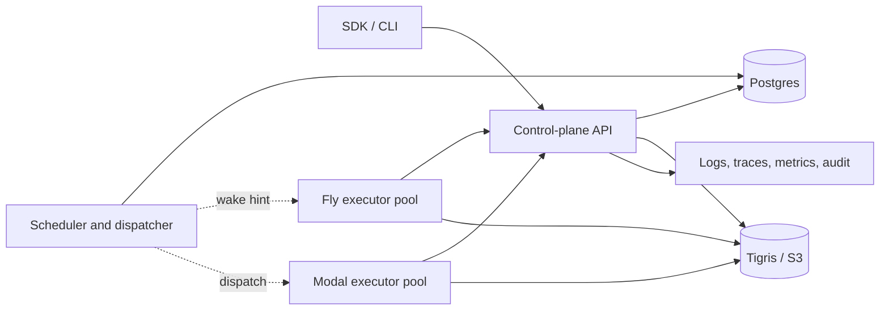

# BAML Durable Cloud Architecture

Status: proposed architecture for the first hosted and self-hosted control plane.

This document extends `durable-functions-design.md`. That document remains the
source of truth for the VM, snapshots, suspension, cancellation, futures, and
program compatibility. This document describes how a provider stores, schedules,
and executes those snapshots across machines.

## Decision

Build one logical control plane backed by Postgres. Run it as stateless replicas
on Fly.io. Postgres is authoritative for run ownership, lifecycle, timers,
commands, signals, child results, quotas, and billing records. Store small BAML
snapshots in Postgres so a state transition is atomic. Store immutable program
artifacts and large snapshots in S3-compatible object storage such as Tigris.

Executors pull runnable segments from the control plane. The first executor can
be a Fly worker process. A Modal adapter can provide elastic capacity using the
same protocol. Modal is a compute provider, not the durable state store.

This is deliberately closer to the Postgres model used by Absurd and the
self-hosted Vercel Workflow world than to a Temporal cluster. The important BAML
difference is that the database stores a complete continuation snapshot. BAML
does not need to reconstruct language state by replaying a growing step history.

Do not add Redis, Kafka, or a dedicated scheduler service in the first version.
Postgres can provide the queue, timer index, leases, and ordered event records in
the same transaction as run state. `LISTEN/NOTIFY` may reduce polling latency,
but it is only a hint; indexed polling remains the correctness path.

## Goals and invariants

The hosted service must provide:

- exactly one accepted writer for a run segment, even if multiple workers run;
- recovery from API, scheduler, worker, and machine failures;
- durable sleeps, signals, cancellation, and parent-child results;
- no worker or site affinity;
- immutable, content-addressed program versions;
- tenant isolation, quotas, auditability, and usage accounting;
- a protocol shared by hosted, self-hosted, Fly, and Modal deployments;
- fast warm resume without making an executor's RAM part of correctness.

The service does **not** promise exactly-once external effects. A lease prevents
two workers from committing run state, but it cannot undo an HTTP request made
by a worker that later loses its lease. External effects remain at-least-once
until the effect journal and idempotency-key design in
`durable-functions-design.md` is implemented.

## Topology



The API and scheduler can run in the same binary with different process-group
commands. Both are stateless. Running two or more scheduler replicas is safe
because queue claims and timer transitions are conditional database writes.

Executors never own durable state. They receive an attempt identity, a fencing
token, a program hash, and a snapshot reference. They emit heartbeats, VM events,
checkpoints, and a terminal result through an authenticated control-plane API.

## Storage split

### Postgres

Postgres holds data that participates in scheduling or a state transition:

- organizations, projects, environments, deployments, and credentials;
- runs, attempts, leases, priorities, queues, and desired commands;
- current snapshot bytes when the snapshot is below an inline threshold;
- timers, signals, ordered results, and child relationships;
- idempotency keys and transactional outbox rows;
- quotas, concurrency counters, usage records, and audit events;
- searchable run attributes and pointers to logs and large artifacts.

Current snapshots are hundreds of bytes, so putting them inline is the simplest
and strongest design. Start with a configurable 256 KiB inline limit. The limit
is operational rather than part of the snapshot format.

### Object storage

Object storage holds immutable bytes:

- compiled program artifacts addressed by program hash;
- snapshots larger than the inline threshold;
- large inputs, outputs, logs, and debugging bundles;
- optional retained checkpoint history.

For an external snapshot, upload the immutable object first, then commit its key
and checksum in the fenced Postgres transaction. A failed transaction can leave
an unreferenced object; a background garbage collector removes it after a grace
period. The reverse order could commit a pointer to bytes that do not exist and
must not be used.

Program and snapshot objects are encrypted, checksummed, and scoped by tenant.
Programs remain pinned while a live or retained run references them.

## Core data model

The concrete schema may evolve, but these ownership boundaries should remain.

```text
deployments
  id, environment_id, name, program_hash, runtime_build_id,
  snapshot_format_version, executor_requirements, created_at

runs
  id, environment_id, deployment_id, state, queue, priority,
  current_fence, current_attempt_id, lease_expires_at,
  wake_at, snapshot_inline, snapshot_object_key, snapshot_checksum,
  input_ref, output_ref, error, parent_run_id, parent_call_id,
  created_at, updated_at, completed_at

attempts
  id, run_id, fence, executor_kind, executor_id, provider_call_id,
  state, lease_expires_at, started_at, last_heartbeat_at, finished_at

run_events
  run_id, sequence, attempt_id, fence, kind, payload, created_at

signals
  run_id, signal_id, name, payload, received_at, consumed_at

remote_results
  parent_run_id, call_id, arrival_sequence, child_run_id,
  outcome, payload_ref, created_at

commands
  run_id, command_id, kind, payload, created_at, acknowledged_at

outbox
  id, topic, key, payload, available_at, claimed_until,
  attempts, delivered_at

usage_records
  id, organization_id, run_id, attempt_id, kind, quantity,
  provider_cost, occurred_at
```

Use database constraints for invariants that cannot be left to application code:

- unique start idempotency key within an environment;
- unique `(parent_run_id, parent_call_id)` child;
- unique `(run_id, sequence)` event;
- unique `(run_id, fence)` attempt generation;
- exactly one current attempt referenced by a run;
- at most one unconsumed signal with a caller-supplied signal id;
- monotonic result order allocated by the database, not wall-clock time.

Large append-only tables such as `run_events`, `audit_events`, and
`usage_records` should be time partitioned when volume justifies it. The first
schema can use ordinary tables and preserve the same keys.

## Run and attempt state machines

A run has these externally meaningful states:

```text
pending -> ready -> running -> suspended -> ready
                           \-> succeeded
                           \-> failed
                           \-> cancelled
                           \-> quarantined
```

An attempt is one execution of one run segment:

```text
created -> dispatched -> running -> committed
                    \-> expired
                    \-> abandoned
```

Retries create a new attempt and increment the fence. They do not mutate or
reuse the expired attempt. A suspended run has no executor and therefore costs
no compute while it waits.

## Claiming, leases, and fencing

Workers may pull directly from Postgres in a trusted self-hosted installation.
Hosted Fly and Modal workers should claim through an internal API so they never
receive database credentials.

The claim operation runs in one transaction:

1. Select an eligible `ready` run ordered by effective priority using
   `FOR UPDATE SKIP LOCKED`.
2. Check tenant, queue, deployment, and resource concurrency limits.
3. Increment `runs.current_fence`.
4. Create an attempt with that fence and a short lease.
5. Set the run to `running` and reference the attempt.
6. Write the attempt event and any dispatch outbox record.

Every heartbeat, VM event, checkpoint, suspension, and terminal result includes
`run_id`, `attempt_id`, and `fence`. The update succeeds only while all three
match the run's current attempt. A worker with an expired fence may finish local
work, but it cannot alter the run.

Lease expiry returns the run to `ready` from its last committed snapshot and
creates a new fence on the next claim. Heartbeats extend the lease only up to a
bounded interval. Workers stop starting new external effects when they can no
longer renew comfortably before expiry.

This gives one accepted writer. It deliberately permits duplicate computation,
because avoiding duplicate execution during partitions would sacrifice recovery.

## Atomic checkpoint protocol

The executor sends a checkpoint request containing:

- attempt identity and fence;
- snapshot bytes or an already uploaded immutable object reference;
- expected prior snapshot checksum;
- VM events since the prior checkpoint;
- requested next state: `running`, `suspended`, or terminal;
- timer, child, result, usage, and command acknowledgements caused by the segment.

The control plane validates the program and snapshot metadata, then commits the
snapshot pointer, run state, events, timer rows, child results, usage records,
and outbox rows in one Postgres transaction. A retry with the same checkpoint id
returns the prior result. This transaction boundary is the center of the design.

Using Postgres for every subsystem is useful only if related writes are atomic.
Queueing an event in one transaction and updating the run in another can wedge a
run even though both records live in Postgres.

## Timers, signals, and child runs

### Timers

A suspended sleep stores `wake_at` on the run and in an indexed timer table or
partial index. Any scheduler replica claims due rows with `SKIP LOCKED`, changes
them to `ready`, and emits an outbox wake hint in the same transaction. If every
scheduler is down at the deadline, the row remains due and is picked up later.

### Signals

Signals are stored before delivery. A signal with a caller-provided idempotency
key is inserted once. If the run is suspended waiting for that signal, the same
transaction marks it ready. If the signal arrives first, it waits in the store,
which removes the subscribe-versus-deliver race.

### Remote child calls

Spawning a child inserts the child run and unique
`(parent_run_id, parent_call_id)` relation in one transaction. Completion inserts
a durable result with a database-assigned arrival sequence and wakes a suspended
parent. There are no direct site callbacks, location records, or `migrated_to`
chains. Any executor can resume the parent from the new snapshot and ordered
results.

### Cancellation

Cancellation writes desired state and a command durably. A running worker sees
it on its heartbeat response or command poll. If the worker disappears, lease
expiry lets a new attempt load the snapshot and apply cancellation. Cancellation
is idempotent and propagates to children according to the policy stored on their
relationship.

## Executor protocol

Keep the executor interface smaller than either Fly or Modal:

```text
claim(capabilities, available_slots) -> Attempt | none
heartbeat(attempt, fence, progress, usage) -> commands + lease
emit_events(attempt, fence, ordered_events)
checkpoint(attempt, fence, snapshot, transition) -> accepted | stale
complete(attempt, fence, result) -> accepted | stale
fail(attempt, fence, error, retry_class) -> accepted | stale
```

An attempt token is short lived, scoped to one attempt, and authorizes only
these calls and the referenced object keys. It contains no tenant API key or
database credential. The executor reports a capability set including runtime
build, snapshot format, architecture, resource class, and optional accelerator.
The scheduler dispatches only compatible deployments.

The worker wrapper starts the BAML worker process, forwards structured stdout
events, feeds commands to stdin, and commits its final transition. The existing
CLI protocol can be adapted rather than replaced.

## Fly executor

The Fly executor is the lowest-risk first implementation:

- run it as a process group with no public service;
- have it long-poll `claim` and advertise a fixed number of slots;
- keep a small number of machines running for predictable latency;
- scale additional machines from queue depth and oldest-ready age;
- drain by stopping claims, finishing or checkpointing active attempts, then
  exiting before deployment.

Fly Proxy autostop is not the ownership mechanism for workers. Workers without a
service manage their own lifecycle, and the lease protocol remains valid whether
a process exits cleanly or is killed.

## Modal executor

Modal is a useful elastic executor behind the same contract. The dispatcher
submits a small invocation containing the attempt URL/token and immutable input
references. The invocation downloads the exact program and snapshot, runs one
segment, and commits through the control plane.

Recommended initial settings:

- `min_containers=1` for the hot path;
- `buffer_containers=1` to absorb a small burst;
- a several-minute `scaledown_window`;
- one BAML segment at a time per container until isolation and memory behavior
  are measured;
- a bounded `max_containers` tied to provider and tenant quotas;
- no BAML profiler in production workers unless explicitly sampled.

Record Modal's FunctionCall id for cancellation and diagnostics. Do not use a
FunctionCall result as the source of truth. The fenced control-plane commit is
the result, including when Modal retries a crashed container or a dispatcher
submits the same work twice.

Modal has a maximum function execution duration, so a segment must checkpoint
well before that limit. Long sleeps and event waits already self-suspend. Add a
segment budget so CPU-bound or repeatedly active code checkpoints before the
provider deadline.

Modal function memory snapshots can be an optimization for loading the wrapper,
runtime, and common dependencies. Modal Sandbox snapshots have provider-specific
constraints and expiry and must not represent durable BAML state. The portable
BAML snapshot in Postgres or object storage remains authoritative.

## Resume latency

The measured 23 ms release resume is not snapshot restoration. Snapshot decode
and VM restoration are about 0.1 ms; most observed time comes from process and
program initialization, including profiling. Disabling profiling reduced the
measured optimized program load substantially, but a fresh process still cannot
compete with a resident Firecracker VM snapshot.

The architectural fix is a resident executor with a prepared-program cache:

1. Split immutable `PreparedProgram` state from per-run VM state.
2. Cache prepared programs by `(program_hash, runtime_build_id)` in each warm
   executor.
3. Create a fresh per-run engine from the cached program.
4. Decode and restore the continuation snapshot.
5. Evict with a bounded memory LRU and retain reference counts for active runs.

The warm target should be under 1 ms inside an already running worker. Provider
dispatch, network, queue, and cold-container latency are separate metrics. A
Firecracker resume comparison is therefore useful for cold compute placement,
but it is not the relevant lower bound for BAML VM restoration.

Expose at least these histograms independently:

- ready-to-claim queue latency;
- dispatch-to-container-start latency;
- program fetch and verification;
- prepared-program cache hit and load time;
- snapshot fetch, decode, and restore time;
- first-instruction and checkpoint commit latency.

## Provider control plane

A hosted BAML service needs more than the workflow state machine.

### Tenancy and identity

Use the hierarchy organization -> project -> environment. Scope every run,
deployment, object key, secret, quota, and usage record to an environment and
organization. Support user sessions, service accounts, API keys with explicit
scopes, role-based access, and immutable audit events. Enforce tenant predicates
in the application and test them as security boundaries; optional Postgres row
security can be defense in depth.

### Deployments and compatibility

A deployment is immutable and binds a program hash to a runtime build, snapshot
format, executor requirements, and user-visible name. An environment alias can
move to a new deployment for new starts. Existing runs stay pinned to the old
deployment until completion or an explicit compatible migration. Draining an
executor version stops new claims but keeps artifacts available for pinned runs.

### Secrets and network policy

Store secret bindings encrypted with per-tenant envelope keys. Resolve them into
short-lived attempt credentials or a controlled effect proxy. Never serialize
raw platform credentials into a snapshot. Resource classes define CPU, memory,
accelerator, region, network egress policy, and permitted integrations.

### Scheduling and noisy neighbors

Queues carry priority, resource class, region preference, and per-tenant
concurrency. Admission control enforces active-run, queued-run, storage, API,
and spend limits before accepting unbounded work. Scheduling should combine
priority with age and weighted tenant fairness so one organization cannot consume
the pool. Queue depth and oldest-ready age drive autoscaling.

### Usage and billing

Write an append-only usage record close to the state transition it measures.
Meter segment wall and CPU time, resource class, Modal or Fly cost, snapshot and
artifact storage, log volume, egress, and proxied model/tool usage. Aggregate
outside the critical transaction, but preserve raw records for reconciliation.

### Observability and operations

Provide a durable run timeline, structured logs, traces, metrics, indexed search
attributes, attempt history, and clear stale-fence diagnostics. Operators need
retry, cancel, suspend, resume, quarantine, fork-from-checkpoint, export, and
redacted support-bundle tools. Poisoned runs move to quarantine after a bounded
policy rather than retrying forever.

Define retention separately for terminal run metadata, snapshots, programs,
events, logs, and audit records. Garbage collection must use database references
and grace periods. Support tenant deletion and export without deleting artifacts
still referenced by another retained deployment.

### Reliability

Publish SLOs for API availability, schedule delay, resume latency, and state
durability. Exercise database restoration, object-store reconciliation, rolling
runtime upgrades, expired leases, duplicate dispatch, and regional loss. Schema
migrations must be backward compatible with both the prior API replicas and
workers already running attempts.

## Public API

The first stable surface should cover:

```text
deploy(program) -> deployment
start(deployment, input, idempotency_key) -> run
get(run) -> state + current result
list(filters, cursor) -> runs
cancel(run, idempotency_key)
signal(run, name, payload, idempotency_key)
events(run, after_sequence) -> stream/page
fork(run, checkpoint, optional deployment) -> run
```

Every mutating request accepts an idempotency key. SDK polling and event streams
are conveniences over persisted state, so disconnecting a client never affects
execution.

## Fly.io deployment

Use one Fly app image with process groups:

```text
api         public HTTPS API and executor callbacks
scheduler   timer sweep, lease recovery, dispatch, outbox delivery
executor    optional trusted Fly worker pool, no public service
```

Run at least two API machines and at least one always-on scheduler in the primary
region. Use Fly Managed Postgres with high availability and connection pooling.
Use Tigris for S3-compatible artifacts. Keep initial writes in one region; route
all mutations for an environment to its home region. Global API replicas may
serve cached or replica-safe reads, but they must not invent multi-writer run
ownership.

Multi-region execution can still be added: an executor in another region claims
through the home control plane and downloads immutable objects locally. Later,
large tenants can be assigned to database shards or home regions without changing
the executor protocol.

## Self-hosted deployment

Ship a Docker Compose topology using the same binaries and schema:

- Postgres;
- control-plane API plus scheduler;
- one local executor;
- optional MinIO for artifacts, with inline development storage for small demos.

The self-hosted default can allow trusted executors to claim directly from
Postgres, but the HTTP executor protocol should remain available. Avoid features
that require Fly or Modal so the managed product and open deployment share the
same correctness model.

## Failure behavior

| Failure | Expected behavior |
| --- | --- |
| API replica dies | Client or worker retries an idempotent request against another replica. |
| Scheduler dies | Due timers and outbox rows remain queryable; another replica claims them. |
| Worker dies | Lease expires; a new attempt restores the last committed snapshot with a new fence. |
| Old worker returns | Its checkpoint is rejected as stale. |
| Dispatch is duplicated | At most one current fence can commit; extra compute is discarded. |
| Modal retries an invocation | The invocation observes the same attempt or a stale fence and cannot double-commit. |
| Postgres is unavailable | No ownership or checkpoint changes are accepted; workers stop new effects before lease expiry. |
| Object upload succeeds, DB commit fails | Object is unreferenced and later garbage-collected. |
| Child finishes while parent is offline | Result is stored and parent becomes ready without a callback to a site. |
| External effect succeeds before checkpoint | It may run again after recovery unless protected by an idempotency key or effect journal. |

## Delivery plan

### Phase 0: central correctness

- Add the Postgres schema, migrations, and transactional repository.
- Replace local run discovery, peer routing, migration chains, timers, and direct
  child callbacks with runs, leases, timers, signals, and durable results.
- Keep the current CLI worker and add the fenced executor API.
- Store snapshots inline and programs in an S3-compatible store.
- Run API, scheduler, and one Fly executor locally through Docker Compose.

This phase is complete when two schedulers and two workers can race safely, a
worker can be killed at every transition, and all accepted runs recover from the
latest committed snapshot.

### Phase 1: hosted product

- Add organization/project/environment identity, service accounts, API keys,
  deployments, quotas, audit events, usage records, retention, and operator APIs.
- Deploy the control plane on Fly Managed Postgres and Tigris.
- Add dashboards and alerts for queue age, lease churn, stale commits, timer lag,
  database saturation, and artifact failures.

### Phase 2: elastic execution and latency

- Add the Modal executor adapter and warm-pool policy.
- Split `PreparedProgram` from per-run state and add the program cache.
- Benchmark warm resume, cold Modal start, Fly start, checkpoint throughput, and
  database contention independently.
- Autoscale from queue depth and oldest-ready age with provider and tenant caps.

### Phase 3: effects and scale

- Implement durable effect ids, idempotency propagation, and the bounded effect
  journal or effect proxy.
- Add database partitioning and tenant placement when measured load requires it.
- Add home-region assignment and disaster-recovery promotion before promising
  multi-region control-plane availability.

## Open decisions to validate with prototypes

1. Whether the hosted executor API long-polls for claims or the dispatcher calls
   provider adapters. Support both semantics internally; benchmark operational
   cost before exposing either.
2. The inline snapshot threshold and Postgres write amplification under frequent
   checkpoints.
3. Lease duration and heartbeat frequency for Fly and Modal network behavior.
4. Whether logs flow through the control plane or upload directly with scoped
   object credentials.
5. Whether first-party model/tool calls should go through an effect proxy for
   idempotency, policy, secrets, and unified billing.
6. The initial isolation boundary: process per segment, long-lived worker daemon,
   or a sandbox per tenant. Warm latency work must not weaken tenant isolation.

## Research notes

- [Absurd Workflows](https://lucumr.pocoo.org/2025/11/3/absurd-workflows/)
  demonstrates the useful minimum: a Postgres queue using `SKIP LOCKED`, stored
  checkpoints, events, and sleeps. Its checkpoints support replay of application
  steps; BAML's continuation snapshot can replace that replay history while
  retaining the same queue and state-store shape.
- [Vercel Workflow](https://github.com/vercel/workflow) exposes a pluggable
  storage/runtime abstraction called a World and documents a Postgres backend
  for self-hosting. This supports keeping BAML's executor contract independent of
  Fly and Modal. Its Postgres implementation uses Graphile Worker. A reported
  [partial-write failure](https://github.com/vercel/workflow/issues/3081) is a
  useful warning: putting the entity row and event log in one database is not
  enough when the writes use different transactions. BAML's run transition,
  event, queue/outbox row, and checkpoint reference must commit together.
- [Fly Managed Postgres](https://www.fly.io/docs/mpg/) provides the database
  building blocks, and [Tigris](https://fly.io/docs/tigris/) provides
  S3-compatible artifact storage colocated with a Fly deployment.
- [Modal scaling](https://modal.com/docs/guide/scale) exposes warm-container and
  concurrency controls. [Modal timeouts](https://modal.com/docs/guide/timeouts)
  require bounded execution segments. [Modal FunctionCall](https://modal.com/docs/sdk/py/latest/FunctionCall)
  is useful for cancellation and diagnostics but does not replace a fenced
  durable commit. [Modal Sandbox snapshots](https://modal.com/docs/guide/sandbox-snapshots)
  are an optional cold-start optimization with provider-specific lifecycle
  constraints, not a durable workflow store.
