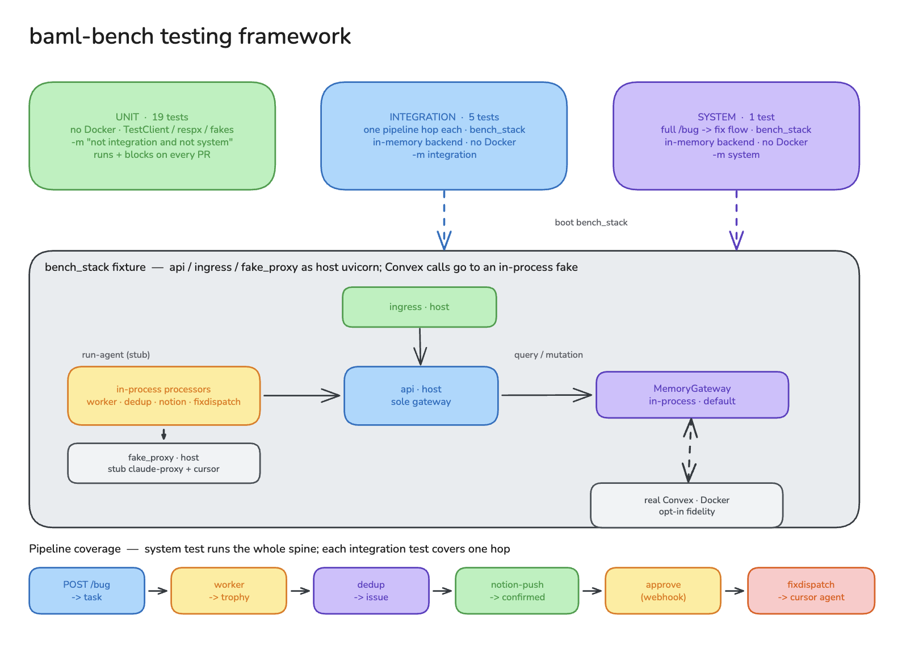

# Testing

agent-tries-baml has three test tiers. By default every tier runs against an
**in-process fake Convex** (`MemoryGateway`), so the whole suite is Docker-free
and finishes in a couple of seconds.



## Tiers

Tests are selected by pytest marker (unmarked == unit).

| Tier | Selector | What it proves | Needs |
|------|----------|----------------|-------|
| **unit** | `-m "not integration and not system"` | pure logic: routing, parsing, client error handling, the claim loop, health | nothing |
| **integration** | `-m integration` | each pipeline *hop* in isolation through the real claim loops | the stack fixture |
| **system** | `-m system` | the *entire* `/bug` → fix flow end to end | the stack fixture |

### unit
Pure-logic tests using FastAPI `TestClient`, `respx`, and in-memory fakes — no
network, no stack:

- `test_health.py` — `/healthz` on api/ingress/claude_proxy
- `test_proxy_parsing.py` — transcript/turn-log parsing, path-traversal guard
- `test_cursor_client.py` — Cursor launch + 409 idempotency (respx-mocked)
- `test_ingress_routing.py` — Slack signature + mention-strip, Notion page-id
  precedence, UUID toggle (in-memory `FakeService`)
- `test_processor_claim.py` — the `Processor` claim loop: claim-until-empty, one
  `process()` per item, and the on-exception "fail on the claim field" path

### integration / system (the `bench_stack` fixture)
`tests/conftest.py:bench_stack` (session-scoped) boots **api / ingress /
fake_proxy** as host `uvicorn` subprocesses and yields their URLs. The tests then
drive the real processors (`BamlWorker`, `BamlDedup`, `NotionPush`,
`FixDispatch`) in-process against that live api. `tests/fake_proxy.py` stubs the
Claude agent run and the Cursor endpoint, so there is no `ANTHROPIC_API_KEY`, no
network, and the runs are deterministic.

Everything is real except the LLM / SaaS calls: HTTP routing, bearer auth, claim
leases, blob writes, ingress webhooks, and processor wiring.

- `test_integration_hops.py` — one focused test per hop (worker → trophy, dedup →
  issue, ingress `/bug` → task, signed `/slack` → task + bad-sig 401, approve
  webhook → FixDispatch → cursor)
- `test_system_pipeline.py` — one test from `POST /bug` through worker → dedup →
  notion-push → approve (`/notion/webhook`) → FixDispatch
- `tests/pipeline_steps.py` — shared per-hop step helpers, so the per-hop and
  full-flow tests reuse identical assertions

## Backends: in-memory (default) vs real Convex

The api talks to Convex through a gateway selected by `gateway_from_env()`:

- **`CONVEX_BACKEND=memory` (default in tests)** — `services/api/memory_gateway.py`,
  a table-agnostic in-memory implementation of the gateway interface that
  reproduces the `convex/lib.ts` claimable-queue semantics (oldest-first claim
  with lease stamping and attempts, newest-first list, `stripNulls`, timestamps,
  `_creationTime`, `countClaimable`). No Convex deployment, no Docker.
- **`BAML_BENCH_REAL_CONVEX=1`** — boots the real Convex backend in a container
  (mint an admin key, push schema/functions via `npm ci` + `npx convex dev`),
  for fidelity against the actual backend. Needs Docker + Node; self-skips when
  Docker is absent unless `BAML_BENCH_REQUIRE_DOCKER=1` (which makes it fail
  loudly instead).

The same integration + system tests pass against both backends — that parity is
what validates the fake. CI keeps a real-Convex job so the `MemoryGateway` can't
silently drift (the fake itself does not exercise `convex/lib.ts`).

## Running locally

```sh
make test-unit          # fast, no Docker
make test-integration   # per-hop (memory backend)
make test-system        # full flow (memory backend)
make test-stack         # integration + system together
make test               # the whole suite
make test-real          # integration + system vs real Convex (Docker + Node)
```

Each target wraps `uv run --extra dev pytest ...`.

## CI

`.github/workflows/agent-tries-baml.yml`:

- **`tests`** — runs the whole suite (in-memory backend, no Docker, no secrets)
  and **blocks** on every PR that touches `tools/agent-tries-baml`, plus canary and
  manual dispatch. ~2s.
- **`real-convex`** — re-runs the integration + system tiers against the real
  Convex backend on canary push and manual dispatch only, as a fidelity check,
  off the PR critical path.
